# SEO, Performance, React, Next.js and Production Readiness Plan

## Current state (summary)

- **Stack:** Next.js 16, React 19, TypeScript, Drizzle, Better Auth. App Router with many client-heavy pages (e.g. dashboard with `ssr: false`).
- **Strengths:** Root [layout.tsx](src/app/layout.tsx) has solid metadata (title template, OG/Twitter, robots, viewport), `next/font` (Inter, Outfit), skip link, WebVitals; [sitemap.ts](src/app/sitemap.ts) and [robots.ts](src/app/robots.ts) exist; [next.config.mjs](next.config.mjs) uses `optimizePackageImports` and image formats (AVIF/WebP); `next/image` used in key screens; `next/dynamic` used for heavy routes; many data fetches use `Promise.all`; OG image API at `/api/og` (Edge).
- **Gaps:** No middleware or `global-error.tsx`; root [loading.tsx](src/app/loading.tsx) and [not-found.tsx](src/app/not-found.tsx) are client components (framer-motion); barrel imports (`@/components/Gamification`, `@/components/Dashboard`, `@/components/Profile`); dashboard and other pages fetch data in client after session (waterfalls); no `generateMetadata` for dynamic routes; analytics (WebVitals) not deferred post-hydration; reduced-motion hook exists but not consistently applied to all motion.

---

## 1. SEO

- **Metadata and templates**
  - Keep root [metadata](src/app/layout.tsx) and title template; ensure every public route has appropriate `metadata` or inherits (already in place for many pages).
  - Add **dynamic `generateMetadata`** for any dynamic route segments that render shareable content (e.g. if you add `/lessons/[slug]` or `/past-papers/[id]`) so OG title/description/images are per-page. Use `React.cache()` where the same data is needed for both metadata and page body (per [metadata.md](C:\Users\Themba.agents\skills\next-best-practices\metadata.md)).
- **Structured data**
  - Add **JSON-LD** (Organization and/or WebApplication) in root layout or a dedicated component for the homepage to improve search results (name, description, url, sameAs if you have social links).
- **Sitemap and robots**
  - [sitemap.ts](src/app/sitemap.ts) and [robots.ts](src/app/robots.ts) are in good shape. Optionally extend sitemap with more sections (e.g. `/physics`, `/study-path`, `/ai-tutor`) if they are public and indexable; keep auth and API routes disallowed (already done in robots).
- **Canonical and alternates**
  - Root layout already sets `metadataBase` and `alternates.canonical: '/'`. For other key pages, set `alternates.canonical` to the full URL (e.g. `${baseUrl}/dashboard`) where it makes sense to avoid duplicate URLs (e.g. with query params).
- **Core Web Vitals and SEO**
  - Ensure LCP images use `priority` where they are above the fold (e.g. [Landing.tsx](src/screens/Landing.tsx) hero image). Verify `next/image` `sizes` on key pages for responsive images. Keep WebVitals reporting; defer analytics after hydration (see Performance).

---

## 2. Performance

- **Eliminate waterfalls (critical – Vercel async- rules)**
  - **Dashboard (and similar screens):** [Dashboard.tsx](src/screens/Dashboard.tsx) is client-only and fetches after `useSession()`, causing a request waterfall. Prefer:
    - Server Component page that fetches session (e.g. via auth) and data in parallel (e.g. `Promise.all` or parallel server components), then passes data to client components for interactivity; or
    - Server Component that fetches and passes initial data; client only for subsequent mutations/real-time.
  - **API routes:** Review [route handlers](src/app/api) for sequential `await`s; start promises early and await late, or use `Promise.all` for independent work (per `async-api-routes`).
  - Use **Suspense** boundaries where appropriate so slow data does not block the whole page (e.g. wrap heavy sections in `<Suspense fallback={...}>` and fetch inside).
- **Bundle size (Vercel bundle- rules)**
  - **Barrel imports:** Replace imports from `@/components/Gamification`, `@/components/Dashboard`, `@/components/Profile` with **direct file imports** (e.g. `@/components/Gamification/XpHeader`, `@/components/Dashboard/DailyGoals`) to avoid pulling unused code (per `bundle-barrel-imports`).
  - **Heavy client modules:** Keep using `next/dynamic` for heavy screens (quiz, PdfViewer, etc.); ensure `loading` fallbacks are lightweight. Consider deferring **analytics** (e.g. WebVitals POST to `/api/analytics/web-vitals`) until after hydration (e.g. `requestIdleCallback` or short delay) so they do not compete with initial paint (`bundle-defer-third-party`).
- **Server-side**
  - Use **React.cache()** for per-request deduplication of data fetches used in multiple Server Components or in both metadata and body (per next-best-practices metadata and Vercel `server-cache-react`).
  - Minimize data passed to client components (only serializable props; avoid passing large or redundant data).
- **Loading and streaming**
  - Prefer a **server-renderable** root [loading.tsx](src/app/loading.tsx) (e.g. simple spinner/skeleton without `'use client'` and framer-motion) so the shell appears faster. Use client-only loading UIs only where needed (e.g. route-level loading that uses motion).
  - Add route-level `loading.tsx` for heavy routes (e.g. dashboard, past-paper, ai-tutor) with light skeletons so navigation feels instant.
- **Images**
  - Keep using `next/image` everywhere (no raw `` in app code). Add `priority` for LCP images (e.g. hero on landing); set `sizes` on responsive images. Remote patterns are already configured in [next.config.mjs](next.config.mjs).

---

## 3. React best practices

- **Run react-doctor**
  - Run `npx -y react-doctor@latest . --verbose` and fix reported issues by severity (security, state/effects, architecture, performance, correctness, Next.js, bundle, server, a11y, dead code). This will catch hardcoded secrets, derived state in useEffect, missing cleanup, barrel imports, missing metadata on pages, and more.
- **Re-renders and correctness (Vercel rerender-_, rendering-_)**
  - Use `memo` for expensive list items or heavy children; use functional `setState` where the next state depends on the previous; avoid subscribing to broad state when only a derived boolean is needed; use `startTransition` for non-urgent updates where applicable.
  - Prefer ternary over `&&` for conditional rendering to avoid falsy-value bugs; keep static JSX outside components where it never changes.
- **Accessibility**
  - [use-reduced-motion](src/hooks/use-reduced-motion.ts) exists; ensure **all** framer-motion (and any CSS animations) respect it (e.g. pass `getMotionTransition(reducedMotion)` or disable animations when `prefersReducedMotion` is true) so the app meets react-doctor a11y rules and WCAG.
- **Client boundary**
  - Keep `'use client'` only where needed (hooks, event handlers, browser APIs). Prefer Server Components for pages that only need to fetch and render data; move client logic into leaf components.

---

## 4. Next.js conventions and resilience

- **Error and not-found**
  - Add **global-error.tsx** at app root (required for catching errors in root layout; must include its own `<html>` and `<body>`). Keep existing [error.tsx](src/app/error.tsx) for segment-level errors.
  - Consider making [not-found.tsx](src/app/not-found.tsx) a Server Component with minimal client islands (e.g. only buttons as client) so the 404 shell is fast; optional.
- **Async APIs (Next 15+)**
  - If any page or `generateMetadata` receives `params` or `searchParams`, use the **async** form: `params: Promise<{...}>`, `await params` (per next-best-practices async-patterns). [comments/page.tsx](src/app/comments/page.tsx) uses searchParams on the client; if you add server-driven metadata for that route, use async searchParams in the server part.
- **Middleware (optional)**
  - Add **middleware.ts** at project root if you need auth redirects (e.g. protect `/dashboard`, `/settings`) or security headers (see Production). Next 16 may use a different name (e.g. proxy); confirm with current Next docs.
- **Route-level loading and error**
  - Ensure important segments have `loading.tsx` and `error.tsx` where beneficial so errors and loading states are scoped and the app feels responsive.

---

## 5. Production readiness

- **Environment and config**
  - Validate required env vars at build or startup (e.g. `NEXT_PUBLIC_APP_URL`, DB, auth secrets). Document them in README or `.env.example` (without values).
  - Consider `output: 'standalone'` in [next.config.mjs](next.config.mjs) if you deploy with Docker or a single-node image (per next-best-practices self-hosting).
- **Security**
  - **Headers:** Add security headers (e.g. via middleware or next.config `headers()`): X-Frame-Options, X-Content-Type-Options, Referrer-Policy, Permissions-Policy; consider Content-Security-Policy with careful tuning.
  - **Auth and API:** Ensure server actions and API routes that modify data check session/authorization; no secrets in client bundle (react-doctor will flag).
  - **Input validation:** Validate and sanitize all API and server action inputs (Zod is already used; ensure coverage on routes and actions).
- **Monitoring and errors**
  - Keep WebVitals and consider error tracking (e.g. report unhandled errors and `error.digest` to your backend or a third party) so production issues are visible.
- **PWA and manifest**
  - [public/manifest.json](public/manifest.json) is configured; ensure `/manifest.json` is served and linked (already in root layout). Verify icons and theme_color for installability.

---

## 6. Execution order (recommended)

```mermaid
flowchart LR
  subgraph phase1 [Phase 1 - Quick wins]
    A[Run react-doctor and fix critical issues]
    B[Replace barrel imports with direct imports]
    C[Defer WebVitals analytics post-hydration]
    D[Add global-error.tsx]
  end
  subgraph phase2 [Phase 2 - Data and loading]
    E[Refactor dashboard data to server/parallel]
    F[Server-renderable root loading.tsx]
    G[Route-level loading for heavy routes]
  end
  subgraph phase3 [Phase 3 - SEO and polish]
    H[Add JSON-LD and canonical where needed]
    I[generateMetadata for dynamic routes when added]
    J[LCP priority and sizes on key images]
  end
  subgraph phase4 [Phase 4 - Production]
    K[Env validation and security headers]
    L[Error reporting and optional middleware]
  end
  phase1 --> phase2 --> phase3 --> phase4
```

- **Phase 1:** Run react-doctor, fix barrel imports, defer analytics, add global-error.
- **Phase 2:** Move dashboard (and similar) data to server/parallel; simplify root loading; add route-level loading.
- **Phase 3:** JSON-LD, dynamic metadata for new dynamic routes, image priority/sizes.
- **Phase 4:** Env validation, security headers, error reporting, optional middleware.

---

## Skills and references used

- **next-best-practices:** File conventions, RSC boundaries, async params/searchParams, metadata, error handling, image/font, bundling.
- **vercel-react-best-practices:** Async waterfalls, bundle (barrel, dynamic, defer third-party), server cache and serialization, re-render and rendering rules.
- **react-doctor:** Single command audit for security, performance, correctness, Next.js, a11y, dead code; target score 75+.
- **code-review-pro:** Security, performance, and best-practice checklist for production readiness.

No code changes were made; this plan is ready for implementation step-by-step.
