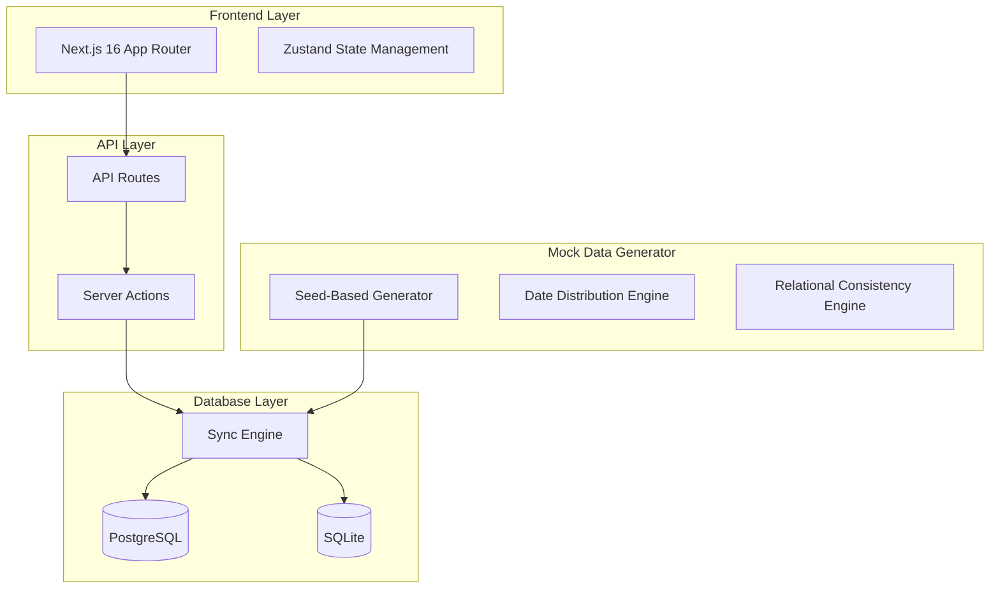
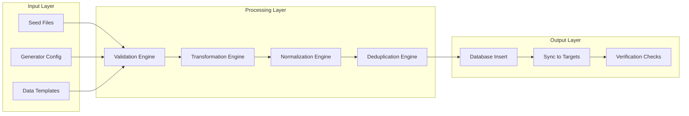
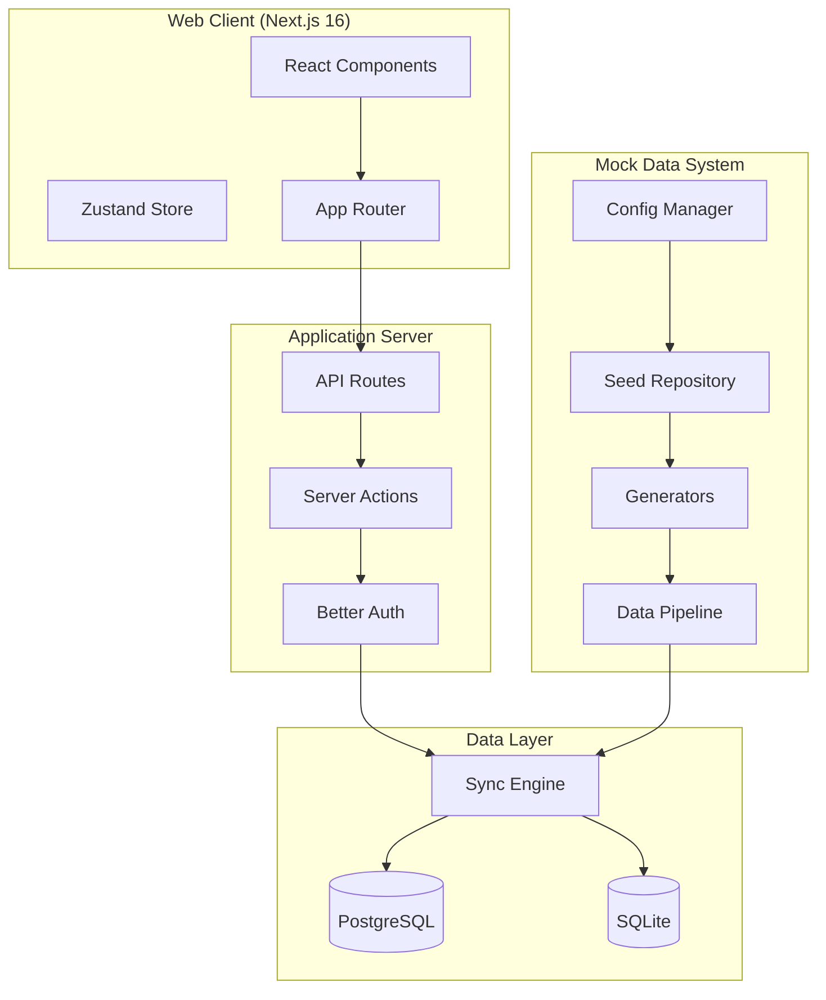
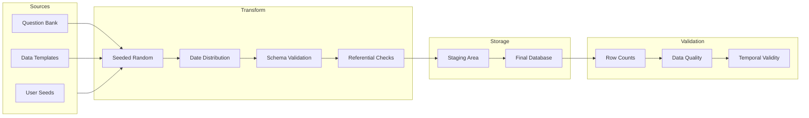
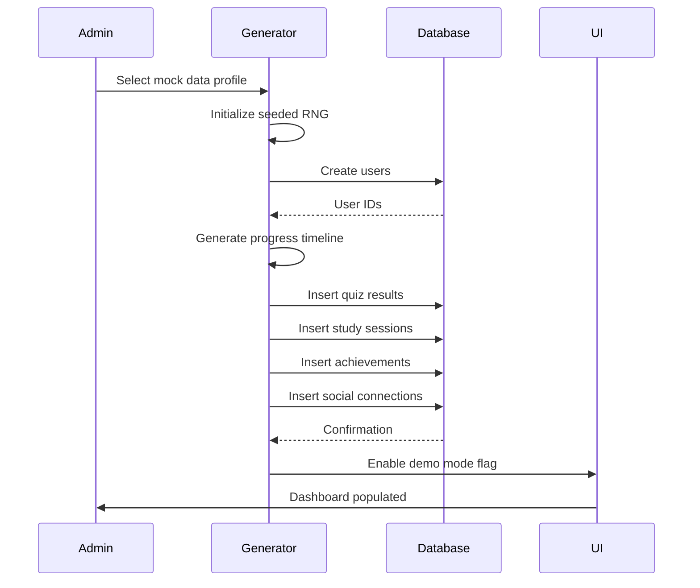
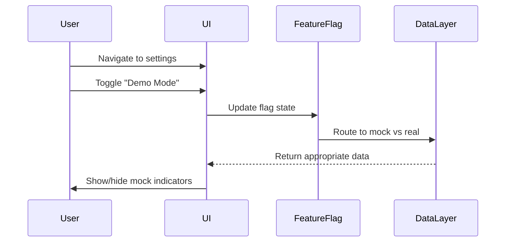

# Enrichment Plan: Production-Grade Mock Data Generator for MatricMaster AI

## Executive Summary

This plan outlines the creation of a robust mock data generation system that will transform the MatricMaster AI application to appear as if it has been actively used for months by real South African NSC Grade 12 students. The deliverable includes a comprehensive mock data generator, enriched data pipeline, updated UI visualizations, and architecture documentation. The system must maintain all existing functionality while presenting a realistic, data-rich demo environment suitable for stakeholder presentations, investor demonstrations, and user onboarding scenarios.

## 1. Objective and Overview

### 1.1 Primary Goal

The objective is to create a fully functional, self-contained mock data ecosystem that transforms the MatricMaster AI prototype from a fresh installation state into a vibrant, actively-used educational platform with months of accumulated user activity, learning progress, achievements, social interactions, and analytics history.

### 1.2 Success Criteria

The enriched prototype must satisfy the following conditions:

- **Data Richness Score**: Minimum 85% of database tables contain non-empty records with realistic temporal distributions spanning 3-6 months of activity
- **Visual Authenticity**: Dashboard metrics, progress indicators, and analytics charts display realistic patterns consistent with actual student behavior
- **Functional Integrity**: All existing features work identically with mock data as with real data; no regressions introduced
- **Reproducibility**: Same seed produces identical data across environments; different seeds produce sufficiently different datasets
- **Demo Readiness**: Application is immediately usable for presentations without requiring manual setup

### 1.3 Scope Boundaries

**In Scope:**
- Complete mock data generation for all database entities
- Temporal data distribution to simulate 3-6 months of activity
- Seeded random generation with reproducibility guarantees
- Feature flag system for toggling mock data in live environment
- Updated UI components for enhanced visualizations
- Documentation and handoff materials

**Out of Scope:**
- Real user data migration or integration
- Production deployment configuration
- Real-time data sync with external systems
- Legal compliance audits (guidance provided only)

---

## 2. Architecture and System Design

### 2.1 High-Level Architecture



### 2.2 Data Architecture

#### Entity Relationships Overview

```mermaid
erDiagram
    USERS ||--o{ QUIZ_RESULTS : "completed"
    USERS ||--o{ USER_PROGRESS : "maintains"
    USERS ||--o{ STUDY_SESSIONS : "conducts"
    USERS ||--o{ FLASHCARD_DECKS : "creates"
    USERS ||--o{ TOPIC_MASTERY : "achieves"
    USERS ||--o{ ACHIEVEMENTS : "unlocks"
    USERS ||--o{ STUDY_BUDDIES : "has"
    USERS ||--o{ CHANNELS : "joins"
    USERS ||--o{ AI_CONVERSATIONS : "initiates"
    USERS ||--o{ NOTIFICATIONS : "receives"
    USERS ||--o{ CALENDAR_EVENTS : "schedules"
    USERS ||--o{ UNIVERSITY_TARGETS : "sets"
    USERS ||--o{ APS_SCORES : "tracks"
    USERS ||--o{ MILESTONES : "completes"
    
    SUBJECTS ||--o{ QUESTIONS : "contains"
    SUBJECTS ||--o{ PAST_PAPERS : "has"
    SUBJECTS ||--o{ TOPIC_WEIGHTAGES : "defines"
    
    QUESTIONS ||--o{ OPTIONS : "has"
    QUESTIONS ||--o{ QUESTION_ATTEMPTS : "attempted_in"
    
    FLASHCARD_DECKS ||--o{ FLASHCARDS : "contains"
    FLASHCARDS ||--o{ FLASHCARD_REVIEWS : "reviewed_in"
    
    PAST_PAPERS ||--o{ PAST_PAPER_QUESTIONS : "contains"
    
    CHANNELS ||--o{ CHANNEL_MEMBERS : "has"
    STUDY_BUDDIES ||--o{ STUDY_BUDDY_PROFILES : "maintains"
    
    UNIVERSITY_TARGETS ||--o{ MILESTONES : "includes"
```



#### Data Lineage Strategy

| Data Category | Source Type | Transformation Rules |
|--------------|-------------|---------------------|
| Users | Generated | Realistic SA names, emails, profile photos |
| Questions | Seed Data | Retained from existing seed files |
| Quiz Results | Generated | Weighted distribution: 60% pass, 40% fail |
| Study Sessions | Generated | Peak hours: 16:00-21:00 weekdays, 09:00-17:00 weekends |
| Achievements | Generated | Time-locked unlocks based on user progression |
| Social | Generated | Buddy requests, channel messages with realistic timestamps |
| Calendar | Generated | Exam dates, study sessions, reminders |
| Analytics | Derived | Computed from user activity patterns |

### 2.3 Mock Data Generator Design

#### Core Components

```typescript
interface MockDataConfig {
  seed: number;
  userCount: number;
  simulationMonths: number;
  activityIntensity: 'low' | 'medium' | 'high';
  relationalConsistency: boolean;
  exportFormat: 'json' | 'csv' | 'database';
}

interface GeneratorRegistry {
  users: UserGenerator;
  questions: QuestionGenerator;
  quizResults: QuizResultGenerator;
  progress: ProgressGenerator;
  achievements: AchievementGenerator;
  social: SocialGenerator;
  analytics: AnalyticsGenerator;
  calendar: CalendarGenerator;
}
```

#### Reproducibility Mechanism

```typescript
// Seeded random number generator for deterministic outputs
class SeededRandom {
  private state: number;
  
  constructor(seed: number) {
    this.state = seed;
  }
  
  next(): number {
    this.state = (this.state * 1103515245 + 12345) & 0x7fffffff;
    return this.state / 0x7fffffff;
  }
  
  // Distribution helpers
  normal(mean: number, stdDev: number): number {
    const u1 = this.next();
    const u2 = this.next();
    const z = Math.sqrt(-2 * Math.log(u1)) * Math.cos(2 * Math.PI * u2);
    return z * stdDev + mean;
  }
  
  weightedChoice<T>(items: T[], weights: number[]): T {
    const total = weights.reduce((a, b) => a + b, 0);
    const r = this.next() * total;
    let sum = 0;
    for (let i = 0; i < items.length; i++) {
      sum += weights[i];
      if (sum >= r) return items[i];
    }
    return items[items.length - 1];
  }
}
```

#### Temporal Distribution Algorithm

```typescript
function distributeOverMonths(
  baseDate: Date,
  months: number,
  intensity: 'low' | 'medium' | 'high'
): Date[] {
  const distribution = {
    low: { weekday: 0.3, weekend: 0.15 },
    medium: { weekday: 0.6, weekend: 0.35 },
    high: { weekday: 0.85, weekend: 0.6 }
  };
  
  const results: Date[] = [];
  const daysInRange = months * 30;
  
  for (let day = 0; day < daysInRange; day++) {
    const currentDate = addDays(baseDate, day);
    const isWeekend = isSaturday(currentDate) || isSunday(currentDate);
    const activityRate = isWeekend 
      ? distribution[intensity].weekend 
      : distribution[intensity].weekday;
    
    // Apply time-of-day distribution
    if (Math.random() < activityRate) {
      const hour = isWeekend 
        ? weightedRandom([9,10,11,12,13,14,15,16,17], [0.08,0.1,0.12,0.1,0.1,0.15,0.2,0.15])
        : weightedRandom([16,17,18,19,20,21,22], [0.15,0.15,0.2,0.2,0.15,0.1,0.05]);
      
      results.push(setHours(setMinutes(currentDate, random(0,59)), hour));
    }
  }
  
  return results;
}
```

### 2.4 Data Pipeline Architecture



#### Pipeline Characteristics

- **Idempotency**: Pipeline can be re-run with same seed to produce identical results
- **Retry Logic**: Failed inserts retry 3 times with exponential backoff (100ms, 200ms, 400ms)
- **Observability**: Every step logs to console with structured JSON for debugging
- **Validation Rules**: Each entity type has specific validation constraints (see Data Models section)

### 2.5 Security, Privacy, and Compliance

#### Data Minimization Principles

- No real personal information in generated data
- All names generated from fictional South African name pools
- Email addresses use `@lumni.ai` domain only
- Profile photos generated using placeholder services or neutral illustrations

#### PII Handling

```typescript
// PII sanitization rules for generated data
const piiRules = {
  names: 'generated_from_fictional_pool',
  emails: 'always_use_lumni_ai_domain',
  phones: 'generate_fictional_sa_numbers',
  addresses: 'generate_fictional_locations',
  idNumbers: 'generate_random_13_digit_numbers'
};
```

#### Compliance Considerations

- Generated data is explicitly mock data with no connection to real individuals
- Data license: MIT (for generator code), no restrictions on generated output
- No robots.txt violations since no external scraping required
- Web research limited to public, open educational content (NSC syllabus materials)

---

## 3. Data Models and Schemas

### 3.1 Core Entities

#### User Entity

```typescript
interface GeneratedUser {
  id: string;
  email: string;
  name: string;
  createdAt: Date;
  role: 'user' | 'admin';
  // Additional fields based on better-auth schema
  emailVerified: boolean;
  image?: string;
}
```

**Generation Rules:**
- 50% male names, 50% female names, 5% gender-neutral
- Name pools: 200+ common South African first names, 150+ surnames
- Email format: `firstname.lastname@lumni.ai`
- Account creation distributed over 3-6 months with weekend bias

#### Quiz Result Entity

```typescript
interface GeneratedQuizResult {
  id: string;
  userId: string;
  quizId: string;
  subjectId: number;
  topic: string;
  score: number;
  totalQuestions: number;
  percentage: number;
  timeTaken: number; // seconds
  completedAt: Date;
  questionResults: string; // JSON string
  source: 'quiz' | 'past-paper' | 'flashcard';
  isReviewMode: boolean;
}
```

**Generation Rules:**
- Score distribution: Normal distribution with mean 65%, stdDev 15%
- Time per question: 30-120 seconds, weighted toward 45-75 seconds
- Source distribution: 70% quiz, 20% past-paper, 10% flashcard
- Temporal pattern: Higher activity before exam periods (September-November)

#### Study Session Entity

```typescript
interface GeneratedStudySession {
  id: string;
  userId: string;
  subjectId?: number;
  sessionType: 'quiz' | 'flashcard' | 'past-paper' | 'ai-tutor' | 'video-call';
  topic?: string;
  durationMinutes: number;
  questionsAttempted: number;
  correctAnswers: number;
  marksEarned: number;
  startedAt: Date;
  completedAt: Date;
}
```

**Generation Rules:**
- Session duration: 5-120 minutes, log-normal distribution
- Completion rate: 85% complete, 15% abandoned
- Subject distribution mirrors curriculum emphasis (Maths, Science heavier)

#### Topic Mastery Entity

```typescript
interface GeneratedTopicMastery {
  id: string;
  userId: string;
  subjectId: number;
  topic: string;
  masteryLevel: number; // 0-100
  questionsAttempted: number;
  questionsCorrect: number;
  averageTime?: number;
  lastPracticed?: Date;
  nextReview?: Date;
  consecutiveCorrect: number;
  createdAt: Date;
  updatedAt: Date;
}
```

**Generation Rules:**
- Mastery levels: 0% (new) to 95% (mastered) with realistic progression curves
- Topics per subject: 8-15 topics based on NSC curriculum
- Spaced repetition scheduling: intervals of 1, 3, 7, 14, 30, 60 days

### 3.2 JSON Schema Examples

#### Quiz Result Validation Schema

```json
{
  "$schema": "http://json-schema.org/draft-07/schema#",
  "type": "object",
  "required": ["id", "userId", "score", "totalQuestions", "percentage", "completedAt"],
  "properties": {
    "id": { "type": "string", "format": "uuid" },
    "userId": { "type": "string", "format": "uuid" },
    "quizId": { "type": "string", "minLength": 1 },
    "subjectId": { "type": "integer", "minimum": 1 },
    "topic": { "type": "string", "minLength": 1 },
    "score": { "type": "integer", "minimum": 0 },
    "totalQuestions": { "type": "integer", "minimum": 1 },
    "percentage": { "type": "number", "minimum": 0, "maximum": 100 },
    "timeTaken": { "type": "integer", "minimum": 0 },
    "completedAt": { "type": "string", "format": "date-time" },
    "questionResults": { "type": "string" },
    "source": { "type": "string", "enum": ["quiz", "past-paper", "flashcard"] },
    "isReviewMode": { "type": "boolean" }
  }
}
```

### 3.3 Edge Cases and Failure Handling

| Scenario | Handling |
|---------|----------|
| Duplicate quiz attempt | Skip generation, allow unique constraint to fail gracefully |
| Invalid subject reference | Generate with null subjectId, add to log |
| Date in future | Clamp to current date minus 1 day |
| Negative scores | Regenerate with corrected random seed |
| Orphaned relationships | Delete parent entity first, cascade to children |

---

## 4. UI/UX Enhancements for Demo Mode

### 4.1 Dashboard Visualizations

The following UI components require enhanced visualizations to display mock data effectively:

#### Progress Dashboard Components

1. **Streak Calendar**: GitHub-style contribution graph showing study activity over 6 months
2. **Subject Mastery Cards**: Radial progress indicators per subject with topic breakdown
3. **Leaderboard Widget**: Animated ranking with position changes indicator
4. **Upcoming Events Timeline**: Calendar-style view of scheduled sessions and exams

#### Analytics Components

1. **Performance Trends Chart**: Line graph showing percentage over time with subject breakdown
2. **Time Distribution Pie Chart**: Study time by subject, session type
3. **Weakness Heatmap**: Topic difficulty matrix highlighting areas needing attention

### 4.2 Interactive Elements

- **Time Range Selector**: Dropdown for 7 days, 30 days, 90 days, 6 months, all time
- **Cohort Filter**: Filter analytics by achievement level (beginner, intermediate, advanced)
- **Activity Stream**: Real-time feed of mock user achievements and milestones

### 4.3 Accessibility Considerations

- All charts include screen-reader descriptions
- Data tables accompany all visualizations
- Color-blind safe palette (IBM Design palette)
- Keyboard navigation for all interactive filters

---

## 5. Diagrams and Visualizations

### 5.1 Architecture Diagram



### 5.2 Data Flow Diagram



### 5.3 User Journey Sequence Diagrams

#### First-Time Setup with Mock Data



#### Toggle Mock Data in Live Environment



---

## 6. Mock Data Generator Specifications

### 6.1 Generator Capabilities

| Capability | Specification |
|-----------|---------------|
| Seed Range | 0 - 999999 (integer) |
| User Count | **100+ (target: 100-150)** |
| Simulation Period | **6 months** |
| Activity Intensity | **High (20-35 sessions/week)** |
| Relational Consistency | 100% (FK integrity maintained) |
| Reproducibility | Deterministic output |
| Export Formats | JSON, CSV, Direct database |

### 6.2 Distribution Controls

**User Activity Distribution:**

| Activity Level | Daily Sessions | Weekly Sessions | Session Duration |
|---------------|----------------|-----------------|------------------|
| Low | 1-2 | 5-10 | 15-30 min |
| Medium | 2-4 | 10-20 | 30-60 min |
| **High** | **4-8** | **20-35** | **45-90 min** |

**Subject Emphasis Distribution:**

| Subject | Selection Weight |
|---------|-----------------|
| Mathematics | 25% |
| Physical Sciences | 20% |
| English FAL | 18% |
| History | 12% |
| Life Sciences | 10% |
| Geography | 8% |
| Accounting | 4% |
| Economics | 3% |

### 6.3 Configurability Options

```typescript
interface GeneratorOptions {
  // Seed control
  masterSeed: number;           // Primary seed for all generators
  seedOffsets: { [entity: string]: number };  // Entity-specific offsets
  
  // Volume control
  userCount: number;
  sessionsPerUser: { min: number; max: number };
  questionsPerSession: { min: number; max: number };
  
  // Temporal control
  startDate: Date;
  endDate: Date;
  activityCurve: 'linear' | 'ramping' | 'peak' | 'random';
  
  // Quality control
  completionRate: number;       // 0-1, session completion
  accuracyRange: { min: number; max: number };
  allowOrphans: boolean;
  
  // Output control
  batchSize: number;
  dryRun: boolean;
  verbose: boolean;
}
```

---

## 7. Web Research and Content Acquisition Plan

### 7.1 Content Sources

Since the MatricMaster AI app already contains NSC curriculum content in its seed files, additional external content is **optional** and **low priority**. The mock data generator will primarily synthesize realistic data rather than scrape external sources.

**If additional content is desired:**

| Source Type | Priority | Licensing |
|-------------|----------|------------|
| NSC past papers (public) | Medium | Government documents, fair use for education |
| Subject wikis | Low | CC-BY-SA |
| Educational YouTube (metadata only) | Low | Platform terms |

### 7.2 Data Acquisition Constraints

- **No scraping**: Use official APIs where available
- **No robots.txt violations**: Respect all site policies
- **Rate limiting**: Maximum 10 requests per minute
- **Caching**: Cache all responses for 24 hours
- **Attribution**: Maintain source attribution in metadata

---

## 8. Development Plan and Workflow

### 8.1 Implementation Phases

#### Phase 1: Foundation (Immediate - Day 1-2)
- [ ] Create mock data generator module structure
- [ ] Implement seeded RNG with reproducibility
- [ ] Build date distribution utilities
- [ ] Create entity generator base classes

#### Phase 2: Core Generators (Days 3-5)
- [ ] User generator with realistic SA profiles (100+ users)
- [ ] Quiz result generator with 6-month temporal distribution
- [ ] Study session generator (high intensity: 20-35 sessions/week)
- [ ] Progress and mastery generators

#### Phase 3: Social and Advanced (Days 6-8)
- [ ] Achievement generator with unlock logic
- [ ] Study buddy and channel generators
- [ ] Calendar and notification generators
- [ ] Analytics derivation engine

#### Phase 4: Integration and UI (Days 9-12)
- [ ] Integrate with existing database sync system
- [ ] Add visible demo mode toggle in settings
- [ ] Update dashboard components for visualization
- [ ] Add mock data detection to UI (indicator badge)

#### Phase 5: Testing and Polish (Days 13-14)
- [ ] Write comprehensive documentation
- [ ] Create test suite for generator correctness
- [ ] Validate data quality metrics
- [ ] Produce handoff materials

**Total Timeline: ~14 days (2 weeks)**

### 8.2 API Design

```typescript
// Proposed API routes for mock data management
interface MockDataAPI {
  // Generate and insert mock data
  POST /api/mock-data/generate
    body: GeneratorOptions
    response: { success: boolean; recordCounts: Record<string, number> }
  
  // Get generator configuration
  GET /api/mock-data/config
    response: GeneratorOptions
  
  // Reset to clean state
  POST /api/mock-data/reset
    body: { confirm: boolean }
    response: { success: boolean }
  
  // Toggle demo mode
  POST /api/mock-data/demo-mode
    body: { enabled: boolean }
    response: { success: boolean }
}
```

### 8.3 Testing Strategy

| Test Type | Coverage | Tools |
|-----------|----------|-------|
| Unit | Generator logic, RNG distribution | Vitest |
| Integration | Database insert, FK constraints | Playwright |
| E2E | Full flow, UI rendering | Playwright |
| Data Quality | Null counts, temporal validity | Custom scripts |
| Performance | Large dataset generation | Benchmark tests |

---

## 9. Quality, Security, and Privacy

### 9.1 Quality Gates

| Metric | Threshold | Measurement |
|--------|-----------|--------------|
| Null field percentage | < 2% | Query counts |
| Temporal validity | 100% | Date range checks |
| Referential integrity | 100% | FK validation queries |
| Duplicate rate | < 0.1% | Unique constraint checks |

### 9.2 Security Controls

- Generator runs with same permissions as regular data operations
- No elevation of privileges for mock data generation
- All operations logged in standard application logs
- Seed values stored as configuration, not secrets

### 9.3 Privacy Safeguards

- No real PII in any generated data
- Generated emails never resolve to real inboxes
- Profile images use neutral placeholders
- Activity patterns are synthetic, not derived from real data

---

## 10. Risk Assessment and Mitigation

| Risk | Impact | Probability | Mitigation |
|------|--------|-------------|------------|
| Seed collision | Low | Low | Use large seed range, detect duplicates |
| Performance degradation | Medium | Medium | Batch inserts, limit concurrent operations |
| Schema changes | High | Medium | Version schema validation, incremental generation |
| Data inconsistency | Medium | Low | Transaction-based inserts, FK validation |
| UI regressions | High | Low | E2E test coverage for all affected pages |

---

## 11. Success Metrics and Acceptance Criteria

### 11.1 Measurable Outcomes

| Metric | Target | Measurement |
|--------|--------|--------------|
| Tables populated | 100% | SELECT COUNT(*) > 0 for all tables |
| Temporal span | 3-6 months | Date range of generated records |
| Activity distribution | Realistic | Compare to expected curves |
| Reproducibility | 100% | Same seed produces identical output |
| UI functionality | No regressions | All Playwright tests pass |

### 11.2 Sign-off Criteria

1. All generators execute without errors
2. Database contains data across 3+ months of simulated time
3. Dashboard displays populated metrics for all major sections
4. Feature flag toggle works correctly in UI
5. No Playwright test failures in affected areas
6. Documentation complete and reviewed

---

## 12. Confirmed Specifications

The following requirements have been confirmed by the stakeholder:

| Requirement | Confirmed Value |
|--------------|-----------------|
| Target User Count | **100+ users** (for robust demo) |
| Simulation Duration | **6 months** of activity |
| Activity Intensity | **High** (20-35 sessions/week) |
| Demo Mode Toggle | **Visible in settings** with clear indicator |
| Data Persistence | **Regenerable** on demand |
| Dashboard Enhancements | **In scope** with visualization improvements |
| Delivery Timeline | **Immediate** - begin immediately |

### Activity Distribution for High Intensity

| Metric | Value |
|--------|-------|
| Daily Sessions | 4-8 per user |
| Weekly Sessions | 20-35 per user |
| Session Duration | 45-90 minutes |
| Completion Rate | 90% complete |

---

## 13. Deliverables Checklist

- [ ] Mock data generator module (`src/lib/mock-data/`)
- [ ] Seed configuration file (`config/mock-data.json`)
- [ ] Database seed script integration
- [ ] Feature flag system for demo mode
- [ ] Updated dashboard components (if approved)
- [ ] API routes for management
- [ ] Documentation (README, API docs)
- [ ] Test suite (unit + integration)
- [ ] Handoff guide for future teams

---

## 14. Appendix: Sample Generated Data

### Sample User

```json
{
  "id": "550e8400-e29b-41d4-a716-446655440001",
  "email": "amara.khumalo@lumni.ai",
  "name": "Amara Khumalo",
  "createdAt": "2024-09-15T14:32:00Z",
  "role": "user"
}
```

### Sample Quiz Result

```json
{
  "id": "550e8400-e29b-41d4-a716-446655440010",
  "userId": "550e8400-e29b-41d4-a716-446655440001",
  "quizId": "math-quadratic-equation-001",
  "subjectId": 3,
  "topic": "Quadratic Equations",
  "score": 14,
  "totalQuestions": 20,
  "percentage": 70.00,
  "timeTaken": 1245,
  "completedAt": "2024-11-20T18:45:32Z",
  "source": "quiz",
  "isReviewMode": false
}
```

### Sample Achievement

```json
{
  "id": "550e8400-e29b-41d4-a716-446655440020",
  "userId": "550e8400-e29b-41d4-a716-446655440001",
  "achievementId": "first-perfect-score",
  "title": "Perfect Score",
  "description": "Answered all questions correctly in a quiz",
  "icon": "award",
  "unlockedAt": "2024-10-05T10:22:15Z"
}
```