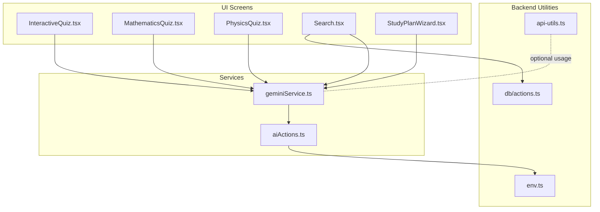
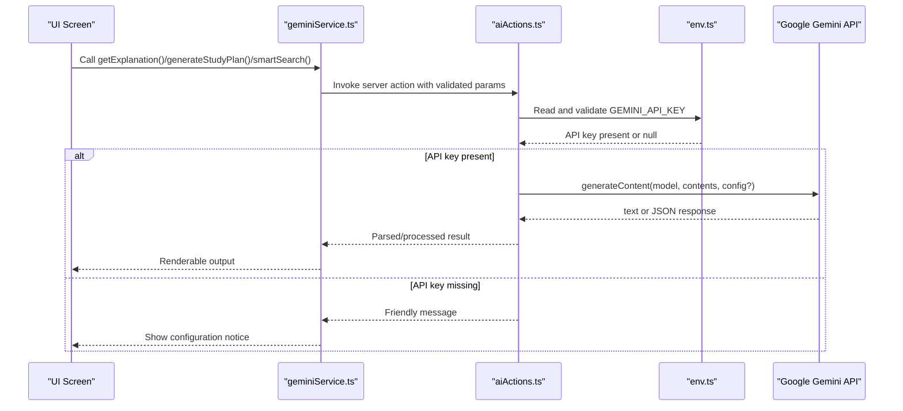
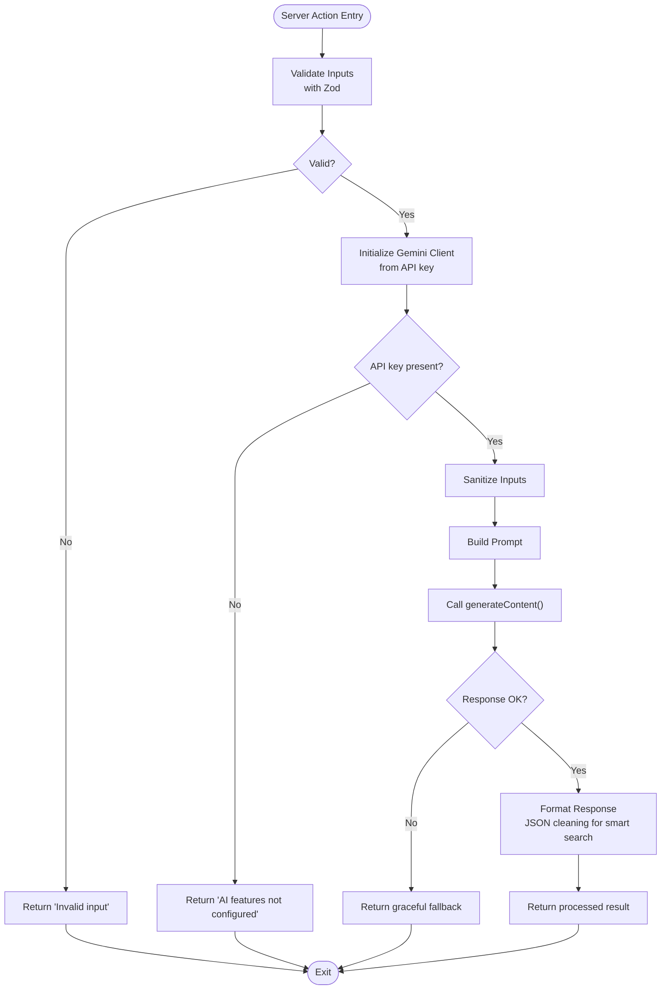
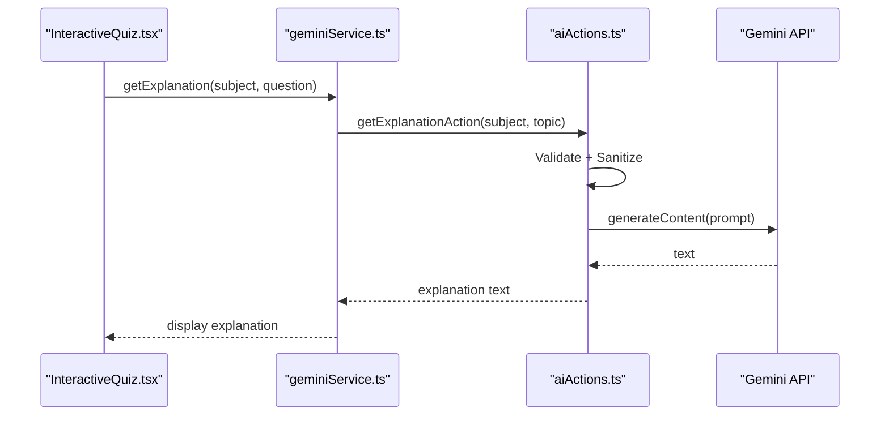
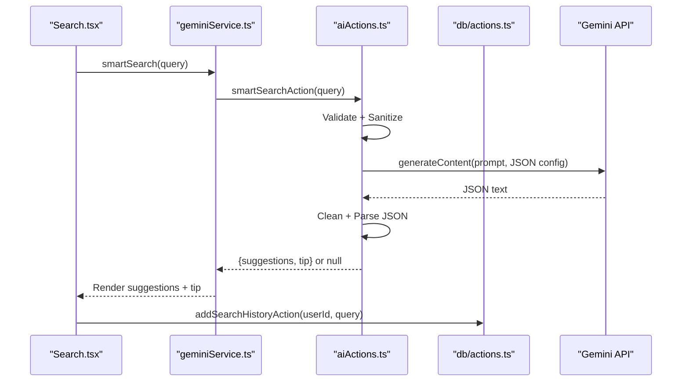
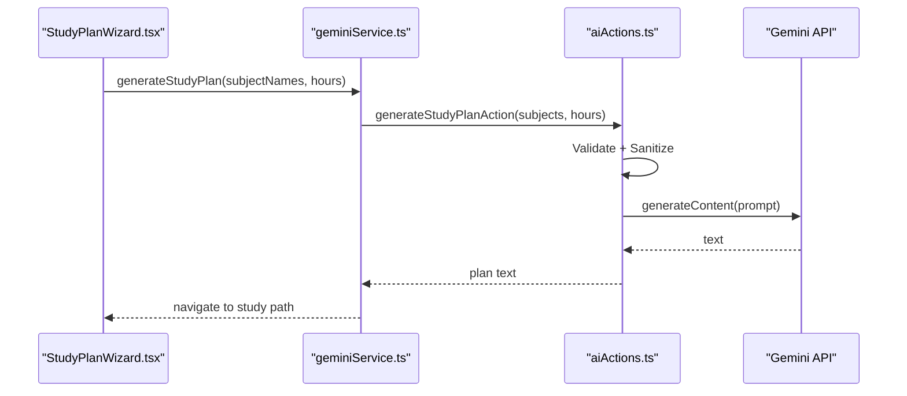
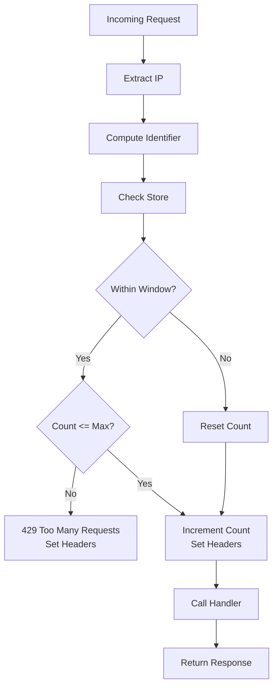
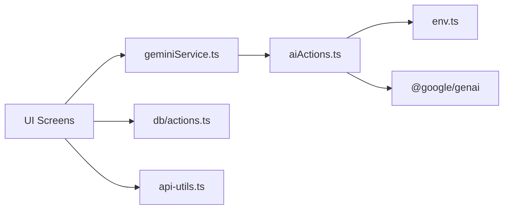

# AI Integration

<cite>
**Referenced Files in This Document**
- [geminiService.ts](file://src/services/geminiService.ts)
- [aiActions.ts](file://src/services/aiActions.ts)
- [InteractiveQuiz.tsx](file://src/screens/InteractiveQuiz.tsx)
- [MathematicsQuiz.tsx](file://src/screens/MathematicsQuiz.tsx)
- [PhysicsQuiz.tsx](file://src/screens/PhysicsQuiz.tsx)
- [Search.tsx](file://src/screens/Search.tsx)
- [StudyPlanWizard.tsx](file://src/screens/StudyPlanWizard.tsx)
- [quiz-data.ts](file://src/constants/quiz-data.ts)
- [env.ts](file://src/lib/env.ts)
- [api-utils.ts](file://src/lib/api-utils.ts)
- [actions.ts](file://src/lib/db/actions.ts)
</cite>

## Table of Contents
1. [Introduction](#introduction)
2. [Project Structure](#project-structure)
3. [Core Components](#core-components)
4. [Architecture Overview](#architecture-overview)
5. [Detailed Component Analysis](#detailed-component-analysis)
6. [Dependency Analysis](#dependency-analysis)
7. [Performance Considerations](#performance-considerations)
8. [Troubleshooting Guide](#troubleshooting-guide)
9. [Conclusion](#conclusion)
10. [Appendices](#appendices)

## Introduction
This document explains MatricMaster AI’s AI integration system powered by the Google Gemini API. It covers the AI service architecture, input validation, response processing, error handling, and the secure server action patterns used to protect API keys and manage usage. It documents AI-powered features such as concept explanations, study plan generation, smart search, and interactive quiz assistance. It also outlines prompt engineering strategies, response formatting, integration with the quiz system, and practical guidance for rate limiting, cost optimization, and troubleshooting.

## Project Structure
MatricMaster organizes AI features around a small set of cohesive modules:
- Service layer: a thin wrapper around Gemini actions
- AI action layer: server-side handlers that validate inputs, sanitize prompts, call Gemini, and parse responses
- UI screens: interactive quiz, search, and study plan wizard that trigger AI features
- Environment and utilities: environment validation and generic API utilities for rate limiting
- Database actions: persistence for search history and other backend features

**Diagram sources**
- [geminiService.ts](file://src/services/geminiService.ts#L1-L14)
- [aiActions.ts](file://src/services/aiActions.ts#L1-L168)
- [InteractiveQuiz.tsx](file://src/screens/InteractiveQuiz.tsx#L1-L458)
- [MathematicsQuiz.tsx](file://src/screens/MathematicsQuiz.tsx#L1-L283)
- [PhysicsQuiz.tsx](file://src/screens/PhysicsQuiz.tsx#L1-L446)
- [Search.tsx](file://src/screens/Search.tsx#L1-L340)
- [StudyPlanWizard.tsx](file://src/screens/StudyPlanWizard.tsx#L1-L243)
- [env.ts](file://src/lib/env.ts#L1-L62)
- [api-utils.ts](file://src/lib/api-utils.ts#L1-L93)
- [actions.ts](file://src/lib/db/actions.ts#L1-L516)

**Section sources**
- [geminiService.ts](file://src/services/geminiService.ts#L1-L14)
- [aiActions.ts](file://src/services/aiActions.ts#L1-L168)
- [Search.tsx](file://src/screens/Search.tsx#L1-L340)
- [StudyPlanWizard.tsx](file://src/screens/StudyPlanWizard.tsx#L1-L243)
- [InteractiveQuiz.tsx](file://src/screens/InteractiveQuiz.tsx#L1-L458)
- [MathematicsQuiz.tsx](file://src/screens/MathematicsQuiz.tsx#L1-L283)
- [PhysicsQuiz.tsx](file://src/screens/PhysicsQuiz.tsx#L1-L446)
- [env.ts](file://src/lib/env.ts#L1-L62)
- [api-utils.ts](file://src/lib/api-utils.ts#L1-L93)
- [actions.ts](file://src/lib/db/actions.ts#L1-L516)

## Core Components
- Gemini Service Wrapper: exports convenience functions for concept explanations, study plan generation, and smart search.
- AI Actions: server action module that validates inputs, sanitizes prompts, calls Gemini, parses JSON for smart search, and handles errors gracefully.
- UI Integrations: quiz screens integrate AI explanations; search screen integrates smart suggestions; study plan wizard integrates plan generation.
- Environment Validation: validates environment variables including the Gemini API key.
- API Utilities: generic rate limiting helpers for future server routes.
- Database Actions: search history persistence used by the search screen.

**Section sources**
- [geminiService.ts](file://src/services/geminiService.ts#L1-L14)
- [aiActions.ts](file://src/services/aiActions.ts#L1-L168)
- [Search.tsx](file://src/screens/Search.tsx#L1-L340)
- [StudyPlanWizard.tsx](file://src/screens/StudyPlanWizard.tsx#L1-L243)
- [InteractiveQuiz.tsx](file://src/screens/InteractiveQuiz.tsx#L1-L458)
- [env.ts](file://src/lib/env.ts#L1-L62)
- [api-utils.ts](file://src/lib/api-utils.ts#L1-L93)
- [actions.ts](file://src/lib/db/actions.ts#L434-L474)

## Architecture Overview
The AI integration follows a layered pattern:
- UI triggers AI via service wrappers
- Service wrappers delegate to server actions
- Server actions validate and sanitize inputs, construct prompts, call Gemini, and return safe responses
- UI renders AI outputs or falls back to friendly messages

**Diagram sources**
- [geminiService.ts](file://src/services/geminiService.ts#L1-L14)
- [aiActions.ts](file://src/services/aiActions.ts#L22-L32)
- [env.ts](file://src/lib/env.ts#L24-L28)

## Detailed Component Analysis

### AI Service Wrapper
- Purpose: Thin client-side exports that forward to server actions.
- Functions:
  - getExplanation(subject, topic)
  - generateStudyPlan(subjects[], hours)
  - smartSearch(query)

Implementation notes:
- Exports are synchronous wrappers that internally call server action functions.
- This keeps UI code simple and delegates all sensitive operations to server actions.

**Section sources**
- [geminiService.ts](file://src/services/geminiService.ts#L1-L14)

### AI Actions: Validation, Sanitization, Prompting, Parsing, and Error Handling
- Validation:
  - Uses Zod schemas to enforce input constraints for each action.
  - Explanation: subject and topic length limits and non-empty checks.
  - Study plan: array of subjects with length limits and numeric hours clamped to a realistic range.
  - Smart search: single query string with length limit.
- Sanitization:
  - Removes potentially problematic characters and trims inputs.
  - Limits input length to prevent oversized prompts.
- Prompt Engineering:
  - Concept explanations: instructs Gemini to act as a Grade 12 South African tutor, use analogies, and highlight formulas.
  - Study plan: asks for a daily quest path with specific topics and returns a list.
  - Smart search: requests JSON with suggestions and a concise tip; response is cleaned and parsed.
- Response Processing:
  - Concept explanations: returns raw text fallback if unavailable.
  - Study plan: returns raw text fallback if unavailable.
  - Smart search: cleans fenced JSON, validates shape, and returns typed object or null.
- Error Handling:
  - Catches Zod errors and returns user-friendly messages.
  - Catches runtime errors, logs them, and returns graceful fallbacks.
  - Missing API key disables AI features with a warning.

**Diagram sources**
- [aiActions.ts](file://src/services/aiActions.ts#L6-L18)
- [aiActions.ts](file://src/services/aiActions.ts#L34-L40)
- [aiActions.ts](file://src/services/aiActions.ts#L42-L78)
- [aiActions.ts](file://src/services/aiActions.ts#L80-L114)
- [aiActions.ts](file://src/services/aiActions.ts#L116-L167)

**Section sources**
- [aiActions.ts](file://src/services/aiActions.ts#L1-L168)

### Concept Explanations in Quizzes
- Interactive Quiz:
  - On user request, calls getExplanation(subject, currentQuestion.question).
  - Renders AI-provided explanation or a friendly error message.
- Physics Quiz:
  - Calls getExplanation with subject “Physical Sciences” and the current question text.
- Mathematics Quiz:
  - Calls getExplanation with subject “Mathematics” and a contextual question string.
- Quiz Data:
  - Provides structured quiz data used by the interactive quiz screen.

**Diagram sources**
- [InteractiveQuiz.tsx](file://src/screens/InteractiveQuiz.tsx#L154-L170)
- [MathematicsQuiz.tsx](file://src/screens/MathematicsQuiz.tsx#L39-L56)
- [PhysicsQuiz.tsx](file://src/screens/PhysicsQuiz.tsx#L176-L192)
- [geminiService.ts](file://src/services/geminiService.ts#L3-L5)
- [aiActions.ts](file://src/services/aiActions.ts#L42-L78)

**Section sources**
- [InteractiveQuiz.tsx](file://src/screens/InteractiveQuiz.tsx#L154-L170)
- [MathematicsQuiz.tsx](file://src/screens/MathematicsQuiz.tsx#L39-L56)
- [PhysicsQuiz.tsx](file://src/screens/PhysicsQuiz.tsx#L176-L192)
- [geminiService.ts](file://src/services/geminiService.ts#L3-L5)
- [aiActions.ts](file://src/services/aiActions.ts#L42-L78)
- [quiz-data.ts](file://src/constants/quiz-data.ts#L1-L313)

### Smart Search Capabilities
- Search Screen:
  - Debounces user input and triggers smartSearch(query).
  - Displays AI-generated suggestions and a tip.
  - Saves search queries to user history when authenticated.
- Smart Search Action:
  - Validates query length.
  - Requests JSON-formatted response from Gemini.
  - Cleans and parses JSON, returning typed object or null.
  - Persists recent searches via database actions.

**Diagram sources**
- [Search.tsx](file://src/screens/Search.tsx#L48-L69)
- [geminiService.ts](file://src/services/geminiService.ts#L11-L13)
- [aiActions.ts](file://src/services/aiActions.ts#L116-L167)
- [actions.ts](file://src/lib/db/actions.ts#L434-L474)

**Section sources**
- [Search.tsx](file://src/screens/Search.tsx#L1-L340)
- [geminiService.ts](file://src/services/geminiService.ts#L11-L13)
- [aiActions.ts](file://src/services/aiActions.ts#L116-L167)
- [actions.ts](file://src/lib/db/actions.ts#L434-L474)

### Study Plan Generation
- Study Plan Wizard:
  - Collects selected subjects and weekly hours.
  - Triggers plan generation and navigates to the study path view.
- Study Plan Action:
  - Validates subjects and hours.
  - Builds a prompt requesting a daily quest path with specific topics.
  - Returns formatted text or a friendly fallback.

**Diagram sources**
- [StudyPlanWizard.tsx](file://src/screens/StudyPlanWizard.tsx#L45-L60)
- [geminiService.ts](file://src/services/geminiService.ts#L7-L9)
- [aiActions.ts](file://src/services/aiActions.ts#L80-L114)

**Section sources**
- [StudyPlanWizard.tsx](file://src/screens/StudyPlanWizard.tsx#L1-L243)
- [geminiService.ts](file://src/services/geminiService.ts#L7-L9)
- [aiActions.ts](file://src/services/aiActions.ts#L80-L114)

### Server Action Patterns and Safety Measures
- Secure AI Interactions:
  - All AI actions are server actions, preventing client-side exposure of API keys.
  - API key retrieval occurs inside the server action via environment validation.
- Input Safety:
  - Zod schemas enforce minimum/maximum lengths and presence checks.
  - Sanitization strips unsafe characters and truncates inputs.
- Educational Content Safety:
  - Prompts instruct Gemini to act as a Grade 12 South African tutor, emphasizing clarity and analogies appropriate for learners.
- Graceful Degradation:
  - Missing API key disables AI features with a clear message.
  - Runtime errors are caught and logged; UI receives user-friendly fallbacks.

**Section sources**
- [aiActions.ts](file://src/services/aiActions.ts#L22-L32)
- [aiActions.ts](file://src/services/aiActions.ts#L34-L40)
- [env.ts](file://src/lib/env.ts#L24-L28)
- [aiActions.ts](file://src/services/aiActions.ts#L42-L78)
- [aiActions.ts](file://src/services/aiActions.ts#L80-L114)
- [aiActions.ts](file://src/services/aiActions.ts#L116-L167)

### Rate Limiting Implementation
- Generic Utilities:
  - Provides a simple in-memory rate limiter and a higher-order function to wrap handlers.
  - Adds standard rate limit headers to responses.
- Usage Guidance:
  - Can be applied to server routes that expose AI endpoints.
  - Identifier uses IP from forwarded headers for distributed environments.

**Diagram sources**
- [api-utils.ts](file://src/lib/api-utils.ts#L18-L38)
- [api-utils.ts](file://src/lib/api-utils.ts#L40-L78)

**Section sources**
- [api-utils.ts](file://src/lib/api-utils.ts#L1-L93)

### Cost Optimization Strategies
- Model Selection:
  - Uses a flash model for lightweight tasks to reduce cost.
- Prompt Efficiency:
  - Keep prompts concise; leverage sanitization to trim unnecessary length.
- Response Handling:
  - Prefer JSON for structured outputs to minimize parsing overhead.
- Caching Opportunities:
  - Consider caching repeated queries (e.g., frequent explanations for the same topic) at the application layer if acceptable.
- Monitoring:
  - Track usage patterns and adjust quotas or models accordingly.

[No sources needed since this section provides general guidance]

### Prompt Engineering Notes
- Concept Explanations:
  - Role-play: “Grade 12 tutor in South Africa”
  - Tone: “interactive and easy to understand,” “simple analogies,” “highlight key formulas”
- Study Plan:
  - “daily quest path with specific topics to cover,” “return as a list”
- Smart Search:
  - “suggest 3-4 specific Grade 12 topics/questions,” “very brief (1 sentence) helpful tip”
  - Explicitly request JSON with keys “suggestions” and “tip”

**Section sources**
- [aiActions.ts](file://src/services/aiActions.ts#L60-L62)
- [aiActions.ts](file://src/services/aiActions.ts#L98-L100)
- [aiActions.ts](file://src/services/aiActions.ts#L133-L135)
- [aiActions.ts](file://src/services/aiActions.ts#L139-L141)

## Dependency Analysis
- UI depends on service wrappers; services depend on server actions; server actions depend on environment validation and Gemini SDK.
- Search screen additionally depends on database actions for history persistence.
- Rate limiting utilities are available for future server routes.

**Diagram sources**
- [geminiService.ts](file://src/services/geminiService.ts#L1-L14)
- [aiActions.ts](file://src/services/aiActions.ts#L3-L4)
- [env.ts](file://src/lib/env.ts#L24-L28)
- [Search.tsx](file://src/screens/Search.tsx#L17-L23)
- [actions.ts](file://src/lib/db/actions.ts#L434-L474)
- [api-utils.ts](file://src/lib/api-utils.ts#L1-L93)

**Section sources**
- [geminiService.ts](file://src/services/geminiService.ts#L1-L14)
- [aiActions.ts](file://src/services/aiActions.ts#L1-L168)
- [env.ts](file://src/lib/env.ts#L1-L62)
- [Search.tsx](file://src/screens/Search.tsx#L1-L340)
- [actions.ts](file://src/lib/db/actions.ts#L1-L516)
- [api-utils.ts](file://src/lib/api-utils.ts#L1-L93)

## Performance Considerations
- Debounce UI inputs for smart search to reduce API calls.
- Reuse server actions to avoid redundant initialization of the Gemini client.
- Keep prompts concise and avoid excessive context to reduce latency.
- Consider pagination or chunked responses for long study plan outputs.
- Monitor API latency and implement retries with exponential backoff for transient failures.

[No sources needed since this section provides general guidance]

## Troubleshooting Guide
Common issues and resolutions:
- Missing API Key:
  - Symptom: AI features return a configuration message.
  - Resolution: Set GEMINI_API_KEY in environment variables and redeploy.
- Invalid Input Errors:
  - Symptom: “Invalid input provided.”
  - Resolution: Ensure inputs meet length and presence constraints enforced by Zod schemas.
- API Connectivity Failures:
  - Symptom: Graceful fallback messages; errors logged.
  - Resolution: Verify network connectivity, retry later, and check quota limits.
- JSON Parsing Failures (Smart Search):
  - Symptom: Null returned for suggestions.
  - Resolution: Confirm Gemini returned a properly formatted JSON object; ensure responseMimeType is set for JSON.

**Section sources**
- [env.ts](file://src/lib/env.ts#L24-L28)
- [aiActions.ts](file://src/services/aiActions.ts#L72-L77)
- [aiActions.ts](file://src/services/aiActions.ts#L161-L166)

## Conclusion
MatricMaster AI integrates Google Gemini securely and efficiently by centralizing validation, sanitization, prompting, and error handling in server actions. The UI remains responsive and user-friendly by delegating sensitive operations to the server and providing graceful fallbacks. With structured prompts, JSON parsing for smart search, and modular components, the system supports concept explanations, study plan generation, and intelligent search—enhancing learning outcomes for Grade 12 students.

## Appendices

### API Integration Patterns
- Concept Explanations:
  - Use server action to validate inputs, sanitize, and call Gemini with a tailored tutor role prompt.
- Study Plan Generation:
  - Validate subjects and hours; request a structured daily path; return text or fallback.
- Smart Search:
  - Enforce JSON response; clean and parse; return typed suggestions and tip.

**Section sources**
- [aiActions.ts](file://src/services/aiActions.ts#L42-L78)
- [aiActions.ts](file://src/services/aiActions.ts#L80-L114)
- [aiActions.ts](file://src/services/aiActions.ts#L116-L167)