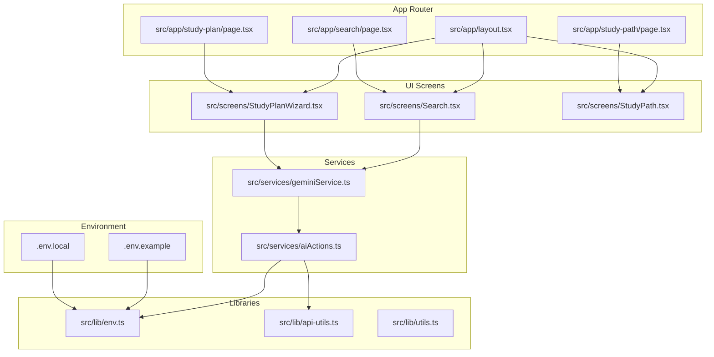
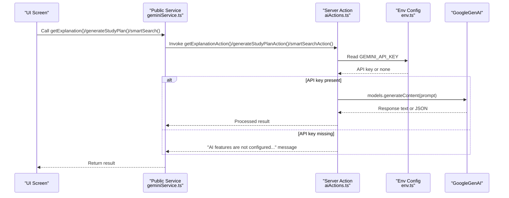
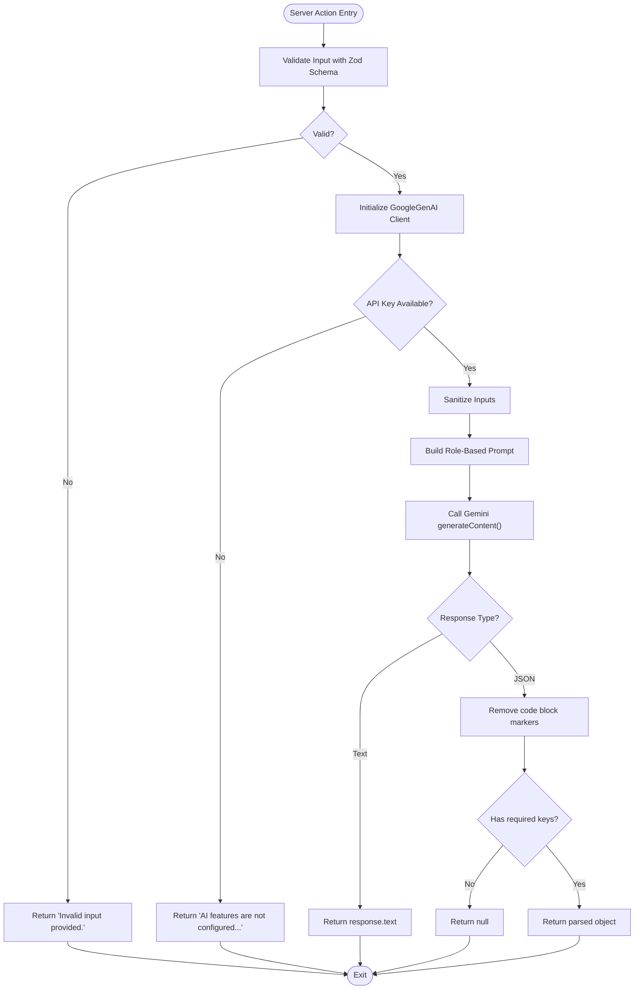
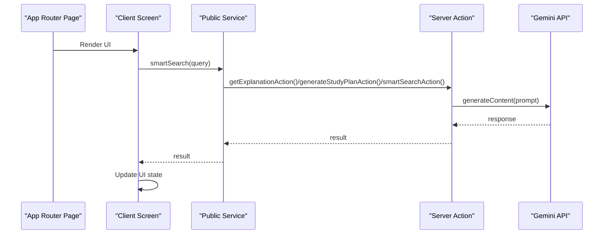
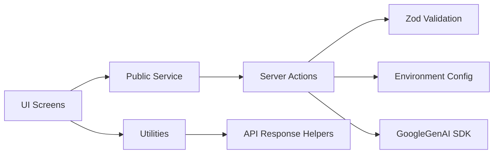

# AI Service Architecture

<cite>
**Referenced Files in This Document**
- [geminiService.ts](file://src/services/geminiService.ts)
- [aiActions.ts](file://src/services/aiActions.ts)
- [env.ts](file://src/lib/env.ts)
- [api-utils.ts](file://src/lib/api-utils.ts)
- [utils.ts](file://src/lib/utils.ts)
- [.env.example](file://.env.example)
- [.env.local](file://.env.local)
- [Search.tsx](file://src/screens/Search.tsx)
- [StudyPlanWizard.tsx](file://src/screens/StudyPlanWizard.tsx)
- [StudyPath.tsx](file://src/screens/StudyPath.tsx)
- [layout.tsx](file://src/app/layout.tsx)
- [page.tsx (Search)](file://src/app/search/page.tsx)
- [page.tsx (Study Plan)](file://src/app/study-plan/page.tsx)
- [page.tsx (Study Path)](file://src/app/study-path/page.tsx)
</cite>

## Table of Contents
1. [Introduction](#introduction)
2. [Project Structure](#project-structure)
3. [Core Components](#core-components)
4. [Architecture Overview](#architecture-overview)
5. [Detailed Component Analysis](#detailed-component-analysis)
6. [Dependency Analysis](#dependency-analysis)
7. [Performance Considerations](#performance-considerations)
8. [Troubleshooting Guide](#troubleshooting-guide)
9. [Conclusion](#conclusion)
10. [Appendices](#appendices)

## Introduction
This document explains the AI service architecture powering MatricMaster AI. It focuses on the Google Gemini API wrapper, server action pattern for secure AI interactions, modular service design for explanation generation, study planning, and smart search, and how these integrate with the Next.js App Router. It also covers configuration management, environment variable handling, input validation, response processing, and error handling strategies.

## Project Structure
The AI-related logic is organized under dedicated service and library modules, with UI screens consuming these services via client components and Next.js routes.

**Diagram sources**
- [geminiService.ts](file://src/services/geminiService.ts#L1-L14)
- [aiActions.ts](file://src/services/aiActions.ts#L1-L168)
- [env.ts](file://src/lib/env.ts#L1-L62)
- [api-utils.ts](file://src/lib/api-utils.ts#L1-L93)
- [utils.ts](file://src/lib/utils.ts#L1-L7)
- [Search.tsx](file://src/screens/Search.tsx#L1-L340)
- [StudyPlanWizard.tsx](file://src/screens/StudyPlanWizard.tsx#L1-L243)
- [StudyPath.tsx](file://src/screens/StudyPath.tsx#L1-L273)
- [layout.tsx](file://src/app/layout.tsx#L1-L108)
- [page.tsx (Search)](file://src/app/search/page.tsx#L1-L12)
- [page.tsx (Study Plan)](file://src/app/study-plan/page.tsx#L1-L12)
- [page.tsx (Study Path)](file://src/app/study-path/page.tsx#L1-L12)
- [.env.example](file://.env.example#L1-L19)
- [.env.local](file://.env.local#L1-L37)

**Section sources**
- [geminiService.ts](file://src/services/geminiService.ts#L1-L14)
- [aiActions.ts](file://src/services/aiActions.ts#L1-L168)
- [env.ts](file://src/lib/env.ts#L1-L62)
- [api-utils.ts](file://src/lib/api-utils.ts#L1-L93)
- [utils.ts](file://src/lib/utils.ts#L1-L7)
- [Search.tsx](file://src/screens/Search.tsx#L1-L340)
- [StudyPlanWizard.tsx](file://src/screens/StudyPlanWizard.tsx#L1-L243)
- [StudyPath.tsx](file://src/screens/StudyPath.tsx#L1-L273)
- [layout.tsx](file://src/app/layout.tsx#L1-L108)
- [page.tsx (Search)](file://src/app/search/page.tsx#L1-L12)
- [page.tsx (Study Plan)](file://src/app/study-plan/page.tsx#L1-L12)
- [page.tsx (Study Path)](file://src/app/study-path/page.tsx#L1-L12)
- [.env.example](file://.env.example#L1-L19)
- [.env.local](file://.env.local#L1-L37)

## Core Components
- Google Gemini API wrapper: thin facade exporting three public functions delegating to server actions.
- Server actions: encapsulate AI API calls, validation, sanitization, and error handling.
- Environment configuration: Zod-based validation and helpers for environment variables.
- Utility functions: rate limiting, API response helpers, and Tailwind utilities.

Key responsibilities:
- Service initialization and configuration: lazy initialization of the Gemini client with API key retrieval from environment.
- API endpoint abstraction: unified model invocation with role-based prompts and optional JSON response mode.
- Secure AI interactions: server actions executed on the server, preventing client-side API exposure.
- Modular service design: separate functions for explanation generation, study planning, and smart search.

**Section sources**
- [geminiService.ts](file://src/services/geminiService.ts#L1-L14)
- [aiActions.ts](file://src/services/aiActions.ts#L1-L168)
- [env.ts](file://src/lib/env.ts#L1-L62)
- [api-utils.ts](file://src/lib/api-utils.ts#L1-L93)

## Architecture Overview
The AI architecture follows a layered pattern:
- UI screens trigger service calls.
- Public service module exposes async functions that delegate to server actions.
- Server actions validate inputs, sanitize, construct prompts, and call the Gemini API.
- Responses are processed and returned to the UI.

**Diagram sources**
- [geminiService.ts](file://src/services/geminiService.ts#L1-L14)
- [aiActions.ts](file://src/services/aiActions.ts#L20-L32)
- [env.ts](file://src/lib/env.ts#L47-L56)

## Detailed Component Analysis

### Google Gemini API Wrapper (Public Service)
The public service module provides three async functions:
- getExplanation(subject, topic)
- generateStudyPlan(subjects[], hours)
- smartSearch(query)

These functions simply delegate to corresponding server actions, enabling controlled server-side execution.

Implementation highlights:
- Delegation pattern ensures all AI calls run on the server.
- No client-side API key exposure.

**Section sources**
- [geminiService.ts](file://src/services/geminiService.ts#L1-L14)

### Server Actions (Secure AI Interactions)
Server actions encapsulate:
- Validation: Zod schemas for each input type.
- Initialization: Lazy creation of the GoogleGenAI client using process.env.GEMINI_API_KEY.
- Sanitization: Input cleaning to remove unsafe characters and trim lengths.
- Prompt construction: Role-based prompts tailored to each capability.
- Response processing: Text extraction and JSON parsing for smart search with strict shape checks.
- Error handling: Zod errors mapped to user-friendly messages; runtime errors logged and surfaced gracefully.

**Diagram sources**
- [aiActions.ts](file://src/services/aiActions.ts#L42-L78)
- [aiActions.ts](file://src/services/aiActions.ts#L80-L114)
- [aiActions.ts](file://src/services/aiActions.ts#L116-L167)

**Section sources**
- [aiActions.ts](file://src/services/aiActions.ts#L1-L168)

### Environment Configuration Management
- Zod schema defines required and optional environment variables, including GEMINI_API_KEY.
- validateEnv parses and validates process.env, logging invalid values and substituting defaults in development.
- requireEnv throws if a required variable is missing.
- getEnv returns undefined for missing optional variables.

Usage:
- Server actions read GEMINI_API_KEY via process.env.
- Frontend should avoid relying on private keys; backend enforces configuration presence.

**Section sources**
- [env.ts](file://src/lib/env.ts#L1-L62)
- [aiActions.ts](file://src/services/aiActions.ts#L22-L32)
- [.env.example](file://.env.example#L8-L9)
- [.env.local](file://.env.local#L15-L15)

### Utility Functions
- Rate limiting: in-memory store keyed by IP with configurable window and max requests; wraps handlers to enforce limits and attach rate limit headers.
- API response helpers: standardized JSON responses for success and error cases.
- Tailwind utilities: class merging helper.

These utilities support robust API handling and consistent response formatting.

**Section sources**
- [api-utils.ts](file://src/lib/api-utils.ts#L1-L93)
- [utils.ts](file://src/lib/utils.ts#L1-L7)

### UI Integration and App Router
- App Router pages define metadata and render respective screens.
- Client screens import public service functions and call them in effects or handlers.
- Example integrations:
  - Search screen: debounced smart search, displays AI suggestions and recent searches.
  - Study Plan Wizard: dynamic subject selection and weekly hours, triggers plan generation.
  - Study Path screen: renders learning path visualization after plan generation.

**Diagram sources**
- [page.tsx (Search)](file://src/app/search/page.tsx#L1-L12)
- [page.tsx (Study Plan)](file://src/app/study-plan/page.tsx#L1-L12)
- [page.tsx (Study Path)](file://src/app/study-path/page.tsx#L1-L12)
- [Search.tsx](file://src/screens/Search.tsx#L48-L69)
- [StudyPlanWizard.tsx](file://src/screens/StudyPlanWizard.tsx#L45-L60)
- [geminiService.ts](file://src/services/geminiService.ts#L1-L14)
- [aiActions.ts](file://src/services/aiActions.ts#L42-L78)

**Section sources**
- [layout.tsx](file://src/app/layout.tsx#L1-L108)
- [page.tsx (Search)](file://src/app/search/page.tsx#L1-L12)
- [page.tsx (Study Plan)](file://src/app/study-plan/page.tsx#L1-L12)
- [page.tsx (Study Path)](file://src/app/study-path/page.tsx#L1-L12)
- [Search.tsx](file://src/screens/Search.tsx#L1-L340)
- [StudyPlanWizard.tsx](file://src/screens/StudyPlanWizard.tsx#L1-L243)
- [StudyPath.tsx](file://src/screens/StudyPath.tsx#L1-L273)

## Dependency Analysis
- Public service depends on server actions.
- Server actions depend on:
  - GoogleGenAI SDK for model invocation.
  - Zod for input validation.
  - Environment configuration for API key retrieval.
  - Optional JSON response mode for smart search.
- UI screens depend on public service for AI features.
- Utilities support API handling and response formatting.

**Diagram sources**
- [geminiService.ts](file://src/services/geminiService.ts#L1-L14)
- [aiActions.ts](file://src/services/aiActions.ts#L1-L168)
- [env.ts](file://src/lib/env.ts#L1-L62)
- [api-utils.ts](file://src/lib/api-utils.ts#L1-L93)

**Section sources**
- [geminiService.ts](file://src/services/geminiService.ts#L1-L14)
- [aiActions.ts](file://src/services/aiActions.ts#L1-L168)
- [env.ts](file://src/lib/env.ts#L1-L62)
- [api-utils.ts](file://src/lib/api-utils.ts#L1-L93)

## Performance Considerations
- Debounce UI triggers for smart search to reduce API calls.
- Use rate limiting middleware to protect downstream API usage.
- Keep prompts concise and targeted to minimize token usage.
- Cache sanitized inputs where appropriate to avoid repeated processing.
- Monitor error logs and surface user-friendly messages without leaking internal details.

## Troubleshooting Guide
Common issues and resolutions:
- Missing API key:
  - Symptom: AI features return a disabled message.
  - Resolution: Set GEMINI_API_KEY in environment; ensure validateEnv succeeds.
- Invalid input:
  - Symptom: Validation errors return user-friendly messages.
  - Resolution: Ensure inputs meet schema constraints (lengths, types).
- Smart search JSON parsing failures:
  - Symptom: Null returned when response does not match expected shape.
  - Resolution: Verify prompt requests JSON and responseMimeType is set for JSON mode.
- Rate limiting:
  - Symptom: 429 responses with rate limit headers.
  - Resolution: Adjust window and max values; ensure client respects retry-after guidance.

**Section sources**
- [aiActions.ts](file://src/services/aiActions.ts#L22-L32)
- [aiActions.ts](file://src/services/aiActions.ts#L71-L77)
- [aiActions.ts](file://src/services/aiActions.ts#L160-L166)
- [api-utils.ts](file://src/lib/api-utils.ts#L18-L78)

## Conclusion
MatricMaster AI’s architecture cleanly separates concerns: public services expose safe entry points, server actions encapsulate validation and API calls, and environment configuration enforces secure setup. The modular design supports future expansion while maintaining robust error handling and user experience.

## Appendices

### API Key Management and Environment Variables
- Define GEMINI_API_KEY in environment files.
- Use validateEnv to ensure correctness; requireEnv for mandatory variables.
- Avoid exposing private keys in client code.

**Section sources**
- [.env.example](file://.env.example#L8-L9)
- [.env.local](file://.env.local#L15-L15)
- [env.ts](file://src/lib/env.ts#L19-L56)

### Service Instantiation and Method Invocation Patterns
- Import public service functions in client components.
- Invoke methods in effects or handlers; update UI state with results.
- Example patterns:
  - Debounced search input invoking smartSearch.
  - Dynamic form selections invoking generateStudyPlan.
  - Navigation to study path after plan generation.

**Section sources**
- [Search.tsx](file://src/screens/Search.tsx#L48-L69)
- [StudyPlanWizard.tsx](file://src/screens/StudyPlanWizard.tsx#L45-L60)
- [geminiService.ts](file://src/services/geminiService.ts#L1-L14)