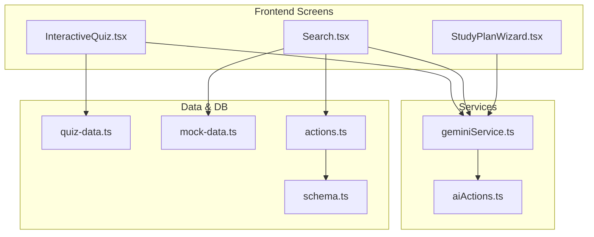
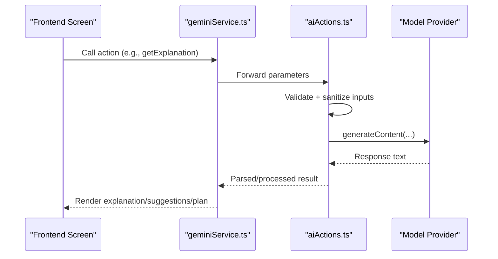
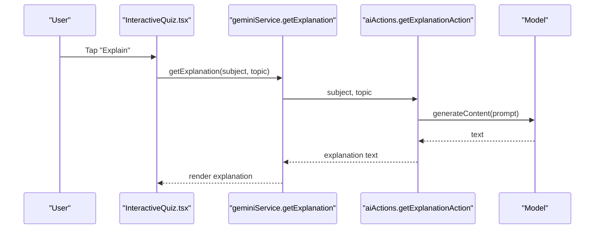
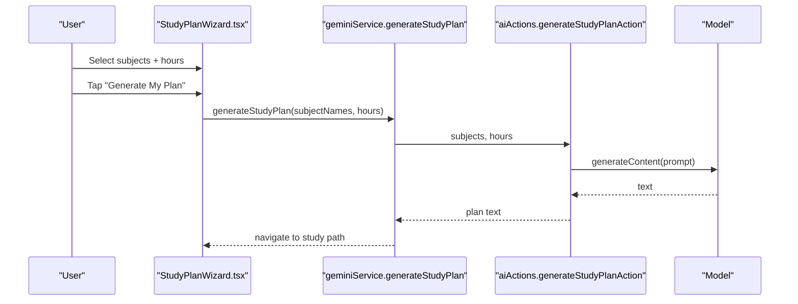
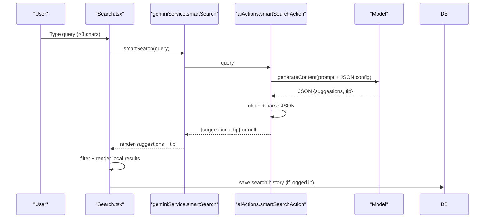
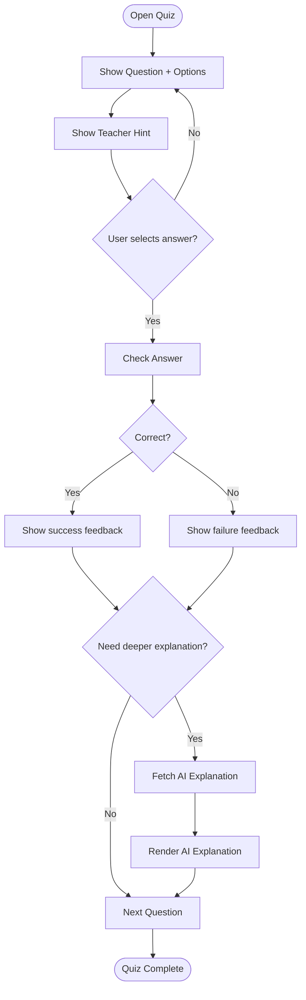
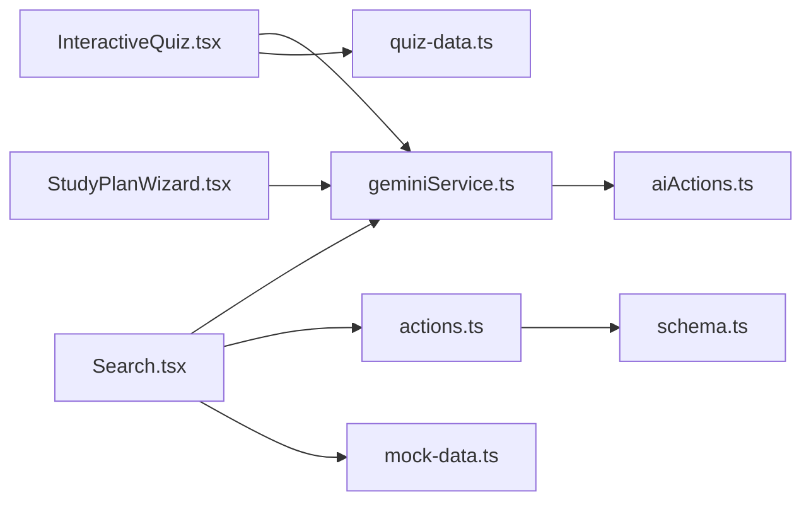

# AI-Powered Features

<cite>
**Referenced Files in This Document**
- [aiActions.ts](file://src/services/aiActions.ts)
- [geminiService.ts](file://src/services/geminiService.ts)
- [InteractiveQuiz.tsx](file://src/screens/InteractiveQuiz.tsx)
- [Search.tsx](file://src/screens/Search.tsx)
- [StudyPlanWizard.tsx](file://src/screens/StudyPlanWizard.tsx)
- [quiz-data.ts](file://src/constants/quiz-data.ts)
- [mock-data.ts](file://src/constants/mock-data.ts)
- [actions.ts](file://src/lib/db/actions.ts)
- [schema.ts](file://src/lib/db/schema.ts)
</cite>

## Table of Contents
1. [Introduction](#introduction)
2. [Project Structure](#project-structure)
3. [Core Components](#core-components)
4. [Architecture Overview](#architecture-overview)
5. [Detailed Component Analysis](#detailed-component-analysis)
6. [Dependency Analysis](#dependency-analysis)
7. [Performance Considerations](#performance-considerations)
8. [Troubleshooting Guide](#troubleshooting-guide)
9. [Conclusion](#conclusion)

## Introduction
This document explains MatricMaster AI’s AI-powered features and how they integrate with the frontend to deliver value-added educational experiences. It covers:
- Concept explanation system for contextual help during quiz interactions
- Personalized study plan generation based on student preferences
- Smart search functionality that enhances content discovery and recommendations
- Interactive quiz assistance with hints, explanations, and adaptive difficulty cues

Each feature leverages a shared AI service layer backed by a model provider, with robust input validation, sanitization, and error handling. The frontend integrates these services via thin wrappers and reactive UI flows.

## Project Structure
The AI features span a small set of cohesive modules:
- AI service layer: centralized actions and service wrappers
- Screens: interactive UI that triggers AI features and renders results
- Data and constants: quiz content and curated lists for discovery
- Database actions and schema: persistent search history and quiz data

**Diagram sources**
- [InteractiveQuiz.tsx](file://src/screens/InteractiveQuiz.tsx#L105-L458)
- [Search.tsx](file://src/screens/Search.tsx#L25-L340)
- [StudyPlanWizard.tsx](file://src/screens/StudyPlanWizard.tsx#L33-L243)
- [geminiService.ts](file://src/services/geminiService.ts#L1-L14)
- [aiActions.ts](file://src/services/aiActions.ts#L1-L168)
- [quiz-data.ts](file://src/constants/quiz-data.ts#L1-L313)
- [mock-data.ts](file://src/constants/mock-data.ts#L1-L285)
- [actions.ts](file://src/lib/db/actions.ts#L434-L498)
- [schema.ts](file://src/lib/db/schema.ts#L120-L141)

**Section sources**
- [InteractiveQuiz.tsx](file://src/screens/InteractiveQuiz.tsx#L105-L458)
- [Search.tsx](file://src/screens/Search.tsx#L25-L340)
- [StudyPlanWizard.tsx](file://src/screens/StudyPlanWizard.tsx#L33-L243)
- [geminiService.ts](file://src/services/geminiService.ts#L1-L14)
- [aiActions.ts](file://src/services/aiActions.ts#L1-L168)
- [quiz-data.ts](file://src/constants/quiz-data.ts#L1-L313)
- [mock-data.ts](file://src/constants/mock-data.ts#L1-L285)
- [actions.ts](file://src/lib/db/actions.ts#L434-L498)
- [schema.ts](file://src/lib/db/schema.ts#L120-L141)

## Core Components
- AI Action Layer
  - Validates inputs, sanitizes text, and calls the model provider to generate responses.
  - Provides three primary actions: concept explanation, study plan generation, and smart search suggestions.
- Gemini Service Wrapper
  - Thin wrapper around AI actions for use in client components.
- Frontend Screens
  - InteractiveQuiz: integrates AI explanations with quiz feedback and teacher-provided hints.
  - Search: augments local results with AI-generated suggestions and tips, and persists search history.
  - StudyPlanWizard: collects preferences and triggers plan generation.

Implementation highlights:
- Input validation and sanitization to prevent injection and enforce safe lengths.
- Controlled debounce for search to balance responsiveness and cost.
- Clear error handling and user-friendly fallback messages.
- Persistent search history for logged-in users.

**Section sources**
- [aiActions.ts](file://src/services/aiActions.ts#L42-L167)
- [geminiService.ts](file://src/services/geminiService.ts#L1-L14)
- [InteractiveQuiz.tsx](file://src/screens/InteractiveQuiz.tsx#L154-L170)
- [Search.tsx](file://src/screens/Search.tsx#L48-L69)
- [StudyPlanWizard.tsx](file://src/screens/StudyPlanWizard.tsx#L45-L60)

## Architecture Overview
The AI features follow a layered pattern:
- UI triggers actions via service wrappers
- Service wrappers call AI actions
- AI actions validate/sanitize inputs and call the model provider
- Responses are returned to the UI for rendering

**Diagram sources**
- [geminiService.ts](file://src/services/geminiService.ts#L1-L14)
- [aiActions.ts](file://src/services/aiActions.ts#L42-L167)

## Detailed Component Analysis

### Concept Explanation System (Quiz Assistance)
Purpose:
- Provide contextual, simplified explanations aligned with the current quiz topic and subject.

Key behaviors:
- On user request, fetches an explanation using the current subject and question topic.
- Renders a friendly “Explain” affordance with loading state and optional AI text.
- Integrates with teacher-provided hints for layered support.

Prompt engineering strategies:
- Role setup: “You are an expert Grade 12 tutor in South Africa.”
- Instruction: Explain interactively and simply, using analogies and highlighting key formulas if applicable.
- Input framing: Uses subject and topic to tailor the explanation precisely.

Response formatting:
- Returns raw text from the model; UI displays it in a dedicated card with a friendly header.

Personalization techniques:
- Uses live quiz data (subject, topic) to tailor explanations.
- Color theming per subject for immersive UX.

**Diagram sources**
- [InteractiveQuiz.tsx](file://src/screens/InteractiveQuiz.tsx#L154-L170)
- [geminiService.ts](file://src/services/geminiService.ts#L3-L5)
- [aiActions.ts](file://src/services/aiActions.ts#L42-L78)

**Section sources**
- [InteractiveQuiz.tsx](file://src/screens/InteractiveQuiz.tsx#L154-L170)
- [geminiService.ts](file://src/services/geminiService.ts#L3-L5)
- [aiActions.ts](file://src/services/aiActions.ts#L42-L78)
- [quiz-data.ts](file://src/constants/quiz-data.ts#L15-L21)

### Study Plan Generation (Personalized Weekly Schedule)
Purpose:
- Generate a focused, daily study path tailored to selected subjects and available weekly hours.

Key behaviors:
- Wizard collects selected subjects and weekly commitment (hours).
- On generate, calls the AI action to produce a daily quest-style plan.
- Navigates to a study path screen after initiation.

Prompt engineering strategies:
- Role setup: “You are an expert Grade 12 tutor.”
- Instruction: Generate a focused weekly study plan with specific topics to cover; structure as a daily quest path.
- Input framing: Subjects list and hours per week.

Response formatting:
- Returns raw text from the model; UI shows a loading animation and navigates to the study path screen.

Personalization techniques:
- Uses selected subjects and weekly hours to shape the plan.
- Emphasizes daily progression with visual indicators.

**Diagram sources**
- [StudyPlanWizard.tsx](file://src/screens/StudyPlanWizard.tsx#L45-L60)
- [geminiService.ts](file://src/services/geminiService.ts#L7-L9)
- [aiActions.ts](file://src/services/aiActions.ts#L80-L114)

**Section sources**
- [StudyPlanWizard.tsx](file://src/screens/StudyPlanWizard.tsx#L33-L243)
- [geminiService.ts](file://src/services/geminiService.ts#L7-L9)
- [aiActions.ts](file://src/services/aiActions.ts#L80-L114)

### Smart Search (Enhanced Content Discovery)
Purpose:
- Improve search relevance by suggesting topic-focused queries and offering concise tips.

Key behaviors:
- Debounced search input triggers AI suggestions when query length exceeds threshold.
- Displays AI-provided suggestions and a tip in a highlighted card.
- Augments local results with AI insights.
- Persists recent searches for logged-in users.

Prompt engineering strategies:
- Instruction: Based on the query, suggest 3–4 specific Grade 12 topics/questions; include a very brief helpful tip.
- Output format: JSON with keys “suggestions” and “tip”.

Response formatting:
- Parses JSON from the model, validates structure, and renders suggestion chips and tip.
- Falls back gracefully when parsing fails or AI is unavailable.

Personalization techniques:
- Uses logged-in user ID to persist and surface recent searches.
- Suggests topics aligned with the query and curriculum context.

**Diagram sources**
- [Search.tsx](file://src/screens/Search.tsx#L48-L69)
- [geminiService.ts](file://src/services/geminiService.ts#L11-L13)
- [aiActions.ts](file://src/services/aiActions.ts#L116-L167)
- [actions.ts](file://src/lib/db/actions.ts#L434-L498)
- [schema.ts](file://src/lib/db/schema.ts#L120-L141)

**Section sources**
- [Search.tsx](file://src/screens/Search.tsx#L25-L340)
- [geminiService.ts](file://src/services/geminiService.ts#L11-L13)
- [aiActions.ts](file://src/services/aiActions.ts#L116-L167)
- [actions.ts](file://src/lib/db/actions.ts#L434-L498)
- [schema.ts](file://src/lib/db/schema.ts#L120-L141)

### Interactive Quiz Assistance (Hints, Explanations, Adaptive Cues)
Purpose:
- Provide layered support: teacher hints, AI explanations, and immediate correctness feedback.

Key behaviors:
- Displays a teacher hint card alongside the question.
- Offers an “Explain” button to request AI explanations tied to the current topic.
- Shows immediate feedback with visual cues and next steps.

Prompt engineering strategies:
- Same role and instruction as concept explanations, tailored to the current topic.

Response formatting:
- Renders AI text in a themed card with a friendly header and loading state.

Personalization techniques:
- Uses current quiz subject and topic to tailor explanations.
- Progress tracking and scoring reinforce adaptive learning.

**Diagram sources**
- [InteractiveQuiz.tsx](file://src/screens/InteractiveQuiz.tsx#L174-L192)
- [InteractiveQuiz.tsx](file://src/screens/InteractiveQuiz.tsx#L154-L170)
- [quiz-data.ts](file://src/constants/quiz-data.ts#L6-L21)

**Section sources**
- [InteractiveQuiz.tsx](file://src/screens/InteractiveQuiz.tsx#L154-L170)
- [InteractiveQuiz.tsx](file://src/screens/InteractiveQuiz.tsx#L174-L192)
- [quiz-data.ts](file://src/constants/quiz-data.ts#L6-L21)

## Dependency Analysis
- UI components depend on service wrappers for AI actions.
- Services depend on AI actions for validation, sanitization, and model calls.
- Search persistence depends on database actions and schema for logged-in users.
- Quiz screens consume curated quiz data for context and topics.

**Diagram sources**
- [InteractiveQuiz.tsx](file://src/screens/InteractiveQuiz.tsx#L105-L458)
- [Search.tsx](file://src/screens/Search.tsx#L25-L340)
- [StudyPlanWizard.tsx](file://src/screens/StudyPlanWizard.tsx#L33-L243)
- [geminiService.ts](file://src/services/geminiService.ts#L1-L14)
- [aiActions.ts](file://src/services/aiActions.ts#L1-L168)
- [actions.ts](file://src/lib/db/actions.ts#L434-L498)
- [schema.ts](file://src/lib/db/schema.ts#L120-L141)
- [quiz-data.ts](file://src/constants/quiz-data.ts#L1-L313)
- [mock-data.ts](file://src/constants/mock-data.ts#L1-L285)

**Section sources**
- [geminiService.ts](file://src/services/geminiService.ts#L1-L14)
- [aiActions.ts](file://src/services/aiActions.ts#L1-L168)
- [Search.tsx](file://src/screens/Search.tsx#L25-L340)
- [actions.ts](file://src/lib/db/actions.ts#L434-L498)
- [schema.ts](file://src/lib/db/schema.ts#L120-L141)
- [InteractiveQuiz.tsx](file://src/screens/InteractiveQuiz.tsx#L105-L458)
- [quiz-data.ts](file://src/constants/quiz-data.ts#L1-L313)
- [mock-data.ts](file://src/constants/mock-data.ts#L1-L285)

## Performance Considerations
- Debounce search input to reduce API calls and improve responsiveness.
- Validate and sanitize inputs early to avoid unnecessary model calls.
- Use controlled loading states to prevent redundant requests.
- Cache lightweight UI state (e.g., current question index) to minimize re-renders.
- Keep prompts concise and targeted to reduce latency and cost.

## Troubleshooting Guide
Common issues and resolutions:
- AI features disabled
  - Cause: Missing API key environment variable.
  - Behavior: Service returns a configuration message; UI falls back gracefully.
  - Resolution: Configure the environment variable and restart the app.
- Invalid input errors
  - Cause: Inputs fail validation (length, type).
  - Behavior: Service returns “Invalid input provided.”; UI surfaces a concise message.
  - Resolution: Ensure inputs meet constraints (e.g., non-empty, within max length).
- Model provider errors
  - Cause: Network or provider-side failures.
  - Behavior: Service logs the error and returns a friendly fallback message.
  - Resolution: Retry after a short delay; check network connectivity.
- Search history not saving
  - Cause: Not logged in or DB unavailable.
  - Behavior: UI disables persistence; recent searches remain client-only.
  - Resolution: Log in and ensure DB is reachable.

**Section sources**
- [aiActions.ts](file://src/services/aiActions.ts#L22-L32)
- [aiActions.ts](file://src/services/aiActions.ts#L71-L77)
- [Search.tsx](file://src/screens/Search.tsx#L56-L62)
- [actions.ts](file://src/lib/db/actions.ts#L52-L58)

## Conclusion
MatricMaster AI delivers practical, curriculum-aligned assistance through three integrated features:
- Concept explanations that contextualize quiz topics
- Personalized study plans that adapt to student preferences
- Smart search that augments discovery with AI-driven suggestions

The implementation emphasizes safety (validation and sanitization), resilience (graceful fallbacks), and user-centric UX (layered hints, loading states, and progress tracking). These features collectively enhance learning outcomes by providing timely, relevant, and personalized support.