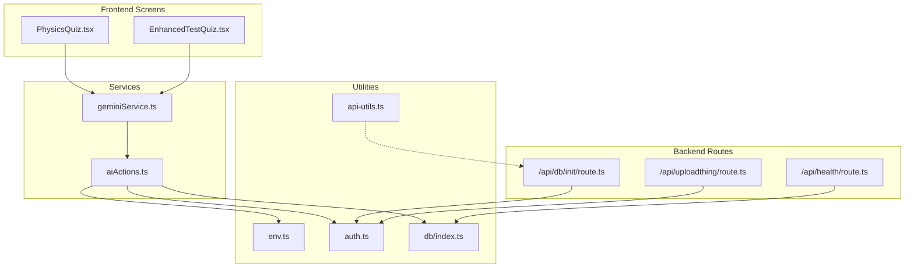
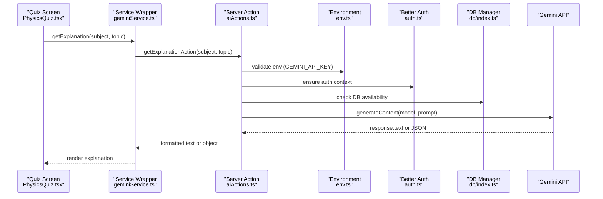
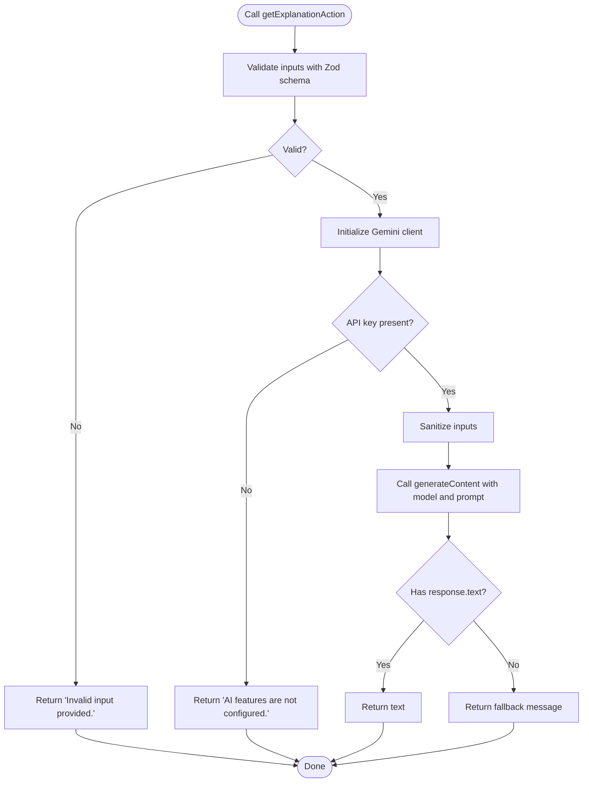
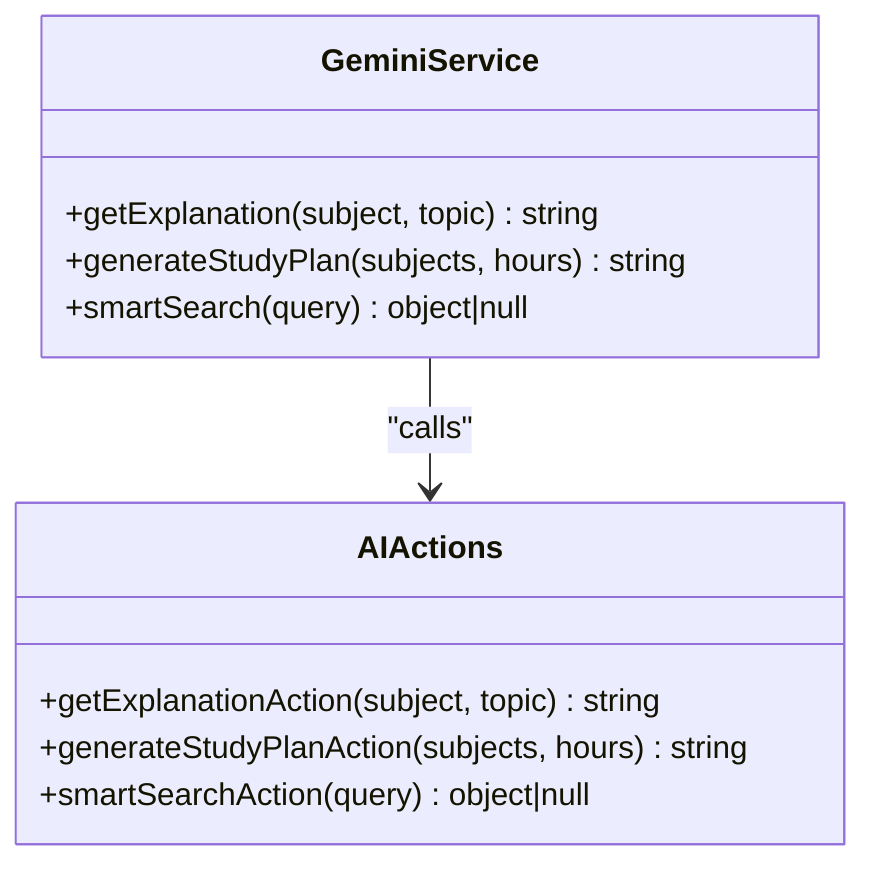
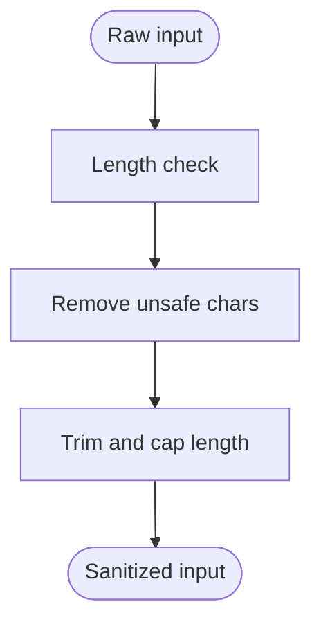
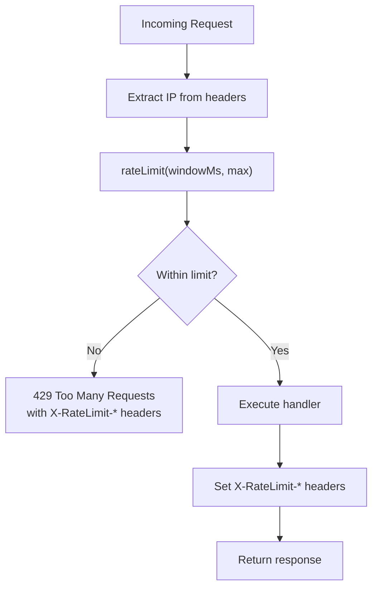
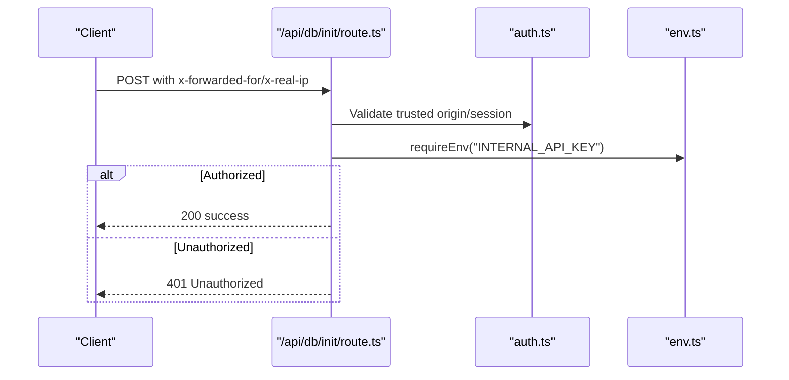
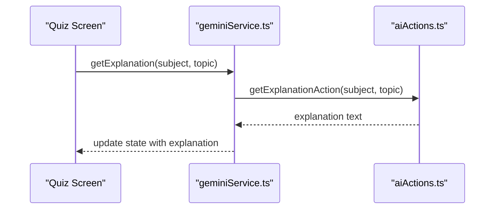
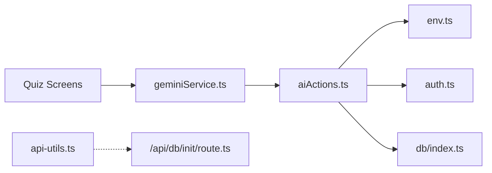

# API Integration Patterns

<cite>
**Referenced Files in This Document**
- [aiActions.ts](file://src/services/aiActions.ts)
- [geminiService.ts](file://src/services/geminiService.ts)
- [api-utils.ts](file://src/lib/api-utils.ts)
- [env.ts](file://src/lib/env.ts)
- [auth.ts](file://src/lib/auth.ts)
- [db/index.ts](file://src/lib/db/index.ts)
- [route.ts](file://src/app/api/db/init/route.ts)
- [route.ts](file://src/app/api/health/route.ts)
- [route.ts](file://src/app/api/uploadthing/route.ts)
- [PhysicsQuiz.tsx](file://src/screens/PhysicsQuiz.tsx)
- [EnhancedTestQuiz.tsx](file://src/screens/EnhancedTestQuiz.tsx)
- [ErrorBoundary.tsx](file://src/components/ErrorBoundary.tsx)
- [error.tsx](file://src/app/error.tsx)
- [package.json](file://package.json)
</cite>

## Table of Contents
1. [Introduction](#introduction)
2. [Project Structure](#project-structure)
3. [Core Components](#core-components)
4. [Architecture Overview](#architecture-overview)
5. [Detailed Component Analysis](#detailed-component-analysis)
6. [Dependency Analysis](#dependency-analysis)
7. [Performance Considerations](#performance-considerations)
8. [Troubleshooting Guide](#troubleshooting-guide)
9. [Conclusion](#conclusion)

## Introduction
This document explains the AI API integration patterns used in MatricMaster AI. It focuses on how server actions encapsulate secure AI interactions, validate and sanitize inputs, process and format AI responses, and apply rate limiting and cost-conscious strategies. It also covers security considerations such as authentication, authorization, and data protection, and provides practical examples and best practices for integrating AI APIs safely and efficiently.

## Project Structure
MatricMaster AI organizes AI-related logic into dedicated service modules and integrates them with frontend screens and backend utilities. The key areas are:
- AI actions: server-side functions that call the Gemini API with validated and sanitized inputs.
- Service wrappers: thin client-facing wrappers around server actions.
- Utilities: rate limiting, environment validation, and API response helpers.
- Authentication and authorization: session management and internal API guards.
- Frontend integration: quiz screens that trigger AI explanations and display results.



**Diagram sources**
- [PhysicsQuiz.tsx](file://src/screens/PhysicsQuiz.tsx#L1-L200)
- [EnhancedTestQuiz.tsx](file://src/screens/EnhancedTestQuiz.tsx#L650-L846)
- [geminiService.ts](file://src/services/geminiService.ts#L1-L14)
- [aiActions.ts](file://src/services/aiActions.ts#L1-L168)
- [api-utils.ts](file://src/lib/api-utils.ts#L1-L93)
- [env.ts](file://src/lib/env.ts#L1-L62)
- [auth.ts](file://src/lib/auth.ts#L1-L103)
- [db/index.ts](file://src/lib/db/index.ts#L1-L102)
- [route.ts](file://src/app/api/db/init/route.ts#L1-L49)
- [route.ts](file://src/app/api/health/route.ts#L1-L30)
- [route.ts](file://src/app/api/uploadthing/route.ts#L1-L12)

**Section sources**
- [aiActions.ts](file://src/services/aiActions.ts#L1-L168)
- [geminiService.ts](file://src/services/geminiService.ts#L1-L14)
- [api-utils.ts](file://src/lib/api-utils.ts#L1-L93)
- [env.ts](file://src/lib/env.ts#L1-L62)
- [auth.ts](file://src/lib/auth.ts#L1-L103)
- [db/index.ts](file://src/lib/db/index.ts#L1-L102)
- [route.ts](file://src/app/api/db/init/route.ts#L1-L49)
- [route.ts](file://src/app/api/health/route.ts#L1-L30)
- [route.ts](file://src/app/api/uploadthing/route.ts#L1-L12)
- [PhysicsQuiz.tsx](file://src/screens/PhysicsQuiz.tsx#L1-L200)
- [EnhancedTestQuiz.tsx](file://src/screens/EnhancedTestQuiz.tsx#L650-L846)

## Core Components
- AI Actions: Encapsulate Gemini API calls with input validation, sanitization, and robust error handling. They return user-friendly messages on failure and structured data for JSON responses.
- Service Wrappers: Provide client-side functions that call server actions, simplifying frontend integration.
- Environment Validation: Centralized Zod-based validation for environment variables, including AI API keys.
- Rate Limiting Utilities: Middleware to throttle requests by IP with informative headers.
- Authentication and Authorization: Better Auth integration for session management and internal API guards for privileged endpoints.
- Frontend Integration: Quiz screens trigger AI explanations and render results with graceful fallbacks.

**Section sources**
- [aiActions.ts](file://src/services/aiActions.ts#L1-L168)
- [geminiService.ts](file://src/services/geminiService.ts#L1-L14)
- [api-utils.ts](file://src/lib/api-utils.ts#L1-L93)
- [env.ts](file://src/lib/env.ts#L1-L62)
- [auth.ts](file://src/lib/auth.ts#L1-L103)
- [PhysicsQuiz.tsx](file://src/screens/PhysicsQuiz.tsx#L164-L200)
- [EnhancedTestQuiz.tsx](file://src/screens/EnhancedTestQuiz.tsx#L650-L846)

## Architecture Overview
The AI integration follows a layered pattern:
- Frontend triggers AI via service wrappers.
- Service wrappers call server actions.
- Server actions validate and sanitize inputs, then call the Gemini API.
- Responses are transformed and returned to the client.
- Internal backend routes enforce authorization and integrate with utilities for health and uploads.



**Diagram sources**
- [PhysicsQuiz.tsx](file://src/screens/PhysicsQuiz.tsx#L164-L200)
- [geminiService.ts](file://src/services/geminiService.ts#L1-L14)
- [aiActions.ts](file://src/services/aiActions.ts#L42-L78)
- [env.ts](file://src/lib/env.ts#L1-L62)
- [auth.ts](file://src/lib/auth.ts#L1-L103)
- [db/index.ts](file://src/lib/db/index.ts#L1-L102)

## Detailed Component Analysis

### AI Actions: Secure Server-Side Integration
- Purpose: Encapsulate all AI interactions on the server, ensuring secrets remain hidden and inputs are validated.
- Input Validation: Zod schemas define strict constraints for subject/topic, subjects/hours, and query length.
- Sanitization: Removes unsafe characters and trims inputs to prevent prompt injection and limit payload size.
- API Call: Uses the Gemini client to generate content with carefully crafted prompts.
- Response Formatting: Returns plain text for explanations and JSON-like objects for smart search, with robust parsing and type checks.
- Error Handling: Distinguishes validation errors from runtime errors, logs failures, and returns user-friendly messages.



**Diagram sources**
- [aiActions.ts](file://src/services/aiActions.ts#L42-L78)

**Section sources**
- [aiActions.ts](file://src/services/aiActions.ts#L1-L168)

### Service Wrappers: Client-Friendly Facades
- Role: Thin wrappers around server actions to simplify frontend consumption.
- Behavior: Expose async functions that call server actions and return their results.



**Diagram sources**
- [geminiService.ts](file://src/services/geminiService.ts#L1-L14)
- [aiActions.ts](file://src/services/aiActions.ts#L42-L168)

**Section sources**
- [geminiService.ts](file://src/services/geminiService.ts#L1-L14)

### Input Validation and Sanitization
- Validation: Zod schemas enforce minimum/maximum lengths and array bounds for AI requests.
- Sanitization: Removes potentially dangerous characters and limits input size.
- Safety Checks: Model selection and prompt construction mitigate misuse and reduce hallucinations.



**Diagram sources**
- [aiActions.ts](file://src/services/aiActions.ts#L34-L40)

**Section sources**
- [aiActions.ts](file://src/services/aiActions.ts#L6-L18)
- [aiActions.ts](file://src/services/aiActions.ts#L34-L40)

### Response Processing and Formatting
- Text Responses: Return raw text from the model with fallbacks for empty responses.
- JSON Responses: For smart search, strip code block markers, parse JSON, and validate shape before returning.
- Error Handling: Catch validation and runtime errors, log them, and return user-friendly messages.

```mermaid
sequenceDiagram
participant ACT as "aiActions.ts"
participant RESP as "Response"
ACT->>RESP : generateContent()
alt JSON response expected
RESP-->>ACT : "
```json ... ```"
    ACT->>ACT: cleanJson()
    ACT->>ACT: JSON.parse()
    ACT->>ACT: validate shape {suggestions[], tip}
    ACT-->>Client: {suggestions, tip}
  else Text response
    RESP-->>ACT: text
    ACT-->>Client: text or fallback
  end
```

**Diagram sources**
- [aiActions.ts](file://src/services/aiActions.ts#L116-L168)

**Section sources**
- [aiActions.ts](file://src/services/aiActions.ts#L116-L168)

### Rate Limiting and Cost Optimization
- Rate Limiting: Middleware that tracks requests per IP within a sliding window and returns informative headers.
- Cost Optimization: Uses a fast model for lightweight tasks, applies input sanitization to reduce token usage, and returns concise prompts.



**Diagram sources**
- [api-utils.ts](file://src/lib/api-utils.ts#L18-L78)

**Section sources**
- [api-utils.ts](file://src/lib/api-utils.ts#L1-L93)

### Security Considerations
- Authentication and Authorization: Better Auth manages sessions and plugins; internal routes enforce authorization via trusted origins and optional shared secret headers.
- Environment Protection: Centralized environment validation prevents accidental exposure of secrets and enforces required keys.
- Data Protection: Inputs are sanitized and trimmed; server actions avoid echoing raw user input in prompts.



**Diagram sources**
- [route.ts](file://src/app/api/db/init/route.ts#L1-L49)
- [auth.ts](file://src/lib/auth.ts#L48-L69)
- [env.ts](file://src/lib/env.ts#L47-L56)

**Section sources**
- [auth.ts](file://src/lib/auth.ts#L1-L103)
- [route.ts](file://src/app/api/db/init/route.ts#L1-L49)
- [env.ts](file://src/lib/env.ts#L1-L62)

### Frontend Integration Examples
- Physics Quiz: Triggers AI explanations for questions, displays loading states, and renders AI-provided text with graceful error handling.
- Enhanced Test Quiz: Provides an “Explain” toggle that fetches AI explanations and shows them below options.



**Diagram sources**
- [PhysicsQuiz.tsx](file://src/screens/PhysicsQuiz.tsx#L164-L200)
- [EnhancedTestQuiz.tsx](file://src/screens/EnhancedTestQuiz.tsx#L650-L846)
- [geminiService.ts](file://src/services/geminiService.ts#L1-L14)
- [aiActions.ts](file://src/services/aiActions.ts#L42-L78)

**Section sources**
- [PhysicsQuiz.tsx](file://src/screens/PhysicsQuiz.tsx#L164-L200)
- [EnhancedTestQuiz.tsx](file://src/screens/EnhancedTestQuiz.tsx#L650-L846)
- [geminiService.ts](file://src/services/geminiService.ts#L1-L14)

## Dependency Analysis
- External Dependencies: The project relies on the Gemini SDK and Zod for validation.
- Internal Dependencies: Services depend on server actions; server actions depend on environment validation and authentication utilities; frontend screens depend on service wrappers.



**Diagram sources**
- [PhysicsQuiz.tsx](file://src/screens/PhysicsQuiz.tsx#L1-L200)
- [EnhancedTestQuiz.tsx](file://src/screens/EnhancedTestQuiz.tsx#L650-L846)
- [geminiService.ts](file://src/services/geminiService.ts#L1-L14)
- [aiActions.ts](file://src/services/aiActions.ts#L1-L168)
- [env.ts](file://src/lib/env.ts#L1-L62)
- [auth.ts](file://src/lib/auth.ts#L1-L103)
- [db/index.ts](file://src/lib/db/index.ts#L1-L102)
- [route.ts](file://src/app/api/db/init/route.ts#L1-L49)
- [api-utils.ts](file://src/lib/api-utils.ts#L1-L93)

**Section sources**
- [package.json](file://package.json#L27-L64)
- [aiActions.ts](file://src/services/aiActions.ts#L1-L168)
- [geminiService.ts](file://src/services/geminiService.ts#L1-L14)
- [api-utils.ts](file://src/lib/api-utils.ts#L1-L93)
- [env.ts](file://src/lib/env.ts#L1-L62)
- [auth.ts](file://src/lib/auth.ts#L1-L103)
- [db/index.ts](file://src/lib/db/index.ts#L1-L102)
- [route.ts](file://src/app/api/db/init/route.ts#L1-L49)

## Performance Considerations
- Prompt Efficiency: Keep prompts concise and focused to reduce token usage and latency.
- Input Size Limits: Enforce strict maximum lengths to cap payload sizes.
- Caching Strategies: Consider caching repeated explanations or search suggestions at the application layer if appropriate.
- Model Selection: Use lighter models for simpler tasks to optimize cost and latency.
- Rate Limiting: Apply sliding-window rate limiting to protect downstream APIs and maintain fair usage.

[No sources needed since this section provides general guidance]

## Troubleshooting Guide
- AI Features Disabled: If the API key is missing, server actions return a user-friendly message. Verify environment configuration.
- Validation Errors: Zod-based validation rejects malformed inputs; ensure clients send properly formatted data.
- Network Failures: Server actions log errors and return fallback messages; check network connectivity and API quotas.
- Frontend Errors: Use the global error boundaries to capture and display friendly error states.

**Section sources**
- [aiActions.ts](file://src/services/aiActions.ts#L24-L28)
- [aiActions.ts](file://src/services/aiActions.ts#L71-L77)
- [ErrorBoundary.tsx](file://src/components/ErrorBoundary.tsx#L1-L74)
- [error.tsx](file://src/app/error.tsx#L1-L52)

## Conclusion
MatricMaster AI’s integration pattern emphasizes security, reliability, and user experience. Server actions encapsulate AI interactions, enforce strict validation and sanitization, and provide robust error handling. Utilities offer rate limiting and standardized API responses, while authentication and authorization controls protect internal endpoints. By following these patterns, teams can safely scale AI features, manage costs, and deliver responsive experiences.