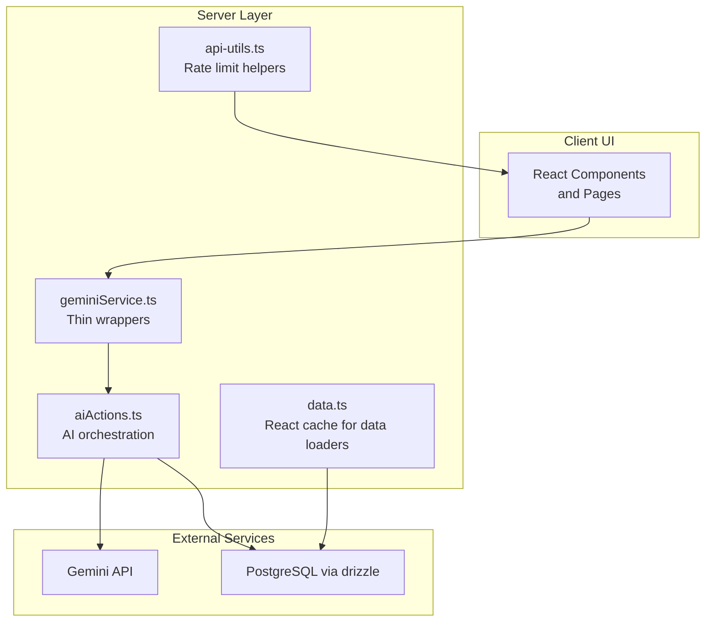
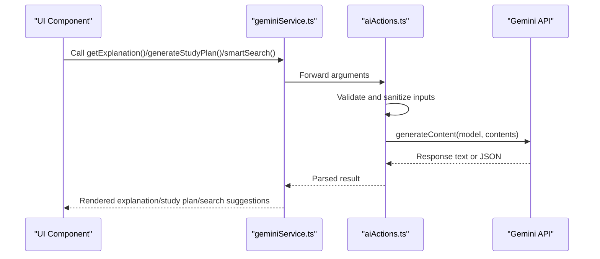
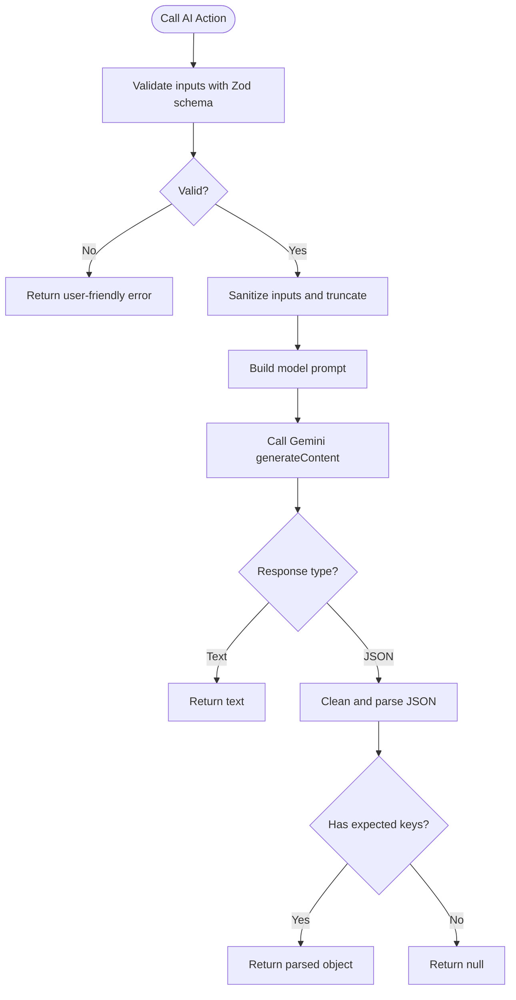
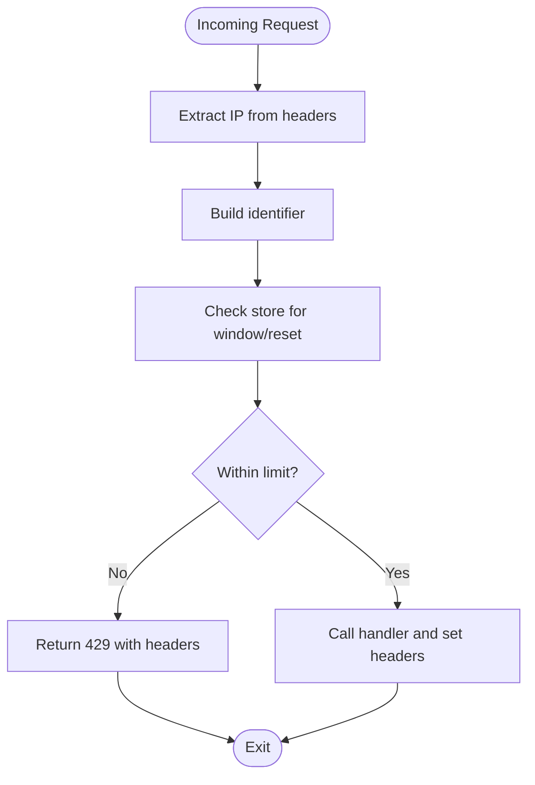
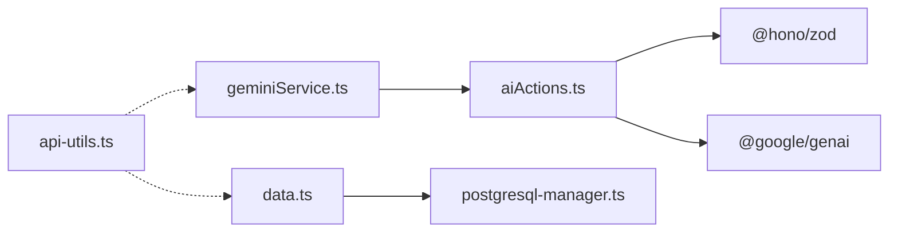

# Performance Optimization

<cite>
**Referenced Files in This Document**
- [geminiService.ts](file://src/services/geminiService.ts)
- [aiActions.ts](file://src/services/aiActions.ts)
- [api-utils.ts](file://src/lib/api-utils.ts)
- [data.ts](file://src/lib/data.ts)
- [health.ts](file://src/lib/db/health.ts)
- [postgresql-manager.ts](file://src/lib/db/postgresql-manager.ts)
- [.env.example](file://.env.example)
- [.env.local](file://.env.local)
- [proxy.ts](file://src/proxy.ts)
</cite>

## Table of Contents
1. [Introduction](#introduction)
2. [Project Structure](#project-structure)
3. [Core Components](#core-components)
4. [Architecture Overview](#architecture-overview)
5. [Detailed Component Analysis](#detailed-component-analysis)
6. [Dependency Analysis](#dependency-analysis)
7. [Performance Considerations](#performance-considerations)
8. [Troubleshooting Guide](#troubleshooting-guide)
9. [Conclusion](#conclusion)

## Introduction
This document focuses on performance optimization strategies for the AI integration system. It covers caching mechanisms to reduce AI API calls and improve response times, current request handling characteristics, and practical guidance for batching/queuing, cost optimization, monitoring/analytics, memory management, and scalability planning. Where the codebase does not yet implement certain optimizations, this document provides recommended patterns and implementation examples to guide future enhancements.

## Project Structure
The AI integration is primarily implemented in two layers:
- Service facade: thin wrappers around AI actions
- AI action handlers: validate inputs, sanitize, and call the Gemini client

Supporting infrastructure includes:
- Rate limiting utilities for API protection
- Caching via React Server Components cache for data loaders
- Database health and connection management utilities
- Environment configuration for AI and database credentials

**Diagram sources**
- [geminiService.ts](file://src/services/geminiService.ts#L1-L14)
- [aiActions.ts](file://src/services/aiActions.ts#L1-L168)
- [data.ts](file://src/lib/data.ts#L66-L79)
- [api-utils.ts](file://src/lib/api-utils.ts#L1-L93)

**Section sources**
- [geminiService.ts](file://src/services/geminiService.ts#L1-L14)
- [aiActions.ts](file://src/services/aiActions.ts#L1-L168)
- [api-utils.ts](file://src/lib/api-utils.ts#L1-L93)
- [data.ts](file://src/lib/data.ts#L1-L120)

## Core Components
- AI service facade: exports async functions that delegate to AI action handlers.
- AI action handlers: validate inputs, sanitize, construct prompts, and call the Gemini client. They also parse JSON responses when required.
- Rate limiting utilities: provide middleware to throttle requests and expose rate limit headers.
- Data loaders with caching: wrap data-fetching functions with React cache to avoid redundant server work.
- Database health and connection manager: manage connections and health checks for reliable data access.

**Section sources**
- [geminiService.ts](file://src/services/geminiService.ts#L1-L14)
- [aiActions.ts](file://src/services/aiActions.ts#L42-L167)
- [api-utils.ts](file://src/lib/api-utils.ts#L18-L78)
- [data.ts](file://src/lib/data.ts#L66-L79)
- [health.ts](file://src/lib/db/health.ts#L1-L40)
- [postgresql-manager.ts](file://src/lib/db/postgresql-manager.ts#L52-L108)

## Architecture Overview
The AI request lifecycle follows a predictable flow: UI triggers a service wrapper, which calls an action handler that validates and sanitizes inputs, constructs a prompt, and invokes the Gemini client. Responses are returned to the UI after minimal processing.

**Diagram sources**
- [geminiService.ts](file://src/services/geminiService.ts#L3-L13)
- [aiActions.ts](file://src/services/aiActions.ts#L42-L167)

## Detailed Component Analysis

### AI Action Handlers: Validation, Sanitization, and Prompt Construction
- Input validation: Zod schemas define allowed shapes and bounds for inputs.
- Sanitization: Removes unsafe characters and truncates to prevent oversized prompts.
- Prompt construction: Uses concise, curriculum-aligned instructions tailored to the operation.
- Response parsing: For JSON-returning operations, cleans fenced JSON and validates structure before returning.

**Diagram sources**
- [aiActions.ts](file://src/services/aiActions.ts#L42-L167)

**Section sources**
- [aiActions.ts](file://src/services/aiActions.ts#L42-L167)

### Service Facade: Thin Wrappers
- Exposes async functions that delegate to action handlers.
- Enables future refactoring to add caching, batching, or retries without changing callers.

**Section sources**
- [geminiService.ts](file://src/services/geminiService.ts#L1-L14)

### Rate Limiting Utilities
- Provides a configurable sliding-window rate limiter.
- Middleware attaches X-RateLimit-* headers and returns 429 when exceeded.

**Diagram sources**
- [api-utils.ts](file://src/lib/api-utils.ts#L18-L78)

**Section sources**
- [api-utils.ts](file://src/lib/api-utils.ts#L18-L78)

### Data Loaders with Caching
- React cache is applied to server-side data loaders to avoid repeated computation and database queries.
- Particularly beneficial for dashboard stats and user profile data.

**Section sources**
- [data.ts](file://src/lib/data.ts#L66-L79)
- [data.ts](file://src/lib/data.ts#L99-L119)

### Database Health and Connection Management
- Connection pooling and SSL configuration for Neon.
- Health checks and timeouts to ensure reliability during startup and runtime.

**Section sources**
- [postgresql-manager.ts](file://src/lib/db/postgresql-manager.ts#L52-L108)
- [health.ts](file://src/lib/db/health.ts#L1-L40)

## Dependency Analysis
- AI actions depend on the Gemini client and Zod for validation.
- Service facade depends on AI actions.
- Data loaders depend on the database manager and schema.
- Rate limiting utilities are independent and can wrap any handler.

**Diagram sources**
- [geminiService.ts](file://src/services/geminiService.ts#L1-L14)
- [aiActions.ts](file://src/services/aiActions.ts#L3-L4)
- [data.ts](file://src/lib/data.ts#L8-L9)
- [postgresql-manager.ts](file://src/lib/db/postgresql-manager.ts#L52-L108)
- [api-utils.ts](file://src/lib/api-utils.ts#L1-L93)

**Section sources**
- [geminiService.ts](file://src/services/geminiService.ts#L1-L14)
- [aiActions.ts](file://src/services/aiActions.ts#L1-L168)
- [data.ts](file://src/lib/data.ts#L1-L120)
- [api-utils.ts](file://src/lib/api-utils.ts#L1-L93)
- [postgresql-manager.ts](file://src/lib/db/postgresql-manager.ts#L52-L108)

## Performance Considerations

### Caching Mechanisms
- Current state: React cache is used for data loaders to avoid recomputation and DB hits.
- Recommended additions:
  - Application-level cache for AI responses keyed by input signature (subject/topic or subjects/hours/query).
  - TTL-aware cache with invalidation on content changes.
  - Separate caches for explanations, study plans, and search suggestions to decouple lifetimes.

Implementation pattern references:
- React cache usage in data loaders: [getDashboardStats](file://src/lib/data.ts#L66-L79), [getUserProfile](file://src/lib/data.ts#L99-L119)

**Section sources**
- [data.ts](file://src/lib/data.ts#L66-L79)
- [data.ts](file://src/lib/data.ts#L99-L119)

### Request Batching and Queuing
- Current state: No explicit batching or queueing for AI operations.
- Recommended strategies:
  - Batching: Group similar AI requests (e.g., multiple explanations for the same topic) and deduplicate.
  - Queuing: Use a bounded queue with priorities (e.g., user-triggered vs. scheduled) and concurrency limits.
  - Backpressure: Reject or defer when queue depth exceeds thresholds.

[No sources needed since this section provides general guidance]

### Cost Optimization
- Token usage management:
  - Keep prompts concise and within model limits.
  - Use structured JSON output when appropriate to reduce ambiguity and token waste.
- Response size optimization:
  - Truncate inputs and avoid unnecessary context in prompts.
  - Return only required fields from JSON responses.
- Intelligent retry mechanisms:
  - Retry transient failures with exponential backoff.
  - Fail fast on validation or permanent errors.

[No sources needed since this section provides general guidance]

### Monitoring and Analytics
- Track:
  - Request latency and success rates per AI operation.
  - Token consumption estimates and cost per operation.
  - Error rates and retry counts.
- Suggested metrics:
  - Throughput (requests/sec), p50/p95 latency, error percentage, cache hit ratio.
- Storage: Persist metrics to a lightweight analytics backend or logs.

[No sources needed since this section provides general guidance]

### Memory Management for Large Responses
- Stream responses when supported by the underlying client.
- Paginate or chunk large datasets returned by AI.
- Avoid retaining large intermediate strings; process incrementally.

[No sources needed since this section provides general guidance]

### Optimization Techniques by Operation Type
- Explanations: Cache by subject/topic; consider precomputing popular topics.
- Study plans: Cache by subjects/hours; invalidate on curriculum changes.
- Smart search: Cache by query; refresh periodically to keep suggestions fresh.

[No sources needed since this section provides general guidance]

### Scalability, Load Balancing, and Capacity Planning
- Horizontal scaling: Deploy multiple instances behind a load balancer.
- Database: Use connection pooling and consider read replicas for heavy reads.
- AI provider: Monitor quotas and provision additional capacity proactively.
- Capacity planning: Track growth trends and set alarms for latency and error rate thresholds.

[No sources needed since this section provides general guidance]

## Troubleshooting Guide
- AI features disabled:
  - Ensure the Gemini API key is configured in environment variables.
  - Verify environment files and runtime configuration.
- Database connectivity:
  - Use health checks to confirm connection readiness.
  - Adjust timeouts and pooling parameters for production environments.
- Rate limiting:
  - Inspect X-RateLimit-* headers to diagnose throttling.
  - Tune window and max values based on traffic patterns.

**Section sources**
- [.env.example](file://.env.example#L8-L10)
- [.env.local](file://.env.local#L15-L16)
- [health.ts](file://src/lib/db/health.ts#L1-L40)
- [api-utils.ts](file://src/lib/api-utils.ts#L40-L78)

## Conclusion
The AI integration currently emphasizes correctness and safety with input validation, sanitization, and structured JSON handling. To achieve optimal performance, introduce application-level caching for AI responses, implement batching/queuing for concurrent operations, adopt cost-conscious prompt engineering, and instrument robust monitoring. These enhancements will improve responsiveness, reduce costs, and scale effectively under growing demand.