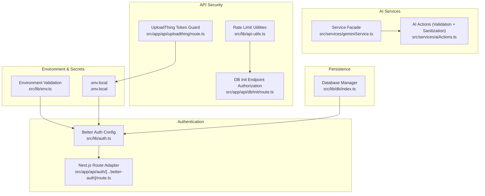
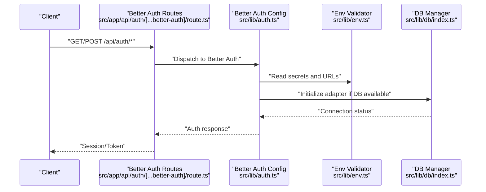
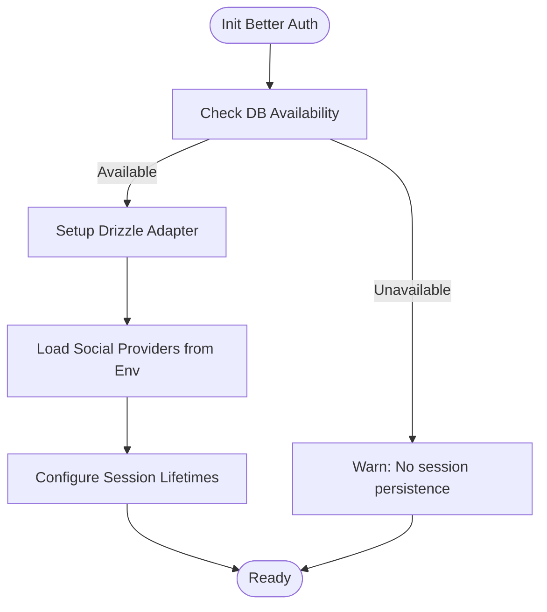
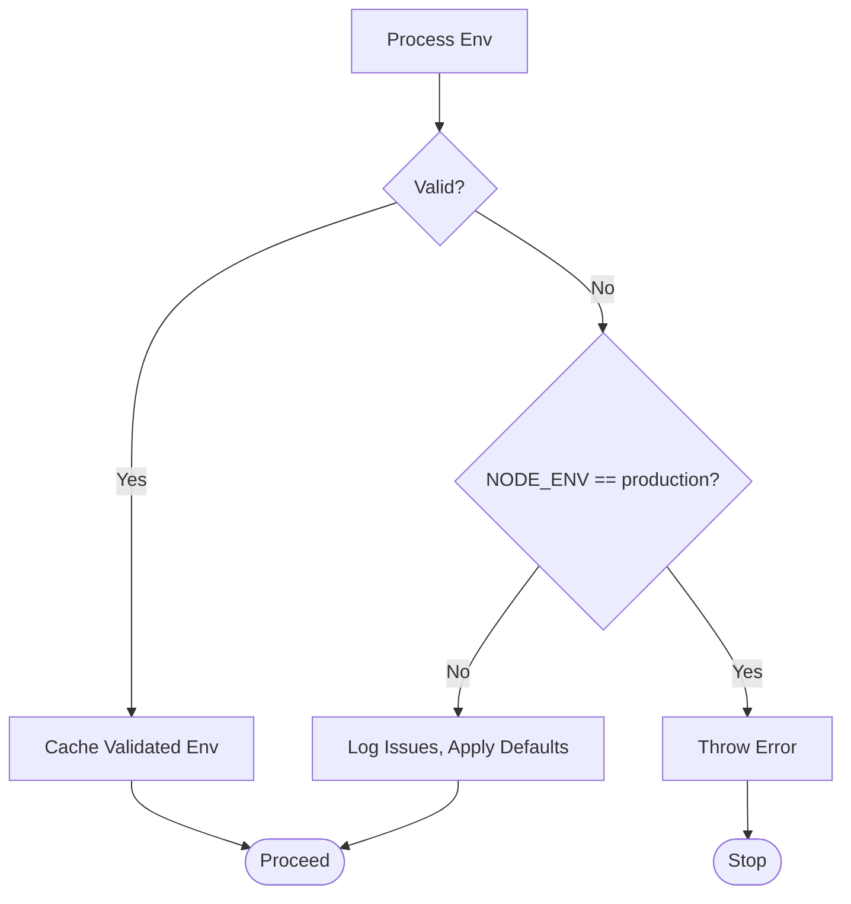
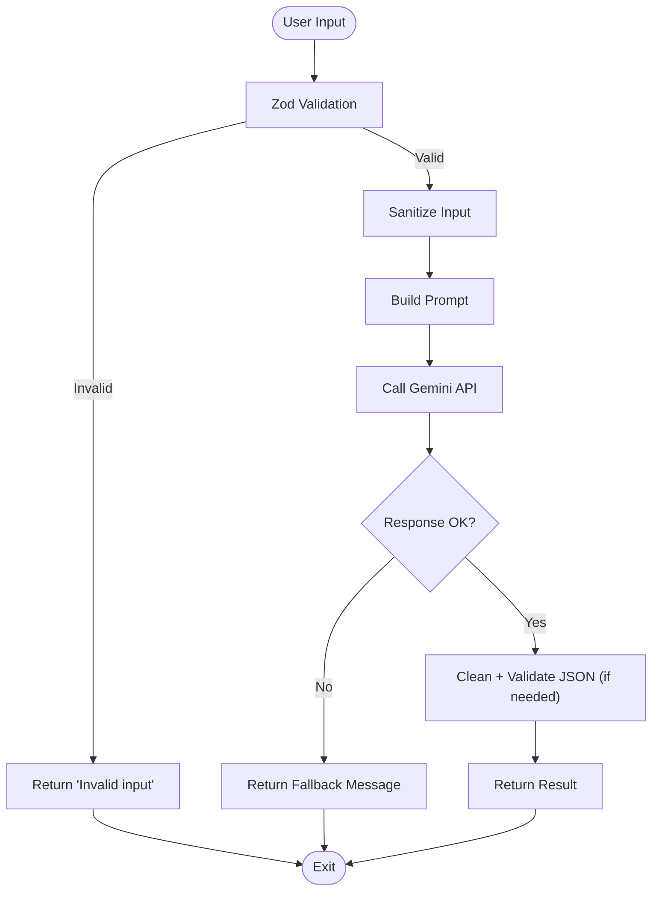
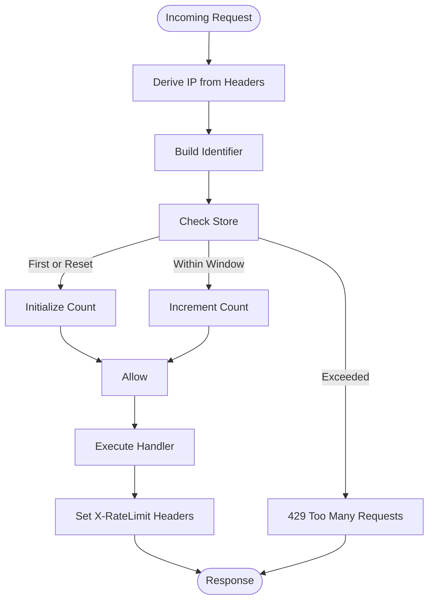
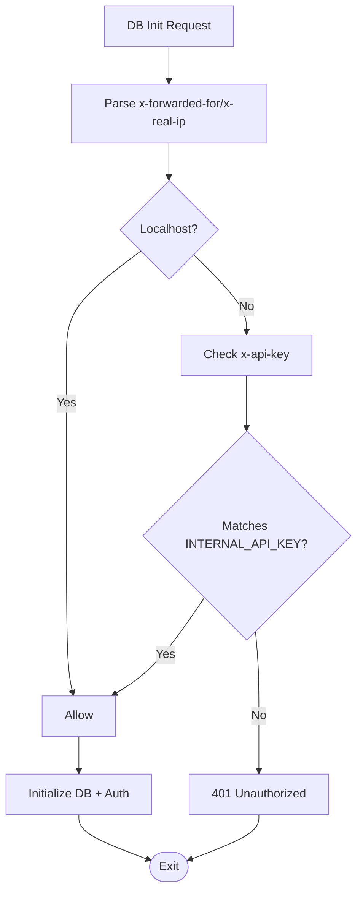
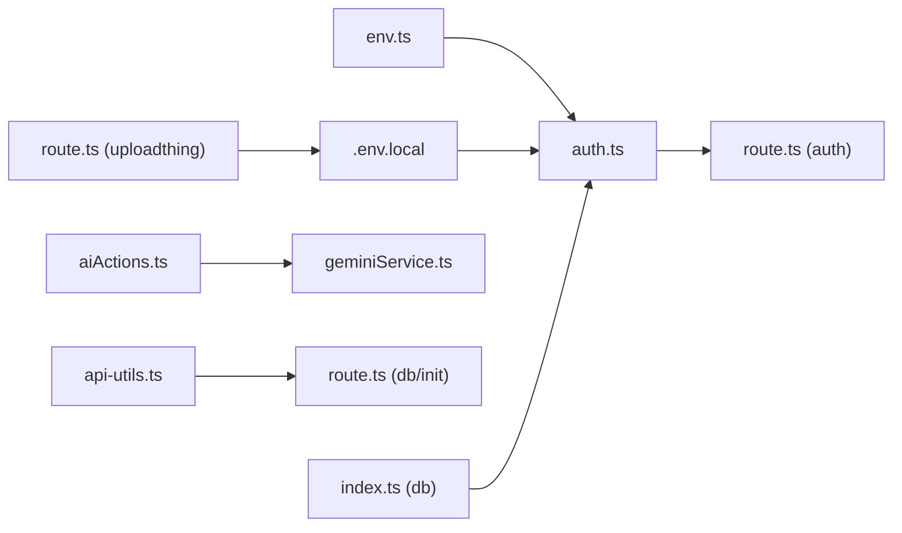

# Security and Safety Measures

<cite>
**Referenced Files in This Document**
- [auth.ts](file://src/lib/auth.ts)
- [route.ts](file://src/app/api/auth/[...better-auth]/route.ts)
- [env.ts](file://src/lib/env.ts)
- [.env.local](file://.env.local)
- [aiActions.ts](file://src/services/aiActions.ts)
- [geminiService.ts](file://src/services/geminiService.ts)
- [api-utils.ts](file://src/lib/api-utils.ts)
- [route.ts](file://src/app/api/db/init/route.ts)
- [index.ts](file://src/lib/db/index.ts)
- [route.ts](file://src/app/api/uploadthing/route.ts)
</cite>

## Table of Contents
1. [Introduction](#introduction)
2. [Project Structure](#project-structure)
3. [Core Components](#core-components)
4. [Architecture Overview](#architecture-overview)
5. [Detailed Component Analysis](#detailed-component-analysis)
6. [Dependency Analysis](#dependency-analysis)
7. [Performance Considerations](#performance-considerations)
8. [Troubleshooting Guide](#troubleshooting-guide)
9. [Conclusion](#conclusion)
10. [Appendices](#appendices)

## Introduction
This document details the security and safety measures implemented in the AI integration system. It focuses on input sanitization and validation to prevent prompt injection, content filtering for educational appropriateness, authentication and authorization patterns securing AI API access, rate limiting and usage monitoring to prevent abuse, and logging mechanisms for audit trails. Ethical considerations and compliance with educational standards and data protection regulations are addressed alongside practical implementation examples and best practices.

## Project Structure
Security-related capabilities span several layers:
- Authentication and session management via Better Auth
- Environment validation and secrets handling
- AI service input validation and sanitization
- API authorization guards and rate limiting utilities
- Database connectivity and initialization safeguards
- UploadThing integration with token-based configuration

**Diagram sources**
- [auth.ts](file://src/lib/auth.ts#L1-L103)
- [route.ts](file://src/app/api/auth/[...better-auth]/route.ts#L1-L5)
- [env.ts](file://src/lib/env.ts#L1-L62)
- [.env.local](file://.env.local#L1-L37)
- [aiActions.ts](file://src/services/aiActions.ts#L1-L168)
- [geminiService.ts](file://src/services/geminiService.ts#L1-L14)
- [api-utils.ts](file://src/lib/api-utils.ts#L1-L93)
- [route.ts](file://src/app/api/db/init/route.ts#L1-L100)
- [index.ts](file://src/lib/db/index.ts#L1-L102)
- [route.ts](file://src/app/api/uploadthing/route.ts#L1-L12)

**Section sources**
- [auth.ts](file://src/lib/auth.ts#L1-L103)
- [env.ts](file://src/lib/env.ts#L1-L62)
- [aiActions.ts](file://src/services/aiActions.ts#L1-L168)
- [api-utils.ts](file://src/lib/api-utils.ts#L1-L93)
- [route.ts](file://src/app/api/db/init/route.ts#L1-L100)
- [index.ts](file://src/lib/db/index.ts#L1-L102)
- [route.ts](file://src/app/api/uploadthing/route.ts#L1-L12)

## Core Components
- Authentication and Authorization
  - Better Auth configured with email/password and optional social providers, trusted origins, and session lifetimes.
  - Next.js adapter exposes Better Auth endpoints.
  - DB availability influences persistence; warnings are logged when unavailable.
- Environment Validation and Secrets
  - Zod-based environment schema enforces presence and shape of secrets and URLs.
  - Production strictness with explicit errors; development defaults with warnings.
- AI Input Sanitization and Validation
  - Zod schemas validate and constrain input sizes and types for AI actions.
  - Input sanitization removes dangerous characters and truncates to safe lengths.
  - JSON responses are cleaned and validated before parsing.
- Rate Limiting and Usage Monitoring
  - In-memory rate limiter keyed by IP with sliding window semantics.
  - Middleware attaches X-RateLimit headers and returns 429 on overflow.
- Database Initialization Guards
  - Localhost and shared-secret header checks restrict access to DB init endpoint.
  - Logging distinguishes DB success/failure and auth initialization outcomes.
- UploadThing Token Guard
  - Token-based configuration ensures controlled file uploads.

**Section sources**
- [auth.ts](file://src/lib/auth.ts#L48-L69)
- [route.ts](file://src/app/api/auth/[...better-auth]/route.ts#L1-L5)
- [env.ts](file://src/lib/env.ts#L3-L13)
- [aiActions.ts](file://src/services/aiActions.ts#L6-L18)
- [aiActions.ts](file://src/services/aiActions.ts#L34-L40)
- [api-utils.ts](file://src/lib/api-utils.ts#L18-L38)
- [api-utils.ts](file://src/lib/api-utils.ts#L40-L78)
- [route.ts](file://src/app/api/db/init/route.ts#L5-L28)
- [route.ts](file://src/app/api/db/init/route.ts#L30-L91)
- [route.ts](file://src/app/api/uploadthing/route.ts#L6-L11)

## Architecture Overview
The system integrates authentication, environment security, AI input safety, and API protections around a database manager and AI service layer.

**Diagram sources**
- [route.ts](file://src/app/api/auth/[...better-auth]/route.ts#L1-L5)
- [auth.ts](file://src/lib/auth.ts#L48-L69)
- [env.ts](file://src/lib/env.ts#L19-L45)
- [index.ts](file://src/lib/db/index.ts#L24-L39)

## Detailed Component Analysis

### Authentication and Authorization Patterns
- Trusted Origins and Base URL
  - Base URL and trusted origins are derived from environment variables to mitigate CSRF and open redirect risks.
- Session Management
  - Session lifetime and update age configured for balance between usability and security.
- Social Providers
  - Optional providers gated by environment configuration; missing credentials produce warnings rather than blocking.
- DB Persistence
  - When DB is unavailable, Better Auth falls back to non-persistent sessions with a warning.

**Diagram sources**
- [auth.ts](file://src/lib/auth.ts#L9-L21)
- [auth.ts](file://src/lib/auth.ts#L48-L69)

**Section sources**
- [auth.ts](file://src/lib/auth.ts#L48-L69)
- [route.ts](file://src/app/api/auth/[...better-auth]/route.ts#L1-L5)

### Environment Validation and Secrets Management
- Schema Enforcement
  - URL validation, minimum length for secrets, optional fields for providers and AI keys.
- Strictness by Environment
  - Production throws on invalid env; development logs issues and applies defaults.
- Secret Exposure Prevention
  - API keys and tokens are loaded from environment variables and not hardcoded in code.

**Diagram sources**
- [env.ts](file://src/lib/env.ts#L19-L45)

**Section sources**
- [env.ts](file://src/lib/env.ts#L3-L13)
- [env.ts](file://src/lib/env.ts#L19-L45)
- [.env.local](file://.env.local#L15-L17)

### Input Sanitization and Validation for AI Interactions
- Zod Schemas
  - Enforce minimum/maximum lengths and array constraints for subject/topic, subjects list, and hours.
- Input Sanitization
  - Removes potentially dangerous characters and truncates inputs to safe lengths.
- Prompt Construction
  - Structured prompts guide model behavior for educational, South African Grade 12 context.
- JSON Response Handling
  - Removes code block markers and validates expected keys before parsing.

**Diagram sources**
- [aiActions.ts](file://src/services/aiActions.ts#L42-L78)
- [aiActions.ts](file://src/services/aiActions.ts#L80-L114)
- [aiActions.ts](file://src/services/aiActions.ts#L116-L167)

**Section sources**
- [aiActions.ts](file://src/services/aiActions.ts#L6-L18)
- [aiActions.ts](file://src/services/aiActions.ts#L34-L40)
- [aiActions.ts](file://src/services/aiActions.ts#L54-L70)
- [aiActions.ts](file://src/services/aiActions.ts#L134-L142)

### Content Filtering Mechanisms
- Prompt-Level Guidance
  - Instructions explicitly instruct the model to remain educational, appropriate for Grade 12 learners, and avoid harmful content.
- Output Validation
  - JSON mode and post-processing remove code fences and validate structure to reduce risk of malformed or unsafe outputs.
- Recommendations
  - Integrate external content filters or LLM safety features for additional layers.
  - Maintain curated topic lists and deny-lists for sensitive subjects.

[No sources needed since this section provides general guidance]

### Rate Limiting and Usage Monitoring
- Sliding Window Implementation
  - Tracks counts per IP and reset times; rejects requests exceeding limits.
- Middleware Integration
  - Attaches X-RateLimit-* headers and returns 429 on overflow.
- Practical Usage
  - Apply to AI endpoints and bulk operations to cap usage and control costs.

**Diagram sources**
- [api-utils.ts](file://src/lib/api-utils.ts#L18-L38)
- [api-utils.ts](file://src/lib/api-utils.ts#L40-L78)

**Section sources**
- [api-utils.ts](file://src/lib/api-utils.ts#L3-L8)
- [api-utils.ts](file://src/lib/api-utils.ts#L18-L38)
- [api-utils.ts](file://src/lib/api-utils.ts#L40-L78)

### Database Initialization Authorization
- Localhost Allowlist
  - Requests from loopback addresses are permitted.
- Shared Secret Header
  - Programmatic access requires a dedicated internal API key header.
- Logging and Auditing
  - Logs unauthorized attempts and initialization outcomes for auditability.

**Diagram sources**
- [route.ts](file://src/app/api/db/init/route.ts#L5-L28)
- [route.ts](file://src/app/api/db/init/route.ts#L30-L91)

**Section sources**
- [route.ts](file://src/app/api/db/init/route.ts#L5-L28)
- [route.ts](file://src/app/api/db/init/route.ts#L30-L91)

### UploadThing Token Guard
- Token-Based Access
  - UploadThing route handler reads token from environment for protected uploads.
- Recommendations
  - Rotate tokens periodically and restrict allowed file types/mime types.

**Section sources**
- [route.ts](file://src/app/api/uploadthing/route.ts#L6-L11)

### Logging and Audit Trails
- Comprehensive Logging
  - Unauthorized access attempts, DB initialization outcomes, and auth initialization failures are logged with appropriate severities.
- Error Surfaces
  - API utilities centralize error/success responses with environment-aware detail exposure.

**Section sources**
- [route.ts](file://src/app/api/db/init/route.ts#L33-L40)
- [route.ts](file://src/app/api/db/init/route.ts#L44-L91)
- [api-utils.ts](file://src/lib/api-utils.ts#L80-L92)

## Dependency Analysis

**Diagram sources**
- [env.ts](file://src/lib/env.ts#L1-L62)
- [.env.local](file://.env.local#L1-L37)
- [auth.ts](file://src/lib/auth.ts#L1-L103)
- [route.ts](file://src/app/api/auth/[...better-auth]/route.ts#L1-L5)
- [aiActions.ts](file://src/services/aiActions.ts#L1-L168)
- [geminiService.ts](file://src/services/geminiService.ts#L1-L14)
- [api-utils.ts](file://src/lib/api-utils.ts#L1-L93)
- [route.ts](file://src/app/api/db/init/route.ts#L1-L100)
- [index.ts](file://src/lib/db/index.ts#L1-L102)
- [route.ts](file://src/app/api/uploadthing/route.ts#L1-L12)

**Section sources**
- [auth.ts](file://src/lib/auth.ts#L1-L103)
- [aiActions.ts](file://src/services/aiActions.ts#L1-L168)
- [api-utils.ts](file://src/lib/api-utils.ts#L1-L93)
- [route.ts](file://src/app/api/db/init/route.ts#L1-L100)
- [index.ts](file://src/lib/db/index.ts#L1-L102)
- [route.ts](file://src/app/api/uploadthing/route.ts#L1-L12)

## Performance Considerations
- Rate Limiter Scalability
  - Current in-memory store is not suitable for distributed deployments; consider Redis-backed stores for horizontal scaling.
- AI Latency
  - Batch requests and caching of common queries can reduce latency and cost.
- DB Connection Pooling
  - Ensure DB manager leverages pooled connections to minimize overhead.

[No sources needed since this section provides general guidance]

## Troubleshooting Guide
- Authentication Failures
  - Verify base URL, trusted origins, and secret length meet minimum requirements.
  - Confirm DB availability; lack of DB disables session persistence.
- AI Feature Disabled
  - Ensure GEMINI_API_KEY is configured; otherwise AI features are disabled with a warning.
- Unauthorized DB Init
  - Confirm request originates from localhost or includes the correct x-api-key header.
- Rate Limit Exceeded
  - Inspect X-RateLimit-* headers; adjust client-side retry/backoff and increase limits cautiously.

**Section sources**
- [auth.ts](file://src/lib/auth.ts#L23-L31)
- [aiActions.ts](file://src/services/aiActions.ts#L24-L28)
- [route.ts](file://src/app/api/db/init/route.ts#L32-L41)
- [api-utils.ts](file://src/lib/api-utils.ts#L53-L67)

## Conclusion
The system employs layered security and safety controls: robust environment validation, input sanitization and schema-driven validation for AI interactions, rate limiting, and strict authorization for privileged endpoints. While the current in-memory rate limiter is suitable for development, production deployments should adopt distributed storage. Additional content moderation and ethical AI governance policies should accompany technical safeguards to align with educational standards and data protection regulations.

[No sources needed since this section summarizes without analyzing specific files]

## Appendices
- Best Practices Checklist
  - Enforce environment validation in CI/CD pipelines.
  - Use HTTPS and secure cookies for session management.
  - Implement centralized logging with structured audit trails.
  - Add content moderation hooks and deny-lists for sensitive topics.
  - Monitor rate limit metrics and set up alerts for spikes.
  - Regularly rotate secrets and tokens; restrict access to internal APIs.

[No sources needed since this section provides general guidance]