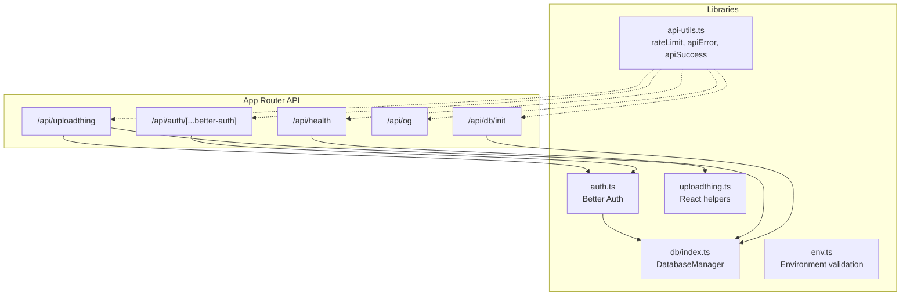
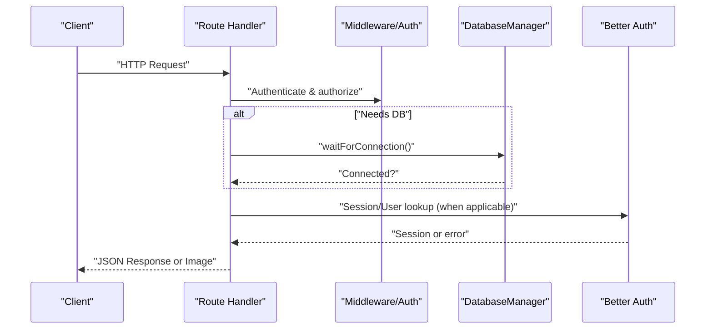
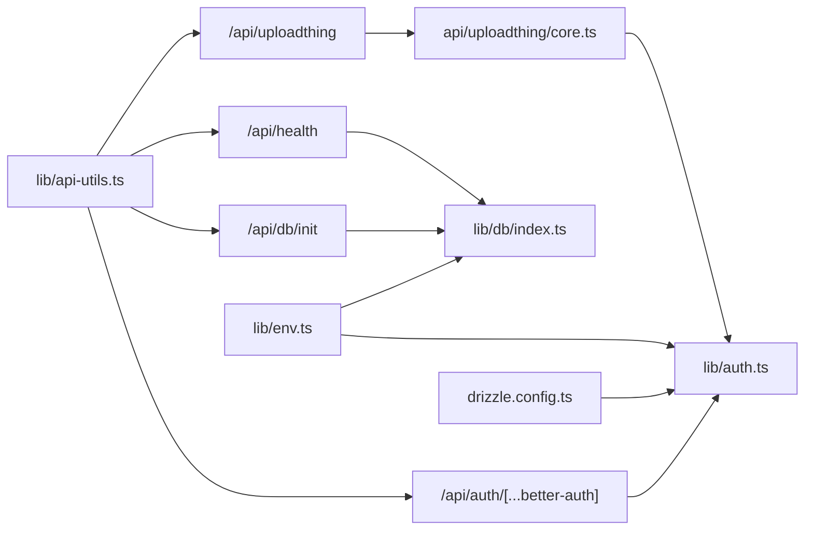
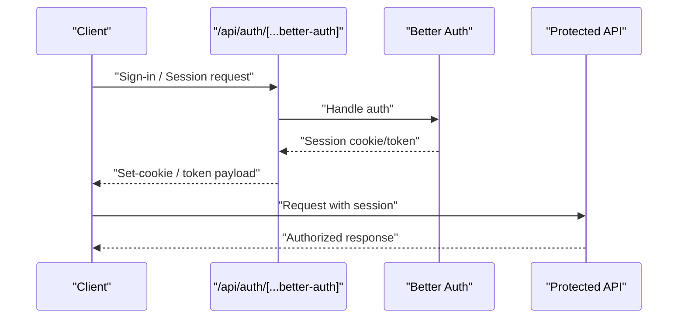

# API Reference

<cite>
**Referenced Files in This Document**
- [route.ts](file://src/app/api/auth/[...better-auth]/route.ts)
- [route.ts](file://src/app/api/db/init/route.ts)
- [route.ts](file://src/app/api/health/route.ts)
- [route.tsx](file://src/app/api/og/route.tsx)
- [route.ts](file://src/app/api/uploadthing/route.ts)
- [core.ts](file://src/app/api/uploadthing/core.ts)
- [api-utils.ts](file://src/lib/api-utils.ts)
- [auth.ts](file://src/lib/auth.ts)
- [db/index.ts](file://src/lib/db/index.ts)
- [env.ts](file://src/lib/env.ts)
- [uploadthing.ts](file://src/lib/uploadthing.ts)
- [drizzle.config.ts](file://drizzle.config.ts)
- [package.json](file://package.json)
</cite>

## Table of Contents
1. [Introduction](#introduction)
2. [Project Structure](#project-structure)
3. [Core Components](#core-components)
4. [Architecture Overview](#architecture-overview)
5. [Detailed Component Analysis](#detailed-component-analysis)
6. [Dependency Analysis](#dependency-analysis)
7. [Performance Considerations](#performance-considerations)
8. [Troubleshooting Guide](#troubleshooting-guide)
9. [Conclusion](#conclusion)
10. [Appendices](#appendices)

## Introduction
This document provides a comprehensive API reference for MatricMaster AI’s backend. It covers all RESTful endpoints under the Next.js App Router API routes, including authentication, database initialization, health checks, Open Graph image generation, and file uploads via UploadThing. For each endpoint, you will find HTTP methods, URL patterns, request/response schemas, authentication requirements, error codes, and practical usage guidance. Security considerations, rate limiting, CORS, content-type handling, and API versioning strategies are also included.

## Project Structure
The backend exposes API endpoints under the Next.js App Router at src/app/api. Each endpoint is implemented as a route module exporting GET/POST handlers. Shared utilities for rate limiting, database connectivity, and authentication are centralized in src/lib.

**Diagram sources**
- [route.ts](file://src/app/api/auth/[...better-auth]/route.ts#L1-L5)
- [route.ts](file://src/app/api/db/init/route.ts#L1-L100)
- [route.ts](file://src/app/api/health/route.ts#L1-L30)
- [route.tsx](file://src/app/api/og/route.tsx#L1-L112)
- [route.ts](file://src/app/api/uploadthing/route.ts#L1-L12)
- [api-utils.ts](file://src/lib/api-utils.ts#L1-L93)
- [auth.ts](file://src/lib/auth.ts#L1-L103)
- [db/index.ts](file://src/lib/db/index.ts#L1-L102)
- [env.ts](file://src/lib/env.ts#L1-L62)
- [uploadthing.ts](file://src/lib/uploadthing.ts#L1-L6)

**Section sources**
- [route.ts](file://src/app/api/auth/[...better-auth]/route.ts#L1-L5)
- [route.ts](file://src/app/api/db/init/route.ts#L1-L100)
- [route.ts](file://src/app/api/health/route.ts#L1-L30)
- [route.tsx](file://src/app/api/og/route.tsx#L1-L112)
- [route.ts](file://src/app/api/uploadthing/route.ts#L1-L12)
- [api-utils.ts](file://src/lib/api-utils.ts#L1-L93)
- [auth.ts](file://src/lib/auth.ts#L1-L103)
- [db/index.ts](file://src/lib/db/index.ts#L1-L102)
- [env.ts](file://src/lib/env.ts#L1-L62)
- [uploadthing.ts](file://src/lib/uploadthing.ts#L1-L6)

## Core Components
- Authentication service powered by Better Auth, integrated with Drizzle adapter and optional social providers.
- Centralized database manager singleton managing PostgreSQL connections and availability.
- Utility functions for standardized API responses and basic in-memory rate limiting.
- UploadThing integration for secure, authenticated file uploads with middleware and completion callbacks.
- Environment validation ensuring required variables are present and typed.

**Section sources**
- [auth.ts](file://src/lib/auth.ts#L1-L103)
- [db/index.ts](file://src/lib/db/index.ts#L1-L102)
- [api-utils.ts](file://src/lib/api-utils.ts#L1-L93)
- [uploadthing.ts](file://src/lib/uploadthing.ts#L1-L6)
- [env.ts](file://src/lib/env.ts#L1-L62)

## Architecture Overview
The API follows Next.js App Router conventions. Each route module exports GET/POST handlers. Authentication is handled by Better Auth, while UploadThing manages file uploads with per-route middleware and completion hooks. Health and database initialization endpoints provide operational insights.

**Diagram sources**
- [route.ts](file://src/app/api/db/init/route.ts#L30-L92)
- [route.ts](file://src/app/api/health/route.ts#L4-L29)
- [core.ts](file://src/app/api/uploadthing/core.ts#L12-L30)
- [auth.ts](file://src/lib/auth.ts#L72-L103)
- [db/index.ts](file://src/lib/db/index.ts#L59-L71)

## Detailed Component Analysis

### Authentication Endpoints
- Path: /api/auth/[...better-auth]
- Methods: GET, POST
- Purpose: Exposes Better Auth endpoints for sign-in, sign-up, sessions, and other auth flows.
- Authentication: Not required for this endpoint; Better Auth handles session creation and verification internally.
- Request/Response: Delegated to Better Auth. Typical responses include session tokens and user info.
- Security: Uses trusted origins configured via environment variables; cookies and CSRF protections are managed by Better Auth.
- Notes: Ensure proper CORS and cookie settings in production.

**Section sources**
- [route.ts](file://src/app/api/auth/[...better-auth]/route.ts#L1-L5)
- [auth.ts](file://src/lib/auth.ts#L48-L69)

### Database Initialization
- Path: /api/db/init
- Methods: GET, POST
- Purpose: Initialize database connection and optionally initialize Better Auth after DB is ready.
- Authentication:
  - GET: No authentication required; returns connectivity status.
  - POST: Requires either localhost origin or a shared secret header.
- Request:
  - POST: No body required.
  - Headers for POST:
    - x-forwarded-for: Optional client IP for origin check.
    - x-api-key: Required shared secret for programmatic access.
- Response (POST):
  - Success: { success: true, message: string, connected: boolean, authInitialized?: boolean }
  - Unauthorized: { success: false, message: "Unauthorized" }
  - DB Failure: { success: false, message: string, connected: false }
  - Internal Error: { success: false, message: string, connected: false }
- Error Codes:
  - 401 Unauthorized (POST)
  - 503 Service Unavailable (DB failure)
  - 500 Internal Server Error (unexpected errors)
- Notes:
  - POST initializes the database connection and attempts to initialize Better Auth.
  - If DB succeeds but auth fails, returns success with a note that auth initialization failed.

**Section sources**
- [route.ts](file://src/app/api/db/init/route.ts#L1-L100)
- [db/index.ts](file://src/lib/db/index.ts#L24-L39)

### Health Check
- Path: /api/health
- Methods: GET
- Purpose: Report service health and database connectivity.
- Authentication: Not required.
- Response:
  - Healthy: { status: "healthy", database: "connected", timestamp: ISOString }
  - Degraded: { status: "degraded", database: "disconnected", timestamp: ISOString }
  - Unhealthy: { status: "unhealthy", database: "error", error: string, timestamp: ISOString }
- Error Codes:
  - 503 Service Unavailable (degraded)
  - 500 Internal Server Error (exception)
- Notes:
  - Uses a short wait-and-check mechanism to confirm DB readiness.

**Section sources**
- [route.ts](file://src/app/api/health/route.ts#L1-L30)
- [db/index.ts](file://src/lib/db/index.ts#L59-L63)

### Open Graph Image Generation
- Path: /api/og
- Methods: GET
- Purpose: Dynamically generate Open Graph preview images.
- Authentication: Not required.
- Query Parameters:
  - title: Optional. Defaults to "MatricMaster AI".
  - description: Optional. Defaults to "Master your Matric exams".
- Response:
  - 200 OK: PNG image (1200x630 pixels) generated from the provided parameters.
  - 500 Internal Server Error: On rendering failures.
- Content-Type:
  - Returns image/png.
- Notes:
  - Runtime is set to Edge for improved performance.

**Section sources**
- [route.tsx](file://src/app/api/og/route.tsx#L1-L112)

### File Upload APIs
- Path: /api/uploadthing
- Methods: GET, POST
- Purpose: Route handler for UploadThing file uploads.
- Authentication: Required for uploads; enforced by UploadThing middleware.
- Request:
  - POST: multipart/form-data with file(s) according to router configuration.
- Response (POST):
  - Success: { uploadedBy: string, url: string }
  - Error: UploadThingError with message "Unauthorized" when unauthenticated.
- Router Configuration:
  - File type: image
  - Max file size: 4 MB
  - Max file count: 1 per upload
- Client Helpers:
  - React helpers exported for convenient client-side usage.

**Section sources**
- [route.ts](file://src/app/api/uploadthing/route.ts#L1-L12)
- [core.ts](file://src/app/api/uploadthing/core.ts#L1-L34)
- [uploadthing.ts](file://src/lib/uploadthing.ts#L1-L6)

## Dependency Analysis
- Authentication depends on Better Auth and the database adapter when available.
- Database initialization depends on the database manager and environment configuration.
- Health check depends on the database manager’s readiness.
- UploadThing depends on the file router and Better Auth session verification.
- Utilities provide cross-cutting concerns like rate limiting and standardized responses.

**Diagram sources**
- [route.ts](file://src/app/api/auth/[...better-auth]/route.ts#L1-L5)
- [route.ts](file://src/app/api/db/init/route.ts#L1-L100)
- [route.ts](file://src/app/api/health/route.ts#L1-L30)
- [route.ts](file://src/app/api/uploadthing/route.ts#L1-L12)
- [core.ts](file://src/app/api/uploadthing/core.ts#L1-L34)
- [api-utils.ts](file://src/lib/api-utils.ts#L1-L93)
- [auth.ts](file://src/lib/auth.ts#L1-L103)
- [db/index.ts](file://src/lib/db/index.ts#L1-L102)
- [env.ts](file://src/lib/env.ts#L1-L62)
- [drizzle.config.ts](file://drizzle.config.ts#L1-L16)

**Section sources**
- [auth.ts](file://src/lib/auth.ts#L1-L103)
- [db/index.ts](file://src/lib/db/index.ts#L1-L102)
- [api-utils.ts](file://src/lib/api-utils.ts#L1-L93)
- [drizzle.config.ts](file://drizzle.config.ts#L1-L16)

## Performance Considerations
- Prefer Edge runtime for compute-heavy endpoints like OG generation.
- Use caching strategies for static assets and avoid unnecessary DB calls in hot paths.
- Apply rate limiting for public endpoints to mitigate abuse.
- Keep file sizes minimal and leverage CDN delivery for uploaded assets.
- Monitor DB connection pooling and retry logic for initialization and health checks.

[No sources needed since this section provides general guidance]

## Troubleshooting Guide
- Authentication endpoint returns unexpected errors:
  - Verify Better Auth secret and base URL match environment configuration.
  - Confirm trusted origins include your frontend origin.
- Database initialization fails:
  - Ensure DATABASE_URL is set and reachable.
  - Confirm internal API key header matches environment for programmatic access.
- Health check reports degraded:
  - Check DB availability and network connectivity.
  - Review logs for initialization timeouts.
- Upload fails with unauthorized:
  - Ensure the user is logged in and session is valid.
  - Verify UploadThing token and router configuration.
- Rate limit exceeded:
  - Implement client-side backoff and respect X-RateLimit-* headers.
- OG generation fails:
  - Validate query parameters and ensure runtime is Edge.

**Section sources**
- [auth.ts](file://src/lib/auth.ts#L48-L69)
- [route.ts](file://src/app/api/db/init/route.ts#L30-L92)
- [route.ts](file://src/app/api/health/route.ts#L4-L29)
- [core.ts](file://src/app/api/uploadthing/core.ts#L12-L30)
- [api-utils.ts](file://src/lib/api-utils.ts#L40-L78)
- [route.tsx](file://src/app/api/og/route.tsx#L6-L111)

## Conclusion
MatricMaster AI’s backend provides a focused set of API endpoints for authentication, database lifecycle, health monitoring, dynamic OG images, and secure file uploads. By leveraging Better Auth, UploadThing, and shared utilities, the system balances developer productivity with operational reliability. Follow the documented patterns for authentication, rate limiting, and security to integrate seamlessly and scale effectively.

[No sources needed since this section summarizes without analyzing specific files]

## Appendices

### Endpoint Catalog
- /api/auth/[...better-auth]
  - Methods: GET, POST
  - Auth: None (Better Auth handles sessions)
  - Notes: See Authentication Endpoints
- /api/db/init
  - Methods: GET, POST
  - Auth: GET: None; POST: localhost or x-api-key
  - Notes: See Database Initialization
- /api/health
  - Methods: GET
  - Auth: None
  - Notes: See Health Check
- /api/og
  - Methods: GET
  - Auth: None
  - Query Params: title, description
  - Notes: See Open Graph Image Generation
- /api/uploadthing
  - Methods: GET, POST
  - Auth: Required (session)
  - File Config: image up to 4MB, 1 file
  - Notes: See File Upload APIs

**Section sources**
- [route.ts](file://src/app/api/auth/[...better-auth]/route.ts#L1-L5)
- [route.ts](file://src/app/api/db/init/route.ts#L1-L100)
- [route.ts](file://src/app/api/health/route.ts#L1-L30)
- [route.tsx](file://src/app/api/og/route.tsx#L1-L112)
- [route.ts](file://src/app/api/uploadthing/route.ts#L1-L12)
- [core.ts](file://src/app/api/uploadthing/core.ts#L1-L34)

### Authentication Flow (Protected Endpoints)

**Diagram sources**
- [route.ts](file://src/app/api/auth/[...better-auth]/route.ts#L1-L5)
- [auth.ts](file://src/lib/auth.ts#L72-L103)

### Rate Limiting Policy
- Mechanism: Basic in-memory sliding window.
- Scope: Per-IP using x-forwarded-for or x-real-ip.
- Headers:
  - X-RateLimit-Limit: Maximum requests per window.
  - X-RateLimit-Remaining: Remaining requests in current window.
  - X-RateLimit-Reset: Window reset timestamp.
- Example configuration:
  - windowMs: 1 minute
  - max: 60 requests
- Behavior:
  - On exceeding limit: 429 with error message and headers.
  - On success: 200 with headers indicating remaining quota.

**Section sources**
- [api-utils.ts](file://src/lib/api-utils.ts#L18-L78)

### Security Considerations
- Trusted Origins: Configure trusted origins to prevent CSRF and session hijacking.
- Cookies: Ensure SameSite and Secure flags are appropriate for deployment.
- API Keys: Use shared secret header for internal automation behind firewalls.
- Upload Validation: Enforce file types and sizes in the file router.
- Environment Variables: Validate and require secrets at startup.

**Section sources**
- [auth.ts](file://src/lib/auth.ts#L68-L69)
- [core.ts](file://src/app/api/uploadthing/core.ts#L12-L18)
- [env.ts](file://src/lib/env.ts#L19-L45)

### CORS and Content-Type Handling
- CORS: Controlled by Better Auth trusted origins and Next.js deployment settings.
- Content-Type:
  - JSON endpoints: application/json
  - UploadThing: multipart/form-data
  - OG: image/png
- API Versioning: No explicit versioning in paths; consider prefixing future versions under /api/vN.

**Section sources**
- [auth.ts](file://src/lib/auth.ts#L68-L69)
- [route.tsx](file://src/app/api/og/route.tsx#L102-L106)
- [route.ts](file://src/app/api/uploadthing/route.ts#L6-L11)

### Practical Examples and Integration Patterns
- Health Monitoring:
  - Call GET /api/health and parse status and database field to decide on alerting.
- OG Images:
  - Build URLs with title and description query parameters for social sharing previews.
- Uploads:
  - Use React helpers to trigger uploads; handle completion callback to update UI with returned URL.
- Authentication:
  - Redirect unauthenticated users to sign-in; store Better Auth session securely.

**Section sources**
- [route.ts](file://src/app/api/health/route.ts#L4-L29)
- [route.tsx](file://src/app/api/og/route.tsx#L6-L111)
- [uploadthing.ts](file://src/lib/uploadthing.ts#L1-L6)
- [route.ts](file://src/app/api/auth/[...better-auth]/route.ts#L1-L5)

### Database Schema and Tooling
- Drizzle configuration defines schema location and dialect.
- Use scripts to generate, push, migrate, and seed the database.

**Section sources**
- [drizzle.config.ts](file://drizzle.config.ts#L1-L16)
- [package.json](file://package.json#L20-L26)