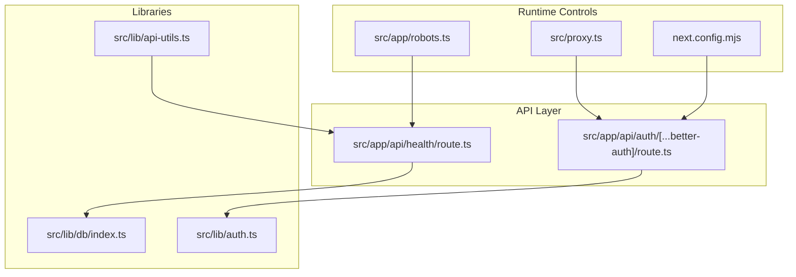
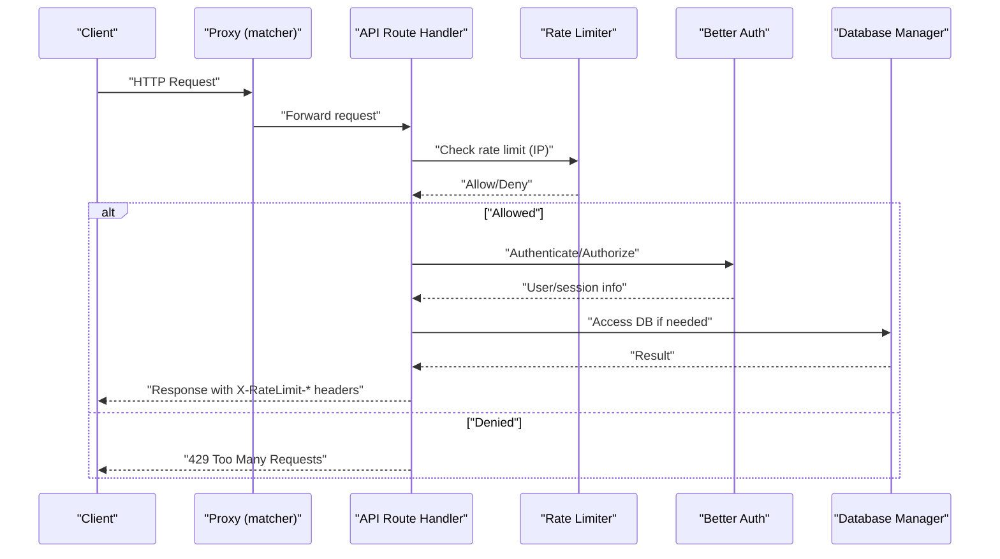
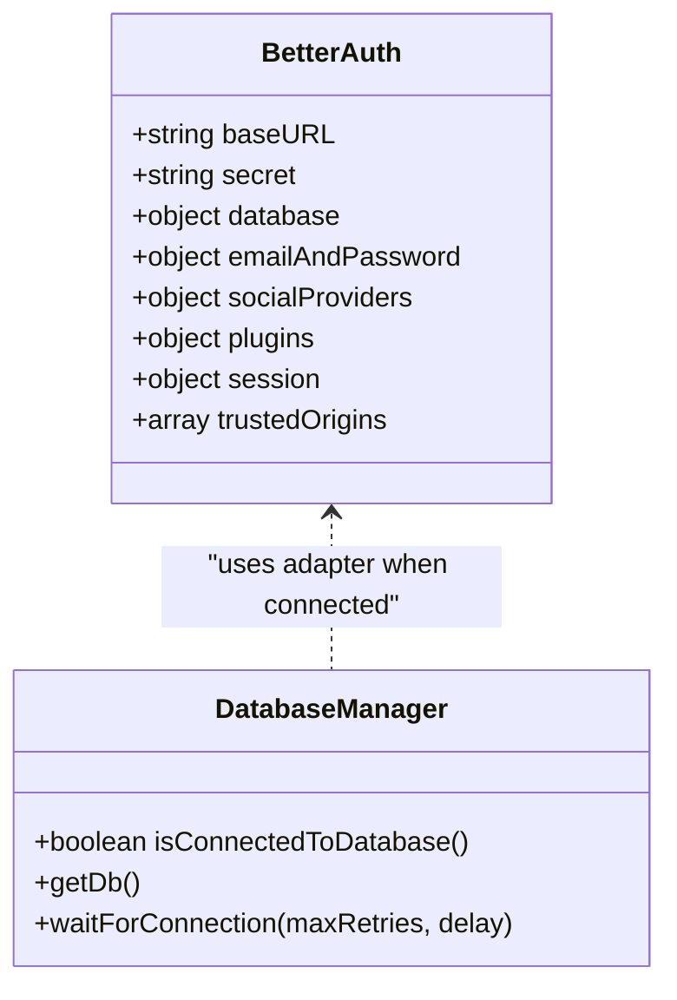
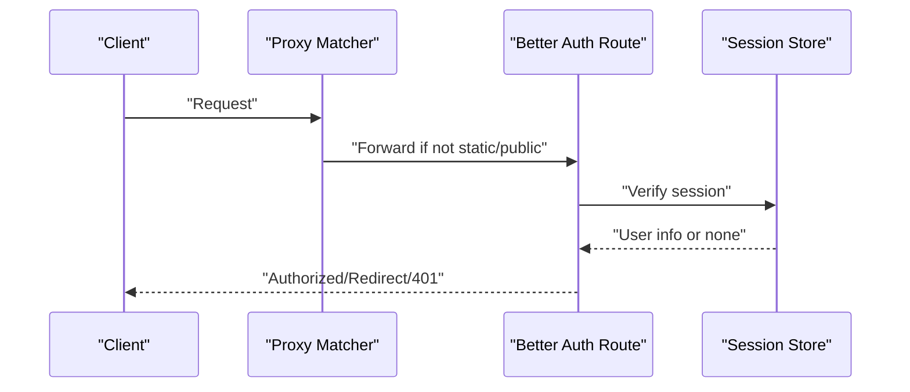
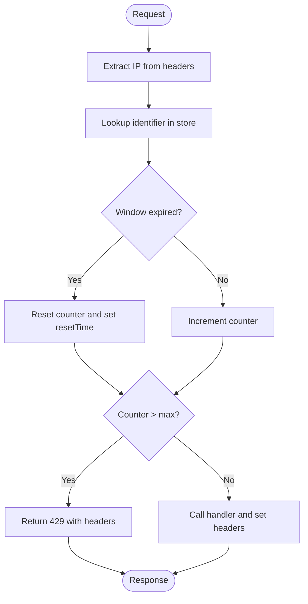
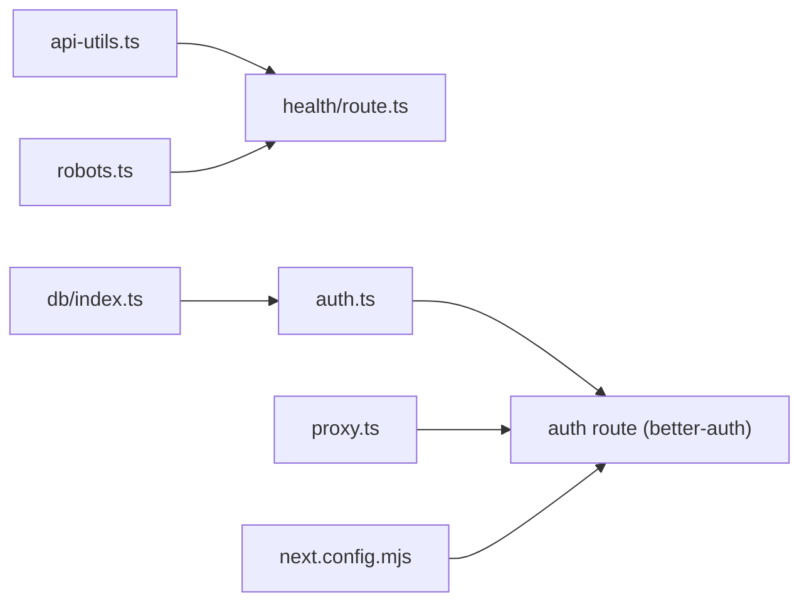

# API Security and Error Handling

<cite>
**Referenced Files in This Document**
- [api-utils.ts](file://src/lib/api-utils.ts)
- [auth.ts](file://src/lib/auth.ts)
- [health/route.ts](file://src/app/api/health/route.ts)
- [db/index.ts](file://src/lib/db/index.ts)
- [proxy.ts](file://src/proxy.ts)
- [robots.ts](file://src/app/robots.ts)
- [next.config.mjs](file://next.config.mjs)
- [error.tsx](file://src/app/error.tsx)
</cite>

## Table of Contents
1. [Introduction](#introduction)
2. [Project Structure](#project-structure)
3. [Core Components](#core-components)
4. [Architecture Overview](#architecture-overview)
5. [Detailed Component Analysis](#detailed-component-analysis)
6. [Dependency Analysis](#dependency-analysis)
7. [Performance Considerations](#performance-considerations)
8. [Troubleshooting Guide](#troubleshooting-guide)
9. [Conclusion](#conclusion)
10. [Appendices](#appendices)

## Introduction
This document provides comprehensive documentation for MatricMaster AI’s API security measures and error handling mechanisms. It covers authentication middleware, request validation, authorization policies, error response formats, rate limiting, IP-based abuse prevention, CORS/trusted origins, content security considerations, input sanitization, and operational best practices for resilience and observability.

## Project Structure
MatricMaster AI uses Next.js App Router endpoints under src/app/api for backend logic. Authentication is powered by Better Auth, with a dedicated route under src/app/api/auth/[...better-auth]/route.ts. Utility helpers for API responses and rate limiting live in src/lib/api-utils.ts. Health checks and database connectivity are centralized via src/lib/db/index.ts. Additional security and policy controls are implemented in src/proxy.ts, robots.ts, and next.config.mjs.

**Diagram sources**
- [health/route.ts](file://src/app/api/health/route.ts#L1-L30)
- [auth.ts](file://src/lib/auth.ts#L1-L103)
- [api-utils.ts](file://src/lib/api-utils.ts#L1-L93)
- [db/index.ts](file://src/lib/db/index.ts#L1-L102)
- [proxy.ts](file://src/proxy.ts#L41-L57)
- [robots.ts](file://src/app/robots.ts#L1-L22)
- [next.config.mjs](file://next.config.mjs#L1-L33)

**Section sources**
- [health/route.ts](file://src/app/api/health/route.ts#L1-L30)
- [auth.ts](file://src/lib/auth.ts#L1-L103)
- [api-utils.ts](file://src/lib/api-utils.ts#L1-L93)
- [db/index.ts](file://src/lib/db/index.ts#L1-L102)
- [proxy.ts](file://src/proxy.ts#L41-L57)
- [robots.ts](file://src/app/robots.ts#L1-L22)
- [next.config.mjs](file://next.config.mjs#L1-L33)

## Core Components
- Authentication and Authorization: Better Auth is initialized with database adapter support, email/password enabled, optional social providers, session lifetimes, and trusted origins. It exposes a proxy wrapper so routes can lazily access the auth instance.
- API Utilities: Centralized helpers for standardized error and success responses, plus a local in-memory rate limiter with sliding window semantics and X-RateLimit headers.
- Health Endpoint: Connects to the database and returns structured health status with appropriate HTTP status codes.
- Runtime Controls: Next.js image remote patterns, robots.txt rules, and a Next.js middleware-like matcher configuration for proxy routing.

**Section sources**
- [auth.ts](file://src/lib/auth.ts#L48-L69)
- [api-utils.ts](file://src/lib/api-utils.ts#L80-L92)
- [health/route.ts](file://src/app/api/health/route.ts#L4-L29)
- [next.config.mjs](file://next.config.mjs#L7-L26)
- [robots.ts](file://src/app/robots.ts#L5-L21)

## Architecture Overview
The API architecture integrates authentication, rate limiting, and health checks. Better Auth manages session creation and verification. API endpoints use the rate limiter to throttle requests per IP. Health endpoints validate database connectivity and surface errors consistently.

**Diagram sources**
- [proxy.ts](file://src/proxy.ts#L46-L57)
- [api-utils.ts](file://src/lib/api-utils.ts#L40-L78)
- [auth.ts](file://src/lib/auth.ts#L72-L87)
- [db/index.ts](file://src/lib/db/index.ts#L24-L63)

## Detailed Component Analysis

### Authentication Middleware and Authorization Policies
- Initialization: Better Auth is created with database adapter support when a DB connection is available. It sets baseURL, secret, database adapter, email/password settings, social providers (conditionally), session lifetimes, and trusted origins aligned with the frontend URL.
- Lazy Access: A proxy wrapper ensures routes can access the auth instance without hard-coding initialization order.
- Trusted Origins: The trustedOrigins list restricts allowed origins for secure cookie and redirect handling.
- Session Management: Sessions expire after a fixed period and are refreshed periodically.

**Diagram sources**
- [auth.ts](file://src/lib/auth.ts#L48-L69)
- [db/index.ts](file://src/lib/db/index.ts#L65-L67)

**Section sources**
- [auth.ts](file://src/lib/auth.ts#L9-L21)
- [auth.ts](file://src/lib/auth.ts#L48-L69)
- [auth.ts](file://src/lib/auth.ts#L72-L87)
- [auth.ts](file://src/lib/auth.ts#L97-L103)

### Request Validation and Sanitization
- Input validation: No explicit request body validation is present in the examined API utilities. Prefer adding Zod-based schemas for request payloads and query parameters to enforce shape and coerce types.
- Output sanitization: Responses are JSON-serialized via NextResponse. Ensure sensitive fields are omitted from responses and avoid echoing raw user input in error messages.
- Content Security: Remote image hosts are whitelisted in Next.js configuration. Restricting remote patterns reduces risk from malicious image sources.

Recommendations:
- Add Zod schemas for all API endpoints and validate early in handlers.
- Sanitize logs and error messages to avoid leaking internal details.
- Enforce HTTPS and secure cookies in production deployments.

**Section sources**
- [api-utils.ts](file://src/lib/api-utils.ts#L80-L92)
- [next.config.mjs](file://next.config.mjs#L7-L26)

### Authorization Policies Across Endpoints
- Better Auth route: The endpoint under src/app/api/auth/[...better-auth]/route.ts handles authentication flows (login, logout, callbacks, etc.) and enforces session-based authorization for protected routes.
- Proxy matcher: The matcher configuration in src/proxy.ts applies middleware-like behavior to most routes except static assets and public files, enabling centralized auth checks.

**Diagram sources**
- [proxy.ts](file://src/proxy.ts#L46-L57)
- [auth.ts](file://src/lib/auth.ts#L72-L87)

**Section sources**
- [proxy.ts](file://src/proxy.ts#L46-L57)
- [auth.ts](file://src/lib/auth.ts#L72-L87)

### Error Response Formats, Status Codes, and Classification
- Standardized error response: The apiError helper returns a JSON payload with an error field and optional details. In development, details are included; in production, they are omitted for safety.
- Standardized success response: The apiSuccess helper returns a JSON payload with the data and a 200 status by default.
- Health endpoint: Uses 200 for healthy, 503 for degraded database, and 500 for failures, returning structured status objects.
- Global error boundary: The error.tsx boundary logs the error and displays a friendly UI with a reset option and navigation.

Classification:
- Client errors: 400 Bad Request (validation), 401 Unauthorized (missing/invalid session), 403 Forbidden (insufficient permissions), 404 Not Found (resources), 429 Too Many Requests (rate limit).
- Server errors: 500 Internal Server Error, 503 Service Unavailable (degraded state).

**Section sources**
- [api-utils.ts](file://src/lib/api-utils.ts#L80-L92)
- [health/route.ts](file://src/app/api/health/route.ts#L8-L28)
- [error.tsx](file://src/app/error.tsx#L14-L17)

### Rate Limiting Implementation and Abuse Prevention
- Local in-memory sliding window: The rateLimit function maintains a per-identifier counter and reset time. The withRateLimit higher-order function extracts the client IP from forwarded headers and applies limits.
- Headers: Responses include X-RateLimit-Limit, X-RateLimit-Remaining, and X-RateLimit-Reset for clients to self-regulate.
- Abuse prevention: Requests exceeding the configured max per window are rejected with 429.

**Diagram sources**
- [api-utils.ts](file://src/lib/api-utils.ts#L18-L78)

Operational notes:
- Current implementation is in-process and not shared across instances. For distributed deployments, replace the in-memory store with a distributed cache (e.g., Redis) and synchronize reset windows.
- Consider bucketing by user ID for authenticated users and IP for unauthenticated requests.

**Section sources**
- [api-utils.ts](file://src/lib/api-utils.ts#L18-L78)

### CORS Configuration and Trusted Origins
- Trusted Origins: Better Auth’s trustedOrigins list is set to the frontend URL, ensuring safe redirects and cookie domains.
- Next.js Image Optimization: remotePatterns restricts allowed image hosts, reducing exposure to malicious content.

Recommendations:
- Align trustedOrigins with the production frontend origin.
- Consider adding a dedicated CSP header for additional protection against XSS and data injection.

**Section sources**
- [auth.ts](file://src/lib/auth.ts#L68-L68)
- [next.config.mjs](file://next.config.mjs#L7-L26)

### Content Security and Robots Policy
- robots.txt: Disallows crawlers from accessing API and static/private paths, directing them to sitemap and host.
- Images: Whitelisted remote patterns reduce risk from third-party image sources.

**Section sources**
- [robots.ts](file://src/app/robots.ts#L5-L21)
- [next.config.mjs](file://next.config.mjs#L7-L26)

### Input Sanitization and Output Encoding
- No explicit sanitization logic was found in the examined files. Apply:
  - Input validation with Zod schemas.
  - Output encoding for dynamic HTML contexts.
  - Avoid echoing raw user input in error responses.

**Section sources**
- [api-utils.ts](file://src/lib/api-utils.ts#L80-L92)

### Monitoring and Logging Strategies
- Health endpoint: Returns timestamped status for monitoring dashboards.
- Console logging: Database manager logs connection attempts and errors; global error boundary logs client-side errors.
- Recommendations:
  - Add structured logs for API requests/responses with correlation IDs.
  - Instrument rate limiter hits and 429 responses.
  - Track authentication failures and suspicious IPs.
  - Integrate metrics collection (e.g., Prometheus/OpenTelemetry) and alerting.

**Section sources**
- [health/route.ts](file://src/app/api/health/route.ts#L8-L28)
- [db/index.ts](file://src/lib/db/index.ts#L25-L38)
- [error.tsx](file://src/app/error.tsx#L15-L17)

## Dependency Analysis
- Better Auth depends on the Database Manager for persistence when available.
- API routes depend on API utilities for consistent responses and rate limiting.
- Proxy matcher governs which routes are processed by auth-related middleware logic.
- Next.js configuration influences image security and build-time optimizations.

**Diagram sources**
- [api-utils.ts](file://src/lib/api-utils.ts#L1-L93)
- [health/route.ts](file://src/app/api/health/route.ts#L1-L30)
- [db/index.ts](file://src/lib/db/index.ts#L1-L102)
- [auth.ts](file://src/lib/auth.ts#L1-L103)
- [proxy.ts](file://src/proxy.ts#L41-L57)
- [robots.ts](file://src/app/robots.ts#L1-L22)
- [next.config.mjs](file://next.config.mjs#L1-L33)

**Section sources**
- [api-utils.ts](file://src/lib/api-utils.ts#L1-L93)
- [health/route.ts](file://src/app/api/health/route.ts#L1-L30)
- [db/index.ts](file://src/lib/db/index.ts#L1-L102)
- [auth.ts](file://src/lib/auth.ts#L1-L103)
- [proxy.ts](file://src/proxy.ts#L41-L57)
- [robots.ts](file://src/app/robots.ts#L1-L22)
- [next.config.mjs](file://next.config.mjs#L1-L33)

## Performance Considerations
- Rate limiter memory footprint: The in-memory store grows with unique identifiers. For high concurrency, consider a bounded LRU cache or external storage.
- Database connections: Health checks and DB manager retries should be tuned to avoid long blocking on startup.
- Image optimization: Remote patterns reduce unnecessary fetches and potential resource exhaustion.

[No sources needed since this section provides general guidance]

## Troubleshooting Guide
Common scenarios and resolutions:
- 401 Unauthorized: Verify session validity and that the frontend is sending cookies. Check trustedOrigins alignment with the frontend URL.
- 403 Forbidden: Confirm user roles/permissions if enforced by downstream logic.
- 404 Not Found: Validate endpoint paths and Next.js route segments.
- 429 Too Many Requests: Respect X-RateLimit-* headers; implement exponential backoff and jitter on the client.
- 500 Internal Server Error: Inspect server logs and the global error boundary for stack traces.
- 503 Service Unavailable: Indicates database disconnection; check DB connection and retry logic.

Client-side best practices:
- Retry with backoff for transient errors (408, 429, 503).
- Graceful degradation: Fallback to cached data or reduced functionality when APIs are unavailable.
- Idempotency: For write operations, ensure idempotent retry keys to prevent duplicate actions.

**Section sources**
- [api-utils.ts](file://src/lib/api-utils.ts#L53-L67)
- [health/route.ts](file://src/app/api/health/route.ts#L16-L27)
- [error.tsx](file://src/app/error.tsx#L14-L17)

## Conclusion
MatricMaster AI implements foundational security and reliability controls: Better Auth for authentication and session management, a centralized rate limiter for abuse prevention, and consistent error/success response formats. To strengthen the system, integrate robust input validation, distributed rate limiting, CSP headers, and comprehensive monitoring/logging. These enhancements will improve resilience, observability, and compliance with security best practices.

[No sources needed since this section summarizes without analyzing specific files]

## Appendices

### API Error Response Schema
- Error response: { error: string, details?: any }
- Success response: { data: any }

Status codes:
- 200 OK
- 400 Bad Request
- 401 Unauthorized
- 403 Forbidden
- 404 Not Found
- 429 Too Many Requests
- 500 Internal Server Error
- 503 Service Unavailable

**Section sources**
- [api-utils.ts](file://src/lib/api-utils.ts#L80-L92)
- [health/route.ts](file://src/app/api/health/route.ts#L8-L28)