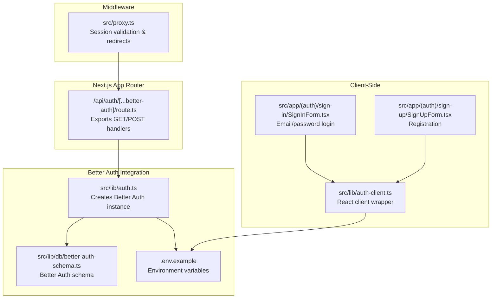
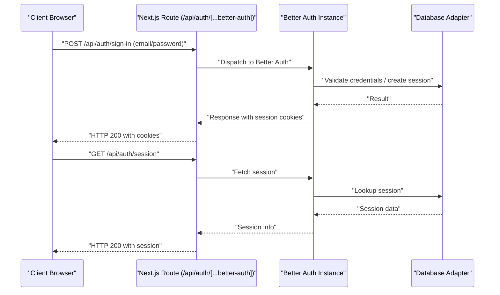
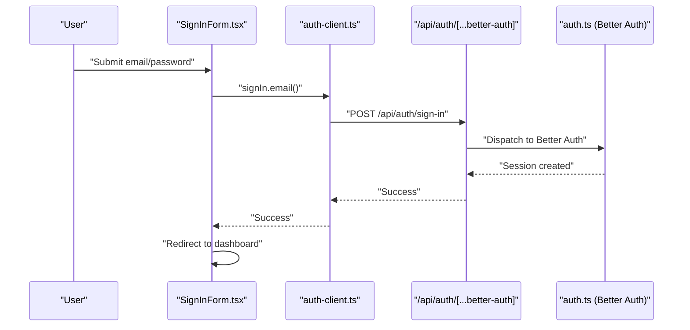
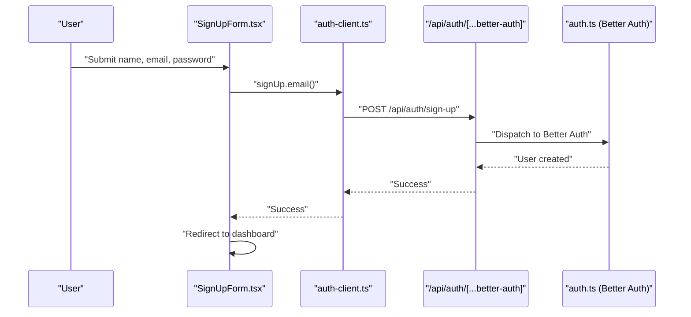
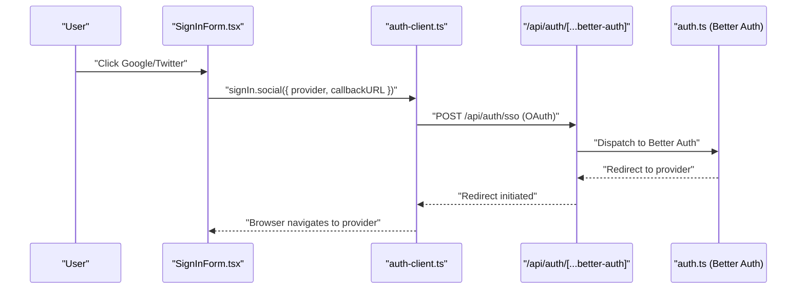
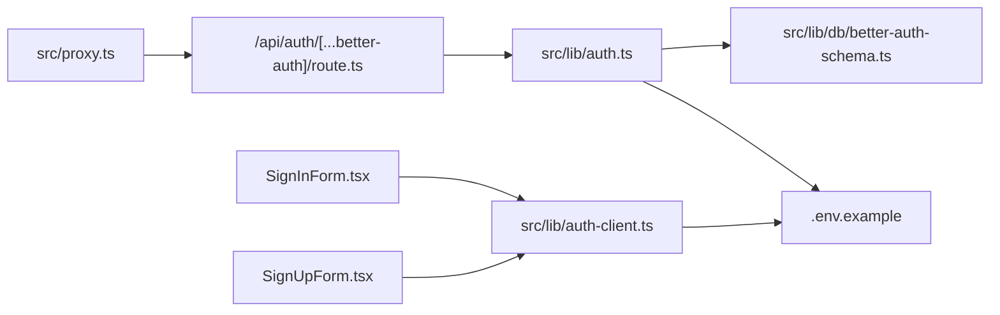

# Authentication APIs

<cite>
**Referenced Files in This Document**
- [route.ts](file://src/app/api/auth%5B...better-auth%5D/route.ts)
- [auth.ts](file://src/lib/auth.ts)
- [auth-client.ts](file://src/lib/auth-client.ts)
- [better-auth-schema.ts](file://src/lib/db/better-auth-schema.ts)
- [auth-schema.ts](file://auth-schema.ts)
- [.env.example](file://.env.example)
- [proxy.ts](file://src/proxy.ts)
- [SignInForm.tsx](file://src/app/(auth)/sign-in/SignInForm.tsx)
- [SignUpForm.tsx](file://src/app/(auth)/sign-up/SignUpForm.tsx)
- [test-db-auth.js](file://test-db-auth.js)
</cite>

## Table of Contents
1. [Introduction](#introduction)
2. [Project Structure](#project-structure)
3. [Core Components](#core-components)
4. [Architecture Overview](#architecture-overview)
5. [Detailed Component Analysis](#detailed-component-analysis)
6. [Dependency Analysis](#dependency-analysis)
7. [Performance Considerations](#performance-considerations)
8. [Troubleshooting Guide](#troubleshooting-guide)
9. [Conclusion](#conclusion)

## Introduction
This document provides comprehensive API documentation for MatricMaster AI's authentication system built on Better Auth. It covers the integration endpoints under /api/auth/[...better-auth], detailing supported HTTP methods, authentication flows, session management, cookies, and client-side usage. It also outlines request/response considerations, security headers, rate limiting posture, and best practices derived from the repository configuration.

## Project Structure
The authentication system is implemented as a Next.js App Router API handler that delegates to Better Auth. The handler wraps Better Auth's Next.js adapter and exposes GET/POST endpoints. Client-side integration uses a React client wrapper for Better Auth, while server-side configuration defines session lifetimes, trusted origins, and database adapter integration.

**Diagram sources**
- [route.ts](file://src/app/api/auth%5B...better-auth%5D/route.ts#L1-L4)
- [auth.ts](file://src/lib/auth.ts#L48-L69)
- [better-auth-schema.ts](file://src/lib/db/better-auth-schema.ts#L1-L107)
- [.env.example](file://.env.example#L1-L19)
- [auth-client.ts](file://src/lib/auth-client.ts#L1-L10)
- [SignInForm.tsx](file://src/app/(auth)/sign-in/SignInForm.tsx#L97-L117)
- [SignUpForm.tsx](file://src/app/(auth)/sign-up/SignUpForm.tsx#L55-L71)
- [proxy.ts](file://src/proxy.ts#L24-L39)

**Section sources**
- [route.ts](file://src/app/api/auth%5B...better-auth%5D/route.ts#L1-L4)
- [auth.ts](file://src/lib/auth.ts#L48-L69)
- [auth-client.ts](file://src/lib/auth-client.ts#L1-L10)
- [proxy.ts](file://src/proxy.ts#L1-L39)

## Core Components
- Better Auth API Handler: Exposes GET/POST endpoints for Better Auth under /api/auth/[...better-auth].
- Better Auth Configuration: Defines session lifetime, trusted origins, email/password, social providers, and database adapter.
- Client-side Auth Client: Provides React hooks and methods for sign-in, sign-up, and session management.
- Middleware Proxy: Enforces session validation and redirects unauthenticated requests to the sign-in page.
- Database Schema: Drizzle ORM schema for Better Auth tables and relations.

Key configuration highlights:
- Session expiration and update age are set server-side.
- Trusted origins include the frontend base URL.
- Email/password is enabled; social providers include Google and optionally Twitter.
- Database adapter is configured when a connection is available.

**Section sources**
- [route.ts](file://src/app/api/auth%5B...better-auth%5D/route.ts#L1-L4)
- [auth.ts](file://src/lib/auth.ts#L48-L69)
- [auth-client.ts](file://src/lib/auth-client.ts#L1-L10)
- [proxy.ts](file://src/proxy.ts#L24-L39)
- [better-auth-schema.ts](file://src/lib/db/better-auth-schema.ts#L1-L107)

## Architecture Overview
The authentication flow integrates client-side Better Auth React client with server-side Better Auth via a Next.js API handler. The middleware validates sessions and enforces redirects for protected routes.

**Diagram sources**
- [route.ts](file://src/app/api/auth%5B...better-auth%5D/route.ts#L1-L4)
- [auth.ts](file://src/lib/auth.ts#L48-L69)
- [SignInForm.tsx](file://src/app/(auth)/sign-in/SignInForm.tsx#L97-L117)
- [proxy.ts](file://src/proxy.ts#L32-L39)

## Detailed Component Analysis

### API Endpoint: /api/auth/[...better-auth]
- Purpose: Delegates Better Auth's authentication endpoints to Next.js.
- Methods:
  - GET: Handles Better Auth endpoints (e.g., session retrieval, OAuth callbacks).
  - POST: Handles Better Auth endpoints (e.g., sign-in, sign-up, password reset).
- Implementation: Uses Better Auth's Next.js adapter to convert Better Auth to Next.js handlers.

Security and session considerations:
- Cookies: Better Auth sets session cookies. The middleware checks for session presence.
- Trusted Origins: Configured to the frontend base URL.
- Session Lifetime: Defined in Better Auth configuration.

**Section sources**
- [route.ts](file://src/app/api/auth%5B...better-auth%5D/route.ts#L1-L4)
- [auth.ts](file://src/lib/auth.ts#L64-L68)
- [proxy.ts](file://src/proxy.ts#L12-L22)

### Client-Side Authentication (React)
- Client Wrapper: Creates a Better Auth React client with base URL and plugins.
- Methods:
  - signIn.email: Authenticate with email and password.
  - signUp.email: Register a new user with email, password, and name.
  - signIn.social: Authenticate via social providers (Google, optional Twitter).
  - signIn.anonymous: Guest login using anonymous plugin.
  - useSession: Hook to access session state.
  - signOut: Sign out the current user.
- Callback URLs: Social sign-in supports callback URL configuration.

Example usage patterns:
- Email/password login with form validation and redirect handling.
- Social sign-in with provider selection and callback URL.
- Anonymous sign-in for guest experiences.

**Section sources**
- [auth-client.ts](file://src/lib/auth-client.ts#L1-L10)
- [SignInForm.tsx](file://src/app/(auth)/sign-in/SignInForm.tsx#L97-L124)
- [SignUpForm.tsx](file://src/app/(auth)/sign-up/SignUpForm.tsx#L55-L78)

### Session Management and Cookies
- Cookie Names Checked by Middleware:
  - better-auth.session
  - better-auth.session_token
  - better-auth.anonymous
- Behavior: If none are present, the middleware redirects to the sign-in page with the requested path as a callback parameter.

Protected routes:
- Non-public routes are redirected to sign-in when no valid session is detected.

**Section sources**
- [proxy.ts](file://src/proxy.ts#L12-L22)
- [proxy.ts](file://src/proxy.ts#L24-L39)

### Database Schema for Better Auth
Better Auth tables and relations are defined using Drizzle ORM. The schema includes:
- Users: Basic user identity and timestamps.
- Sessions: Session tokens, expiry, IP, user agent, and foreign key to users.
- Accounts: Provider-based accounts (social and email/password), tokens, scopes, and passwords.
- Verifications: Email verification records.

Type exports are provided for integration with Better Auth.

**Section sources**
- [better-auth-schema.ts](file://src/lib/db/better-auth-schema.ts#L1-L107)
- [auth-schema.ts](file://auth-schema.ts#L1-L95)

### Environment Configuration
Required environment variables:
- BETTER_AUTH_SECRET: Secret key for Better Auth.
- BETTER_AUTH_URL: Base URL for Better Auth.
- NEXT_PUBLIC_APP_URL: Frontend base URL used for trusted origins and client base URL.
- DATABASE_URL: PostgreSQL connection string for database adapter.
- GOOGLE_CLIENT_ID / GOOGLE_CLIENT_SECRET: Google OAuth credentials.
- Optional: TWITTER_CLIENT_ID / TWITTER_CLIENT_SECRET for Twitter OAuth.

**Section sources**
- [.env.example](file://.env.example#L1-L19)
- [auth.ts](file://src/lib/auth.ts#L48-L69)
- [auth-client.ts](file://src/lib/auth-client.ts#L4-L6)

### Authentication Flow: Email/Password Login

**Diagram sources**
- [SignInForm.tsx](file://src/app/(auth)/sign-in/SignInForm.tsx#L97-L117)
- [auth-client.ts](file://src/lib/auth-client.ts#L1-L10)
- [route.ts](file://src/app/api/auth%5B...better-auth%5D/route.ts#L1-L4)
- [auth.ts](file://src/lib/auth.ts#L48-L69)

### Authentication Flow: Registration

**Diagram sources**
- [SignUpForm.tsx](file://src/app/(auth)/sign-up/SignUpForm.tsx#L55-L71)
- [auth-client.ts](file://src/lib/auth-client.ts#L1-L10)
- [route.ts](file://src/app/api/auth%5B...better-auth%5D/route.ts#L1-L4)
- [auth.ts](file://src/lib/auth.ts#L48-L69)

### Authentication Flow: Social Sign-In

**Diagram sources**
- [SignInForm.tsx](file://src/app/(auth)/sign-in/SignInForm.tsx#L119-L124)
- [auth-client.ts](file://src/lib/auth-client.ts#L1-L10)
- [route.ts](file://src/app/api/auth%5B...better-auth%5D/route.ts#L1-L4)
- [auth.ts](file://src/lib/auth.ts#L48-L69)

### Request and Response Considerations
- Request Bodies:
  - Email/Password Login: email, password.
  - Registration: name, email, password.
  - Social Sign-In: provider, callbackURL.
  - Session: No body required; endpoint returns session info.
- Response Bodies:
  - On success: Session information and cookies set by Better Auth.
  - On error: Error details returned by Better Auth.
- Cookies:
  - Session cookies set by Better Auth include session identifiers and tokens.
- Security Headers:
  - Trusted Origins configured to the frontend base URL.
  - Cookies are managed by Better Auth; ensure HTTPS in production.

Note: Specific JSON schemas are not defined in the repository. The above outlines the expected payload keys and typical responses inferred from client usage and Better Auth defaults.

**Section sources**
- [SignInForm.tsx](file://src/app/(auth)/sign-in/SignInForm.tsx#L97-L117)
- [SignUpForm.tsx](file://src/app/(auth)/sign-up/SignUpForm.tsx#L55-L71)
- [auth-client.ts](file://src/lib/auth-client.ts#L1-L10)
- [auth.ts](file://src/lib/auth.ts#L64-L68)

### Rate Limiting and Account Lockout
- The repository does not define explicit rate limiting or account lockout policies for Better Auth endpoints.
- Consider implementing rate limiting at the ingress or using Better Auth plugins if needed.

**Section sources**
- [auth.ts](file://src/lib/auth.ts#L48-L69)

## Dependency Analysis

**Diagram sources**
- [route.ts](file://src/app/api/auth%5B...better-auth%5D/route.ts#L1-L4)
- [auth.ts](file://src/lib/auth.ts#L48-L69)
- [better-auth-schema.ts](file://src/lib/db/better-auth-schema.ts#L1-L107)
- [.env.example](file://.env.example#L1-L19)
- [auth-client.ts](file://src/lib/auth-client.ts#L1-L10)
- [SignInForm.tsx](file://src/app/(auth)/sign-in/SignInForm.tsx#L97-L117)
- [SignUpForm.tsx](file://src/app/(auth)/sign-up/SignUpForm.tsx#L55-L71)
- [proxy.ts](file://src/proxy.ts#L24-L39)

**Section sources**
- [route.ts](file://src/app/api/auth%5B...better-auth%5D/route.ts#L1-L4)
- [auth.ts](file://src/lib/auth.ts#L48-L69)
- [auth-client.ts](file://src/lib/auth-client.ts#L1-L10)
- [proxy.ts](file://src/proxy.ts#L1-L39)

## Performance Considerations
- Session Lifetimes: Configure appropriate expiresIn and updateAge to balance security and UX.
- Database Adapter: When a database connection is unavailable, Better Auth falls back; ensure reliable connectivity for persistent sessions.
- Middleware Redirects: Minimize unnecessary redirects by ensuring callback URLs are validated and safe.

**Section sources**
- [auth.ts](file://src/lib/auth.ts#L64-L69)
- [proxy.ts](file://src/proxy.ts#L24-L39)

## Troubleshooting Guide
- Database Initialization Test: A script tests database and authentication configuration, useful for diagnosing setup issues.
- Environment Variables: Ensure BETTER_AUTH_SECRET, NEXT_PUBLIC_APP_URL, and provider credentials are configured.
- Session Validation: If redirected to sign-in unexpectedly, verify session cookies are present and not blocked by browser settings.

**Section sources**
- [test-db-auth.js](file://test-db-auth.js#L1-L39)
- [.env.example](file://.env.example#L1-L19)
- [proxy.ts](file://src/proxy.ts#L32-L39)

## Conclusion
MatricMaster AI's authentication system leverages Better Auth with a clean separation between server-side configuration and client-side React integration. The /api/auth/[...better-auth] endpoint exposes standard authentication flows, while the middleware ensures session validation for protected routes. The configuration supports email/password and social providers, with session cookies managed by Better Auth. For production, ensure secure cookie handling, HTTPS, and consider adding rate limiting and account lockout policies as needed.