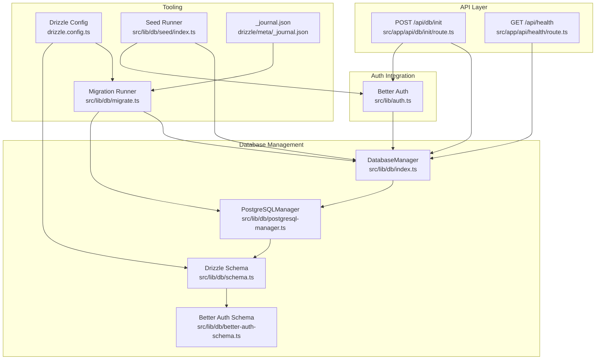
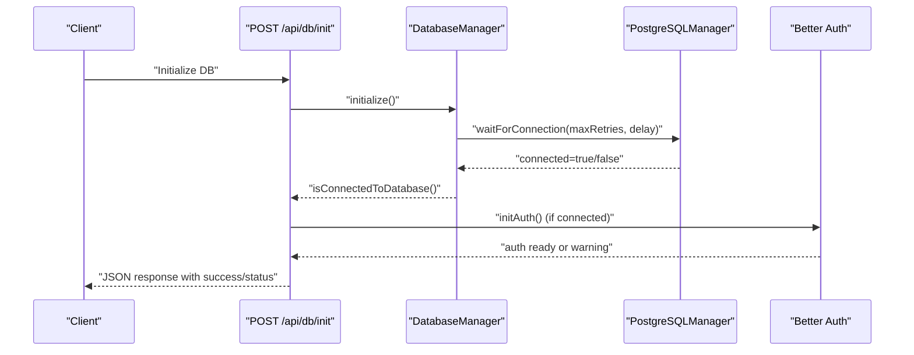
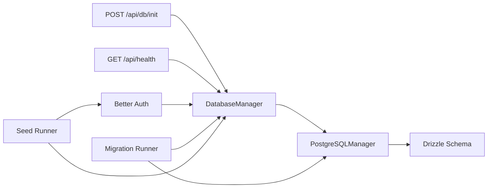

# Database and System APIs

<cite>
**Referenced Files in This Document**
- [route.ts](file://src/app/api/db/init/route.ts)
- [route.ts](file://src/app/api/health/route.ts)
- [index.ts](file://src/lib/db/index.ts)
- [postgresql-manager.ts](file://src/lib/db/postgresql-manager.ts)
- [schema.ts](file://src/lib/db/schema.ts)
- [better-auth-schema.ts](file://src/lib/db/better-auth-schema.ts)
- [drizzle.config.ts](file://drizzle.config.ts)
- [migrate.ts](file://src/lib/db/migrate.ts)
- [index.ts](file://src/lib/db/seed/index.ts)
- [auth.ts](file://src/lib/auth.ts)
- [api-utils.ts](file://src/lib/api-utils.ts)
- [_journal.json](file://drizzle/meta/_journal.json)
</cite>

## Table of Contents
1. [Introduction](#introduction)
2. [Project Structure](#project-structure)
3. [Core Components](#core-components)
4. [Architecture Overview](#architecture-overview)
5. [Detailed Component Analysis](#detailed-component-analysis)
6. [Dependency Analysis](#dependency-analysis)
7. [Performance Considerations](#performance-considerations)
8. [Troubleshooting Guide](#troubleshooting-guide)
9. [Conclusion](#conclusion)
10. [Appendices](#appendices)

## Introduction
This document provides comprehensive API documentation for MatricMaster AI’s database and system management endpoints. It covers:
- Database initialization endpoint for connecting to PostgreSQL, initializing authentication, and returning connection status.
- Health check endpoint for verifying database connectivity and service availability.
- Database connection management, transaction handling, and cleanup procedures.
- Environment-specific configurations and operational procedures for migrations and seeding.
- Examples of initialization scripts, health monitoring implementations, and system maintenance workflows.

## Project Structure
The relevant API endpoints and supporting libraries are organized as follows:
- API endpoints under src/app/api:
  - Database initialization: src/app/api/db/init/route.ts
  - Health check: src/app/api/health/route.ts
- Database management and connection logic:
  - src/lib/db/index.ts (DatabaseManager singleton)
  - src/lib/db/postgresql-manager.ts (PostgreSQLManager singleton)
  - src/lib/db/schema.ts (Drizzle schema definitions)
  - src/lib/db/better-auth-schema.ts (Better Auth schema)
  - drizzle.config.ts (Drizzle configuration)
  - drizzle/meta/_journal.json (Migration journal)
  - src/lib/db/migrate.ts (Migration runner)
  - src/lib/db/seed/index.ts (Seed runner)
- Authentication integration:
  - src/lib/auth.ts (Better Auth initialization and adapter)
- Utility helpers:
  - src/lib/api-utils.ts (API response helpers and rate limiting)

**Diagram sources**
- [route.ts](file://src/app/api/db/init/route.ts#L30-L99)
- [route.ts](file://src/app/api/health/route.ts#L4-L29)
- [index.ts](file://src/lib/db/index.ts#L9-L87)
- [postgresql-manager.ts](file://src/lib/db/postgresql-manager.ts#L18-L141)
- [schema.ts](file://src/lib/db/schema.ts#L1-L160)
- [better-auth-schema.ts](file://src/lib/db/better-auth-schema.ts#L1-L107)
- [drizzle.config.ts](file://drizzle.config.ts#L1-L16)
- [migrate.ts](file://src/lib/db/migrate.ts#L1-L45)
- [index.ts](file://src/lib/db/seed/index.ts#L192-L232)
- [_journal.json](file://drizzle/meta/_journal.json#L1-L6)

**Section sources**
- [route.ts](file://src/app/api/db/init/route.ts#L1-L100)
- [route.ts](file://src/app/api/health/route.ts#L1-L30)
- [index.ts](file://src/lib/db/index.ts#L1-L102)
- [postgresql-manager.ts](file://src/lib/db/postgresql-manager.ts#L1-L162)
- [schema.ts](file://src/lib/db/schema.ts#L1-L160)
- [better-auth-schema.ts](file://src/lib/db/better-auth-schema.ts#L1-L107)
- [drizzle.config.ts](file://drizzle.config.ts#L1-L16)
- [migrate.ts](file://src/lib/db/migrate.ts#L1-L45)
- [index.ts](file://src/lib/db/seed/index.ts#L192-L232)
- [_journal.json](file://drizzle/meta/_journal.json#L1-L6)

## Core Components
- DatabaseManager (singleton):
  - Initializes and manages PostgreSQL connection via PostgreSQLManager.
  - Provides connection state, preferred database detection, and graceful shutdown.
- PostgreSQLManager (singleton):
  - Establishes connections with timeouts, SSL handling for Neon, and connection testing.
  - Exposes getDb(), getClient(), and waitForConnection() for retries.
- Drizzle Schema:
  - Defines core tables (subjects, questions, options, search_history) and Better Auth tables.
  - Includes relations and indexes for performance and referential integrity.
- Better Auth Integration:
  - Initializes Better Auth with Drizzle adapter when DB is connected.
  - Supports Google and optional Twitter OAuth providers.
- API Utilities:
  - Provides apiSuccess/apiError helpers and rate limiting utilities.

**Section sources**
- [index.ts](file://src/lib/db/index.ts#L9-L87)
- [postgresql-manager.ts](file://src/lib/db/postgresql-manager.ts#L18-L141)
- [schema.ts](file://src/lib/db/schema.ts#L1-L160)
- [better-auth-schema.ts](file://src/lib/db/better-auth-schema.ts#L1-L107)
- [auth.ts](file://src/lib/auth.ts#L1-L103)
- [api-utils.ts](file://src/lib/api-utils.ts#L1-L93)

## Architecture Overview
The system uses a layered architecture:
- API layer exposes two endpoints: database initialization and health checks.
- Database layer abstracts connection management and schema definitions.
- Auth layer integrates with Better Auth and Drizzle adapter.
- Tooling layer supports migrations and seeding via Drizzle Kit.

**Diagram sources**
- [route.ts](file://src/app/api/db/init/route.ts#L30-L99)
- [index.ts](file://src/lib/db/index.ts#L24-L63)
- [postgresql-manager.ts](file://src/lib/db/postgresql-manager.ts#L128-L140)
- [auth.ts](file://src/lib/auth.ts#L72-L80)

## Detailed Component Analysis

### Database Initialization Endpoint: POST /api/db/init
Purpose:
- Initialize database connection, optionally initialize Better Auth, and return connection status.

Authorization:
- Allows localhost requests.
- Accepts internal API key via x-api-key header for programmatic access.

Processing logic:
- Calls dbManager.initialize() to connect to PostgreSQL.
- On success, attempts to initialize Better Auth.
- Returns structured JSON with success flag, message, and connection status.

Response formats:
- Success:
  - Fields: success, message, connected, authInitialized (when applicable).
- Unauthorized:
  - Fields: success=false, message="Unauthorized".
- Failure:
  - Fields: success=false, message, connected=false.

Error handling:
- Unauthorized access returns 401.
- Connection failure returns 503 with message indicating database connectivity issue.
- Internal errors return 500 with generic message.

Diagnostic information:
- Logs indicate initialization steps and outcomes.
- On auth initialization failure, returns success=true with authInitialized=false.

Operational notes:
- Designed for controlled environments; restricts access via localhost and shared secret header.
- Does not perform schema creation or migrations; relies on separate migration tooling.

**Section sources**
- [route.ts](file://src/app/api/db/init/route.ts#L6-L28)
- [route.ts](file://src/app/api/db/init/route.ts#L30-L99)
- [index.ts](file://src/lib/db/index.ts#L24-L39)
- [postgresql-manager.ts](file://src/lib/db/postgresql-manager.ts#L42-L90)

### Health Check Endpoint: GET /api/health
Purpose:
- Monitor system health by verifying database connectivity.

Processing logic:
- Uses dbManager.waitForConnection(3, 1000) to attempt connection with retries.
- Returns healthy status if connected; otherwise degraded or unhealthy depending on outcome.

Response formats:
- Healthy:
  - Fields: status="healthy", database="connected", timestamp.
- Degraded:
  - Fields: status="degraded", database="disconnected", timestamp.
- Unhealthy:
  - Fields: status="unhealthy", database="error", error (with details in development), timestamp.

Error handling:
- Catches exceptions and returns 500 with error details in development mode.

Diagnostic information:
- Timestamp included in all responses.
- Error messages include exception details in development; production suppresses details.

**Section sources**
- [route.ts](file://src/app/api/health/route.ts#L4-L29)
- [index.ts](file://src/lib/db/index.ts#L59-L63)
- [api-utils.ts](file://src/lib/api-utils.ts#L80-L92)

### Database Connection Management and Cleanup
Connection lifecycle:
- DatabaseManager.initialize():
  - Delegates to PostgreSQLManager.waitForConnection().
  - Sets internal state and flags upon success/failure.
- PostgreSQLManager.waitForConnection():
  - Attempts connection up to maxRetries with delay.
  - Tests connectivity with a simple query and sets isConnected.
- Cleanup:
  - DatabaseManager.close() disconnects via PostgreSQLManager and resets state.
  - Process listeners handle SIGTERM/SIGINT to gracefully close connections.

Transaction handling:
- No explicit transaction API is exposed in the documented files.
- Drizzle ORM is used for queries; transactions can be managed at the application level using drizzle’s transaction APIs.

Environment-specific configurations:
- DATABASE_URL is required for connection string.
- Better Auth requires BETTER_AUTH_SECRET and optional OAuth credentials.
- NEXT_PUBLIC_APP_URL defines base URL for auth and trusted origins.

**Section sources**
- [index.ts](file://src/lib/db/index.ts#L24-L86)
- [postgresql-manager.ts](file://src/lib/db/postgresql-manager.ts#L128-L140)
- [postgresql-manager.ts](file://src/lib/db/postgresql-manager.ts#L92-L108)
- [auth.ts](file://src/lib/auth.ts#L48-L69)

### Schema Creation, Migration Execution, and Seed Data Setup
Schema definition:
- Drizzle schema defines core tables and Better Auth tables.
- Indexes and relations are defined for performance and integrity.

Migration execution:
- Drizzle Kit configuration points to ./drizzle for migrations.
- Migration runner connects to DB, runs migrations against ./drizzle, and exits cleanly.

Seed data setup:
- Seed script initializes test user via Better Auth API.
- Script closes DB connection and exits after completion.

Operational procedures:
- Run migrations before initializing the API to ensure schema readiness.
- Seeds can be executed after migrations to populate initial data.

**Section sources**
- [schema.ts](file://src/lib/db/schema.ts#L1-L160)
- [better-auth-schema.ts](file://src/lib/db/better-auth-schema.ts#L1-L107)
- [drizzle.config.ts](file://drizzle.config.ts#L1-L16)
- [migrate.ts](file://src/lib/db/migrate.ts#L1-L45)
- [index.ts](file://src/lib/db/seed/index.ts#L192-L232)
- [_journal.json](file://drizzle/meta/_journal.json#L1-L6)

### Authorization and Access Control
- POST /api/db/init enforces:
  - Localhost access allowed.
  - Programmatic access via x-api-key header matching INTERNAL_API_KEY environment variable.

Security considerations:
- Restrict access to trusted networks or services.
- Use strong shared secrets and rotate them regularly.

**Section sources**
- [route.ts](file://src/app/api/db/init/route.ts#L6-L28)

## Dependency Analysis
Key dependencies and relationships:
- API endpoints depend on DatabaseManager for connectivity and on Better Auth for session persistence.
- DatabaseManager depends on PostgreSQLManager for connection orchestration.
- Drizzle schema is shared between Better Auth tables and application tables.
- Migration and seed runners depend on Drizzle configuration and environment variables.

**Diagram sources**
- [route.ts](file://src/app/api/db/init/route.ts#L30-L99)
- [route.ts](file://src/app/api/health/route.ts#L4-L29)
- [index.ts](file://src/lib/db/index.ts#L9-L87)
- [postgresql-manager.ts](file://src/lib/db/postgresql-manager.ts#L18-L141)
- [schema.ts](file://src/lib/db/schema.ts#L1-L160)
- [auth.ts](file://src/lib/auth.ts#L1-L103)
- [migrate.ts](file://src/lib/db/migrate.ts#L1-L45)
- [index.ts](file://src/lib/db/seed/index.ts#L192-L232)

**Section sources**
- [route.ts](file://src/app/api/db/init/route.ts#L1-L100)
- [route.ts](file://src/app/api/health/route.ts#L1-L30)
- [index.ts](file://src/lib/db/index.ts#L1-L102)
- [postgresql-manager.ts](file://src/lib/db/postgresql-manager.ts#L1-L162)
- [schema.ts](file://src/lib/db/schema.ts#L1-L160)
- [auth.ts](file://src/lib/auth.ts#L1-L103)
- [migrate.ts](file://src/lib/db/migrate.ts#L1-L45)
- [index.ts](file://src/lib/db/seed/index.ts#L192-L232)

## Performance Considerations
- Connection retries and delays:
  - waitForConnection() allows bounded retries to accommodate transient network issues.
- Connection pooling:
  - PostgreSQLManager sets max connections and idle timeouts; tune for workload.
- SSL handling:
  - Automatic SSL for Neon connections reduces handshake overhead.
- Logging:
  - Verbose logs aid in diagnosing connectivity issues; reduce in production for performance.

[No sources needed since this section provides general guidance]

## Troubleshooting Guide
Common issues and resolutions:
- Database connectivity failures:
  - Verify DATABASE_URL and network access.
  - Check firewall and database server status.
- Migration failures:
  - Review migration runner logs; address ETIMEDOUT or authentication errors.
- Seed failures:
  - Ensure migrations ran successfully; confirm Better Auth initialization.
- Health check degraded/unhealthy:
  - Confirm retry logic and connection timing; inspect error details in development mode.

Operational tips:
- Use health checks for automated monitoring.
- Keep environment variables validated and secure.
- Use graceful shutdown signals to close connections cleanly.

**Section sources**
- [migrate.ts](file://src/lib/db/migrate.ts#L20-L35)
- [route.ts](file://src/app/api/health/route.ts#L21-L28)

## Conclusion
MatricMaster AI’s database and system APIs provide robust mechanisms for initializing database connections, monitoring health, and integrating authentication. The design emphasizes controlled access, reliable connectivity, and clear diagnostics. Operational workflows should prioritize running migrations before initialization and using health checks for continuous monitoring.

[No sources needed since this section summarizes without analyzing specific files]

## Appendices

### API Definitions

- POST /api/db/init
  - Description: Initialize database connection and optionally initialize Better Auth.
  - Authorization: localhost allowed; programmatic access via x-api-key.
  - Responses:
    - 200 OK: success=true, message, connected, authInitialized (when applicable).
    - 401 Unauthorized: success=false, message.
    - 503 Service Unavailable: success=false, message, connected=false.
    - 500 Internal Server Error: success=false, message.

- GET /api/health
  - Description: Check system health and database connectivity.
  - Responses:
    - 200 OK: status="healthy", database="connected", timestamp.
    - 503 Service Unavailable: status="degraded", database="disconnected", timestamp.
    - 500 Internal Server Error: status="unhealthy", database="error", error, timestamp.

**Section sources**
- [route.ts](file://src/app/api/db/init/route.ts#L30-L99)
- [route.ts](file://src/app/api/health/route.ts#L4-L29)

### Environment Variables
- DATABASE_URL: Required for PostgreSQL connection string.
- BETTER_AUTH_SECRET: Required for Better Auth secret.
- GOOGLE_CLIENT_ID, GOOGLE_SECRET_KEY: Optional for Google OAuth.
- TWITTER_CLIENT_ID, TWITTER_CLIENT_SECRET: Optional for Twitter OAuth.
- NEXT_PUBLIC_APP_URL: Base URL for auth and trusted origins.
- INTERNAL_API_KEY: Shared secret for programmatic access to /api/db/init.

**Section sources**
- [postgresql-manager.ts](file://src/lib/db/postgresql-manager.ts#L31-L36)
- [auth.ts](file://src/lib/auth.ts#L23-L69)
- [route.ts](file://src/app/api/db/init/route.ts#L22-L25)

### Example Workflows

- Database initialization script:
  - Steps: Set environment variables, call POST /api/db/init, verify response.
  - Notes: Ensure database is reachable and migrations have been applied.

- Health monitoring implementation:
  - Steps: Poll GET /api/health periodically, alert on degraded/unhealthy.
  - Notes: Use timestamp to correlate with logs.

- System maintenance workflow:
  - Steps: Run migrations, seed data, restart service, verify health.
  - Notes: Use graceful shutdown signals to close connections.

**Section sources**
- [migrate.ts](file://src/lib/db/migrate.ts#L1-L45)
- [index.ts](file://src/lib/db/seed/index.ts#L192-L232)
- [route.ts](file://src/app/api/health/route.ts#L4-L29)