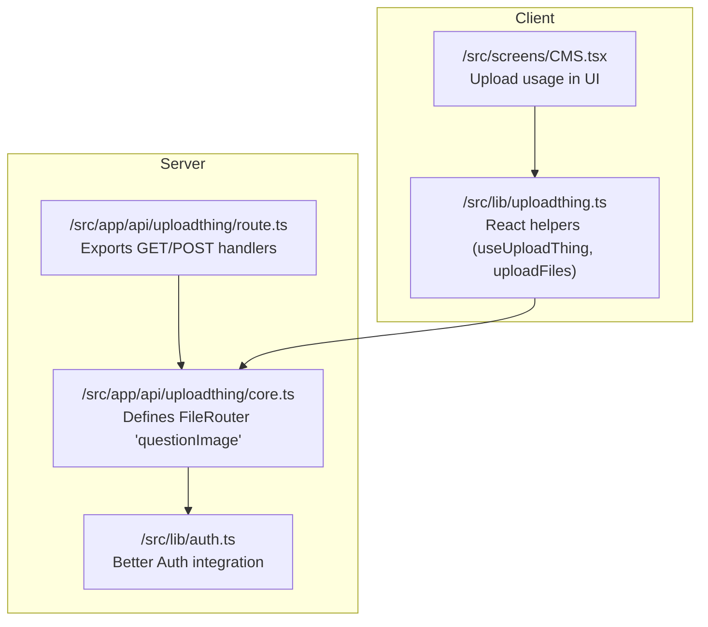
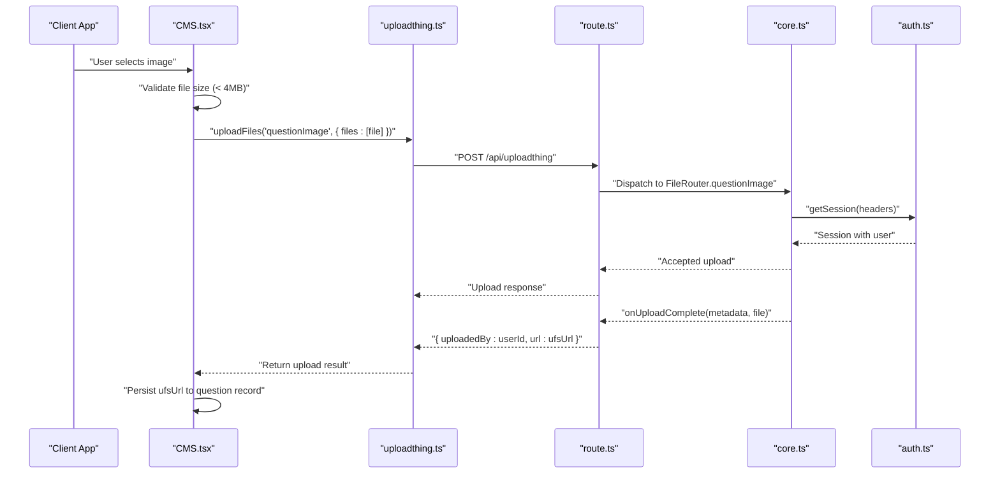
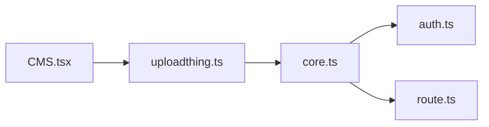

# File Upload APIs

<cite>
**Referenced Files in This Document**
- [route.ts](file://src/app/api/uploadthing/route.ts)
- [core.ts](file://src/app/api/uploadthing/core.ts)
- [uploadthing.ts](file://src/lib/uploadthing.ts)
- [CMS.tsx](file://src/screens/CMS.tsx)
- [auth.ts](file://src/lib/auth.ts)
- [.env.example](file://.env.example)
- [schema.ts](file://src/lib/db/schema.ts)
</cite>

## Table of Contents
1. [Introduction](#introduction)
2. [Project Structure](#project-structure)
3. [Core Components](#core-components)
4. [Architecture Overview](#architecture-overview)
5. [Detailed Component Analysis](#detailed-component-analysis)
6. [Dependency Analysis](#dependency-analysis)
7. [Performance Considerations](#performance-considerations)
8. [Troubleshooting Guide](#troubleshooting-guide)
9. [Conclusion](#conclusion)

## Introduction
This document provides comprehensive API documentation for MatricMaster AI's file upload and management capabilities powered by UploadThing. It covers the UploadThing integration endpoints under /api/uploadthing, including file upload, completion handling, and storage management. It also documents supported file types, size limitations, validation rules, authentication requirements, access control, and client-side implementation patterns for initiating uploads, tracking progress, and handling errors. Guidance on file naming, storage optimization, cleanup procedures, troubleshooting, and performance optimization is included.

## Project Structure
The upload functionality is implemented using a Next.js App Router-compatible route handler that delegates to UploadThing's router. The client-side helpers are generated from the same router definition to ensure type-safe interactions.

**Diagram sources**
- [route.ts](file://src/app/api/uploadthing/route.ts#L1-L12)
- [core.ts](file://src/app/api/uploadthing/core.ts#L1-L34)
- [uploadthing.ts](file://src/lib/uploadthing.ts#L1-L6)
- [CMS.tsx](file://src/screens/CMS.tsx#L240-L333)
- [auth.ts](file://src/lib/auth.ts#L1-L103)

**Section sources**
- [route.ts](file://src/app/api/uploadthing/route.ts#L1-L12)
- [core.ts](file://src/app/api/uploadthing/core.ts#L1-L34)
- [uploadthing.ts](file://src/lib/uploadthing.ts#L1-L6)
- [CMS.tsx](file://src/screens/CMS.tsx#L240-L333)
- [auth.ts](file://src/lib/auth.ts#L1-L103)

## Core Components
- UploadThing Route Handler: Exposes GET and POST endpoints for the UploadThing router and reads the UploadThing token from environment variables.
- UploadThing FileRouter: Defines the 'questionImage' endpoint with image validation (maxFileSize and maxFileCount), middleware for authentication, and onUploadComplete callback returning metadata and file URL.
- React Helpers: Generated helpers for client-side integration, providing typed upload functions and hooks.
- Client Implementation: Example usage in CMS.tsx demonstrates selecting a file, validating size, uploading via uploadFiles, and handling results.

Key behaviors:
- Authentication: Middleware verifies session via Better Auth and throws an unauthorized error if unauthenticated.
- Validation: Enforces image file constraints (maxFileSize and maxFileCount).
- Completion: Returns uploadedBy (userId) and ufsUrl for downstream processing.

**Section sources**
- [route.ts](file://src/app/api/uploadthing/route.ts#L1-L12)
- [core.ts](file://src/app/api/uploadthing/core.ts#L8-L31)
- [uploadthing.ts](file://src/lib/uploadthing.ts#L1-L6)
- [CMS.tsx](file://src/screens/CMS.tsx#L240-L333)

## Architecture Overview
The upload flow integrates client-side selection and upload initiation with server-side middleware and completion handling.

**Diagram sources**
- [CMS.tsx](file://src/screens/CMS.tsx#L240-L333)
- [uploadthing.ts](file://src/lib/uploadthing.ts#L1-L6)
- [route.ts](file://src/app/api/uploadthing/route.ts#L1-L12)
- [core.ts](file://src/app/api/uploadthing/core.ts#L11-L31)
- [auth.ts](file://src/lib/auth.ts#L1-L103)

## Detailed Component Analysis

### UploadThing Route Handler (/api/uploadthing)
- Exports GET and POST handlers using UploadThing's route handler creator.
- Uses the FileRouter defined in core.ts.
- Reads UPLOADTHING_TOKEN from environment variables for secure routing.

Operational notes:
- The handler acts as a bridge between the UploadThing SDK and Next.js App Router.
- Token-based configuration ensures only authorized requests reach the router.

**Section sources**
- [route.ts](file://src/app/api/uploadthing/route.ts#L1-L12)

### UploadThing FileRouter (ourFileRouter)
Endpoint: questionImage
- File type: image
- Constraints:
  - maxFileSize: 4MB
  - maxFileCount: 1 per upload
- Middleware:
  - Authenticates the request using Better Auth getSession with headers.
  - Throws an unauthorized error if no session exists.
  - Passes userId to onUploadComplete via metadata.
- onUploadComplete:
  - Logs completion and file URL.
  - Returns uploadedBy (userId) and ufsUrl to the client.

Validation and error handling:
- Unauthorized access triggers UploadThingError.
- Size and count limits enforced by UploadThing configuration.

**Section sources**
- [core.ts](file://src/app/api/uploadthing/core.ts#L8-L31)

### Client-Side Upload Helpers
- React helpers are generated from the FileRouter type.
- Provides useUploadThing and uploadFiles for client-side integration.
- Ensures type safety for endpoint names and payload shapes.

Integration pattern:
- Call uploadFiles with the endpoint name and file array.
- Handle returned results and propagate errors to the UI.

**Section sources**
- [uploadthing.ts](file://src/lib/uploadthing.ts#L1-L6)

### Client Implementation in CMS Screen
- File selection:
  - Validates file size against 4MB limit.
  - Creates a local preview URL for immediate feedback.
- Upload initiation:
  - Calls uploadFiles('questionImage', { files: [file] }).
  - On success, extracts ufsUrl; otherwise alerts the user.
- Persistence:
  - Updates the question record with the returned ufsUrl.
  - Revokes local object URLs and resets state upon completion.

Progress and UX:
- Local preview provides instant visual feedback during selection.
- Error messages guide the user on retry or correction.

**Section sources**
- [CMS.tsx](file://src/screens/CMS.tsx#L240-L333)

### Authentication and Access Control
- Session verification:
  - Middleware calls auth.api.getSession with request headers.
  - Unauthenticated requests are rejected with an unauthorized error.
- Trusted origins and base URL:
  - Better Auth configuration includes trusted origins aligned with NEXT_PUBLIC_APP_URL.
- Implications:
  - Only authenticated users can upload images.
  - Cross-origin restrictions apply based on configured origins.

**Section sources**
- [core.ts](file://src/app/api/uploadthing/core.ts#L12-L22)
- [auth.ts](file://src/lib/auth.ts#L48-L69)

### Supported File Types, Size Limits, and Validation Rules
- File type: image
- Size limit: 4MB
- Count limit: 1 file per upload
- Client-side validation:
  - UI enforces 4MB limit before initiating upload.
- Server-side enforcement:
  - UploadThing validates constraints and rejects oversized or invalid files.

Naming and storage:
- UploadThing generates UFS identifiers and returns ufsUrl in onUploadComplete.
- The application stores ufsUrl in the database for later retrieval.

**Section sources**
- [core.ts](file://src/app/api/uploadthing/core.ts#L11-L11)
- [CMS.tsx](file://src/screens/CMS.tsx#L302-L319)
- [schema.ts](file://src/lib/db/schema.ts#L52-L78)

### Request/Response Schemas

- Upload Initiation (client to server)
  - Endpoint: POST /api/uploadthing
  - Headers: Authorization derived from session (handled by UploadThing)
  - Body: multipart/form-data with single image file
  - Response: UploadThing response indicating accepted upload

- Upload Completion (server callback)
  - Event: onUploadComplete
  - Payload: metadata.userId, file.ufsUrl
  - Response: { uploadedBy: string, url: string }

- Client Result (after uploadFiles)
  - Result: Array of upload result entries
  - Fields: ufsUrl, key, name, size, etc. (per UploadThing SDK)
  - Example outcome: [ { ufsUrl: "<uploaded-file-url>" } ]

Notes:
- The exact shape of the uploadFiles result follows UploadThing's SDK contract.
- The completion handler returns a simplified object with uploadedBy and url.

**Section sources**
- [route.ts](file://src/app/api/uploadthing/route.ts#L6-L11)
- [core.ts](file://src/app/api/uploadthing/core.ts#L23-L30)
- [uploadthing.ts](file://src/lib/uploadthing.ts#L1-L6)

### Storage Management and Cleanup
- Storage location:
  - UploadThing manages storage and returns ufsUrl upon completion.
- Cleanup:
  - No explicit delete endpoint is exposed in the current FileRouter.
  - Application-level cleanup of references (e.g., removing imageUrl from records) should revoke local previews and avoid dangling references.
- Best practices:
  - Store only ufsUrl in the database.
  - Remove local object URLs after successful persistence.
  - Consider implementing a dedicated deletion endpoint if future requirements demand removal of uploaded files.

**Section sources**
- [core.ts](file://src/app/api/uploadthing/core.ts#L23-L30)
- [schema.ts](file://src/lib/db/schema.ts#L52-L78)
- [CMS.tsx](file://src/screens/CMS.tsx#L286-L298)

## Dependency Analysis
The upload pipeline depends on UploadThing for routing and processing, Better Auth for session verification, and the client-side helpers for type-safe interactions.

**Diagram sources**
- [CMS.tsx](file://src/screens/CMS.tsx#L240-L333)
- [uploadthing.ts](file://src/lib/uploadthing.ts#L1-L6)
- [core.ts](file://src/app/api/uploadthing/core.ts#L1-L34)
- [auth.ts](file://src/lib/auth.ts#L1-L103)
- [route.ts](file://src/app/api/uploadthing/route.ts#L1-L12)

**Section sources**
- [CMS.tsx](file://src/screens/CMS.tsx#L240-L333)
- [uploadthing.ts](file://src/lib/uploadthing.ts#L1-L6)
- [core.ts](file://src/app/api/uploadthing/core.ts#L1-L34)
- [auth.ts](file://src/lib/auth.ts#L1-L103)
- [route.ts](file://src/app/api/uploadthing/route.ts#L1-L12)

## Performance Considerations
- Optimize image size before upload:
  - Enforce client-side size checks (already implemented at 4MB).
  - Consider compressing images to reduce upload time and bandwidth.
- Minimize concurrent uploads:
  - Limit simultaneous uploads to avoid throttling and improve reliability.
- CDN and caching:
  - Rely on UploadThing's CDN for fast delivery of uploaded images.
- Database writes:
  - Persist ufsUrl after successful upload to avoid redundant re-uploads.
- Error handling:
  - Retry transient failures gracefully and surface actionable messages to users.

[No sources needed since this section provides general guidance]

## Troubleshooting Guide
Common issues and resolutions:
- Unauthorized access:
  - Symptom: Upload rejected with unauthorized error.
  - Cause: Missing or invalid session.
  - Resolution: Ensure user is authenticated before attempting upload.
  - Evidence: Middleware checks session and throws error if absent.
  
- File too large:
  - Symptom: Upload fails immediately.
  - Cause: File exceeds 4MB limit.
  - Resolution: Compress or resize the image; UI already enforces 4MB client-side.
  
- Missing UploadThing token:
  - Symptom: Route handler configuration error.
  - Cause: UPLOADTHING_TOKEN not set in environment.
  - Resolution: Set UPLOADTHING_TOKEN in environment variables.
  
- CORS or origin mismatch:
  - Symptom: Preflight or fetch errors.
  - Cause: Trusted origins not aligned with app URL.
  - Resolution: Configure BETTER_AUTH_URL or NEXT_PUBLIC_APP_URL consistently with UploadThing expectations.
  
- Upload completes but URL not saved:
  - Symptom: Image appears uploaded but not persisted.
  - Cause: Client did not extract ufsUrl or database write failed.
  - Resolution: Verify uploadFiles result and ensure database update succeeds.

**Section sources**
- [core.ts](file://src/app/api/uploadthing/core.ts#L12-L22)
- [CMS.tsx](file://src/screens/CMS.tsx#L302-L319)
- [.env.example](file://.env.example#L11-L12)
- [auth.ts](file://src/lib/auth.ts#L48-L69)

## Conclusion
MatricMaster AI's file upload system leverages UploadThing for robust, type-safe uploads with integrated authentication and completion handling. The current implementation supports image uploads up to 4MB with strict validation and session-based access control. Client-side integration in CMS.tsx demonstrates a practical pattern for selection, validation, upload, and persistence. For future enhancements, consider adding explicit deletion endpoints and advanced compression/preprocessing to further optimize performance and user experience.