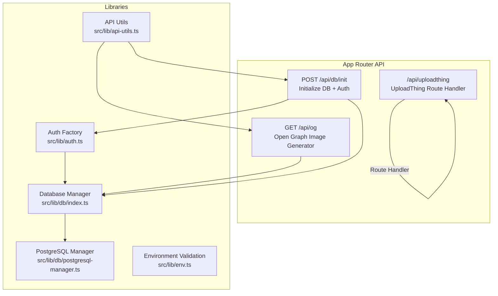
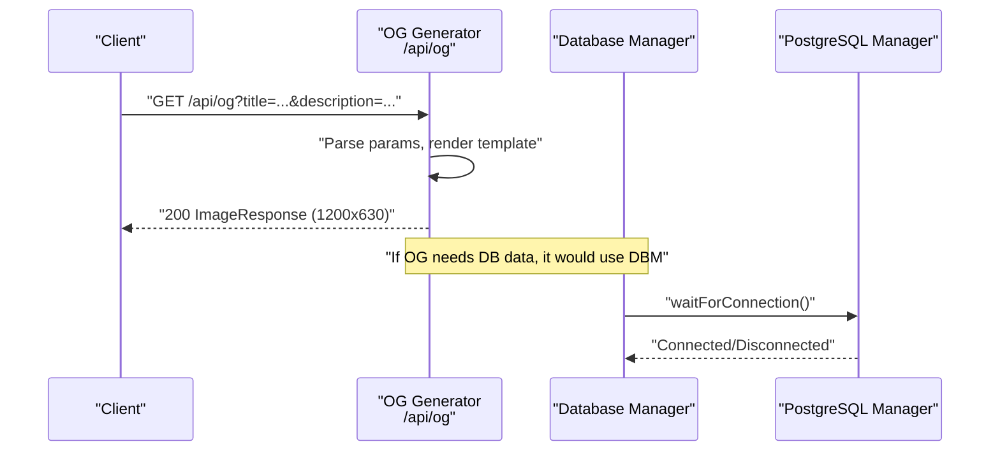
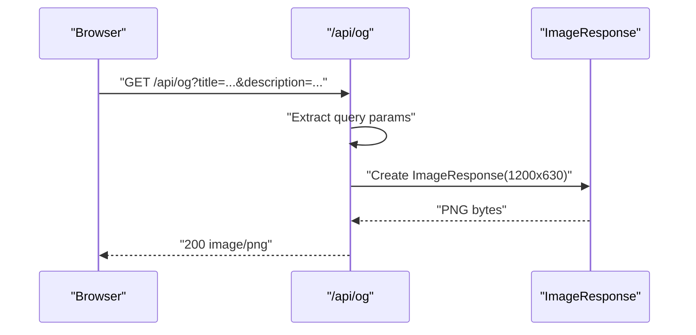
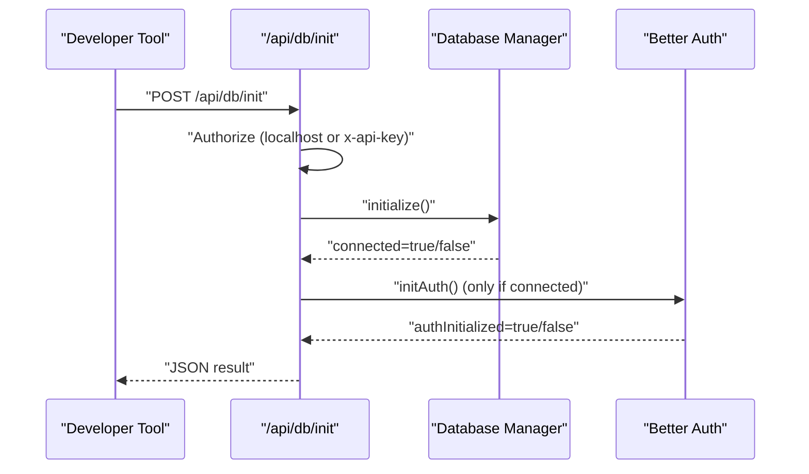
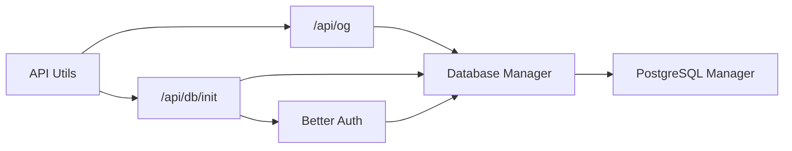

# Utility and Helper APIs

<cite>
**Referenced Files in This Document**
- [route.tsx](file://src/app/api/og/route.tsx)
- [route.ts](file://src/app/api/db/init/route.ts)
- [index.ts](file://src/lib/db/index.ts)
- [postgresql-manager.ts](file://src/lib/db/postgresql-manager.ts)
- [schema.ts](file://src/lib/db/schema.ts)
- [auth.ts](file://src/lib/auth.ts)
- [env.ts](file://src/lib/env.ts)
- [api-utils.ts](file://src/lib/api-utils.ts)
- [route.ts](file://src/app/api/uploadthing/route.ts)
- [uploadthing.ts](file://src/lib/uploadthing.ts)
- [test-db-auth.js](file://test-db-auth.js)
</cite>

## Table of Contents
1. [Introduction](#introduction)
2. [Project Structure](#project-structure)
3. [Core Components](#core-components)
4. [Architecture Overview](#architecture-overview)
5. [Detailed Component Analysis](#detailed-component-analysis)
6. [Dependency Analysis](#dependency-analysis)
7. [Performance Considerations](#performance-considerations)
8. [Troubleshooting Guide](#troubleshooting-guide)
9. [Conclusion](#conclusion)
10. [Appendices](#appendices)

## Introduction
This document provides detailed API documentation for MatricMaster AI’s utility and helper endpoints, focusing on:
- Open Graph image generation endpoint for SEO-optimized social previews
- Development and testing database initialization endpoint
- Supporting utilities for rate limiting, environment validation, and API response helpers
- Practical examples, performance considerations, and integration guidance

## Project Structure
The utility and helper endpoints are implemented under the Next.js App Router at:
- Open Graph image generator: src/app/api/og/route.tsx
- Database initialization endpoint: src/app/api/db/init/route.ts
- Supporting libraries: src/lib/db, src/lib/auth, src/lib/env, src/lib/api-utils
- UploadThing integration: src/app/api/uploadthing/route.ts and src/lib/uploadthing.ts
- Test scripts: test-db-auth.js

**Diagram sources**
- [route.tsx](file://src/app/api/og/route.tsx#L1-L112)
- [route.ts](file://src/app/api/db/init/route.ts#L1-L100)
- [index.ts](file://src/lib/db/index.ts#L1-L102)
- [postgresql-manager.ts](file://src/lib/db/postgresql-manager.ts#L1-L162)
- [auth.ts](file://src/lib/auth.ts#L1-L103)
- [env.ts](file://src/lib/env.ts#L1-L62)
- [api-utils.ts](file://src/lib/api-utils.ts#L1-L93)
- [route.ts](file://src/app/api/uploadthing/route.ts#L1-L12)

**Section sources**
- [route.tsx](file://src/app/api/og/route.tsx#L1-L112)
- [route.ts](file://src/app/api/db/init/route.ts#L1-L100)
- [index.ts](file://src/lib/db/index.ts#L1-L102)
- [postgresql-manager.ts](file://src/lib/db/postgresql-manager.ts#L1-L162)
- [auth.ts](file://src/lib/auth.ts#L1-L103)
- [env.ts](file://src/lib/env.ts#L1-L62)
- [api-utils.ts](file://src/lib/api-utils.ts#L1-L93)
- [route.ts](file://src/app/api/uploadthing/route.ts#L1-L12)

## Core Components
- Open Graph Image Generator: Generates SEO-friendly social preview images with configurable title and description parameters.
- Database Initialization Endpoint: Initializes database connectivity and Better Auth, guarded by localhost or internal API key.
- API Utilities: Provides rate limiting, standardized error/success responses, and environment validation helpers.
- UploadThing Integration: Exposes UploadThing route handler for file uploads.

**Section sources**
- [route.tsx](file://src/app/api/og/route.tsx#L6-L111)
- [route.ts](file://src/app/api/db/init/route.ts#L30-L99)
- [api-utils.ts](file://src/lib/api-utils.ts#L18-L92)
- [route.ts](file://src/app/api/uploadthing/route.ts#L1-L12)

## Architecture Overview
The utility endpoints integrate with the database layer and authentication factory to support development workflows and SEO optimization.

**Diagram sources**
- [route.tsx](file://src/app/api/og/route.tsx#L6-L111)
- [index.ts](file://src/lib/db/index.ts#L59-L63)
- [postgresql-manager.ts](file://src/lib/db/postgresql-manager.ts#L128-L140)

## Detailed Component Analysis

### Open Graph Image Generation Endpoint (/api/og)
Purpose:
- Dynamically generates SEO-optimized Open Graph images for social sharing.
- Embeds metadata such as title, description, and brand elements.
- Returns a fixed-size PNG image suitable for platforms supporting Open Graph.

Key behaviors:
- Runtime: Edge runtime for low latency.
- Parameters:
  - title: Optional. Defaults to a brand title.
  - description: Optional. Defaults to a tagline.
- Rendering:
  - Uses Next.js OG ImageResponse with a responsive flex layout.
  - Fixed canvas size: 1200px width × 630px height.
  - Branding includes a stylized icon and footer metadata.
- Error handling:
  - Catches rendering errors and returns a 500 response.

Request
- Method: GET
- Path: /api/og
- Query parameters:
  - title: string (optional)
  - description: string (optional)

Response
- Content-Type: image/png
- Body: Binary PNG image data
- Status codes:
  - 200: Success
  - 500: Internal error during image generation

SEO and Metadata
- The generated image embeds:
  - Title text centered prominently
  - Description text below the title
  - Footer with domain, grade level, and region
- These elements improve discoverability and click-through rates on social platforms.

Caching Strategy
- Recommendation: Configure CDN caching for static OG images.
- Suggested cache policy:
  - Cache-Control: public, max-age=86400 (1 day)
  - ETag/Last-Modified: optional, for conditional requests
- Dynamic images with user-provided parameters should be cached per parameter set.

Integration Example
- Social meta tags:
  - <meta property="og:image" content="https://yourdomain.ai/api/og?title=Math+Quiz&description=Practice+with+realistic+questions" />
  - <meta property="og:image:width" content="1200" />
  - <meta property="og:image:height" content="630" />

**Diagram sources**
- [route.tsx](file://src/app/api/og/route.tsx#L6-L111)

**Section sources**
- [route.tsx](file://src/app/api/og/route.tsx#L4-L111)

### Test Database Endpoint (/api/db/init)
Purpose:
- Initializes database connectivity and Better Auth for development/testing.
- Guards access to localhost or via an internal API key header.

Authorization
- Allowed origins:
  - Requests from localhost (IPv4/IPv6/loopback)
- Programmatic access:
  - Header: x-api-key must match INTERNAL_API_KEY

Behavior
- POST:
  - Initializes database connection via Database Manager.
  - On success, attempts to initialize Better Auth.
  - Returns structured JSON indicating success/failure and connection status.
- GET:
  - Returns current connection and availability status of PostgreSQL.

Responses
- POST:
  - 200: Database connected successfully
  - 200: Database connected, but auth initialization failed
  - 401: Unauthorized
  - 503: Failed to connect to database
  - 500: Internal server error
- GET:
  - 200: { connected: boolean, available: boolean }

**Diagram sources**
- [route.ts](file://src/app/api/db/init/route.ts#L6-L99)
- [index.ts](file://src/lib/db/index.ts#L24-L39)
- [auth.ts](file://src/lib/auth.ts#L72-L79)

**Section sources**
- [route.ts](file://src/app/api/db/init/route.ts#L6-L99)
- [index.ts](file://src/lib/db/index.ts#L24-L86)
- [auth.ts](file://src/lib/auth.ts#L72-L86)

### Supporting Libraries and Utilities

#### API Utilities
- Rate Limiting:
  - Middleware wrapper that enforces sliding-window limits by IP.
  - Adds X-RateLimit-* headers to responses.
- Standard Responses:
  - apiError and apiSuccess helpers for consistent JSON responses.

Usage pattern:
- Wrap handlers with withRateLimit(config) to apply rate limits.
- Use apiError/apiSuccess for uniform error/success payloads.

**Section sources**
- [api-utils.ts](file://src/lib/api-utils.ts#L18-L92)

#### Environment Validation
- Validates environment variables using Zod schema.
- Provides helpers to require or get environment values safely.

**Section sources**
- [env.ts](file://src/lib/env.ts#L19-L61)

#### Database Layer
- Database Manager:
  - Singleton managing PostgreSQL connection lifecycle.
  - Provides waitForConnection, isConnected, and preferred database detection.
- PostgreSQL Manager:
  - Manages connection pool, timeouts, and SSL for Neon-compatible URLs.
  - Includes graceful shutdown hooks.

**Section sources**
- [index.ts](file://src/lib/db/index.ts#L9-L87)
- [postgresql-manager.ts](file://src/lib/db/postgresql-manager.ts#L18-L141)

#### Authentication Factory
- Creates Better Auth instance with database adapter when available.
- Supports email/password and Google OAuth providers; optionally Twitter if configured.

**Section sources**
- [auth.ts](file://src/lib/auth.ts#L9-L69)

#### UploadThing Integration
- Exposes route handler for UploadThing router.
- React helpers exported for client-side usage.

**Section sources**
- [route.ts](file://src/app/api/uploadthing/route.ts#L1-L12)
- [uploadthing.ts](file://src/lib/uploadthing.ts#L1-L6)

### Test Database Script
- Validates database connection, Better Auth configuration, and basic query execution.
- Demonstrates typical development-time checks for DB and auth.

**Section sources**
- [test-db-auth.js](file://test-db-auth.js#L5-L63)

## Dependency Analysis
The utility endpoints depend on the database and auth layers. The following diagram shows key dependencies:

**Diagram sources**
- [route.tsx](file://src/app/api/og/route.tsx#L1-L112)
- [route.ts](file://src/app/api/db/init/route.ts#L1-L100)
- [index.ts](file://src/lib/db/index.ts#L1-L102)
- [postgresql-manager.ts](file://src/lib/db/postgresql-manager.ts#L1-L162)
- [auth.ts](file://src/lib/auth.ts#L1-L103)
- [api-utils.ts](file://src/lib/api-utils.ts#L1-L93)

**Section sources**
- [route.tsx](file://src/app/api/og/route.tsx#L1-L112)
- [route.ts](file://src/app/api/db/init/route.ts#L1-L100)
- [index.ts](file://src/lib/db/index.ts#L1-L102)
- [postgresql-manager.ts](file://src/lib/db/postgresql-manager.ts#L1-L162)
- [auth.ts](file://src/lib/auth.ts#L1-L103)
- [api-utils.ts](file://src/lib/api-utils.ts#L1-L93)

## Performance Considerations
- Open Graph Endpoint:
  - Edge runtime reduces cold start and latency.
  - Keep templates minimal; avoid heavy computations or external fetches.
  - Cache generated images at CDN with appropriate TTL.
- Database Initialization:
  - Authorization guards prevent misuse; keep retry delays reasonable.
  - Use waitForConnection with conservative retries to avoid blocking.
- Rate Limiting:
  - Apply withRateLimit to protect endpoints under load.
  - Monitor X-RateLimit-* headers for operational insights.

[No sources needed since this section provides general guidance]

## Troubleshooting Guide
Common issues and resolutions:
- OG image generation fails:
  - Verify runtime and template parameters.
  - Check console logs for thrown exceptions.
- Unauthorized DB init:
  - Confirm request origin is localhost or x-api-key matches INTERNAL_API_KEY.
- Database connection failures:
  - Ensure DATABASE_URL is set and reachable.
  - Use test script to validate connectivity and auth configuration.
- Health checks:
  - Use health endpoint to confirm database connectivity before relying on endpoints.

**Section sources**
- [route.tsx](file://src/app/api/og/route.tsx#L107-L111)
- [route.ts](file://src/app/api/db/init/route.ts#L32-L41)
- [test-db-auth.js](file://test-db-auth.js#L8-L21)

## Conclusion
MatricMaster AI’s utility and helper endpoints streamline development and SEO workflows:
- The OG image generator produces consistent, cacheable previews.
- The DB init endpoint enables safe, controlled initialization for development.
- Supporting utilities standardize error handling, rate limiting, and environment validation.
Adopt recommended caching and monitoring practices to maintain performance and reliability.

[No sources needed since this section summarizes without analyzing specific files]

## Appendices

### API Reference Summary

- Open Graph Image Generator
  - Method: GET
  - Path: /api/og
  - Query:
    - title: string (optional)
    - description: string (optional)
  - Response: image/png (1200x630)
  - Status: 200, 500

- Database Initialization
  - Method: POST
  - Path: /api/db/init
  - Headers:
    - x-api-key: string (required for programmatic access)
  - Response: JSON with success, message, connected, authInitialized (when applicable)
  - Status: 200, 401, 503, 500

  - Method: GET
  - Path: /api/db/init
  - Response: { connected: boolean, available: boolean }
  - Status: 200

- UploadThing
  - Methods: GET, POST
  - Path: /api/uploadthing
  - Config: UPLOADTHING_TOKEN

**Section sources**
- [route.tsx](file://src/app/api/og/route.tsx#L6-L111)
- [route.ts](file://src/app/api/db/init/route.ts#L30-L99)
- [route.ts](file://src/app/api/uploadthing/route.ts#L1-L12)

### Development Workflow Integration
- Use the DB init endpoint to bootstrap local environments.
- Integrate OG images in pages’ metadata for social sharing.
- Apply rate limiting to protect endpoints during load testing.
- Validate environment variables with env helpers before deployment.

[No sources needed since this section provides general guidance]