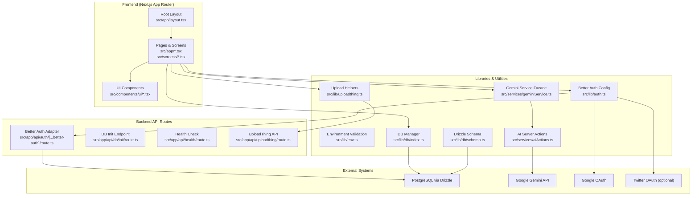
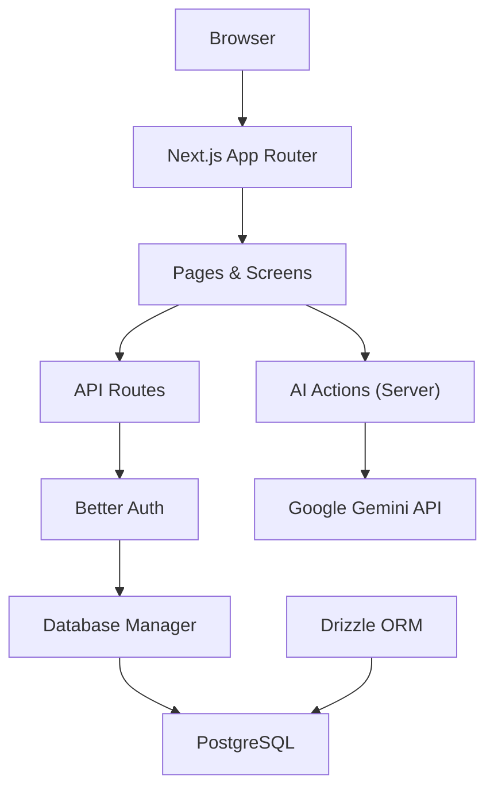
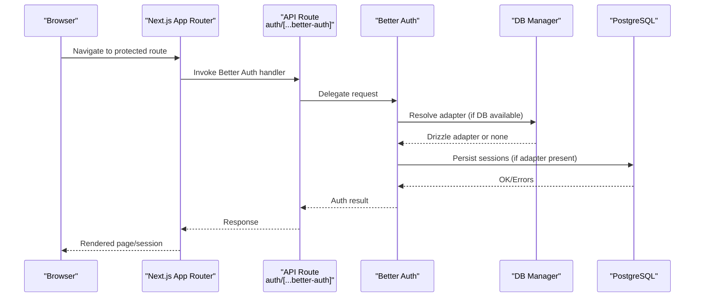
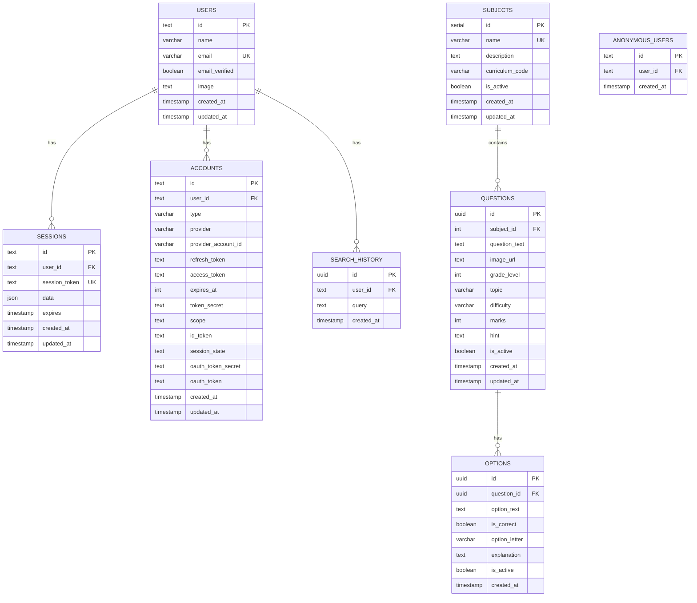
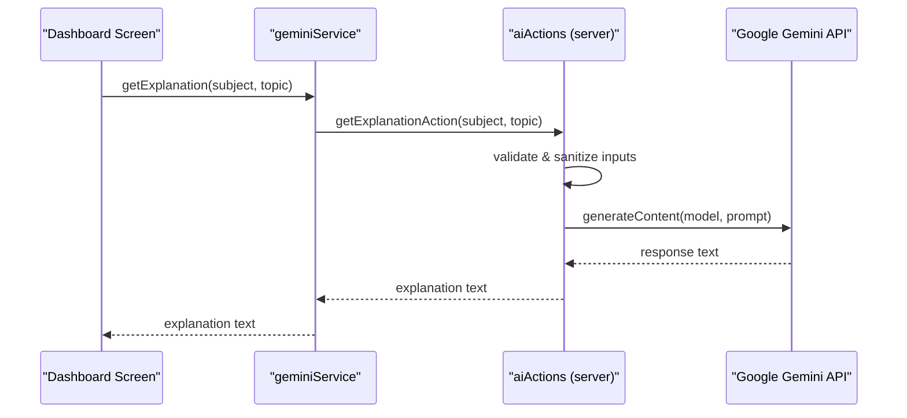
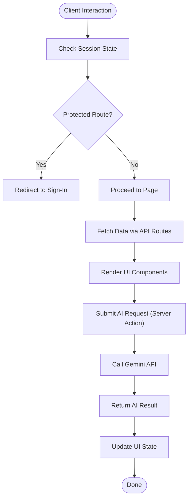
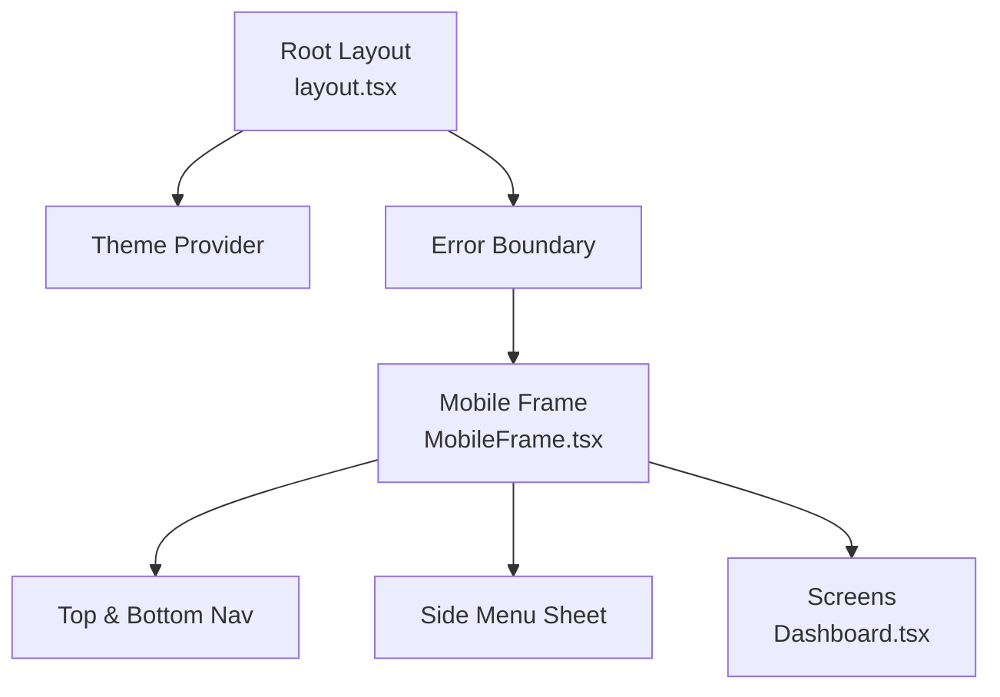
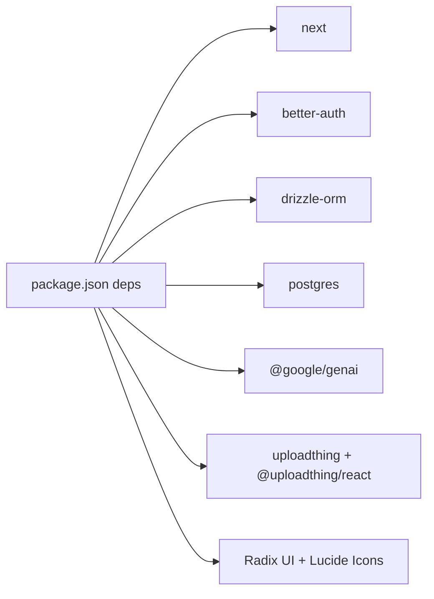
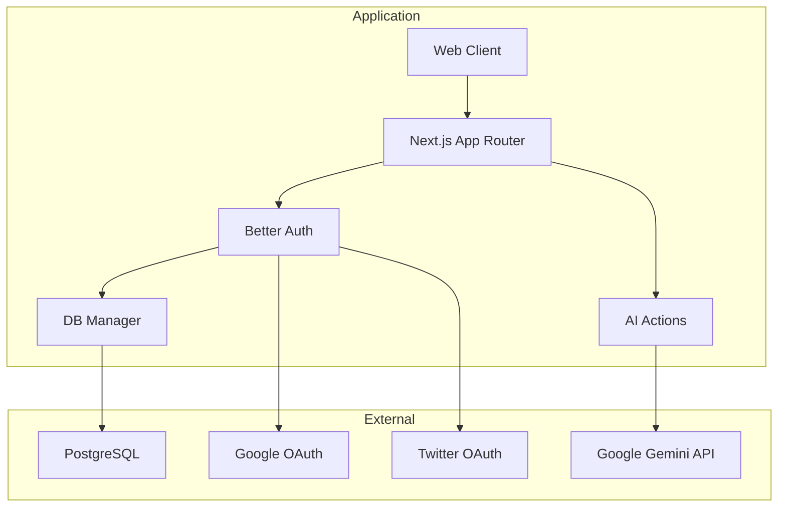

# Architecture Overview

<cite>
**Referenced Files in This Document**
- [package.json](file://package.json)
- [next.config.mjs](file://next.config.mjs)
- [src/app/layout.tsx](file://src/app/layout.tsx)
- [src/app/page.tsx](file://src/app/page.tsx)
- [src/lib/auth.ts](file://src/lib/auth.ts)
- [src/app/api/auth/[...better-auth]/route.ts](file://src/app/api/auth/[...better-auth]/route.ts)
- [src/lib/env.ts](file://src/lib/env.ts)
- [src/lib/db/index.ts](file://src/lib/db/index.ts)
- [drizzle.config.ts](file://drizzle.config.ts)
- [src/lib/db/schema.ts](file://src/lib/db/schema.ts)
- [src/services/geminiService.ts](file://src/services/geminiService.ts)
- [src/services/aiActions.ts](file://src/services/aiActions.ts)
- [src/screens/Dashboard.tsx](file://src/screens/Dashboard.tsx)
- [src/components/Layout/MobileFrame.tsx](file://src/components/Layout/MobileFrame.tsx)
- [src/lib/uploadthing.ts](file://src/lib/uploadthing.ts)
</cite>

## Table of Contents
1. [Introduction](#introduction)
2. [Project Structure](#project-structure)
3. [Core Components](#core-components)
4. [Architecture Overview](#architecture-overview)
5. [Detailed Component Analysis](#detailed-component-analysis)
6. [Dependency Analysis](#dependency-analysis)
7. [Performance Considerations](#performance-considerations)
8. [Troubleshooting Guide](#troubleshooting-guide)
9. [Conclusion](#conclusion)
10. [Appendices](#appendices)

## Introduction
This document describes the high-level architecture of MatricMaster AI, a Next.js 16 application leveraging the App Router. The system follows a modular monolith approach separating frontend pages and components, backend API routes, database layer, and AI integration services. It integrates Better Auth for authentication, Drizzle ORM for database modeling and migrations, and Google Gemini for AI-powered features. The document explains system boundaries, component interactions, data flows, and operational concerns such as security, monitoring, and scalability.

## Project Structure
The project is organized around the Next.js App Router with a clear separation of concerns:
- Frontend pages and UI components under src/app and src/components
- Screens and page-level containers under src/screens
- Backend API routes under src/app/api
- Authentication, database, environment, and utilities under src/lib
- AI services and actions under src/services
- Build-time configuration under next.config.mjs and drizzle.config.ts

**Diagram sources**
- [src/app/layout.tsx](file://src/app/layout.tsx#L84-L107)
- [src/app/api/auth/[...better-auth]/route.ts](file://src/app/api/auth/[...better-auth]/route.ts#L1-L5)
- [src/lib/auth.ts](file://src/lib/auth.ts#L48-L69)
- [src/lib/db/index.ts](file://src/lib/db/index.ts#L24-L39)
- [src/lib/db/schema.ts](file://src/lib/db/schema.ts#L1-L160)
- [src/services/geminiService.ts](file://src/services/geminiService.ts#L1-L14)
- [src/services/aiActions.ts](file://src/services/aiActions.ts#L20-L32)
- [src/lib/uploadthing.ts](file://src/lib/uploadthing.ts#L1-L6)

**Section sources**
- [package.json](file://package.json#L1-L84)
- [next.config.mjs](file://next.config.mjs#L1-L33)
- [src/app/layout.tsx](file://src/app/layout.tsx#L1-L108)
- [drizzle.config.ts](file://drizzle.config.ts#L1-L16)

## Core Components
- Next.js App Router pages and screens: Define routes and render page-level UI (e.g., homepage, dashboard).
- Better Auth integration: Provides authentication with email/password and optional social providers, backed by Drizzle ORM.
- Drizzle ORM: Database schema definitions, migrations, and connection management.
- AI Services: Server actions and service facade for Gemini-powered features.
- UploadThing: File upload integration with React helpers.
- Environment configuration: Centralized validation and retrieval of environment variables.

**Section sources**
- [src/app/page.tsx](file://src/app/page.tsx#L1-L13)
- [src/lib/auth.ts](file://src/lib/auth.ts#L1-L103)
- [src/lib/db/index.ts](file://src/lib/db/index.ts#L1-L102)
- [src/lib/db/schema.ts](file://src/lib/db/schema.ts#L1-L160)
- [src/services/aiActions.ts](file://src/services/aiActions.ts#L1-L168)
- [src/services/geminiService.ts](file://src/services/geminiService.ts#L1-L14)
- [src/lib/uploadthing.ts](file://src/lib/uploadthing.ts#L1-L6)
- [src/lib/env.ts](file://src/lib/env.ts#L1-L62)

## Architecture Overview
MatricMaster AI employs a modular monolith with clear layering:
- Presentation Layer: Next.js App Router pages and screens, UI components, and layout wrappers.
- Application Layer: API routes implementing domain-specific endpoints (auth, DB init, health, uploads).
- Domain Services: Better Auth for identity, Drizzle ORM for persistence, and AI actions for generative features.
- Infrastructure: PostgreSQL database, Google Gemini API, and optional social OAuth providers.

**Diagram sources**
- [src/app/layout.tsx](file://src/app/layout.tsx#L84-L107)
- [src/app/api/auth/[...better-auth]/route.ts](file://src/app/api/auth/[...better-auth]/route.ts#L1-L5)
- [src/lib/db/index.ts](file://src/lib/db/index.ts#L24-L39)
- [src/services/aiActions.ts](file://src/services/aiActions.ts#L20-L32)

## Detailed Component Analysis

### Authentication Architecture with Better Auth
Better Auth is initialized centrally and conditionally adapts to database availability. It supports email/password and optional social providers (Google and Twitter). The API route exposes Better Auth handlers for Next.js.

**Diagram sources**
- [src/lib/auth.ts](file://src/lib/auth.ts#L48-L69)
- [src/app/api/auth/[...better-auth]/route.ts](file://src/app/api/auth/[...better-auth]/route.ts#L1-L5)
- [src/lib/db/index.ts](file://src/lib/db/index.ts#L24-L39)

**Section sources**
- [src/lib/auth.ts](file://src/lib/auth.ts#L1-L103)
- [src/app/api/auth/[...better-auth]/route.ts](file://src/app/api/auth/[...better-auth]/route.ts#L1-L5)

### Database Design with Drizzle ORM
The schema defines core tables for authentication (via Better Auth), quiz system entities, and search history. Relations capture foreign key constraints and indexing for performance.

**Diagram sources**
- [src/lib/db/schema.ts](file://src/lib/db/schema.ts#L14-L160)

**Section sources**
- [src/lib/db/schema.ts](file://src/lib/db/schema.ts#L1-L160)
- [drizzle.config.ts](file://drizzle.config.ts#L1-L16)
- [src/lib/db/index.ts](file://src/lib/db/index.ts#L1-L102)

### AI Integration Services
AI features are encapsulated in a service facade that delegates to server actions. Server actions validate inputs, sanitize content, and call the Gemini API. Results are returned to the client.

**Diagram sources**
- [src/screens/Dashboard.tsx](file://src/screens/Dashboard.tsx#L1-L340)
- [src/services/geminiService.ts](file://src/services/geminiService.ts#L1-L14)
- [src/services/aiActions.ts](file://src/services/aiActions.ts#L42-L78)

**Section sources**
- [src/services/geminiService.ts](file://src/services/geminiService.ts#L1-L14)
- [src/services/aiActions.ts](file://src/services/aiActions.ts#L1-L168)

### Client-Server Communication and State Management
- Pages and screens use client directives where needed (e.g., dashboard) and leverage Next.js routing and navigation.
- Authentication state is managed via Better Auth’s client utilities and consumed in components.
- Server actions encapsulate AI logic to keep the client lean and secure.
- File uploads integrate via UploadThing helpers.

**Diagram sources**
- [src/screens/Dashboard.tsx](file://src/screens/Dashboard.tsx#L61-L120)
- [src/lib/auth.ts](file://src/lib/auth.ts#L48-L69)
- [src/services/aiActions.ts](file://src/services/aiActions.ts#L20-L32)

**Section sources**
- [src/screens/Dashboard.tsx](file://src/screens/Dashboard.tsx#L1-L340)
- [src/lib/uploadthing.ts](file://src/lib/uploadthing.ts#L1-L6)

### Component Hierarchy and Layout
The root layout sets global metadata, theme provider, and error boundary. The mobile frame composes top navigation, bottom navigation, and a sheet-based side menu. Screens assemble UI components and orchestrate data fetching and navigation.

**Diagram sources**
- [src/app/layout.tsx](file://src/app/layout.tsx#L84-L107)
- [src/components/Layout/MobileFrame.tsx](file://src/components/Layout/MobileFrame.tsx#L43-L229)
- [src/screens/Dashboard.tsx](file://src/screens/Dashboard.tsx#L61-L120)

**Section sources**
- [src/app/layout.tsx](file://src/app/layout.tsx#L1-L108)
- [src/components/Layout/MobileFrame.tsx](file://src/components/Layout/MobileFrame.tsx#L1-L319)
- [src/screens/Dashboard.tsx](file://src/screens/Dashboard.tsx#L1-L340)

## Dependency Analysis
- Next.js and UI libraries: React, Next.js, Radix UI, Tailwind-based UI components.
- Authentication: Better Auth with Drizzle adapter and optional social providers.
- Database: Drizzle ORM with PostgreSQL, migration and studio tooling.
- AI: Google Gemini SDK for content generation.
- Uploads: UploadThing with React helpers.
- Environment: Zod-based validation for environment variables.

**Diagram sources**
- [package.json](file://package.json#L27-L64)

**Section sources**
- [package.json](file://package.json#L1-L84)

## Performance Considerations
- Image optimization and remote patterns are configured to reduce bandwidth and improve perceived performance.
- Optimize package imports for smaller bundles.
- Use server actions for AI workloads to keep client lightweight and avoid exposing API keys.
- Leverage database indexes defined in the schema for query performance.
- Consider caching strategies for AI responses and static assets.

[No sources needed since this section provides general guidance]

## Troubleshooting Guide
- Environment validation errors: Ensure required environment variables are set; the validator logs issues and may fall back to defaults in development.
- Database connectivity: The DB manager initializes connections and logs failures; verify DATABASE_URL and network access.
- Better Auth initialization: If DB is unavailable, sessions are not persisted; confirm database readiness before auth requests.
- AI service configuration: Missing GEMINI_API_KEY disables AI features; verify environment and model availability.

**Section sources**
- [src/lib/env.ts](file://src/lib/env.ts#L19-L45)
- [src/lib/db/index.ts](file://src/lib/db/index.ts#L24-L39)
- [src/lib/auth.ts](file://src/lib/auth.ts#L13-L21)
- [src/services/aiActions.ts](file://src/services/aiActions.ts#L22-L32)

## Conclusion
MatricMaster AI’s architecture balances modularity and simplicity using Next.js App Router, Better Auth, Drizzle ORM, and Google Gemini. The design emphasizes clear separation of concerns, robust authentication, scalable database modeling, and pragmatic AI integration. Operational excellence is supported by environment validation, structured migrations, and resilient server-side logic.

[No sources needed since this section summarizes without analyzing specific files]

## Appendices

### System Context Diagram
High-level view of external integrations and internal boundaries.

**Diagram sources**
- [src/lib/auth.ts](file://src/lib/auth.ts#L48-L69)
- [src/lib/db/index.ts](file://src/lib/db/index.ts#L24-L39)
- [src/services/aiActions.ts](file://src/services/aiActions.ts#L20-L32)

### Cross-Cutting Concerns
- Security: Environment validation, trusted origins, and secret-based session management in Better Auth; server actions prevent client-side API key exposure.
- Monitoring: Add logging around AI calls and DB operations; consider metrics for AI latency and error rates.
- Performance: Optimize queries with existing indexes, minimize client payload sizes, and cache static content.

[No sources needed since this section provides general guidance]