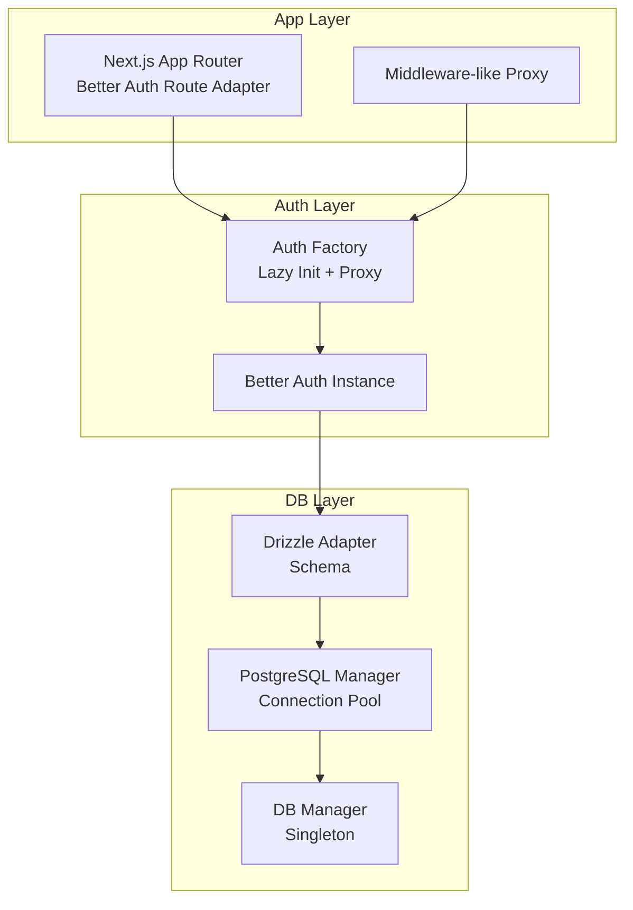
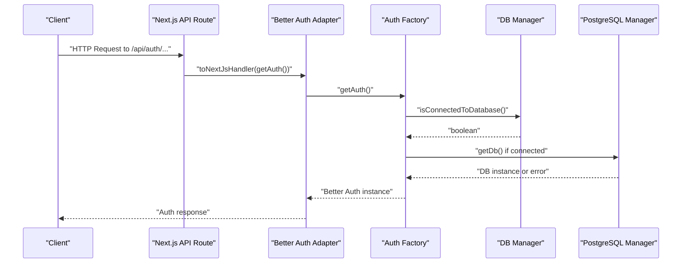
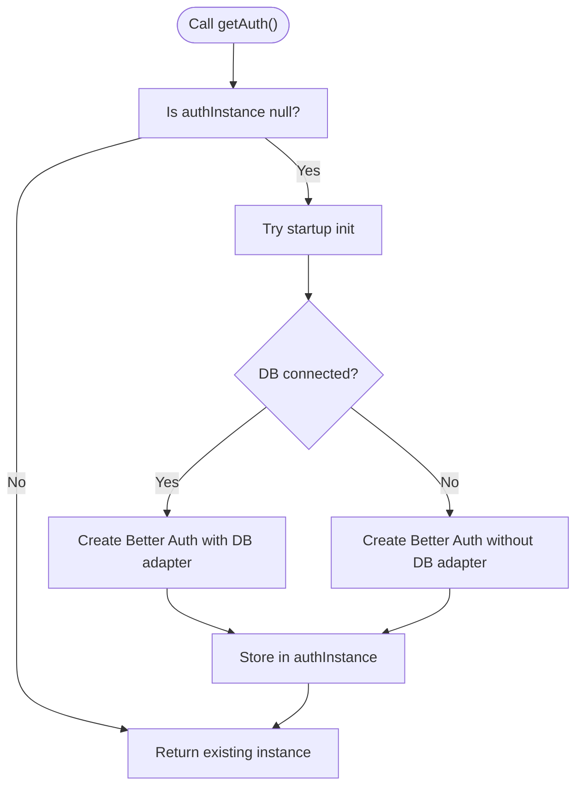
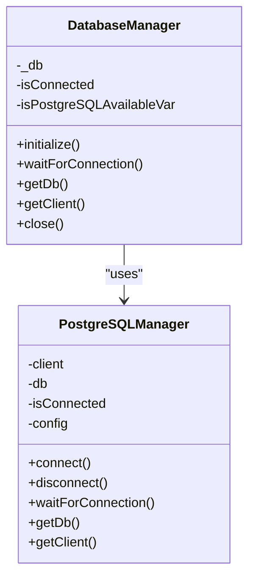
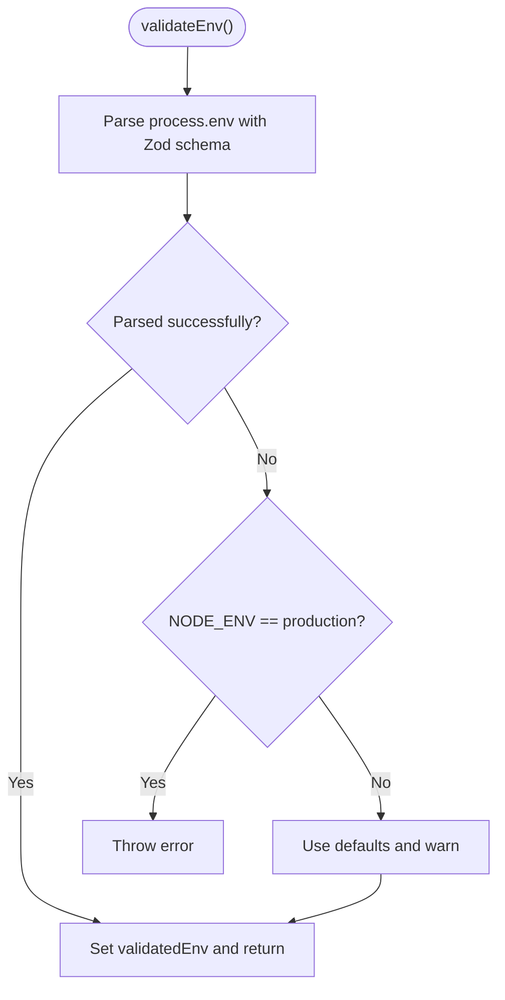
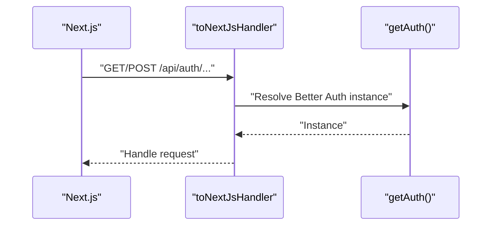
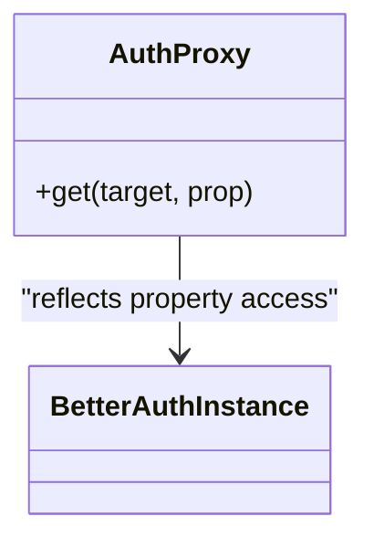
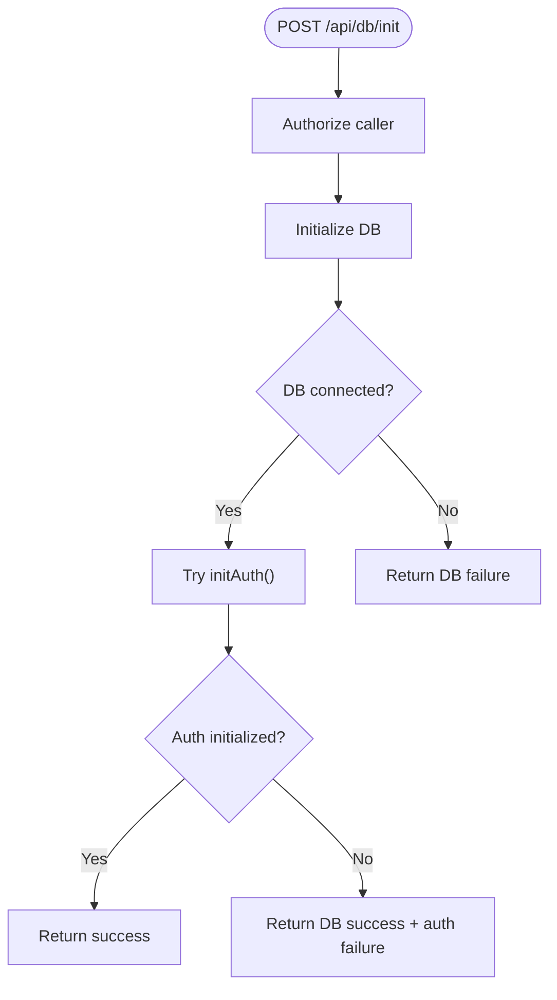
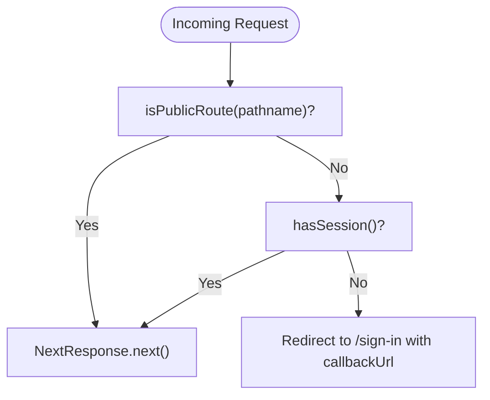
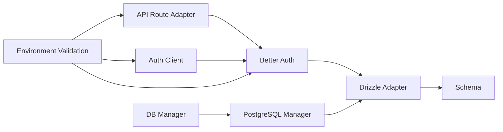

# Authentication Architecture

<cite>
**Referenced Files in This Document**
- [auth.ts](file://src/lib/auth.ts)
- [auth-client.ts](file://src/lib/auth-client.ts)
- [route.ts](file://src/app/api/auth/[...better-auth]/route.ts)
- [route.ts](file://src/app/api/db/init/route.ts)
- [index.ts](file://src/lib/db/index.ts)
- [postgresql-manager.ts](file://src/lib/db/postgresql-manager.ts)
- [schema.ts](file://src/lib/db/schema.ts)
- [better-auth-schema.ts](file://src/lib/db/better-auth-schema.ts)
- [proxy.ts](file://src/proxy.ts)
- [env.ts](file://src/lib/env.ts)
- [package.json](file://package.json)
</cite>

## Table of Contents
1. [Introduction](#introduction)
2. [Project Structure](#project-structure)
3. [Core Components](#core-components)
4. [Architecture Overview](#architecture-overview)
5. [Detailed Component Analysis](#detailed-component-analysis)
6. [Dependency Analysis](#dependency-analysis)
7. [Performance Considerations](#performance-considerations)
8. [Troubleshooting Guide](#troubleshooting-guide)
9. [Conclusion](#conclusion)

## Introduction
This document describes the authentication architecture for MatricMaster AI, focusing on the Better Auth integration pattern. It explains the factory pattern implementation, lazy initialization, and proxy-based access to the authentication instance. It documents the authentication instance creation process, database adapter configuration, environment variable validation, and the authentication lifecycle from initialization to runtime access. It also covers connection pooling, error handling strategies, and the modular separation of authentication concerns from database management. Finally, it details the authentication router setup, base URL configuration, and trusted origins management, along with practical initialization and access patterns.

## Project Structure
The authentication system spans several modules:
- Authentication core and factory: src/lib/auth.ts
- Client-side auth client: src/lib/auth-client.ts
- Better Auth API route adapter: src/app/api/auth/[...better-auth]/route.ts
- Database manager and PostgreSQL connector: src/lib/db/index.ts, src/lib/db/postgresql-manager.ts
- Drizzle schema and Better Auth schema: src/lib/db/schema.ts, src/lib/db/better-auth-schema.ts
- Environment validation: src/lib/env.ts
- Middleware-style proxy for session checks: src/proxy.ts
- Initialization endpoint: src/app/api/db/init/route.ts

**Diagram sources**
- [route.ts](file://src/app/api/auth/[...better-auth]/route.ts#L1-L5)
- [auth.ts](file://src/lib/auth.ts#L72-L87)
- [index.ts](file://src/lib/db/index.ts#L9-L87)
- [postgresql-manager.ts](file://src/lib/db/postgresql-manager.ts#L18-L141)
- [schema.ts](file://src/lib/db/schema.ts#L1-L160)
- [better-auth-schema.ts](file://src/lib/db/better-auth-schema.ts#L1-L107)

**Section sources**
- [auth.ts](file://src/lib/auth.ts#L1-L103)
- [auth-client.ts](file://src/lib/auth-client.ts#L1-L10)
- [route.ts](file://src/app/api/auth/[...better-auth]/route.ts#L1-L5)
- [index.ts](file://src/lib/db/index.ts#L1-L102)
- [postgresql-manager.ts](file://src/lib/db/postgresql-manager.ts#L1-L162)
- [schema.ts](file://src/lib/db/schema.ts#L1-L160)
- [better-auth-schema.ts](file://src/lib/db/better-auth-schema.ts#L1-L107)
- [proxy.ts](file://src/proxy.ts#L1-L58)
- [env.ts](file://src/lib/env.ts#L1-L62)

## Core Components
- Auth factory and lazy initialization: Creates and caches the Better Auth instance, conditionally enabling database persistence based on DB connectivity and environment variables.
- Proxy-based access: Provides transparent access to the Better Auth instance via a Proxy wrapper that resolves to the current instance on property access.
- Database manager: Singleton managing PostgreSQL connections, connection pooling, and graceful shutdown.
- PostgreSQL manager: Encapsulates connection establishment, pooling configuration, and retry logic.
- Drizzle adapter: Bridges Better Auth to the PostgreSQL database using Drizzle ORM with a unified schema.
- Environment validation: Centralized Zod-based validation and retrieval of environment variables.
- Auth client: React client for frontend session management and actions.
- API route adapter: Bridges Better Auth to Next.js API routes.
- Initialization endpoint: Controlled endpoint to initialize DB and auth with authorization checks.
- Middleware-like proxy: Enforces session presence for protected routes.

**Section sources**
- [auth.ts](file://src/lib/auth.ts#L7-L103)
- [index.ts](file://src/lib/db/index.ts#L9-L102)
- [postgresql-manager.ts](file://src/lib/db/postgresql-manager.ts#L18-L162)
- [schema.ts](file://src/lib/db/schema.ts#L1-L160)
- [better-auth-schema.ts](file://src/lib/db/better-auth-schema.ts#L1-L107)
- [auth-client.ts](file://src/lib/auth-client.ts#L1-L10)
- [route.ts](file://src/app/api/auth/[...better-auth]/route.ts#L1-L5)
- [route.ts](file://src/app/api/db/init/route.ts#L1-L100)
- [proxy.ts](file://src/proxy.ts#L1-L58)
- [env.ts](file://src/lib/env.ts#L1-L62)

## Architecture Overview
The system follows a layered architecture:
- Presentation and routing: Next.js app router exposes the Better Auth API under a catch-all route.
- Authentication service: A factory creates a Better Auth instance with optional database adapter and social providers.
- Database service: A singleton DB manager coordinates connection establishment and Drizzle adapter usage.
- Frontend client: A React client integrates with Better Auth for session state and actions.
- Runtime protection: A middleware-like proxy enforces session presence for protected routes.

**Diagram sources**
- [route.ts](file://src/app/api/auth/[...better-auth]/route.ts#L1-L5)
- [auth.ts](file://src/lib/auth.ts#L82-L87)
- [index.ts](file://src/lib/db/index.ts#L65-L71)
- [postgresql-manager.ts](file://src/lib/db/postgresql-manager.ts#L110-L122)

## Detailed Component Analysis

### Auth Factory and Lazy Initialization
- Factory function constructs Better Auth with:
  - Base URL derived from environment variables.
  - Secret for signing tokens.
  - Optional database adapter using Drizzle when DB is connected.
  - Email/password enabled and social providers configured conditionally.
  - Anonymous plugin enabled.
  - Session expiration and update age configured.
  - Trusted origins set from the public app URL.
- Lazy initialization:
  - initAuth waits for DB connection and ensures single instance creation.
  - getAuth lazily initializes on first access if not yet created.
  - Startup initialization attempts to create the instance if DB is connected.
- Proxy-based access:
  - A Proxy wrapper forwards property access to the current Better Auth instance, enabling seamless access without explicit initialization in consumers.

**Diagram sources**
- [auth.ts](file://src/lib/auth.ts#L72-L103)

**Section sources**
- [auth.ts](file://src/lib/auth.ts#L9-L70)
- [auth.ts](file://src/lib/auth.ts#L72-L103)

### Database Adapter Configuration and Connection Management
- DB Manager:
  - Singleton pattern ensuring a single connection lifecycle.
  - Initializes PostgreSQL via PostgreSQL Manager, sets internal flags, and stores DB instance.
  - Provides methods to wait for connection, check availability, and close gracefully.
- PostgreSQL Manager:
  - Establishes connection with pooling parameters (max connections, idle timeout, connection timeout).
  - Detects Neon-hosted connections and enables SSL accordingly.
  - Includes retry loop with delays and connection testing via a simple query.
  - Exposes graceful shutdown handlers for SIGTERM/SIGINT.
- Drizzle Adapter:
  - Uses Drizzle ORM with a unified schema that includes Better Auth tables and application tables.
  - Schema exports Better Auth tables for consistency and application-specific tables for quizzes and search history.

**Diagram sources**
- [index.ts](file://src/lib/db/index.ts#L9-L87)
- [postgresql-manager.ts](file://src/lib/db/postgresql-manager.ts#L18-L141)

**Section sources**
- [index.ts](file://src/lib/db/index.ts#L24-L87)
- [postgresql-manager.ts](file://src/lib/db/postgresql-manager.ts#L42-L141)
- [schema.ts](file://src/lib/db/schema.ts#L1-L160)
- [better-auth-schema.ts](file://src/lib/db/better-auth-schema.ts#L1-L107)

### Environment Variable Validation
- Centralized validation using Zod enforces:
  - Required URLs and secrets.
  - Optional social provider credentials.
  - Defaults for development and production behavior differences.
- Helper functions:
  - validateEnv parses and validates environment variables.
  - requireEnv throws if a required variable is missing.
  - getEnv retrieves optional values safely.

**Diagram sources**
- [env.ts](file://src/lib/env.ts#L19-L45)

**Section sources**
- [env.ts](file://src/lib/env.ts#L1-L62)

### Authentication Router Setup and Base URL Configuration
- API route adapter:
  - Converts Better Auth into a Next.js handler using toNextJsHandler.
  - Uses getAuth() to resolve the current Better Auth instance.
- Base URL and trusted origins:
  - Base URL is derived from BETTER_AUTH_URL or NEXT_PUBLIC_APP_URL with a fallback.
  - Trusted origins include NEXT_PUBLIC_APP_URL for CSRF protection and cross-origin safety.

**Diagram sources**
- [route.ts](file://src/app/api/auth/[...better-auth]/route.ts#L1-L5)
- [auth.ts](file://src/lib/auth.ts#L48-L69)

**Section sources**
- [route.ts](file://src/app/api/auth/[...better-auth]/route.ts#L1-L5)
- [auth.ts](file://src/lib/auth.ts#L48-L69)

### Proxy Pattern for Seamless Access
- The Proxy wrapper intercepts property access and delegates to the current Better Auth instance.
- Benefits:
  - Consumers can access auth methods without manual initialization.
  - Supports hot-swapping of the underlying instance if needed.
  - Simplifies integration across modules.

**Diagram sources**
- [auth.ts](file://src/lib/auth.ts#L97-L103)

**Section sources**
- [auth.ts](file://src/lib/auth.ts#L97-L103)

### Initialization Endpoint and Error Handling
- The initialization endpoint:
  - Guards access with localhost and shared secret checks.
  - Initializes DB and attempts to initialize Better Auth separately.
  - Returns structured responses indicating DB connection status and auth initialization outcome.
- Error handling:
  - Logs detailed errors server-side while returning standardized JSON responses.
  - Continues operation even if auth fails to initialize after DB connects.

**Diagram sources**
- [route.ts](file://src/app/api/db/init/route.ts#L30-L92)

**Section sources**
- [route.ts](file://src/app/api/db/init/route.ts#L1-L100)

### Frontend Client Integration
- React client:
  - Uses createAuthClient with baseURL derived from environment variables.
  - Enables anonymous client plugin for anonymous sessions.
  - Exports convenient hooks and actions for sign-in, sign-up, session management, and sign-out.

**Section sources**
- [auth-client.ts](file://src/lib/auth-client.ts#L1-L10)

### Middleware-like Proxy for Protected Routes
- Public routes list excludes authentication checks.
- Session detection checks for Better Auth cookies and anonymous cookies.
- Redirects unauthenticated users to the sign-in page with a callback URL.

**Diagram sources**
- [proxy.ts](file://src/proxy.ts#L24-L43)

**Section sources**
- [proxy.ts](file://src/proxy.ts#L1-L58)

## Dependency Analysis
- Better Auth depends on:
  - Drizzle adapter when DB is available.
  - Environment variables for base URL, secret, and social providers.
- DB managers depend on:
  - PostgreSQL client with pooling configuration.
  - Drizzle ORM and schema definitions.
- Frontend client depends on:
  - Better Auth client library and environment-provided base URL.
- API route adapter depends on:
  - Better Auth adapter conversion and resolved auth instance.

**Diagram sources**
- [auth.ts](file://src/lib/auth.ts#L1-L103)
- [index.ts](file://src/lib/db/index.ts#L1-L102)
- [postgresql-manager.ts](file://src/lib/db/postgresql-manager.ts#L1-L162)
- [schema.ts](file://src/lib/db/schema.ts#L1-L160)
- [auth-client.ts](file://src/lib/auth-client.ts#L1-L10)
- [route.ts](file://src/app/api/auth/[...better-auth]/route.ts#L1-L5)
- [env.ts](file://src/lib/env.ts#L1-L62)

**Section sources**
- [package.json](file://package.json#L27-L64)
- [auth.ts](file://src/lib/auth.ts#L1-L103)
- [index.ts](file://src/lib/db/index.ts#L1-L102)
- [postgresql-manager.ts](file://src/lib/db/postgresql-manager.ts#L1-L162)
- [schema.ts](file://src/lib/db/schema.ts#L1-L160)
- [auth-client.ts](file://src/lib/auth-client.ts#L1-L10)
- [route.ts](file://src/app/api/auth/[...better-auth]/route.ts#L1-L5)
- [env.ts](file://src/lib/env.ts#L1-L62)

## Performance Considerations
- Connection pooling:
  - PostgreSQL Manager configures max connections, idle timeouts, and connection timeouts to balance resource usage and responsiveness.
- Lazy initialization:
  - Auth instance is created only when needed, reducing cold-start overhead until authentication is actually required.
- Conditional DB adapter:
  - When DB is unavailable, Better Auth runs without persistent sessions, avoiding unnecessary failures.
- Retry and timeout strategies:
  - DB connection attempts include retries with delays and a connection test to ensure reliability.
- Cookie-based session checks:
  - Middleware-like proxy avoids heavy backend calls by checking session cookies.

[No sources needed since this section provides general guidance]

## Troubleshooting Guide
Common issues and resolutions:
- Missing environment variables:
  - validateEnv logs invalid configurations and either throws in production or falls back to defaults in development.
- Database connectivity:
  - DB Manager and PostgreSQL Manager log connection failures and clean up resources on errors.
  - Use the initialization endpoint to diagnose DB and auth initialization outcomes.
- Social provider configuration:
  - Twitter credentials are optional; warnings are logged if missing. Google credentials are required for social sign-in.
- Session enforcement:
  - Ensure proxy matcher excludes static assets and public endpoints.
  - Verify trusted origins include the public app URL to prevent CSRF issues.

**Section sources**
- [env.ts](file://src/lib/env.ts#L24-L45)
- [index.ts](file://src/lib/db/index.ts#L34-L38)
- [postgresql-manager.ts](file://src/lib/db/postgresql-manager.ts#L82-L87)
- [route.ts](file://src/app/api/db/init/route.ts#L30-L92)
- [auth.ts](file://src/lib/auth.ts#L23-L31)
- [proxy.ts](file://src/proxy.ts#L46-L57)

## Conclusion
MatricMaster AI’s authentication architecture leverages Better Auth with a robust factory pattern, lazy initialization, and a Proxy wrapper for seamless access. The modular design cleanly separates authentication concerns from database management, enabling conditional persistence and flexible deployment scenarios. Environment validation, connection pooling, and controlled initialization enhance reliability and developer experience. The API route adapter and middleware-like proxy provide secure and efficient runtime access control.