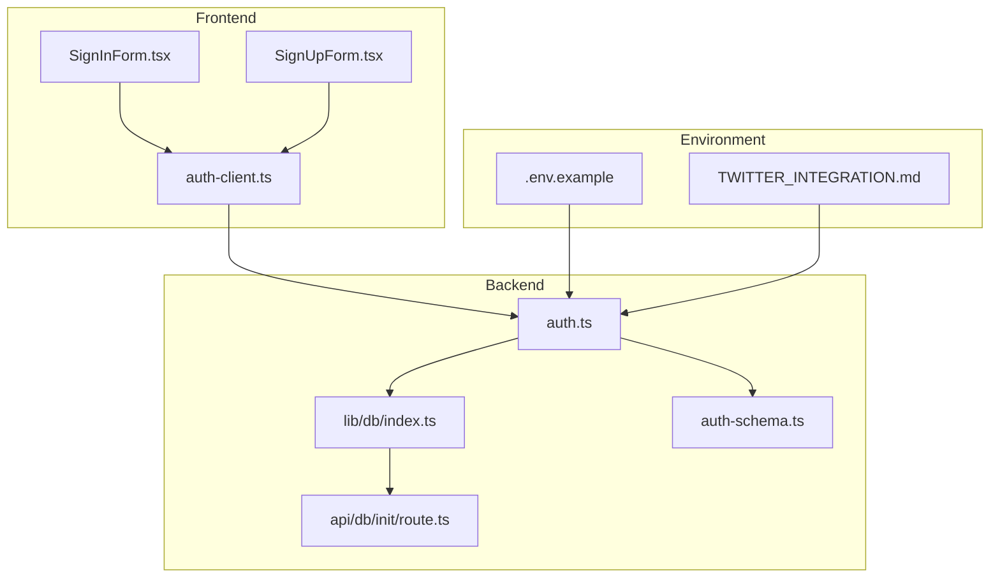
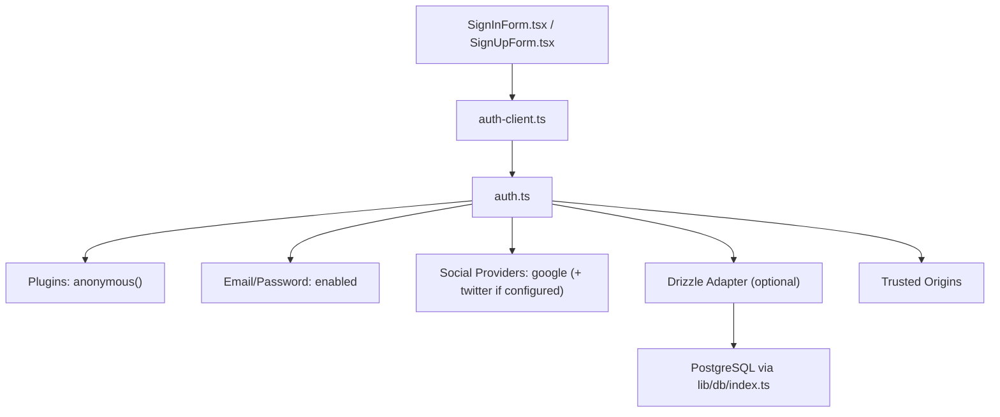
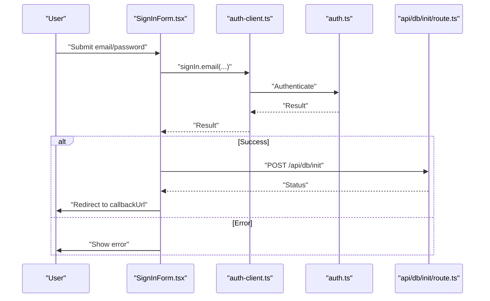
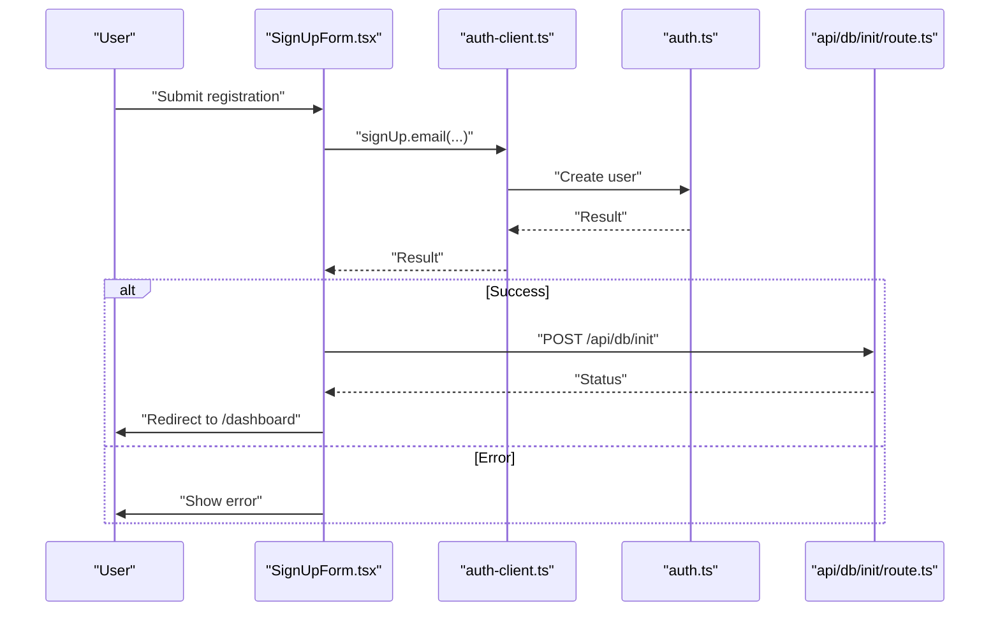
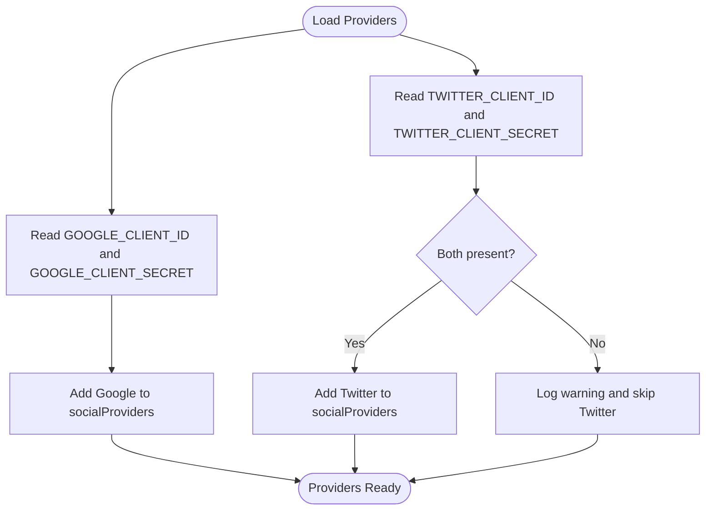
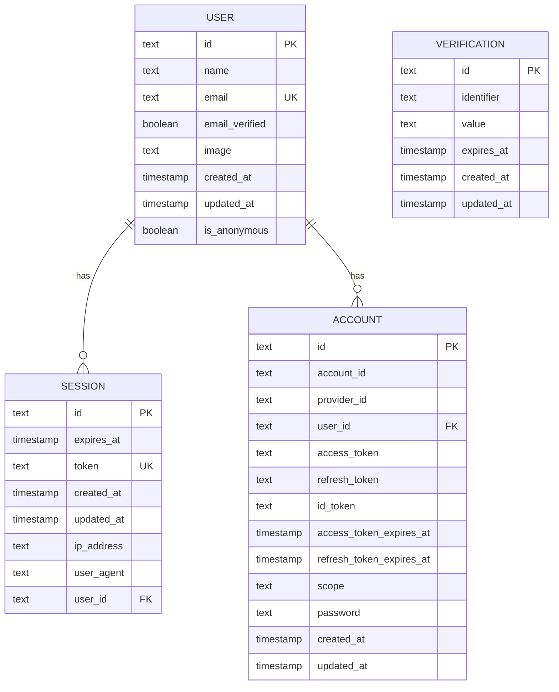
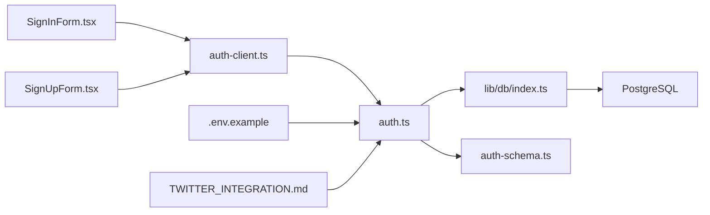

# Authentication Providers

<cite>
**Referenced Files in This Document**
- [src/lib/auth.ts](file://src/lib/auth.ts)
- [src/lib/auth-client.ts](file://src/lib/auth-client.ts)
- [src/app/(auth)/sign-in/SignInForm.tsx](file://src/app/(auth)/sign-in/SignInForm.tsx)
- [src/app/(auth)/sign-up/SignUpForm.tsx](file://src/app/(auth)/sign-up/SignUpForm.tsx)
- [src/app/api/db/init/route.ts](file://src/app/api/db/init/route.ts)
- [src/lib/db/index.ts](file://src/lib/db/index.ts)
- [.env.example](file://.env.example)
- [TWITTER_INTEGRATION.md](file://TWITTER_INTEGRATION.md)
- [auth-schema.ts](file://auth-schema.ts)
- [package.json](file://package.json)
- [src/app/layout.tsx](file://src/app/layout.tsx)
- [test-twitter-auth.ts](file://test-twitter-auth.ts)
</cite>

## Table of Contents
1. [Introduction](#introduction)
2. [Project Structure](#project-structure)
3. [Core Components](#core-components)
4. [Architecture Overview](#architecture-overview)
5. [Detailed Component Analysis](#detailed-component-analysis)
6. [Dependency Analysis](#dependency-analysis)
7. [Performance Considerations](#performance-considerations)
8. [Troubleshooting Guide](#troubleshooting-guide)
9. [Conclusion](#conclusion)
10. [Appendices](#appendices)

## Introduction
This document explains the authentication providers used by MatricMaster AI. It covers supported authentication methods (Google OAuth, Twitter OAuth, and email/password), provider configuration, environment variable setup, conditional provider loading, and the integration of the anonymous session plugin. It also documents social login patterns, callback handling, user registration flows, and security considerations.

## Project Structure
Authentication spans frontend forms, a client SDK wrapper, backend auth configuration, and database schema. The following diagram shows how these pieces fit together.

**Diagram sources**
- [src/app/(auth)/sign-in/SignInForm.tsx](file://src/app/(auth)/sign-in/SignInForm.tsx#L1-L353)
- [src/app/(auth)/sign-up/SignUpForm.tsx](file://src/app/(auth)/sign-up/SignUpForm.tsx#L1-L249)
- [src/lib/auth-client.ts](file://src/lib/auth-client.ts#L1-L10)
- [src/lib/auth.ts](file://src/lib/auth.ts#L1-L103)
- [src/app/api/db/init/route.ts](file://src/app/api/db/init/route.ts#L1-L100)
- [src/lib/db/index.ts](file://src/lib/db/index.ts#L1-L102)
- [auth-schema.ts](file://auth-schema.ts#L1-L95)
- [.env.example](file://.env.example#L1-L19)
- [TWITTER_INTEGRATION.md](file://TWITTER_INTEGRATION.md#L1-L123)

**Section sources**
- [src/lib/auth.ts](file://src/lib/auth.ts#L1-L103)
- [src/lib/auth-client.ts](file://src/lib/auth-client.ts#L1-L10)
- [src/app/(auth)/sign-in/SignInForm.tsx](file://src/app/(auth)/sign-in/SignInForm.tsx#L1-L353)
- [src/app/(auth)/sign-up/SignUpForm.tsx](file://src/app/(auth)/sign-up/SignUpForm.tsx#L1-L249)
- [src/app/api/db/init/route.ts](file://src/app/api/db/init/route.ts#L1-L100)
- [src/lib/db/index.ts](file://src/lib/db/index.ts#L1-L102)
- [.env.example](file://.env.example#L1-L19)
- [TWITTER_INTEGRATION.md](file://TWITTER_INTEGRATION.md#L1-L123)
- [auth-schema.ts](file://auth-schema.ts#L1-L95)

## Core Components
- Backend auth configuration: Defines providers, session settings, plugins, and database adapter.
- Frontend auth client: Wraps the Better Auth React client and exposes sign-in/sign-up/session helpers.
- Sign-in and sign-up forms: Provide UI for email/password and social sign-in, and trigger database initialization.
- Database manager and API: Initialize and expose database connectivity to the auth system.
- Environment variables: Provide secrets and provider credentials.
- Schema: Defines user, session, account, and verification tables used by Better Auth.

**Section sources**
- [src/lib/auth.ts](file://src/lib/auth.ts#L1-L103)
- [src/lib/auth-client.ts](file://src/lib/auth-client.ts#L1-L10)
- [src/app/(auth)/sign-in/SignInForm.tsx](file://src/app/(auth)/sign-in/SignInForm.tsx#L1-L353)
- [src/app/(auth)/sign-up/SignUpForm.tsx](file://src/app/(auth)/sign-up/SignUpForm.tsx#L1-L249)
- [src/app/api/db/init/route.ts](file://src/app/api/db/init/route.ts#L1-L100)
- [src/lib/db/index.ts](file://src/lib/db/index.ts#L1-L102)
- [.env.example](file://.env.example#L1-L19)
- [auth-schema.ts](file://auth-schema.ts#L1-L95)

## Architecture Overview
The authentication system uses Better Auth with:
- Email/password authentication enabled.
- Google OAuth configured via environment variables.
- Twitter OAuth conditionally enabled when credentials are present.
- Anonymous session plugin enabled for guest experiences.
- Optional persistence via Drizzle adapter when the database is available.

**Diagram sources**
- [src/app/(auth)/sign-in/SignInForm.tsx](file://src/app/(auth)/sign-in/SignInForm.tsx#L1-L353)
- [src/app/(auth)/sign-up/SignUpForm.tsx](file://src/app/(auth)/sign-up/SignUpForm.tsx#L1-L249)
- [src/lib/auth-client.ts](file://src/lib/auth-client.ts#L1-L10)
- [src/lib/auth.ts](file://src/lib/auth.ts#L1-L103)
- [src/lib/db/index.ts](file://src/lib/db/index.ts#L1-L102)

## Detailed Component Analysis

### Backend Auth Configuration (Better Auth)
- Provider configuration:
  - Google OAuth: Reads client ID and secret from environment variables.
  - Twitter OAuth: Conditionally included only if both client ID and secret are present.
- Email/password:
  - Enabled with verification disabled.
- Plugins:
  - Anonymous session plugin is registered.
- Session settings:
  - Expiration and update age configured.
- Trusted origins:
  - Controlled by NEXT_PUBLIC_APP_URL or fallback.
- Database adapter:
  - Drizzle adapter is attached when the database is connected; otherwise, sessions are not persisted.

Implementation highlights:
- Conditional provider loading based on environment variables.
- Startup warning when Twitter credentials are missing.
- Initialization guarded by database readiness.

**Section sources**
- [src/lib/auth.ts](file://src/lib/auth.ts#L23-L70)
- [src/lib/auth.ts](file://src/lib/auth.ts#L89-L103)

### Frontend Auth Client
- Initializes Better Auth React client with base URL and anonymous client plugin.
- Exposes convenience methods for sign-in, sign-up, session management, and sign-out.

Usage patterns:
- Forms call auth-client methods to trigger authentication flows.
- Anonymous sign-in is supported via the client plugin.

**Section sources**
- [src/lib/auth-client.ts](file://src/lib/auth-client.ts#L1-L10)

### Sign-In Form
- Validates callback URL to prevent open redirect vulnerabilities.
- Handles email/password sign-in via auth client.
- Supports social sign-in with Google and Twitter.
- Supports anonymous sign-in.
- On successful sign-in, triggers database initialization endpoint.

Flow overview:

**Diagram sources**
- [src/app/(auth)/sign-in/SignInForm.tsx](file://src/app/(auth)/sign-in/SignInForm.tsx#L97-L117)
- [src/lib/auth-client.ts](file://src/lib/auth-client.ts#L1-L10)
- [src/lib/auth.ts](file://src/lib/auth.ts#L1-L103)
- [src/app/api/db/init/route.ts](file://src/app/api/db/init/route.ts#L30-L79)

**Section sources**
- [src/app/(auth)/sign-in/SignInForm.tsx](file://src/app/(auth)/sign-in/SignInForm.tsx#L23-L142)

### Sign-Up Form
- Provides email/password registration via auth client.
- Supports social sign-up with Google and Twitter.
- On successful registration, triggers database initialization endpoint.

Flow overview:

**Diagram sources**
- [src/app/(auth)/sign-up/SignUpForm.tsx](file://src/app/(auth)/sign-up/SignUpForm.tsx#L55-L71)
- [src/lib/auth-client.ts](file://src/lib/auth-client.ts#L1-L10)
- [src/lib/auth.ts](file://src/lib/auth.ts#L1-L103)
- [src/app/api/db/init/route.ts](file://src/app/api/db/init/route.ts#L30-L79)

**Section sources**
- [src/app/(auth)/sign-up/SignUpForm.tsx](file://src/app/(auth)/sign-up/SignUpForm.tsx#L23-L78)

### Database Initialization and Connection
- The database initialization endpoint checks for localhost or internal API key authorization.
- Attempts to initialize the database and then initialize Better Auth.
- Returns success/failure with connection and auth initialization status.

Authorization logic:
- Allows localhost requests.
- Accepts internal API key header for programmatic access.

**Section sources**
- [src/app/api/db/init/route.ts](file://src/app/api/db/init/route.ts#L5-L28)
- [src/app/api/db/init/route.ts](file://src/app/api/db/init/route.ts#L30-L99)
- [src/lib/db/index.ts](file://src/lib/db/index.ts#L24-L39)

### Environment Variables and Provider Setup
- Required environment variables:
  - BETTER_AUTH_SECRET, BETTER_AUTH_URL, DATABASE_URL.
  - GOOGLE_CLIENT_ID, GOOGLE_CLIENT_SECRET.
  - TWITTER_CLIENT_ID, TWITTER_CLIENT_SECRET (optional).
- Example environment file demonstrates expected keys.

Notes:
- Facebook credentials are present in the example but not used in the current configuration.
- Twitter integration requires enabling email permission and setting callback URLs.

**Section sources**
- [.env.example](file://.env.example#L1-L19)
- [TWITTER_INTEGRATION.md](file://TWITTER_INTEGRATION.md#L15-L35)

### Conditional Provider Loading (Google, Twitter)
- Google OAuth is always configured using environment variables.
- Twitter OAuth is conditionally included only if both client ID and secret are present.
- Missing Twitter credentials produce a startup warning and hide the provider from UI.

**Diagram sources**
- [src/lib/auth.ts](file://src/lib/auth.ts#L33-L46)
- [src/lib/auth.ts](file://src/lib/auth.ts#L23-L31)

**Section sources**
- [src/lib/auth.ts](file://src/lib/auth.ts#L23-L46)

### Anonymous Session Plugin Integration
- Anonymous plugin is registered in both backend and frontend clients.
- Users can sign in anonymously without providing credentials.
- Anonymous sessions are supported even when the database is not connected.

**Section sources**
- [src/lib/auth.ts](file://src/lib/auth.ts#L63-L63)
- [src/lib/auth-client.ts](file://src/lib/auth-client.ts#L6-L6)
- [src/app/(auth)/sign-in/SignInForm.tsx](file://src/app/(auth)/sign-in/SignInForm.tsx#L126-L142)

### Database Schema for Authentication
- user: primary user record with unique email, timestamps, and anonymous flag.
- session: session tokens and references to users.
- account: provider accounts (social and email/password), tokens, scopes, and timestamps.
- verification: email verification records.

**Diagram sources**
- [auth-schema.ts](file://auth-schema.ts#L4-L95)

**Section sources**
- [auth-schema.ts](file://auth-schema.ts#L1-L95)

## Dependency Analysis
- Frontend depends on auth-client for authentication actions.
- auth-client depends on Better Auth React and anonymous client plugin.
- Backend depends on Better Auth core, Drizzle adapter, and database manager.
- Database manager depends on PostgreSQL manager and environment configuration.
- Environment variables feed provider credentials and base URLs.

**Diagram sources**
- [src/app/(auth)/sign-in/SignInForm.tsx](file://src/app/(auth)/sign-in/SignInForm.tsx#L1-L353)
- [src/app/(auth)/sign-up/SignUpForm.tsx](file://src/app/(auth)/sign-up/SignUpForm.tsx#L1-L249)
- [src/lib/auth-client.ts](file://src/lib/auth-client.ts#L1-L10)
- [src/lib/auth.ts](file://src/lib/auth.ts#L1-L103)
- [src/lib/db/index.ts](file://src/lib/db/index.ts#L1-L102)
- [auth-schema.ts](file://auth-schema.ts#L1-L95)
- [.env.example](file://.env.example#L1-L19)
- [TWITTER_INTEGRATION.md](file://TWITTER_INTEGRATION.md#L1-L123)

**Section sources**
- [package.json](file://package.json#L27-L64)
- [src/lib/auth.ts](file://src/lib/auth.ts#L1-L103)
- [src/lib/auth-client.ts](file://src/lib/auth-client.ts#L1-L10)
- [src/lib/db/index.ts](file://src/lib/db/index.ts#L1-L102)
- [auth-schema.ts](file://auth-schema.ts#L1-L95)
- [.env.example](file://.env.example#L1-L19)
- [TWITTER_INTEGRATION.md](file://TWITTER_INTEGRATION.md#L1-L123)

## Performance Considerations
- Session lifetime and updates are configured to balance security and UX.
- Conditional provider loading avoids unnecessary initialization when credentials are missing.
- Database adapter is only attached when the database is ready, preventing auth failures during cold starts.

[No sources needed since this section provides general guidance]

## Troubleshooting Guide

### General Provider Configuration Issues
- Missing BETTER_AUTH_SECRET or BASE URL:
  - Ensure environment variables are set and loaded.
  - Verify NEXT_PUBLIC_APP_URL matches trusted origins.
- Database not connected:
  - Confirm DATABASE_URL and that the database initialization endpoint succeeds.
  - Check authorization for localhost or internal API key.

**Section sources**
- [.env.example](file://.env.example#L1-L19)
- [src/app/api/db/init/route.ts](file://src/app/api/db/init/route.ts#L5-L28)
- [src/lib/auth.ts](file://src/lib/auth.ts#L48-L69)

### Google OAuth Problems
- Incorrect client credentials:
  - Verify GOOGLE_CLIENT_ID and GOOGLE_CLIENT_SECRET.
- Callback URL mismatch:
  - Ensure the callback URL matches the configured origin.

**Section sources**
- [src/lib/auth.ts](file://src/lib/auth.ts#L33-L38)
- [src/app/layout.tsx](file://src/app/layout.tsx#L8-L8)

### Twitter OAuth Problems
- Missing credentials:
  - Ensure TWITTER_CLIENT_ID and TWITTER_CLIENT_SECRET are set.
  - Confirm Twitter app has email permission enabled and callback URLs configured.
- Conditional provider not appearing:
  - Missing credentials cause Twitter to be excluded from providers.

**Section sources**
- [src/lib/auth.ts](file://src/lib/auth.ts#L23-L46)
- [TWITTER_INTEGRATION.md](file://TWITTER_INTEGRATION.md#L95-L105)

### Email/Password Registration/Login Issues
- Validation errors:
  - Ensure email format and minimum password length are met.
- Verification disabled:
  - Email verification is intentionally disabled; no verification emails are sent.

**Section sources**
- [src/app/(auth)/sign-in/SignInForm.tsx](file://src/app/(auth)/sign-in/SignInForm.tsx#L16-L19)
- [src/app/(auth)/sign-up/SignUpForm.tsx](file://src/app/(auth)/sign-up/SignUpForm.tsx#L15-L19)
- [src/lib/auth.ts](file://src/lib/auth.ts#L58-L61)

### Anonymous Sign-In Problems
- Anonymous sessions require the anonymous plugin to be enabled in both backend and frontend.
- If database is unavailable, sessions are not persisted.

**Section sources**
- [src/lib/auth.ts](file://src/lib/auth.ts#L63-L63)
- [src/lib/auth-client.ts](file://src/lib/auth-client.ts#L6-L6)
- [src/lib/auth.ts](file://src/lib/auth.ts#L13-L21)

## Conclusion
MatricMaster AI’s authentication system leverages Better Auth to support email/password, Google OAuth, and optionally Twitter OAuth. Providers are configured via environment variables, with Twitter enabled only when credentials are present. The anonymous session plugin allows guest experiences, while the frontend forms integrate database initialization and secure callback handling. The backend guards against misconfiguration and persists sessions when the database is available.

[No sources needed since this section summarizes without analyzing specific files]

## Appendices

### Environment Variable Reference
- BETTER_AUTH_SECRET: Secret for Better Auth.
- BETTER_AUTH_URL: Base URL for Better Auth.
- DATABASE_URL: PostgreSQL connection string.
- GOOGLE_CLIENT_ID, GOOGLE_CLIENT_SECRET: Google OAuth credentials.
- TWITTER_CLIENT_ID, TWITTER_CLIENT_SECRET: Twitter OAuth credentials (optional).
- NEXT_PUBLIC_APP_URL: Public app URL used for trusted origins and client base URL.

**Section sources**
- [.env.example](file://.env.example#L1-L19)
- [src/lib/auth.ts](file://src/lib/auth.ts#L48-L50)
- [src/lib/auth-client.ts](file://src/lib/auth-client.ts#L4-L6)

### Implementation Examples by Provider Type

- Email/Password Sign-In
  - UI: [SignInForm.tsx](file://src/app/(auth)/sign-in/SignInForm.tsx#L97-L117)
  - Client: [auth-client.ts](file://src/lib/auth-client.ts#L1-L10)
  - Backend: [auth.ts](file://src/lib/auth.ts#L58-L61)

- Email/Password Registration
  - UI: [SignUpForm.tsx](file://src/app/(auth)/sign-up/SignUpForm.tsx#L55-L71)
  - Client: [auth-client.ts](file://src/lib/auth-client.ts#L1-L10)
  - Backend: [auth.ts](file://src/lib/auth.ts#L58-L61)

- Google OAuth
  - Provider config: [auth.ts](file://src/lib/auth.ts#L33-L38)
  - UI buttons: [SignInForm.tsx](file://src/app/(auth)/sign-in/SignInForm.tsx#L279-L322), [SignUpForm.tsx](file://src/app/(auth)/sign-up/SignUpForm.tsx#L190-L233)
  - Client: [auth-client.ts](file://src/lib/auth-client.ts#L1-L10)

- Twitter OAuth
  - Conditional inclusion: [auth.ts](file://src/lib/auth.ts#L40-L46)
  - UI button: [SignInForm.tsx](file://src/app/(auth)/sign-in/SignInForm.tsx#L307-L322), [SignUpForm.tsx](file://src/app/(auth)/sign-up/SignUpForm.tsx#L218-L233)
  - Integration guide: [TWITTER_INTEGRATION.md](file://TWITTER_INTEGRATION.md#L1-L123)

- Anonymous Session
  - Backend plugin: [auth.ts](file://src/lib/auth.ts#L63-L63)
  - Frontend plugin: [auth-client.ts](file://src/lib/auth-client.ts#L6-L6)
  - UI: [SignInForm.tsx](file://src/app/(auth)/sign-in/SignInForm.tsx#L126-L142)

### Security Considerations
- Trusted Origins: Ensure NEXT_PUBLIC_APP_URL matches the deployed domain to avoid CSRF and open redirect risks.
- Callback URL Management: Keep callback URLs synchronized between the app and provider dashboards.
- Environment Protection: Do not commit .env.local; keep secrets out of version control.
- Email Permission: For Twitter, enable email retrieval to ensure user identification.
- Database Authorization: The initialization endpoint restricts access to localhost and internal API key.

**Section sources**
- [src/lib/auth.ts](file://src/lib/auth.ts#L48-L69)
- [src/app/api/db/init/route.ts](file://src/app/api/db/init/route.ts#L5-L28)
- [TWITTER_INTEGRATION.md](file://TWITTER_INTEGRATION.md#L95-L105)
- [.env.example](file://.env.example#L1-L19)