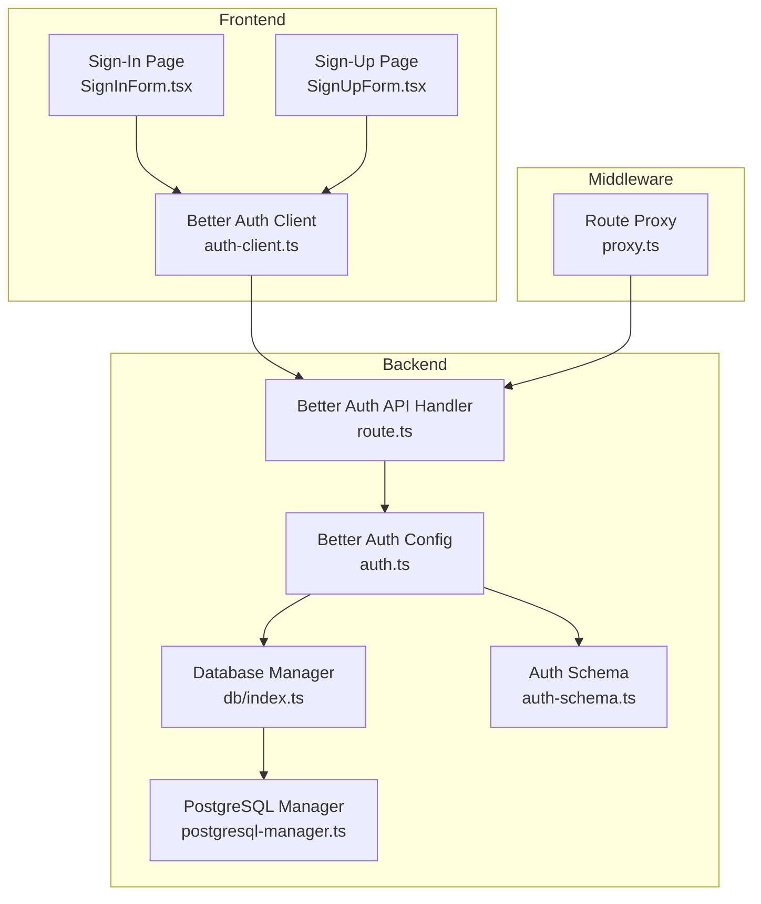
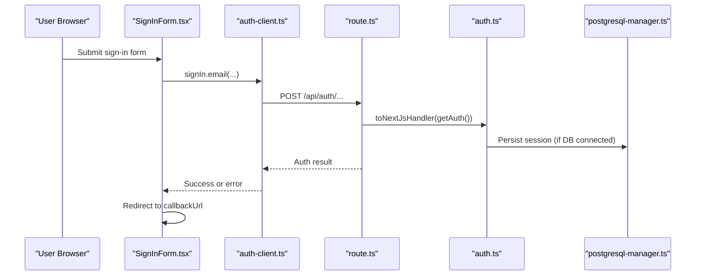
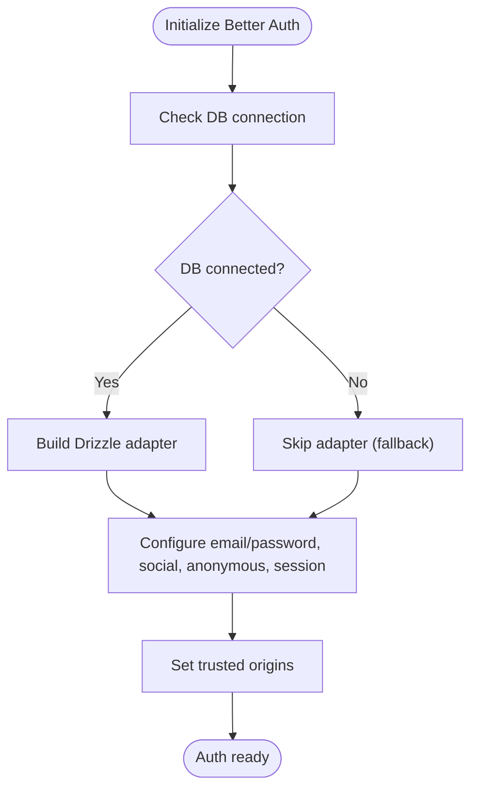
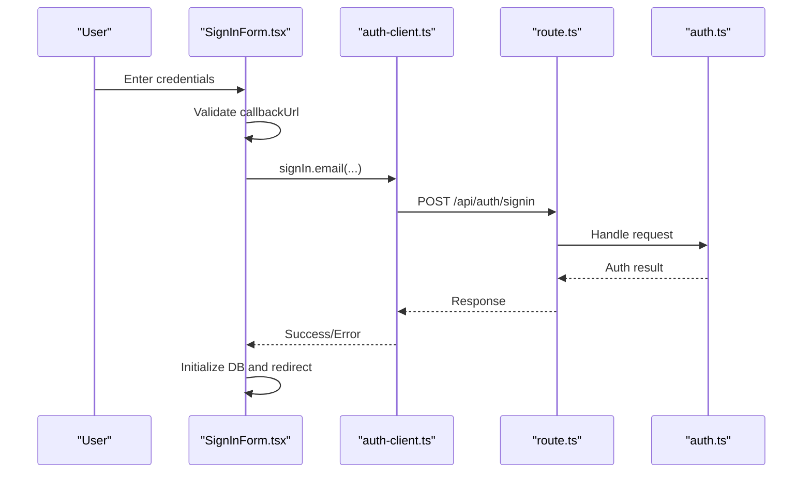
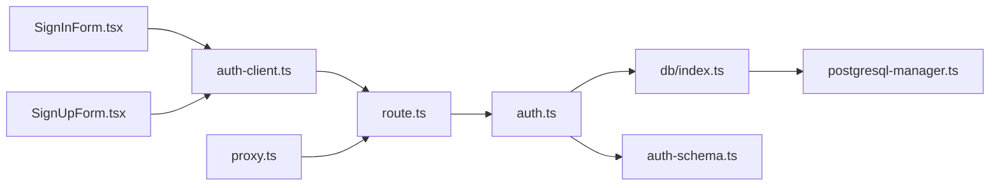

# Authentication System

<cite>
**Referenced Files in This Document**
- [auth.ts](file://src/lib/auth.ts)
- [auth-client.ts](file://src/lib/auth-client.ts)
- [route.ts](file://src/app/api/auth/[...better-auth]/route.ts)
- [auth-schema.ts](file://auth-schema.ts)
- [page.tsx](file://src/app/(auth)/sign-in/page.tsx)
- [SignInForm.tsx](file://src/app/(auth)/sign-in/SignInForm.tsx)
- [page.tsx](file://src/app/(auth)/sign-up/page.tsx)
- [SignUpForm.tsx](file://src/app/(auth)/sign-up/SignUpForm.tsx)
- [index.ts](file://src/lib/db/index.ts)
- [postgresql-manager.ts](file://src/lib/db/postgresql-manager.ts)
- [route.ts](file://src/app/api/db/init/route.ts)
- [proxy.ts](file://src/proxy.ts)
- [package.json](file://package.json)
</cite>

## Table of Contents
1. [Introduction](#introduction)
2. [Project Structure](#project-structure)
3. [Core Components](#core-components)
4. [Architecture Overview](#architecture-overview)
5. [Detailed Component Analysis](#detailed-component-analysis)
6. [Dependency Analysis](#dependency-analysis)
7. [Performance Considerations](#performance-considerations)
8. [Security Considerations](#security-considerations)
9. [Troubleshooting Guide](#troubleshooting-guide)
10. [Conclusion](#conclusion)

## Introduction
This document describes the authentication system for MatricMaster AI, built with Better Auth. It covers configuration, session management, supported authentication methods (email/password, Google OAuth, optional Twitter OAuth, and anonymous sessions), token lifecycle, middleware protection, and practical integration patterns. It also documents the authentication routes, client SDK usage, and recommended security practices.

## Project Structure
The authentication system spans backend configuration, frontend client SDK, database schema, and middleware protection:

- Backend configuration and adapter: Better Auth configuration and Drizzle adapter
- Frontend client SDK: React client for Better Auth
- API handlers: Next.js route handler for Better Auth endpoints
- Database: PostgreSQL connection and schema for Better Auth tables
- Middleware: Route protection using cookies and redirect logic
- UI pages: Sign-in and sign-up forms with validation and callbacks

**Diagram sources**
- [auth.ts](file://src/lib/auth.ts#L1-L103)
- [auth-client.ts](file://src/lib/auth-client.ts#L1-L10)
- [route.ts](file://src/app/api/auth/[...better-auth]/route.ts#L1-L5)
- [auth-schema.ts](file://auth-schema.ts#L1-L95)
- [index.ts](file://src/lib/db/index.ts#L1-L102)
- [postgresql-manager.ts](file://src/lib/db/postgresql-manager.ts#L1-L162)
- [proxy.ts](file://src/proxy.ts#L1-L39)

**Section sources**
- [auth.ts](file://src/lib/auth.ts#L1-L103)
- [auth-client.ts](file://src/lib/auth-client.ts#L1-L10)
- [route.ts](file://src/app/api/auth/[...better-auth]/route.ts#L1-L5)
- [auth-schema.ts](file://auth-schema.ts#L1-L95)
- [index.ts](file://src/lib/db/index.ts#L1-L102)
- [postgresql-manager.ts](file://src/lib/db/postgresql-manager.ts#L1-L162)
- [proxy.ts](file://src/proxy.ts#L1-L39)

## Core Components
- Better Auth configuration: Defines base URL, secret, database adapter, email/password, social providers, anonymous plugin, session lifetime, and trusted origins.
- Better Auth client: React client configured with baseURL and anonymous plugin.
- API handler: Bridges Better Auth to Next.js routes.
- Database manager: Centralizes PostgreSQL connection and Drizzle adapter usage.
- Auth schema: Drizzle schema for Better Auth core tables and relations.
- Middleware proxy: Protects routes by checking session cookies and redirecting unauthenticated users.
- UI forms: Sign-in and sign-up pages with validation and callback URL handling.

**Section sources**
- [auth.ts](file://src/lib/auth.ts#L48-L69)
- [auth-client.ts](file://src/lib/auth-client.ts#L4-L7)
- [route.ts](file://src/app/api/auth/[...better-auth]/route.ts#L1-L5)
- [auth-schema.ts](file://auth-schema.ts#L4-L95)
- [index.ts](file://src/lib/db/index.ts#L9-L87)
- [postgresql-manager.ts](file://src/lib/db/postgresql-manager.ts#L18-L141)
- [proxy.ts](file://src/proxy.ts#L4-L39)

## Architecture Overview
The system integrates Better Auth with a PostgreSQL-backed Drizzle adapter. The client SDK handles sign-in/sign-up flows and communicates with the API handler. Middleware protects routes by validating session cookies. Anonymous sessions are supported via a plugin.

**Diagram sources**
- [SignInForm.tsx](file://src/app/(auth)/sign-in/SignInForm.tsx#L97-L117)
- [auth-client.ts](file://src/lib/auth-client.ts#L9-L10)
- [route.ts](file://src/app/api/auth/[...better-auth]/route.ts#L1-L5)
- [auth.ts](file://src/lib/auth.ts#L72-L87)
- [postgresql-manager.ts](file://src/lib/db/postgresql-manager.ts#L42-L90)

## Detailed Component Analysis

### Better Auth Configuration
- Base URL and secret are loaded from environment variables.
- Database adapter is conditionally enabled when the database is connected.
- Email/password authentication is enabled; email verification is disabled.
- Social providers include Google and optionally Twitter (if credentials are present).
- Anonymous sessions are enabled via a plugin.
- Session configuration sets expiry and update age.
- Trusted origins include the public app URL.

**Diagram sources**
- [auth.ts](file://src/lib/auth.ts#L9-L70)

**Section sources**
- [auth.ts](file://src/lib/auth.ts#L48-L69)

### Better Auth Client
- React client is created with baseURL and anonymous plugin.
- Exposes signIn, signUp, useSession, and signOut helpers.

**Section sources**
- [auth-client.ts](file://src/lib/auth-client.ts#L4-L10)

### API Handler
- Converts Better Auth to a Next.js-compatible handler.
- Delegates to the Better Auth instance obtained from the configuration module.

**Section sources**
- [route.ts](file://src/app/api/auth/[...better-auth]/route.ts#L1-L5)

### Database Integration
- PostgreSQL connection managed by a singleton with retry logic.
- Drizzle adapter is attached to Better Auth when the DB is available.
- Graceful shutdown and cleanup are handled.

**Section sources**
- [index.ts](file://src/lib/db/index.ts#L9-L87)
- [postgresql-manager.ts](file://src/lib/db/postgresql-manager.ts#L18-L141)
- [auth.ts](file://src/lib/auth.ts#L10-L21)

### Authentication Schema
- Core tables: user, session, account, verification.
- Relations define foreign keys and indexes for efficient lookups.
- The schema supports Better Auth’s email/password, OAuth, and session storage.

**Section sources**
- [auth-schema.ts](file://auth-schema.ts#L4-L95)

### Middleware Protection
- Public routes include home, sign-in, sign-up, forgot-password, Better Auth API, and DB init endpoint.
- Protected routes are redirected to sign-in with the original path as callbackUrl.
- Session detection checks Better Auth cookies and anonymous cookie.

**Section sources**
- [proxy.ts](file://src/proxy.ts#L4-L39)

### Sign-In Flow
- Validates callbackUrl to prevent open redirects.
- Supports email/password, Google, Twitter (if configured), and anonymous sign-in.
- On success, initializes database and redirects to callbackUrl.

**Diagram sources**
- [SignInForm.tsx](file://src/app/(auth)/sign-in/SignInForm.tsx#L26-L117)
- [auth-client.ts](file://src/lib/auth-client.ts#L9-L10)
- [route.ts](file://src/app/api/auth/[...better-auth]/route.ts#L1-L5)
- [auth.ts](file://src/lib/auth.ts#L72-L87)

**Section sources**
- [SignInForm.tsx](file://src/app/(auth)/sign-in/SignInForm.tsx#L26-L117)

### Sign-Up Flow
- Zod validation for name, email, and password.
- Uses email/password sign-up via the client.
- On success, initializes database and navigates to dashboard.

**Section sources**
- [SignUpForm.tsx](file://src/app/(auth)/sign-up/SignUpForm.tsx#L15-L71)

### Anonymous Sessions
- Enabled via the anonymous plugin.
- Users can continue without providing credentials; session cookies are set accordingly.

**Section sources**
- [auth.ts](file://src/lib/auth.ts#L63-L63)
- [proxy.ts](file://src/proxy.ts#L18-L22)

## Dependency Analysis
- Better Auth depends on the database adapter when available.
- The client SDK depends on the API handler endpoints.
- Middleware depends on cookies set by Better Auth.
- UI forms depend on the client SDK and callbackUrl handling.

**Diagram sources**
- [auth-client.ts](file://src/lib/auth-client.ts#L1-L10)
- [route.ts](file://src/app/api/auth/[...better-auth]/route.ts#L1-L5)
- [auth.ts](file://src/lib/auth.ts#L1-L103)
- [index.ts](file://src/lib/db/index.ts#L1-L102)
- [postgresql-manager.ts](file://src/lib/db/postgresql-manager.ts#L1-L162)
- [auth-schema.ts](file://auth-schema.ts#L1-L95)
- [proxy.ts](file://src/proxy.ts#L1-L39)
- [SignInForm.tsx](file://src/app/(auth)/sign-in/SignInForm.tsx#L1-L353)
- [SignUpForm.tsx](file://src/app/(auth)/sign-up/SignUpForm.tsx#L1-L249)

**Section sources**
- [package.json](file://package.json#L46-L46)

## Performance Considerations
- Session lifetime and update frequency are tuned for weekly expiry with daily updates.
- Database adapter is only enabled when the connection is established to avoid degraded performance in fallback mode.
- Middleware performs lightweight cookie checks and minimal computation.

[No sources needed since this section provides general guidance]

## Security Considerations
- Trusted origins are configured to the public app URL to mitigate CSRF and origin-related attacks.
- CallbackUrl validation prevents open redirect vulnerabilities by allowing only same-origin or relative paths.
- Database initialization endpoint requires authorization via localhost or internal API key header.
- Cookie-based session detection is used by middleware to enforce protection.

**Section sources**
- [auth.ts](file://src/lib/auth.ts#L68-L68)
- [SignInForm.tsx](file://src/app/(auth)/sign-in/SignInForm.tsx#L28-L48)
- [route.ts](file://src/app/api/db/init/route.ts#L5-L28)

## Troubleshooting Guide
Common issues and resolutions:
- Database not connected: When the database is unavailable, Better Auth runs in fallback mode without persistent sessions. Use the database initialization endpoint to establish a connection and reinitialize auth.
- Missing environment variables: Ensure Better Auth secret and trusted origins are set. For social providers, configure client IDs/secrets and verify callback URLs.
- Twitter OAuth not available: If Twitter credentials are missing, the provider is omitted. Configure TWITTER_CLIENT_ID and TWITTER_CLIENT_SECRET and ensure the callback URL matches the Better Auth callback route.
- Middleware redirect loops: Verify public routes and ensure callbackUrl is properly encoded and validated.

**Section sources**
- [auth.ts](file://src/lib/auth.ts#L23-L31)
- [route.ts](file://src/app/api/db/init/route.ts#L30-L41)
- [proxy.ts](file://src/proxy.ts#L4-L39)

## Conclusion
MatricMaster AI’s authentication system leverages Better Auth with a PostgreSQL-backed adapter, offering robust support for email/password, Google OAuth, optional Twitter OAuth, and anonymous sessions. The setup includes secure middleware protection, validated callback URLs, and modular configuration for scalability and maintainability.