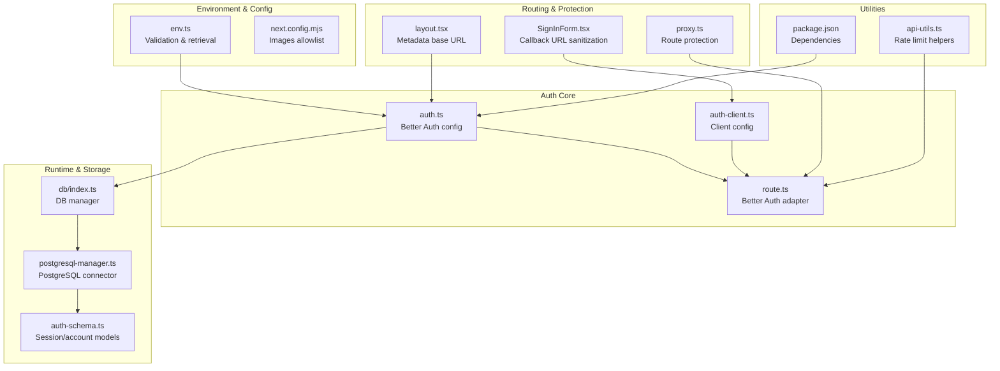
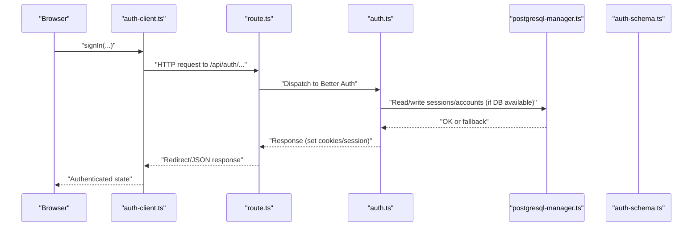
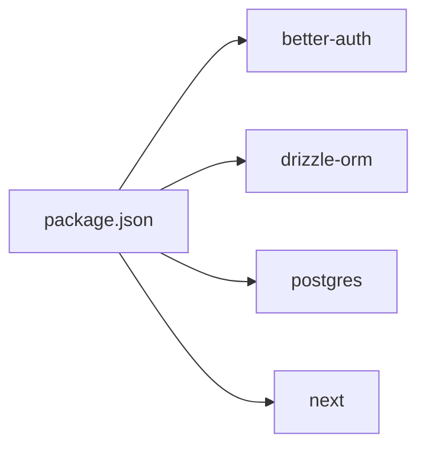

# Security Considerations

<cite>
**Referenced Files in This Document**
- [env.ts](file://src/lib/env.ts)
- [auth.ts](file://src/lib/auth.ts)
- [route.ts](file://src/app/api/auth/[...better-auth]/route.ts)
- [auth-client.ts](file://src/lib/auth-client.ts)
- [layout.tsx](file://src/app/layout.tsx)
- [proxy.ts](file://src/proxy.ts)
- [api-utils.ts](file://src/lib/api-utils.ts)
- [postgresql-manager.ts](file://src/lib/db/postgresql-manager.ts)
- [db/index.ts](file://src/lib/db/index.ts)
- [auth-schema.ts](file://auth-schema.ts)
- [next.config.mjs](file://next.config.mjs)
- [package.json](file://package.json)
- [TWITTER_INTEGRATION.md](file://TWITTER_INTEGRATION.md)
- [SignInForm.tsx](file://src/app/(auth)/sign-in/SignInForm.tsx)
</cite>

## Table of Contents
1. [Introduction](#introduction)
2. [Project Structure](#project-structure)
3. [Core Components](#core-components)
4. [Architecture Overview](#architecture-overview)
5. [Detailed Component Analysis](#detailed-component-analysis)
6. [Dependency Analysis](#dependency-analysis)
7. [Performance Considerations](#performance-considerations)
8. [Troubleshooting Guide](#troubleshooting-guide)
9. [Conclusion](#conclusion)
10. [Appendices](#appendices)

## Introduction
This document provides comprehensive security considerations for the MatricMaster AI authentication system. It focuses on secret key management, trusted origin configuration, secure session handling, environment variable validation, credential security practices, sensitive data protection, optional provider safety (Twitter), authentication middleware patterns, route protection strategies, access control mechanisms, production hardening (HTTPS enforcement, secure cookies, rate limiting), and operational security (monitoring, anomaly detection, incident response).

## Project Structure
The authentication system is built on Next.js with Better Auth as the core library. Key security-relevant areas include:
- Environment validation and retrieval
- Better Auth configuration (secret, providers, trusted origins, session policy)
- Next.js API route adapter for Better Auth
- Client-side auth client configuration
- Middleware-like route protection via a Next.js proxy
- Database connectivity and session persistence
- Optional provider integration (Twitter) with safe defaults
- Rate limiting utilities for API protection

**Diagram sources**
- [env.ts](file://src/lib/env.ts#L1-L62)
- [auth.ts](file://src/lib/auth.ts#L1-L103)
- [route.ts](file://src/app/api/auth/[...better-auth]/route.ts#L1-L5)
- [auth-client.ts](file://src/lib/auth-client.ts#L1-L10)
- [layout.tsx](file://src/app/layout.tsx#L1-L108)
- [proxy.ts](file://src/proxy.ts#L1-L39)
- [api-utils.ts](file://src/lib/api-utils.ts#L1-L92)
- [postgresql-manager.ts](file://src/lib/db/postgresql-manager.ts#L1-L162)
- [db/index.ts](file://src/lib/db/index.ts#L1-L102)
- [auth-schema.ts](file://auth-schema.ts#L1-L95)
- [next.config.mjs](file://next.config.mjs#L1-L33)
- [package.json](file://package.json#L1-L84)

**Section sources**
- [env.ts](file://src/lib/env.ts#L1-L62)
- [auth.ts](file://src/lib/auth.ts#L1-L103)
- [route.ts](file://src/app/api/auth/[...better-auth]/route.ts#L1-L5)
- [auth-client.ts](file://src/lib/auth-client.ts#L1-L10)
- [layout.tsx](file://src/app/layout.tsx#L1-L108)
- [proxy.ts](file://src/proxy.ts#L1-L39)
- [api-utils.ts](file://src/lib/api-utils.ts#L1-L92)
- [postgresql-manager.ts](file://src/lib/db/postgresql-manager.ts#L1-L162)
- [db/index.ts](file://src/lib/db/index.ts#L1-L102)
- [auth-schema.ts](file://auth-schema.ts#L1-L95)
- [next.config.mjs](file://next.config.mjs#L1-L33)
- [package.json](file://package.json#L1-L84)

## Core Components
- Environment validation and retrieval:
  - Zod-based schema enforces URL formats, minimum secret length, and optional/required flags per environment.
  - Production strictness: invalid env triggers failure; development falls back to defaults with warnings.
  - Helper functions provide typed accessors for required and optional values.

- Better Auth configuration:
  - Secret key sourced from environment; session expiration and update age configured.
  - Trusted origins derived from application URL; prevents CSRF and redirect misuse.
  - Social providers configured conditionally (Google always; Twitter only if credentials present).
  - Database adapter enabled when DB is available; otherwise operates in a non-persistent mode.

- Next.js API adapter:
  - Routes Better Auth handlers into Next.js runtime.

- Client-side auth client:
  - Initializes with base URL and anonymous plugin.

- Route protection:
  - Middleware-like logic checks for session cookies and redirects unauthenticated users to sign-in with callback preservation.

- Rate limiting:
  - In-memory sliding window rate limiter with configurable window and max requests.

- Database connectivity:
  - PostgreSQL manager supports SSL for specific providers, timeouts, and graceful shutdown.

**Section sources**
- [env.ts](file://src/lib/env.ts#L1-L62)
- [auth.ts](file://src/lib/auth.ts#L1-L103)
- [route.ts](file://src/app/api/auth/[...better-auth]/route.ts#L1-L5)
- [auth-client.ts](file://src/lib/auth-client.ts#L1-L10)
- [proxy.ts](file://src/proxy.ts#L1-L39)
- [api-utils.ts](file://src/lib/api-utils.ts#L1-L92)
- [postgresql-manager.ts](file://src/lib/db/postgresql-manager.ts#L1-L162)
- [db/index.ts](file://src/lib/db/index.ts#L1-L102)

## Architecture Overview
The authentication flow integrates client, server, and database layers with layered security controls.

**Diagram sources**
- [auth-client.ts](file://src/lib/auth-client.ts#L1-L10)
- [route.ts](file://src/app/api/auth/[...better-auth]/route.ts#L1-L5)
- [auth.ts](file://src/lib/auth.ts#L1-L103)
- [postgresql-manager.ts](file://src/lib/db/postgresql-manager.ts#L1-L162)
- [auth-schema.ts](file://auth-schema.ts#L1-L95)

## Detailed Component Analysis

### Environment Variable Validation and Secret Management
- Validation ensures:
  - URLs are valid and properly formatted.
  - Secret keys meet minimum length requirements.
  - Optional providers are tolerated; missing values do not break startup.
- Production behavior enforces strict validation and fails fast on invalid configuration.
- Development mode logs warnings and applies defaults for convenience.

Security implications:
- Prevents misconfiguration leading to insecure defaults.
- Enforces minimum entropy for secrets.
- Allows optional providers without compromising core auth.

Best practices:
- Store secrets in environment variables only.
- Rotate BETTER_AUTH_SECRET periodically.
- Use distinct secrets per environment.

**Section sources**
- [env.ts](file://src/lib/env.ts#L1-L62)

### Trusted Origin Configuration and CSRF Mitigation
- Trusted origins are set from the application URL, ensuring callbacks and redirects originate from approved domains.
- This reduces CSRF risks by constraining where tokens and cookies are accepted.

Operational note:
- Ensure NEXT_PUBLIC_APP_URL matches deployed domain(s).

**Section sources**
- [auth.ts](file://src/lib/auth.ts#L68-L68)
- [layout.tsx](file://src/app/layout.tsx#L8-L8)

### Secure Session Handling
- Session lifetime and renewal are configured with fixed durations.
- Sessions persist to the database when available; otherwise, Better Auth operates without persistent sessions.

Security implications:
- Controlled session lifetimes reduce exposure windows.
- Persistent sessions enable server-side invalidation and audit trails.

Recommendations:
- Use HTTPS in production to protect cookies.
- Consider SameSite and Secure flags on cookies (handled by Better Auth).
- Monitor session counts and implement logout everywhere.

**Section sources**
- [auth.ts](file://src/lib/auth.ts#L64-L67)
- [auth-schema.ts](file://auth-schema.ts#L18-L35)

### Credential Security Practices and Optional Providers (Twitter)
- Twitter provider is conditionally included only when both client ID and secret are present.
- Missing credentials are detected early with a warning; sign-in via Twitter remains disabled.

Security implications:
- Prevents accidental exposure of empty provider configurations.
- Ensures OAuth flows are only active when credentials are valid.

Operational guidance:
- Follow the integration guide for setting up callbacks and permissions.
- Keep development and production credentials separate.

**Section sources**
- [auth.ts](file://src/lib/auth.ts#L23-L46)
- [TWITTER_INTEGRATION.md](file://TWITTER_INTEGRATION.md#L1-L123)

### Authentication Middleware Patterns and Route Protection
- A proxy-based approach checks for session cookies and redirects unauthenticated users to sign-in while preserving the intended destination.
- Public routes are explicitly whitelisted to avoid protecting health checks or auth endpoints.

Security implications:
- Prevents unauthorized access to protected pages.
- Preserves user intent via callback URL handling.

Recommendations:
- Extend the whitelist for any truly public endpoints.
- Consider adding anti-CSRF tokens for state-changing forms.

**Section sources**
- [proxy.ts](file://src/proxy.ts#L1-L39)

### Callback URL Sanitization (Client-Side)
- The sign-in form sanitizes callback URLs to prevent open redirect vulnerabilities by allowing only same-origin relative paths or absolute same-origin URLs.

Security implications:
- Mitigates open redirect attacks during OAuth flows.

**Section sources**
- [SignInForm.tsx](file://src/app/(auth)/sign-in/SignInForm.tsx#L28-L48)

### Rate Limiting Considerations
- A sliding-window rate limiter is available for API endpoints.
- It tracks requests per IP and returns standardized headers for monitoring.

Security implications:
- Deters brute-force and abuse of auth endpoints.
- Provides observability via response headers.

Recommendations:
- Apply rate limits to auth endpoints (login, signup, password reset).
- Consider distributed stores for multi-instance deployments.

**Section sources**
- [api-utils.ts](file://src/lib/api-utils.ts#L1-L92)

### Database Connectivity and Sensitive Data Protection
- PostgreSQL manager supports SSL for specific providers and includes timeouts and graceful shutdown.
- Session and account data are stored in dedicated tables with foreign key relationships.

Security implications:
- Encrypted connections reduce interception risk.
- Structured storage enables audit logging and data retention policies.

Recommendations:
- Enforce TLS for all connections.
- Regularly review and purge stale sessions and verification records.

**Section sources**
- [postgresql-manager.ts](file://src/lib/db/postgresql-manager.ts#L55-L65)
- [auth-schema.ts](file://auth-schema.ts#L18-L75)

### Production Hardening Checklist
- HTTPS enforcement:
  - Deploy behind a TLS-terminating reverse proxy or CDN.
  - Ensure cookies are marked Secure and SameSite as appropriate.
- Cookie security:
  - Prefer Secure and SameSite=Lax or Strict depending on deployment specifics.
- Trusted origins:
  - Align NEXT_PUBLIC_APP_URL with production domain(s).
- Secrets rotation:
  - Periodically rotate BETTER_AUTH_SECRET and provider credentials.
- Logging and monitoring:
  - Capture failed login attempts, session creation/invalidation, and rate limit hits.
- Incident response:
  - Implement immediate revocation of compromised secrets and notify affected users.

[No sources needed since this section provides general guidance]

### OAuth Flow Security (Google and Twitter)
- Google OAuth is always configured when credentials are present.
- Twitter OAuth is conditionally enabled only when both client ID and secret are set.
- Callback URLs must match those registered with providers.

Security implications:
- Reduces attack surface by disabling unused providers.
- Prevents callback mismatches that could lead to token interception.

Recommendations:
- Verify callback URLs in provider dashboards.
- Require email permissions where applicable.

**Section sources**
- [auth.ts](file://src/lib/auth.ts#L33-L46)
- [TWITTER_INTEGRATION.md](file://TWITTER_INTEGRATION.md#L15-L19)

### Monitoring and Incident Response
- Monitor:
  - Authentication failures, rate-limited responses, and session anomalies.
  - Database connection health and latency.
- Detect suspicious activity:
  - Unusual geographic locations, multiple failed attempts, or rapid successive logins.
- Incident response:
  - Rotate secrets immediately upon suspected compromise.
  - Invalidate sessions for affected users.
  - Review logs and alert stakeholders.

[No sources needed since this section provides general guidance]

## Dependency Analysis
The authentication stack relies on Better Auth, Drizzle ORM, and Next.js. Dependencies are declared in package.json.

**Diagram sources**
- [package.json](file://package.json#L27-L64)

**Section sources**
- [package.json](file://package.json#L1-L84)

## Performance Considerations
- Session persistence:
  - Enable database adapter to support efficient invalidation and scaling.
- Connection pooling:
  - Tune max connections and timeouts in the PostgreSQL manager.
- Rate limiting:
  - Use rate limits judiciously to balance security and user experience.

[No sources needed since this section provides general guidance]

## Troubleshooting Guide
Common issues and resolutions:
- Invalid environment variables in production:
  - Fix schema violations reported by validation; secrets must meet minimum length.
- Missing database:
  - Better Auth operates without persistent sessions; ensure DATABASE_URL is set for full functionality.
- Twitter OAuth not available:
  - Confirm both client ID and secret are present; verify callback URLs in the Twitter Developer Portal.
- Open redirect attempts:
  - Ensure callback URLs are sanitized to same-origin relative or absolute URLs.
- Rate limit exceeded:
  - Reduce client-side retries or increase thresholds; monitor X-RateLimit-* headers.

**Section sources**
- [env.ts](file://src/lib/env.ts#L24-L41)
- [auth.ts](file://src/lib/auth.ts#L13-L21)
- [TWITTER_INTEGRATION.md](file://TWITTER_INTEGRATION.md#L95-L105)
- [SignInForm.tsx](file://src/app/(auth)/sign-in/SignInForm.tsx#L28-L48)
- [api-utils.ts](file://src/lib/api-utils.ts#L53-L67)

## Conclusion
MatricMaster AI’s authentication system incorporates layered security controls: strict environment validation, trusted origin enforcement, conditional provider activation, session persistence, and middleware-style route protection. By adhering to production hardening practices, monitoring auth events, and following secure coding patterns, the system can maintain robust security posture across development and production environments.

[No sources needed since this section summarizes without analyzing specific files]

## Appendices

### Appendix A: Environment Variables Reference
- Required:
  - BETTER_AUTH_SECRET: Minimum length enforced by validation.
- Optional:
  - DATABASE_URL: Controls database adapter availability.
  - NEXT_PUBLIC_APP_URL: Determines trusted origins and client base URL.
  - GOOGLE_CLIENT_ID, GOOGLE_SECRET_KEY: Enable Google OAuth when present.
  - TWITTER_CLIENT_ID, TWITTER_CLIENT_SECRET: Enable Twitter OAuth when both are present.
  - GEMINI_API_KEY: Not directly related to authentication but should remain secret.

**Section sources**
- [env.ts](file://src/lib/env.ts#L3-L12)
- [auth.ts](file://src/lib/auth.ts#L49-L51)
- [auth.ts](file://src/lib/auth.ts#L33-L46)

### Appendix B: Session and Account Schema Highlights
- Session table includes identifiers, expiry, IP, user agent, and user linkage.
- Account table stores provider credentials and tokens.
- Verification table supports email verification.

Security implications:
- Enables auditability and selective invalidation.
- Token fields should be treated as sensitive and not logged.

**Section sources**
- [auth-schema.ts](file://auth-schema.ts#L18-L35)
- [auth-schema.ts](file://auth-schema.ts#L37-L59)
- [auth-schema.ts](file://auth-schema.ts#L61-L75)