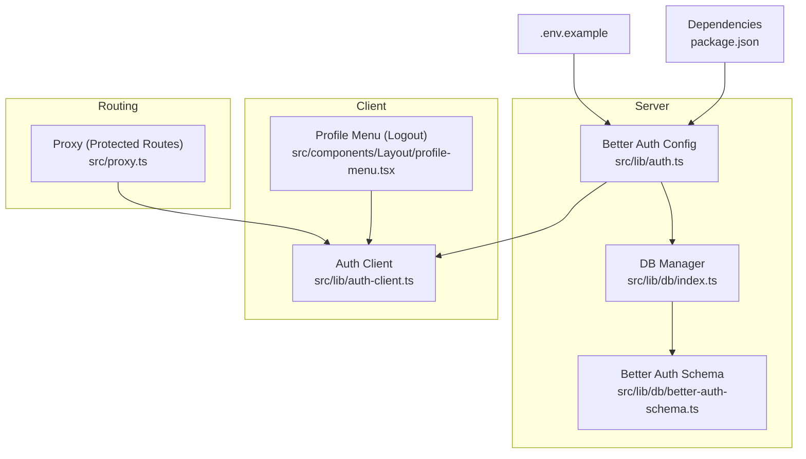
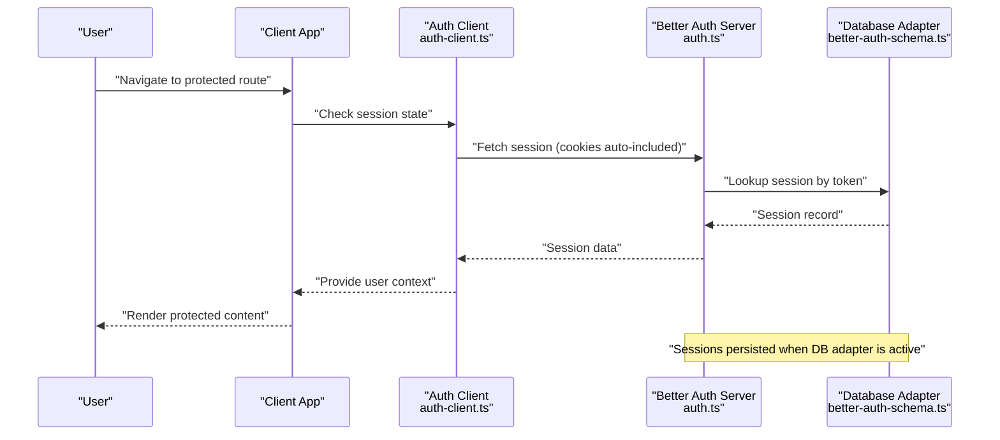
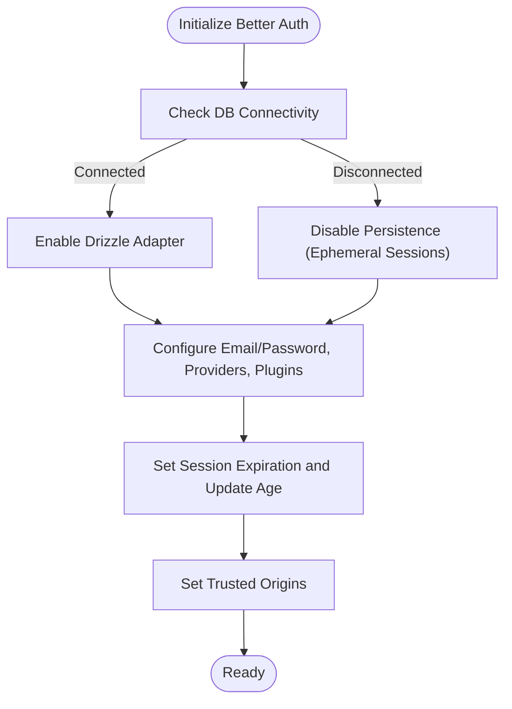
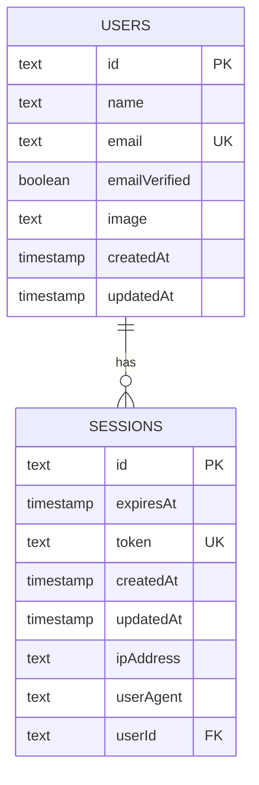
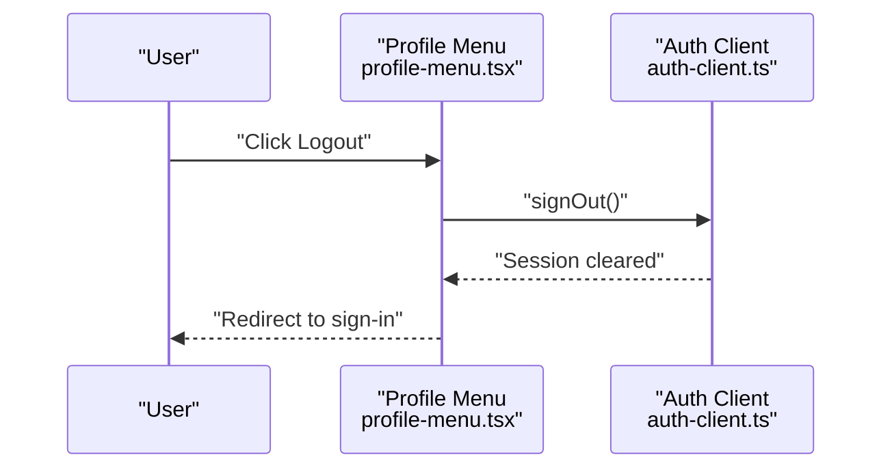
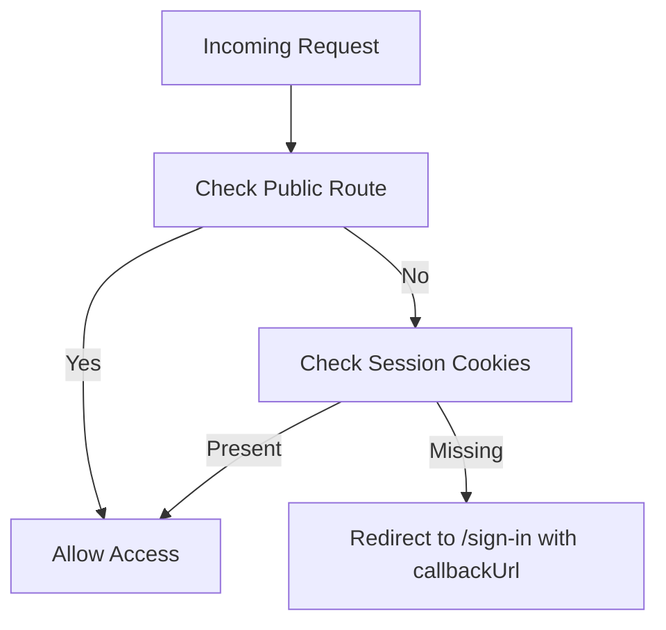
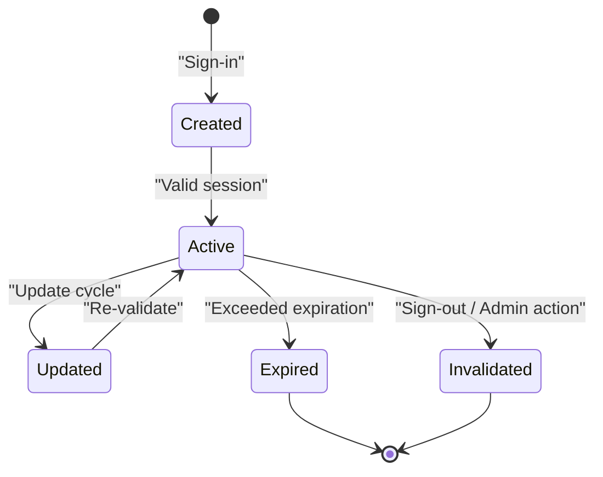
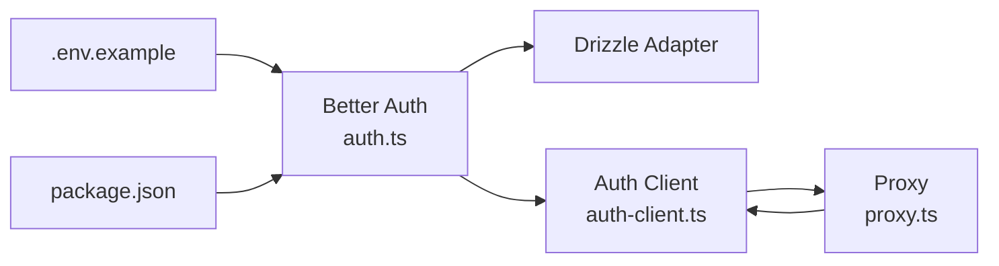

# Session Management

<cite>
**Referenced Files in This Document**
- [auth.ts](file://src/lib/auth.ts)
- [auth-client.ts](file://src/lib/auth-client.ts)
- [proxy.ts](file://src/proxy.ts)
- [.env.example](file://.env.example)
- [package.json](file://package.json)
- [profile-menu.tsx](file://src/components/Layout/profile-menu.tsx)
- [better-auth-schema.ts](file://src/lib/db/better-auth-schema.ts)
- [index.ts (db manager)](file://src/lib/db/index.ts)
- [auth.spec.ts (e2e)](file://e2e/auth.spec.ts)
</cite>

## Table of Contents
1. [Introduction](#introduction)
2. [Project Structure](#project-structure)
3. [Core Components](#core-components)
4. [Architecture Overview](#architecture-overview)
5. [Detailed Component Analysis](#detailed-component-analysis)
6. [Dependency Analysis](#dependency-analysis)
7. [Performance Considerations](#performance-considerations)
8. [Troubleshooting Guide](#troubleshooting-guide)
9. [Conclusion](#conclusion)

## Introduction
This document explains session management in MatricMaster AI, focusing on Better Auth configuration, session lifecycle, client-side handling, storage, cookies, cross-origin behavior, and security controls. It also covers protected routing, session validation, and common session-related issues such as expiration, concurrent logins, and invalidation.

## Project Structure
Better Auth is configured centrally and consumed by both the server and client:
- Server-side session configuration and adapter wiring are defined in the Better Auth module.
- Client-side session utilities are exposed via a React client wrapper.
- A Next.js middleware-like proxy enforces session checks for protected routes.
- Environment variables define base URLs, secrets, and trusted origins.
- Database connectivity determines whether sessions are persisted.

**Diagram sources**
- [auth.ts](file://src/lib/auth.ts#L48-L69)
- [index.ts (db manager)](file://src/lib/db/index.ts#L9-L87)
- [better-auth-schema.ts](file://src/lib/db/better-auth-schema.ts#L21-L39)
- [auth-client.ts](file://src/lib/auth-client.ts#L1-L10)
- [profile-menu.tsx](file://src/components/Layout/profile-menu.tsx#L69-L75)
- [proxy.ts](file://src/proxy.ts#L4-L43)
- [.env.example](file://.env.example#L1-L19)
- [package.json](file://package.json#L46-L64)

**Section sources**
- [auth.ts](file://src/lib/auth.ts#L1-L103)
- [auth-client.ts](file://src/lib/auth-client.ts#L1-L10)
- [proxy.ts](file://src/proxy.ts#L1-L57)
- [.env.example](file://.env.example#L1-L19)
- [package.json](file://package.json#L27-L64)
- [index.ts (db manager)](file://src/lib/db/index.ts#L1-L102)
- [better-auth-schema.ts](file://src/lib/db/better-auth-schema.ts#L1-L39)
- [profile-menu.tsx](file://src/components/Layout/profile-menu.tsx#L1-L80)

## Core Components
- Better Auth server configuration:
  - Base URL, secret, database adapter, email/password, social providers, anonymous plugin, session settings, and trusted origins.
  - Session expiration and update age are set in the session block.
- Database adapter:
  - Drizzle adapter wired to PostgreSQL when available; otherwise, Better Auth falls back to in-memory sessions.
- Client-side auth client:
  - React client wrapper exposing sign-in, sign-up, sign-out, and session hook.
- Protected route enforcement:
  - Middleware-like logic checks for Better Auth cookies and redirects unauthenticated users to sign-in.

Key configuration highlights:
- Session expiration and update interval are defined in the Better Auth configuration.
- Trusted origins and base URL are derived from environment variables.
- Cookie names checked by the proxy include the Better Auth session cookie and anonymous cookie.

**Section sources**
- [auth.ts](file://src/lib/auth.ts#L48-L69)
- [auth-client.ts](file://src/lib/auth-client.ts#L1-L10)
- [proxy.ts](file://src/proxy.ts#L12-L22)
- [.env.example](file://.env.example#L1-L19)

## Architecture Overview
The session lifecycle spans server configuration, client utilities, and route protection. Sessions are stored in the database when connected; otherwise, they are ephemeral. Cookies are used for client identification and are validated by the proxy.

**Diagram sources**
- [auth-client.ts](file://src/lib/auth-client.ts#L1-L10)
- [auth.ts](file://src/lib/auth.ts#L48-L69)
- [better-auth-schema.ts](file://src/lib/db/better-auth-schema.ts#L21-L39)

## Detailed Component Analysis

### Better Auth Server Configuration
- Base URL and secret are loaded from environment variables.
- Database adapter is conditionally enabled when the database is available; otherwise, sessions are not persisted.
- Email/password sign-ins are enabled without requiring email verification.
- Social providers include Google; optional Twitter provider is added only if credentials are present.
- Anonymous plugin is enabled for anonymous sessions.
- Session settings:
  - Expiration period and update interval are configured.
- Trusted origins include the frontend origin.

**Diagram sources**
- [auth.ts](file://src/lib/auth.ts#L9-L70)
- [index.ts (db manager)](file://src/lib/db/index.ts#L24-L39)
- [better-auth-schema.ts](file://src/lib/db/better-auth-schema.ts#L21-L39)

**Section sources**
- [auth.ts](file://src/lib/auth.ts#L48-L69)
- [index.ts (db manager)](file://src/lib/db/index.ts#L24-L39)

### Session Storage and Persistence
- When the database is connected, Better Auth stores sessions in the sessions table with fields for token, expiry, IP address, user agent, and user ID.
- The schema defines indices on token and user ID for efficient lookup.
- Without a database connection, sessions are not persisted and remain ephemeral.

**Diagram sources**
- [better-auth-schema.ts](file://src/lib/db/better-auth-schema.ts#L5-L19)
- [better-auth-schema.ts](file://src/lib/db/better-auth-schema.ts#L21-L39)

**Section sources**
- [better-auth-schema.ts](file://src/lib/db/better-auth-schema.ts#L1-L39)
- [auth.ts](file://src/lib/auth.ts#L52-L57)

### Client-Side Session Handling
- The React client exposes sign-in, sign-up, sign-out, and a session hook.
- The profile menu demonstrates logout via the client’s sign-out function.
- The client’s base URL is derived from the frontend environment variable.

**Diagram sources**
- [profile-menu.tsx](file://src/components/Layout/profile-menu.tsx#L69-L75)
- [auth-client.ts](file://src/lib/auth-client.ts#L1-L10)

**Section sources**
- [auth-client.ts](file://src/lib/auth-client.ts#L1-L10)
- [profile-menu.tsx](file://src/components/Layout/profile-menu.tsx#L69-L75)

### Protected Route Access and Session Validation
- The proxy checks for Better Auth cookies and anonymous cookies to determine if a user is authenticated.
- Non-public routes redirect unauthenticated users to the sign-in page with a callback URL.
- Public routes include the home page, sign-in/sign-up pages, forgot-password, and specific API endpoints.

**Diagram sources**
- [proxy.ts](file://src/proxy.ts#L4-L43)

**Section sources**
- [proxy.ts](file://src/proxy.ts#L4-L43)

### Session Lifecycle: Creation to Destruction
- Creation:
  - Successful sign-in sets Better Auth cookies. When the database is connected, a session record is created in the sessions table.
- Automatic Renewal:
  - The session update age triggers periodic updates to keep the session fresh.
- Destruction:
  - Explicit sign-out clears the session on the server and client.
  - Expired sessions are rejected by the server during validation.
  - Database disconnection causes sessions to become ephemeral and not persist across restarts.

**Diagram sources**
- [auth.ts](file://src/lib/auth.ts#L64-L67)
- [better-auth-schema.ts](file://src/lib/db/better-auth-schema.ts#L21-L39)

**Section sources**
- [auth.ts](file://src/lib/auth.ts#L64-L67)
- [better-auth-schema.ts](file://src/lib/db/better-auth-schema.ts#L21-L39)

### Cross-Origin Handling
- Trusted origins are configured from the frontend URL, ensuring cookies and requests are accepted only from allowed origins.
- Base URL is derived from environment variables to align server and client expectations.

**Section sources**
- [auth.ts](file://src/lib/auth.ts#L49-L69)
- [.env.example](file://.env.example#L3-L3)

### Security Features
- CSRF protection:
  - Better Auth provides built-in CSRF protections; ensure all mutations are performed through the Better Auth client or server APIs.
- Secure cookies:
  - Cookies are managed by Better Auth; configure HTTPS and SameSite policies at the deployment level if applicable.
- Session hijacking prevention:
  - Session records capture IP address and user agent; consider validating these attributes on the server for stricter environments.
- Concurrency and session invalidation:
  - The anonymous plugin is enabled; evaluate whether to restrict concurrent sessions or enforce single-session per user depending on security posture.

[No sources needed since this section provides general guidance]

## Dependency Analysis
- Better Auth depends on:
  - Environment variables for base URL, secret, and trusted origins.
  - Database adapter availability for persistence.
- Client depends on:
  - Frontend environment variable for base URL alignment.
- Proxy depends on:
  - Cookie names used by Better Auth and anonymous plugin.

**Diagram sources**
- [.env.example](file://.env.example#L1-L19)
- [package.json](file://package.json#L46-L64)
- [auth.ts](file://src/lib/auth.ts#L48-L69)
- [auth-client.ts](file://src/lib/auth-client.ts#L1-L10)
- [proxy.ts](file://src/proxy.ts#L12-L22)

**Section sources**
- [auth.ts](file://src/lib/auth.ts#L48-L69)
- [auth-client.ts](file://src/lib/auth-client.ts#L1-L10)
- [proxy.ts](file://src/proxy.ts#L12-L22)
- [.env.example](file://.env.example#L1-L19)
- [package.json](file://package.json#L46-L64)

## Performance Considerations
- Session update frequency:
  - The update age setting balances freshness and server load; adjust based on traffic patterns.
- Database connectivity:
  - Persistent sessions incur database queries; ensure reliable connectivity and indexing for the sessions table.
- Cookie validation:
  - Minimal overhead on the client; rely on automatic cookie inclusion by the browser.

[No sources needed since this section provides general guidance]

## Troubleshooting Guide
Common issues and resolutions:
- Expired sessions:
  - Sessions exceeding the configured expiration are rejected. Users will be redirected to sign-in. Consider increasing expiration or relying on frequent updates.
- Concurrent logins:
  - The anonymous plugin allows anonymous sessions; if strict single-session policy is desired, customize Better Auth plugins accordingly.
- Session invalidation:
  - Use the client’s sign-out function to invalidate the session server-side and clear client state.
- Protected route access:
  - If redirection loops occur, verify the proxy’s public route list and cookie presence.
- Database not connected:
  - When the database is unavailable, sessions are not persisted. Expect ephemeral sessions and re-authentication after restarts.

**Section sources**
- [proxy.ts](file://src/proxy.ts#L12-L22)
- [auth-client.ts](file://src/lib/auth-client.ts#L1-L10)
- [auth.ts](file://src/lib/auth.ts#L13-L21)

## Conclusion
MatricMaster AI uses Better Auth to manage sessions with configurable expiration and update cycles, persistent storage when the database is available, and a React client for seamless session handling. The proxy enforces protected routes by validating cookies, while environment variables and trusted origins ensure cross-origin safety. For enhanced security, consider enabling CSRF protections, enforcing HTTPS, and evaluating single-session policies depending on application needs.