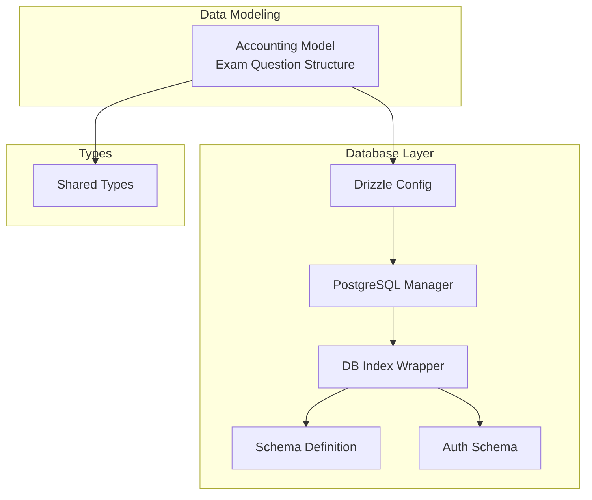
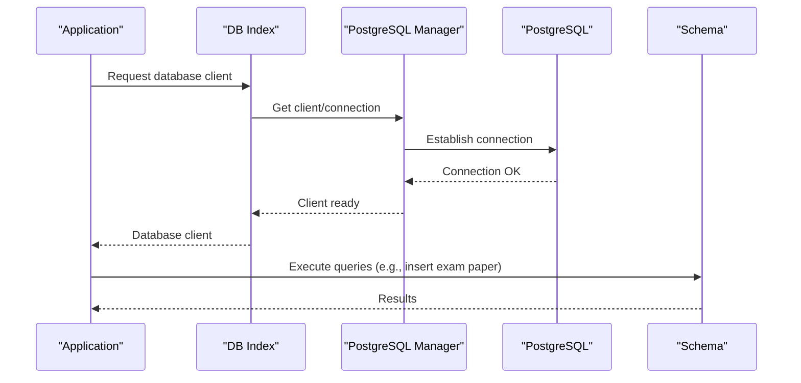
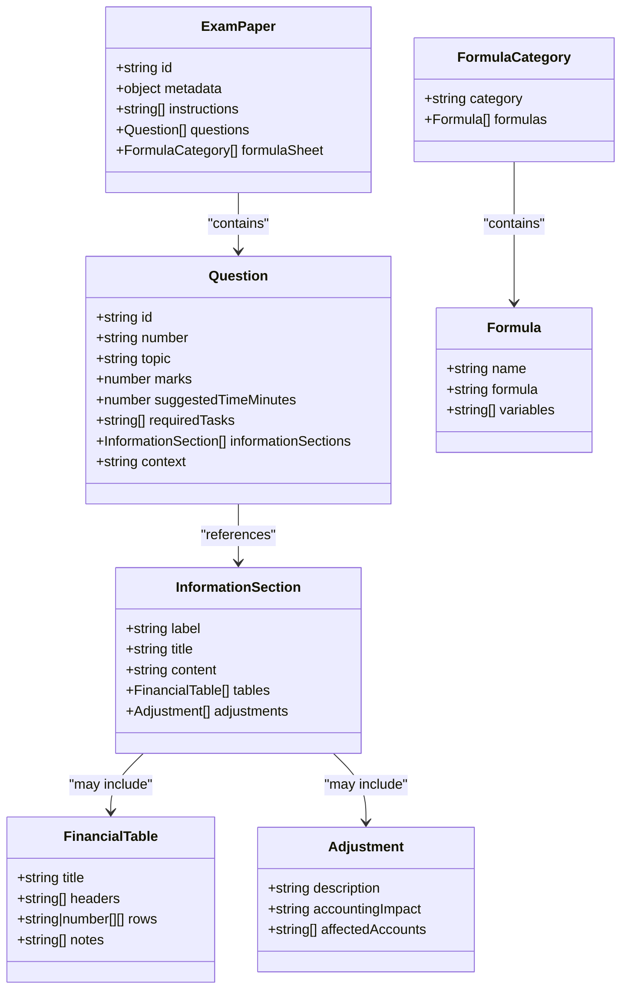
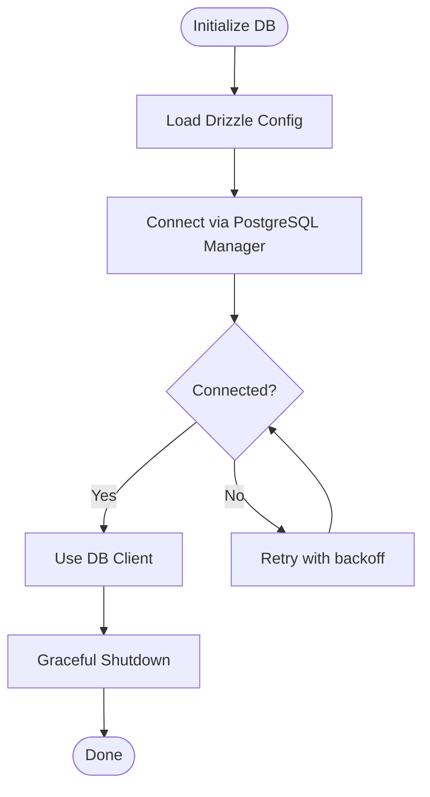
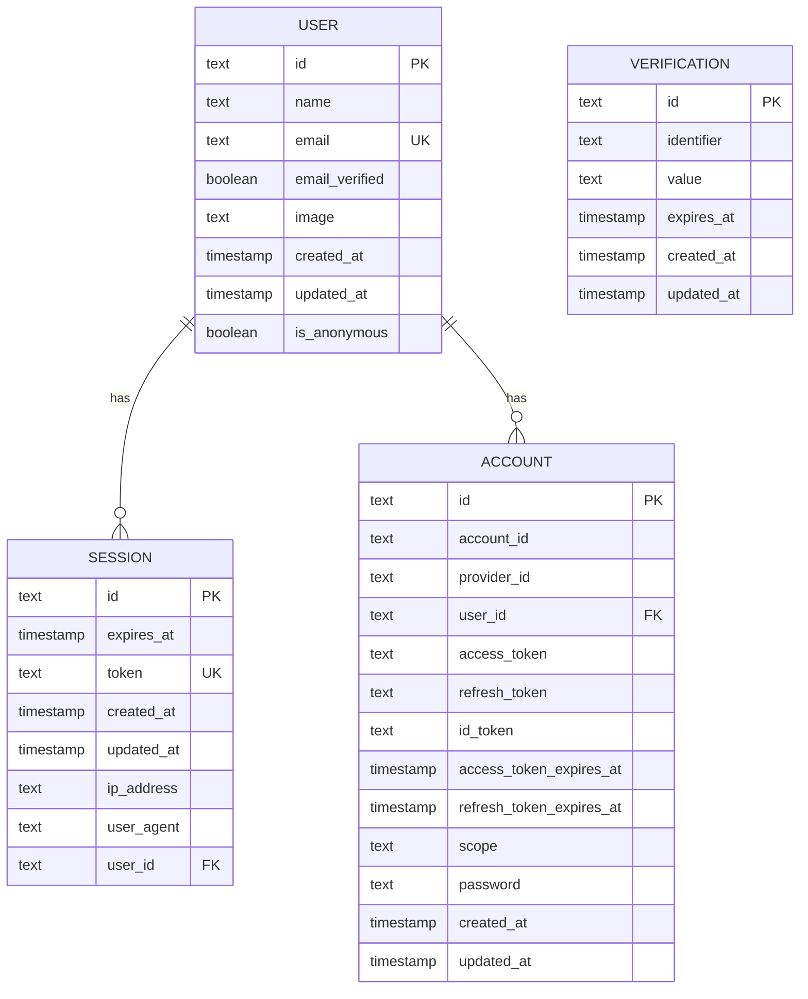
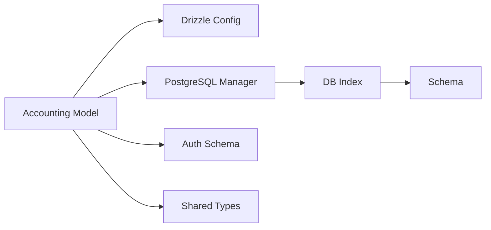

# Accounting Model

<cite>
**Referenced Files in This Document**
- [accounting_model.md](file://src/data_modeling/accounting_model.md)
- [drizzle.config.ts](file://drizzle.config.ts)
- [pg-manager](file://src/lib/db/postgresql-manager.ts)
- [db-index](file://src/lib/db/index.ts)
- [auth-schema.ts](file://auth-schema.ts)
- [schema.ts](file://src/lib/db/schema.ts)
- [index.ts](file://src/types/index.ts)
</cite>

## Table of Contents
1. [Introduction](#introduction)
2. [Project Structure](#project-structure)
3. [Core Components](#core-components)
4. [Architecture Overview](#architecture-overview)
5. [Detailed Component Analysis](#detailed-component-analysis)
6. [Dependency Analysis](#dependency-analysis)
7. [Performance Considerations](#performance-considerations)
8. [Troubleshooting Guide](#troubleshooting-guide)
9. [Conclusion](#conclusion)
10. [Appendices](#appendices)

## Introduction
This document provides comprehensive data modeling guidance for the Accounting subject model in MatricMaster AI. It focuses on:
- Question structure for financial statements, accounting principles, and business calculations
- Metadata requirements for accounting cycles, journal entries, and financial reporting
- Integration with spreadsheet analysis, ledger management, and tax calculation components
- Examples of balance sheets, income statements, and cash flow analysis questions
- Database schema for handling financial data, ratio calculations, and audit trail requirements
- Implementation guidance for accounting content validation, regulatory compliance integration, and professional accounting standards alignment

The repository’s Accounting data model is primarily represented as a structured exam framework for educational practice. The guidance below aligns the conceptual model with the existing database infrastructure and schema definitions.

## Project Structure
The Accounting model is defined in a dedicated data modeling document and integrated with the application’s database layer via Drizzle ORM and PostgreSQL. The relevant components are:
- Data model definition for exam-style accounting questions
- Database configuration and connection management
- Authentication schema for user context
- Type definitions for shared domain entities

**Diagram sources**
- [accounting_model.md](file://src/data_modeling/accounting_model.md#L18-L84)
- [drizzle.config.ts](file://drizzle.config.ts#L6-L15)
- [pg-manager](file://src/lib/db/postgresql-manager.ts#L18-L141)
- [db-index](file://src/lib/db/index.ts#L9-L87)
- [schema.ts](file://src/lib/db/schema.ts)
- [auth-schema.ts](file://auth-schema.ts#L4-L95)
- [index.ts](file://src/types/index.ts#L21-L60)

**Section sources**
- [accounting_model.md](file://src/data_modeling/accounting_model.md#L18-L84)
- [drizzle.config.ts](file://drizzle.config.ts#L6-L15)
- [pg-manager](file://src/lib/db/postgresql-manager.ts#L18-L141)
- [db-index](file://src/lib/db/index.ts#L9-L87)
- [auth-schema.ts](file://auth-schema.ts#L4-L95)
- [index.ts](file://src/types/index.ts#L21-L60)

## Core Components
This section outlines the core data structures and relationships used to represent accounting content and integrate with the database.

- ExamPaper: Top-level container for an accounting exam paper, including metadata, instructions, questions, and formula sheet.
- Question: Represents a single exam question with topic, marks, time allocation, tasks, and supporting information sections.
- InformationSection: Provides labeled content blocks, optional financial tables, and adjustment notes.
- FinancialTable: Standardized table representation for balances, notes, and derived values.
- Adjustment: Captures audit-style adjustments and their accounting impact.
- FormulaCategory: Organizes commonly used financial formulas by category.

These structures support:
- Financial statement preparation (income statement, balance sheet, cash flow)
- Journal entry recording and ledger posting
- Ratio calculations and financial analysis
- Audit trail generation through metadata and timestamps

**Section sources**
- [accounting_model.md](file://src/data_modeling/accounting_model.md#L24-L83)

## Architecture Overview
The Accounting model integrates with the database layer using Drizzle ORM and PostgreSQL. The connection lifecycle is managed by a singleton PostgreSQL manager, which is wrapped by a database index module for application-wide access.

**Diagram sources**
- [db-index](file://src/lib/db/index.ts#L41-L56)
- [pg-manager](file://src/lib/db/postgresql-manager.ts#L42-L90)
- [drizzle.config.ts](file://drizzle.config.ts#L6-L15)

## Detailed Component Analysis

### Exam Paper Data Model
The exam paper structure encapsulates metadata, instructions, and a collection of questions. Each question references supporting information sections that may include financial tables and adjustments.

**Diagram sources**
- [accounting_model.md](file://src/data_modeling/accounting_model.md#L24-L83)

**Section sources**
- [accounting_model.md](file://src/data_modeling/accounting_model.md#L24-L83)

### Database Schema Guidance
The repository’s Drizzle configuration targets a PostgreSQL schema. While the current schema file is not present in the workspace snapshot, the configuration defines the dialect, schema location, and casing convention. The database index and PostgreSQL manager modules provide a robust connection lifecycle and singleton pattern for database access.

**Diagram sources**
- [drizzle.config.ts](file://drizzle.config.ts#L6-L15)
- [pg-manager](file://src/lib/db/postgresql-manager.ts#L128-L140)
- [db-index](file://src/lib/db/index.ts#L59-L63)

**Section sources**
- [drizzle.config.ts](file://drizzle.config.ts#L6-L15)
- [pg-manager](file://src/lib/db/postgresql-manager.ts#L18-L141)
- [db-index](file://src/lib/db/index.ts#L9-L87)

### Authentication and User Context
The authentication schema defines user, session, account, and verification entities. These are essential for associating accounting practice sessions with users and maintaining audit trails.

**Diagram sources**
- [auth-schema.ts](file://auth-schema.ts#L4-L95)

**Section sources**
- [auth-schema.ts](file://auth-schema.ts#L4-L95)

### Shared Types and Domain Entities
Shared types define common domain structures used across the application, including subjects, achievements, rankings, and content items. These types support cross-cutting integrations with the Accounting model (e.g., subject categorization, progress tracking).

**Section sources**
- [index.ts](file://src/types/index.ts#L21-L60)

## Dependency Analysis
The Accounting model depends on:
- Drizzle ORM configuration for schema and dialect
- PostgreSQL manager for connection lifecycle and singleton access
- Authentication schema for user context and auditability
- Shared types for domain consistency

**Diagram sources**
- [accounting_model.md](file://src/data_modeling/accounting_model.md#L18-L84)
- [drizzle.config.ts](file://drizzle.config.ts#L6-L15)
- [pg-manager](file://src/lib/db/postgresql-manager.ts#L18-L141)
- [db-index](file://src/lib/db/index.ts#L9-L87)
- [auth-schema.ts](file://auth-schema.ts#L4-L95)
- [index.ts](file://src/types/index.ts#L21-L60)

**Section sources**
- [accounting_model.md](file://src/data_modeling/accounting_model.md#L18-L84)
- [drizzle.config.ts](file://drizzle.config.ts#L6-L15)
- [pg-manager](file://src/lib/db/postgresql-manager.ts#L18-L141)
- [db-index](file://src/lib/db/index.ts#L9-L87)
- [auth-schema.ts](file://auth-schema.ts#L4-L95)
- [index.ts](file://src/types/index.ts#L21-L60)

## Performance Considerations
- Connection pooling and timeouts: The PostgreSQL manager enforces configurable connection and idle timeouts to prevent resource exhaustion.
- Singleton access: The database index and manager use singleton patterns to avoid redundant connections.
- Graceful shutdown: Handlers ensure connections are closed on termination signals.

Recommendations:
- Tune max connections and idle timeouts based on workload.
- Use prepared statements and batch operations for bulk inserts (e.g., exam papers and student attempts).
- Index frequently queried columns (e.g., user_id, paper_id) in production schemas.

**Section sources**
- [pg-manager](file://src/lib/db/postgresql-manager.ts#L31-L36)
- [pg-manager](file://src/lib/db/postgresql-manager.ts#L147-L157)
- [db-index](file://src/lib/db/index.ts#L93-L95)

## Troubleshooting Guide
Common issues and resolutions:
- Connection failures: Verify DATABASE_URL and network connectivity. The manager retries up to a configured limit with delays.
- SSL requirements: For providers like Neon, SSL is enabled automatically when the connection string includes the provider host.
- Graceful shutdown: SIGTERM/SIGINT handlers ensure clean disconnection.

Operational checks:
- Confirm Drizzle configuration points to the correct schema path and dialect.
- Validate that the schema file exists and matches the configuration.
- Monitor logs for connection timeouts and retry attempts.

**Section sources**
- [pg-manager](file://src/lib/db/postgresql-manager.ts#L47-L50)
- [pg-manager](file://src/lib/db/postgresql-manager.ts#L55-L65)
- [pg-manager](file://src/lib/db/postgresql-manager.ts#L128-L140)
- [drizzle.config.ts](file://drizzle.config.ts#L6-L15)

## Conclusion
The Accounting model in MatricMaster AI is designed around a structured exam framework that supports financial statement preparation, journal entries, and ratio analysis. Its integration with Drizzle ORM and PostgreSQL ensures scalable persistence, while the authentication schema enables user context and auditability. By adhering to the recommended data structures, validation practices, and compliance guidelines, the system can deliver robust, standards-aligned accounting education experiences.

## Appendices

### Example Question Types and Business Calculations
- Income statement preparation: Revenue, cost of goods sold, expenses, profit recognition
- Balance sheet presentation: Assets, liabilities, equity classification and measurement
- Cash flow analysis: Operating, investing, financing activities and reconciliations
- Adjustments: Accruals, deferrals, impairments, revaluations
- Ratios: Profitability, liquidity, solvency, efficiency metrics

[No sources needed since this section provides general guidance]

### Metadata Requirements for Accounting Cycles and Reporting
- Paper metadata: subject, paper code, year, session, total marks, duration, grade, curriculum
- Question metadata: topic, marks, suggested time, context (company name)
- Information sections: labels, titles, content, tables, adjustments
- Audit trail: timestamps, user identifiers, change logs

**Section sources**
- [accounting_model.md](file://src/data_modeling/accounting_model.md#L26-L36)
- [accounting_model.md](file://src/data_modeling/accounting_model.md#L46-L51)
- [accounting_model.md](file://src/data_modeling/accounting_model.md#L54-L60)

### Implementation Guidance for Validation and Compliance
- Validation: Engage qualified accountants to review calculations and adjustments
- Accessibility: Provide ARIA labels and alt-text for financial visuals
- Legal compliance: Include appropriate copyright notices and avoid distributing original exam materials
- Professional standards: Align formulas and classifications with recognized accounting frameworks

**Section sources**
- [accounting_model.md](file://src/data_modeling/accounting_model.md#L235-L244)