# Data Modeling

<cite>
**Referenced Files in This Document**
- [mathematics_model.md](file://src/data_modeling/mathematics_model.md)
- [physics_model.md](file://src/data_modeling/physics_model.md)
- [economics_model.md](file://src/data_modeling/economics_model.md)
- [english_model.md](file://src/data_modeling/english_model.md)
- [history_model.md](file://src/data_modeling/history_model.md)
- [accounting_model.md](file://src/data_modeling/accounting_model.md)
- [index.ts](file://src/types/index.ts)
- [evaluation.ts](file://src/types/evaluation.ts)
- [quiz-data.ts](file://src/constants/quiz-data.ts)
- [mock-data.ts](file://src/constants/mock-data.ts)
- [MathematicsQuiz.tsx](file://src/screens/MathematicsQuiz.tsx)
- [PhysicsQuiz.tsx](file://src/screens/PhysicsQuiz.tsx)
- [PracticeQuiz.tsx](file://src/screens/PracticeQuiz.tsx)
- [InteractiveQuiz.tsx](file://src/screens/InteractiveQuiz.tsx)
- [geminiService.ts](file://src/services/geminiService.ts)
- [aiActions.ts](file://src/services/aiActions.ts)
- [data.ts](file://src/lib/data.ts)
</cite>

## Table of Contents
1. [Introduction](#introduction)
2. [Project Structure](#project-structure)
3. [Core Components](#core-components)
4. [Architecture Overview](#architecture-overview)
5. [Detailed Component Analysis](#detailed-component-analysis)
6. [Dependency Analysis](#dependency-analysis)
7. [Performance Considerations](#performance-considerations)
8. [Troubleshooting Guide](#troubleshooting-guide)
9. [Conclusion](#conclusion)
10. [Appendices](#appendices)

## Introduction
This document provides comprehensive data modeling documentation for MatricMaster AI’s educational content structure across six subjects aligned with South African Senior Certificate (NSC) curriculum standards: Mathematics, Physics, Economics, English, History, and Accounting. It details subject-specific data models, question structures, answer formats, difficulty levels, topic coverage, content organization patterns, prerequisite relationships, and learning pathway mapping. It also explains implementation details for content validation, question randomization, and adaptive assessment strategies, and documents the relationships between data models and quiz system functionality, progress tracking, and study planning features. Finally, it outlines content creation workflows, data import procedures, curriculum alignment validation, maintenance strategies, update procedures, and integration with AI-powered content generation.

## Project Structure
MatricMaster AI organizes subject data models under a dedicated folder and integrates them with:
- TypeScript interfaces and evaluation utilities for quiz scoring
- Constant datasets for quick-start quizzes
- UI screens for interactive quiz experiences
- AI services for explanations and study planning
- Server-side data utilities for dashboard, progress, and recommendations

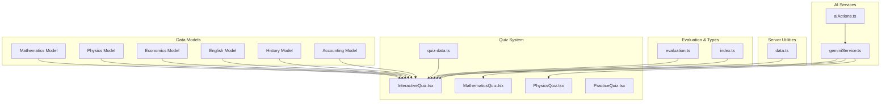

**Diagram sources**
- [mathematics_model.md](file://src/data_modeling/mathematics_model.md#L1-L212)
- [physics_model.md](file://src/data_modeling/physics_model.md#L1-L376)
- [economics_model.md](file://src/data_modeling/economics_model.md#L1-L294)
- [english_model.md](file://src/data_modeling/english_model.md#L1-L474)
- [history_model.md](file://src/data_modeling/history_model.md#L1-L686)
- [accounting_model.md](file://src/data_modeling/accounting_model.md#L1-L246)
- [InteractiveQuiz.tsx](file://src/screens/InteractiveQuiz.tsx#L1-L458)
- [MathematicsQuiz.tsx](file://src/screens/MathematicsQuiz.tsx#L1-L283)
- [PhysicsQuiz.tsx](file://src/screens/PhysicsQuiz.tsx#L1-L446)
- [PracticeQuiz.tsx](file://src/screens/PracticeQuiz.tsx#L1-L378)
- [quiz-data.ts](file://src/constants/quiz-data.ts#L1-L313)
- [evaluation.ts](file://src/types/evaluation.ts#L1-L421)
- [index.ts](file://src/types/index.ts#L1-L60)
- [geminiService.ts](file://src/services/geminiService.ts#L1-L14)
- [aiActions.ts](file://src/services/aiActions.ts#L1-L168)
- [data.ts](file://src/lib/data.ts#L1-L504)

**Section sources**
- [mathematics_model.md](file://src/data_modeling/mathematics_model.md#L1-L212)
- [physics_model.md](file://src/data_modeling/physics_model.md#L1-L376)
- [economics_model.md](file://src/data_modeling/economics_model.md#L1-L294)
- [english_model.md](file://src/data_modeling/english_model.md#L1-L474)
- [history_model.md](file://src/data_modeling/history_model.md#L1-L686)
- [accounting_model.md](file://src/data_modeling/accounting_model.md#L1-L246)
- [InteractiveQuiz.tsx](file://src/screens/InteractiveQuiz.tsx#L1-L458)
- [MathematicsQuiz.tsx](file://src/screens/MathematicsQuiz.tsx#L1-L283)
- [PhysicsQuiz.tsx](file://src/screens/PhysicsQuiz.tsx#L1-L446)
- [PracticeQuiz.tsx](file://src/screens/PracticeQuiz.tsx#L1-L378)
- [quiz-data.ts](file://src/constants/quiz-data.ts#L1-L313)
- [evaluation.ts](file://src/types/evaluation.ts#L1-L421)
- [index.ts](file://src/types/index.ts#L1-L60)
- [geminiService.ts](file://src/services/geminiService.ts#L1-L14)
- [aiActions.ts](file://src/services/aiActions.ts#L1-L168)
- [data.ts](file://src/lib/data.ts#L1-L504)

## Core Components
- Subject-specific data models define question structures, metadata, and content organization for Mathematics, Physics, Economics, English, History, and Accounting.
- Quiz system components consume these models to render questions, manage user interactions, and provide AI-powered explanations.
- Evaluation utilities support scoring and feedback for various question types.
- Server utilities provide dashboard stats, progress tracking, and recommended content.

**Section sources**
- [mathematics_model.md](file://src/data_modeling/mathematics_model.md#L1-L212)
- [physics_model.md](file://src/data_modeling/physics_model.md#L1-L376)
- [economics_model.md](file://src/data_modeling/economics_model.md#L1-L294)
- [english_model.md](file://src/data_modeling/english_model.md#L1-L474)
- [history_model.md](file://src/data_modeling/history_model.md#L1-L686)
- [accounting_model.md](file://src/data_modeling/accounting_model.md#L1-L246)
- [InteractiveQuiz.tsx](file://src/screens/InteractiveQuiz.tsx#L1-L458)
- [MathematicsQuiz.tsx](file://src/screens/MathematicsQuiz.tsx#L1-L283)
- [PhysicsQuiz.tsx](file://src/screens/PhysicsQuiz.tsx#L1-L446)
- [PracticeQuiz.tsx](file://src/screens/PracticeQuiz.tsx#L1-L378)
- [evaluation.ts](file://src/types/evaluation.ts#L1-L421)
- [data.ts](file://src/lib/data.ts#L1-L504)

## Architecture Overview
The system integrates subject data models with UI screens and AI services to deliver an adaptive, curriculum-aligned learning experience. The quiz system supports multiple question types, difficulty levels, and topic coverage, while evaluation utilities provide scoring and feedback. Server utilities enable progress tracking and recommendation engines.

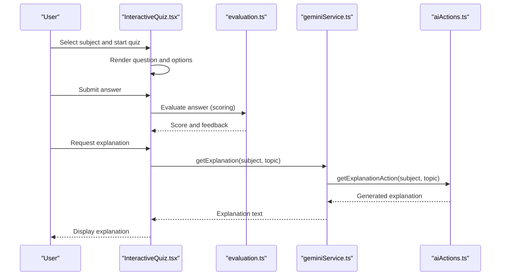

**Diagram sources**
- [InteractiveQuiz.tsx](file://src/screens/InteractiveQuiz.tsx#L105-L194)
- [evaluation.ts](file://src/types/evaluation.ts#L201-L248)
- [geminiService.ts](file://src/services/geminiService.ts#L1-L14)
- [aiActions.ts](file://src/services/aiActions.ts#L42-L78)

**Section sources**
- [InteractiveQuiz.tsx](file://src/screens/InteractiveQuiz.tsx#L1-L458)
- [evaluation.ts](file://src/types/evaluation.ts#L1-L421)
- [geminiService.ts](file://src/services/geminiService.ts#L1-L14)
- [aiActions.ts](file://src/services/aiActions.ts#L1-L168)

## Detailed Component Analysis

### Mathematics Data Model
- Core metadata includes exam paper identifiers, year, session, total marks, time allocation, and subject.
- Question structure supports nested parts and subparts with marks and metadata for diagram requirements and rounding.
- Proposed database schema normalizes questions with hierarchical IDs, depth, and order indexing for efficient querying.
- Implementation guide covers cleaning math symbols, LaTeX rendering, and multi-paper curriculum support.

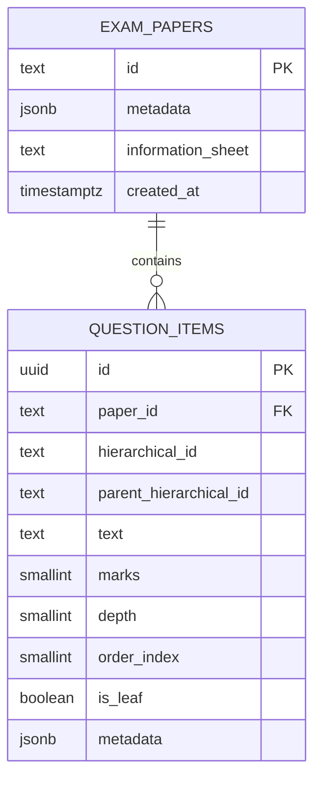

**Diagram sources**
- [mathematics_model.md](file://src/data_modeling/mathematics_model.md#L119-L147)

**Section sources**
- [mathematics_model.md](file://src/data_modeling/mathematics_model.md#L1-L212)

### Physics Data Model
- Supports multiple-choice and structured questions with scenario text, diagram references, and structured data sheets.
- MCQ options include letter codes and correctness flags; data sheets store constants and formulas in JSONB for flexible querying.
- Implementation notes address diagram handling, text normalization, and web app integration tips.

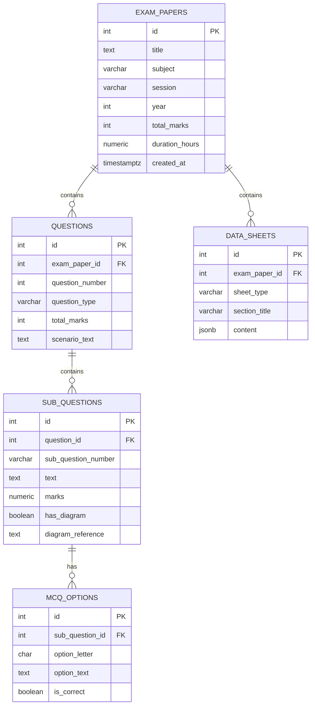

**Diagram sources**
- [physics_model.md](file://src/data_modeling/physics_model.md#L14-L79)

**Section sources**
- [physics_model.md](file://src/data_modeling/physics_model.md#L1-L376)

### Economics Data Model
- Modular structure supports dynamic rendering of question types (MCQ, matching, short-answer, data-response, essay, calculation).
- Stimulus-aware design handles graphs, tables, and cartoons referenced in questions.
- Prisma schema defines exam papers, sections, questions, and stimulus assets with JSON storage for options and matching exercises.

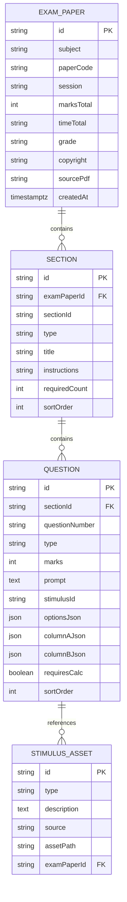

**Diagram sources**
- [economics_model.md](file://src/data_modeling/economics_model.md#L84-L143)

**Section sources**
- [economics_model.md](file://src/data_modeling/economics_model.md#L1-L294)

### English Data Model
- Database schema optimized for language assessment with sections (A: Comprehension, B: Summary, C: Language), source texts, questions, and sub-questions.
- Multimodal support for posters, cartoons, advertisements, and summary passages; constraints for task-specific requirements.
- Web integration guide includes visual asset resolution, summary validation, and cartoon analysis components.

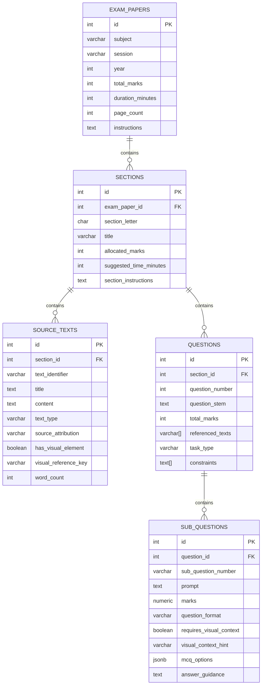

**Diagram sources**
- [english_model.md](file://src/data_modeling/english_model.md#L7-L85)

**Section sources**
- [english_model.md](file://src/data_modeling/english_model.md#L1-L474)

### History Data Model
- TypeScript interfaces and Prisma schema model source-based and essay sections with questions, sub-questions, and source materials.
- Instructions are stored separately for curriculum-aligned guidance.
- Next.js API and React components demonstrate fetching and rendering structured history exam data.

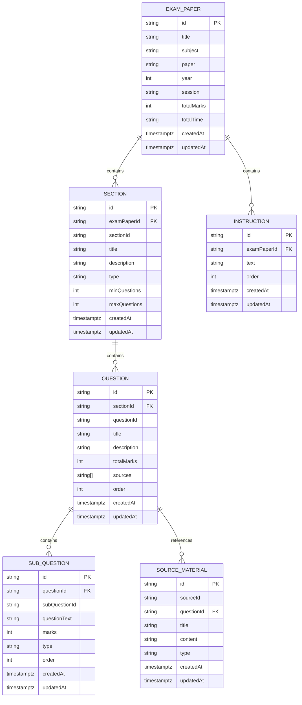

**Diagram sources**
- [history_model.md](file://src/data_modeling/history_model.md#L467-L564)

**Section sources**
- [history_model.md](file://src/data_modeling/history_model.md#L1-L686)

### Accounting Data Model
- Production-ready solution packages TypeScript interfaces, sample datasets, and PostgreSQL schema for storing exam papers, student attempts, and formula references.
- Emphasizes pre-processing of PDF content, validation of financial calculations, and accessibility considerations.

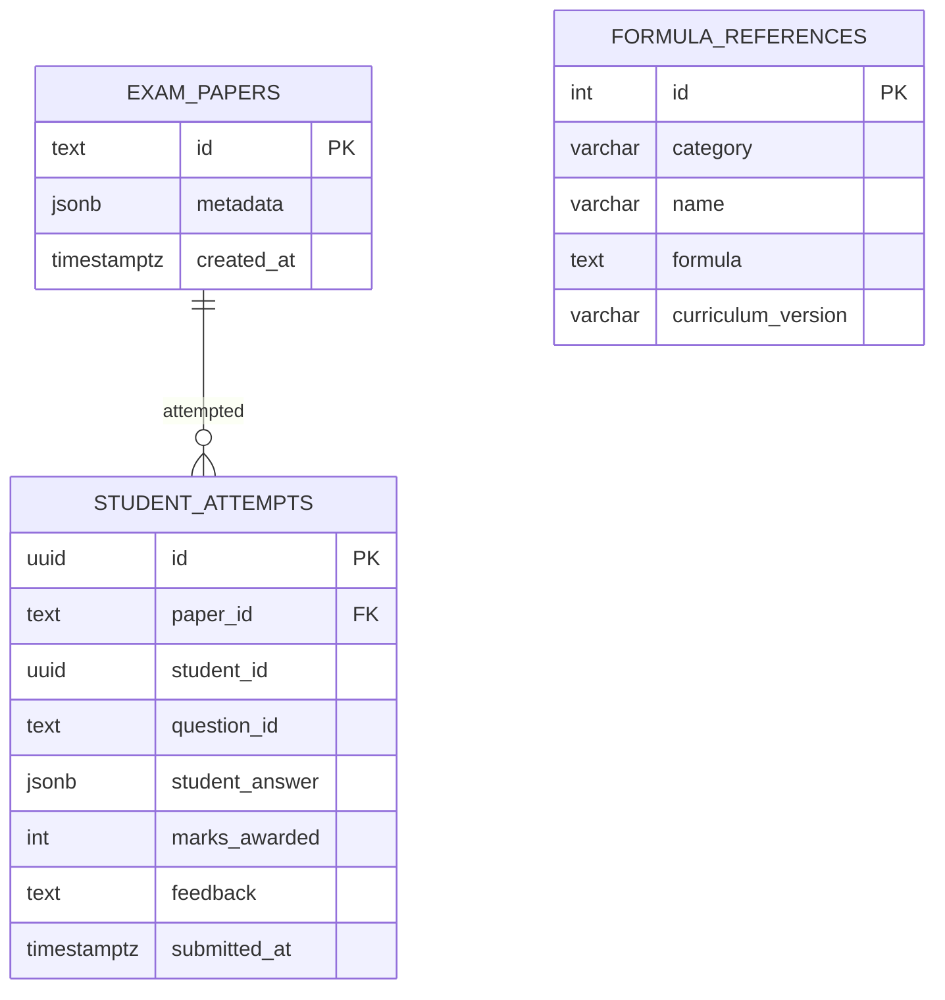

**Diagram sources**
- [accounting_model.md](file://src/data_modeling/accounting_model.md#L142-L170)

**Section sources**
- [accounting_model.md](file://src/data_modeling/accounting_model.md#L1-L246)

### Quiz System Integration
- InteractiveQuiz consumes a centralized quiz dataset and renders questions with subject-specific theming, progress tracking, hints, and AI explanations.
- MathematicsQuiz and PhysicsQuiz demonstrate subject-specific UI flows, including drag-and-drop solution steps and multiple-choice interactions.
- PracticeQuiz provides a specialized math input experience with symbol keyboards and visual graph areas.

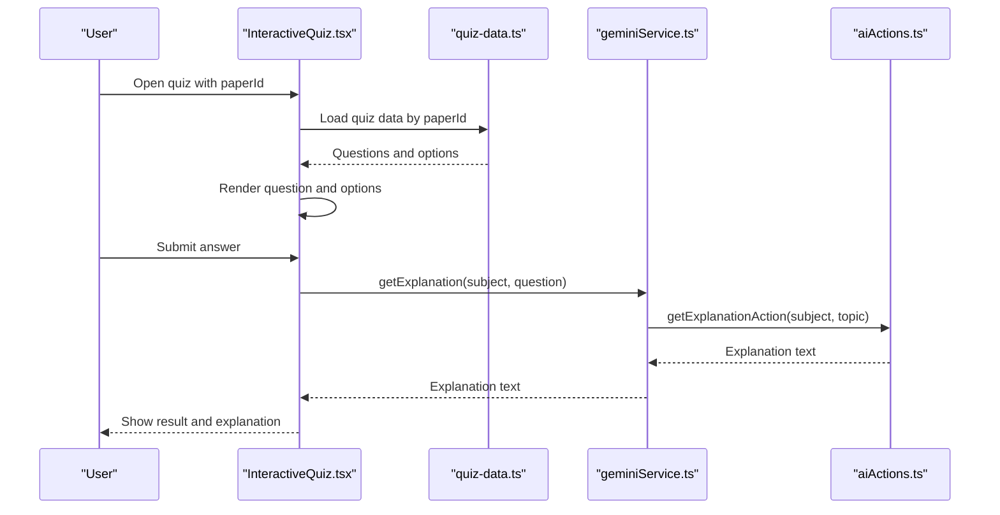

**Diagram sources**
- [InteractiveQuiz.tsx](file://src/screens/InteractiveQuiz.tsx#L105-L194)
- [quiz-data.ts](file://src/constants/quiz-data.ts#L15-L313)
- [geminiService.ts](file://src/services/geminiService.ts#L1-L14)
- [aiActions.ts](file://src/services/aiActions.ts#L42-L78)

**Section sources**
- [InteractiveQuiz.tsx](file://src/screens/InteractiveQuiz.tsx#L1-L458)
- [MathematicsQuiz.tsx](file://src/screens/MathematicsQuiz.tsx#L1-L283)
- [PhysicsQuiz.tsx](file://src/screens/PhysicsQuiz.tsx#L1-L446)
- [PracticeQuiz.tsx](file://src/screens/PracticeQuiz.tsx#L1-L378)
- [quiz-data.ts](file://src/constants/quiz-data.ts#L1-L313)
- [geminiService.ts](file://src/services/geminiService.ts#L1-L14)
- [aiActions.ts](file://src/services/aiActions.ts#L1-L168)

### Evaluation Utilities
- Summary evaluation analyzes included points, checks for verbatim quoting, and calculates language marks based on criteria.
- Exact match and keyword-based evaluators support MCQ and keyword-driven questions.
- Multiple-choice evaluator accepts letter or text answers with optional normalization.

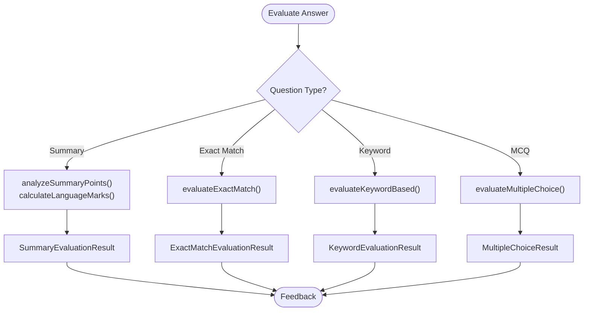

**Diagram sources**
- [evaluation.ts](file://src/types/evaluation.ts#L34-L248)

**Section sources**
- [evaluation.ts](file://src/types/evaluation.ts#L1-L421)

### Progress Tracking and Study Planning
- Server utilities provide dashboard statistics, user profiles, subject progress, and recommended content.
- Study plan generation uses AI actions to produce daily quest paths aligned with subject topics and weekly hours.
- Achievement system defines unlockable milestones based on activity and performance.

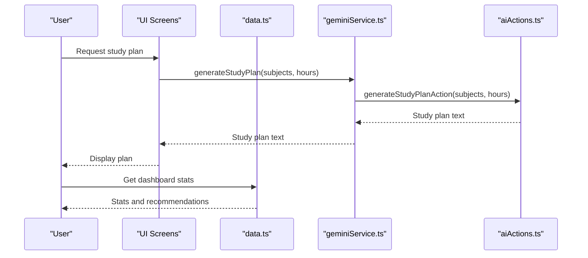

**Diagram sources**
- [data.ts](file://src/lib/data.ts#L272-L281)
- [geminiService.ts](file://src/services/geminiService.ts#L7-L9)
- [aiActions.ts](file://src/services/aiActions.ts#L80-L114)

**Section sources**
- [data.ts](file://src/lib/data.ts#L1-L504)
- [geminiService.ts](file://src/services/geminiService.ts#L1-L14)
- [aiActions.ts](file://src/services/aiActions.ts#L1-L168)

## Dependency Analysis
The following diagram highlights key dependencies between data models, quiz components, evaluation utilities, and AI services.

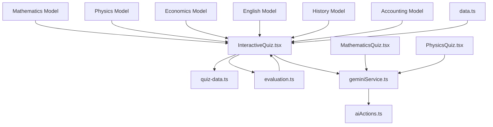

**Diagram sources**
- [InteractiveQuiz.tsx](file://src/screens/InteractiveQuiz.tsx#L1-L458)
- [quiz-data.ts](file://src/constants/quiz-data.ts#L1-L313)
- [evaluation.ts](file://src/types/evaluation.ts#L1-L421)
- [geminiService.ts](file://src/services/geminiService.ts#L1-L14)
- [aiActions.ts](file://src/services/aiActions.ts#L1-L168)
- [MathematicsQuiz.tsx](file://src/screens/MathematicsQuiz.tsx#L1-L283)
- [PhysicsQuiz.tsx](file://src/screens/PhysicsQuiz.tsx#L1-L446)
- [data.ts](file://src/lib/data.ts#L1-L504)

**Section sources**
- [InteractiveQuiz.tsx](file://src/screens/InteractiveQuiz.tsx#L1-L458)
- [quiz-data.ts](file://src/constants/quiz-data.ts#L1-L313)
- [evaluation.ts](file://src/types/evaluation.ts#L1-L421)
- [geminiService.ts](file://src/services/geminiService.ts#L1-L14)
- [aiActions.ts](file://src/services/aiActions.ts#L1-L168)
- [MathematicsQuiz.tsx](file://src/screens/MathematicsQuiz.tsx#L1-L283)
- [PhysicsQuiz.tsx](file://src/screens/PhysicsQuiz.tsx#L1-L446)
- [data.ts](file://src/lib/data.ts#L1-L504)

## Performance Considerations
- Normalize hierarchical question structures to support efficient filtering and sorting by depth and order index.
- Use JSONB fields for flexible content storage while indexing frequently queried fields.
- Cache server-side data retrieval to minimize database load and improve response times.
- Optimize UI rendering by virtualizing long lists and deferring heavy computations to background threads.
- Implement lazy loading for assets (images, diagrams) and use responsive image formats.

[No sources needed since this section provides general guidance]

## Troubleshooting Guide
- AI features disabled: Verify API key configuration; the AI action functions log warnings when the key is missing.
- Quiz data not loading: Ensure paperId parameters match entries in the quiz dataset; confirm subject filtering logic.
- Evaluation mismatches: Validate question types and scoring criteria; use evaluation utilities to debug scoring logic.
- Database queries failing: Confirm schema definitions and foreign key relationships; check isActive flags and soft-deleted records.

**Section sources**
- [aiActions.ts](file://src/services/aiActions.ts#L22-L32)
- [InteractiveQuiz.tsx](file://src/screens/InteractiveQuiz.tsx#L124-L129)
- [evaluation.ts](file://src/types/evaluation.ts#L201-L248)
- [data.ts](file://src/lib/data.ts#L130-L156)

## Conclusion
MatricMaster AI’s data modeling aligns closely with South African curriculum standards across six core subjects. The modular, normalized data models support diverse question types, multimodal content, and curriculum-specific constraints. The quiz system integrates seamlessly with evaluation utilities and AI services to provide adaptive assessments, personalized explanations, and study planning. Server utilities enable robust progress tracking and recommendations, laying a solid foundation for scalable content management and continuous improvement.

[No sources needed since this section summarizes without analyzing specific files]

## Appendices

### Content Creation Workflows
- Mathematics: Clean math symbols, convert to LaTeX, store normalized JSON, and render with KaTeX.
- Physics: Normalize MCQ options, flag diagram dependencies, and store structured data sheets.
- Economics: Extract stimulus assets, map to questions, and store JSON for options/matching.
- English: Manage multimodal assets (posters, cartoons), validate summary constraints, and scaffold writing tasks.
- History: Structure source-based and essay sections, link sources to questions, and maintain instructions.
- Accounting: Pre-process PDFs, verify financial calculations, and store formula references.

**Section sources**
- [mathematics_model.md](file://src/data_modeling/mathematics_model.md#L153-L196)
- [physics_model.md](file://src/data_modeling/physics_model.md#L309-L374)
- [economics_model.md](file://src/data_modeling/economics_model.md#L238-L287)
- [english_model.md](file://src/data_modeling/english_model.md#L367-L472)
- [history_model.md](file://src/data_modeling/history_model.md#L566-L613)
- [accounting_model.md](file://src/data_modeling/accounting_model.md#L172-L244)

### Data Import Procedures
- Use centralized quiz dataset for quick-start quizzes; extend with subject-specific datasets.
- For past papers, implement database seeding scripts to populate normalized schemas.
- Validate curriculum alignment by cross-checking topics and difficulty levels against NSC guidelines.

**Section sources**
- [quiz-data.ts](file://src/constants/quiz-data.ts#L15-L313)
- [mock-data.ts](file://src/constants/mock-data.ts#L48-L240)

### Curriculum Alignment Validation
- Cross-reference question topics with NSC curriculum descriptors.
- Validate difficulty levels and time allocations against official exam specifications.
- Maintain separate metadata for curriculum versions and language variants.

**Section sources**
- [mathematics_model.md](file://src/data_modeling/mathematics_model.md#L193-L194)
- [physics_model.md](file://src/data_modeling/physics_model.md#L19-L26)
- [economics_model.md](file://src/data_modeling/economics_model.md#L92-L99)
- [english_model.md](file://src/data_modeling/english_model.md#L11-L20)
- [history_model.md](file://src/data_modeling/history_model.md#L34-L45)
- [accounting_model.md](file://src/data_modeling/accounting_model.md#L95-L101)

### Maintenance and Updates
- Regularly update datasets and schemas to reflect curriculum changes.
- Monitor AI service availability and gracefully degrade features when API keys are missing.
- Implement logging and error boundaries around AI interactions and data fetches.

**Section sources**
- [aiActions.ts](file://src/services/aiActions.ts#L22-L32)
- [data.ts](file://src/lib/data.ts#L1-L504)

### Adaptive Assessment and Randomization
- Randomize question order within quizzes while maintaining topic balance.
- Use evaluation utilities to adapt difficulty based on performance trends.
- Provide hints and AI explanations to support adaptive learning.

**Section sources**
- [InteractiveQuiz.tsx](file://src/screens/InteractiveQuiz.tsx#L172-L192)
- [evaluation.ts](file://src/types/evaluation.ts#L201-L248)
- [geminiService.ts](file://src/services/geminiService.ts#L1-L14)