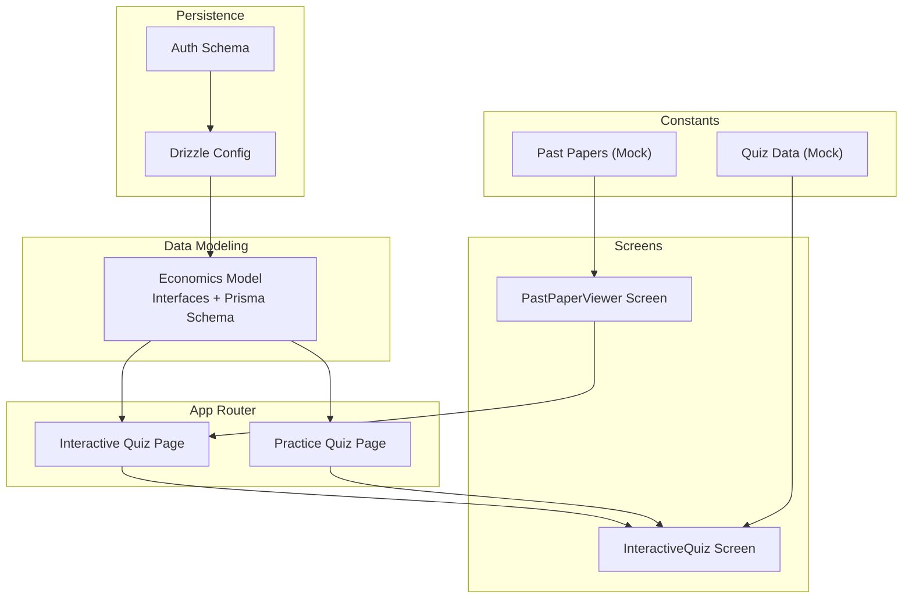
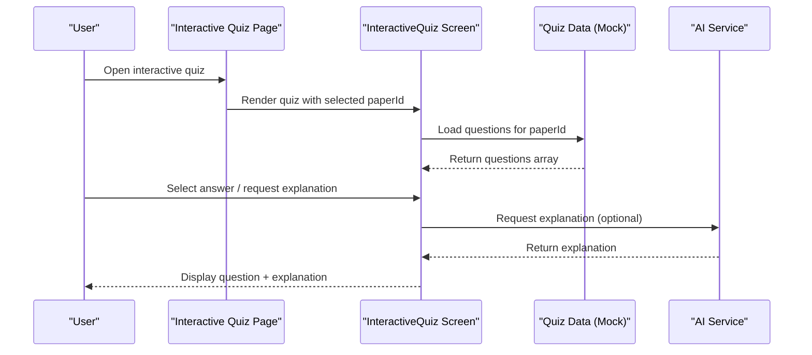
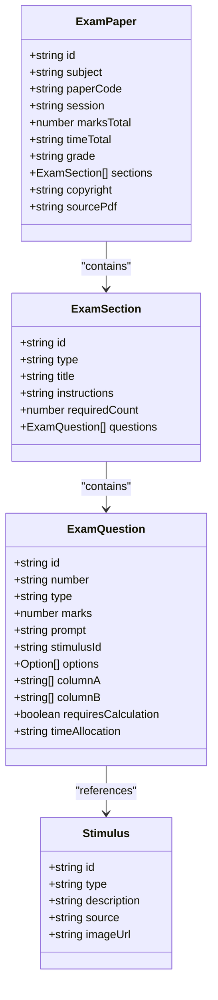
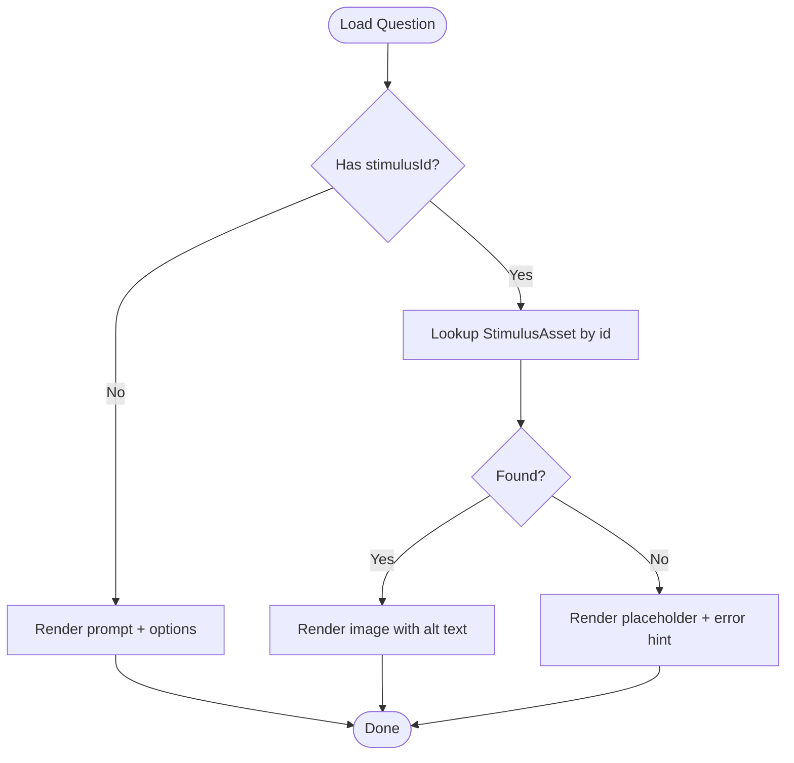
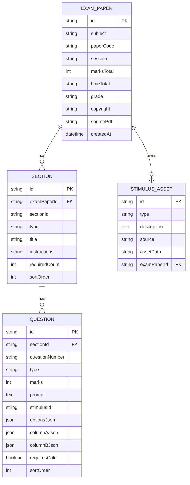
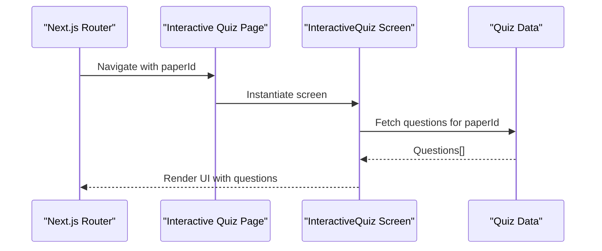
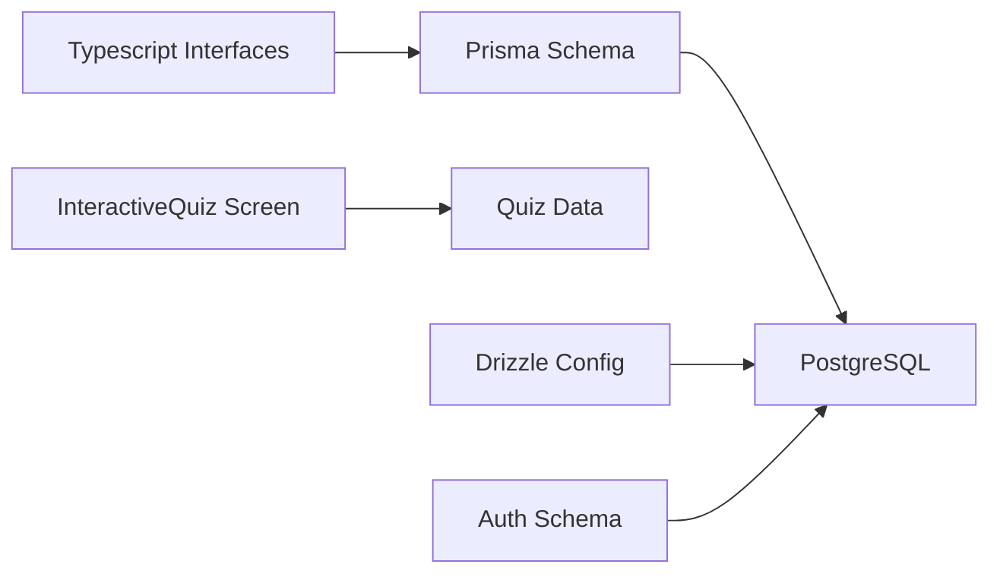

# Economics Model

<cite>
**Referenced Files in This Document**
- [economics_model.md](file://src/data_modeling/economics_model.md)
- [README.md](file://README.md)
- [drizzle.config.ts](file://drizzle.config.ts)
- [auth-schema.ts](file://auth-schema.ts)
- [mock-data.ts](file://src/constants/mock-data.ts)
- [quiz-data.ts](file://src/constants/quiz-data.ts)
- [InteractiveQuiz.tsx](file://src/screens/InteractiveQuiz.tsx)
- [PastPaperViewer.tsx](file://src/screens/PastPaperViewer.tsx)
- [page.tsx (Interactive Quiz)](file://src/app/interactive-quiz/page.tsx)
- [page.tsx (Practice Quiz)](file://src/app/practice-quiz/page.tsx)
</cite>

## Table of Contents
1. [Introduction](#introduction)
2. [Project Structure](#project-structure)
3. [Core Components](#core-components)
4. [Architecture Overview](#architecture-overview)
5. [Detailed Component Analysis](#detailed-component-analysis)
6. [Dependency Analysis](#dependency-analysis)
7. [Performance Considerations](#performance-considerations)
8. [Troubleshooting Guide](#troubleshooting-guide)
9. [Conclusion](#conclusion)
10. [Appendices](#appendices)

## Introduction
This document describes the Economics subject model used in MatricMaster AI. It covers the question structure for economic theory, mathematical applications, and case studies; metadata handling for economic indicators, market analysis, and policy evaluation questions; integration with economic data visualization and statistical analysis components; and the database schema supporting datasets, trend analysis, and comparative studies. It also provides implementation guidance for validating economic content and aligning curriculum content with South African economics standards.

## Project Structure
MatricMaster AI is a Next.js application with a modular structure. The Economics model is defined in a dedicated data modeling document and integrates with:
- TypeScript interfaces and Prisma schema for persistence
- UI screens for interactive quiz experiences
- Mock data and quiz datasets for content scaffolding
- Authentication and database configuration via Drizzle

**Diagram sources**
- [economics_model.md](file://src/data_modeling/economics_model.md#L15-L143)
- [page.tsx (Interactive Quiz)](file://src/app/interactive-quiz/page.tsx#L1-L23)
- [page.tsx (Practice Quiz)](file://src/app/practice-quiz/page.tsx#L1-L11)
- [InteractiveQuiz.tsx](file://src/screens/InteractiveQuiz.tsx#L105-L134)
- [PastPaperViewer.tsx](file://src/screens/PastPaperViewer.tsx#L65-L107)
- [drizzle.config.ts](file://drizzle.config.ts#L1-L16)
- [auth-schema.ts](file://auth-schema.ts#L1-L95)

**Section sources**
- [README.md](file://README.md#L88-L105)
- [drizzle.config.ts](file://drizzle.config.ts#L1-L16)

## Core Components
The Economics model centers on:
- Question types: multiple choice, matching, short answer, data response, essay, calculation
- Sections: compulsory and optional with required counts and instructions
- Stimulus assets: graphs, tables, cartoons, text extracts, and dialogues with accessibility metadata
- Full exam paper metadata: subject, paper code, session, total marks, total time, grade, and copyright

These components are defined in TypeScript interfaces and Prisma schema, enabling scalable storage and rendering of exam-style content.

**Section sources**
- [economics_model.md](file://src/data_modeling/economics_model.md#L15-L80)
- [economics_model.md](file://src/data_modeling/economics_model.md#L84-L143)

## Architecture Overview
The Economics model supports:
- Content ingestion from structured JSON datasets
- Dynamic rendering of questions and sections
- Stimulus asset linking and accessibility
- Optional integration with AI-powered explanations
- Scalable persistence via PostgreSQL using Drizzle

**Diagram sources**
- [page.tsx (Interactive Quiz)](file://src/app/interactive-quiz/page.tsx#L1-L23)
- [InteractiveQuiz.tsx](file://src/screens/InteractiveQuiz.tsx#L105-L134)
- [quiz-data.ts](file://src/constants/quiz-data.ts#L15-L313)

## Detailed Component Analysis

### Question Types and Structure
The model defines a rich set of question types suitable for economics:
- Multiple choice with labeled options
- Matching exercises with paired lists
- Short-answer prompts
- Data-response questions referencing stimulus assets
- Essay-type prompts
- Calculation-required questions

**Diagram sources**
- [economics_model.md](file://src/data_modeling/economics_model.md#L42-L79)
- [economics_model.md](file://src/data_modeling/economics_model.md#L33-L40)

**Section sources**
- [economics_model.md](file://src/data_modeling/economics_model.md#L15-L80)

### Stimulus Handling and Accessibility
Stimulus assets support:
- Graphs, tables, cartoons, text extracts, and dialogues
- Descriptive alt text for accessibility
- Optional source attribution
- Asset path linkage for rendering

**Diagram sources**
- [economics_model.md](file://src/data_modeling/economics_model.md#L33-L40)
- [economics_model.md](file://src/data_modeling/economics_model.md#L133-L142)

**Section sources**
- [economics_model.md](file://src/data_modeling/economics_model.md#L238-L280)

### Database Schema for Economics
The Prisma schema models:
- ExamPaper: paper metadata and sections
- Section: section-level metadata and ordering
- Question: question-level metadata and JSON fields for flexible options/columns
- StimulusAsset: linked to exam paper and stores asset metadata

**Diagram sources**
- [economics_model.md](file://src/data_modeling/economics_model.md#L86-L142)

**Section sources**
- [economics_model.md](file://src/data_modeling/economics_model.md#L84-L143)

### UI Integration and Rendering
- Interactive quiz page loads the InteractiveQuiz screen and passes paperId via URL params
- The screen loads questions from mock data and renders them dynamically
- PastPaperViewer integrates with interactive quiz conversion

**Diagram sources**
- [page.tsx (Interactive Quiz)](file://src/app/interactive-quiz/page.tsx#L1-L23)
- [InteractiveQuiz.tsx](file://src/screens/InteractiveQuiz.tsx#L105-L134)
- [quiz-data.ts](file://src/constants/quiz-data.ts#L15-L313)

**Section sources**
- [page.tsx (Interactive Quiz)](file://src/app/interactive-quiz/page.tsx#L1-L23)
- [InteractiveQuiz.tsx](file://src/screens/InteractiveQuiz.tsx#L105-L134)
- [quiz-data.ts](file://src/constants/quiz-data.ts#L15-L313)

### Examples by Economic Domain
- Microeconomics: multiple choice on consumer behavior, matching economic flows, short answer on marginal propensities
- Macroeconomics: data-response questions on cartoons/tables, essay-style prompts on policy impacts
- Econometrics: calculation-required questions, data-response with statistical interpretation

These formats are supported by the question type definitions and sample dataset structure.

**Section sources**
- [economics_model.md](file://src/data_modeling/economics_model.md#L147-L234)

## Dependency Analysis
- TypeScript interfaces depend on Prisma schema for persistence
- UI screens depend on mock data for content
- Drizzle configuration connects to PostgreSQL
- Authentication schema provides user/session/account relations

**Diagram sources**
- [economics_model.md](file://src/data_modeling/economics_model.md#L15-L143)
- [drizzle.config.ts](file://drizzle.config.ts#L1-L16)
- [auth-schema.ts](file://auth-schema.ts#L1-L95)

**Section sources**
- [drizzle.config.ts](file://drizzle.config.ts#L1-L16)
- [auth-schema.ts](file://auth-schema.ts#L1-L95)

## Performance Considerations
- Use JSON fields for flexible question options/columns to avoid schema churn
- Index sectionId and sortOrder for efficient question retrieval
- Lazy-load stimulus assets and use Next.js Image for optimization
- Paginate or split large sections to improve render performance
- Cache frequently accessed datasets and leverage browser caching for static assets

## Troubleshooting Guide
- Stimulus not rendering: verify stimulusId exists and assetPath is correct; ensure alt text is present for accessibility
- Questions not appearing: confirm paperId matches mock data keys and UI filters by selected subject
- Database seeding: ensure DATABASE_URL is configured and run the appropriate seed command
- Authentication errors: check provider credentials and session/user relations

**Section sources**
- [economics_model.md](file://src/data_modeling/economics_model.md#L238-L280)
- [drizzle.config.ts](file://drizzle.config.ts#L1-L16)
- [auth-schema.ts](file://auth-schema.ts#L1-L95)

## Conclusion
The Economics model provides a robust, extensible framework for representing exam-style economic content, integrating metadata-rich stimuli, and supporting dynamic rendering and persistence. By leveraging TypeScript interfaces, Prisma schema, and Next.js components, the system enables scalable content delivery, accessibility, and alignment with South African curriculum standards.

## Appendices

### Implementation Guidance for Economic Content Validation
- Validate question types against CAPS syllabi and NSC guidelines
- Cross-check stimulus data with official sources and include proper attribution
- Ensure accessibility compliance with alt text and semantic labeling
- Implement curriculum tagging (e.g., grade, language, difficulty) for scalability

### Curriculum Alignment with South African Standards
- Align question topics with CAPS Economics curriculum outcomes
- Include localized examples and references to South African institutions (e.g., statistics, central bank)
- Provide multilingual support where applicable and maintain consistent terminology