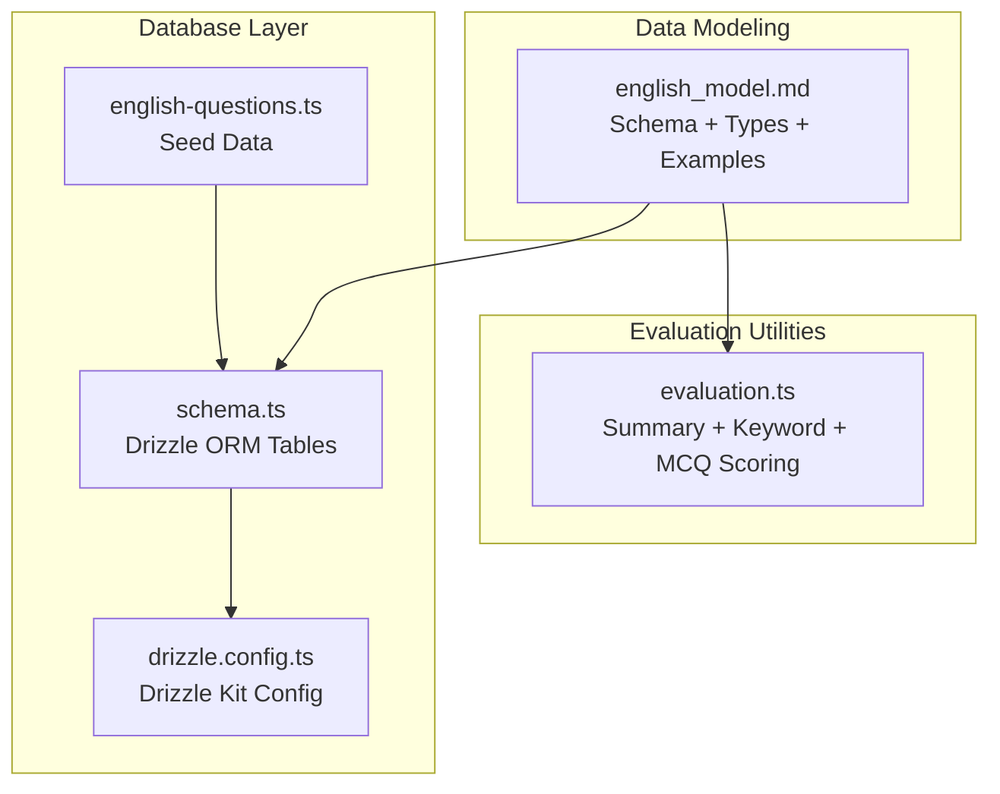
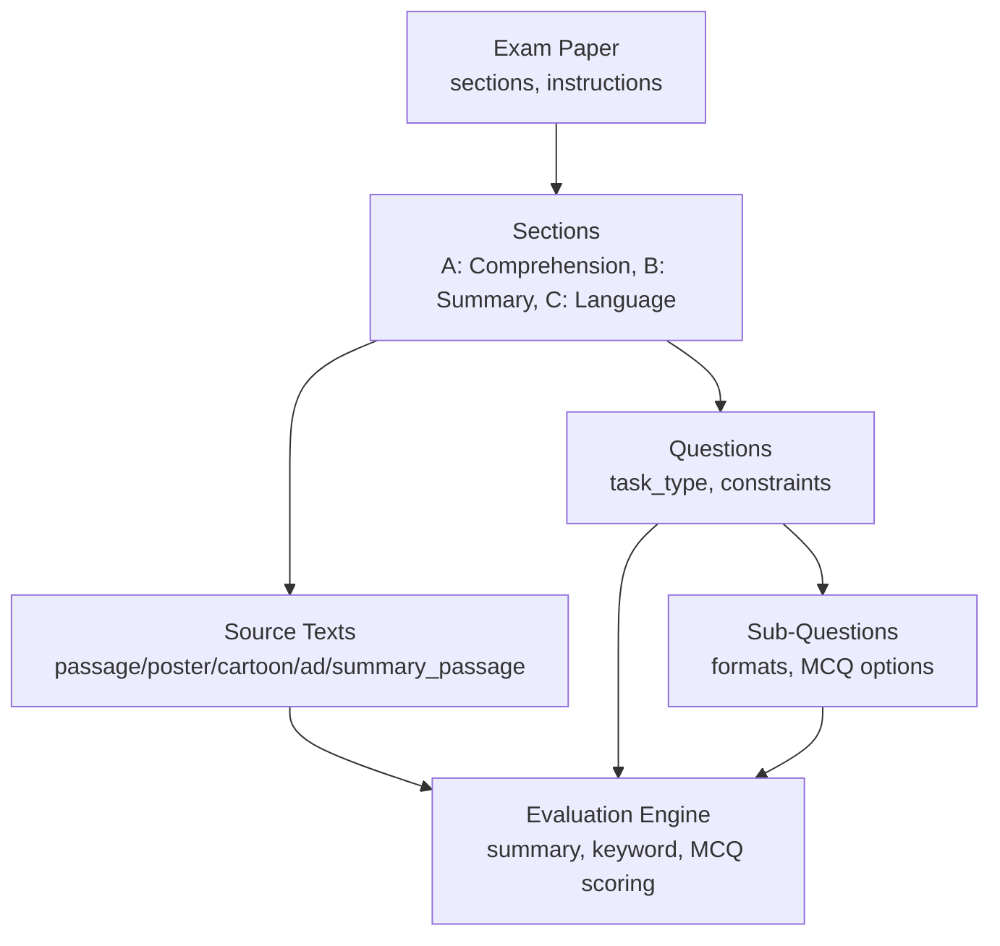
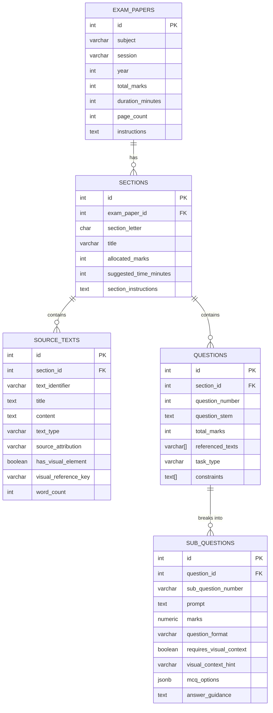
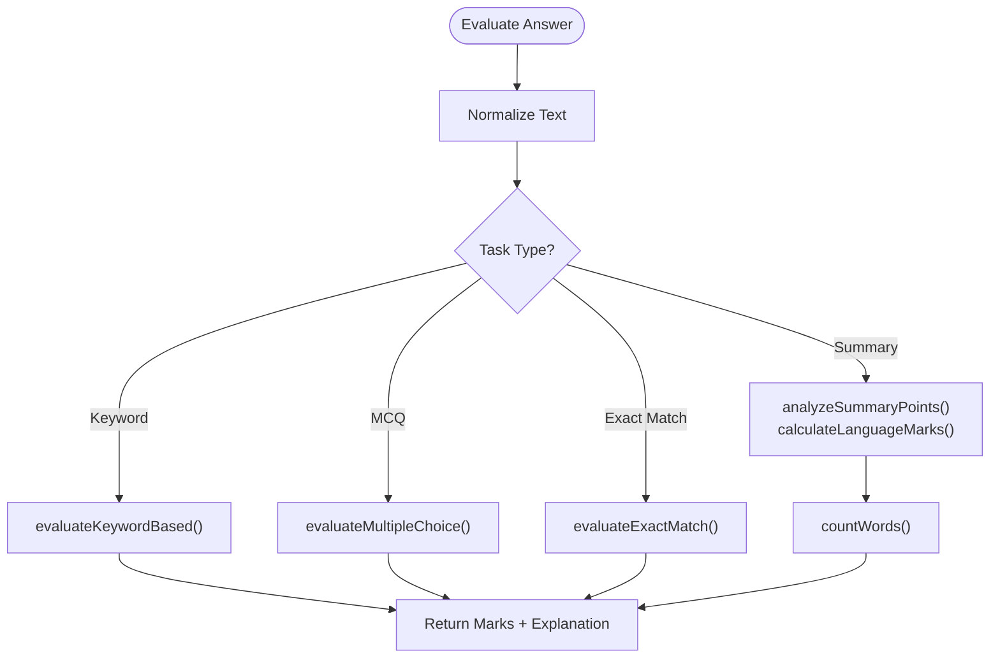
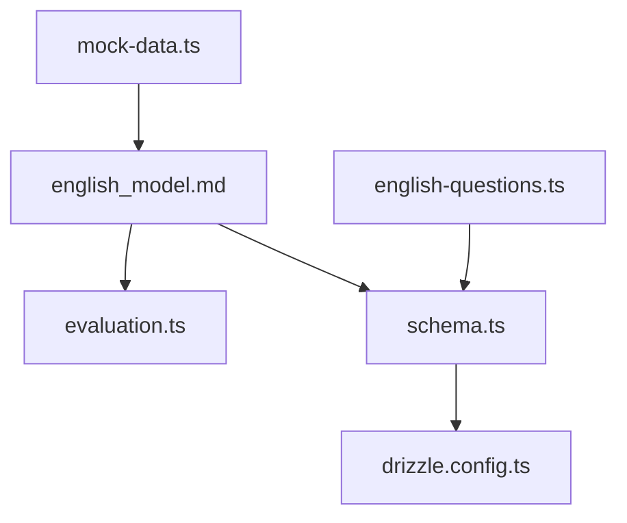

# English Model

<cite>
**Referenced Files in This Document**
- [english_model.md](file://src/data_modeling/english_model.md)
- [evaluation.ts](file://src/types/evaluation.ts)
- [schema.ts](file://src/lib/db/schema.ts)
- [drizzle.config.ts](file://drizzle.config.ts)
- [english-questions.ts](file://src/lib/db/seed/english-questions.ts)
- [mock-data.ts](file://src/constants/mock-data.ts)
</cite>

## Table of Contents
1. [Introduction](#introduction)
2. [Project Structure](#project-structure)
3. [Core Components](#core-components)
4. [Architecture Overview](#architecture-overview)
5. [Detailed Component Analysis](#detailed-component-analysis)
6. [Dependency Analysis](#dependency-analysis)
7. [Performance Considerations](#performance-considerations)
8. [Troubleshooting Guide](#troubleshooting-guide)
9. [Conclusion](#conclusion)
10. [Appendices](#appendices)

## Introduction
This document provides a comprehensive data modeling guide for MatricMaster AI’s English subject model. It focuses on structuring assessment content for literature analysis, grammar, composition, and comprehension, alongside metadata for literary works, authors, and stylistic elements. It also explains integration with reading comprehension passages, writing assessment criteria, and literary device identification. The guide includes examples of poetry analysis, prose interpretation, and creative writing prompts, along with the database schema for textual analysis, annotation systems, and multimedia content integration. Finally, it offers implementation guidance for English-specific content validation, plagiarism detection integration, and multilingual support considerations.

## Project Structure
MatricMaster AI organizes English assessment data across three primary areas:
- Data modeling specification for exam-style assessments
- Evaluation utilities for automated scoring and feedback
- Database schema and seed data for question bank and subjects

**Diagram sources**
- [english_model.md](file://src/data_modeling/english_model.md#L7-L85)
- [evaluation.ts](file://src/types/evaluation.ts#L1-L421)
- [schema.ts](file://src/lib/db/schema.ts#L1-L160)
- [drizzle.config.ts](file://drizzle.config.ts#L1-L16)
- [english-questions.ts](file://src/lib/db/seed/english-questions.ts#L1-L124)

**Section sources**
- [english_model.md](file://src/data_modeling/english_model.md#L1-L474)
- [evaluation.ts](file://src/types/evaluation.ts#L1-L421)
- [schema.ts](file://src/lib/db/schema.ts#L1-L160)
- [drizzle.config.ts](file://drizzle.config.ts#L1-L16)
- [english-questions.ts](file://src/lib/db/seed/english-questions.ts#L1-L124)

## Core Components
- Database schema for exam papers, sections, source texts, questions, and sub-questions
- TypeScript interfaces for structured English assessments
- Seed data for English questions covering poetry, drama, grammar, and writing topics
- Evaluation utilities for summary scoring, keyword matching, and multiple-choice grading

Key capabilities:
- Multimodal content handling for posters, cartoons, advertisements, and passages
- Granular question formats (short answer, multiple choice, rewrite sentence, justify response, identify technique)
- Automated summary evaluation with content and language marks
- Plausibility checks for word limits and point counts

**Section sources**
- [english_model.md](file://src/data_modeling/english_model.md#L7-L85)
- [evaluation.ts](file://src/types/evaluation.ts#L191-L248)
- [english-questions.ts](file://src/lib/db/seed/english-questions.ts#L1-L124)

## Architecture Overview
The English model integrates data modeling, evaluation logic, and database storage to support:
- Reading comprehension with multimodal stimuli
- Literary analysis tasks (poetry, drama)
- Grammar and vocabulary exercises
- Composition tasks with rubrics and constraints
- Multimedia asset linkage for cartoons and posters

**Diagram sources**
- [english_model.md](file://src/data_modeling/english_model.md#L11-L84)
- [evaluation.ts](file://src/types/evaluation.ts#L191-L248)

## Detailed Component Analysis

### Database Schema for English Assessments
The schema defines core entities for English assessments:
- Exam papers with subject, session, year, total marks, duration, and instructions
- Sections A/B/C with allocated marks and suggested time
- Source texts supporting multiple media types and optional visual references
- Questions with task types and constraints
- Sub-questions with formats, visual context hints, and MCQ options

**Diagram sources**
- [english_model.md](file://src/data_modeling/english_model.md#L11-L84)

**Section sources**
- [english_model.md](file://src/data_modeling/english_model.md#L7-L85)

### TypeScript Interfaces for English Assessments
The TypeScript interfaces formalize the structure of English assessments:
- SectionLetter, TextType, TaskType, QuestionFormat enums
- SourceText with multimodal support
- SubQuestion with language-specific features
- Question with pedagogical metadata
- EnglishExamPaper with sections A/B/C
- Specialized interfaces for summary and cartoon analysis

These types align with the database schema and enable robust front-end and back-end implementations.

**Section sources**
- [english_model.md](file://src/data_modeling/english_model.md#L89-L192)

### Evaluation Utilities for Writing and Language Tasks
The evaluation module provides:
- Summary evaluation with content and language marks, including verbatim quoting penalties
- Keyword-based scoring for targeted language skills
- Multiple-choice scoring with flexible matching
- Word counting and normalization helpers

**Diagram sources**
- [evaluation.ts](file://src/types/evaluation.ts#L34-L80)
- [evaluation.ts](file://src/types/evaluation.ts#L144-L186)
- [evaluation.ts](file://src/types/evaluation.ts#L332-L378)
- [evaluation.ts](file://src/types/evaluation.ts#L383-L410)
- [evaluation.ts](file://src/types/evaluation.ts#L260-L314)
- [evaluation.ts](file://src/types/evaluation.ts#L415-L420)

**Section sources**
- [evaluation.ts](file://src/types/evaluation.ts#L1-L421)

### Seed Data for English Question Bank
The English question seed covers:
- Poetry analysis (e.g., symbolism in a specific poem)
- Language structures (e.g., subject-verb agreement)
- Advertisement analysis (e.g., rhetorical appeal)
- Drama analysis (e.g., character motivation)
- Writing techniques (e.g., essay introductions)

These items demonstrate how the schema and evaluation utilities can be applied to real assessments.

**Section sources**
- [english-questions.ts](file://src/lib/db/seed/english-questions.ts#L1-L124)

### Multimodal Content Handling and Asset Integration
The English model supports multimodal content:
- Visual asset resolution via reference keys
- Carousel-based cartoon frame viewing
- Alt-text and text-only fallbacks for accessibility
- Constraints for word limits and paragraph formatting

Implementation tips include:
- Maintain a visual asset library keyed by visual_reference_key
- Provide “Show Frame Description” toggles for remote learners
- Include drag-and-drop point builders for summaries
- Enable grammar highlighting prior to rewriting

**Section sources**
- [english_model.md](file://src/data_modeling/english_model.md#L367-L472)

### Examples of Assessments
- Poetry analysis: Symbolism identification and thematic interpretation
- Prose interpretation: Cartoons and posters with visual context
- Creative writing prompts: Persuasive essay introductions and summary constraints

These examples illustrate how the schema and evaluation utilities can be combined to deliver coherent assessments.

**Section sources**
- [english_model.md](file://src/data_modeling/english_model.md#L196-L363)
- [english-questions.ts](file://src/lib/db/seed/english-questions.ts#L1-L124)

## Dependency Analysis
The English model depends on:
- Drizzle ORM for database abstraction and migrations
- Evaluation utilities for scoring logic
- Seed data for question bank initialization
- Mock data for subject listings and past papers

**Diagram sources**
- [english_model.md](file://src/data_modeling/english_model.md#L1-L474)
- [evaluation.ts](file://src/types/evaluation.ts#L1-L421)
- [schema.ts](file://src/lib/db/schema.ts#L1-L160)
- [drizzle.config.ts](file://drizzle.config.ts#L1-L16)
- [english-questions.ts](file://src/lib/db/seed/english-questions.ts#L1-L124)
- [mock-data.ts](file://src/constants/mock-data.ts#L140-L168)

**Section sources**
- [schema.ts](file://src/lib/db/schema.ts#L1-L160)
- [drizzle.config.ts](file://drizzle.config.ts#L1-L16)
- [mock-data.ts](file://src/constants/mock-data.ts#L140-L168)

## Performance Considerations
- Normalize text efficiently before matching to reduce computational overhead
- Index database columns frequently queried (e.g., subject_id, grade_level, topic)
- Limit keyword extraction to meaningful terms and avoid stop words
- Cache visual assets and provide fallbacks to minimize latency
- Use pagination for large question banks and seed datasets

## Troubleshooting Guide
Common issues and resolutions:
- Summary scoring anomalies: Verify word count thresholds and point counts; ensure verbatim quoting penalties are applied
- Keyword matching failures: Confirm case sensitivity and partial match options; adjust required keyword thresholds
- MCQ scoring mismatches: Check accepted answer formats (letter vs. text) and normalization rules
- Visual asset resolution errors: Validate visual_reference_key values and fallback mechanisms
- Database migration failures: Ensure DATABASE_URL is configured and Drizzle Kit settings are correct

**Section sources**
- [evaluation.ts](file://src/types/evaluation.ts#L260-L314)
- [evaluation.ts](file://src/types/evaluation.ts#L332-L378)
- [evaluation.ts](file://src/types/evaluation.ts#L383-L410)
- [drizzle.config.ts](file://drizzle.config.ts#L1-L16)

## Conclusion
MatricMaster AI’s English model provides a robust, extensible framework for structuring assessments across comprehension, literary analysis, grammar, and composition. Its schema supports multimodal content and granular question formats, while evaluation utilities automate scoring with clear explanations. By integrating seed data, database abstractions, and accessibility-focused asset handling, the model enables scalable delivery of English assessments aligned with curriculum standards.

## Appendices

### Implementation Guidance for English-Specific Workflows
- Content validation: Enforce word limits and paragraph formatting for summaries; validate point counts and verbatim quoting policies
- Plagiarism detection: Integrate external tools to flag potential matches against reference texts; flag verbatim quotes and suggest paraphrasing
- Multilingual support: Add locale-aware normalization and keyword extraction; localize MCQ options and instructions; provide translated alt-texts for visuals

### Example Assessment Types
- Poetry analysis: Identify literary devices and interpret themes
- Prose interpretation: Analyze cartoons and posters with visual context
- Creative writing: Summarize and compose within strict constraints

[No sources needed since this section provides general guidance]