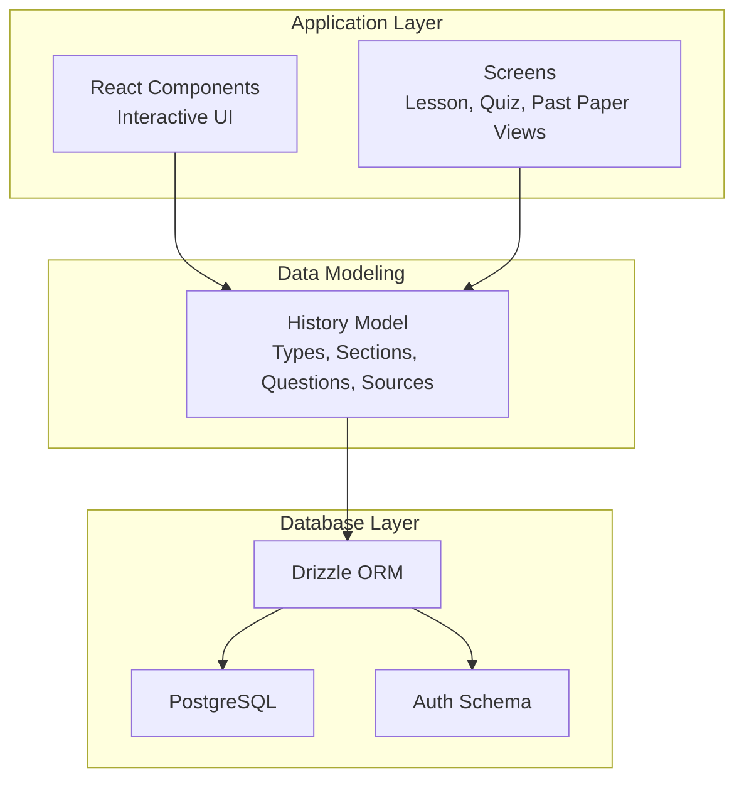
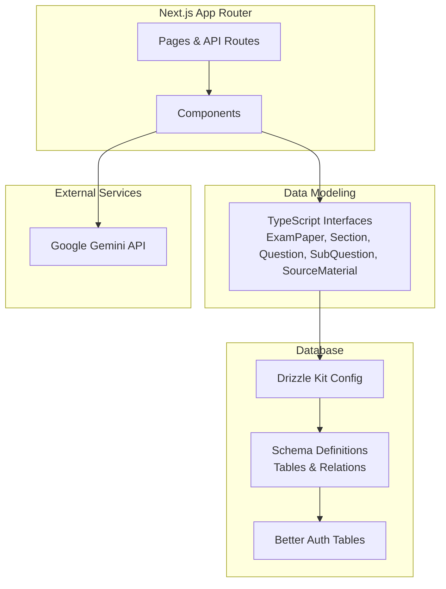
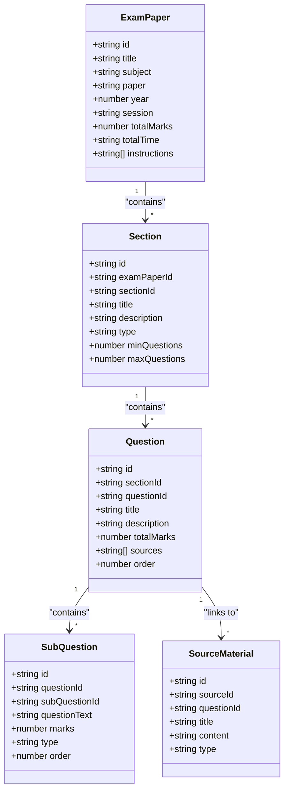
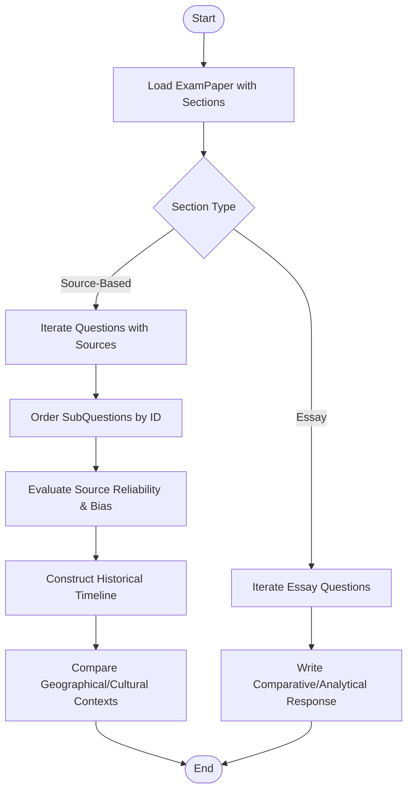
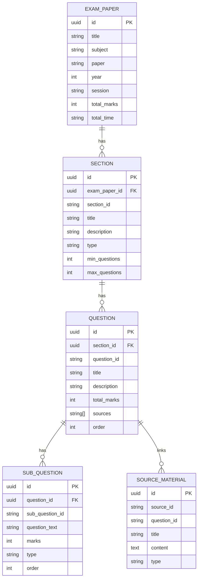
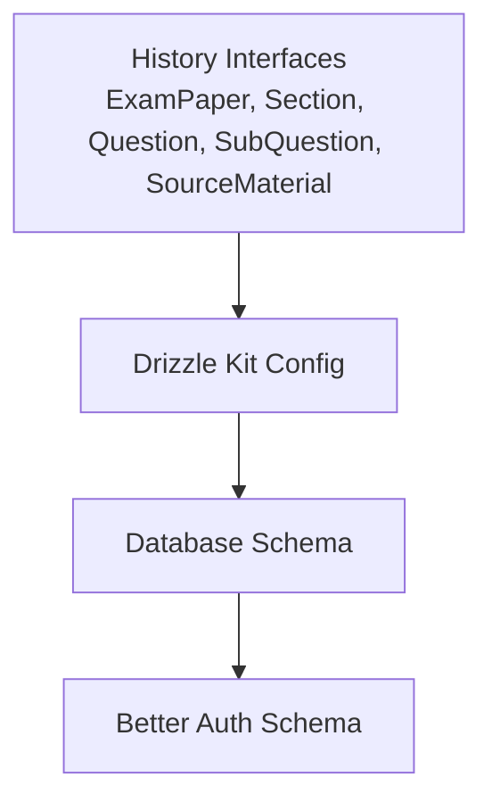

# History Model

<cite>
**Referenced Files in This Document**
- [history_model.md](file://src/data_modeling/history_model.md)
- [README.md](file://README.md)
- [drizzle.config.ts](file://drizzle.config.ts)
- [auth-schema.ts](file://auth-schema.ts)
- [schema.ts](file://src/lib/db/schema.ts)
- [mock-data.ts](file://src/constants/mock-data.ts)
- [quiz-data.ts](file://src/constants/quiz-data.ts)
</cite>

## Table of Contents
1. [Introduction](#introduction)
2. [Project Structure](#project-structure)
3. [Core Components](#core-components)
4. [Architecture Overview](#architecture-overview)
5. [Detailed Component Analysis](#detailed-component-analysis)
6. [Dependency Analysis](#dependency-analysis)
7. [Performance Considerations](#performance-considerations)
8. [Troubleshooting Guide](#troubleshooting-guide)
9. [Conclusion](#conclusion)
10. [Appendices](#appendices)

## Introduction
This document provides comprehensive data modeling documentation for the History subject model used in MatricMaster AI. It details the question structure for historical analysis, timeline construction, and source evaluation. It also documents metadata handling for historical periods, geographical contexts, and cultural movements, and explains integrations with historical artifact analysis, primary source interpretation, and comparative historical studies. Examples of question formats are included for ancient civilizations, colonial periods, and the modern era. The database schema for handling historical chronologies, map integration, and multimedia historical content is documented, along with implementation guidance for validating historical accuracy, detecting bias, and aligning content with South African history standards.

## Project Structure
MatricMaster AI is a Next.js application with a modular structure supporting interactive learning, AI-powered explanations, and past-paper practice. The History model is defined in a dedicated data modeling document and integrated with the application’s database schema and UI components.

**Diagram sources**
- [history_model.md](file://src/data_modeling/history_model.md#L3-L54)
- [drizzle.config.ts](file://drizzle.config.ts#L1-L16)
- [auth-schema.ts](file://auth-schema.ts#L1-L95)
- [schema.ts](file://src/lib/db/schema.ts#L1-L160)

**Section sources**
- [README.md](file://README.md#L88-L105)
- [history_model.md](file://src/data_modeling/history_model.md#L3-L54)

## Core Components
The History model defines a hierarchical structure for organizing historical assessments:

- ExamPaper: Top-level assessment container with metadata (title, subject, paper, year, session, total marks/time, instructions).
- Section: Divided into source-based and essay sections with min/max question constraints.
- Question: Main questions with titles, descriptions, total marks, optional source identifiers, and ordered sub-questions.
- SubQuestion: Granular tasks with identifiers, text, marks, and question type (short, comment, explain, quote, define).
- SourceMaterial: Primary source content linked to questions by source identifiers.

These components enable structured historical analysis, timeline construction, and comparative studies through ordered sub-questions and source-linked materials.

**Section sources**
- [history_model.md](file://src/data_modeling/history_model.md#L3-L54)
- [history_model.md](file://src/data_modeling/history_model.md#L467-L564)

## Architecture Overview
The History model integrates with the broader MatricMaster AI architecture via typed interfaces and a relational database schema. The application uses Next.js with Drizzle ORM and PostgreSQL for persistence. Authentication is handled by Better Auth, and the database schema includes user, session, and account tables.

**Diagram sources**
- [history_model.md](file://src/data_modeling/history_model.md#L3-L54)
- [drizzle.config.ts](file://drizzle.config.ts#L1-L16)
- [schema.ts](file://src/lib/db/schema.ts#L1-L160)
- [auth-schema.ts](file://auth-schema.ts#L1-L95)
- [README.md](file://README.md#L23-L30)

## Detailed Component Analysis

### Data Model Classes
The History model employs a set of TypeScript interfaces that map directly to database entities. These interfaces define the structure for exam papers, sections, questions, sub-questions, and source materials.

**Diagram sources**
- [history_model.md](file://src/data_modeling/history_model.md#L3-L54)
- [history_model.md](file://src/data_modeling/history_model.md#L467-L564)

**Section sources**
- [history_model.md](file://src/data_modeling/history_model.md#L3-L54)
- [history_model.md](file://src/data_modeling/history_model.md#L467-L564)

### Question Structure and Timeline Construction
The model supports timeline construction and comparative analysis through:
- Ordered sections (source-based and essay) enabling structured progression.
- Hierarchical sub-questions that guide learners through primary source interpretation, contextualization, and synthesis.
- Source identifiers linking questions to primary materials for artifact analysis.

**Diagram sources**
- [history_model.md](file://src/data_modeling/history_model.md#L24-L45)
- [history_model.md](file://src/data_modeling/history_model.md#L15-L53)

**Section sources**
- [history_model.md](file://src/data_modeling/history_model.md#L24-L45)
- [history_model.md](file://src/data_modeling/history_model.md#L15-L53)

### Database Schema for Historical Chronologies, Maps, and Multimedia
The database schema supports historical chronologies, geographical contexts, and multimedia content:

- Chronologies: Questions and sub-questions include ordering fields to represent temporal sequences.
- Geographical Contexts: SourceMaterial entries can include titles and content suitable for map-based analysis.
- Multimedia Content: SourceMaterial.type supports categorization of textual, cartoon, speech, and document sources.

**Diagram sources**
- [history_model.md](file://src/data_modeling/history_model.md#L467-L564)
- [schema.ts](file://src/lib/db/schema.ts#L1-L160)

**Section sources**
- [history_model.md](file://src/data_modeling/history_model.md#L467-L564)
- [schema.ts](file://src/lib/db/schema.ts#L1-L160)

### Implementation Guidance: Historical Accuracy Validation, Bias Detection, and Curriculum Alignment
- Historical Accuracy Validation:
  - Cross-reference sub-question types (explain, comment) with canonical historical narratives.
  - Use SourceMaterial.type to ensure variety of primary sources (text, cartoon, speech, document).
  - Include explicit instructions requiring evidence-based reasoning aligned with curriculum outcomes.

- Bias Detection:
  - Encourage learners to evaluate source provenance and authorship.
  - Provide rubrics for identifying political, ideological, or cultural biases in sources.
  - Use comparative sub-questions (e.g., “How does Source X compare with Source Y?”) to surface discrepancies.

- Curriculum Alignment with South African History Standards:
  - Align question topics with the National Curriculum Statement (CAPS) for History.
  - Incorporate case studies relevant to South African history (e.g., independence struggles, post-apartheid developments).
  - Ensure chronological coverage spans prehistoric periods, ancient civilizations, colonialism, and modern era.

**Section sources**
- [history_model.md](file://src/data_modeling/history_model.md#L69-L74)
- [history_model.md](file://src/data_modeling/history_model.md#L84-L462)

### Examples of Question Formats
- Ancient Civilizations:
  - Topic: Origins of early states and trade networks.
  - Question type: Explain, Comment.
  - Example prompt: “Explain how the development of writing systems influenced governance in ancient Mesopotamia.”

- Colonial Periods:
  - Topic: Impact of European colonization on indigenous societies.
  - Question type: Define, Quote, Explain.
  - Example prompt: “Define the term ‘indigenous resistance’ and quote evidence from Source A to illustrate this concept.”

- Modern Era:
  - Topic: Decolonization and nation-building in Africa.
  - Question type: Comment, Explain.
  - Example prompt: “Comment on how the Cold War influenced independence movements in Angola.”

**Section sources**
- [history_model.md](file://src/data_modeling/history_model.md#L84-L462)

## Dependency Analysis
The History model interacts with the application’s database and authentication layers. The following diagram illustrates these dependencies:

**Diagram sources**
- [history_model.md](file://src/data_modeling/history_model.md#L3-L54)
- [drizzle.config.ts](file://drizzle.config.ts#L1-L16)
- [schema.ts](file://src/lib/db/schema.ts#L1-L160)
- [auth-schema.ts](file://auth-schema.ts#L1-L95)

**Section sources**
- [drizzle.config.ts](file://drizzle.config.ts#L1-L16)
- [schema.ts](file://src/lib/db/schema.ts#L1-L160)
- [auth-schema.ts](file://auth-schema.ts#L1-L95)

## Performance Considerations
- Indexing: Ensure database indices on foreign keys (e.g., examPaperId, sectionId, questionId) and frequently queried fields (e.g., order) to optimize joins and sorting.
- Pagination: For large datasets, paginate section and question retrieval to avoid heavy payloads.
- Caching: Cache frequently accessed exam papers and sections to reduce database load.
- Query Optimization: Use selective includes to fetch only required relations (sections.questions.subQuestions) to minimize data transfer.

[No sources needed since this section provides general guidance]

## Troubleshooting Guide
- Database Connectivity:
  - Verify DATABASE_URL environment variable and network access.
  - Confirm migrations are applied and schema matches expectations.

- Authentication Issues:
  - Ensure Better Auth tables are present and relations are correctly defined.
  - Check user/session/account linkage for proper authorization.

- Data Integrity:
  - Validate unique constraints for composite keys (e.g., (examPaperId, sectionId), (questionId, subQuestionId)).
  - Confirm ordering fields (order) are consistently maintained across updates.

**Section sources**
- [schema.ts](file://src/lib/db/schema.ts#L1-L160)
- [auth-schema.ts](file://auth-schema.ts#L1-L95)

## Conclusion
The History model in MatricMaster AI provides a robust framework for structuring historical assessments, integrating primary sources, and guiding learners through analytical and comparative historical tasks. Its relational database schema supports chronological and geographical contexts, while the typed interfaces ensure consistency across the application. By aligning content with curriculum standards and implementing rigorous validation and bias detection practices, the model supports accurate, fair, and educationally sound historical learning experiences.

[No sources needed since this section summarizes without analyzing specific files]

## Appendices

### Appendix A: Example Question Categories
- Ancient Civilizations: Origins, governance, trade.
- Colonial Periods: Resistance, administration, economy.
- Modern Era: Independence, decolonization, nation-building.

**Section sources**
- [history_model.md](file://src/data_modeling/history_model.md#L84-L462)

### Appendix B: Related Application Data Models
- Quiz system data model for comparison and integration.
- Mock data for subjects and past papers.

**Section sources**
- [quiz-data.ts](file://src/constants/quiz-data.ts#L1-L313)
- [mock-data.ts](file://src/constants/mock-data.ts#L1-L285)