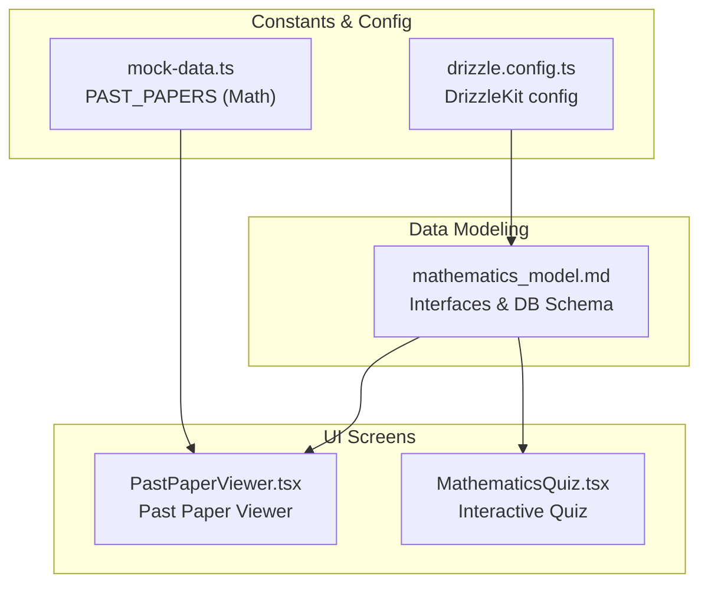
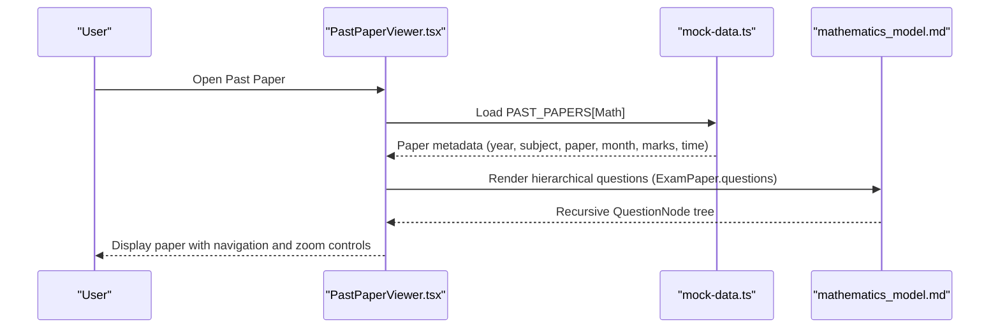
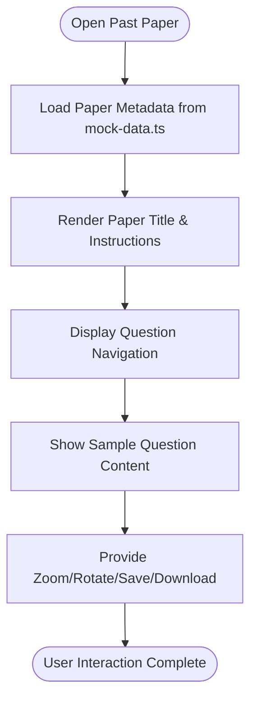
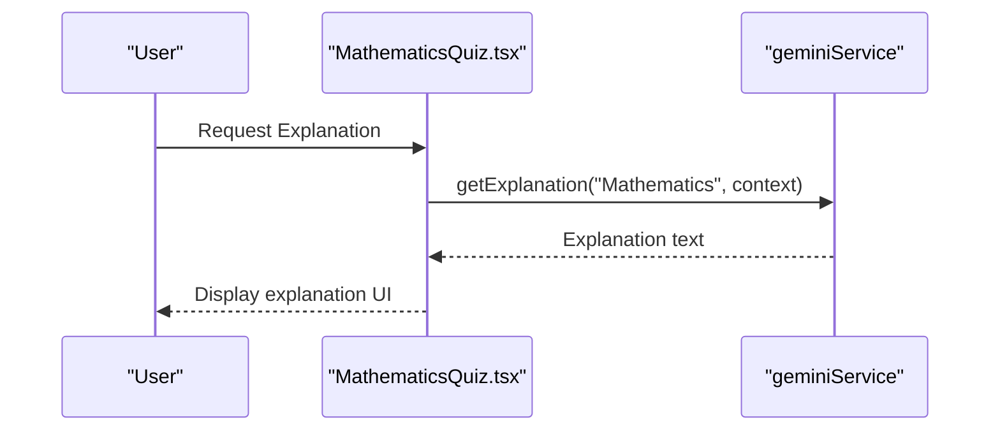
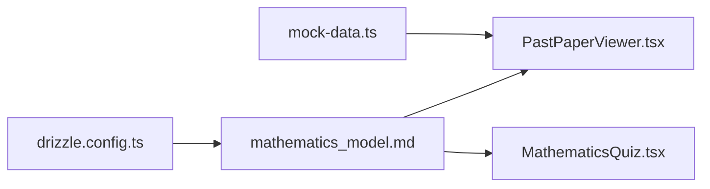

# Mathematics Model

<cite>
**Referenced Files in This Document**
- [mathematics_model.md](file://src/data_modeling/mathematics_model.md)
- [PastPaperViewer.tsx](file://src/screens/PastPaperViewer.tsx)
- [MathematicsQuiz.tsx](file://src/screens/MathematicsQuiz.tsx)
- [mock-data.ts](file://src/constants/mock-data.ts)
- [drizzle.config.ts](file://drizzle.config.ts)
</cite>

## Table of Contents
1. [Introduction](#introduction)
2. [Project Structure](#project-structure)
3. [Core Components](#core-components)
4. [Architecture Overview](#architecture-overview)
5. [Detailed Component Analysis](#detailed-component-analysis)
6. [Dependency Analysis](#dependency-analysis)
7. [Performance Considerations](#performance-considerations)
8. [Troubleshooting Guide](#troubleshooting-guide)
9. [Conclusion](#conclusion)
10. [Appendices](#appendices)

## Introduction
This document describes the Mathematics subject model used in MatricMaster AI. It focuses on:
- The recursive question structure with hierarchical IDs, marks allocation, and nested question formats
- The ExamPaper interface with metadata including exam type, year, session, and total marks
- The DbQuestionItem structure for database normalization with parent-child relationships and depth indexing
- Implementation examples for question extraction, LaTeX rendering integration, and mobile optimization strategies
- Curriculum alignment with South African Senior Certificate (NSC) Mathematics standards
- Guidance for content validation and quality assurance processes

## Project Structure
The Mathematics model is defined in a dedicated data modeling document and integrated into UI screens for viewing and interacting with past papers and quizzes. Supporting constants and configuration provide realistic mock data and database tooling.

**Diagram sources**
- [mathematics_model.md](file://src/data_modeling/mathematics_model.md#L5-L57)
- [PastPaperViewer.tsx](file://src/screens/PastPaperViewer.tsx#L1-L281)
- [MathematicsQuiz.tsx](file://src/screens/MathematicsQuiz.tsx#L1-L283)
- [mock-data.ts](file://src/constants/mock-data.ts#L120-L138)
- [drizzle.config.ts](file://drizzle.config.ts#L1-L16)

**Section sources**
- [mathematics_model.md](file://src/data_modeling/mathematics_model.md#L1-L212)
- [PastPaperViewer.tsx](file://src/screens/PastPaperViewer.tsx#L1-L281)
- [MathematicsQuiz.tsx](file://src/screens/MathematicsQuiz.tsx#L1-L283)
- [mock-data.ts](file://src/constants/mock-data.ts#L1-L285)
- [drizzle.config.ts](file://drizzle.config.ts#L1-L16)

## Core Components
This section documents the core data structures and their roles in representing Mathematics exam content.

- ExamMetadata: Captures paper-level metadata such as exam type, year, session, total marks, time, subject, paper number, and confidentiality.
- QuestionNode: A recursive structure supporting arbitrary nesting of questions, parts, and subparts. Marks are allocated only on leaf nodes, and metadata can capture diagram requirements and rounding instructions.
- ExamPaper: Aggregates metadata, a hierarchical array of questions, optional information sheet, extraction timestamp, and source file identifier.
- DbQuestionItem: Normalized database representation enabling efficient querying, filtering, and navigation via hierarchicalId, parentId, depth, and orderIndex.

These structures enable:
- Hierarchical rendering of Mathematics exam questions
- Efficient database queries by paper, depth, and ordering
- Scalable storage and retrieval of question content

**Section sources**
- [mathematics_model.md](file://src/data_modeling/mathematics_model.md#L9-L43)
- [mathematics_model.md](file://src/data_modeling/mathematics_model.md#L46-L56)

## Architecture Overview
The Mathematics model integrates UI screens with the data structures and database schema recommendations.

**Diagram sources**
- [PastPaperViewer.tsx](file://src/screens/PastPaperViewer.tsx#L35-L51)
- [mock-data.ts](file://src/constants/mock-data.ts#L120-L138)
- [mathematics_model.md](file://src/data_modeling/mathematics_model.md#L22-L43)

## Detailed Component Analysis

### ExamPaper and ExamMetadata
- Purpose: Define the canonical representation of a Mathematics exam paper, including metadata and the hierarchical question tree.
- Key fields:
  - id: Unique slug-style identifier for the paper
  - title, examType, year, session, totalMarks, timeHours, subject, paperNumber, confidentiality
  - questions: Array of QuestionNode forming the paper’s structure
  - informationSheet: Optional LaTeX-formatted formula sheet
  - extractedAt, sourceFile: Provenance and extraction details

Implementation guidance:
- Use clean, validated LaTeX-ready text for question text and informationSheet
- Store only curated, sanitized content to avoid rendering issues

**Section sources**
- [mathematics_model.md](file://src/data_modeling/mathematics_model.md#L9-L43)

### Recursive QuestionNode Structure
- Purpose: Represent nested Mathematics questions with precise hierarchy and marks allocation.
- Key fields:
  - id: Hierarchical identifier (e.g., "1", "1.1", "1.1.3")
  - text: Clean, LaTeX-ready question content
  - marks: Present only on leaf nodes
  - isLeaf: Distinguishes actual questions from container sections
  - children: Optional subtree for nesting
  - metadata: Optional flags such as requiresDiagram, rounding, and specialInstructions

Processing logic:
- Traverse the tree to render questions progressively
- Apply marks only at leaf nodes for accurate scoring and progress tracking

**Section sources**
- [mathematics_model.md](file://src/data_modeling/mathematics_model.md#L22-L34)

### DbQuestionItem for Database Normalization
- Purpose: Normalize hierarchical question data for efficient querying and filtering.
- Key fields:
  - id: UUID for each normalized item
  - paperId: Links to ExamPaper.id
  - hierarchicalId: Hierarchical position (e.g., "3.2")
  - parentId: UUID of parent section (nullable)
  - text: Question content
  - marks: Nullable marks for leaf items
  - depth: 0 for questions, 1 for parts, 2 for subparts, etc.
  - orderIndex: Sorting index for siblings
  - createdAt: Timestamp for record creation

Schema recommendations:
- Use JSONB for metadata and informationSheet to support flexible storage
- Index paper_id, depth, and order_index for fast retrieval
- Enforce uniqueness on (paper_id, hierarchical_id) to prevent duplicates

**Section sources**
- [mathematics_model.md](file://src/data_modeling/mathematics_model.md#L46-L56)
- [mathematics_model.md](file://src/data_modeling/mathematics_model.md#L119-L147)

### UI Integration Examples

#### Past Paper Viewer
- Loads Mathematics paper metadata from mock data and renders paper content with navigation, zoom, rotation, and download controls.
- Demonstrates how ExamPaper.questions can be presented as a navigable document.

**Diagram sources**
- [PastPaperViewer.tsx](file://src/screens/PastPaperViewer.tsx#L35-L51)
- [mock-data.ts](file://src/constants/mock-data.ts#L120-L138)

**Section sources**
- [PastPaperViewer.tsx](file://src/screens/PastPaperViewer.tsx#L1-L281)
- [mock-data.ts](file://src/constants/mock-data.ts#L120-L138)

#### Interactive Mathematics Quiz
- Presents a Mathematics quiz screen with step fragments, hints, and an AI explanation panel.
- Integrates with AI services to provide contextual explanations aligned with Mathematics topics.

**Diagram sources**
- [MathematicsQuiz.tsx](file://src/screens/MathematicsQuiz.tsx#L39-L56)

**Section sources**
- [MathematicsQuiz.tsx](file://src/screens/MathematicsQuiz.tsx#L1-L283)

### Database Tooling and Schema Alignment
- DrizzleKit configuration points to the schema location and PostgreSQL credentials, enabling migration and schema generation aligned with the recommended database design.

**Section sources**
- [drizzle.config.ts](file://drizzle.config.ts#L1-L16)

## Dependency Analysis
The Mathematics model depends on:
- UI screens for rendering and interaction
- Mock data for demonstration and testing
- Database schema recommendations for storage and retrieval

**Diagram sources**
- [mathematics_model.md](file://src/data_modeling/mathematics_model.md#L5-L57)
- [PastPaperViewer.tsx](file://src/screens/PastPaperViewer.tsx#L1-L281)
- [MathematicsQuiz.tsx](file://src/screens/MathematicsQuiz.tsx#L1-L283)
- [mock-data.ts](file://src/constants/mock-data.ts#L120-L138)
- [drizzle.config.ts](file://drizzle.config.ts#L1-L16)

**Section sources**
- [mathematics_model.md](file://src/data_modeling/mathematics_model.md#L1-L212)
- [PastPaperViewer.tsx](file://src/screens/PastPaperViewer.tsx#L1-L281)
- [MathematicsQuiz.tsx](file://src/screens/MathematicsQuiz.tsx#L1-L283)
- [mock-data.ts](file://src/constants/mock-data.ts#L1-L285)
- [drizzle.config.ts](file://drizzle.config.ts#L1-L16)

## Performance Considerations
- Prefer normalized DbQuestionItem storage for scalable queries and indexing
- Use hierarchicalId and orderIndex to efficiently sort and paginate questions
- Keep informationSheet and metadata compact; leverage JSONB for flexibility without sacrificing performance
- Cache rendered LaTeX content where appropriate to reduce repeated computation

## Troubleshooting Guide
Common issues and resolutions:
- Corrupted math symbols in extracted text: Clean and sanitize text before storing; rely on LaTeX-ready content for rendering
- Incorrect hierarchical structure: Validate IDs and nesting levels; ensure depth increments correctly
- Rendering failures: Verify LaTeX syntax and ensure KaTeX/MathJax integration is configured
- Mobile usability: Use zoom controls and responsive layouts; separate diagram URLs in metadata for accessibility

**Section sources**
- [mathematics_model.md](file://src/data_modeling/mathematics_model.md#L153-L196)

## Conclusion
The Mathematics subject model provides a robust, hierarchical representation of exam content with strong database normalization and practical UI integrations. By adhering to the defined interfaces and schema recommendations, MatricMaster AI can reliably render, store, and interact with Mathematics exam materials while remaining scalable and maintainable.

## Appendices

### Curriculum Alignment and Standards
- Align Mathematics content with the National Senior Certificate (NSC) Senior Certificate Examinations framework
- Support CAPS-aligned content by adding curriculum identifiers to metadata when extending the model
- Ensure topic coverage reflects NSC Mathematics syllabi (e.g., Algebra, Calculus, Geometry, Trigonometry)

### Content Validation and QA Processes
- Pre-publication validation:
  - Validate hierarchical IDs and nesting levels
  - Verify marks allocation only on leaf nodes
  - Sanitize and LaTeX-validate all mathematical expressions
- Post-deployment monitoring:
  - Monitor rendering performance and correctness
  - Track user feedback on clarity and difficulty
  - Audit database queries for efficiency and correctness

**Section sources**
- [mathematics_model.md](file://src/data_modeling/mathematics_model.md#L193-L196)