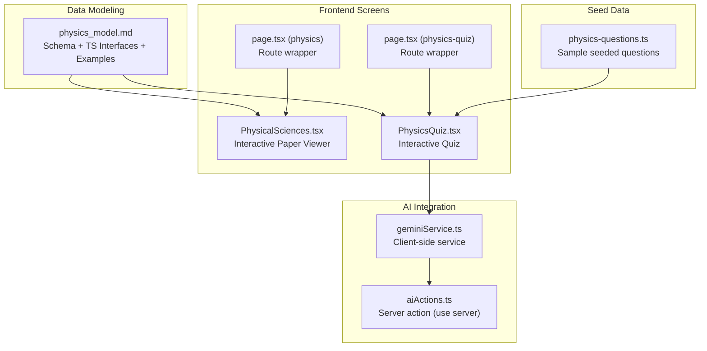
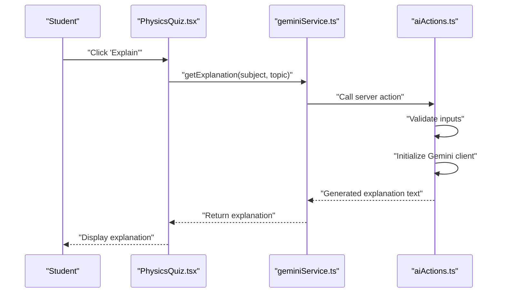
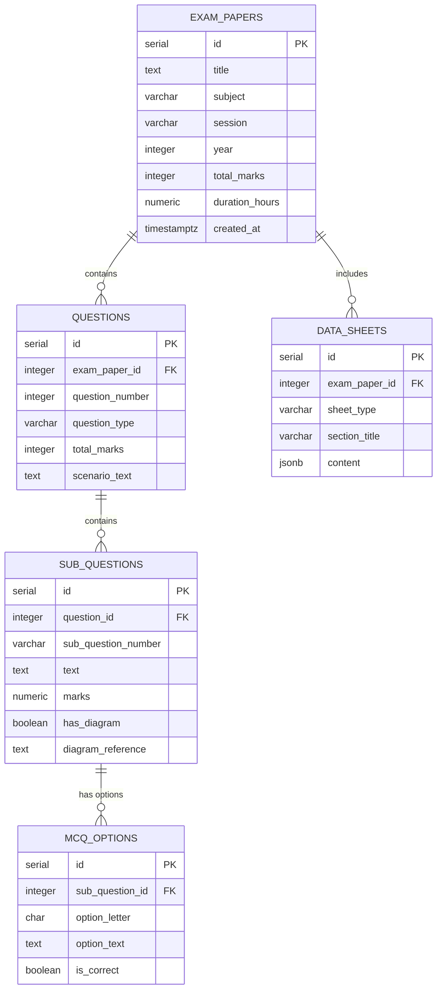
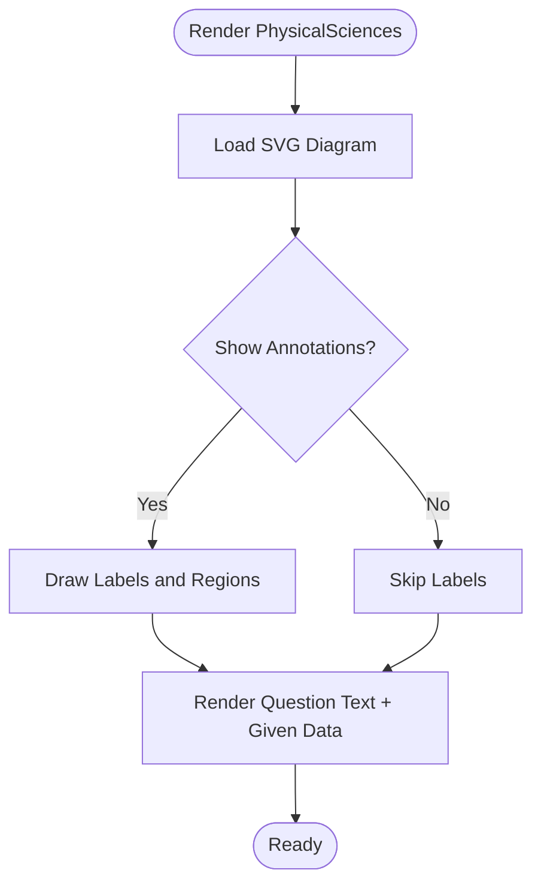
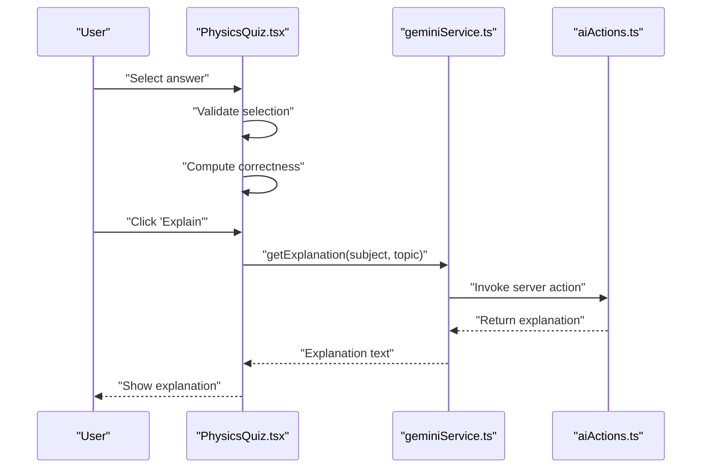
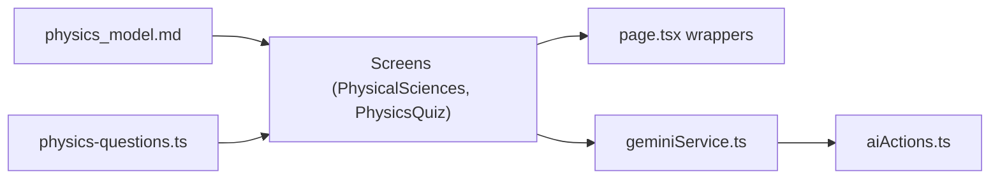

# Physics Model

<cite>
**Referenced Files in This Document**
- [physics_model.md](file://src/data_modeling/physics_model.md)
- [PhysicsQuiz.tsx](file://src/screens/PhysicsQuiz.tsx)
- [PhysicalSciences.tsx](file://src/screens/PhysicalSciences.tsx)
- [page.tsx (physics)](file://src/app/physics/page.tsx)
- [page.tsx (physics-quiz)](file://src/app/physics-quiz/page.tsx)
- [physics-questions.ts](file://src/lib/db/seed/physics-questions.ts)
- [geminiService.ts](file://src/services/geminiService.ts)
- [aiActions.ts](file://src/services/aiActions.ts)
</cite>

## Table of Contents
1. [Introduction](#introduction)
2. [Project Structure](#project-structure)
3. [Core Components](#core-components)
4. [Architecture Overview](#architecture-overview)
5. [Detailed Component Analysis](#detailed-component-analysis)
6. [Dependency Analysis](#dependency-analysis)
7. [Performance Considerations](#performance-considerations)
8. [Troubleshooting Guide](#troubleshooting-guide)
9. [Conclusion](#conclusion)
10. [Appendices](#appendices)

## Introduction
This document specifies the Physics subject model for MatricMaster AI. It covers the normalized relational schema for exam papers and questions, the TypeScript interfaces used for type-safe rendering and API payloads, and the front-end screens that present physics content. It also documents how diagrams, formula sheets, and scientific notation are modeled and rendered, along with recommended validation and rendering strategies for quantum mechanics, thermodynamics, and mechanics.

## Project Structure
The Physics model spans three primary areas:
- Data modeling and schema definition for physics exam content
- Front-end screens for presenting physics questions and diagrams
- AI-powered explanation integration for interactive learning

**Diagram sources**
- [physics_model.md](file://src/data_modeling/physics_model.md#L14-L78)
- [PhysicalSciences.tsx](file://src/screens/PhysicalSciences.tsx#L15-L275)
- [PhysicsQuiz.tsx](file://src/screens/PhysicsQuiz.tsx#L164-L446)
- [page.tsx (physics)](file://src/app/physics/page.tsx#L1-L12)
- [page.tsx (physics-quiz)](file://src/app/physics-quiz/page.tsx#L1-L12)
- [geminiService.ts](file://src/services/geminiService.ts#L1-L14)
- [aiActions.ts](file://src/services/aiActions.ts#L1-L168)
- [physics-questions.ts](file://src/lib/db/seed/physics-questions.ts#L1-L395)

**Section sources**
- [physics_model.md](file://src/data_modeling/physics_model.md#L14-L151)
- [PhysicalSciences.tsx](file://src/screens/PhysicalSciences.tsx#L15-L275)
- [PhysicsQuiz.tsx](file://src/screens/PhysicsQuiz.tsx#L164-L446)
- [page.tsx (physics)](file://src/app/physics/page.tsx#L1-L12)
- [page.tsx (physics-quiz)](file://src/app/physics-quiz/page.tsx#L1-L12)
- [geminiService.ts](file://src/services/geminiService.ts#L1-L14)
- [aiActions.ts](file://src/services/aiActions.ts#L1-L168)
- [physics-questions.ts](file://src/lib/db/seed/physics-questions.ts#L1-L395)

## Core Components
- Relational schema for exam papers, questions, sub-questions, multiple-choice options, and data sheets
- TypeScript interfaces for type-safe handling of physics content
- Front-end screens for interactive presentation of physics content and diagrams
- AI-powered explanations integrated via a Gemini service and server actions

Key schema highlights:
- exam_papers: stores subject, session, year, total marks, and duration
- questions: holds question_number, question_type, total_marks, and optional scenario_text
- sub_questions: captures sub-question text, marks, and diagram flags
- mcq_options: stores options for multiple-choice questions
- data_sheets: stores constants, formulas, and instructions as structured JSONB

Front-end components:
- PhysicalSciences screen renders a split-view of diagrams and questions with annotations
- PhysicsQuiz screen presents interactive quizzes with hints and AI explanations

**Section sources**
- [physics_model.md](file://src/data_modeling/physics_model.md#L14-L78)
- [physics_model.md](file://src/data_modeling/physics_model.md#L83-L151)
- [PhysicalSciences.tsx](file://src/screens/PhysicalSciences.tsx#L15-L275)
- [PhysicsQuiz.tsx](file://src/screens/PhysicsQuiz.tsx#L164-L446)

## Architecture Overview
The Physics model integrates data modeling, rendering, and AI assistance:

**Diagram sources**
- [PhysicsQuiz.tsx](file://src/screens/PhysicsQuiz.tsx#L176-L192)
- [geminiService.ts](file://src/services/geminiService.ts#L1-L14)
- [aiActions.ts](file://src/services/aiActions.ts#L42-L78)

## Detailed Component Analysis

### Database Schema (Normalized Relational Design)
The schema supports:
- Exam metadata normalization
- Hierarchical question/sub-question structure
- Multiple-choice options
- Structured data sheets (constants, formulas, instructions) using JSONB

**Diagram sources**
- [physics_model.md](file://src/data_modeling/physics_model.md#L14-L78)

**Section sources**
- [physics_model.md](file://src/data_modeling/physics_model.md#L14-L78)

### TypeScript Interfaces and Payloads
Interfaces define:
- QuestionType and SheetType unions
- ExamOption, SubQuestion, Question, DataSheetEntry, and ExamPaper
- API response types for paginated questions and payloads

These interfaces enable type-safe rendering and API handling across the stack.

**Section sources**
- [physics_model.md](file://src/data_modeling/physics_model.md#L83-L151)

### Sample Extracted Data (JSON Snippet)
The model includes a representative JSON snippet showing:
- Exam paper metadata
- Multiple-choice and structured questions
- Sub-questions with diagram flags
- Data sheets for constants and formulas

This demonstrates how extracted content maps to the schema and interfaces.

**Section sources**
- [physics_model.md](file://src/data_modeling/physics_model.md#L155-L305)

### Front-end Rendering: Physical Sciences Interactive Paper
The PhysicalSciences screen:
- Provides a split-view layout for diagrams and questions
- Renders an SVG circuit diagram with annotations
- Displays given data and question text
- Supports toggling view modes and annotation visibility

**Diagram sources**
- [PhysicalSciences.tsx](file://src/screens/PhysicalSciences.tsx#L84-L218)

**Section sources**
- [PhysicalSciences.tsx](file://src/screens/PhysicalSciences.tsx#L15-L275)

### Front-end Rendering: Physics Quiz
The PhysicsQuiz screen:
- Presents a sequence of multiple-choice questions
- Tracks score, correctness, and provides hints
- Integrates AI explanations via a service and server actions

**Diagram sources**
- [PhysicsQuiz.tsx](file://src/screens/PhysicsQuiz.tsx#L176-L192)
- [geminiService.ts](file://src/services/geminiService.ts#L1-L14)
- [aiActions.ts](file://src/services/aiActions.ts#L42-L78)

**Section sources**
- [PhysicsQuiz.tsx](file://src/screens/PhysicsQuiz.tsx#L164-L446)
- [geminiService.ts](file://src/services/geminiService.ts#L1-L14)
- [aiActions.ts](file://src/services/aiActions.ts#L1-L168)

### Seeded Physics Questions
The seed data provides a set of sample physics questions covering:
- Kinematics, Forces, Energy, Waves, Electricity, Magnetism, Optics, Thermodynamics, Nuclear Physics, and Motion
- Each question includes topic, grade level, difficulty, marks, image URL, hint, and options with explanations

This dataset serves as a practical example of how physics content can be structured for rendering and assessment.

**Section sources**
- [physics-questions.ts](file://src/lib/db/seed/physics-questions.ts#L1-L395)

## Dependency Analysis
The Physics model exhibits clear separation of concerns:
- Data modeling defines schema and interfaces
- Front-end screens consume the model for rendering
- AI integration is encapsulated behind a service and server action boundary

**Diagram sources**
- [physics_model.md](file://src/data_modeling/physics_model.md#L14-L151)
- [PhysicalSciences.tsx](file://src/screens/PhysicalSciences.tsx#L15-L275)
- [PhysicsQuiz.tsx](file://src/screens/PhysicsQuiz.tsx#L164-L446)
- [page.tsx (physics)](file://src/app/physics/page.tsx#L1-L12)
- [page.tsx (physics-quiz)](file://src/app/physics-quiz/page.tsx#L1-L12)
- [geminiService.ts](file://src/services/geminiService.ts#L1-L14)
- [aiActions.ts](file://src/services/aiActions.ts#L1-L168)
- [physics-questions.ts](file://src/lib/db/seed/physics-questions.ts#L1-L395)

**Section sources**
- [physics_model.md](file://src/data_modeling/physics_model.md#L14-L151)
- [PhysicalSciences.tsx](file://src/screens/PhysicalSciences.tsx#L15-L275)
- [PhysicsQuiz.tsx](file://src/screens/PhysicsQuiz.tsx#L164-L446)
- [geminiService.ts](file://src/services/geminiService.ts#L1-L14)
- [aiActions.ts](file://src/services/aiActions.ts#L1-L168)
- [physics-questions.ts](file://src/lib/db/seed/physics-questions.ts#L1-L395)

## Performance Considerations
- Prefer JSONB for data sheets to enable flexible querying and indexing where appropriate
- Normalize diagram references to decouple content from assets; render diagrams on demand
- Cache AI-generated explanations per question/topic to reduce repeated API calls
- Use lazy loading for diagrams and images in screens to minimize initial payload
- Keep unit normalization logic centralized to avoid duplication across components

## Troubleshooting Guide
Common issues and resolutions:
- Missing AI explanations: Verify the Gemini API key is configured; the server action logs a warning when missing
- Incorrect scientific notation rendering: Apply normalization transformations for units and exponents in the UI
- Diagrams not displaying: Ensure diagram references match asset keys and implement fallback messaging
- Data sheet queries failing: Confirm JSONB content structure matches expected schema (tables, constants, plain text)

**Section sources**
- [aiActions.ts](file://src/services/aiActions.ts#L22-L32)
- [aiActions.ts](file://src/services/aiActions.ts#L71-L78)
- [physics_model.md](file://src/data_modeling/physics_model.md#L319-L326)
- [physics_model.md](file://src/data_modeling/physics_model.md#L343-L364)

## Conclusion
The Physics subject model in MatricMaster AI combines a normalized relational schema, type-safe TypeScript interfaces, and interactive front-end screens. It supports diagram-driven content, structured formula sheets, and AI-powered explanations. The model is extensible for quantum mechanics, thermodynamics, and mechanics by leveraging the existing schema and rendering patterns.

## Appendices

### A. Metadata Requirements for Physics Content
- Units and scientific notation: Normalize units and exponents during rendering
- Diagrams: Store has_diagram and diagram_reference; render via SVG or image assets
- Formula sheets: Use JSONB to store structured constants, formulas, and instructions
- Scenario text: Include contextual information for structured questions

**Section sources**
- [physics_model.md](file://src/data_modeling/physics_model.md#L311-L336)
- [physics_model.md](file://src/data_modeling/physics_model.md#L366-L374)

### B. Integration with Formula Sheets and Diagrams
- Formula rendering: Use MathJax/KaTeX for formula sheets
- Diagrams: Map diagram_reference to assets; provide fallback UI
- Instructions: Store procedural steps in data sheets for guided experiments

**Section sources**
- [physics_model.md](file://src/data_modeling/physics_model.md#L366-L370)
- [PhysicalSciences.tsx](file://src/screens/PhysicalSciences.tsx#L84-L218)

### C. Implementation Guidance for Rendering and Validation
- Rendering: Centralize unit normalization and exponent formatting
- Validation: Validate inputs for AI actions; sanitize subject/topic for safe rendering
- Explanations: Wrap AI calls with error handling and user-friendly messages

**Section sources**
- [physics_model.md](file://src/data_modeling/physics_model.md#L343-L364)
- [aiActions.ts](file://src/services/aiActions.ts#L34-L40)
- [aiActions.ts](file://src/services/aiActions.ts#L71-L78)