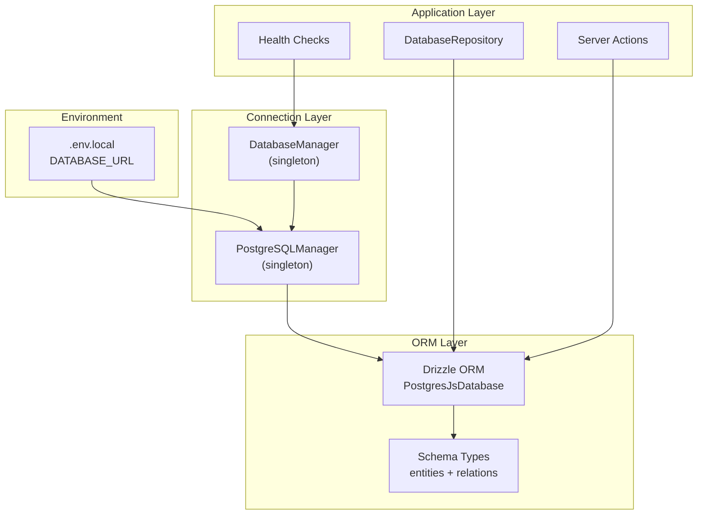
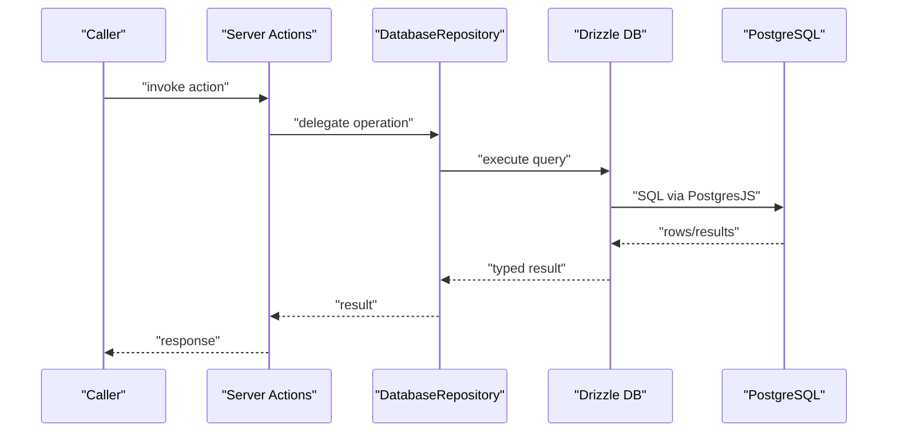
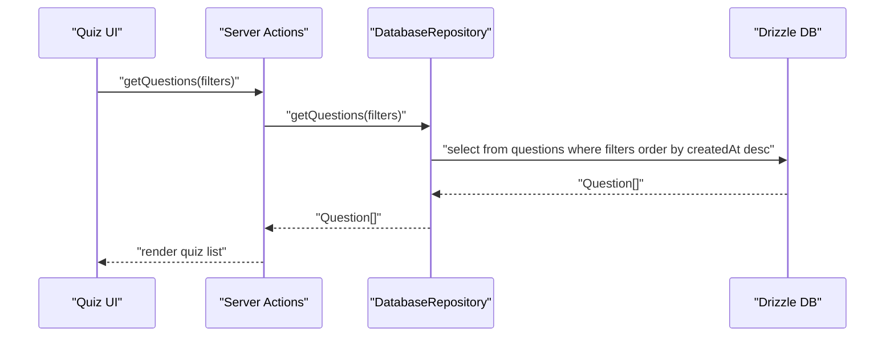
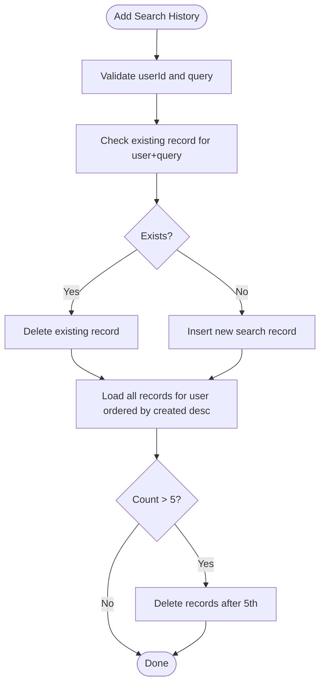
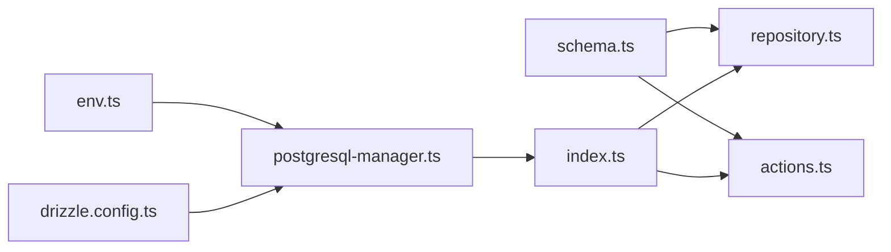

# Data Access Patterns

<cite>
**Referenced Files in This Document**
- [drizzle.config.ts](file://drizzle.config.ts)
- [env.ts](file://src/lib/env.ts)
- [postgresql-manager.ts](file://src/lib/db/postgresql-manager.ts)
- [index.ts](file://src/lib/db/index.ts)
- [schema.ts](file://src/lib/db/schema.ts)
- [auth-schema.ts](file://auth-schema.ts)
- [repository.ts](file://src/lib/db/repository.ts)
- [actions.ts](file://src/lib/db/actions.ts)
- [health.ts](file://src/lib/db/health.ts)
</cite>

## Table of Contents
1. [Introduction](#introduction)
2. [Project Structure](#project-structure)
3. [Core Components](#core-components)
4. [Architecture Overview](#architecture-overview)
5. [Detailed Component Analysis](#detailed-component-analysis)
6. [Dependency Analysis](#dependency-analysis)
7. [Performance Considerations](#performance-considerations)
8. [Troubleshooting Guide](#troubleshooting-guide)
9. [Conclusion](#conclusion)

## Introduction
This document explains the data access patterns and query optimization strategies used in MatricMaster AI. It focuses on the repository pattern implementation, Drizzle ORM usage, type-safe database operations, and practical query patterns for quizzes, user management, and search. It also covers pagination, filtering, sorting, performance tuning, caching, connection management, error handling, bulk operations, transactions, concurrency, and complex joins/aggregations.

## Project Structure
MatricMaster AI uses Drizzle ORM with PostgreSQL. The data access layer is organized around:
- A singleton PostgreSQL connection manager
- A database manager wrapper for lifecycle and availability
- A typed schema for domain entities
- A repository class encapsulating CRUD and query logic
- Action functions for server-side operations and fallbacks
- Health checks and environment validation



**Diagram sources**
- [postgresql-manager.ts](file://src/lib/db/postgresql-manager.ts#L18-L141)
- [index.ts](file://src/lib/db/index.ts#L9-L87)
- [schema.ts](file://src/lib/db/schema.ts#L1-L160)
- [repository.ts](file://src/lib/db/repository.ts#L23-L243)
- [actions.ts](file://src/lib/db/actions.ts#L52-L58)
- [health.ts](file://src/lib/db/health.ts#L3-L40)

**Section sources**
- [drizzle.config.ts](file://drizzle.config.ts#L6-L15)
- [env.ts](file://src/lib/env.ts#L3-L13)
- [postgresql-manager.ts](file://src/lib/db/postgresql-manager.ts#L18-L141)
- [index.ts](file://src/lib/db/index.ts#L9-L87)
- [schema.ts](file://src/lib/db/schema.ts#L1-L160)

## Core Components
- PostgreSQLManager: Singleton connection manager with retry, SSL detection for Neon, and graceful shutdown hooks.
- DatabaseManager: Wrapper that exposes a shared Drizzle database handle and ensures availability via wait-for-connect.
- Schema: Strongly-typed entities and relations for quiz system, search history, and Better Auth tables.
- DatabaseRepository: Centralized CRUD and query methods with transactions and filters.
- Server Actions: Type-safe, Zod-validated server functions that delegate to the repository and provide mock fallbacks.
- Health Utilities: Database readiness checks and status reporting.

Key responsibilities:
- Type-safe operations via Drizzle’s inferred types
- Centralized filtering, ordering, and pagination
- Transactional integrity for related inserts/updates
- Graceful degradation with mock data when DB is unavailable

**Section sources**
- [postgresql-manager.ts](file://src/lib/db/postgresql-manager.ts#L18-L141)
- [index.ts](file://src/lib/db/index.ts#L9-L87)
- [schema.ts](file://src/lib/db/schema.ts#L14-L160)
- [repository.ts](file://src/lib/db/repository.ts#L23-L243)
- [actions.ts](file://src/lib/db/actions.ts#L52-L58)

## Architecture Overview
The system follows a layered architecture:
- Environment and configuration
- Connection management
- ORM and schema
- Repository and actions
- Application features (quiz, user, search)



**Diagram sources**
- [actions.ts](file://src/lib/db/actions.ts#L290-L312)
- [repository.ts](file://src/lib/db/repository.ts#L95-L117)
- [postgresql-manager.ts](file://src/lib/db/postgresql-manager.ts#L110-L122)

## Detailed Component Analysis

### Repository Pattern Implementation
The repository encapsulates all data access logic for subjects, questions, options, and search history. It:
- Uses Drizzle’s typed queries
- Applies filters via condition arrays and logical AND
- Enforces ordering and limits
- Performs transactions for related writes

```mermaid
classDiagram
class DatabaseRepository {
+createSubject(data) Subject
+getSubjects(activeOnly) Subject[]
+getSubjectById(id, activeOnly) Subject|null
+updateSubject(id, data) Subject|null
+softDeleteSubject(id) boolean
+hardDeleteSubject(id) boolean
+createQuestion(questionData, optionsData) Question&{options}
+getQuestions(filters) Question[]
+getQuestionWithOptions(id) Question&{options}|null
+getRandomQuestions(subjectId, count, difficulty?) Question[]
+updateQuestion(id, data) Question|null
+softDeleteQuestion(id) boolean
+hardDeleteQuestion(id) boolean
+getOptionsByQuestionId(questionId) Option[]
+addSearchHistory(userId, query) SearchHistory
+getSearchHistory(userId, limit) SearchHistory[]
+deleteSearchHistoryItem(id, userId) boolean
+clearSearchHistory(userId) boolean
}
```

**Diagram sources**
- [repository.ts](file://src/lib/db/repository.ts#L23-L243)

**Section sources**
- [repository.ts](file://src/lib/db/repository.ts#L23-L243)

### Query Builder Usage and Type-Safe Operations
- Filters are constructed dynamically using equality conditions and combined with logical AND.
- Ordering is applied consistently (e.g., descending creation date for questions).
- Limits are used for random sampling and paginated retrieval.
- Transactions wrap related writes to maintain referential integrity.

Common patterns:
- Filtering by subject, difficulty, grade level, topic, and activity status
- Random selection using SQL random ordering
- Soft-delete cascades via transaction updates

**Section sources**
- [repository.ts](file://src/lib/db/repository.ts#L95-L117)
- [repository.ts](file://src/lib/db/repository.ts#L137-L151)
- [repository.ts](file://src/lib/db/repository.ts#L162-L171)

### Quiz System Queries
- List subjects with optional active-only filter
- Retrieve questions with dynamic filters and ordering
- Fetch a single question with its options
- Get random questions per subject and difficulty
- Bulk insert of questions with associated options



**Diagram sources**
- [actions.ts](file://src/lib/db/actions.ts#L290-L312)
- [repository.ts](file://src/lib/db/repository.ts#L95-L117)

**Section sources**
- [actions.ts](file://src/lib/db/actions.ts#L290-L312)
- [repository.ts](file://src/lib/db/repository.ts#L95-L117)

### User Management and Authentication
Better Auth tables are modeled alongside application tables. The schema exports consistent aliases for user, session, account, and verification entities. Indexes are defined on foreign keys and identifiers to optimize joins and lookups.

Key points:
- Relations link accounts/sessions to users
- Indexes on user_id and identifier improve lookup performance
- Soft-deletion patterns can be extended to user-related entities

**Section sources**
- [schema.ts](file://src/lib/db/schema.ts#L25-L27)
- [auth-schema.ts](file://auth-schema.ts#L18-L95)

### Search Functionality
Search history is stored with user association and timestamps. The repository enforces a cap on stored history items and deduplicates repeated queries.



**Diagram sources**
- [repository.ts](file://src/lib/db/repository.ts#L186-L216)

**Section sources**
- [repository.ts](file://src/lib/db/repository.ts#L186-L216)

### Pagination Strategies
- Limit and order-by patterns are used for pagination-like behavior.
- For true pagination, offset/limit can be introduced by extending filters with skip/take parameters.

Recommendations:
- Add explicit pagination parameters to repository methods
- Use cursor-based pagination for large datasets to avoid skipping rows

**Section sources**
- [repository.ts](file://src/lib/db/repository.ts#L137-L151)
- [repository.ts](file://src/lib/db/repository.ts#L218-L225)

### Filtering Mechanisms and Sorting Options
- Dynamic filters: subjectId, difficulty, gradeLevel, topic, isActive
- Sorting: createdAt desc for questions; option letter asc for options
- Indexes support these filters and joins

**Section sources**
- [repository.ts](file://src/lib/db/repository.ts#L15-L21)
- [repository.ts](file://src/lib/db/repository.ts#L95-L117)
- [repository.ts](file://src/lib/db/repository.ts#L178-L184)

### Complex Joins, Aggregations, and Analytical Queries
Current repository methods focus on straightforward selects/joins. To support analytics:
- Add computed aggregates (counts, averages) via Drizzle’s aggregate functions
- Introduce analytical queries for performance metrics or user progress
- Use window functions for ranking or dense ordering

Note: Implement these enhancements by adding new repository methods and corresponding Drizzle queries.

**Section sources**
- [repository.ts](file://src/lib/db/repository.ts#L119-L135)
- [repository.ts](file://src/lib/db/repository.ts#L178-L184)

### Bulk Operations and Transactions
- Transactional creation of questions with multiple options
- Batch deletions and updates for soft-delete cascades
- Promise.all for parallel inserts of options

Best practices:
- Keep transactions short-lived
- Validate inputs before entering transactions
- Roll back on partial failures

**Section sources**
- [repository.ts](file://src/lib/db/repository.ts#L75-L93)
- [repository.ts](file://src/lib/db/repository.ts#L162-L171)

### Concurrency and Connection Management
- Singleton managers prevent multiple connections
- Connection retries with delays
- Graceful shutdown hooks end connections cleanly
- Environment validation ensures DATABASE_URL presence

**Section sources**
- [postgresql-manager.ts](file://src/lib/db/postgresql-manager.ts#L29-L40)
- [postgresql-manager.ts](file://src/lib/db/postgresql-manager.ts#L128-L140)
- [index.ts](file://src/lib/db/index.ts#L24-L39)
- [env.ts](file://src/lib/env.ts#L47-L56)

### Caching Patterns
- Mock fallbacks in server actions provide resilience when DB is down
- Suggestion: Introduce Redis/memoization for frequently accessed lists (e.g., subjects, recent searches)

**Section sources**
- [actions.ts](file://src/lib/db/actions.ts#L192-L203)
- [actions.ts](file://src/lib/db/actions.ts#L314-L339)

### Error Handling Approaches
- Try/catch blocks in server actions return safe defaults or empty results
- Health checks report connectivity and errors
- Validation errors are surfaced early via Zod schemas

**Section sources**
- [actions.ts](file://src/lib/db/actions.ts#L192-L203)
- [actions.ts](file://src/lib/db/actions.ts#L314-L339)
- [health.ts](file://src/lib/db/health.ts#L3-L17)

## Dependency Analysis


**Diagram sources**
- [env.ts](file://src/lib/env.ts#L3-L13)
- [postgresql-manager.ts](file://src/lib/db/postgresql-manager.ts#L1-L16)
- [index.ts](file://src/lib/db/index.ts#L1-L7)
- [schema.ts](file://src/lib/db/schema.ts#L1-L27)
- [repository.ts](file://src/lib/db/repository.ts#L1-L13)
- [actions.ts](file://src/lib/db/actions.ts#L1-L15)
- [drizzle.config.ts](file://drizzle.config.ts#L1-L15)

**Section sources**
- [env.ts](file://src/lib/env.ts#L3-L13)
- [postgresql-manager.ts](file://src/lib/db/postgresql-manager.ts#L1-L16)
- [index.ts](file://src/lib/db/index.ts#L1-L7)
- [schema.ts](file://src/lib/db/schema.ts#L1-L27)
- [repository.ts](file://src/lib/db/repository.ts#L1-L13)
- [actions.ts](file://src/lib/db/actions.ts#L1-L15)
- [drizzle.config.ts](file://drizzle.config.ts#L1-L15)

## Performance Considerations
- Index utilization
  - Questions: subjectId, gradeLevel, topic, difficulty, isActive, composite subject+isActive
  - Search history: userId, createdAt
  - Better Auth: session.userId, account.userId, verification.identifier
- Query patterns
  - Prefer indexed columns in WHERE clauses
  - Use ORDER BY wisely; random ordering can be expensive on large datasets
  - Apply LIMIT for sampling and pagination
- Connection tuning
  - Adjust maxConnections, idle timeouts, and connection timeouts in PostgreSQLManager
  - Use SSL for hosted providers (e.g., Neon)
- Monitoring and profiling
  - Enable query logging in development
  - Use EXPLAIN/EXPLAIN ANALYZE to review slow queries
  - Track query latency and failure rates
- Caching
  - Cache hot lists (subjects, recent searches)
  - Use etag/cache-control for read-heavy endpoints

[No sources needed since this section provides general guidance]

## Troubleshooting Guide
- Database not connected
  - Use health checks to confirm connectivity
  - Verify DATABASE_URL and environment configuration
- Connection failures
  - Review retry logic and timeouts
  - Check SSL settings for hosted providers
- Slow queries
  - Confirm indexes exist and are used
  - Avoid random ordering on large tables
- Mock fallbacks
  - Server actions fall back to mock data when DB is unavailable

**Section sources**
- [health.ts](file://src/lib/db/health.ts#L3-L17)
- [env.ts](file://src/lib/env.ts#L47-L56)
- [postgresql-manager.ts](file://src/lib/db/postgresql-manager.ts#L52-L90)
- [actions.ts](file://src/lib/db/actions.ts#L192-L203)

## Conclusion
MatricMaster AI employs a clean, type-safe data access layer built on Drizzle ORM. The repository pattern centralizes queries, while server actions provide resilient, validated operations with fallbacks. By leveraging indexes, limiting random scans, and adopting pagination and caching, the system can scale effectively. Extending the repository with analytical queries and cursor-based pagination will further enhance performance and user experience.