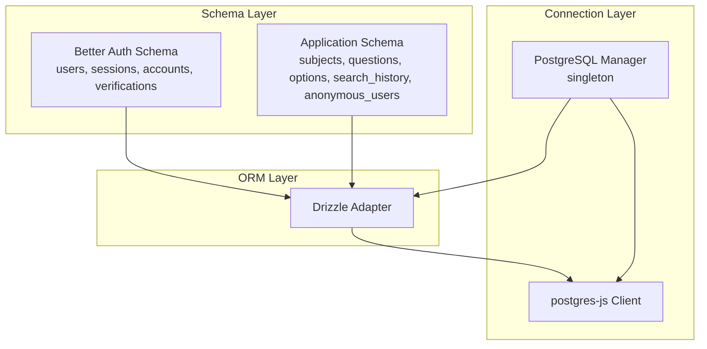
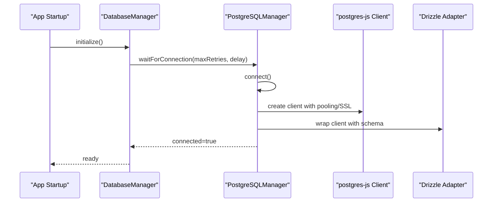
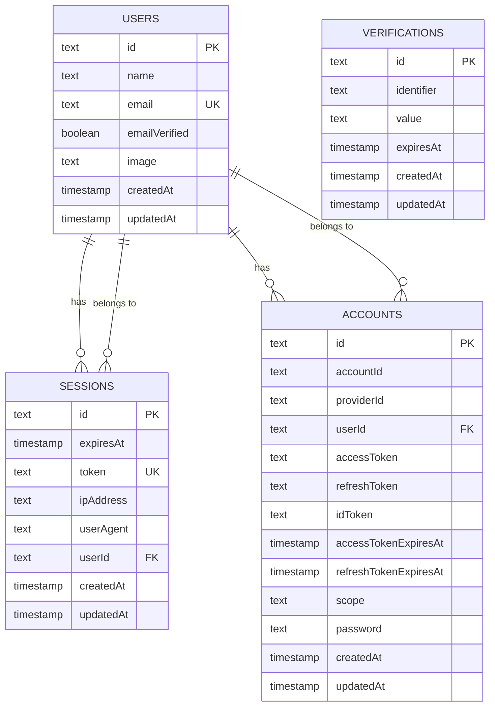
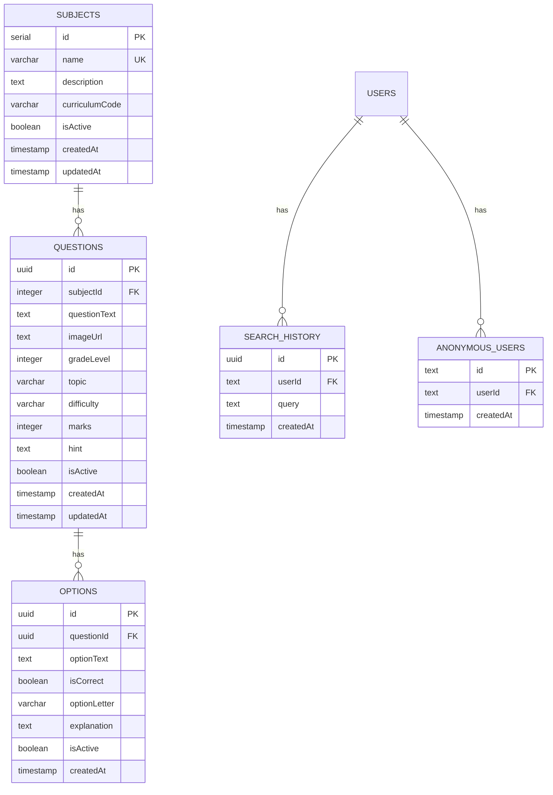
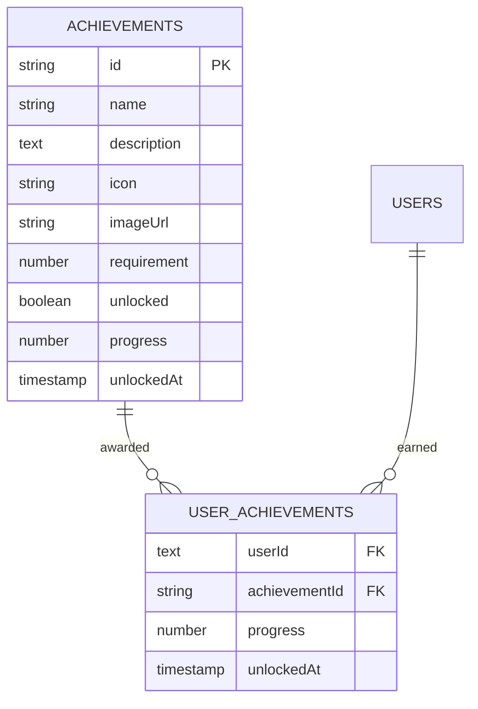
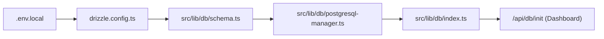
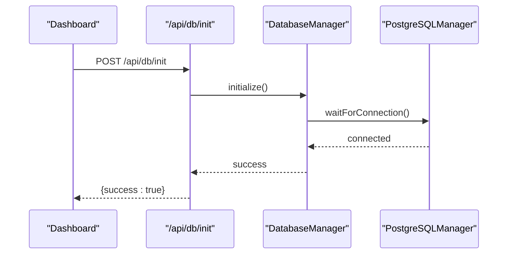

# Database Design

<cite>
**Referenced Files in This Document**
- [drizzle.config.ts](file://drizzle.config.ts)
- [drizzle/meta/_journal.json](file://drizzle/meta/_journal.json)
- [src/lib/db/schema.ts](file://src/lib/db/schema.ts)
- [src/lib/db/better-auth-schema.ts](file://src/lib/db/better-auth-schema.ts)
- [auth-schema.ts](file://auth-schema.ts)
- [src/lib/db/index.ts](file://src/lib/db/index.ts)
- [src/lib/db/postgresql-manager.ts](file://src/lib/db/postgresql-manager.ts)
- [db-test.js](file://db-test.js)
- [src/constants/index.ts](file://src/constants/index.ts)
- [src/lib/data.ts](file://src/lib/data.ts)
- [src/screens/Dashboard.tsx](file://src/screens/Dashboard.tsx)
</cite>

## Table of Contents
1. [Introduction](#introduction)
2. [Project Structure](#project-structure)
3. [Core Components](#core-components)
4. [Architecture Overview](#architecture-overview)
5. [Detailed Component Analysis](#detailed-component-analysis)
6. [Dependency Analysis](#dependency-analysis)
7. [Performance Considerations](#performance-considerations)
8. [Troubleshooting Guide](#troubleshooting-guide)
9. [Conclusion](#conclusion)
10. [Appendices](#appendices)

## Introduction
This document describes the database design for MatricMaster AI, focusing on the Drizzle ORM integration, schema definitions, relationships, and operational aspects such as connection pooling, migrations, and data access patterns. It covers core entities including users, sessions, accounts, quiz data, search history, and outlines the achievement system’s data model and integration points. Guidance on indexes, constraints, and migration management is included, along with practical diagrams and operational recommendations.

## Project Structure
The database layer is organized around Drizzle ORM with a PostgreSQL dialect. Schema definitions are split into two modules:
- A unified schema module that re-exports Better Auth tables under consistent names and augments them with application-specific entities.
- A separate Better Auth schema module that defines core authentication tables and relations.

Connection management is handled via a PostgreSQL manager that encapsulates the Drizzle adapter and the underlying postgres-js client, exposing a singleton with graceful shutdown hooks.

**Diagram sources**
- [src/lib/db/schema.ts](file://src/lib/db/schema.ts#L1-L160)
- [src/lib/db/better-auth-schema.ts](file://src/lib/db/better-auth-schema.ts#L1-L107)
- [src/lib/db/postgresql-manager.ts](file://src/lib/db/postgresql-manager.ts#L1-L162)

**Section sources**
- [drizzle.config.ts](file://drizzle.config.ts#L1-L16)
- [src/lib/db/schema.ts](file://src/lib/db/schema.ts#L1-L160)
- [src/lib/db/better-auth-schema.ts](file://src/lib/db/better-auth-schema.ts#L1-L107)
- [src/lib/db/postgresql-manager.ts](file://src/lib/db/postgresql-manager.ts#L1-L162)

## Core Components
- Drizzle configuration: Defines dialect, schema path, migration output, casing, and credentials loaded from environment.
- Better Auth schema: Authentication core tables with relations and indexes.
- Application schema: Quiz domain entities (subjects, questions, options), search history, and anonymous users.
- Connection manager: Singleton PostgreSQL manager with pooling, timeouts, SSL detection, and graceful shutdown.

Key integration points:
- Unified schema re-exports Better Auth tables under consistent names for app usage.
- Environment-driven configuration for database URL and migration settings.

**Section sources**
- [drizzle.config.ts](file://drizzle.config.ts#L1-L16)
- [src/lib/db/schema.ts](file://src/lib/db/schema.ts#L14-L27)
- [src/lib/db/better-auth-schema.ts](file://src/lib/db/better-auth-schema.ts#L1-L107)
- [src/lib/db/postgresql-manager.ts](file://src/lib/db/postgresql-manager.ts#L11-L40)

## Architecture Overview
The system uses Drizzle ORM with a PostgreSQL backend. The connection manager initializes the postgres-js client with configurable pooling and timeouts, wraps it in Drizzle, and exposes a singleton for the rest of the app. Migrations are managed via Drizzle Kit, pointing to the schema file and output directory.

**Diagram sources**
- [src/lib/db/index.ts](file://src/lib/db/index.ts#L24-L39)
- [src/lib/db/postgresql-manager.ts](file://src/lib/db/postgresql-manager.ts#L42-L90)

**Section sources**
- [src/lib/db/index.ts](file://src/lib/db/index.ts#L1-L102)
- [src/lib/db/postgresql-manager.ts](file://src/lib/db/postgresql-manager.ts#L1-L162)

## Detailed Component Analysis

### Authentication Entities (users, sessions, accounts, verifications)
These tables implement Better Auth’s core authentication model with relations and indexes optimized for typical auth operations.

Entity definitions and constraints:
- users: Primary key id, unique email, timestamps, optional image, boolean flags.
- sessions: Unique token, expiresAt, optional IP/user agent, foreign key userId with cascade delete.
- accounts: Composite provider/account identifiers, optional tokens/expiry, foreign key userId with cascade delete.
- verifications: Identifier/value with expiry and timestamps.

Indexes:
- sessions: token, userId.
- accounts: userId, provider/providerId pair.
- users: email.
- verifications: identifier.

Relationships:
- One-to-many: users -> sessions/accounts.
- Many-to-one: sessions/accounts -> users.

**Diagram sources**
- [src/lib/db/better-auth-schema.ts](file://src/lib/db/better-auth-schema.ts#L4-L93)
- [auth-schema.ts](file://auth-schema.ts#L4-L95)

**Section sources**
- [src/lib/db/better-auth-schema.ts](file://src/lib/db/better-auth-schema.ts#L4-L93)
- [auth-schema.ts](file://auth-schema.ts#L4-L95)

### Application Quiz and Search Entities
Application-specific entities for quiz data and search history.

Entity definitions and constraints:
- subjects: Auto-increment id, unique name, curriculum code, isActive flag, timestamps.
- questions: UUID primary key, foreign key subjectId with cascade delete, grade/topic/difficulty/marks, hints, isActive flag, timestamps; indexes on subjectId, gradeLevel, topic, difficulty, isActive, and composite subject+isActive.
- options: UUID primary key, foreign key questionId with cascade delete, option letter, correctness flag, explanation, isActive flag, timestamps.
- search_history: UUID primary key, foreign key userId with cascade delete, query text, createdAt timestamp; indexes on userId and createdAt.
- anonymous_users: UUID primary key, foreign key userId with cascade delete.

Relations:
- subjects -> questions (one-to-many).
- questions -> options (one-to-many).
- users -> search_history (one-to-many).

**Diagram sources**
- [src/lib/db/schema.ts](file://src/lib/db/schema.ts#L42-L141)

**Section sources**
- [src/lib/db/schema.ts](file://src/lib/db/schema.ts#L42-L141)

### Achievement System Data Model
Achievement definitions are currently represented as static constants in the frontend. The data model below reflects the intended structure for persisted achievements and progress tracking.

Fields:
- id: string identifier.
- name: display name.
- description: short description.
- icon: internal icon reference.
- imageUrl: optional external image URL.
- requirement: numeric threshold for unlocking.
- unlocked: boolean flag.
- progress: numeric progress toward requirement.
- unlockedAt: optional timestamp.

Integration points:
- Achievement retrieval and progress updates would be backed by a dedicated achievements table and a user_achievements pivot table linking users to achievements with progress and unlock timestamps.

**Diagram sources**
- [src/constants/index.ts](file://src/constants/index.ts#L38-L73)
- [src/lib/data.ts](file://src/lib/data.ts#L349-L362)

**Section sources**
- [src/constants/index.ts](file://src/constants/index.ts#L38-L73)
- [src/lib/data.ts](file://src/lib/data.ts#L349-L362)

## Dependency Analysis
- Drizzle configuration depends on environment variables for credentials and migration output.
- Application schema imports Better Auth tables to maintain consistency and leverage relations.
- Connection manager encapsulates client creation, wrapping, and lifecycle management.
- Frontend dashboards trigger database initialization via an API endpoint.

**Diagram sources**
- [drizzle.config.ts](file://drizzle.config.ts#L1-L16)
- [src/lib/db/schema.ts](file://src/lib/db/schema.ts#L14-L27)
- [src/lib/db/postgresql-manager.ts](file://src/lib/db/postgresql-manager.ts#L1-L162)
- [src/lib/db/index.ts](file://src/lib/db/index.ts#L1-L102)
- [src/screens/Dashboard.tsx](file://src/screens/Dashboard.tsx#L74-L86)

**Section sources**
- [drizzle.config.ts](file://drizzle.config.ts#L1-L16)
- [src/lib/db/schema.ts](file://src/lib/db/schema.ts#L14-L27)
- [src/lib/db/postgresql-manager.ts](file://src/lib/db/postgresql-manager.ts#L1-L162)
- [src/lib/db/index.ts](file://src/lib/db/index.ts#L1-L102)
- [src/screens/Dashboard.tsx](file://src/screens/Dashboard.tsx#L74-L86)

## Performance Considerations
- Connection pooling and timeouts:
  - Max pool size, idle timeout, and connection timeout are configurable in the connection manager.
  - Automatic SSL selection for Neon-hosted databases.
- Indexes:
  - Auth tables: token, userId, providerId/accountId composite.
  - Quiz tables: subjectId, gradeLevel, topic, difficulty, isActive, and composite subject+isActive for filtering and joins.
  - Search history: userId and createdAt for user queries and chronological sorting.
- Query patterns:
  - Prefer indexed columns in WHERE clauses and JOIN conditions.
  - Use LIMIT and pagination for lists (e.g., search history, leaderboard placeholders).
  - Batch writes for bulk inserts (e.g., options per question).
- Caching:
  - Use caching utilities for read-heavy dashboard and profile data to reduce DB load.

[No sources needed since this section provides general guidance]

## Troubleshooting Guide
Common issues and remedies:
- Connection failures:
  - Verify DATABASE_URL is present and reachable.
  - Adjust connectionTimeout/idleTimeout/maxConnections as needed.
  - For Neon, SSL is enabled automatically; ensure the connection string includes the Neon host.
- Migration journal anomalies:
  - Review migration journal entries to confirm applied migrations.
- Graceful shutdown:
  - SIGTERM/SIGINT handlers ensure clean client termination.

Operational checks:
- Use the provided test script to validate pooled and unpooled connections with different timeouts.
- Confirm indexes exist and are used by EXPLAIN plans for slow queries.

**Section sources**
- [src/lib/db/postgresql-manager.ts](file://src/lib/db/postgresql-manager.ts#L52-L90)
- [db-test.js](file://db-test.js#L1-L73)
- [drizzle/meta/_journal.json](file://drizzle/meta/_journal.json#L1-L6)

## Conclusion
MatricMaster AI’s database design leverages Drizzle ORM with PostgreSQL, combining Better Auth’s authentication schema and application-specific entities for quizzes and search. The connection manager provides robust pooling and lifecycle management, while indexes and relations support efficient querying. The achievement system is modeled conceptually for future persistence. Operational practices around migrations, monitoring, and graceful shutdown ensure reliability.

[No sources needed since this section summarizes without analyzing specific files]

## Appendices

### Drizzle Migration Management
- Configuration:
  - Dialect: PostgreSQL.
  - Schema path: application schema file.
  - Output directory: drizzle folder.
  - Casing: snake_case.
- Journal:
  - Tracks migration entries and dialect metadata.

**Section sources**
- [drizzle.config.ts](file://drizzle.config.ts#L6-L15)
- [drizzle/meta/_journal.json](file://drizzle/meta/_journal.json#L1-L6)

### Database Initialization Flow

**Diagram sources**
- [src/screens/Dashboard.tsx](file://src/screens/Dashboard.tsx#L74-L86)
- [src/lib/db/index.ts](file://src/lib/db/index.ts#L24-L39)
- [src/lib/db/postgresql-manager.ts](file://src/lib/db/postgresql-manager.ts#L128-L140)