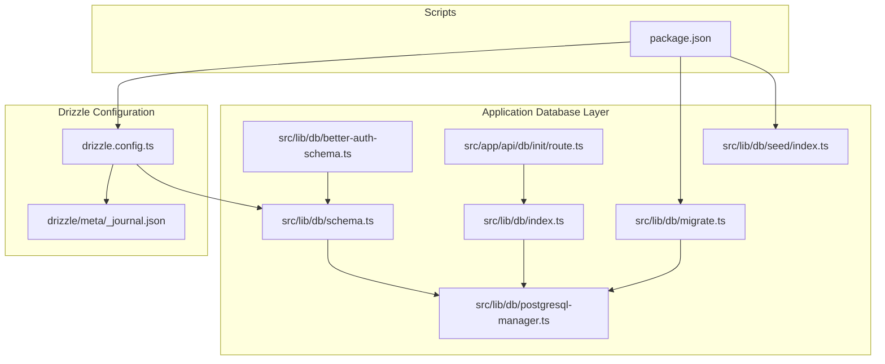
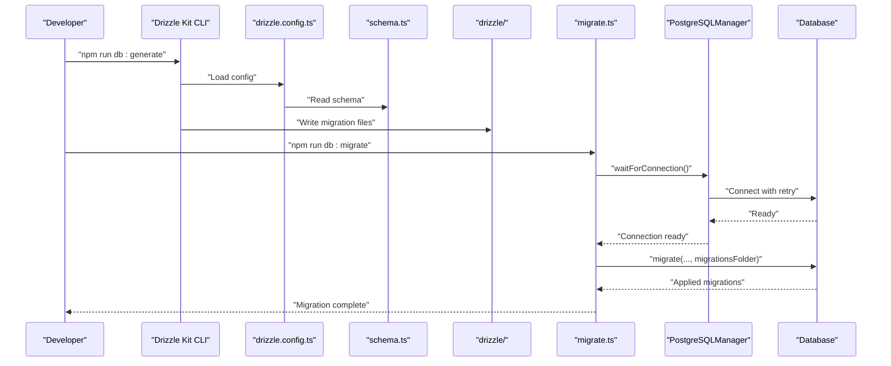
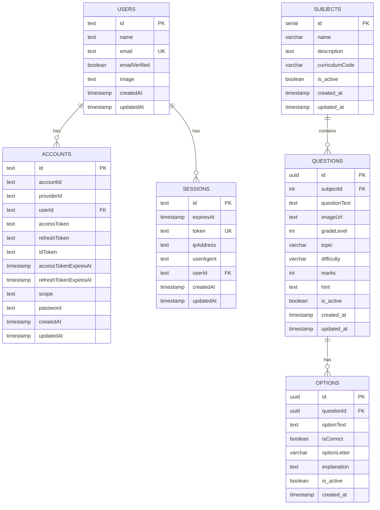
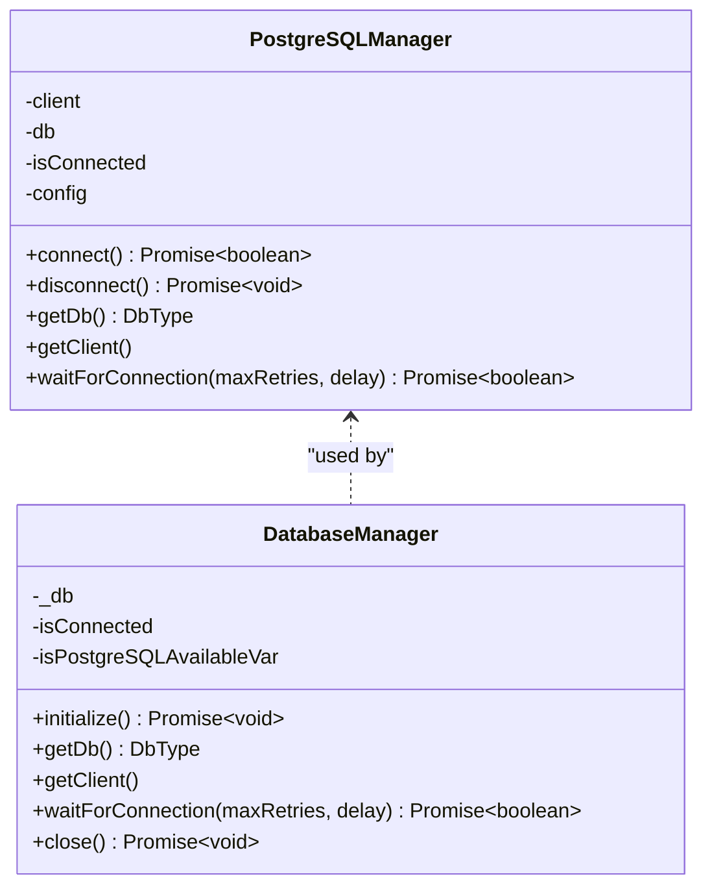
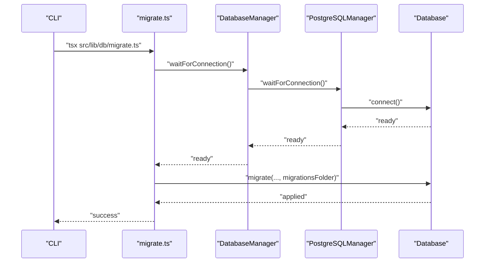
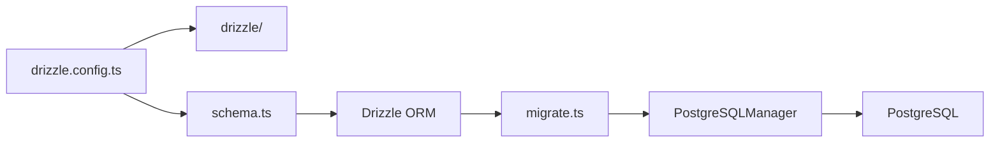

# Migration Management

<cite>
**Referenced Files in This Document**
- [drizzle.config.ts](file://drizzle.config.ts)
- [drizzle/meta/_journal.json](file://drizzle/meta/_journal.json)
- [src/lib/db/schema.ts](file://src/lib/db/schema.ts)
- [src/lib/db/better-auth-schema.ts](file://src/lib/db/better-auth-schema.ts)
- [src/lib/db/index.ts](file://src/lib/db/index.ts)
- [src/lib/db/postgresql-manager.ts](file://src/lib/db/postgresql-manager.ts)
- [src/lib/db/migrate.ts](file://src/lib/db/migrate.ts)
- [src/app/api/db/init/route.ts](file://src/app/api/db/init/route.ts)
- [src/lib/db/seed/index.ts](file://src/lib/db/seed/index.ts)
- [package.json](file://package.json)
</cite>

## Table of Contents
1. [Introduction](#introduction)
2. [Project Structure](#project-structure)
3. [Core Components](#core-components)
4. [Architecture Overview](#architecture-overview)
5. [Detailed Component Analysis](#detailed-component-analysis)
6. [Dependency Analysis](#dependency-analysis)
7. [Performance Considerations](#performance-considerations)
8. [Troubleshooting Guide](#troubleshooting-guide)
9. [Conclusion](#conclusion)
10. [Appendices](#appendices)

## Introduction
This document explains how MatricMaster AI manages database migrations using Drizzle Kit and Drizzle ORM. It covers the migration workflow from generation to execution and rollback, the migration file structure, version control integration, and deployment strategies. It also documents the journal system for tracking applied migrations, conflict resolution, schema and data change examples, backward compatibility practices, production deployment best practices, testing strategies, failure handling, automation and CI/CD integration, and cross-environment synchronization.

## Project Structure
MatricMaster AI organizes migration-related artifacts under the drizzle directory and integrates with the application’s database layer. The schema definition resides in the application’s database module, while migration scripts and the journal are managed by Drizzle Kit.

**Diagram sources**
- [drizzle.config.ts](file://drizzle.config.ts#L1-L16)
- [drizzle/meta/_journal.json](file://drizzle/meta/_journal.json#L1-L6)
- [src/lib/db/schema.ts](file://src/lib/db/schema.ts#L1-L160)
- [src/lib/db/better-auth-schema.ts](file://src/lib/db/better-auth-schema.ts#L1-L107)
- [src/lib/db/postgresql-manager.ts](file://src/lib/db/postgresql-manager.ts#L1-L162)
- [src/lib/db/index.ts](file://src/lib/db/index.ts#L1-L102)
- [src/app/api/db/init/route.ts](file://src/app/api/db/init/route.ts#L1-L100)
- [src/lib/db/migrate.ts](file://src/lib/db/migrate.ts#L1-L45)
- [src/lib/db/seed/index.ts](file://src/lib/db/seed/index.ts#L1-L232)
- [package.json](file://package.json#L1-L84)

**Section sources**
- [drizzle.config.ts](file://drizzle.config.ts#L1-L16)
- [drizzle/meta/_journal.json](file://drizzle/meta/_journal.json#L1-L6)
- [src/lib/db/schema.ts](file://src/lib/db/schema.ts#L1-L160)
- [src/lib/db/better-auth-schema.ts](file://src/lib/db/better-auth-schema.ts#L1-L107)
- [src/lib/db/postgresql-manager.ts](file://src/lib/db/postgresql-manager.ts#L1-L162)
- [src/lib/db/index.ts](file://src/lib/db/index.ts#L1-L102)
- [src/app/api/db/init/route.ts](file://src/app/api/db/init/route.ts#L1-L100)
- [src/lib/db/migrate.ts](file://src/lib/db/migrate.ts#L1-L45)
- [src/lib/db/seed/index.ts](file://src/lib/db/seed/index.ts#L1-L232)
- [package.json](file://package.json#L1-L84)

## Core Components
- Drizzle configuration defines dialect, schema location, output folder, casing, and credentials.
- Schema files define tables and relations for the quiz system and better-auth integration.
- PostgreSQL manager encapsulates connection lifecycle, retries, and SSL handling.
- Database manager coordinates initialization and provides a singleton interface.
- Migration runner executes migrations against the configured database.
- Journal tracks applied migrations and supports conflict detection.
- Seed script initializes baseline data and test users.

**Section sources**
- [drizzle.config.ts](file://drizzle.config.ts#L1-L16)
- [src/lib/db/schema.ts](file://src/lib/db/schema.ts#L1-L160)
- [src/lib/db/better-auth-schema.ts](file://src/lib/db/better-auth-schema.ts#L1-L107)
- [src/lib/db/postgresql-manager.ts](file://src/lib/db/postgresql-manager.ts#L1-L162)
- [src/lib/db/index.ts](file://src/lib/db/index.ts#L1-L102)
- [src/lib/db/migrate.ts](file://src/lib/db/migrate.ts#L1-L45)
- [drizzle/meta/_journal.json](file://drizzle/meta/_journal.json#L1-L6)
- [src/lib/db/seed/index.ts](file://src/lib/db/seed/index.ts#L1-L232)

## Architecture Overview
The migration pipeline integrates Drizzle Kit for generating migration files and Drizzle ORM for applying them. The application’s database layer ensures robust connectivity and safe execution.

**Diagram sources**
- [drizzle.config.ts](file://drizzle.config.ts#L1-L16)
- [src/lib/db/schema.ts](file://src/lib/db/schema.ts#L1-L160)
- [src/lib/db/migrate.ts](file://src/lib/db/migrate.ts#L1-L45)
- [src/lib/db/postgresql-manager.ts](file://src/lib/db/postgresql-manager.ts#L1-L162)

## Detailed Component Analysis

### Drizzle Configuration
- Defines strict mode, output directory for migrations, schema path, PostgreSQL dialect, credential URL, and snake_case casing.
- Loads environment variables from .env.local to supply DATABASE_URL.

**Section sources**
- [drizzle.config.ts](file://drizzle.config.ts#L1-L16)

### Migration File Structure
- Drizzle Kit writes migration files under the drizzle directory. These files contain SQL statements to evolve the schema and are executed in order.
- The journal file tracks applied migrations and the dialect/version used.

**Section sources**
- [drizzle.config.ts](file://drizzle.config.ts#L8-L9)
- [drizzle/meta/_journal.json](file://drizzle/meta/_journal.json#L1-L6)

### Schema Definition and Relations
- The schema defines quiz system tables (subjects, questions, options) and integrates better-auth tables (users, sessions, accounts, verifications).
- Relations capture foreign keys and indexing strategies for performance and referential integrity.

**Diagram sources**
- [src/lib/db/schema.ts](file://src/lib/db/schema.ts#L29-L160)
- [src/lib/db/better-auth-schema.ts](file://src/lib/db/better-auth-schema.ts#L4-L107)

**Section sources**
- [src/lib/db/schema.ts](file://src/lib/db/schema.ts#L1-L160)
- [src/lib/db/better-auth-schema.ts](file://src/lib/db/better-auth-schema.ts#L1-L107)

### Database Connection Management
- PostgreSQLManager handles connection establishment, SSL detection for specific providers, connection retries, and graceful shutdown signals.
- DatabaseManager provides a higher-level interface, ensuring single connection and safe initialization.

**Diagram sources**
- [src/lib/db/postgresql-manager.ts](file://src/lib/db/postgresql-manager.ts#L18-L141)
- [src/lib/db/index.ts](file://src/lib/db/index.ts#L9-L87)

**Section sources**
- [src/lib/db/postgresql-manager.ts](file://src/lib/db/postgresql-manager.ts#L1-L162)
- [src/lib/db/index.ts](file://src/lib/db/index.ts#L1-L102)

### Migration Execution Workflow
- The migration runner connects to the database with retry logic, applies migrations from the drizzle folder, logs outcomes, and exits gracefully.
- It handles common errors (timeouts, authentication failures) and ensures connections are closed.

**Diagram sources**
- [src/lib/db/migrate.ts](file://src/lib/db/migrate.ts#L4-L36)
- [src/lib/db/index.ts](file://src/lib/db/index.ts#L59-L63)
- [src/lib/db/postgresql-manager.ts](file://src/lib/db/postgresql-manager.ts#L128-L140)

**Section sources**
- [src/lib/db/migrate.ts](file://src/lib/db/migrate.ts#L1-L45)
- [src/lib/db/index.ts](file://src/lib/db/index.ts#L1-L102)
- [src/lib/db/postgresql-manager.ts](file://src/lib/db/postgresql-manager.ts#L1-L162)

### Journal System and Conflict Resolution
- The journal file records migration entries and dialect/version. It prevents re-applying migrations and helps detect drift.
- If migrations appear to be missing or inconsistent, reconcile by regenerating and re-applying migrations, or by manual intervention guided by the journal.

**Section sources**
- [drizzle/meta/_journal.json](file://drizzle/meta/_journal.json#L1-L6)

### Version Control Integration
- Treat migration files as code: commit generated files alongside schema changes.
- Keep drizzle.config.ts and schema.ts in version control to ensure consistent migration generation across environments.
- Use feature branches to stage schema changes and generate targeted migrations.

**Section sources**
- [drizzle.config.ts](file://drizzle.config.ts#L1-L16)
- [src/lib/db/schema.ts](file://src/lib/db/schema.ts#L1-L160)

### Deployment Strategies
- Pre-deploy: run migrations in staging to validate against a copy of production data.
- Production: schedule maintenance windows, backup the database, run migrations, and verify service health.
- Canary rollout: apply to a subset of instances first, monitor logs, and roll back if needed.

**Section sources**
- [src/lib/db/migrate.ts](file://src/lib/db/migrate.ts#L1-L45)
- [src/app/api/db/init/route.ts](file://src/app/api/db/init/route.ts#L30-L92)

### Examples of Schema Changes
- Adding a new column to a table: update schema.ts, generate a migration, review the generated SQL, and apply.
- Renaming a column: define the new column, backfill data if needed, drop the old column, and apply.
- Creating a new table: define the table and relations in schema.ts, generate and apply migrations.

**Section sources**
- [src/lib/db/schema.ts](file://src/lib/db/schema.ts#L42-L91)
- [drizzle.config.ts](file://drizzle.config.ts#L8-L9)

### Data Migrations
- Seed scripts populate initial data and test users. They demonstrate transactional inserts and conditional logic to avoid duplicates.
- Use seed scripts for non-sensitive development data and keep production seeds minimal and auditable.

**Section sources**
- [src/lib/db/seed/index.ts](file://src/lib/db/seed/index.ts#L22-L215)

### Backward Compatibility Maintenance
- Design schema changes to be additive or non-destructive when possible.
- Use defaults and nullable fields to preserve compatibility during transitions.
- Maintain relations and indexes to support queries across versions.

**Section sources**
- [src/lib/db/schema.ts](file://src/lib/db/schema.ts#L97-L114)

### Best Practices for Production Deployments
- Always test migrations in staging with realistic data volumes.
- Use read-only checks and dry-run validations before applying.
- Monitor database performance during migrations and schedule outside peak hours.
- Automate pre-flight checks and rollback procedures.

**Section sources**
- [src/lib/db/migrate.ts](file://src/lib/db/migrate.ts#L7-L36)

### Testing Migration Scripts
- Write unit tests that validate schema changes and data transformations.
- Use isolated test databases and deterministic seeds.
- Verify migration order and idempotency.

**Section sources**
- [src/lib/db/seed/index.ts](file://src/lib/db/seed/index.ts#L35-L215)

### Handling Failed Migrations
- On failure, inspect the journal and migration logs to identify the failing step.
- Roll back manually if necessary, fix the issue, and re-apply.
- Ensure proper error handling and logging for timeouts and authentication failures.

**Section sources**
- [src/lib/db/migrate.ts](file://src/lib/db/migrate.ts#L20-L36)

### Migration Automation and CI/CD Integration
- Integrate migration execution into deployment pipelines using the migration runner script.
- Gate deployments behind successful migration runs and health checks.
- Use secrets management for DATABASE_URL and internal API keys.

**Section sources**
- [package.json](file://package.json#L20-L26)
- [src/app/api/db/init/route.ts](file://src/app/api/db/init/route.ts#L5-L28)

### Database State Synchronization Across Environments
- Align drizzle.config.ts and schema.ts across environments.
- Apply migrations in the same order on all environments.
- Use the journal to detect and resolve discrepancies.

**Section sources**
- [drizzle.config.ts](file://drizzle.config.ts#L1-L16)
- [drizzle/meta/_journal.json](file://drizzle/meta/_journal.json#L1-L6)

## Dependency Analysis
The migration system depends on Drizzle Kit for generation and Drizzle ORM for execution. The application’s database layer abstracts connection concerns and provides a stable interface for migrations.

**Diagram sources**
- [drizzle.config.ts](file://drizzle.config.ts#L1-L16)
- [src/lib/db/schema.ts](file://src/lib/db/schema.ts#L1-L160)
- [src/lib/db/migrate.ts](file://src/lib/db/migrate.ts#L1-L45)
- [src/lib/db/postgresql-manager.ts](file://src/lib/db/postgresql-manager.ts#L1-L162)

**Section sources**
- [drizzle.config.ts](file://drizzle.config.ts#L1-L16)
- [src/lib/db/schema.ts](file://src/lib/db/schema.ts#L1-L160)
- [src/lib/db/migrate.ts](file://src/lib/db/migrate.ts#L1-L45)
- [src/lib/db/postgresql-manager.ts](file://src/lib/db/postgresql-manager.ts#L1-L162)

## Performance Considerations
- Prefer batched operations and transactions for large data migrations.
- Add indexes strategically and avoid long-running migrations on large tables.
- Use connection pooling and timeouts appropriate for your environment.

[No sources needed since this section provides general guidance]

## Troubleshooting Guide
Common issues and resolutions:
- Connection timeout: verify network connectivity, database server status, and firewall settings.
- Authentication failure: confirm DATABASE_URL and credentials.
- Migration failures: inspect journal and migration logs, fix the underlying issue, and re-apply.

**Section sources**
- [src/lib/db/migrate.ts](file://src/lib/db/migrate.ts#L20-L36)

## Conclusion
MatricMaster AI’s migration management leverages Drizzle Kit and Drizzle ORM to maintain a reliable, versioned schema across environments. By integrating migrations into CI/CD, enforcing strict schema definitions, and using the journal for tracking, teams can safely evolve the database while preserving backward compatibility and minimizing downtime.

[No sources needed since this section summarizes without analyzing specific files]

## Appendices

### Migration Commands Reference
- Generate migrations: npm run db:generate
- Push schema (development): npm run db:push
- Run migrations: npm run db:migrate
- Open Drizzle Studio: npm run db:studio
- Seed database: npm run db:seed
- Reset database: npm run db:reset

**Section sources**
- [package.json](file://package.json#L20-L26)