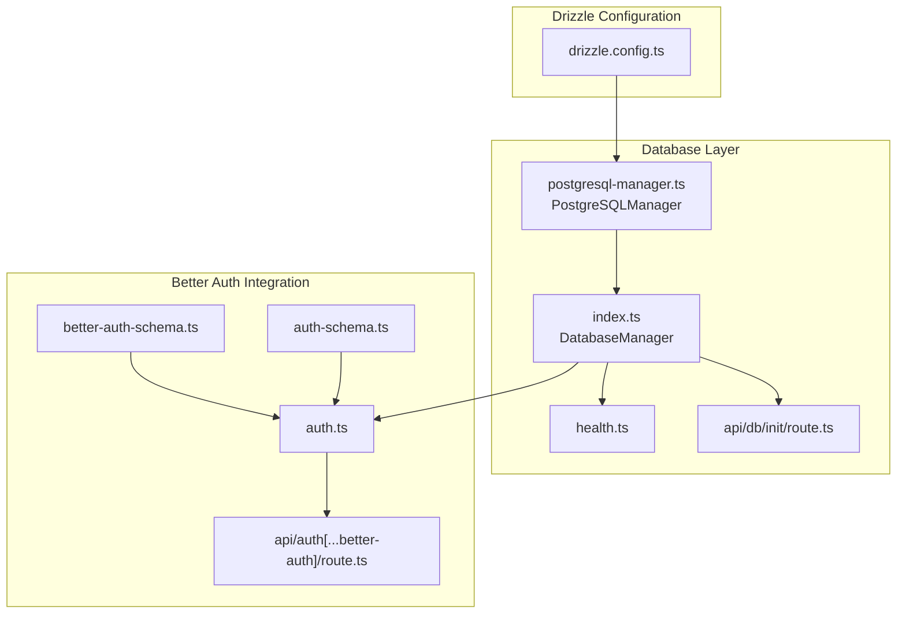
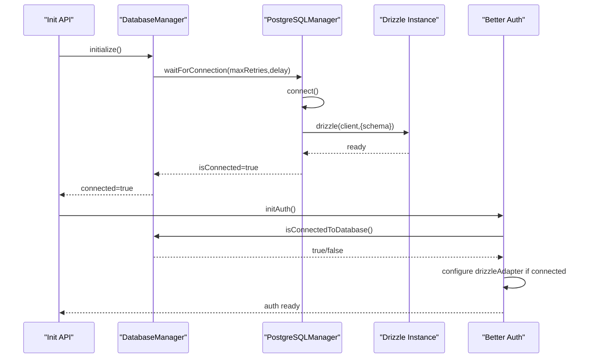
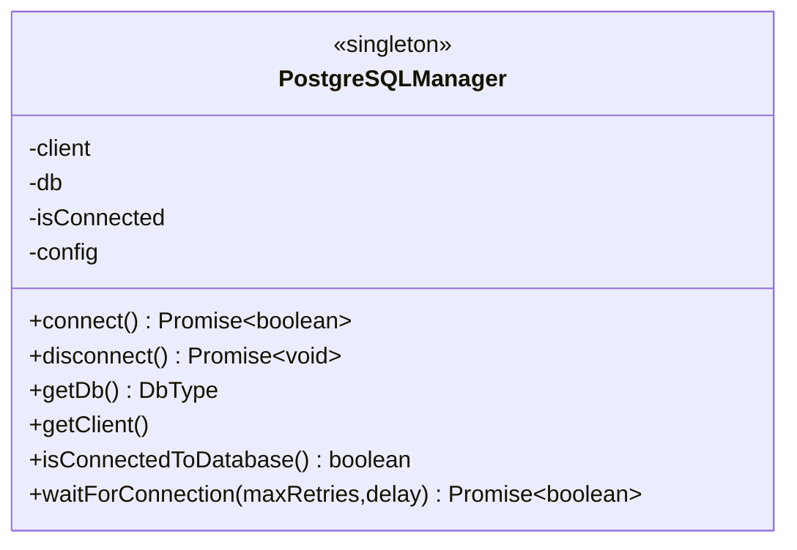
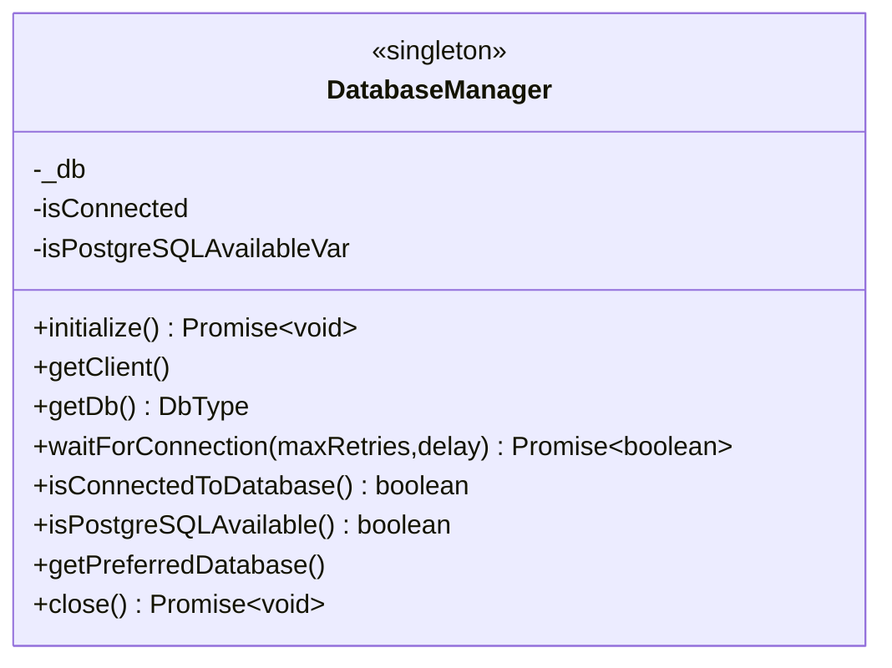
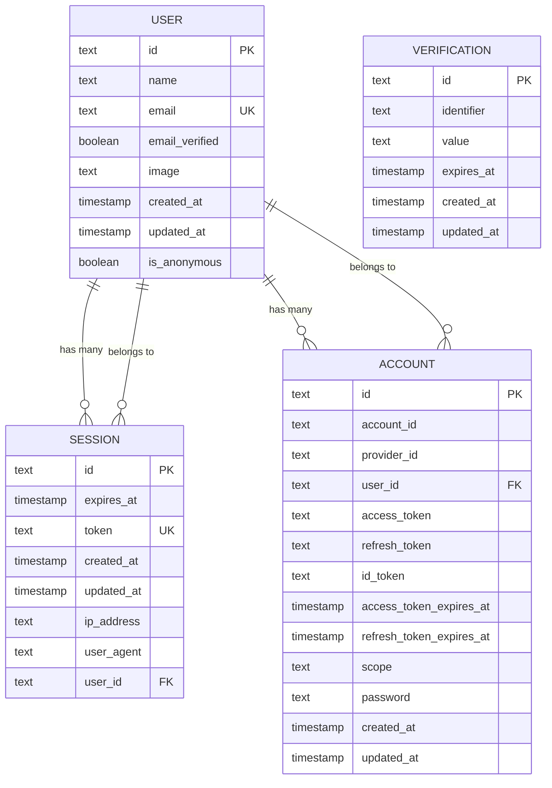
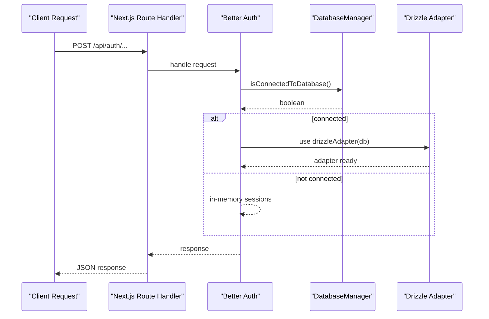
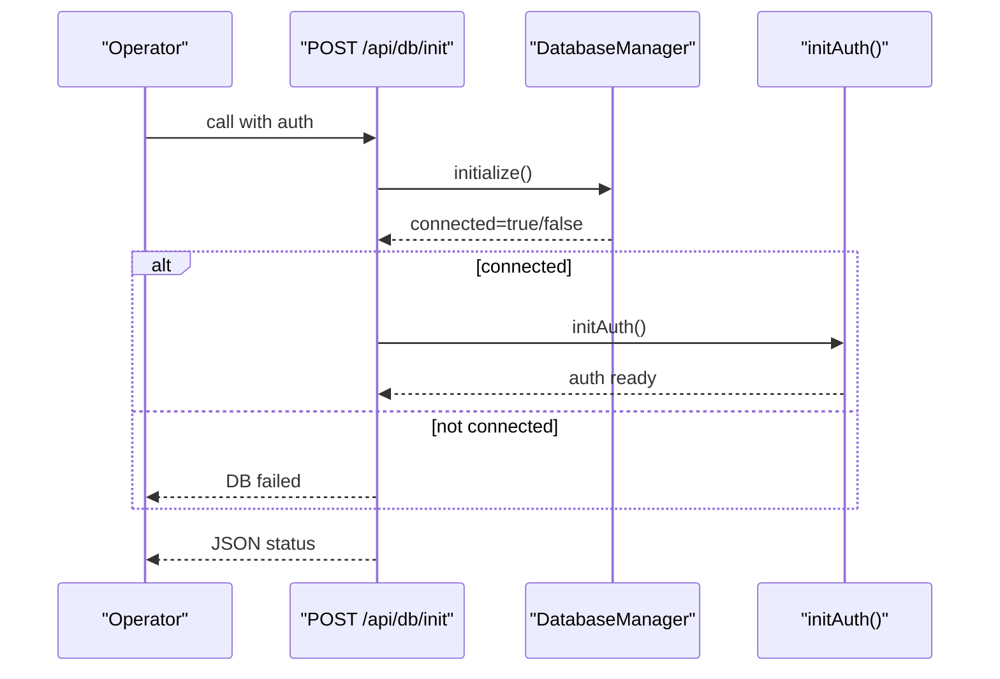
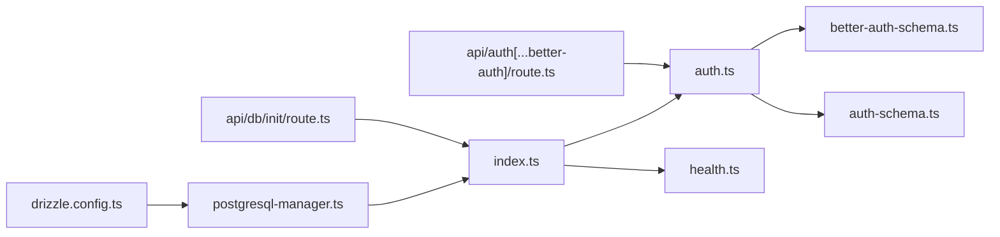

# ORM Integration

<cite>
**Referenced Files in This Document**
- [drizzle.config.ts](file://drizzle.config.ts)
- [auth-schema.ts](file://auth-schema.ts)
- [better-auth-schema.ts](file://src/lib/db/better-auth-schema.ts)
- [postgresql-manager.ts](file://src/lib/db/postgresql-manager.ts)
- [index.ts](file://src/lib/db/index.ts)
- [health.ts](file://src/lib/db/health.ts)
- [route.ts](file://src/app/api/db/init/route.ts)
- [auth.ts](file://src/lib/auth.ts)
- [route.ts](file://src/app/api/auth[...better-auth]/route.ts)
- [test-db-auth.ts](file://test-db-auth.ts)
</cite>

## Table of Contents
1. [Introduction](#introduction)
2. [Project Structure](#project-structure)
3. [Core Components](#core-components)
4. [Architecture Overview](#architecture-overview)
5. [Detailed Component Analysis](#detailed-component-analysis)
6. [Dependency Analysis](#dependency-analysis)
7. [Performance Considerations](#performance-considerations)
8. [Troubleshooting Guide](#troubleshooting-guide)
9. [Conclusion](#conclusion)

## Introduction
This document explains the Drizzle ORM integration in MatricMaster AI, focusing on configuration, connection management, type-safe query building, schema mapping, transactions, and Better Auth integration with custom database adapters. It also covers initialization flows, health checks, and practical patterns for CRUD and complex queries.

## Project Structure
The ORM integration centers around a PostgreSQL-first setup using Drizzle ORM with a thin abstraction layer for connection lifecycle and a dedicated schema for Better Auth. The key pieces are:
- Drizzle configuration for schema generation and migrations
- A PostgreSQL manager that encapsulates the database client and Drizzle instance
- A database manager singleton that exposes a unified interface
- Better Auth configured to use the Drizzle adapter when a database connection is available
- Health and initialization endpoints for operational visibility

**Diagram sources**
- [drizzle.config.ts](file://drizzle.config.ts#L1-L16)
- [postgresql-manager.ts](file://src/lib/db/postgresql-manager.ts#L1-L162)
- [index.ts](file://src/lib/db/index.ts#L1-L102)
- [health.ts](file://src/lib/db/health.ts#L1-L41)
- [route.ts](file://src/app/api/db/init/route.ts#L1-L100)
- [auth.ts](file://src/lib/auth.ts#L1-L86)
- [better-auth-schema.ts](file://src/lib/db/better-auth-schema.ts#L1-L107)
- [auth-schema.ts](file://auth-schema.ts#L1-L95)
- [route.ts](file://src/app/api/auth[...better-auth]/route.ts)

**Section sources**
- [drizzle.config.ts](file://drizzle.config.ts#L1-L16)
- [index.ts](file://src/lib/db/index.ts#L1-L102)
- [postgresql-manager.ts](file://src/lib/db/postgresql-manager.ts#L1-L162)
- [health.ts](file://src/lib/db/health.ts#L1-L41)
- [route.ts](file://src/app/api/db/init/route.ts#L1-L100)
- [auth.ts](file://src/lib/auth.ts#L1-L86)
- [better-auth-schema.ts](file://src/lib/db/better-auth-schema.ts#L1-L107)
- [auth-schema.ts](file://auth-schema.ts#L1-L95)

## Core Components
- Drizzle configuration defines dialect, schema path, migration output, casing, and credentials.
- PostgreSQLManager encapsulates the connection pool, SSL detection for specific providers, and connection testing.
- DatabaseManager is a singleton facade that exposes a unified API for consumers and handles graceful shutdown.
- Better Auth integrates with Drizzle via a custom adapter when the database is available; otherwise, it falls back to in-memory sessions.
- Health utilities provide runtime status and wait-for-database helpers.

Key responsibilities:
- Connection lifecycle and pooling
- Type-safe schema mapping
- Transaction readiness and error handling
- Operational health and initialization endpoints

**Section sources**
- [drizzle.config.ts](file://drizzle.config.ts#L1-L16)
- [postgresql-manager.ts](file://src/lib/db/postgresql-manager.ts#L1-L162)
- [index.ts](file://src/lib/db/index.ts#L1-L102)
- [auth.ts](file://src/lib/auth.ts#L1-L86)

## Architecture Overview
The system initializes the database connection early, then conditionally enables Better Auth persistence. The Drizzle adapter is supplied only when a live database is available.

**Diagram sources**
- [route.ts](file://src/app/api/db/init/route.ts#L30-L92)
- [index.ts](file://src/lib/db/index.ts#L24-L39)
- [postgresql-manager.ts](file://src/lib/db/postgresql-manager.ts#L42-L90)
- [auth.ts](file://src/lib/auth.ts#L72-L86)

## Detailed Component Analysis

### Drizzle Configuration
- Defines strict schema generation, output directory, PostgreSQL dialect, credential sourcing from environment, and snake_case casing.
- Ensures migrations and introspection target the correct schema file.

**Section sources**
- [drizzle.config.ts](file://drizzle.config.ts#L1-L16)

### PostgreSQL Manager
- Manages a singleton PostgreSQL client and Drizzle instance.
- Applies SSL requirements for specific providers and sets connection pool parameters.
- Provides connection testing with timeouts and graceful cleanup on failure or shutdown.
- Exposes getters for client and database handle and retry logic for connection establishment.

**Diagram sources**
- [postgresql-manager.ts](file://src/lib/db/postgresql-manager.ts#L18-L141)

**Section sources**
- [postgresql-manager.ts](file://src/lib/db/postgresql-manager.ts#L1-L162)

### Database Manager Singleton
- Wraps PostgreSQLManager and exposes a stable interface for the rest of the app.
- Handles graceful shutdown and ensures single connection lifecycle.
- Provides health helpers and availability checks.

**Diagram sources**
- [index.ts](file://src/lib/db/index.ts#L9-L87)

**Section sources**
- [index.ts](file://src/lib/db/index.ts#L1-L102)

### Schema Mapping and Type-Safe Queries
- Two schema variants coexist:
  - Legacy schema for user/session/account/verification with relations.
  - Better Auth schema with separate tables and relations.
- Both use Drizzle’s pg-table definitions and relations to infer insert/select types.
- Type exports enable strongly typed CRUD operations and query results.

**Diagram sources**
- [auth-schema.ts](file://auth-schema.ts#L4-L75)

**Section sources**
- [auth-schema.ts](file://auth-schema.ts#L1-L95)
- [better-auth-schema.ts](file://src/lib/db/better-auth-schema.ts#L1-L107)

### Better Auth Integration with Drizzle Adapter
- When the database is connected, Better Auth uses drizzleAdapter to persist sessions, users, accounts, and verifications.
- Social providers are loaded from environment variables; missing credentials are logged as warnings.
- Anonymous plugin is enabled for guest experiences.
- Session expiration and update intervals are configured centrally.

**Diagram sources**
- [auth.ts](file://src/lib/auth.ts#L9-L86)
- [route.ts](file://src/app/api/auth[...better-auth]/route.ts)

**Section sources**
- [auth.ts](file://src/lib/auth.ts#L1-L86)
- [route.ts](file://src/app/api/auth[...better-auth]/route.ts)

### Initialization and Health Endpoints
- An internal endpoint initializes the database and optionally initializes Better Auth, returning clear status messages.
- Health utilities expose connection state and provide wait-for-database logic for startup sequences.

**Diagram sources**
- [route.ts](file://src/app/api/db/init/route.ts#L30-L92)
- [index.ts](file://src/lib/db/index.ts#L24-L39)
- [auth.ts](file://src/lib/auth.ts#L72-L86)

**Section sources**
- [route.ts](file://src/app/api/db/init/route.ts#L1-L100)
- [health.ts](file://src/lib/db/health.ts#L1-L41)

### Transaction Handling Patterns
- Transactions are managed through the underlying Drizzle client. Use the client handle to wrap operations in transaction blocks when needed.
- Prefer wrapping multiple writes in a transaction to maintain atomicity and consistency.

Implementation pattern reference:
- Acquire the client from the manager and use it to run transactional operations.

**Section sources**
- [index.ts](file://src/lib/db/index.ts#L41-L46)
- [postgresql-manager.ts](file://src/lib/db/postgresql-manager.ts#L117-L122)

### Type Inference and Query Builder Usage
- Use $inferSelect/$inferInsert on tables to derive TypeScript types for rows and inserts.
- Build queries using the Drizzle instance; relations enable join-like reads with compile-time safety.
- Keep schema definitions centralized to propagate type updates automatically.

Example patterns (paths only):
- Define tables and relations in the schema files.
- Import inferred types from schema files for form handlers and services.

**Section sources**
- [better-auth-schema.ts](file://src/lib/db/better-auth-schema.ts#L95-L107)
- [auth-schema.ts](file://auth-schema.ts#L77-L94)

### CRUD and Complex Query Patterns
- Insert: Use the Drizzle instance with inferred insert types for type-safe inserts.
- Select: Use select queries with joins via relations for fetching related records.
- Update/Delete: Apply where clauses with inferred types; cascade constraints are defined in schema.
- Aggregation/complex filtering: Combine select, where, orderBy, limit/offset, and joins.

Reference paths:
- Use the Drizzle instance from the manager to perform operations.

**Section sources**
- [index.ts](file://src/lib/db/index.ts#L48-L57)
- [auth-schema.ts](file://auth-schema.ts#L77-L94)
- [better-auth-schema.ts](file://src/lib/db/better-auth-schema.ts#L75-L93)

## Dependency Analysis
- Drizzle configuration depends on environment variables for credentials.
- PostgreSQLManager depends on the external postgres client and Drizzle ORM.
- DatabaseManager depends on PostgreSQLManager and exposes a stable facade.
- Better Auth depends on DatabaseManager for connectivity and on Drizzle schema definitions for adapter mapping.
- Health utilities depend on DatabaseManager for status reporting.

**Diagram sources**
- [drizzle.config.ts](file://drizzle.config.ts#L1-L16)
- [postgresql-manager.ts](file://src/lib/db/postgresql-manager.ts#L1-L162)
- [index.ts](file://src/lib/db/index.ts#L1-L102)
- [auth.ts](file://src/lib/auth.ts#L1-L86)
- [better-auth-schema.ts](file://src/lib/db/better-auth-schema.ts#L1-L107)
- [auth-schema.ts](file://auth-schema.ts#L1-L95)
- [health.ts](file://src/lib/db/health.ts#L1-L41)
- [route.ts](file://src/app/api/db/init/route.ts#L1-L100)
- [route.ts](file://src/app/api/auth[...better-auth]/route.ts)

**Section sources**
- [drizzle.config.ts](file://drizzle.config.ts#L1-L16)
- [index.ts](file://src/lib/db/index.ts#L1-L102)
- [auth.ts](file://src/lib/auth.ts#L1-L86)

## Performance Considerations
- Connection pooling: Tune max connections and idle timeouts according to workload and provider limits.
- SSL for managed services: Automatic SSL enabling for specific providers reduces handshake overhead.
- Prepared statements: Disable prepared statements in the client configuration to reduce per-query overhead in some environments.
- Health checks: Use the provided health utilities to gate traffic until the database is ready.
- Indexes: Ensure indexes exist on frequently filtered/joined columns (as defined in schema).

[No sources needed since this section provides general guidance]

## Troubleshooting Guide
Common issues and remedies:
- Missing DATABASE_URL: The manager logs a clear error and fails to connect.
- Provider-specific SSL: For managed providers, SSL is enabled automatically; misconfiguration leads to connection failures.
- Connection timeouts: Adjust connection and idle timeouts in the manager configuration.
- Better Auth fallback: If the database is unavailable, Better Auth operates without persistent sessions; verify connectivity before expecting persisted sessions.
- Health checks: Use the health endpoints to confirm connectivity and readiness.

Operational references:
- Initialization endpoint returns explicit status and messages.
- Health utilities provide connection state and wait-for-database logic.

**Section sources**
- [postgresql-manager.ts](file://src/lib/db/postgresql-manager.ts#L47-L90)
- [route.ts](file://src/app/api/db/init/route.ts#L30-L92)
- [health.ts](file://src/lib/db/health.ts#L1-L41)
- [test-db-auth.ts](file://test-db-auth.ts#L1-L53)

## Conclusion
MatricMaster AI integrates Drizzle ORM with a robust PostgreSQL connection layer, a unified database manager, and a conditional Better Auth adapter. The schema definitions provide strong typing and relation mapping, while health and initialization endpoints support reliable deployment and runtime management. By leveraging the provided abstractions, developers can implement type-safe queries, manage transactions, and scale connection pools effectively.