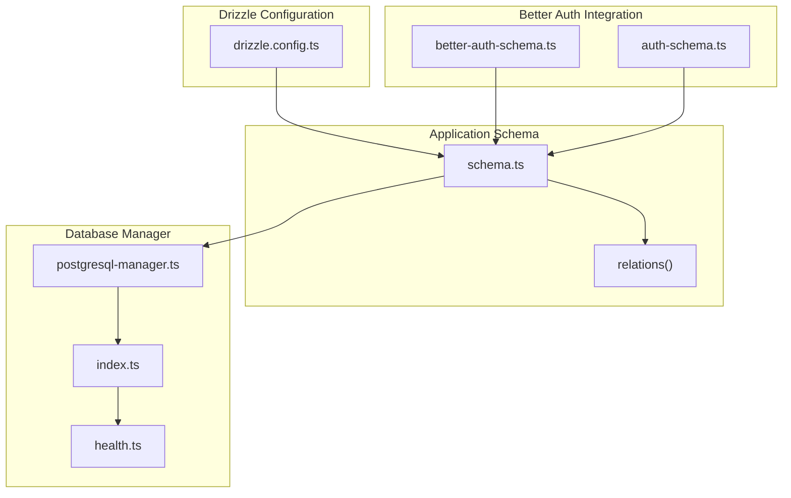
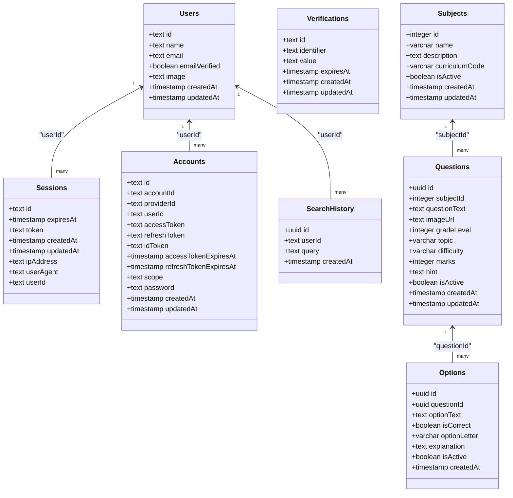
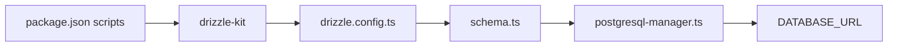

# Schema Design

<cite>
**Referenced Files in This Document**
- [drizzle.config.ts](file://drizzle.config.ts)
- [auth-schema.ts](file://auth-schema.ts)
- [better-auth-schema.ts](file://src/lib/db/better-auth-schema.ts)
- [schema.ts](file://src/lib/db/schema.ts)
- [postgresql-manager.ts](file://src/lib/db/postgresql-manager.ts)
- [index.ts](file://src/lib/db/index.ts)
- [health.ts](file://src/lib/db/health.ts)
- [package.json](file://package.json)
</cite>

## Table of Contents
1. [Introduction](#introduction)
2. [Project Structure](#project-structure)
3. [Core Components](#core-components)
4. [Architecture Overview](#architecture-overview)
5. [Detailed Component Analysis](#detailed-component-analysis)
6. [Dependency Analysis](#dependency-analysis)
7. [Performance Considerations](#performance-considerations)
8. [Troubleshooting Guide](#troubleshooting-guide)
9. [Conclusion](#conclusion)

## Introduction
This document describes the database schema design for MatricMaster AI, focusing on the Drizzle ORM integration, entity relationships, constraints, indexes, and Better Auth schema extensions. It covers the core application tables (users, sessions, accounts, subjects, questions, options, and search history) and explains how Better Auth tables are integrated and aliased for consistency. It also documents Drizzle ORM patterns, referential integrity, data validation rules, lifecycle management, and indexing strategies for performance.

## Project Structure
The database layer is organized around Drizzle ORM with a central schema definition and a PostgreSQL manager. Better Auth tables are integrated via a dedicated schema module and exported under consistent names to align with the application’s naming conventions.

**Diagram sources**
- [drizzle.config.ts](file://drizzle.config.ts#L6-L15)
- [better-auth-schema.ts](file://src/lib/db/better-auth-schema.ts#L1-L107)
- [auth-schema.ts](file://auth-schema.ts#L1-L95)
- [schema.ts](file://src/lib/db/schema.ts#L1-L160)
- [postgresql-manager.ts](file://src/lib/db/postgresql-manager.ts#L1-L162)
- [index.ts](file://src/lib/db/index.ts#L1-L102)
- [health.ts](file://src/lib/db/health.ts#L1-L40)

**Section sources**
- [drizzle.config.ts](file://drizzle.config.ts#L1-L16)
- [schema.ts](file://src/lib/db/schema.ts#L1-L160)
- [better-auth-schema.ts](file://src/lib/db/better-auth-schema.ts#L1-L107)
- [auth-schema.ts](file://auth-schema.ts#L1-L95)
- [postgresql-manager.ts](file://src/lib/db/postgresql-manager.ts#L1-L162)
- [index.ts](file://src/lib/db/index.ts#L1-L102)
- [health.ts](file://src/lib/db/health.ts#L1-L40)

## Core Components
- Drizzle configuration defines dialect, schema path, casing, and credentials.
- Better Auth schema provides core authentication tables and relations.
- Application schema composes Better Auth tables with custom application tables and relations.
- PostgreSQL manager encapsulates connection lifecycle, SSL handling, and health checks.
- Database manager provides a singleton wrapper for safe initialization and graceful shutdown.

Key integration points:
- Better Auth tables are imported and re-exported under consistent names (e.g., users → user).
- Application tables (subjects, questions, options, search_history) are defined alongside Better Auth tables in the same schema module.
- Relations are defined to enforce referential integrity and support joins.

**Section sources**
- [drizzle.config.ts](file://drizzle.config.ts#L6-L15)
- [better-auth-schema.ts](file://src/lib/db/better-auth-schema.ts#L1-L107)
- [schema.ts](file://src/lib/db/schema.ts#L14-L27)
- [postgresql-manager.ts](file://src/lib/db/postgresql-manager.ts#L18-L141)
- [index.ts](file://src/lib/db/index.ts#L9-L87)

## Architecture Overview
The schema architecture integrates Better Auth tables with application-specific tables. The Drizzle ORM manages type-safe queries and relations, while the PostgreSQL manager handles connectivity and lifecycle.

**Diagram sources**
- [better-auth-schema.ts](file://src/lib/db/better-auth-schema.ts#L5-L73)
- [schema.ts](file://src/lib/db/schema.ts#L42-L141)

**Section sources**
- [better-auth-schema.ts](file://src/lib/db/better-auth-schema.ts#L1-L107)
- [schema.ts](file://src/lib/db/schema.ts#L1-L160)

## Detailed Component Analysis

### Better Auth Tables and Relations
- users: Primary table for user identity with unique email and timestamps. Includes an index on email.
- sessions: Stores user sessions with token uniqueness, expiry, and IP/user agent metadata. Foreign key to users with cascade delete.
- accounts: Integrates third-party and password-based providers with tokens and scopes. Foreign key to users with cascade delete.
- verifications: Stores verification records keyed by identifier.
- Relations: users has many sessions and accounts; sessions and accounts both belong to users.

Constraints and indexes:
- Unique constraints: email on users, token on sessions, composite provider/account on accounts.
- Indexes: email on users, token and userId on sessions, userId and provider/providerId+accountId on accounts.

**Section sources**
- [better-auth-schema.ts](file://src/lib/db/better-auth-schema.ts#L5-L73)
- [better-auth-schema.ts](file://src/lib/db/better-auth-schema.ts#L76-L93)

### Application Tables and Relations
- subjects: Academic subjects with unique name and curriculum code, activity flag, and timestamps.
- questions: Quiz questions linked to subjects, with indexes on subjectId, gradeLevel, topic, difficulty, and isActive. Defaults for difficulty and marks are defined.
- options: Answer options per question, with correctness flag and letter, and isActive flag.
- search_history: Tracks user search queries with timestamps and indexes on userId and createdAt.

Relations:
- subjects → questions (one-to-many)
- questions → options (one-to-many)
- users → search_history (one-to-many)

Constraints and defaults:
- Cascade deletes from subjects and questions to dependent rows.
- Default values for difficulty and marks on questions.
- Default isActive=true for subjects and questions; default isActive=false for options.

**Section sources**
- [schema.ts](file://src/lib/db/schema.ts#L42-L91)
- [schema.ts](file://src/lib/db/schema.ts#L120-L141)
- [schema.ts](file://src/lib/db/schema.ts#L97-L114)

### Drizzle ORM Integration Patterns
- Table definitions use pg-core types (text, varchar, integer, uuid, boolean, timestamp).
- Relations are defined via relations() with explicit fields/references.
- Composite indexes are declared per table block for performance.
- Schema is passed to drizzle via the PostgreSQL manager.

**Section sources**
- [schema.ts](file://src/lib/db/schema.ts#L1-L12)
- [schema.ts](file://src/lib/db/schema.ts#L70-L78)
- [schema.ts](file://src/lib/db/schema.ts#L130-L134)
- [postgresql-manager.ts](file://src/lib/db/postgresql-manager.ts#L67-L67)

### Better Auth Schema Integration Details
- The application schema imports Better Auth tables and re-exports them under consistent names (e.g., users as user).
- This ensures unified access to authentication tables across the app while preserving Better Auth’s internal structure.

**Section sources**
- [schema.ts](file://src/lib/db/schema.ts#L14-L27)
- [better-auth-schema.ts](file://src/lib/db/better-auth-schema.ts#L5-L19)

### Data Validation Rules and Business Constraints
- Not-null constraints on essential fields (e.g., name, email, questionText, topic, gradeLevel).
- Unique constraints on identifiers (email, token).
- Defaults for business-sensitive fields (difficulty, marks, isActive).
- Cascade deletes maintain referential integrity across parent-child relationships.

**Section sources**
- [better-auth-schema.ts](file://src/lib/db/better-auth-schema.ts#L8-L14)
- [schema.ts](file://src/lib/db/schema.ts#L55-L68)
- [schema.ts](file://src/lib/db/schema.ts#L82-L91)

### Data Lifecycle Management
- Timestamps: createdAt defaults to current time; updatedAt uses $onUpdate to refresh on updates.
- Expiry: sessions include expiresAt for session lifecycle.
- Activity flags: isActive toggles visibility/filtering for subjects, questions, and options.

**Section sources**
- [better-auth-schema.ts](file://src/lib/db/better-auth-schema.ts#L13-L14)
- [schema.ts](file://src/lib/db/schema.ts#L48-L49)
- [schema.ts](file://src/lib/db/schema.ts#L67-L68)
- [schema.ts](file://src/lib/db/schema.ts#L89-L89)

## Dependency Analysis
The schema depends on Drizzle ORM and PostgreSQL driver. Scripts in package.json orchestrate schema generation, migration, seeding, and studio access.

**Diagram sources**
- [package.json](file://package.json#L6-L26)
- [drizzle.config.ts](file://drizzle.config.ts#L6-L15)
- [schema.ts](file://src/lib/db/schema.ts#L1-L160)
- [postgresql-manager.ts](file://src/lib/db/postgresql-manager.ts#L31-L36)

**Section sources**
- [package.json](file://package.json#L6-L26)
- [drizzle.config.ts](file://drizzle.config.ts#L1-L16)
- [schema.ts](file://src/lib/db/schema.ts#L1-L160)
- [postgresql-manager.ts](file://src/lib/db/postgresql-manager.ts#L1-L162)

## Performance Considerations
Indexing strategies:
- sessions: Index on userId for fast lookup by user; token index for token-based retrieval.
- accounts: Index on userId; composite index on providerId and accountId for provider-scoped lookups.
- subjects: Unique name and curriculum code for fast filtering and deduplication.
- questions: Multi-column indexes on subjectId, gradeLevel, topic, difficulty, and isActive to optimize filtering and pagination.
- search_history: Indexes on userId and createdAt to accelerate user query logs and recent searches.

Connection and runtime:
- SSL is enabled for Neon-hosted connections.
- Connection pooling and timeouts are configurable.
- Health checks and graceful shutdown are supported.

**Section sources**
- [better-auth-schema.ts](file://src/lib/db/better-auth-schema.ts#L16-L38)
- [schema.ts](file://src/lib/db/schema.ts#L70-L78)
- [schema.ts](file://src/lib/db/schema.ts#L130-L134)
- [postgresql-manager.ts](file://src/lib/db/postgresql-manager.ts#L55-L65)
- [health.ts](file://src/lib/db/health.ts#L1-L40)

## Troubleshooting Guide
Common issues and remedies:
- Connection failures: Verify DATABASE_URL and network access; check Neon SSL requirements; use waitForConnection to retry.
- Schema mismatch: Run schema generation and push commands from package.json scripts.
- Health checks: Use health endpoints to confirm connectivity and status.
- Graceful shutdown: Ensure process signals trigger disconnection to prevent resource leaks.

Operational commands:
- Generate migrations: npm run db:generate
- Push schema: npm run db:push
- Studio: npm run db:studio
- Seed data: npm run db:seed
- Reset DB: npm run db:reset

**Section sources**
- [postgresql-manager.ts](file://src/lib/db/postgresql-manager.ts#L52-L90)
- [health.ts](file://src/lib/db/health.ts#L1-L40)
- [package.json](file://package.json#L20-L26)

## Conclusion
MatricMaster AI’s schema leverages Drizzle ORM for type-safe, relation-driven database operations. Better Auth tables are integrated seamlessly and aliased for consistency, while application tables extend the model with quiz and search capabilities. Strong constraints, defaults, and indexes ensure data integrity and query performance. The PostgreSQL manager and health utilities provide robust runtime behavior and operational controls.