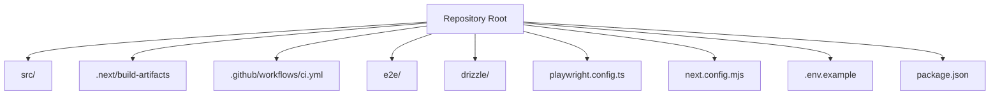
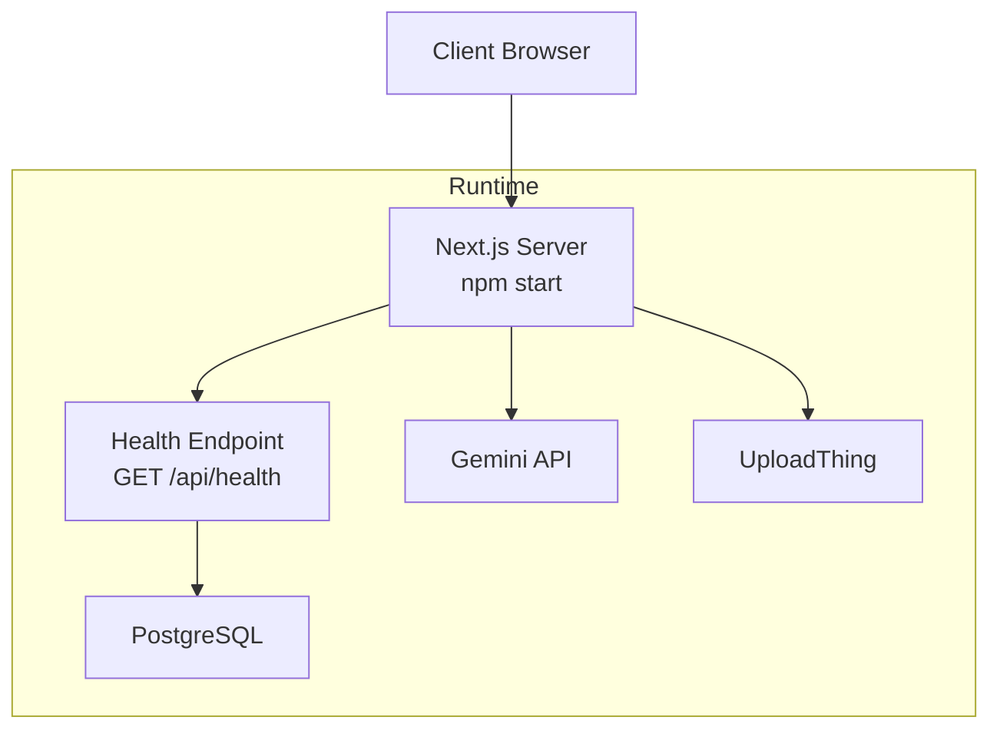
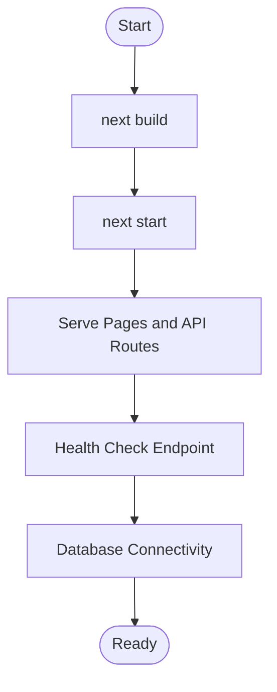
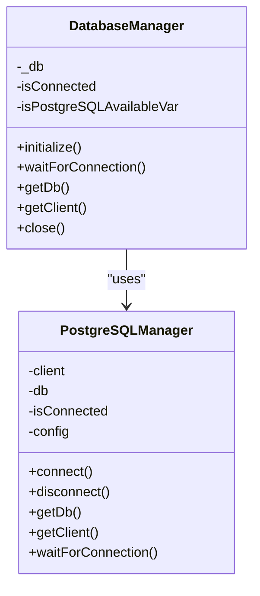
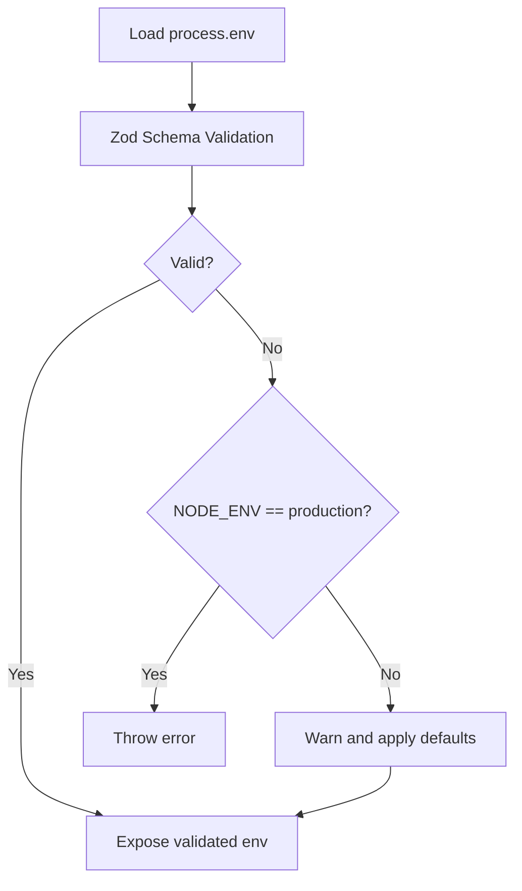
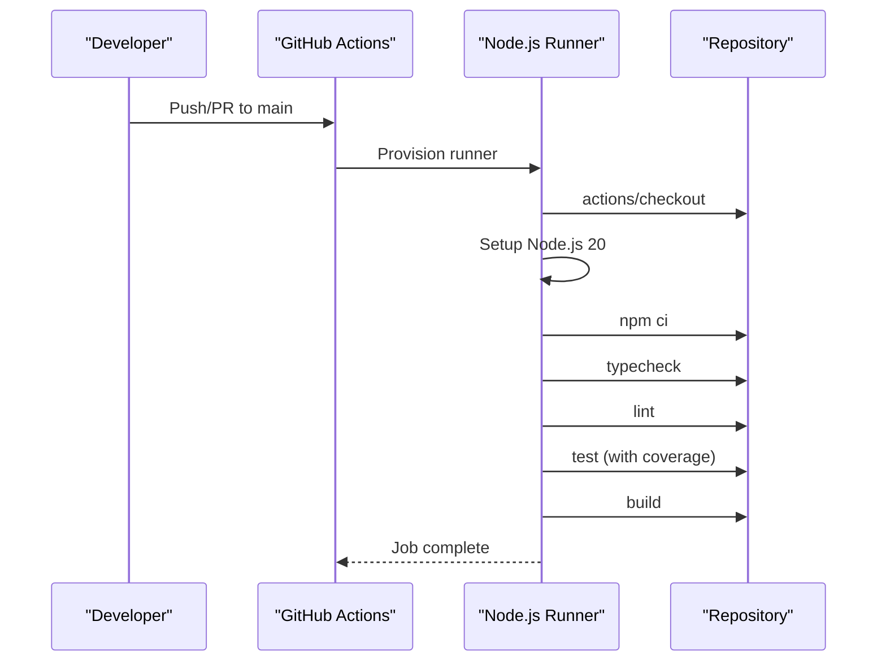
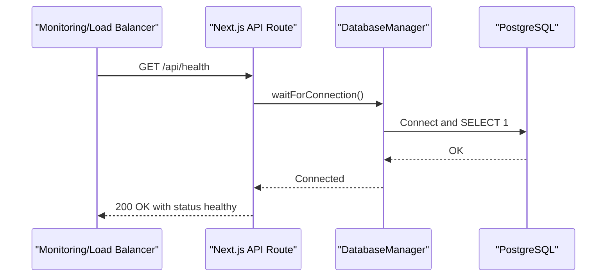
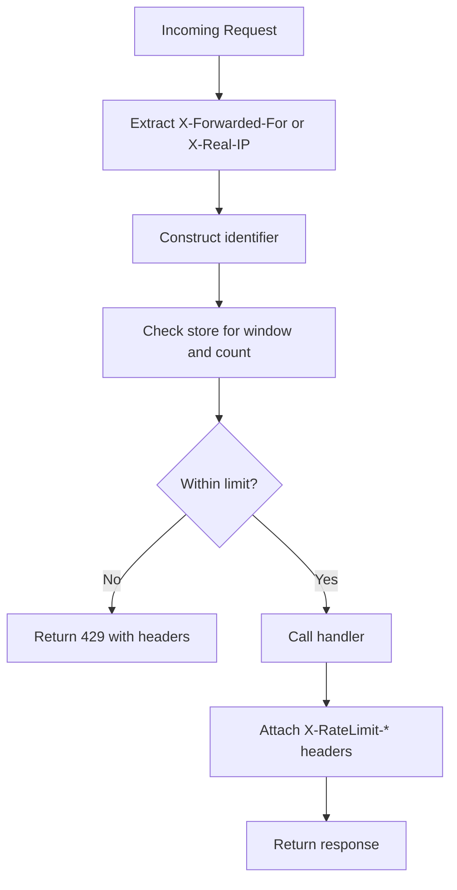
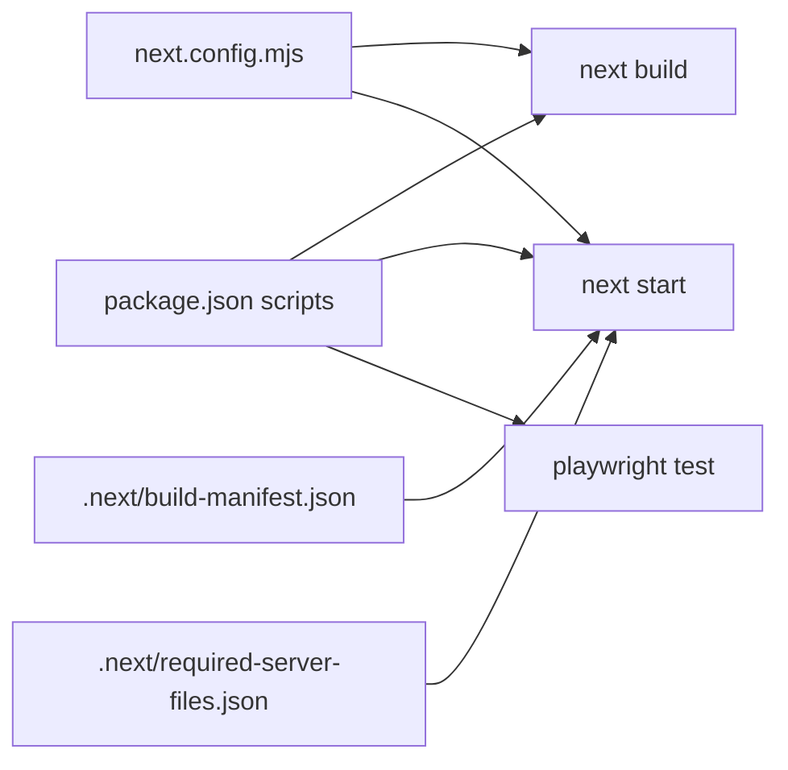

# Deployment and Operations

<cite>
**Referenced Files in This Document**
- [package.json](file://package.json)
- [README.md](file://README.md)
- [SETUP_LOCAL_DB.md](file://SETUP_LOCAL_DB.md)
- [.github/workflows/ci.yml](file://.github/workflows/ci.yml)
- [playwright.config.ts](file://playwright.config.ts)
- [next.config.mjs](file://next.config.mjs)
- [.next/build-manifest.json](file://.next/build-manifest.json)
- [.next/required-server-files.json](file://.next/required-server-files.json)
- [.env.example](file://.env.example)
- [src/lib/env.ts](file://src/lib/env.ts)
- [src/app/api/health/route.ts](file://src/app/api/health/route.ts)
- [src/lib/api-utils.ts](file://src/lib/api-utils.ts)
- [src/lib/db/index.ts](file://src/lib/db/index.ts)
- [src/lib/db/postgresql-manager.ts](file://src/lib/db/postgresql-manager.ts)
- [src/lib/db/schema.ts](file://src/lib/db/schema.ts)
- [drizzle.config.ts](file://drizzle.config.ts)
</cite>

## Table of Contents
1. [Introduction](#introduction)
2. [Project Structure](#project-structure)
3. [Core Components](#core-components)
4. [Architecture Overview](#architecture-overview)
5. [Detailed Component Analysis](#detailed-component-analysis)
6. [Dependency Analysis](#dependency-analysis)
7. [Performance Considerations](#performance-considerations)
8. [Troubleshooting Guide](#troubleshooting-guide)
9. [Conclusion](#conclusion)
10. [Appendices](#appendices)

## Introduction
This document provides comprehensive deployment and operations guidance for MatricMaster AI. It covers production deployment, build optimization, environment configuration, CI/CD with GitHub Actions, automated testing, database setup, external service integrations, performance optimization, monitoring/logging, deployment topology, scaling, disaster recovery, security hardening, and operational best practices for hosting an educational platform.

## Project Structure
MatricMaster AI is a Next.js 16 application using the App Router. The repository includes:
- Application code under src/
- Next.js build artifacts under .next/
- CI/CD under .github/workflows/
- E2E tests under e2e/ with Playwright configuration
- Database tooling with Drizzle ORM and PostgreSQL

**Section sources**
- [README.md](file://README.md#L88-L105)
- [package.json](file://package.json#L1-L84)

## Core Components
- Build and runtime: Next.js 16 with Turbopack and optimized image handling
- Database: PostgreSQL via Drizzle ORM with connection pooling and graceful shutdown
- Authentication: Better Auth with social providers
- AI integration: Google Gemini API
- File uploads: UploadThing
- Health monitoring: Health endpoint validating DB connectivity
- CI/CD: GitHub Actions workflow for linting, type-checking, testing, and building

**Section sources**
- [next.config.mjs](file://next.config.mjs#L1-L33)
- [src/lib/db/postgresql-manager.ts](file://src/lib/db/postgresql-manager.ts#L1-L162)
- [src/lib/db/index.ts](file://src/lib/db/index.ts#L1-L102)
- [src/app/api/health/route.ts](file://src/app/api/health/route.ts#L1-L30)
- [.github/workflows/ci.yml](file://.github/workflows/ci.yml#L1-L37)
- [package.json](file://package.json#L1-L84)

## Architecture Overview
The production runtime consists of:
- Web server: Next.js server started via npm start
- Database: PostgreSQL (local or managed provider such as Neon)
- AI services: Google Gemini API
- File storage: UploadThing
- Monitoring: Health endpoint and logs

**Diagram sources**
- [src/app/api/health/route.ts](file://src/app/api/health/route.ts#L1-L30)
- [src/lib/db/index.ts](file://src/lib/db/index.ts#L1-L102)
- [src/lib/db/postgresql-manager.ts](file://src/lib/db/postgresql-manager.ts#L1-L162)

## Detailed Component Analysis

### Build and Runtime Configuration
- Build command: next build
- Start command: next start
- Development server: next dev
- Image optimization: remotePatterns configured for safe image sources
- Console removal in production: removeConsole excludes error/warn in production builds
- Cache and stale behavior: Next.js experimental caching and stale/revalidate/expire windows configured

**Diagram sources**
- [package.json](file://package.json#L6-L10)
- [next.config.mjs](file://next.config.mjs#L1-L33)
- [.next/required-server-files.json](file://.next/required-server-files.json#L109-L116)

**Section sources**
- [package.json](file://package.json#L6-L10)
- [next.config.mjs](file://next.config.mjs#L1-L33)
- [.next/required-server-files.json](file://.next/required-server-files.json#L109-L116)

### Database Layer
- Drizzle ORM with PostgreSQL schema
- Singleton PostgreSQL manager with connection pooling and timeouts
- Graceful shutdown on SIGTERM/SIGINT
- Neon-specific SSL handling when connection string includes neon.tech
- Health endpoint validates DB connectivity

**Diagram sources**
- [src/lib/db/index.ts](file://src/lib/db/index.ts#L9-L87)
- [src/lib/db/postgresql-manager.ts](file://src/lib/db/postgresql-manager.ts#L18-L141)

**Section sources**
- [src/lib/db/schema.ts](file://src/lib/db/schema.ts#L1-L160)
- [src/lib/db/postgresql-manager.ts](file://src/lib/db/postgresql-manager.ts#L1-L162)
- [src/lib/db/index.ts](file://src/lib/db/index.ts#L1-L102)
- [drizzle.config.ts](file://drizzle.config.ts#L1-L16)

### Environment Variable Management
- Strong typing and validation via Zod schema
- Production strictness: invalid env triggers failure
- Development fallbacks with warnings
- Required keys enforced via helper functions

**Diagram sources**
- [src/lib/env.ts](file://src/lib/env.ts#L1-L62)

**Section sources**
- [src/lib/env.ts](file://src/lib/env.ts#L1-L62)
- [.env.example](file://.env.example#L1-L19)

### CI/CD Pipeline with GitHub Actions
- Triggers: push and pull_request to main/master
- Steps: checkout → setup Node.js 20 → install dependencies → typecheck → lint → test with coverage → build
- Parallelization: workers reduced on CI for stability

**Diagram sources**
- [.github/workflows/ci.yml](file://.github/workflows/ci.yml#L1-L37)

**Section sources**
- [.github/workflows/ci.yml](file://.github/workflows/ci.yml#L1-L37)
- [playwright.config.ts](file://playwright.config.ts#L1-L61)

### Health Monitoring
- Health endpoint performs DB connectivity check with timeout
- Returns structured JSON with status and timestamps
- Useful for readiness probes and uptime monitoring

**Diagram sources**
- [src/app/api/health/route.ts](file://src/app/api/health/route.ts#L1-L30)
- [src/lib/db/index.ts](file://src/lib/db/index.ts#L59-L63)
- [src/lib/db/postgresql-manager.ts](file://src/lib/db/postgresql-manager.ts#L128-L140)

**Section sources**
- [src/app/api/health/route.ts](file://src/app/api/health/route.ts#L1-L30)

### Rate Limiting Utilities
- In-process rate limiter keyed by IP with sliding window semantics
- Headers expose limits and reset times
- Middleware wrapper applies per-route rate limiting

**Diagram sources**
- [src/lib/api-utils.ts](file://src/lib/api-utils.ts#L18-L78)

**Section sources**
- [src/lib/api-utils.ts](file://src/lib/api-utils.ts#L1-L93)

### External Services Integration
- AI: Google Gemini API key via environment variable
- File Uploads: UploadThing token
- Social Providers: Better Auth with Google/Facebook client credentials

**Section sources**
- [.env.example](file://.env.example#L1-L19)
- [src/lib/env.ts](file://src/lib/env.ts#L1-L62)

## Dependency Analysis
- Next.js configuration influences build outputs and runtime behavior
- Build manifest lists chunk and polyfill files for production delivery
- Required server files include cache policies and experimental flags
- Package scripts orchestrate build, start, lint, test, and DB operations

**Diagram sources**
- [package.json](file://package.json#L6-L26)
- [next.config.mjs](file://next.config.mjs#L1-L33)
- [.next/build-manifest.json](file://.next/build-manifest.json#L1-L21)
- [.next/required-server-files.json](file://.next/required-server-files.json#L1-L345)

**Section sources**
- [package.json](file://package.json#L1-L84)
- [next.config.mjs](file://next.config.mjs#L1-L33)
- [.next/build-manifest.json](file://.next/build-manifest.json#L1-L21)
- [.next/required-server-files.json](file://.next/required-server-files.json#L1-L345)

## Performance Considerations
- Build-time optimizations:
  - removeConsole in production reduces bundle console calls
  - optimizePackageImports for UI libraries
  - image optimization with remotePatterns and formats
- Runtime caching:
  - Next.js cache durations and stale/revalidate/expire windows
  - Turbopack and server minification enabled
- Database:
  - Connection pooling and idle timeouts
  - Graceful shutdown on signals
- Recommendations:
  - Enable gzip/HTTP compression at the platform level
  - Use CDN for static assets and images
  - Monitor DB connection counts and adjust max connections
  - Implement circuit breakers for AI and UploadThing upstreams

[No sources needed since this section provides general guidance]

## Troubleshooting Guide
Common production issues and resolutions:
- Health check failing:
  - Verify DATABASE_URL and DB reachability
  - Confirm PostgreSQL connection pool and timeouts
  - Check Neon SSL requirement when applicable
- Environment errors:
  - Validate required env variables with Zod schema
  - Ensure NODE_ENV is set appropriately for production
- Build failures:
  - Review Next.js build manifest and required server files
  - Confirm Node.js version compatibility
- E2E test failures:
  - Use Playwright reporter and traces for diagnosis
  - Adjust baseURL and worker settings for CI

**Section sources**
- [src/app/api/health/route.ts](file://src/app/api/health/route.ts#L1-L30)
- [src/lib/db/postgresql-manager.ts](file://src/lib/db/postgresql-manager.ts#L55-L65)
- [src/lib/env.ts](file://src/lib/env.ts#L30-L41)
- [.next/required-server-files.json](file://.next/required-server-files.json#L109-L116)
- [playwright.config.ts](file://playwright.config.ts#L18-L27)

## Conclusion
MatricMaster AI is structured for reliable production deployment with strong typing for environment variables, robust database connectivity, and a tested CI/CD pipeline. By following the outlined deployment topology, performance tuning, monitoring, and security practices, the platform can be operated safely and efficiently in production.

[No sources needed since this section summarizes without analyzing specific files]

## Appendices

### A. Production Deployment Topology
- Single-region deployment:
  - Web tier: Next.js server behind a reverse proxy or platform-provided router
  - Data tier: PostgreSQL (managed or self-hosted)
  - External services: Gemini API, UploadThing
- Multi-region considerations:
  - Geo-replicated DB for HA
  - CDN for global asset delivery
  - Regional API gateways for latency

[No sources needed since this section provides general guidance]

### B. Scaling Considerations
- Horizontal scaling:
  - Stateless Next.js instances behind a load balancer
  - Auto-scaling groups with CPU/memory metrics
- Database scaling:
  - Read replicas for reporting queries
  - Connection pool sizing aligned to instance capacity
- AI and file services:
  - Circuit breakers and retries
  - Caching of AI responses where appropriate

[No sources needed since this section provides general guidance]

### C. Disaster Recovery Procedures
- Backup strategy:
  - Automated DB snapshots (daily/weekly)
  - Versioned artifact backups for .next and static assets
- Recovery plan:
  - DR drill with failover to secondary region
  - Rollback to last known good release
  - Health endpoint validation post-restore

[No sources needed since this section provides general guidance]

### D. Security Hardening and SSL/TLS
- Environment variables:
  - Store secrets in platform vaults; avoid committing to repo
  - Enforce strict schema validation in production
- Transport security:
  - Require HTTPS at platform level
  - Enable TLS 1.2+ and modern cipher suites
- Database:
  - Use SSL for managed providers (e.g., Neon)
  - Restrict DB access to internal networks and VPC peering

**Section sources**
- [src/lib/db/postgresql-manager.ts](file://src/lib/db/postgresql-manager.ts#L55-L65)
- [src/lib/env.ts](file://src/lib/env.ts#L30-L41)

### E. Monitoring and Logging
- Health endpoint:
  - Integrate with load balancer health checks
  - Alert on degraded/unhealthy responses
- Logs:
  - Capture application logs and DB connection events
  - Centralize logs for correlation and alerting
- Metrics:
  - Track response times, error rates, DB connection pool utilization

**Section sources**
- [src/app/api/health/route.ts](file://src/app/api/health/route.ts#L1-L30)
- [src/lib/db/postgresql-manager.ts](file://src/lib/db/postgresql-manager.ts#L147-L157)

### F. Maintenance Procedures
- Routine tasks:
  - Apply DB migrations via Drizzle CLI
  - Rotate secrets and update environment variables
  - Review and prune unused dependencies
- Patching:
  - Validate updates in staging before production rollout
  - Use blue-green deployments to minimize downtime

[No sources needed since this section provides general guidance]

### G. Rollback and Incident Response
- Rollback:
  - Keep previous .next builds and artifacts
  - Use immutable tags for releases
- Incident response:
  - Define escalation paths and communication plans
  - Conduct post-mortems and update runbooks

[No sources needed since this section provides general guidance]