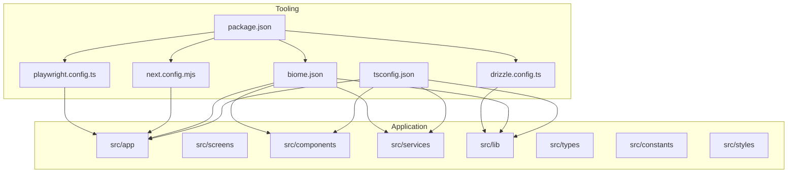
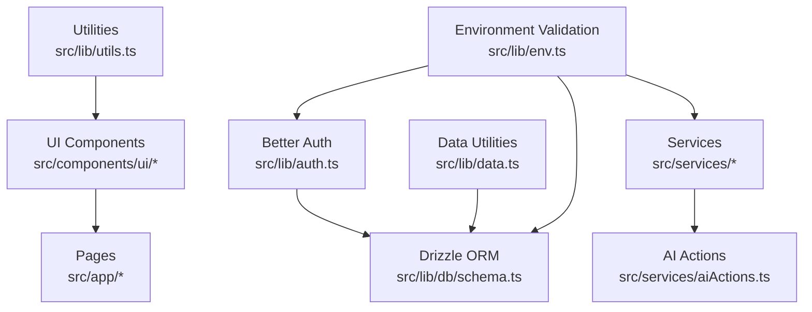
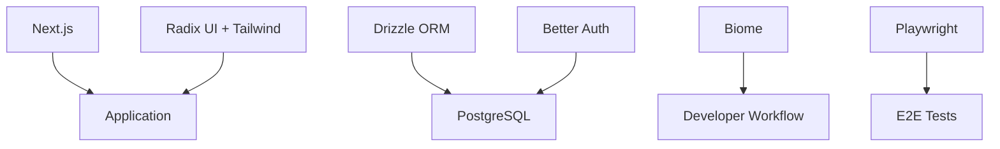

# Development Guidelines

<cite>
**Referenced Files in This Document**
- [package.json](file://package.json)
- [tsconfig.json](file://tsconfig.json)
- [biome.json](file://biome.json)
- [drizzle.config.ts](file://drizzle.config.ts)
- [next.config.mjs](file://next.config.mjs)
- [playwright.config.ts](file://playwright.config.ts)
- [MODERNIZATION.md](file://MODERNIZATION.md)
- [SETUP_LOCAL_DB.md](file://SETUP_LOCAL_DB.md)
- [src/lib/env.ts](file://src/lib/env.ts)
- [src/lib/db/schema.ts](file://src/lib/db/schema.ts)
- [src/lib/auth.ts](file://src/lib/auth.ts)
- [src/app/layout.tsx](file://src/app/layout.tsx)
- [src/components/ui/button.tsx](file://src/components/ui/button.tsx)
- [src/services/geminiService.ts](file://src/services/geminiService.ts)
- [src/lib/utils.ts](file://src/lib/utils.ts)
- [src/lib/data.ts](file://src/lib/data.ts)
</cite>

## Table of Contents
1. [Introduction](#introduction)
2. [Project Structure](#project-structure)
3. [Core Components](#core-components)
4. [Architecture Overview](#architecture-overview)
5. [Detailed Component Analysis](#detailed-component-analysis)
6. [Dependency Analysis](#dependency-analysis)
7. [Performance Considerations](#performance-considerations)
8. [Troubleshooting Guide](#troubleshooting-guide)
9. [Conclusion](#conclusion)
10. [Appendices](#appendices)

## Introduction
This document provides comprehensive development guidelines for contributors working on the MatricMaster AI project. It covers code standards (TypeScript configuration, Biome linting and formatting), component development patterns, architectural guidelines, database workflows, environment configuration, build and deployment processes, modernization and refactoring practices, testing methodologies, code review and QA processes, troubleshooting, and optimization strategies for efficient development.

## Project Structure
The project follows a Next.js application layout with a clear separation of concerns:
- Application pages under src/app
- UI components under src/components
- Services under src/services
- Libraries and utilities under src/lib
- Screens under src/screens
- Types under src/types
- Constants and mock data under src/constants
- Styles under src/styles
- E2E tests under e2e

**Diagram sources**
- [package.json](file://package.json#L1-L84)
- [tsconfig.json](file://tsconfig.json#L1-L41)
- [biome.json](file://biome.json#L1-L67)
- [next.config.mjs](file://next.config.mjs#L1-L33)
- [drizzle.config.ts](file://drizzle.config.ts#L1-L16)
- [playwright.config.ts](file://playwright.config.ts#L1-L61)

**Section sources**
- [package.json](file://package.json#L1-L84)
- [tsconfig.json](file://tsconfig.json#L1-L41)
- [biome.json](file://biome.json#L1-L67)
- [next.config.mjs](file://next.config.mjs#L1-L33)
- [drizzle.config.ts](file://drizzle.config.ts#L1-L16)
- [playwright.config.ts](file://playwright.config.ts#L1-L61)

## Core Components
- TypeScript configuration enforces strict typing, path aliases, incremental builds, and bundler module resolution.
- Biome provides fast linting and formatting with a curated rule set and formatter preferences.
- Next.js configuration enables image optimization, console removal in production, and package import optimization.
- Drizzle ORM configuration defines schema location, dialect, and casing conventions.
- Playwright configuration sets up cross-browser E2E testing with local dev server integration.

**Section sources**
- [tsconfig.json](file://tsconfig.json#L1-L41)
- [biome.json](file://biome.json#L1-L67)
- [next.config.mjs](file://next.config.mjs#L1-L33)
- [drizzle.config.ts](file://drizzle.config.ts#L1-L16)
- [playwright.config.ts](file://playwright.config.ts#L1-L61)

## Architecture Overview
The application uses a layered architecture:
- Presentation layer: Next.js app directory with pages and components
- Domain services: AI services and authentication
- Data access: Drizzle ORM with PostgreSQL schema
- Utilities: Environment validation, styling helpers, and shared utilities

**Diagram sources**
- [src/components/ui/button.tsx](file://src/components/ui/button.tsx#L1-L52)
- [src/app/layout.tsx](file://src/app/layout.tsx#L1-L108)
- [src/services/geminiService.ts](file://src/services/geminiService.ts#L1-L14)
- [src/lib/auth.ts](file://src/lib/auth.ts#L1-L103)
- [src/lib/db/schema.ts](file://src/lib/db/schema.ts#L1-L160)
- [src/lib/data.ts](file://src/lib/data.ts#L1-L504)
- [src/lib/utils.ts](file://src/lib/utils.ts#L1-L7)
- [src/lib/env.ts](file://src/lib/env.ts#L1-L62)

## Detailed Component Analysis

### TypeScript Configuration Standards
- Enforce strict mode, unused locals/parameters, no fallthrough switches, and consistent casing.
- Use bundler module resolution and allow importing TS extensions.
- Enable incremental builds and esModuleInterop for compatibility.
- Configure path aliases (@/*) to improve readability and maintainability.

Best practices:
- Keep compilerOptions minimal and explicit.
- Add new test files to include patterns to enable type checking.
- Avoid modifying noEmit for production builds; rely on Next.js.

**Section sources**
- [tsconfig.json](file://tsconfig.json#L1-L41)

### Biome Linting and Formatting Rules
- Formatter settings: tab indent, width 2, line width 100, single quotes, trailing commas, semicolons.
- Linter rules emphasize correctness, style, and accessibility with recommended defaults and selective overrides.
- VCS integration enabled with git and ignore file usage.

Best practices:
- Run lint and format before committing.
- Use lint:fix to automatically apply safe fixes.
- Keep formatter enabled to enforce consistent code style.

**Section sources**
- [biome.json](file://biome.json#L1-L67)

### Component Development Patterns
- Use Radix UI primitives with class variance authority for consistent variants and sizes.
- Prefer forwardRef for components that accept ref forwarding.
- Apply Tailwind classes with cn utility for merging classes safely.

Example patterns:
- Button component demonstrates variants, sizes, and asChild slot pattern.
- Use cn utility for robust class merging across components.

**Section sources**
- [src/components/ui/button.tsx](file://src/components/ui/button.tsx#L1-L52)
- [src/lib/utils.ts](file://src/lib/utils.ts#L1-L7)

### Authentication and Authorization
- Better Auth integration with optional database persistence based on DB availability.
- Social providers configured conditionally based on environment variables.
- Session configuration with expiration and trusted origins.

Guidelines:
- Initialize auth after DB connection readiness.
- Validate environment variables during startup.
- Use requireAuth guards for protected routes.

**Section sources**
- [src/lib/auth.ts](file://src/lib/auth.ts#L1-L103)
- [src/lib/env.ts](file://src/lib/env.ts#L1-L62)

### Data Access Layer
- Drizzle ORM schema defines domain entities and relations.
- Data utilities encapsulate server actions, caching, and queries.
- Use cache decorator for server-side memoization.

Guidelines:
- Define relations explicitly for maintainable joins.
- Use findMany/findFirst patterns with isActive filters.
- Centralize queries in data utilities for reuse.

**Section sources**
- [src/lib/db/schema.ts](file://src/lib/db/schema.ts#L1-L160)
- [src/lib/data.ts](file://src/lib/data.ts#L1-L504)

### AI Service Integration
- Services wrap AI actions for clean APIs.
- Export typed functions for explanation generation, study plan creation, and smart search.

Guidelines:
- Keep service functions thin wrappers around AI actions.
- Validate inputs and handle errors gracefully.
- Use environment variables for API keys.

**Section sources**
- [src/services/geminiService.ts](file://src/services/geminiService.ts#L1-L14)

### Environment Configuration
- Zod-based environment validation with defaults for development.
- Helper functions to require or get environment variables safely.
- Separate non-nullable and optional variables clearly.

Guidelines:
- Always validate environment at startup.
- Provide sensible defaults for local development.
- Fail fast in production for invalid configurations.

**Section sources**
- [src/lib/env.ts](file://src/lib/env.ts#L1-L62)

### Layout and Metadata
- Root layout centralizes metadata, viewport, fonts, theme provider, and error boundary.
- Metadata includes SEO fields, open graph, and Twitter cards.
- Skip link for accessibility.

Guidelines:
- Keep layout minimal and focused.
- Update metadata centrally for consistency.
- Ensure theme provider wraps all content.

**Section sources**
- [src/app/layout.tsx](file://src/app/layout.tsx#L1-L108)

### Database Workflows
- Drizzle Kit configuration points to schema and credentials.
- Migration scripts via package.json: generate, push, migrate, studio, seed, reset.
- Local DB setup options: PostgreSQL, Docker, or SQLite for quick local development.

Guidelines:
- Always generate migrations before pushing schema changes.
- Use studio for schema inspection during development.
- Seed data for local testing and demos.

**Section sources**
- [drizzle.config.ts](file://drizzle.config.ts#L1-L16)
- [package.json](file://package.json#L20-L26)
- [SETUP_LOCAL_DB.md](file://SETUP_LOCAL_DB.md#L1-L92)

### Testing Methodologies
- Playwright for E2E testing across multiple browsers and devices.
- Projects configured for desktop and mobile targets.
- Local dev server integration for reliable test runs.

Guidelines:
- Write tests in e2e directory with descriptive filenames.
- Use trace and screenshot on failure for debugging.
- Install browser dependencies before running tests.

**Section sources**
- [playwright.config.ts](file://playwright.config.ts#L1-L61)

### Build and Deployment Processes
- Next.js build pipeline with optimized image imports and package imports.
- Console removal in production except error/warn categories.
- CI/CD workflows defined in GitHub Actions.

Guidelines:
- Verify builds locally before pushing to CI.
- Keep production console filtering to reduce noise.
- Align CI steps with local scripts.

**Section sources**
- [next.config.mjs](file://next.config.mjs#L1-L33)
- [package.json](file://package.json#L6-L26)
- [MODERNIZATION.md](file://MODERNIZATION.md#L65-L96)

### Modernization and Refactoring Guidelines
- Adopted Biome for faster linting/formatting.
- Migrated from CDN to local dependencies.
- Introduced strict TypeScript settings and path aliases.
- Updated to modern React patterns and accessibility improvements.

Guidelines:
- Prefer local dependencies for reproducibility.
- Use Biome for consistent code quality.
- Maintain strict TypeScript settings for reliability.

**Section sources**
- [MODERNIZATION.md](file://MODERNIZATION.md#L1-L162)

### Technical Debt Management
- Track and refactor deprecated patterns (e.g., FC).
- Use typed props and explicit return types.
- Regularly audit dependencies and update as needed.
- Maintain migration hygiene with Drizzle Kit.

Guidelines:
- Schedule periodic audits of deprecated patterns.
- Keep lint rules strict to prevent regressions.
- Document rationale for exceptions to technical debt.

**Section sources**
- [MODERNIZATION.md](file://MODERNIZATION.md#L70-L76)
- [biome.json](file://biome.json#L19-L47)

### Code Review and Quality Assurance
- Enforce linting and formatting via pre-commit hooks (via Biome).
- Require type checking and tests in CI.
- Use Playwright reports for visual regression and failure analysis.

Guidelines:
- Treat lint failures as blocking changes.
- Ensure tests accompany new features.
- Review accessibility and metadata updates.

**Section sources**
- [biome.json](file://biome.json#L1-L67)
- [playwright.config.ts](file://playwright.config.ts#L1-L61)

## Dependency Analysis
The project relies on a cohesive set of libraries:
- Next.js for framework and SSR
- Drizzle ORM for database abstraction
- Better Auth for authentication
- Radix UI for accessible UI primitives
- Biome for code quality
- Playwright for E2E testing

**Diagram sources**
- [package.json](file://package.json#L27-L64)
- [drizzle.config.ts](file://drizzle.config.ts#L1-L16)
- [src/lib/auth.ts](file://src/lib/auth.ts#L1-L103)

**Section sources**
- [package.json](file://package.json#L27-L64)
- [drizzle.config.ts](file://drizzle.config.ts#L1-L16)
- [src/lib/auth.ts](file://src/lib/auth.ts#L1-L103)

## Performance Considerations
- Use Next.js image optimization and remote patterns for external assets.
- Leverage optimizePackageImports for icon libraries.
- Employ caching in server actions to reduce database load.
- Keep TypeScript strict to catch performance-related bugs early.

[No sources needed since this section provides general guidance]

## Troubleshooting Guide
Common issues and resolutions:
- Environment validation errors: Ensure all required variables are present or rely on defaults in development.
- Database connection failures: Verify DATABASE_URL and credentials; use local DB setup options.
- Authentication errors: Confirm Better Auth secret and provider credentials; check trusted origins.
- E2E test failures: Inspect Playwright traces and screenshots; ensure local dev server is running.

**Section sources**
- [src/lib/env.ts](file://src/lib/env.ts#L19-L61)
- [SETUP_LOCAL_DB.md](file://SETUP_LOCAL_DB.md#L1-L92)
- [src/lib/auth.ts](file://src/lib/auth.ts#L48-L69)
- [playwright.config.ts](file://playwright.config.ts#L54-L60)

## Conclusion
These guidelines establish a consistent, scalable foundation for developing MatricMaster AI. By adhering to TypeScript strictness, Biome standards, component patterns, and robust database workflows, contributors can deliver high-quality features efficiently while maintaining code quality and developer experience.

[No sources needed since this section summarizes without analyzing specific files]

## Appendices

### A. Code Standards Quick Reference
- TypeScript: strict, path aliases, incremental, esModuleInterop
- Biome: formatter with tabs, single quotes, semicolons, line width 100
- Linting: recommended rules with selective overrides
- Formatting: write with errors enabled

**Section sources**
- [tsconfig.json](file://tsconfig.json#L13-L30)
- [biome.json](file://biome.json#L12-L54)

### B. Component Implementation Checklist
- Use cva for variants and sizes
- Forward refs for native element behavior
- Merge classes with cn utility
- Export typed props and defaults

**Section sources**
- [src/components/ui/button.tsx](file://src/components/ui/button.tsx#L7-L33)
- [src/lib/utils.ts](file://src/lib/utils.ts#L4-L6)

### C. Database Migration Workflow
- Generate migrations: run the generate script
- Push schema: apply migrations to target database
- Studio: inspect schema during development
- Seed: populate initial data for local environments

**Section sources**
- [package.json](file://package.json#L20-L24)
- [drizzle.config.ts](file://drizzle.config.ts#L6-L15)

### D. Environment Configuration Checklist
- Define required variables with Zod
- Provide defaults for development
- Validate early in startup
- Use helper functions for access

**Section sources**
- [src/lib/env.ts](file://src/lib/env.ts#L3-L13)
- [src/lib/env.ts](file://src/lib/env.ts#L47-L61)

### E. Testing Workflow
- Write E2E tests with Playwright
- Use multiple browser projects
- Capture traces and screenshots on failure
- Integrate with local dev server

**Section sources**
- [playwright.config.ts](file://playwright.config.ts#L8-L60)

### F. Build and Deploy Checklist
- Run typecheck, lint, and tests locally
- Build with Next.js
- Verify production console filtering
- Align CI steps with local scripts

**Section sources**
- [next.config.mjs](file://next.config.mjs#L3-L6)
- [package.json](file://package.json#L6-L26)
- [MODERNIZATION.md](file://MODERNIZATION.md#L65-L96)