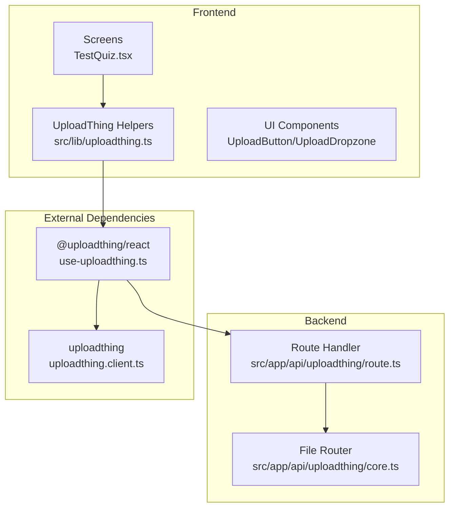
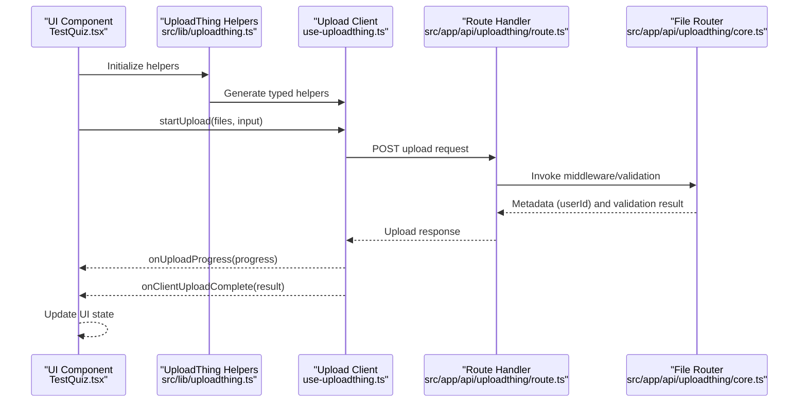
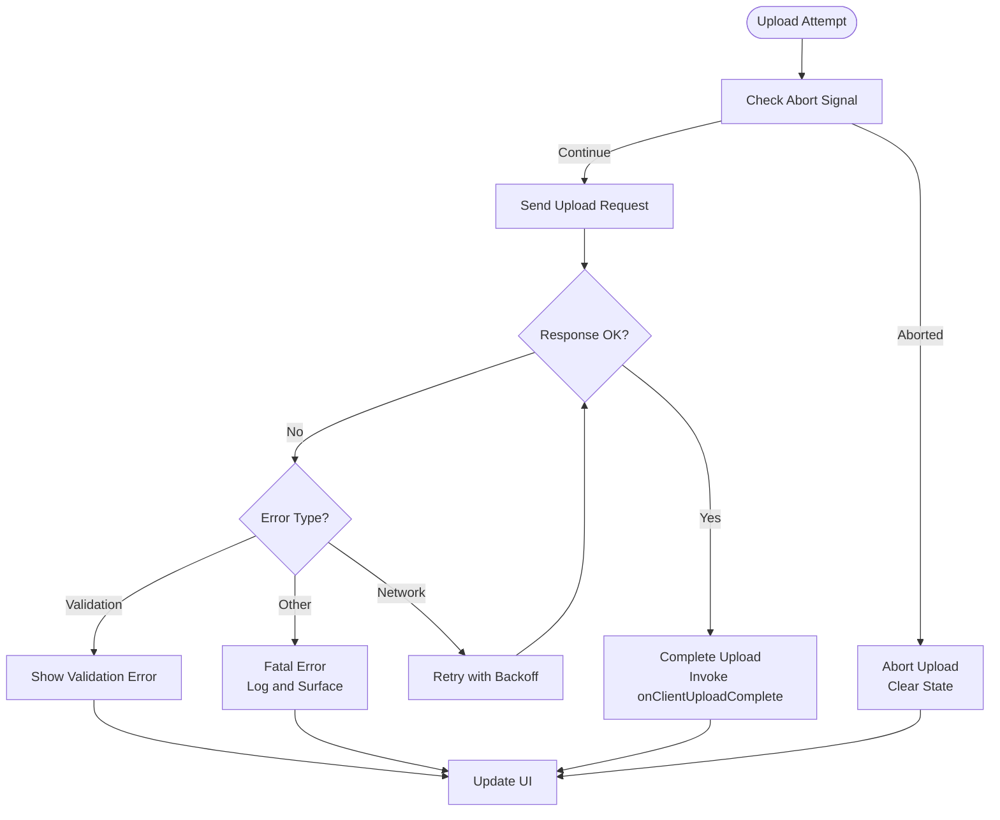
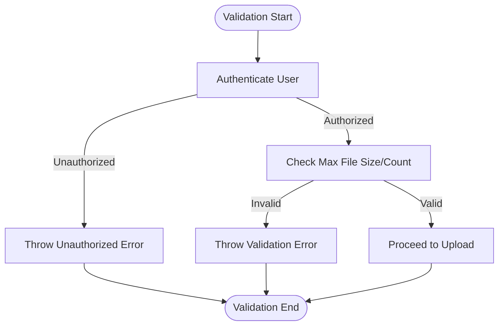
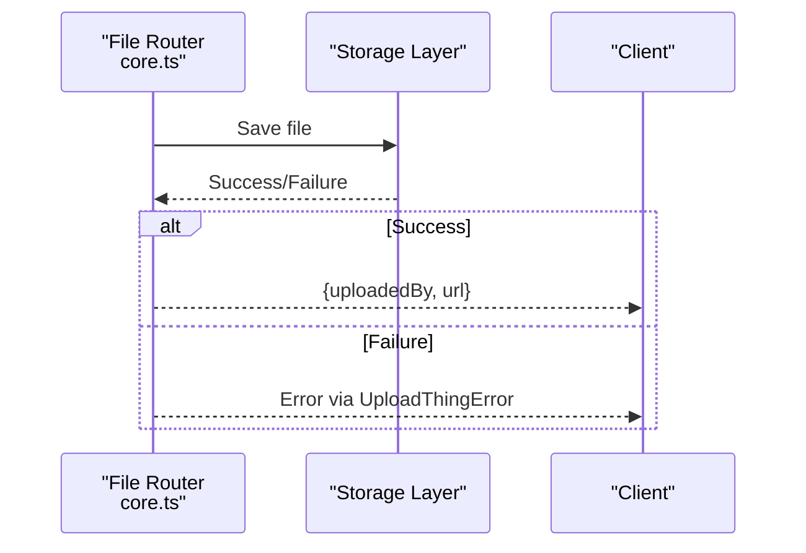
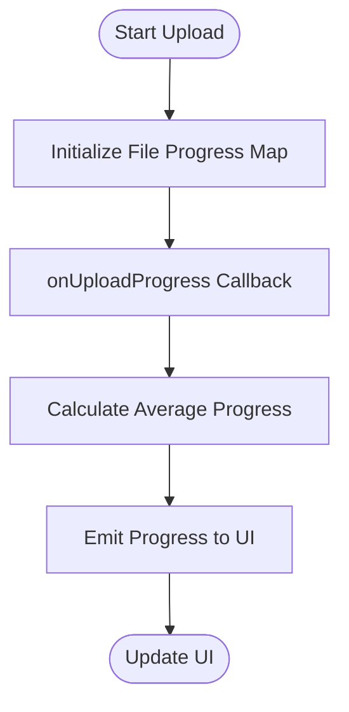
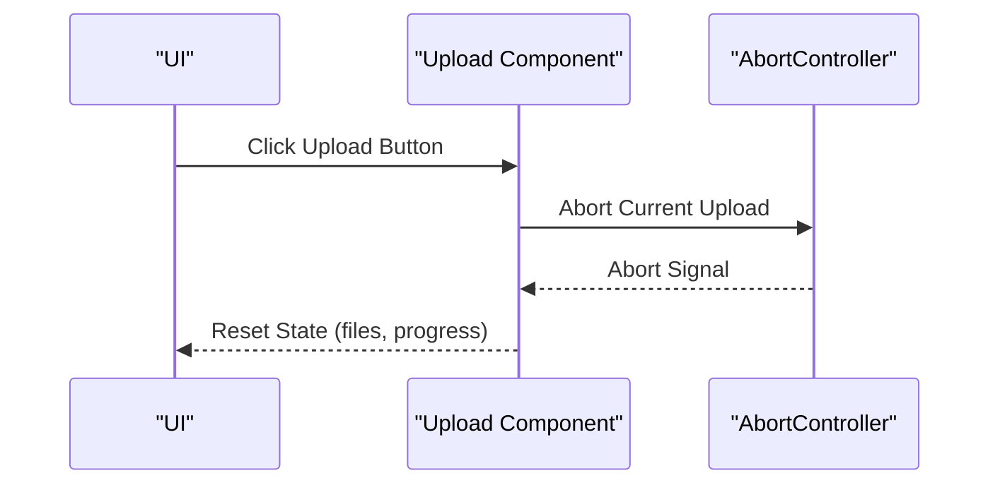
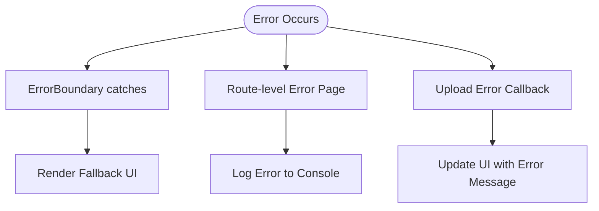
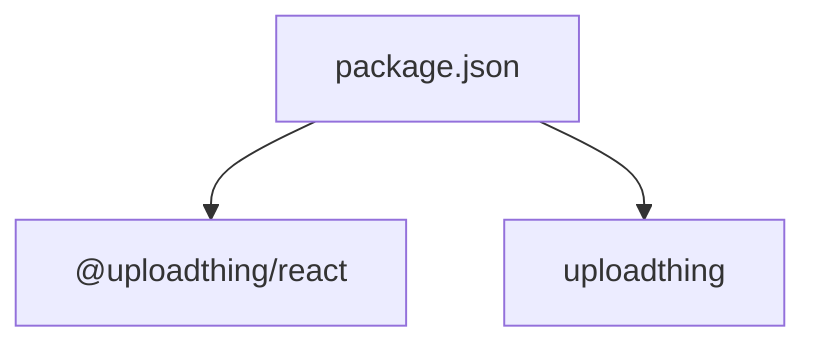

# Error Handling and Optimization

<cite>
**Referenced Files in This Document**
- [uploadthing.ts](file://src/lib/uploadthing.ts)
- [route.ts](file://src/app/api/uploadthing/route.ts)
- [core.ts](file://src/app/api/uploadthing/core.ts)
- [ErrorBoundary.tsx](file://src/components/ErrorBoundary.tsx)
- [error.tsx](file://src/app/error.tsx)
- [package.json](file://package.json)
- [use-uploadthing.ts](file://node_modules/@uploadthing/react/dist/use-uploadthing-pxkJ3LFs.js)
- [uploadthing.client.ts](file://node_modules/uploadthing/client/dist/index.js)
- [TestQuiz.tsx](file://src/screens/TestQuiz.tsx)
</cite>

## Table of Contents
1. [Introduction](#introduction)
2. [Project Structure](#project-structure)
3. [Core Components](#core-components)
4. [Architecture Overview](#architecture-overview)
5. [Detailed Component Analysis](#detailed-component-analysis)
6. [Dependency Analysis](#dependency-analysis)
7. [Performance Considerations](#performance-considerations)
8. [Troubleshooting Guide](#troubleshooting-guide)
9. [Conclusion](#conclusion)

## Introduction
This document provides comprehensive guidance for error handling and performance optimization in the file upload system. It covers strategies for network failures, validation errors, and storage issues, along with retry mechanisms, timeout configurations, and graceful degradation patterns. It also explains upload progress tracking, cancellation handling, and resume capabilities, and includes examples of error recovery procedures, logging strategies, and monitoring integration. Performance optimization techniques such as chunked uploads, parallel processing, and bandwidth management are addressed, alongside best practices for handling large files, memory management, and resource optimization.

## Project Structure
The file upload system integrates a React frontend with a Next.js backend using UploadThing. The frontend leverages typed helpers to interact with the backend, while the backend enforces authentication and validation rules.

**Diagram sources**
- [uploadthing.ts](file://src/lib/uploadthing.ts#L1-L6)
- [route.ts](file://src/app/api/uploadthing/route.ts#L1-L12)
- [core.ts](file://src/app/api/uploadthing/core.ts#L1-L34)
- [use-uploadthing.ts](file://node_modules/@uploadthing/react/dist/use-uploadthing-pxkJ3LFs.js#L1-L200)
- [uploadthing.client.ts](file://node_modules/uploadthing/client/dist/index.js#L1-L200)

**Section sources**
- [uploadthing.ts](file://src/lib/uploadthing.ts#L1-L6)
- [route.ts](file://src/app/api/uploadthing/route.ts#L1-L12)
- [core.ts](file://src/app/api/uploadthing/core.ts#L1-L34)
- [package.json](file://package.json#L45-L65)

## Core Components
- Frontend helpers: Typed helpers for UploadThing enable strongly typed upload operations and integrate with React components.
- Backend route handler: Exposes HTTP endpoints for upload operations and reads configuration from environment variables.
- File router: Defines upload endpoints with middleware for authentication and validation, and handles completion callbacks.

Key responsibilities:
- Authentication middleware ensures only authenticated users can upload.
- Validation limits file size and count per upload.
- Completion callback logs successful uploads and returns metadata to the client.

**Section sources**
- [uploadthing.ts](file://src/lib/uploadthing.ts#L1-L6)
- [route.ts](file://src/app/api/uploadthing/route.ts#L1-L12)
- [core.ts](file://src/app/api/uploadthing/core.ts#L1-L34)

## Architecture Overview
The upload flow connects UI components to the backend via typed helpers. The frontend tracks progress and handles cancellation, while the backend validates requests and manages completion.

**Diagram sources**
- [TestQuiz.tsx](file://src/screens/TestQuiz.tsx#L445-L451)
- [uploadthing.ts](file://src/lib/uploadthing.ts#L1-L6)
- [use-uploadthing.ts](file://node_modules/@uploadthing/react/dist/use-uploadthing-pxkJ3LFs.js#L120-L200)
- [route.ts](file://src/app/api/uploadthing/route.ts#L1-L12)
- [core.ts](file://src/app/api/uploadthing/core.ts#L11-L31)

## Detailed Component Analysis

### Error Handling Strategies

#### Network Failures
- Cancellation handling: The UploadThing components support abort signals to cancel uploads gracefully. The frontend uses AbortController instances to abort ongoing uploads.
- Client-side error callback: The upload client invokes an error callback when upload errors occur, enabling UI updates and user feedback.
- Retry logic: Implement retry with exponential backoff when encountering transient network errors. Track retry attempts and provide user feedback.

**Diagram sources**
- [use-uploadthing.ts](file://node_modules/@uploadthing/react/dist/use-uploadthing-pxkJ3LFs.js#L130-L180)

**Section sources**
- [use-uploadthing.ts](file://node_modules/@uploadthing/react/dist/use-uploadthing-pxkJ3LFs.js#L130-L180)

#### Validation Errors
- Middleware validation: The backend middleware checks authentication and throws an UploadThing error for unauthorized access.
- File size and count limits: The file router defines maximum file size and count per upload, preventing oversized or excessive uploads.
- Client-side validation: The UploadThing components enforce permitted file types and sizes on the client, reducing invalid submissions.

**Diagram sources**
- [core.ts](file://src/app/api/uploadthing/core.ts#L12-L22)

**Section sources**
- [core.ts](file://src/app/api/uploadthing/core.ts#L12-L22)

#### Storage Issues
- Completion callback: On successful upload, the backend logs completion and returns metadata to the client. This enables UI updates and downstream processing.
- Error surfacing: Any storage-related errors are surfaced through the error callback, allowing the UI to display actionable messages.

**Diagram sources**
- [core.ts](file://src/app/api/uploadthing/core.ts#L23-L31)

**Section sources**
- [core.ts](file://src/app/api/uploadthing/core.ts#L23-L31)

### Progress Tracking, Cancellation, and Resume

#### Progress Tracking
- Average progress calculation: The upload client computes average progress across multiple files and emits progress updates to the UI.
- UI integration: The TestQuiz screen demonstrates progress display using a progress bar and percentage text.

**Diagram sources**
- [use-uploadthing.ts](file://node_modules/@uploadthing/react/dist/use-uploadthing-pxkJ3LFs.js#L140-L170)
- [TestQuiz.tsx](file://src/screens/TestQuiz.tsx#L445-L451)

**Section sources**
- [use-uploadthing.ts](file://node_modules/@uploadthing/react/dist/use-uploadthing-pxkJ3LFs.js#L140-L170)
- [TestQuiz.tsx](file://src/screens/TestQuiz.tsx#L445-L451)

#### Cancellation Handling
- Abort signal: The UploadThing components use AbortController to cancel uploads. Clicking the upload button during an active upload triggers an abort, resetting state.
- Graceful reset: After cancellation, the UI clears file selections and resets progress indicators.

**Diagram sources**
- [use-uploadthing.ts](file://node_modules/@uploadthing/react/dist/use-uploadthing-pxkJ3LFs.js#L160-L190)

**Section sources**
- [use-uploadthing.ts](file://node_modules/@uploadthing/react/dist/use-uploadthing-pxkJ3LFs.js#L160-L190)

#### Resume Capabilities
- Current state: The UploadThing client does not expose explicit resume APIs in the analyzed code. Resume would require backend support for multipart uploads and client-side state persistence.
- Recommended approach: Implement server-side resume tokens and client-side chunk management for large files.

### Error Recovery Procedures and Logging
- Application-level error boundaries: The ErrorBoundary component catches errors and displays a friendly interface with reload/home actions.
- Route-level error handling: The error.tsx page captures application errors and logs them to the console, providing a fallback UI.
- Upload-specific error handling: The upload client invokes onUploadError with structured error information, enabling targeted recovery.

**Diagram sources**
- [ErrorBoundary.tsx](file://src/components/ErrorBoundary.tsx#L18-L73)
- [error.tsx](file://src/app/error.tsx#L14-L51)
- [use-uploadthing.ts](file://node_modules/@uploadthing/react/dist/use-uploadthing-pxkJ3LFs.js#L160-L180)

**Section sources**
- [ErrorBoundary.tsx](file://src/components/ErrorBoundary.tsx#L18-L73)
- [error.tsx](file://src/app/error.tsx#L14-L51)
- [use-uploadthing.ts](file://node_modules/@uploadthing/react/dist/use-uploadthing-pxkJ3LFs.js#L160-L180)

### Monitoring Integration
- Console logging: Successful uploads log metadata and URLs for traceability.
- Error logging: Both application and upload errors are logged to the console for debugging.
- Recommendation: Integrate structured logging and monitoring systems (e.g., error tracking platforms) to capture and analyze upload metrics and failures.

**Section sources**
- [core.ts](file://src/app/api/uploadthing/core.ts#L23-L31)
- [error.tsx](file://src/app/error.tsx#L15-L17)

## Dependency Analysis
The upload system relies on UploadThing for both frontend and backend integration. The frontend uses typed helpers to communicate with the backend route handler, which delegates to the file router for validation and completion handling.

**Diagram sources**
- [package.json](file://package.json#L45-L65)

**Section sources**
- [package.json](file://package.json#L45-L65)

## Performance Considerations
- Chunked uploads: For large files, implement chunked uploads to improve reliability and reduce memory usage. This requires backend support for resumable uploads.
- Parallel processing: Upload multiple files concurrently while respecting rate limits and bandwidth constraints.
- Bandwidth management: Throttle upload speed based on connection quality and user preferences.
- Memory optimization: Stream file data instead of loading entire files into memory. Use ArrayBuffer or streams for large files.
- Frontend progress: Utilize the existing progress tracking mechanism to provide real-time feedback and adjust upload behavior dynamically.

[No sources needed since this section provides general guidance]

## Troubleshooting Guide
- Authentication failures: Verify session headers and ensure the middleware correctly authenticates users before allowing uploads.
- Validation errors: Confirm file size and count limits match the router configuration and that client-side validation aligns with server-side constraints.
- Network interruptions: Implement retry logic with exponential backoff and provide user feedback during retries.
- Storage errors: Check backend logs for storage exceptions and ensure completion callbacks handle errors gracefully.

**Section sources**
- [core.ts](file://src/app/api/uploadthing/core.ts#L12-L22)
- [route.ts](file://src/app/api/uploadthing/route.ts#L8-L11)
- [use-uploadthing.ts](file://node_modules/@uploadthing/react/dist/use-uploadthing-pxkJ3LFs.js#L160-L180)

## Conclusion
The file upload system integrates robust frontend and backend components with strong error handling and progress tracking. By implementing retry mechanisms, cancellation handling, and structured logging, the system can achieve resilience against network failures and validation errors. For large files, adopting chunked uploads and bandwidth management will enhance performance and user experience. The existing progress tracking and error surfaces provide a solid foundation for building advanced features like resume capabilities and comprehensive monitoring.