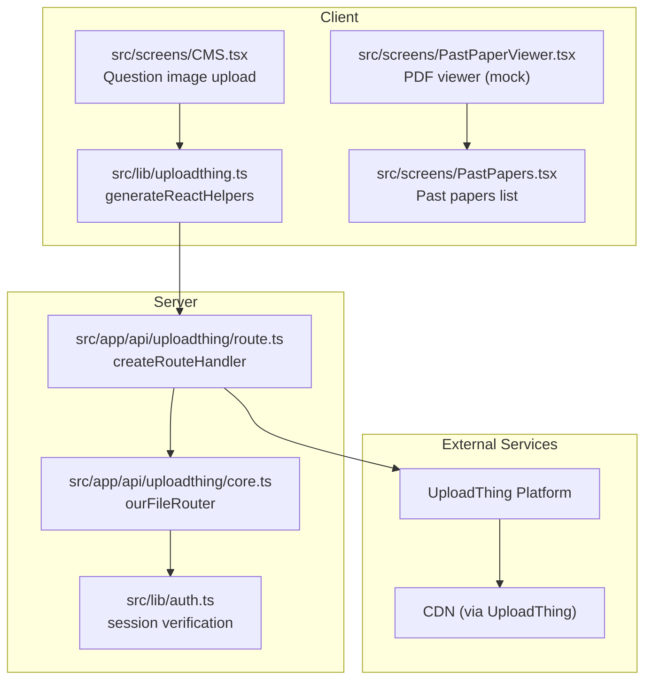
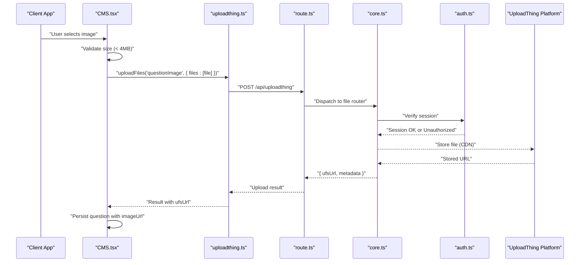
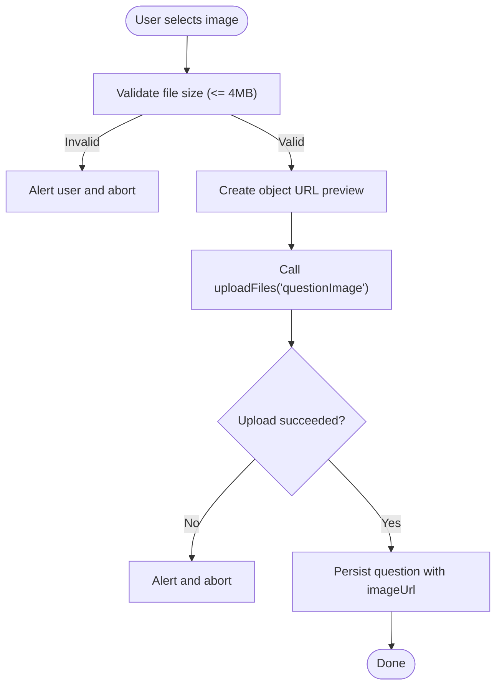
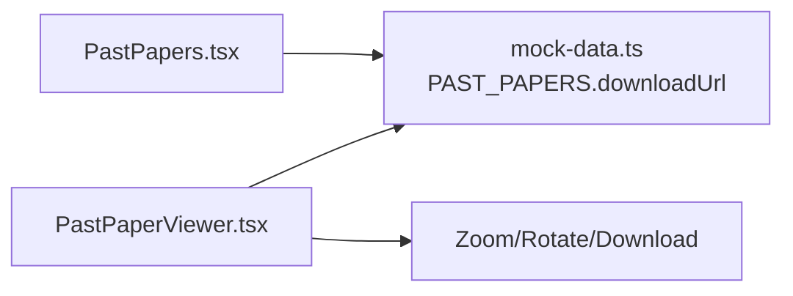
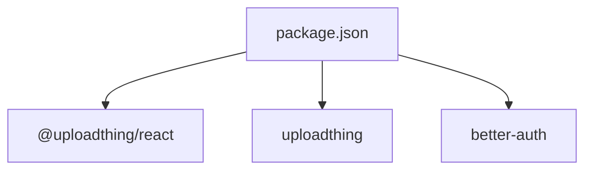

# File Upload System

<cite>
**Referenced Files in This Document**
- [uploadthing.ts](file://src/lib/uploadthing.ts)
- [core.ts](file://src/app/api/uploadthing/core.ts)
- [route.ts](file://src/app/api/uploadthing/route.ts)
- [CMS.tsx](file://src/screens/CMS.tsx)
- [PastPaperViewer.tsx](file://src/screens/PastPaperViewer.tsx)
- [PastPapers.tsx](file://src/screens/PastPapers.tsx)
- [mock-data.ts](file://src/constants/mock-data.ts)
- [auth.ts](file://src/lib/auth.ts)
- [package.json](file://package.json)
</cite>

## Table of Contents
1. [Introduction](#introduction)
2. [Project Structure](#project-structure)
3. [Core Components](#core-components)
4. [Architecture Overview](#architecture-overview)
5. [Detailed Component Analysis](#detailed-component-analysis)
6. [Dependency Analysis](#dependency-analysis)
7. [Performance Considerations](#performance-considerations)
8. [Troubleshooting Guide](#troubleshooting-guide)
9. [Conclusion](#conclusion)

## Introduction
This document describes MatricMaster AI’s file upload system built on UploadThing. It covers the upload architecture, validation rules, storage management, access control, supported file types and sizes, security measures, integration with the content management system (CMS), and the past paper viewer. It also documents thumbnail generation, CDN integration, upload progress tracking, error handling, retry mechanisms, configuration examples, security best practices, and performance optimization for large files.

## Project Structure
The upload system spans three primary areas:
- Client helpers for invoking UploadThing from React components
- Server-side route handler and file router configuration
- UI integration in CMS and past paper viewer screens

**Diagram sources**
- [uploadthing.ts](file://src/lib/uploadthing.ts#L1-L6)
- [route.ts](file://src/app/api/uploadthing/route.ts#L1-L12)
- [core.ts](file://src/app/api/uploadthing/core.ts#L1-L34)
- [CMS.tsx](file://src/screens/CMS.tsx#L242-L300)
- [auth.ts](file://src/lib/auth.ts#L1-L103)

**Section sources**
- [uploadthing.ts](file://src/lib/uploadthing.ts#L1-L6)
- [route.ts](file://src/app/api/uploadthing/route.ts#L1-L12)
- [core.ts](file://src/app/api/uploadthing/core.ts#L1-L34)
- [CMS.tsx](file://src/screens/CMS.tsx#L242-L300)
- [PastPaperViewer.tsx](file://src/screens/PastPaperViewer.tsx#L1-L281)
- [PastPapers.tsx](file://src/screens/PastPapers.tsx#L1-L178)
- [mock-data.ts](file://src/constants/mock-data.ts#L48-L240)

## Core Components
- UploadThing client helpers: Provides typed hooks to upload files and access the UploadThing API from the frontend.
- Server route handler: Exposes UploadThing endpoints for Next.js App Router and reads the UploadThing token from environment variables.
- File router: Defines the upload endpoint, middleware for authentication, and completion callback.
- CMS integration: Uses the UploadThing client to upload question images with client-side validation and preview.
- Past paper viewer: Renders past exam papers and integrates with the past papers list; PDFs are served via external URLs in mock data.

Key capabilities:
- Authentication middleware ensures only logged-in users can upload.
- File type and size constraints are enforced server-side.
- Completion callback logs and returns metadata to the client.
- Client-side preview and validation complement server-side checks.

**Section sources**
- [uploadthing.ts](file://src/lib/uploadthing.ts#L1-L6)
- [route.ts](file://src/app/api/uploadthing/route.ts#L1-L12)
- [core.ts](file://src/app/api/uploadthing/core.ts#L9-L31)
- [CMS.tsx](file://src/screens/CMS.tsx#L242-L300)
- [mock-data.ts](file://src/constants/mock-data.ts#L48-L240)

## Architecture Overview
The upload flow is a client-to-server-to-platform pipeline with built-in access control and CDN delivery.

**Diagram sources**
- [CMS.tsx](file://src/screens/CMS.tsx#L242-L300)
- [uploadthing.ts](file://src/lib/uploadthing.ts#L1-L6)
- [route.ts](file://src/app/api/uploadthing/route.ts#L6-L11)
- [core.ts](file://src/app/api/uploadthing/core.ts#L12-L30)
- [auth.ts](file://src/lib/auth.ts#L14-L18)

## Detailed Component Analysis

### UploadThing Client Helpers
- Purpose: Generate typed helpers for React to integrate with the UploadThing router.
- Usage: Exports hooks to upload files and access the UploadThing API.
- Integration: Used by the CMS to upload question images.

Implementation highlights:
- Typed router import aligns client and server configurations.
- Exposes helpers for invoking uploads in components.

**Section sources**
- [uploadthing.ts](file://src/lib/uploadthing.ts#L1-L6)

### Server Route Handler
- Purpose: Expose UploadThing endpoints for Next.js App Router.
- Configuration: Reads UploadThing token from environment variables.
- Exports: GET and POST handlers for the router.

Security note:
- Token is required for secure communication with UploadThing.

**Section sources**
- [route.ts](file://src/app/api/uploadthing/route.ts#L1-L12)

### File Router and Middleware
- Endpoint: questionImage
- File constraints: image type with maxFileSize and maxFileCount
- Middleware:
  - Verifies user session via Better Auth
  - Throws unauthorized error if not authenticated
  - Returns metadata (userId) for downstream processing
- Completion callback:
  - Logs upload completion and file URL
  - Returns uploadedBy and ufsUrl to the client

Access control:
- Session-based enforcement prevents unauthorized uploads.

**Section sources**
- [core.ts](file://src/app/api/uploadthing/core.ts#L9-L31)
- [auth.ts](file://src/lib/auth.ts#L14-L18)

### CMS Integration for Question Images
- Client-side validation:
  - Enforces 4MB limit before upload
  - Generates preview URL for immediate feedback
- Upload flow:
  - Calls uploadFiles with endpoint name and file
  - On success, replaces local preview with uploaded URL
  - Persists question with imageUrl on save
- Error handling:
  - Alerts on upload failure
  - Clears previews and resets state on cancel/close

**Diagram sources**
- [CMS.tsx](file://src/screens/CMS.tsx#L302-L319)
- [CMS.tsx](file://src/screens/CMS.tsx#L242-L300)

**Section sources**
- [CMS.tsx](file://src/screens/CMS.tsx#L302-L319)
- [CMS.tsx](file://src/screens/CMS.tsx#L242-L300)

### Past Paper Viewer and PDF Integration
- Past papers list: Displays downloadable PDFs via external URLs.
- Past paper viewer: Provides viewing controls (zoom, rotate, download).
- Mock data: Contains download URLs for multiple papers.

**Diagram sources**
- [PastPapers.tsx](file://src/screens/PastPapers.tsx#L1-L178)
- [PastPaperViewer.tsx](file://src/screens/PastPaperViewer.tsx#L1-L281)
- [mock-data.ts](file://src/constants/mock-data.ts#L48-L240)

**Section sources**
- [PastPapers.tsx](file://src/screens/PastPapers.tsx#L1-L178)
- [PastPaperViewer.tsx](file://src/screens/PastPaperViewer.tsx#L1-L281)
- [mock-data.ts](file://src/constants/mock-data.ts#L48-L240)

## Dependency Analysis
- Client dependencies:
  - @uploadthing/react and uploadthing provide the UploadThing SDK and typed helpers.
- Server dependencies:
  - uploadthing/next and uploadthing/server power the route handler and error types.
- Authentication:
  - better-auth verifies sessions in middleware.

**Diagram sources**
- [package.json](file://package.json#L27-L65)

**Section sources**
- [package.json](file://package.json#L27-L65)

## Performance Considerations
- Client-side validation reduces unnecessary uploads and improves UX.
- CDN delivery: Files are stored and served via UploadThing’s CDN, reducing origin load.
- Large file handling:
  - Keep uploads under the configured maxFileSize.
  - Consider chunked uploads for very large files if needed.
  - Use compression judiciously; avoid excessive resizing on the client.
- Thumbnail generation:
  - If thumbnails are required, generate them server-side during upload and store thumbnails alongside originals.
- Caching:
  - Leverage browser caching for static assets and CDN caching for uploaded files.

[No sources needed since this section provides general guidance]

## Troubleshooting Guide
Common issues and resolutions:
- Unauthorized uploads:
  - Ensure the user is authenticated before calling uploadFiles.
  - Verify session retrieval in middleware.
- Upload failures:
  - Confirm UploadThing token is set in environment variables.
  - Check network connectivity and UploadThing service status.
- Client-side errors:
  - Validate file size and type before upload.
  - Clear object URLs on error to prevent stale previews.
- Completion handling:
  - Ensure the completion callback returns required metadata for persistence.

**Section sources**
- [core.ts](file://src/app/api/uploadthing/core.ts#L12-L18)
- [route.ts](file://src/app/api/uploadthing/route.ts#L8-L10)
- [CMS.tsx](file://src/screens/CMS.tsx#L242-L300)

## Conclusion
MatricMaster AI’s upload system leverages UploadThing for secure, scalable file handling with strong access control and CDN-backed delivery. The CMS integrates seamlessly with the upload pipeline, offering client-side validation and previews. While the current implementation focuses on question images, the architecture supports expansion to other file types and workflows, including future enhancements for thumbnails and advanced moderation features.