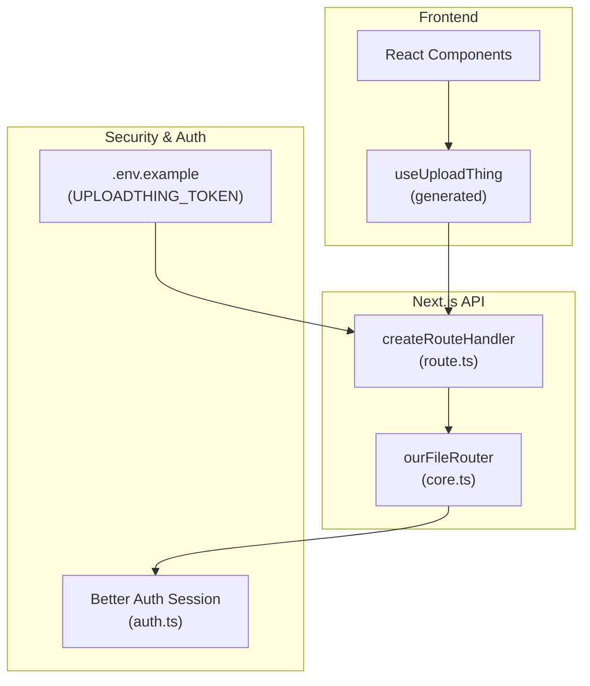
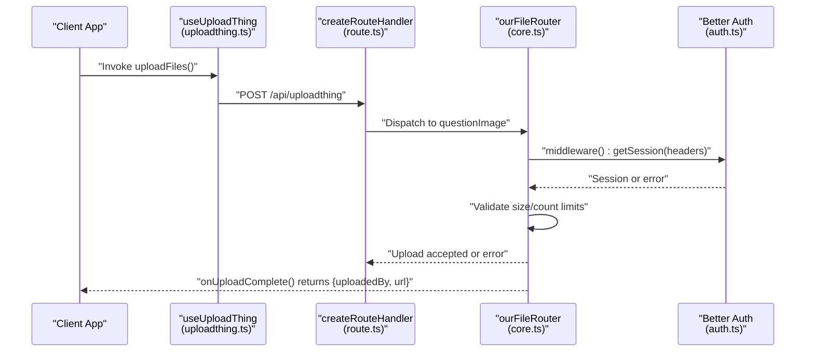
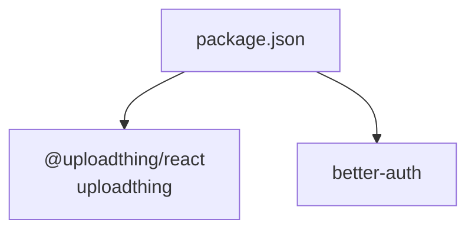

# File Validation and Security

<cite>
**Referenced Files in This Document**
- [core.ts](file://src/app/api/uploadthing/core.ts)
- [route.ts](file://src/app/api/uploadthing/route.ts)
- [uploadthing.ts](file://src/lib/uploadthing.ts)
- [auth.ts](file://src/lib/auth.ts)
- [.env.example](file://.env.example)
- [package.json](file://package.json)
</cite>

## Table of Contents
1. [Introduction](#introduction)
2. [Project Structure](#project-structure)
3. [Core Components](#core-components)
4. [Architecture Overview](#architecture-overview)
5. [Detailed Component Analysis](#detailed-component-analysis)
6. [Dependency Analysis](#dependency-analysis)
7. [Performance Considerations](#performance-considerations)
8. [Troubleshooting Guide](#troubleshooting-guide)
9. [Conclusion](#conclusion)

## Introduction
This document explains the file validation and security measures implemented in the upload system. It covers the validation pipeline from client upload to server processing, including access control, size limits, and content safety controls enforced by the backend. It also documents the current configuration for MIME type handling, file extension validation, and security headers, along with recommended practices for extending validation rules, sanitization, and protection against common file upload vulnerabilities.

## Project Structure
The upload system is implemented using UploadThing with a Next.js route handler and a file router. The frontend helpers integrate with the backend via a generated React hook. Authentication is handled by Better Auth, which is used to enforce access control during uploads.

**Diagram sources**
- [route.ts](file://src/app/api/uploadthing/route.ts#L1-L12)
- [core.ts](file://src/app/api/uploadthing/core.ts#L1-L34)
- [uploadthing.ts](file://src/lib/uploadthing.ts#L1-L6)
- [auth.ts](file://src/lib/auth.ts#L1-L103)
- [.env.example](file://.env.example#L1-L19)

**Section sources**
- [route.ts](file://src/app/api/uploadthing/route.ts#L1-L12)
- [core.ts](file://src/app/api/uploadthing/core.ts#L1-L34)
- [uploadthing.ts](file://src/lib/uploadthing.ts#L1-L6)
- [auth.ts](file://src/lib/auth.ts#L1-L103)
- [.env.example](file://.env.example#L1-L19)

## Core Components
- UploadThing route handler: Exposes GET/POST endpoints for uploads and reads the UploadThing token from environment variables.
- File router: Defines the upload endpoint, applies middleware for authentication, enforces size and count limits, and returns metadata on completion.
- Frontend helpers: Generates strongly typed hooks for client-side uploads.
- Authentication: Uses Better Auth to verify sessions and enforce access control.

Key behaviors:
- Access control: Middleware checks for a valid session and rejects unauthorized uploads.
- Size and count limits: Enforced at the router level for images.
- Metadata propagation: The authenticated user ID is passed to the completion handler.
- Completion response: Returns uploadedBy and URL for client-side handling.

**Section sources**
- [route.ts](file://src/app/api/uploadthing/route.ts#L1-L12)
- [core.ts](file://src/app/api/uploadthing/core.ts#L1-L34)
- [uploadthing.ts](file://src/lib/uploadthing.ts#L1-L6)
- [auth.ts](file://src/lib/auth.ts#L1-L103)

## Architecture Overview
The upload flow integrates client-side uploads with server-side validation and access control.

**Diagram sources**
- [uploadthing.ts](file://src/lib/uploadthing.ts#L1-L6)
- [route.ts](file://src/app/api/uploadthing/route.ts#L1-L12)
- [core.ts](file://src/app/api/uploadthing/core.ts#L1-L34)
- [auth.ts](file://src/lib/auth.ts#L1-L103)

## Detailed Component Analysis

### UploadThing Route Handler
- Exposes GET/POST endpoints for the file router.
- Reads the UploadThing token from environment variables for secure routing.
- Delegates upload handling to the file router.

Security and configuration notes:
- Token-based configuration ensures only authorized clients can reach the upload handler.
- No custom rate limiting or additional headers are applied in this handler.

**Section sources**
- [route.ts](file://src/app/api/uploadthing/route.ts#L1-L12)
- [.env.example](file://.env.example#L11-L12)

### File Router and Validation Pipeline
- Endpoint definition: questionImage with image category and limits.
- Middleware:
  - Authenticates the request using Better Auth session.
  - Throws an error for unauthorized requests.
  - Propagates metadata (e.g., user ID) to completion callbacks.
- Completion callback:
  - Logs upload completion and returns uploadedBy and URL.

Validation and security highlights:
- Access control: Enforced via session check in middleware.
- Size and count limits: Defined in the router for images.
- Content scanning: Not implemented in the current router.
- File extension validation: Not explicitly defined; defaults are handled by UploadThing.
- MIME type checking: Not explicitly defined; defaults are handled by UploadThing.

Recommended enhancements:
- Add explicit file extension and MIME type validation in middleware.
- Integrate content scanning (e.g., virus scanning) in the completion callback.
- Enforce stricter naming strategies and temporary storage handling.

**Section sources**
- [core.ts](file://src/app/api/uploadthing/core.ts#L1-L34)
- [auth.ts](file://src/lib/auth.ts#L1-L103)

### Frontend Upload Helpers
- Generates strongly typed hooks for client-side uploads.
- Integrates with the backend route handler seamlessly.

Usage pattern:
- Import the generated helpers and call uploadFiles with the desired endpoint and files.

**Section sources**
- [uploadthing.ts](file://src/lib/uploadthing.ts#L1-L6)

### Authentication Integration
- Uses Better Auth to fetch the current session.
- Enforces access control by verifying session presence in middleware.
- Supports trusted origins and session configuration.

**Section sources**
- [auth.ts](file://src/lib/auth.ts#L1-L103)

### Environment Configuration
- UPLOADTHING_TOKEN: Required for the route handler configuration.
- BETTER_AUTH_SECRET and related settings: Required for Better Auth.
- DATABASE_URL: Required for database-backed session persistence.

**Section sources**
- [.env.example](file://.env.example#L1-L19)

## Dependency Analysis
The upload system relies on UploadThing and Better Auth. Dependencies are declared in the project manifest.

**Diagram sources**
- [package.json](file://package.json#L27-L65)

**Section sources**
- [package.json](file://package.json#L27-L65)

## Performance Considerations
- Image processing: If additional processing is added (e.g., resizing), consider offloading to a worker or service to avoid blocking the request.
- Rate limiting: Implement rate limiting around the upload handler to prevent abuse.
- CDN distribution: Serve uploaded files via a CDN for improved performance and reduced origin load.

## Troubleshooting Guide
Common issues and resolutions:
- Unauthorized uploads: Ensure the client includes valid session headers and that the middleware receives a valid session.
- Missing UPLOADTHING_TOKEN: Configure the token in environment variables; otherwise, the route handler will not be properly secured.
- Session persistence: If database is unavailable, Better Auth falls back to non-persistent sessions; verify connectivity and credentials.

Operational checks:
- Confirm environment variables are loaded and route handler configuration is present.
- Verify middleware executes and returns metadata as expected.
- Review completion callback logs for uploadedBy and URL.

**Section sources**
- [route.ts](file://src/app/api/uploadthing/route.ts#L1-L12)
- [core.ts](file://src/app/api/uploadthing/core.ts#L1-L34)
- [auth.ts](file://src/lib/auth.ts#L1-L103)
- [.env.example](file://.env.example#L1-L19)

## Conclusion
The current upload system enforces access control via session validation and applies basic size/count limits at the router level. To strengthen security, consider adding explicit file extension and MIME type validation, integrating content scanning, and implementing rate limiting and stricter naming strategies. These enhancements will improve resilience against common file upload vulnerabilities while maintaining a smooth user experience.