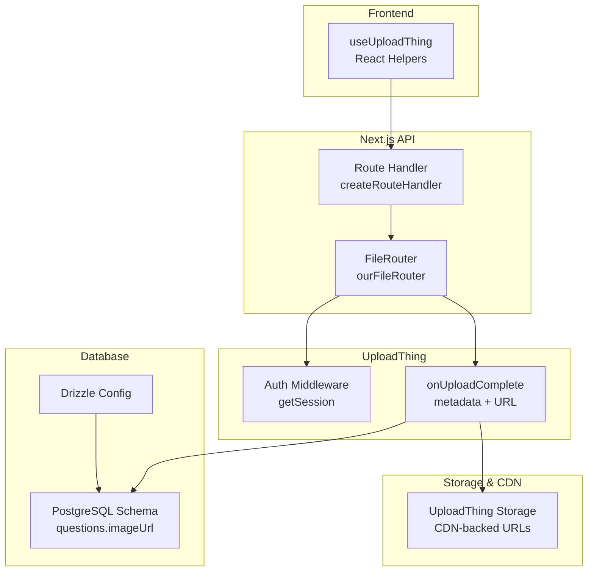
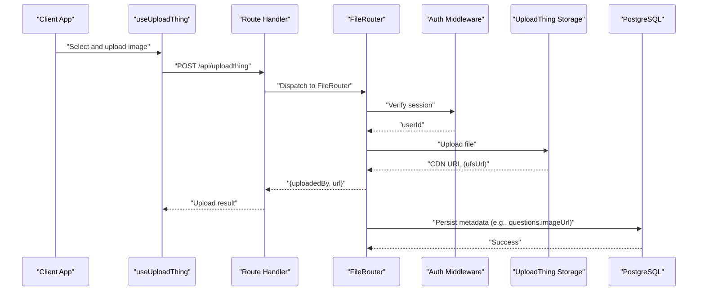
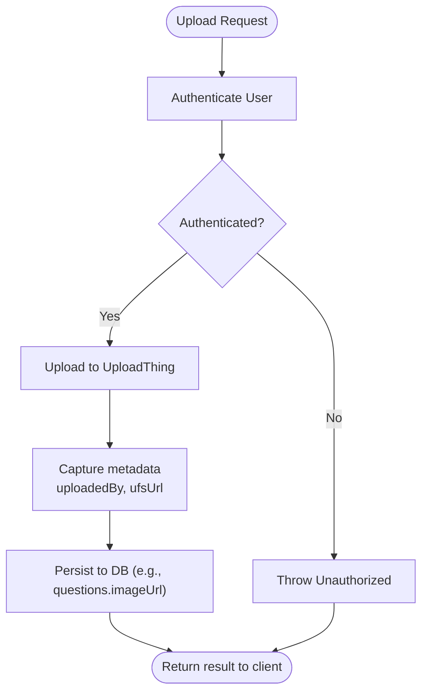
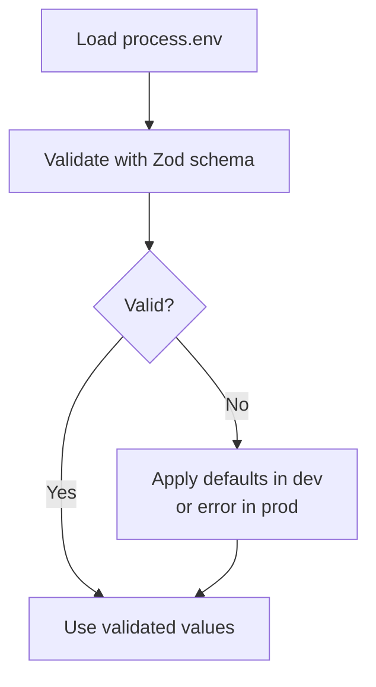
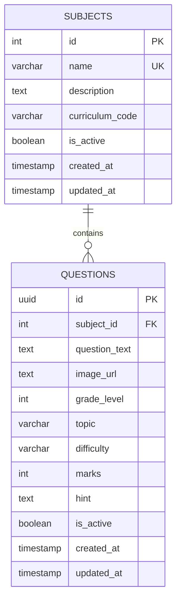
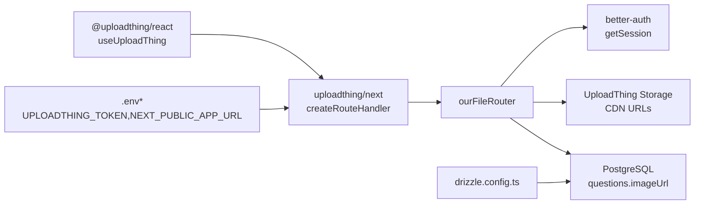

# Storage and CDN Integration

<cite>
**Referenced Files in This Document**
- [uploadthing.ts](file://src/lib/uploadthing.ts)
- [route.ts](file://src/app/api/uploadthing/route.ts)
- [core.ts](file://src/app/api/uploadthing/core.ts)
- [.env.example](file://.env.example)
- [.env.local](file://.env.local)
- [env.ts](file://src/lib/env.ts)
- [schema.ts](file://src/lib/db/schema.ts)
- [drizzle.config.ts](file://drizzle.config.ts)
- [health.ts](file://src/app/api/db/init/route.ts)
- [db.health.ts](file://src/lib/db/health.ts)
</cite>

## Table of Contents
1. [Introduction](#introduction)
2. [Project Structure](#project-structure)
3. [Core Components](#core-components)
4. [Architecture Overview](#architecture-overview)
5. [Detailed Component Analysis](#detailed-component-analysis)
6. [Dependency Analysis](#dependency-analysis)
7. [Performance Considerations](#performance-considerations)
8. [Troubleshooting Guide](#troubleshooting-guide)
9. [Conclusion](#conclusion)
10. [Appendices](#appendices)

## Introduction
This document explains the storage backend and CDN integration for the file upload system. It covers how files are accepted, authenticated, stored via a third-party provider, and delivered through a CDN. It also documents metadata handling, URL generation, and operational concerns such as backups, disaster recovery, and cost optimization. The system integrates UploadThing for file routing and secure uploads, while leveraging a PostgreSQL database for metadata persistence.

## Project Structure
The file upload system is organized around:
- A React helper module that exposes UploadThing hooks for the frontend
- A Next.js route handler that registers the UploadThing router
- An UploadThing FileRouter that defines upload policies, middleware, and completion callbacks
- Environment configuration for UploadThing tokens and application URLs
- A PostgreSQL schema for storing metadata associated with uploaded content
- Database initialization and health utilities

**Diagram sources**
- [uploadthing.ts](file://src/lib/uploadthing.ts#L1-L6)
- [route.ts](file://src/app/api/uploadthing/route.ts#L1-L12)
- [core.ts](file://src/app/api/uploadthing/core.ts#L1-L34)
- [schema.ts](file://src/lib/db/schema.ts#L52-L78)
- [drizzle.config.ts](file://drizzle.config.ts#L1-L16)

**Section sources**
- [uploadthing.ts](file://src/lib/uploadthing.ts#L1-L6)
- [route.ts](file://src/app/api/uploadthing/route.ts#L1-L12)
- [core.ts](file://src/app/api/uploadthing/core.ts#L1-L34)
- [schema.ts](file://src/lib/db/schema.ts#L52-L78)
- [drizzle.config.ts](file://drizzle.config.ts#L1-L16)

## Core Components
- Frontend helpers: Expose UploadThing React helpers bound to the application’s FileRouter.
- Route handler: Registers the FileRouter with UploadThing and reads the UploadThing token from environment variables.
- FileRouter: Defines an upload endpoint for question images with size limits, authentication middleware, and completion callback returning metadata and CDN URLs.
- Environment configuration: Centralizes environment validation and retrieval, including UploadThing token and application URL.
- Database schema: Stores file metadata (e.g., imageUrl) alongside content records.

Key responsibilities:
- Authentication: Ensures only logged-in users can upload.
- Authorization: Returns a user identifier to the completion callback for downstream processing.
- Metadata: Captures uploadedBy and CDN URL for later retrieval and display.
- Persistence: Stores file metadata in the database for long-term access.

**Section sources**
- [uploadthing.ts](file://src/lib/uploadthing.ts#L1-L6)
- [route.ts](file://src/app/api/uploadthing/route.ts#L1-L12)
- [core.ts](file://src/app/api/uploadthing/core.ts#L1-L34)
- [env.ts](file://src/lib/env.ts#L1-L62)
- [schema.ts](file://src/lib/db/schema.ts#L52-L78)

## Architecture Overview
The upload flow integrates the frontend, backend, UploadThing service, and database:

**Diagram sources**
- [uploadthing.ts](file://src/lib/uploadthing.ts#L1-L6)
- [route.ts](file://src/app/api/uploadthing/route.ts#L1-L12)
- [core.ts](file://src/app/api/uploadthing/core.ts#L11-L31)
- [schema.ts](file://src/lib/db/schema.ts#L52-L78)

## Detailed Component Analysis

### UploadThing Integration
- React helpers: Provides typed hooks for uploading files defined in the FileRouter.
- Route handler: Creates a Next.js route handler using the FileRouter and reads the UploadThing token from environment variables.
- FileRouter:
  - Defines a single endpoint for question images with a maximum file size and count.
  - Enforces authentication via a session lookup.
  - Passes the authenticated user ID to the completion callback.
  - On completion, logs metadata and returns the uploadedBy identifier and the CDN-backed URL.

**Diagram sources**
- [core.ts](file://src/app/api/uploadthing/core.ts#L11-L31)
- [schema.ts](file://src/lib/db/schema.ts#L52-L78)

**Section sources**
- [uploadthing.ts](file://src/lib/uploadthing.ts#L1-L6)
- [route.ts](file://src/app/api/uploadthing/route.ts#L1-L12)
- [core.ts](file://src/app/api/uploadthing/core.ts#L1-L34)

### Environment Configuration
- Validation and defaults: Validates environment variables using Zod, providing defaults for development and throwing in production if invalid.
- Required keys: UploadThing token and application URL are central to routing and CDN URL generation.
- Secrets: UploadThing token is loaded from environment variables and passed to the route handler.

**Diagram sources**
- [env.ts](file://src/lib/env.ts#L1-L62)
- [.env.example](file://.env.example#L11-L12)
- [.env.local](file://.env.local#L35-L36)
- [route.ts](file://src/app/api/uploadthing/route.ts#L8-L11)

**Section sources**
- [env.ts](file://src/lib/env.ts#L1-L62)
- [.env.example](file://.env.example#L11-L12)
- [.env.local](file://.env.local#L35-L36)
- [route.ts](file://src/app/api/uploadthing/route.ts#L8-L11)

### Database Schema and Metadata Management
- Questions table includes an optional imageUrl field suitable for storing CDN URLs returned by UploadThing.
- Drizzle configuration points to the PostgreSQL database using DATABASE_URL and maps schema definitions.
- Related tables and indices support efficient querying by subject, difficulty, and activity status.

**Diagram sources**
- [schema.ts](file://src/lib/db/schema.ts#L52-L78)
- [schema.ts](file://src/lib/db/schema.ts#L42-L50)

**Section sources**
- [schema.ts](file://src/lib/db/schema.ts#L52-L78)
- [drizzle.config.ts](file://drizzle.config.ts#L1-L16)

### CDN Distribution Setup
- UploadThing manages storage and returns CDN-backed URLs (ufsUrl) upon successful upload.
- The returned URL is persisted in the database for reliable access and future retrieval.
- Application URL configuration supports generating absolute URLs when needed.

**Section sources**
- [core.ts](file://src/app/api/uploadthing/core.ts#L23-L30)
- [schema.ts](file://src/lib/db/schema.ts#L60-L60)
- [env.ts](file://src/lib/env.ts#L4-L5)

## Dependency Analysis
The upload pipeline depends on:
- UploadThing SDK for routing, authentication, and storage
- Next.js route handlers for API exposure
- PostgreSQL for metadata persistence
- Environment configuration for secrets and URLs

**Diagram sources**
- [uploadthing.ts](file://src/lib/uploadthing.ts#L1-L6)
- [route.ts](file://src/app/api/uploadthing/route.ts#L1-L12)
- [core.ts](file://src/app/api/uploadthing/core.ts#L1-L34)
- [drizzle.config.ts](file://drizzle.config.ts#L1-L16)
- [.env.local](file://.env.local#L35-L36)

**Section sources**
- [uploadthing.ts](file://src/lib/uploadthing.ts#L1-L6)
- [route.ts](file://src/app/api/uploadthing/route.ts#L1-L12)
- [core.ts](file://src/app/api/uploadthing/core.ts#L1-L34)
- [drizzle.config.ts](file://drizzle.config.ts#L1-L16)
- [.env.local](file://.env.local#L35-L36)

## Performance Considerations
- Upload size limits: The FileRouter restricts image uploads to a maximum size and count to reduce bandwidth and storage costs.
- CDN delivery: UploadThing delivers files via CDN, reducing origin load and improving global latency.
- Database indexing: Indexes on frequently queried columns (subject, difficulty, activity) improve retrieval performance.
- Caching: Leverage browser and CDN caching headers where applicable; avoid caching sensitive content.
- Batch operations: Prefer bulk inserts for metadata updates when handling multiple uploads.

[No sources needed since this section provides general guidance]

## Troubleshooting Guide
Common issues and resolutions:
- Unauthorized uploads: Ensure the user is authenticated; the middleware throws an error if no session exists.
- Missing UploadThing token: Confirm the UPLOADTHING_TOKEN environment variable is set; the route handler reads it from process.env.
- Database connectivity: Use the database health utilities to verify connections and wait for readiness during startup.
- CORS and URL generation: Verify NEXT_PUBLIC_APP_URL and CDN URL patterns align with deployment domains.

Operational checks:
- Route handler configuration: Confirm the route handler is exported and configured with the FileRouter and token.
- Environment validation: Use the environment validator to detect misconfigurations early.

**Section sources**
- [core.ts](file://src/app/api/uploadthing/core.ts#L12-L22)
- [route.ts](file://src/app/api/uploadthing/route.ts#L8-L11)
- [health.ts](file://src/app/api/db/init/route.ts#L1-L49)
- [db.health.ts](file://src/lib/db/health.ts#L1-L40)
- [env.ts](file://src/lib/env.ts#L19-L44)

## Conclusion
The file upload system leverages UploadThing for secure, scalable uploads and CDN-backed URLs, while persisting metadata in PostgreSQL for reliable access. The architecture enforces authentication, applies upload constraints, and integrates cleanly with the frontend via typed React helpers. With proper environment configuration, database indexing, and CDN usage, the system achieves strong performance, maintainability, and cost efficiency.

[No sources needed since this section summarizes without analyzing specific files]

## Appendices

### Storage Provider Configuration
- UploadThing token: Provided via environment variable and consumed by the route handler.
- Application URL: Used for constructing absolute URLs and ensuring correct CDN domain resolution.

**Section sources**
- [.env.example](file://.env.example#L11-L12)
- [.env.local](file://.env.local#L35-L36)
- [env.ts](file://src/lib/env.ts#L4-L5)
- [route.ts](file://src/app/api/uploadthing/route.ts#L8-L11)

### File Organization Strategies
- Single-purpose endpoint: A dedicated FileRouter endpoint for question images simplifies policy enforcement and monitoring.
- Metadata alignment: Store CDN URLs in the database alongside content records for easy retrieval and display.

**Section sources**
- [core.ts](file://src/app/api/uploadthing/core.ts#L11-L31)
- [schema.ts](file://src/lib/db/schema.ts#L52-L78)

### CDN URL Patterns and Access Patterns
- Returned URL: The FileRouter completion callback returns a CDN-backed URL suitable for direct client access.
- Access pattern: Use the stored URL to render images in the UI without additional server-side processing.

**Section sources**
- [core.ts](file://src/app/api/uploadthing/core.ts#L23-L30)

### Backup Strategies, Disaster Recovery, and Cost Optimization
- Backups: Regularly back up the PostgreSQL database using managed service snapshots or logical dumps.
- Disaster recovery: Maintain offsite backups and test restoration procedures; monitor database health and readiness.
- Cost optimization: Use UploadThing’s CDN to reduce origin bandwidth; enforce upload limits; leverage database indexing to minimize query overhead; archive inactive content.

[No sources needed since this section provides general guidance]

### Relationship Between Local Processing and Remote Storage Management
- Local processing: Authentication, metadata capture, and database persistence occur locally.
- Remote storage: UploadThing manages file ingestion and CDN distribution; the system receives a CDN URL and persists it for later use.

**Section sources**
- [core.ts](file://src/app/api/uploadthing/core.ts#L12-L31)
- [schema.ts](file://src/lib/db/schema.ts#L52-L78)