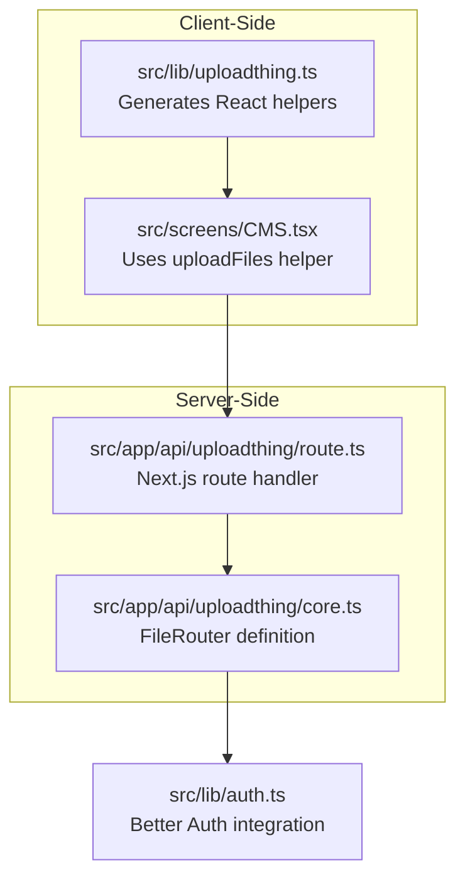
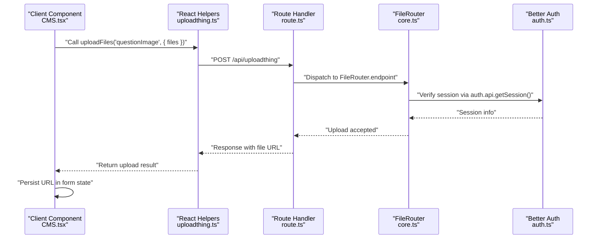
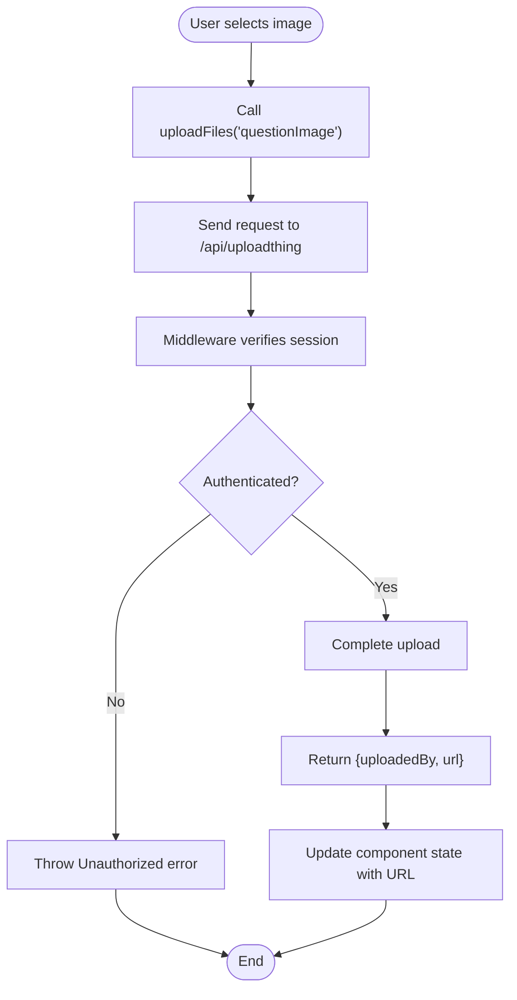
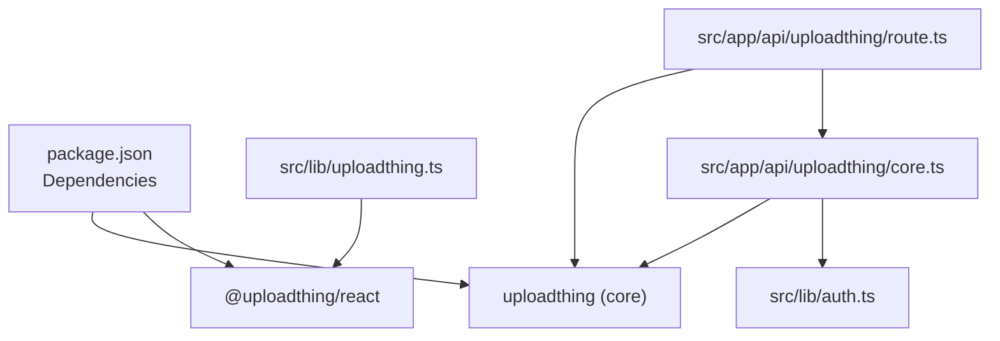

# UploadThing Integration

<cite>
**Referenced Files in This Document**
- [uploadthing.ts](file://src/lib/uploadthing.ts)
- [core.ts](file://src/app/api/uploadthing/core.ts)
- [route.ts](file://src/app/api/uploadthing/route.ts)
- [CMS.tsx](file://src/screens/CMS.tsx)
- [auth.ts](file://src/lib/auth.ts)
- [package.json](file://package.json)
- [.env.example](file://.env.example)
</cite>

## Table of Contents
1. [Introduction](#introduction)
2. [Project Structure](#project-structure)
3. [Core Components](#core-components)
4. [Architecture Overview](#architecture-overview)
5. [Detailed Component Analysis](#detailed-component-analysis)
6. [Dependency Analysis](#dependency-analysis)
7. [Performance Considerations](#performance-considerations)
8. [Troubleshooting Guide](#troubleshooting-guide)
9. [Conclusion](#conclusion)

## Introduction
This document explains the UploadThing integration in MatricMaster AI. It covers the UploadThing configuration setup, router definition, and React helper generation. It documents the file routing system, endpoint registration, and API route structure. It also details the integration between client-side upload helpers and server-side handlers, including authentication integration and permission management. Examples of file router configuration, endpoint customization, and error handling patterns are included to help developers extend or modify the upload functionality.

## Project Structure
UploadThing is integrated into the application via three primary locations:
- Client-side React helpers: generated in a dedicated library module
- Server-side API route handler: registered under the Next.js App Router
- File router definition: specifies endpoints, middleware, and completion handlers

**Diagram sources**
- [uploadthing.ts](file://src/lib/uploadthing.ts#L1-L6)
- [route.ts](file://src/app/api/uploadthing/route.ts#L1-L12)
- [core.ts](file://src/app/api/uploadthing/core.ts#L1-L34)
- [CMS.tsx](file://src/screens/CMS.tsx#L60-L254)
- [auth.ts](file://src/lib/auth.ts#L1-L103)

**Section sources**
- [uploadthing.ts](file://src/lib/uploadthing.ts#L1-L6)
- [route.ts](file://src/app/api/uploadthing/route.ts#L1-L12)
- [core.ts](file://src/app/api/uploadthing/core.ts#L1-L34)
- [CMS.tsx](file://src/screens/CMS.tsx#L60-L254)
- [auth.ts](file://src/lib/auth.ts#L1-L103)

## Core Components
- Client-side React helpers: Generated using UploadThing's helper generator and typed against the application's FileRouter. These helpers enable uploading files directly from React components.
- Server-side route handler: Exposes GET and POST endpoints for the FileRouter and reads configuration from environment variables.
- FileRouter: Defines the upload endpoint(s), validation rules, middleware for authentication, and completion callbacks.

Key responsibilities:
- Client-side: Provide a simple upload interface and return URLs for uploaded files.
- Server-side: Validate uploads, enforce permissions, and return structured results to the client.
- Authentication: Middleware verifies user sessions before allowing uploads.

**Section sources**
- [uploadthing.ts](file://src/lib/uploadthing.ts#L1-L6)
- [route.ts](file://src/app/api/uploadthing/route.ts#L1-L12)
- [core.ts](file://src/app/api/uploadthing/core.ts#L1-L34)

## Architecture Overview
The UploadThing integration follows a clean separation of concerns:
- Client uploads files via generated helpers to the server.
- The server validates the request and enforces authentication.
- On successful upload, the server returns metadata and file URLs to the client.
- The client updates local state with the returned file URL.

**Diagram sources**
- [CMS.tsx](file://src/screens/CMS.tsx#L245-L254)
- [uploadthing.ts](file://src/lib/uploadthing.ts#L1-L6)
- [route.ts](file://src/app/api/uploadthing/route.ts#L1-L12)
- [core.ts](file://src/app/api/uploadthing/core.ts#L10-L31)
- [auth.ts](file://src/lib/auth.ts#L1-L103)

## Detailed Component Analysis

### Client-Side Upload Helpers
- Purpose: Provide strongly-typed React helpers for uploading files.
- Generation: Uses UploadThing's helper generator with the application's FileRouter type.
- Usage pattern: Import the generated helper and call it with the endpoint name and files array.

Implementation highlights:
- Strong typing ensures compile-time safety for endpoint names and return types.
- Simplifies client-side integration by abstracting network requests and response parsing.

Integration example:
- The CMS screen imports the upload helper and uses it to upload images for questions.

**Section sources**
- [uploadthing.ts](file://src/lib/uploadthing.ts#L1-L6)
- [CMS.tsx](file://src/screens/CMS.tsx#L60-L61)
- [CMS.tsx](file://src/screens/CMS.tsx#L245-L254)

### Server-Side Route Handler
- Purpose: Register UploadThing endpoints with Next.js App Router and forward requests to the FileRouter.
- Configuration: Reads UploadThing token from environment variables.
- Exported methods: GET and POST handlers for the router.

Key points:
- Ensures the correct UploadThing configuration is applied at runtime.
- Provides a single entry point for all upload-related requests.

**Section sources**
- [route.ts](file://src/app/api/uploadthing/route.ts#L1-L12)

### FileRouter Definition
- Purpose: Define upload endpoints, validation rules, middleware, and completion callbacks.
- Endpoint: Single endpoint named for question images.
- Validation: Limits file type to images and sets maximum file size and count.
- Middleware: Verifies user authentication via Better Auth and passes user ID to completion handler.
- Completion callback: Logs successful uploads and returns metadata and file URL to the client.

Extensibility:
- Additional endpoints can be added by extending the FileRouter object.
- Middleware can be customized per endpoint for granular permission checks.

**Section sources**
- [core.ts](file://src/app/api/uploadthing/core.ts#L1-L34)

### Authentication Integration
- Purpose: Enforce user authentication before allowing uploads.
- Mechanism: Middleware retrieves the current session using Better Auth and throws an error if unauthenticated.
- Outcome: Ensures only logged-in users can upload files.

**Section sources**
- [core.ts](file://src/app/api/uploadthing/core.ts#L12-L22)
- [auth.ts](file://src/lib/auth.ts#L1-L103)

### Client-Server Interaction Flow
- Client initiates upload using the generated helper.
- Request reaches the route handler and is dispatched to the FileRouter endpoint.
- Middleware validates the session and proceeds if authenticated.
- Server completes the upload and returns metadata and file URL.
- Client receives the result and updates state accordingly.

**Diagram sources**
- [CMS.tsx](file://src/screens/CMS.tsx#L245-L254)
- [route.ts](file://src/app/api/uploadthing/route.ts#L6-L11)
- [core.ts](file://src/app/api/uploadthing/core.ts#L12-L31)

## Dependency Analysis
UploadThing integrates with the following dependencies and modules:
- Client-side helpers depend on the FileRouter type to ensure type safety.
- Server-side route handler depends on the FileRouter and environment configuration.
- FileRouter depends on Better Auth for session verification.
- Package dependencies include UploadThing libraries for React and core functionality.

**Diagram sources**
- [package.json](file://package.json#L45-L62)
- [uploadthing.ts](file://src/lib/uploadthing.ts#L1-L6)
- [route.ts](file://src/app/api/uploadthing/route.ts#L1-L12)
- [core.ts](file://src/app/api/uploadthing/core.ts#L1-L34)
- [auth.ts](file://src/lib/auth.ts#L1-L103)

**Section sources**
- [package.json](file://package.json#L45-L62)
- [uploadthing.ts](file://src/lib/uploadthing.ts#L1-L6)
- [route.ts](file://src/app/api/uploadthing/route.ts#L1-L12)
- [core.ts](file://src/app/api/uploadthing/core.ts#L1-L34)
- [auth.ts](file://src/lib/auth.ts#L1-L103)

## Performance Considerations
- File size limits: The current configuration restricts uploads to a single image with a maximum size, reducing bandwidth and storage overhead.
- Client-side previews: The CMS component generates local previews for immediate feedback, minimizing unnecessary server round trips until upload is confirmed.
- Minimal middleware: Authentication checks are lightweight and performed server-side to maintain security without impacting client performance.

## Troubleshooting Guide
Common issues and resolutions:
- Missing UploadThing token:
  - Symptom: Upload handler fails to initialize.
  - Resolution: Set the UploadThing token in environment variables and redeploy.
- Authentication failures:
  - Symptom: Unauthorized errors during upload.
  - Resolution: Ensure the user is logged in and the session is valid; verify Better Auth configuration.
- Upload errors:
  - Symptom: Client receives an error or empty result.
  - Resolution: Check server logs for thrown errors and confirm the endpoint name matches the FileRouter.
- Environment configuration:
  - Reference: The environment example file defines the required UploadThing token variable.

**Section sources**
- [.env.example](file://.env.example#L11-L12)
- [core.ts](file://src/app/api/uploadthing/core.ts#L18-L18)
- [route.ts](file://src/app/api/uploadthing/route.ts#L8-L11)

## Conclusion
The UploadThing integration in MatricMaster AI provides a secure, type-safe, and extensible file upload mechanism. By combining strong typing on the client, robust server-side validation and authentication, and a clear separation of concerns, the system supports future enhancements such as additional endpoints, stricter validation rules, and advanced permission controls. The current implementation demonstrates a solid foundation for managing question images within the CMS workflow.