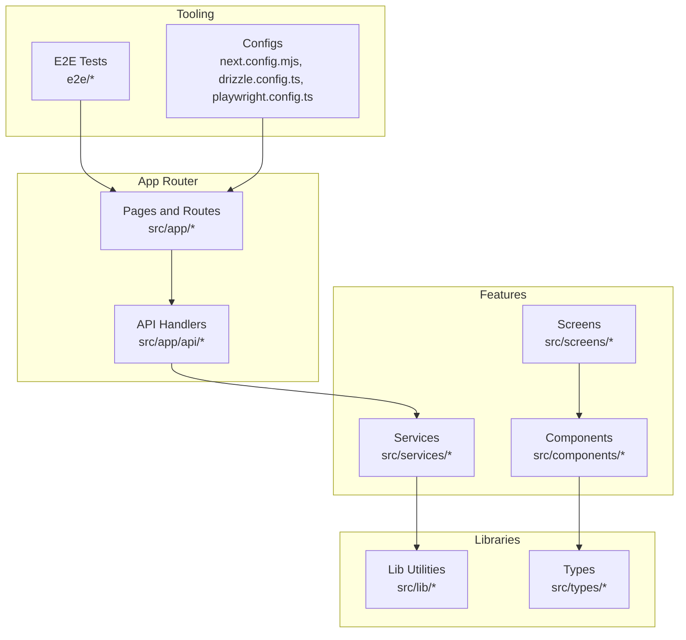
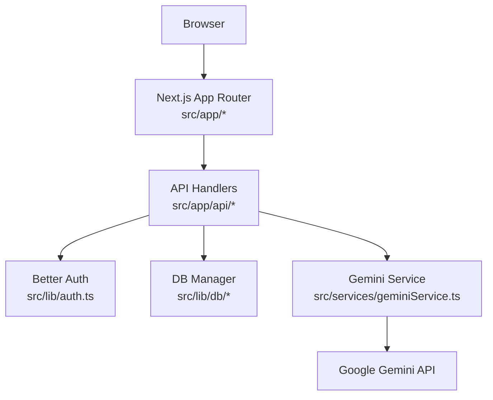
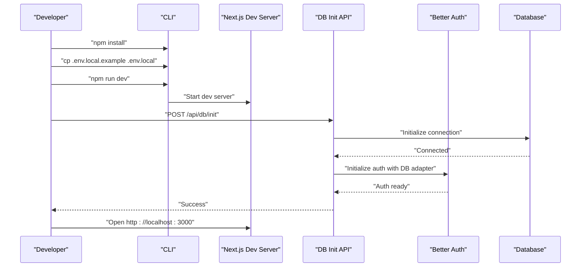
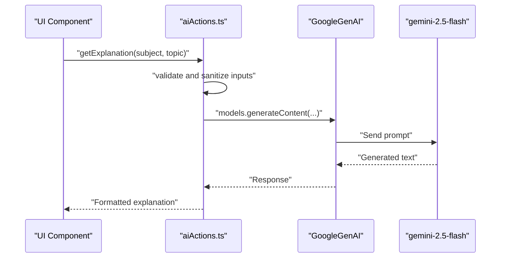
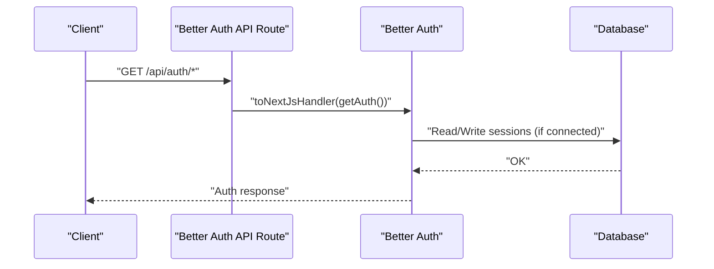
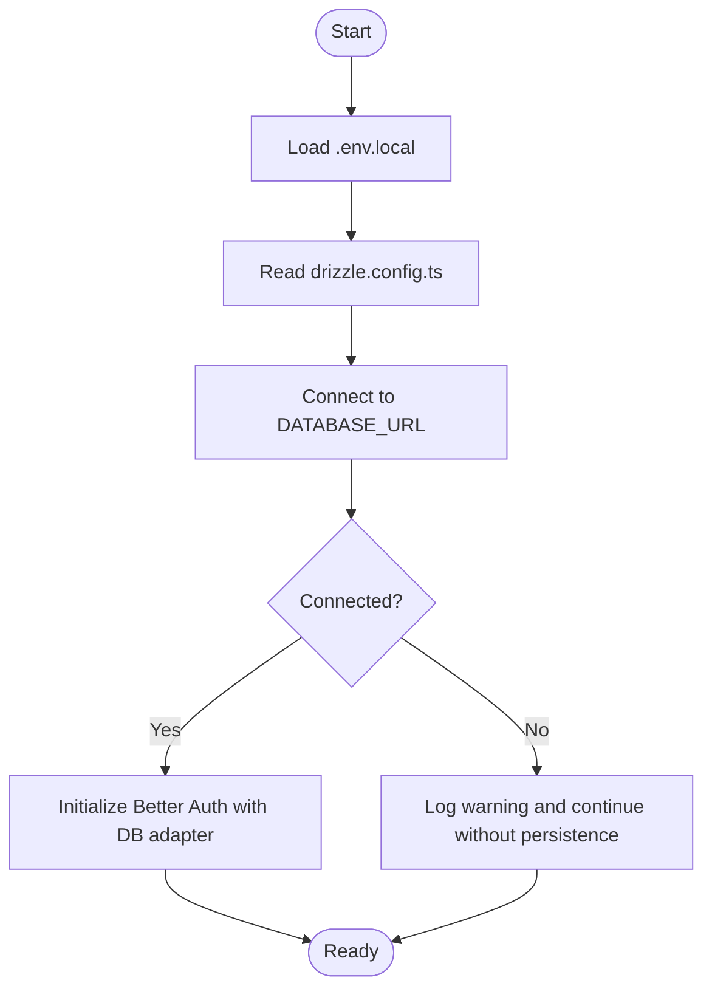
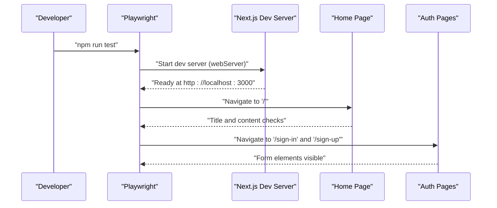
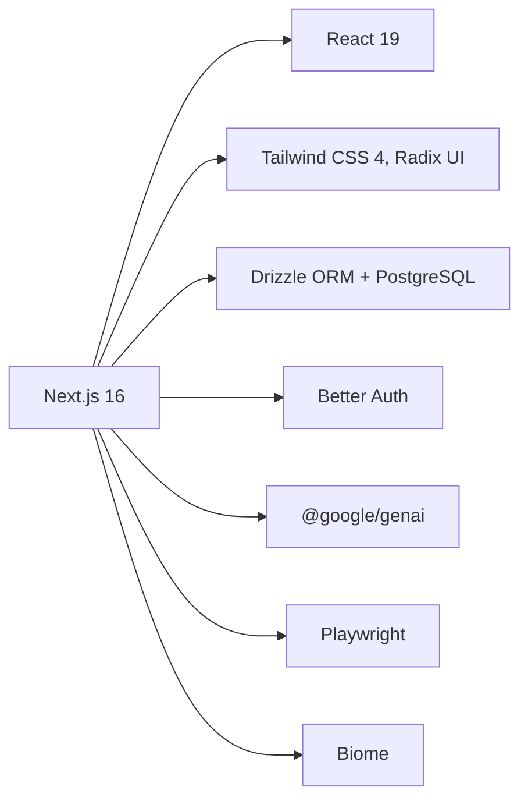

# Getting Started

<cite>
**Referenced Files in This Document**
- [README.md](file://README.md)
- [package.json](file://package.json)
- [.env.example](file://.env.example)
- [next.config.mjs](file://next.config.mjs)
- [drizzle.config.ts](file://drizzle.config.ts)
- [SETUP_LOCAL_DB.md](file://SETUP_LOCAL_DB.md)
- [playwright.config.ts](file://playwright.config.ts)
- [src/services/geminiService.ts](file://src/services/geminiService.ts)
- [src/services/aiActions.ts](file://src/services/aiActions.ts)
- [src/lib/env.ts](file://src/lib/env.ts)
- [src/lib/auth.ts](file://src/lib/auth.ts)
- [src/app/api/db/init/route.ts](file://src/app/api/db/init/route.ts)
- [src/app/api/auth/[...better-auth]/route.ts](file://src/app/api/auth/[...better-auth]/route.ts)
- [e2e/home.spec.ts](file://e2e/home.spec.ts)
- [e2e/auth.spec.ts](file://e2e/auth.spec.ts)
</cite>

## Table of Contents
1. [Introduction](#introduction)
2. [Project Structure](#project-structure)
3. [Core Components](#core-components)
4. [Architecture Overview](#architecture-overview)
5. [Detailed Component Analysis](#detailed-component-analysis)
6. [Dependency Analysis](#dependency-analysis)
7. [Performance Considerations](#performance-considerations)
8. [Troubleshooting Guide](#troubleshooting-guide)
9. [Conclusion](#conclusion)
10. [Appendices](#appendices)

## Introduction
MatricMaster AI is a Next.js 16 application built with TypeScript, designed to help South African Grade 12 learners practice past papers, receive AI-powered explanations via Google Gemini, track progress, and personalize study plans. This guide walks you through prerequisites, installation, environment configuration, local development, and running your first tests. It also covers production deployment considerations and troubleshooting tips.

## Project Structure
The repository follows a modern Next.js 16 App Router layout with feature-based organization under src/. Key areas include:
- src/app: App Router pages and API handlers
- src/components: Shared UI components and layouts
- src/screens: Page-level screen components
- src/services: AI and external service integrations
- src/lib: Utilities, environment validation, database, and auth
- e2e: End-to-end tests powered by Playwright
- drizzle: Database schema and migrations

**Diagram sources**
- [next.config.mjs](file://next.config.mjs#L1-L33)
- [drizzle.config.ts](file://drizzle.config.ts#L1-L16)
- [playwright.config.ts](file://playwright.config.ts#L1-L61)

**Section sources**
- [README.md](file://README.md#L88-L105)

## Core Components
- Next.js 16 App Router: Pages, layouts, API routes, and static generation.
- AI Integration: Google Gemini API via dedicated service and server actions.
- Authentication: Better Auth with optional database-backed sessions and social providers.
- Database: Drizzle ORM with PostgreSQL schema and migration tooling.
- Testing: Playwright end-to-end tests with multiple device targets.
- Tooling: Biome for linting/formatting, TypeScript for type safety.

**Section sources**
- [README.md](file://README.md#L23-L30)
- [package.json](file://package.json#L27-L65)

## Architecture Overview
High-level flow during development and runtime:
- Frontend requests pages and UI components from Next.js App Router.
- API routes handle server-side logic, authentication, and database initialization.
- AI actions communicate with Google Gemini to generate explanations, study plans, and search suggestions.
- Environment variables are validated early to ensure required keys are present.

**Diagram sources**
- [src/lib/auth.ts](file://src/lib/auth.ts#L1-L103)
- [src/app/api/db/init/route.ts](file://src/app/api/db/init/route.ts#L1-L100)
- [src/services/geminiService.ts](file://src/services/geminiService.ts#L1-L14)
- [src/services/aiActions.ts](file://src/services/aiActions.ts#L1-L168)

## Detailed Component Analysis

### Prerequisites
- Node.js 20 or later
- Package manager: npm, yarn, or bun
- Google Gemini API key
- Optional: PostgreSQL for full-stack features; SQLite alternative for quick local testing

**Section sources**
- [README.md](file://README.md#L33-L37)
- [SETUP_LOCAL_DB.md](file://SETUP_LOCAL_DB.md#L44-L92)

### Installation and Setup
Follow these steps to set up MatricMaster AI locally:

1. Clone the repository and navigate into the project directory.
2. Install dependencies using your preferred package manager.
3. Set up environment variables:
   - Copy the example environment file to a local file.
   - Add your Google Gemini API key and any optional providers.
   - Configure database URL if using PostgreSQL.
4. Initialize the database connection and Better Auth:
   - Send a POST request to the database init endpoint.
   - Verify connection via GET request to the same endpoint.
5. Start the development server and open http://localhost:3000.

**Diagram sources**
- [src/app/api/db/init/route.ts](file://src/app/api/db/init/route.ts#L30-L99)
- [src/lib/auth.ts](file://src/lib/auth.ts#L72-L87)

**Section sources**
- [README.md](file://README.md#L39-L76)
- [.env.example](file://.env.example#L1-L19)
- [src/app/api/db/init/route.ts](file://src/app/api/db/init/route.ts#L30-L99)

### Environment Variables and Validation
- Required keys include the Google Gemini API key and Better Auth secret.
- The environment validator enforces schema compliance and logs issues.
- In development, defaults are applied for missing optional values; in production, invalid configurations cause a hard failure.

Best practices:
- Keep .env.local out of version control.
- Use NEXT_PUBLIC_APP_URL consistently across frontend and backend.
- For production, mirror all required variables on your hosting platform.

**Section sources**
- [.env.example](file://.env.example#L1-L19)
- [src/lib/env.ts](file://src/lib/env.ts#L1-L62)

### AI Integration with Google Gemini
- The service exposes three primary actions: explanation generation, study plan creation, and smart search.
- Server actions validate inputs, sanitize content, and call the Gemini API.
- Responses are returned to the UI for rendering.

**Diagram sources**
- [src/services/aiActions.ts](file://src/services/aiActions.ts#L42-L78)
- [src/services/geminiService.ts](file://src/services/geminiService.ts#L1-L14)

**Section sources**
- [README.md](file://README.md#L27)
- [src/services/geminiService.ts](file://src/services/geminiService.ts#L1-L14)
- [src/services/aiActions.ts](file://src/services/aiActions.ts#L1-L168)

### Authentication with Better Auth
- Better Auth is initialized with database adapter support when a valid DB connection exists.
- Supports email/password and optional social providers (Google, Twitter).
- Session configuration and trusted origins are derived from environment variables.

**Diagram sources**
- [src/app/api/auth/[...better-auth]/route.ts](file://src/app/api/auth/[...better-auth]/route.ts#L1-L5)
- [src/lib/auth.ts](file://src/lib/auth.ts#L48-L69)

**Section sources**
- [src/lib/auth.ts](file://src/lib/auth.ts#L1-L103)
- [src/app/api/auth/[...better-auth]/route.ts](file://src/app/api/auth/[...better-auth]/route.ts#L1-L5)

### Database Initialization and Schema
- Drizzle configuration reads credentials from environment variables.
- The schema defines core tables for users, sessions, accounts, subjects, questions, options, and search history.
- Use provided scripts to generate, push, migrate, and seed the database.

**Diagram sources**
- [drizzle.config.ts](file://drizzle.config.ts#L1-L16)
- [src/app/api/db/init/route.ts](file://src/app/api/db/init/route.ts#L44-L79)
- [src/lib/auth.ts](file://src/lib/auth.ts#L9-L21)

**Section sources**
- [drizzle.config.ts](file://drizzle.config.ts#L1-L16)
- [SETUP_LOCAL_DB.md](file://SETUP_LOCAL_DB.md#L1-L92)
- [src/lib/db/schema.ts](file://src/lib/db/schema.ts#L1-L160)

### Development Workflow and First Test Run
- Start the dev server.
- Run end-to-end tests to verify pages and authentication flows.
- Use Playwright’s UI mode and headed modes for debugging.

**Diagram sources**
- [playwright.config.ts](file://playwright.config.ts#L54-L60)
- [e2e/home.spec.ts](file://e2e/home.spec.ts#L1-L26)
- [e2e/auth.spec.ts](file://e2e/auth.spec.ts#L1-L20)

**Section sources**
- [README.md](file://README.md#L77-L87)
- [playwright.config.ts](file://playwright.config.ts#L1-L61)
- [e2e/home.spec.ts](file://e2e/home.spec.ts#L1-L26)
- [e2e/auth.spec.ts](file://e2e/auth.spec.ts#L1-L20)

### Production Deployment
- Build and start the production server using the provided scripts.
- Ensure environment variables are configured on your hosting platform, especially the Google Gemini API key and database URL.
- Recommended platforms include Vercel, Netlify, Railway, or any Node.js host.

**Section sources**
- [README.md](file://README.md#L107-L129)
- [package.json](file://package.json#L8-L10)

## Dependency Analysis
Key runtime and development dependencies:
- Next.js 16 for the framework and App Router
- React 19 and UI libraries for components
- Drizzle ORM and PostgreSQL for data persistence
- Better Auth for authentication
- Google Gemini SDK for AI features
- Playwright for end-to-end testing
- Biome for linting and formatting

**Diagram sources**
- [package.json](file://package.json#L27-L65)

**Section sources**
- [package.json](file://package.json#L27-L65)

## Performance Considerations
- Enable image optimization and remote pattern allowances in Next.js configuration.
- Use production builds for performance-sensitive environments.
- Minimize console logging in production to reduce overhead.
- Keep AI prompts concise and sanitized to reduce latency and cost.

**Section sources**
- [next.config.mjs](file://next.config.mjs#L1-L33)

## Troubleshooting Guide
Common setup issues and resolutions:
- Missing environment variables:
  - Ensure GEMINI_API_KEY and BETTER_AUTH_SECRET are set.
  - Validate with the environment schema; production fails hard on invalid values.
- Database connection failures:
  - Confirm DATABASE_URL is reachable and correct.
  - Use the database init API to verify connectivity and initialize Better Auth.
- AI features disabled:
  - If GEMINI_API_KEY is missing, AI actions return a disabled message.
- Authentication warnings:
  - Without a database connection, Better Auth sessions are not persisted.
- E2E test failures:
  - Run tests with UI mode or headed mode to inspect failures.
  - Ensure the dev server is running before tests.

Verification steps:
- Confirm the dev server starts without errors.
- Visit the home page and authentication pages to verify routing.
- Use the database init endpoint to confirm DB and auth readiness.

**Section sources**
- [src/lib/env.ts](file://src/lib/env.ts#L24-L45)
- [src/app/api/db/init/route.ts](file://src/app/api/db/init/route.ts#L30-L99)
- [src/services/aiActions.ts](file://src/services/aiActions.ts#L22-L32)
- [src/lib/auth.ts](file://src/lib/auth.ts#L13-L21)
- [playwright.config.ts](file://playwright.config.ts#L18-L27)

## Conclusion
You now have the essentials to set up MatricMaster AI locally, configure environment variables, initialize the database and authentication, and run end-to-end tests. For production, mirror the environment variables and deploy using your preferred Node.js hosting platform. Refer to the troubleshooting section if you encounter issues during setup.

## Appendices

### Quick Reference: Environment Variables
- GEMINI_API_KEY: Google Gemini API key
- BETTER_AUTH_SECRET: Secret for Better Auth
- DATABASE_URL: PostgreSQL connection string
- NEXT_PUBLIC_APP_URL: Application base URL
- GOOGLE_CLIENT_ID, GOOGLE_SECRET_KEY: Optional Google OAuth
- TWITTER_CLIENT_ID, TWITTER_CLIENT_SECRET: Optional Twitter OAuth
- UPLOADTHING_TOKEN: Optional file upload token

**Section sources**
- [.env.example](file://.env.example#L1-L19)