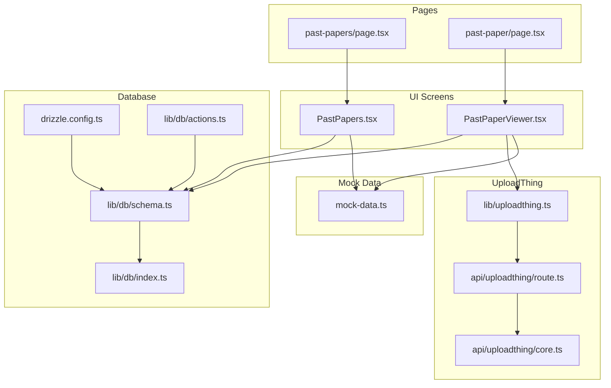
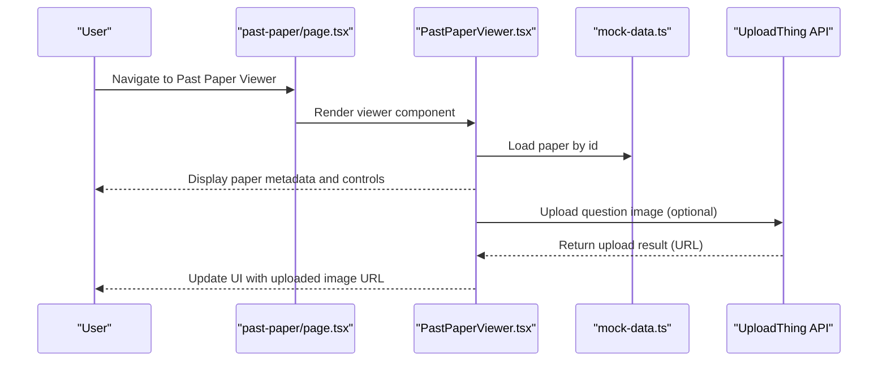
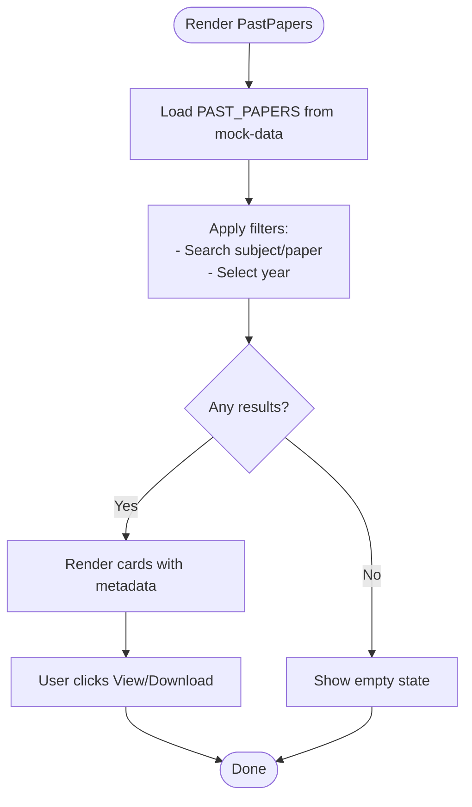
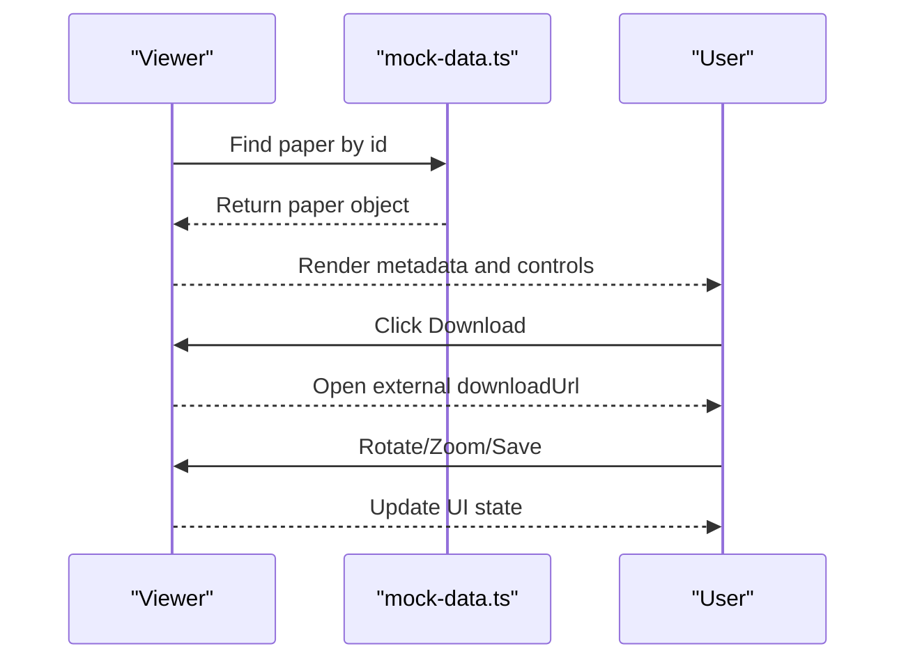
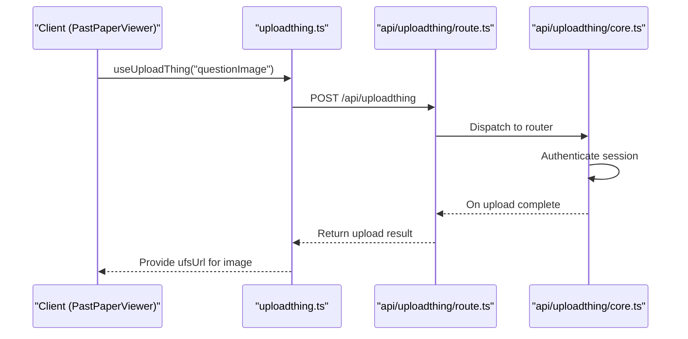
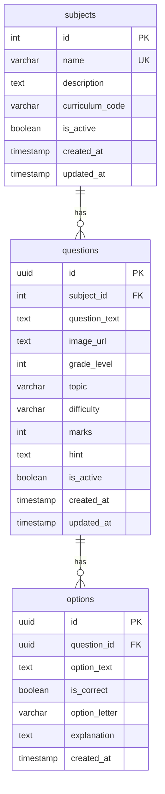
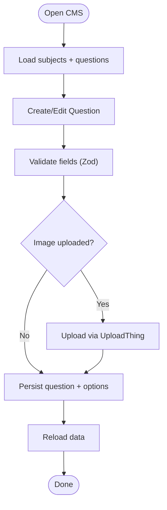
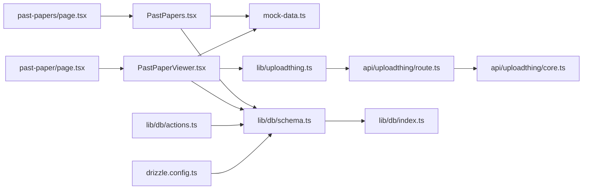

# Content Management

<cite>
**Referenced Files in This Document**
- [mock-data.ts](file://src/constants/mock-data.ts)
- [PastPapers.tsx](file://src/screens/PastPapers.tsx)
- [PastPaperViewer.tsx](file://src/screens/PastPaperViewer.tsx)
- [page.tsx (Past Papers)](file://src/app/past-papers/page.tsx)
- [page.tsx (Past Paper Viewer)](file://src/app/past-paper/page.tsx)
- [uploadthing.ts](file://src/lib/uploadthing.ts)
- [route.ts (UploadThing API)](file://src/app/api/uploadthing/route.ts)
- [core.ts (UploadThing Router)](file://src/app/api/uploadthing/core.ts)
- [index.ts (Types)](file://src/types/index.ts)
- [drizzle.config.ts](file://drizzle.config.ts)
- [db/index.ts](file://src/lib/db/index.ts)
- [db/schema.ts](file://src/lib/db/schema.ts)
- [db/actions.ts](file://src/lib/db/actions.ts)
- [CMS.tsx](file://src/screens/CMS.tsx)
- [mathematics_model.md](file://src/data_modeling/mathematics_model.md)
- [physics_model.md](file://src/data_modeling/physics_model.md)
- [english_model.md](file://src/data_modeling/english_model.md)
</cite>

## Table of Contents
1. [Introduction](#introduction)
2. [Project Structure](#project-structure)
3. [Core Components](#core-components)
4. [Architecture Overview](#architecture-overview)
5. [Detailed Component Analysis](#detailed-component-analysis)
6. [Dependency Analysis](#dependency-analysis)
7. [Performance Considerations](#performance-considerations)
8. [Troubleshooting Guide](#troubleshooting-guide)
9. [Conclusion](#conclusion)
10. [Appendices](#appendices)

## Introduction
This document explains how past paper content is modeled, organized, and managed in the application. It covers:
- Mock data structure for demonstration (paper metadata fields, subjects)
- Content organization by subject and year
- Data validation rules and mock data generation patterns
- Integration with UploadThing for file management
- CRUD operations and database schema considerations
- Examples for adding new subjects, updating paper metadata, and managing content lifecycle
- Discovery and categorization mechanisms and integration with the broader educational ecosystem

## Project Structure
The past paper feature is implemented as a Next.js App Router application with:
- UI screens for browsing and viewing past papers
- Mock data for demonstration
- UploadThing integration for secure file uploads
- Drizzle ORM-backed database schema and actions for persistent content

**Diagram sources**
- [PastPapers.tsx](file://src/screens/PastPapers.tsx#L1-L179)
- [PastPaperViewer.tsx](file://src/screens/PastPaperViewer.tsx#L1-L281)
- [page.tsx (Past Papers)](file://src/app/past-papers/page.tsx#L1-L12)
- [page.tsx (Past Paper Viewer)](file://src/app/past-paper/page.tsx#L1-L17)
- [mock-data.ts](file://src/constants/mock-data.ts#L1-L285)
- [uploadthing.ts](file://src/lib/uploadthing.ts#L1-L6)
- [route.ts (UploadThing API)](file://src/app/api/uploadthing/route.ts#L1-L12)
- [core.ts (UploadThing Router)](file://src/app/api/uploadthing/core.ts#L1-L34)
- [drizzle.config.ts](file://drizzle.config.ts#L1-L16)
- [db/index.ts](file://src/lib/db/index.ts#L1-L102)
- [db/schema.ts](file://src/lib/db/schema.ts#L1-L160)
- [db/actions.ts](file://src/lib/db/actions.ts#L1-L516)

**Section sources**
- [PastPapers.tsx](file://src/screens/PastPapers.tsx#L1-L179)
- [PastPaperViewer.tsx](file://src/screens/PastPaperViewer.tsx#L1-L281)
- [page.tsx (Past Papers)](file://src/app/past-papers/page.tsx#L1-L12)
- [page.tsx (Past Paper Viewer)](file://src/app/past-paper/page.tsx#L1-L17)
- [mock-data.ts](file://src/constants/mock-data.ts#L1-L285)
- [uploadthing.ts](file://src/lib/uploadthing.ts#L1-L6)
- [route.ts (UploadThing API)](file://src/app/api/uploadthing/route.ts#L1-L12)
- [core.ts (UploadThing Router)](file://src/app/api/uploadthing/core.ts#L1-L34)
- [drizzle.config.ts](file://drizzle.config.ts#L1-L16)
- [db/index.ts](file://src/lib/db/index.ts#L1-L102)
- [db/schema.ts](file://src/lib/db/schema.ts#L1-L160)
- [db/actions.ts](file://src/lib/db/actions.ts#L1-L516)

## Core Components
- Mock data provider defines subjects and past papers with metadata fields such as year, subject, paper, month, marks, time, and downloadUrl.
- PastPapers screen renders a searchable and filterable archive of papers by year and subject.
- PastPaperViewer displays paper details, metadata badges, and navigation controls.
- UploadThing integrates secure, authenticated uploads with middleware and completion callbacks.
- Database schema models subjects and questions (for quiz content), with actions enforcing validation and providing CRUD operations.
- CMS screen demonstrates a content authoring workflow with image upload, validation, and persistence.

**Section sources**
- [mock-data.ts](file://src/constants/mock-data.ts#L1-L285)
- [PastPapers.tsx](file://src/screens/PastPapers.tsx#L1-L179)
- [PastPaperViewer.tsx](file://src/screens/PastPaperViewer.tsx#L1-L281)
- [uploadthing.ts](file://src/lib/uploadthing.ts#L1-L6)
- [core.ts (UploadThing Router)](file://src/app/api/uploadthing/core.ts#L1-L34)
- [db/schema.ts](file://src/lib/db/schema.ts#L1-L160)
- [db/actions.ts](file://src/lib/db/actions.ts#L1-L516)
- [CMS.tsx](file://src/screens/CMS.tsx#L1-L800)

## Architecture Overview
The system combines a presentation layer (Next.js App Router pages and client components) with a backend integration layer (UploadThing) and a persistence layer (Drizzle ORM with PostgreSQL).

**Diagram sources**
- [page.tsx (Past Paper Viewer)](file://src/app/past-paper/page.tsx#L1-L17)
- [PastPaperViewer.tsx](file://src/screens/PastPaperViewer.tsx#L1-L281)
- [mock-data.ts](file://src/constants/mock-data.ts#L1-L285)
- [uploadthing.ts](file://src/lib/uploadthing.ts#L1-L6)
- [route.ts (UploadThing API)](file://src/app/api/uploadthing/route.ts#L1-L12)
- [core.ts (UploadThing Router)](file://src/app/api/uploadthing/core.ts#L1-L34)

## Detailed Component Analysis

### Past Papers Archive (PastPapers)
- Purpose: Browse and filter past papers by year and subject.
- Data source: Uses mock paper collection.
- Filtering logic: Combines search term against subject and paper, and year selection.
- UI: Responsive cards with metadata badges, view/download actions.

**Diagram sources**
- [PastPapers.tsx](file://src/screens/PastPapers.tsx#L1-L179)
- [mock-data.ts](file://src/constants/mock-data.ts#L48-L240)

**Section sources**
- [PastPapers.tsx](file://src/screens/PastPapers.tsx#L1-L179)
- [mock-data.ts](file://src/constants/mock-data.ts#L48-L240)

### Past Paper Viewer (PastPaperViewer)
- Purpose: Display a single paper’s metadata and interactive controls (zoom, rotate, save, convert).
- Data source: Loads paper by id from mock data.
- Actions: Download via external URL, rotate/zoom paper, save bookmark state, navigate to interactive quiz.

**Diagram sources**
- [PastPaperViewer.tsx](file://src/screens/PastPaperViewer.tsx#L1-L281)
- [mock-data.ts](file://src/constants/mock-data.ts#L48-L240)

**Section sources**
- [PastPaperViewer.tsx](file://src/screens/PastPaperViewer.tsx#L1-L281)
- [mock-data.ts](file://src/constants/mock-data.ts#L48-L240)

### UploadThing Integration
- Client helpers: React helpers generated for easy upload invocation.
- Route handler: Exposes GET/POST endpoints backed by the file router.
- File router: Defines upload constraints (e.g., image size), authentication middleware, and completion callback.

**Diagram sources**
- [uploadthing.ts](file://src/lib/uploadthing.ts#L1-L6)
- [route.ts (UploadThing API)](file://src/app/api/uploadthing/route.ts#L1-L12)
- [core.ts (UploadThing Router)](file://src/app/api/uploadthing/core.ts#L1-L34)

**Section sources**
- [uploadthing.ts](file://src/lib/uploadthing.ts#L1-L6)
- [route.ts (UploadThing API)](file://src/app/api/uploadthing/route.ts#L1-L12)
- [core.ts (UploadThing Router)](file://src/app/api/uploadthing/core.ts#L1-L34)

### Database Schema and Actions (Quiz Content)
- Schema: Subjects and Questions tables with relations; indexes for performance; active flags for soft deletion.
- Actions: Zod-based validation for create/update; transactional inserts for questions and options; seed action for initial data.

**Diagram sources**
- [db/schema.ts](file://src/lib/db/schema.ts#L42-L114)

**Section sources**
- [db/schema.ts](file://src/lib/db/schema.ts#L1-L160)
- [db/actions.ts](file://src/lib/db/actions.ts#L1-L516)

### CMS Authoring Workflow (Example for Quiz Content)
- Demonstrates validation, image upload, and persistence of questions and options.
- Shows soft-delete semantics and transactional updates.

**Diagram sources**
- [CMS.tsx](file://src/screens/CMS.tsx#L1-L800)
- [db/actions.ts](file://src/lib/db/actions.ts#L265-L419)
- [uploadthing.ts](file://src/lib/uploadthing.ts#L1-L6)

**Section sources**
- [CMS.tsx](file://src/screens/CMS.tsx#L1-L800)
- [db/actions.ts](file://src/lib/db/actions.ts#L1-L516)
- [uploadthing.ts](file://src/lib/uploadthing.ts#L1-L6)

### Data Modeling Guidance (Structured Paper Data)
- Mathematics model: Hierarchical question structure with metadata, normalized DB layout, and LaTeX-ready rendering.
- Physics model: Normalized relational schema for questions, sub-questions, and data sheets.
- English model: Multimodal schema supporting passages, posters, cartoons, and writing tasks.

These models illustrate how to evolve from mock paper lists to structured, queryable content suitable for interactive viewers and AI-powered experiences.

**Section sources**
- [mathematics_model.md](file://src/data_modeling/mathematics_model.md#L1-L212)
- [physics_model.md](file://src/data_modeling/physics_model.md#L1-L376)
- [english_model.md](file://src/data_modeling/english_model.md#L1-L474)

## Dependency Analysis
- Pages depend on screens for rendering.
- Screens consume mock data or database actions depending on the feature.
- UploadThing helpers integrate with route handlers and routers.
- Drizzle configuration points to schema and credentials; database manager handles connections.

**Diagram sources**
- [page.tsx (Past Papers)](file://src/app/past-papers/page.tsx#L1-L12)
- [page.tsx (Past Paper Viewer)](file://src/app/past-paper/page.tsx#L1-L17)
- [PastPapers.tsx](file://src/screens/PastPapers.tsx#L1-L179)
- [PastPaperViewer.tsx](file://src/screens/PastPaperViewer.tsx#L1-L281)
- [mock-data.ts](file://src/constants/mock-data.ts#L1-L285)
- [uploadthing.ts](file://src/lib/uploadthing.ts#L1-L6)
- [route.ts (UploadThing API)](file://src/app/api/uploadthing/route.ts#L1-L12)
- [core.ts (UploadThing Router)](file://src/app/api/uploadthing/core.ts#L1-L34)
- [db/schema.ts](file://src/lib/db/schema.ts#L1-L160)
- [db/index.ts](file://src/lib/db/index.ts#L1-L102)
- [db/actions.ts](file://src/lib/db/actions.ts#L1-L516)
- [drizzle.config.ts](file://drizzle.config.ts#L1-L16)

**Section sources**
- [page.tsx (Past Papers)](file://src/app/past-papers/page.tsx#L1-L12)
- [page.tsx (Past Paper Viewer)](file://src/app/past-paper/page.tsx#L1-L17)
- [PastPapers.tsx](file://src/screens/PastPapers.tsx#L1-L179)
- [PastPaperViewer.tsx](file://src/screens/PastPaperViewer.tsx#L1-L281)
- [mock-data.ts](file://src/constants/mock-data.ts#L1-L285)
- [uploadthing.ts](file://src/lib/uploadthing.ts#L1-L6)
- [route.ts (UploadThing API)](file://src/app/api/uploadthing/route.ts#L1-L12)
- [core.ts (UploadThing Router)](file://src/app/api/uploadthing/core.ts#L1-L34)
- [db/schema.ts](file://src/lib/db/schema.ts#L1-L160)
- [db/index.ts](file://src/lib/db/index.ts#L1-L102)
- [db/actions.ts](file://src/lib/db/actions.ts#L1-L516)
- [drizzle.config.ts](file://drizzle.config.ts#L1-L16)

## Performance Considerations
- Client-side filtering in mock data is efficient for small datasets; pagination and server-side filtering should be considered as content grows.
- UploadThing enforces file size limits and requires authentication, reducing misuse and improving reliability.
- Database indexes on frequently queried columns (subject, difficulty, topic) improve query performance.
- Transactional writes for questions and options ensure data consistency.

## Troubleshooting Guide
- Upload failures: Verify UploadThing token and authentication middleware; check completion logs.
- Database connectivity: Ensure environment variables and connection manager initialization succeed.
- Validation errors: Review Zod schemas in actions for create/update operations.
- Empty results: Confirm filters and mock data availability; verify ids passed to viewers.

**Section sources**
- [core.ts (UploadThing Router)](file://src/app/api/uploadthing/core.ts#L1-L34)
- [db/index.ts](file://src/lib/db/index.ts#L1-L102)
- [db/actions.ts](file://src/lib/db/actions.ts#L1-L516)

## Conclusion
The past paper feature leverages mock data for quick iteration and a robust UploadThing integration for secure file management. The database schema and actions provide a foundation for persistent content, while the CMS demonstrates validation and CRUD patterns. As the platform evolves, structured paper models and normalized schemas enable scalable discovery, categorization, and integration with broader educational workflows.

## Appendices

### Paper Metadata Fields and Organization
- Fields: id, year, subject, paper, month, marks, time, downloadUrl.
- Organization: By subject and year; UI supports year filtering and text search.

**Section sources**
- [mock-data.ts](file://src/constants/mock-data.ts#L48-L240)
- [PastPapers.tsx](file://src/screens/PastPapers.tsx#L18-L26)

### Data Validation Rules
- UploadThing: Image size limit enforced; authenticated uploads.
- Database actions: Zod schemas validate create/update operations; transactions ensure consistency.

**Section sources**
- [core.ts (UploadThing Router)](file://src/app/api/uploadthing/core.ts#L10-L31)
- [db/actions.ts](file://src/lib/db/actions.ts#L17-L47)

### Mock Data Generation Patterns
- Centralized mock arrays for subjects and papers; reusable across screens.
- Viewer resolves paper by id from the mock list.

**Section sources**
- [mock-data.ts](file://src/constants/mock-data.ts#L1-L285)
- [PastPaperViewer.tsx](file://src/screens/PastPaperViewer.tsx#L46-L51)

### Real Content Integration with UploadThing
- Use UploadThing helpers to upload images; persist returned URL in content records.
- Middleware ensures authenticated uploads; completion callback logs and returns metadata.

**Section sources**
- [uploadthing.ts](file://src/lib/uploadthing.ts#L1-L6)
- [core.ts (UploadThing Router)](file://src/app/api/uploadthing/core.ts#L12-L30)

### CRUD Operations and Database Schema
- Create/Read/Update/Delete for subjects and questions with soft-delete support.
- Relations and indexes optimize queries and maintain referential integrity.

**Section sources**
- [db/actions.ts](file://src/lib/db/actions.ts#L182-L419)
- [db/schema.ts](file://src/lib/db/schema.ts#L42-L114)

### Examples: Adding Subjects, Updating Metadata, Lifecycle
- Add new subject: Use createSubjectAction with validated data.
- Update paper metadata: Extend mock data structure or introduce a database-backed paper entity and update action.
- Lifecycle: Soft-delete inactive content; seed database for initial state.

**Section sources**
- [db/actions.ts](file://src/lib/db/actions.ts#L182-L249)
- [mock-data.ts](file://src/constants/mock-data.ts#L48-L240)

### Content Discovery and Categorization
- Discovery: Search by subject/paper; filter by year; badges indicate marks/time.
- Categorization: Group by subject and year; future enhancements can include topics and difficulty.

**Section sources**
- [PastPapers.tsx](file://src/screens/PastPapers.tsx#L20-L26)

### Integration with Broader Educational Ecosystem
- Structured paper models support interactive rendering and AI-powered explanations.
- Normalized schemas enable cross-subject analytics and adaptive learning pathways.

**Section sources**
- [mathematics_model.md](file://src/data_modeling/mathematics_model.md#L119-L147)
- [physics_model.md](file://src/data_modeling/physics_model.md#L14-L79)
- [english_model.md](file://src/data_modeling/english_model.md#L7-L85)