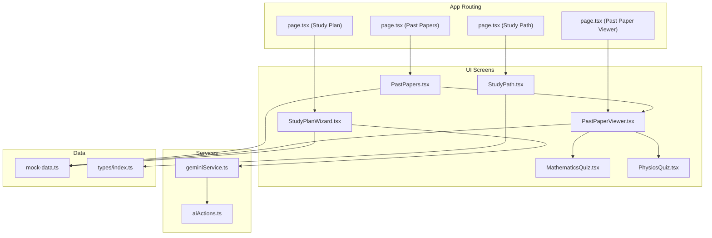
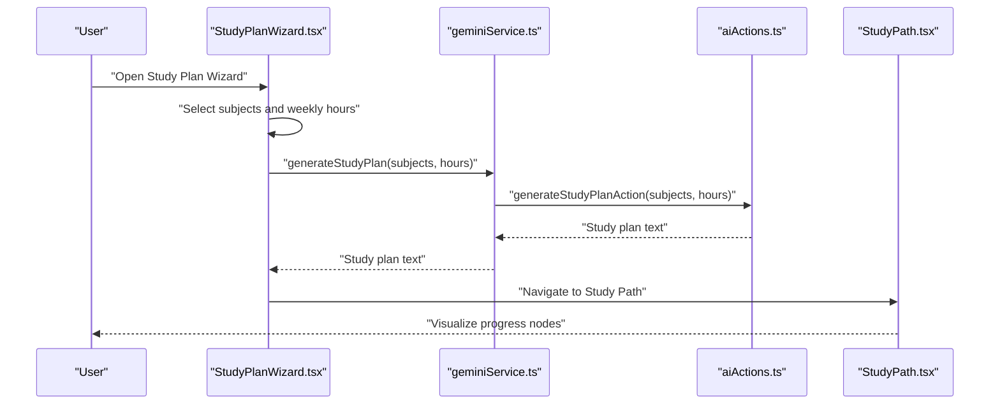
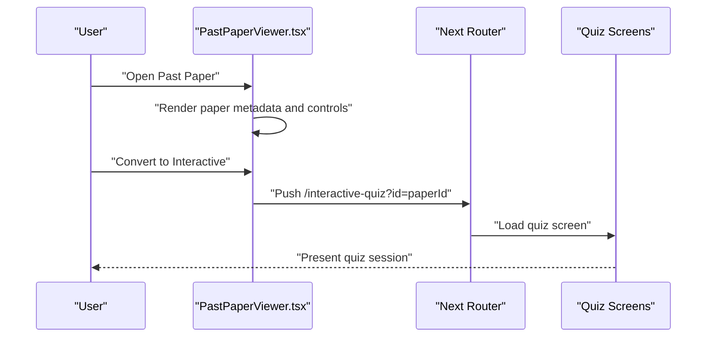
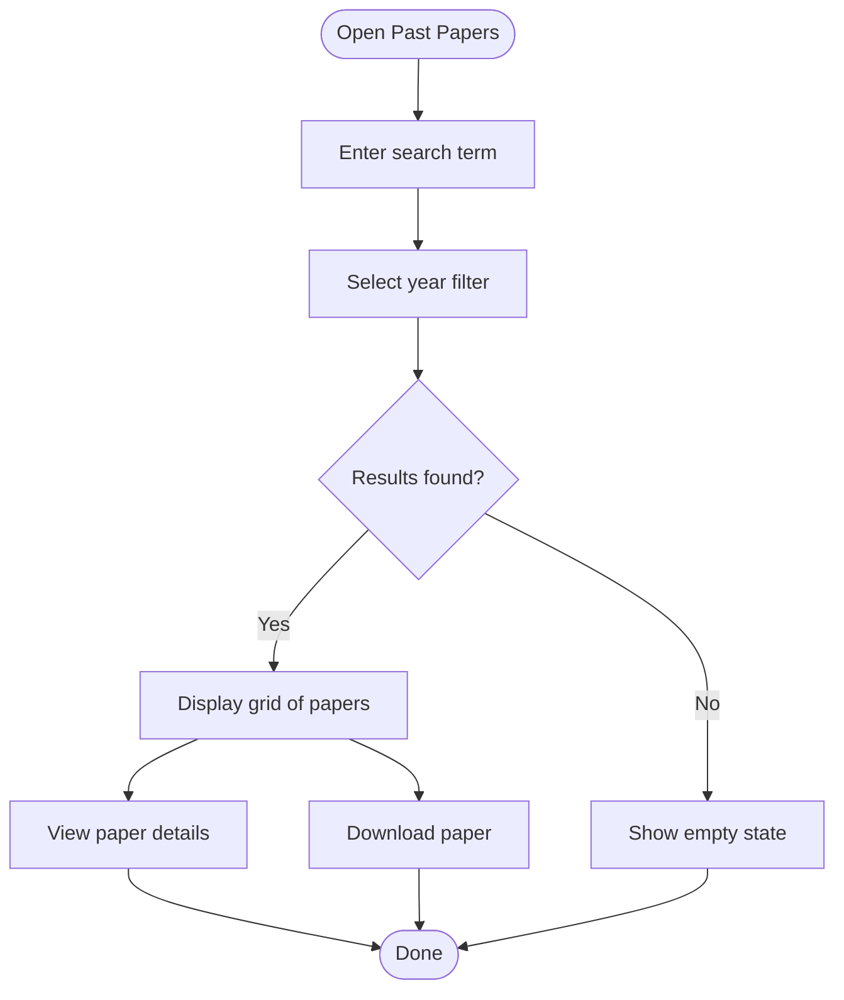
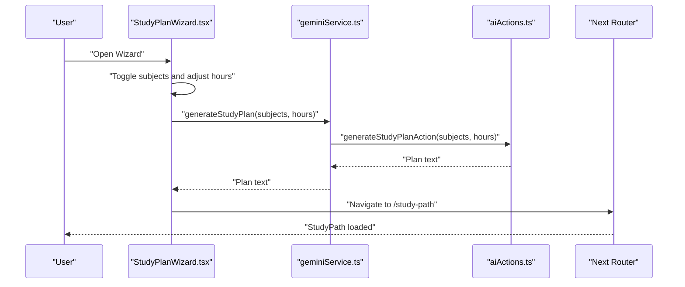
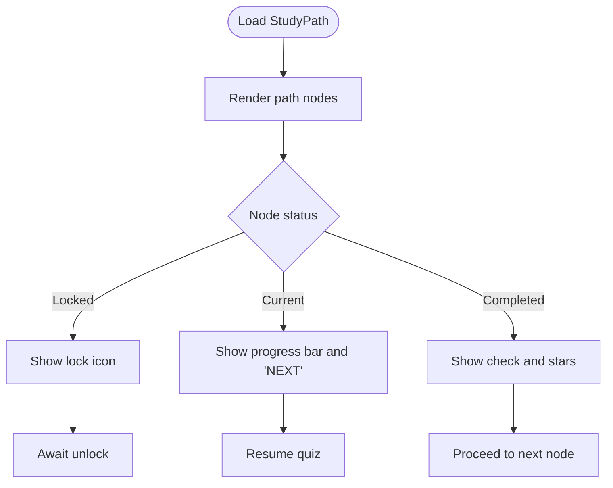
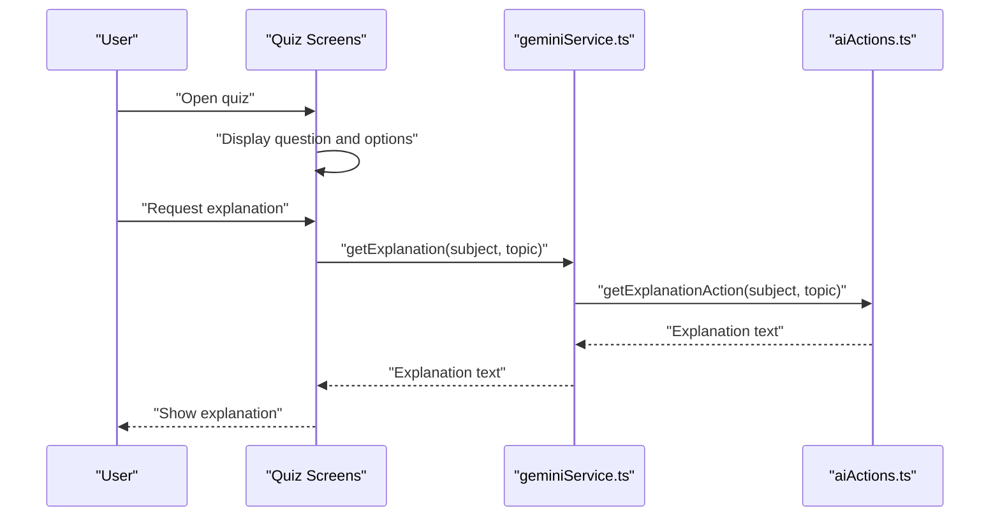
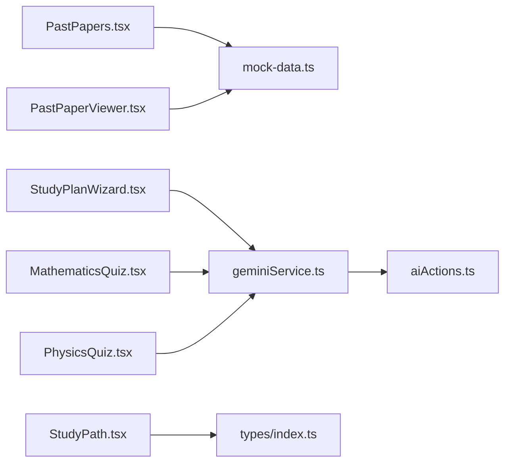

# Integration with Study Planning

<cite>
**Referenced Files in This Document**
- [PastPaperViewer.tsx](file://src/screens/PastPaperViewer.tsx)
- [PastPapers.tsx](file://src/screens/PastPapers.tsx)
- [StudyPlanWizard.tsx](file://src/screens/StudyPlanWizard.tsx)
- [StudyPath.tsx](file://src/screens/StudyPath.tsx)
- [page.tsx (Past Paper Viewer)](file://src/app/past-paper/page.tsx)
- [page.tsx (Past Papers)](file://src/app/past-papers/page.tsx)
- [mock-data.ts](file://src/constants/mock-data.ts)
- [geminiService.ts](file://src/services/geminiService.ts)
- [aiActions.ts](file://src/services/aiActions.ts)
- [MathematicsQuiz.tsx](file://src/screens/MathematicsQuiz.tsx)
- [PhysicsQuiz.tsx](file://src/screens/PhysicsQuiz.tsx)
- [page.tsx (Study Plan)](file://src/app/study-plan/page.tsx)
- [page.tsx (Study Path)](file://src/app/study-path/page.tsx)
- [index.ts (types)](file://src/types/index.ts)
- [evaluation.ts (types)](file://src/types/evaluation.ts)
</cite>

## Table of Contents
1. [Introduction](#introduction)
2. [Project Structure](#project-structure)
3. [Core Components](#core-components)
4. [Architecture Overview](#architecture-overview)
5. [Detailed Component Analysis](#detailed-component-analysis)
6. [Dependency Analysis](#dependency-analysis)
7. [Performance Considerations](#performance-considerations)
8. [Troubleshooting Guide](#troubleshooting-guide)
9. [Conclusion](#conclusion)
10. [Appendices](#appendices)

## Introduction
This document explains how past papers integrate with study planning features. It covers adding past papers to study plans, aligning paper sequencing with curriculum and skill gaps, deriving study plans from performance, and visualizing progress via StudyPath. It also documents integration points with StudyPlanWizard for generating structured practice sessions, the quiz system for complementary practice, and how paper access logs can synchronize with study progress metrics.

## Project Structure
The relevant parts of the application are organized around:
- Past paper browsing and viewing screens
- Study planning wizard and path visualization
- AI-backed explanation and plan generation
- Quiz screens that complement paper-based practice

**Diagram sources**
- [PastPapers.tsx](file://src/screens/PastPapers.tsx#L1-L179)
- [PastPaperViewer.tsx](file://src/screens/PastPaperViewer.tsx#L1-L281)
- [StudyPlanWizard.tsx](file://src/screens/StudyPlanWizard.tsx#L1-L243)
- [StudyPath.tsx](file://src/screens/StudyPath.tsx#L1-L273)
- [page.tsx (Past Paper Viewer)](file://src/app/past-paper/page.tsx#L1-L17)
- [page.tsx (Past Papers)](file://src/app/past-papers/page.tsx#L1-L12)
- [page.tsx (Study Plan)](file://src/app/study-plan/page.tsx#L1-L12)
- [page.tsx (Study Path)](file://src/app/study-path/page.tsx#L1-L12)
- [geminiService.ts](file://src/services/geminiService.ts#L1-L14)
- [aiActions.ts](file://src/services/aiActions.ts#L1-L168)
- [mock-data.ts](file://src/constants/mock-data.ts#L1-L285)
- [index.ts (types)](file://src/types/index.ts#L1-L60)

**Section sources**
- [page.tsx (Past Paper Viewer)](file://src/app/past-paper/page.tsx#L1-L17)
- [page.tsx (Past Papers)](file://src/app/past-papers/page.tsx#L1-L12)
- [page.tsx (Study Plan)](file://src/app/study-plan/page.tsx#L1-L12)
- [page.tsx (Study Path)](file://src/app/study-path/page.tsx#L1-L12)

## Core Components
- Past Papers Listing and Filtering: Browse downloadable past papers, filter by year and subject.
- Past Paper Viewer: View paper content, zoom/rotate, save, convert to interactive quiz.
- Study Plan Wizard: Select subjects, set weekly commitment, generate AI-backed study plan, navigate to StudyPath.
- Study Path: Visualize progress nodes, current activity, completion status, and resume actions.
- Quiz Integration: Convert paper practice into structured quizzes with AI explanations and scoring.
- Mock Data: Centralized past paper metadata and curated content for demonstration.

Key integration points:
- Past Paper Viewer links to quiz screens for complementary practice.
- Study Plan Wizard invokes AI to generate a study plan and navigates to StudyPath.
- StudyPath displays progress nodes derived from planned activities and quiz outcomes.

**Section sources**
- [PastPapers.tsx](file://src/screens/PastPapers.tsx#L1-L179)
- [PastPaperViewer.tsx](file://src/screens/PastPaperViewer.tsx#L1-L281)
- [StudyPlanWizard.tsx](file://src/screens/StudyPlanWizard.tsx#L1-L243)
- [StudyPath.tsx](file://src/screens/StudyPath.tsx#L1-L273)
- [mock-data.ts](file://src/constants/mock-data.ts#L48-L240)

## Architecture Overview
The integration centers on three workflows:
1. Paper-to-Plan: Users select subjects and hours, AI generates a daily quest path, then StudyPath visualizes progress.
2. Paper-to-Practice: Users open a paper and optionally convert it to an interactive quiz for targeted practice.
3. Progress Tracking: StudyPath aggregates progress from quiz performance and planned activities.

**Diagram sources**
- [StudyPlanWizard.tsx](file://src/screens/StudyPlanWizard.tsx#L33-L60)
- [geminiService.ts](file://src/services/geminiService.ts#L7-L9)
- [aiActions.ts](file://src/services/aiActions.ts#L80-L114)
- [page.tsx (Study Plan)](file://src/app/study-plan/page.tsx#L1-L12)
- [page.tsx (Study Path)](file://src/app/study-path/page.tsx#L1-L12)

## Detailed Component Analysis

### Past Paper Viewer and Quiz Integration
- Purpose: Display paper content, provide controls (zoom, rotate, save), and link to interactive quizzes.
- Key behaviors:
  - Navigation to quiz via conversion action.
  - Save paper state (bookmarking) for later review.
  - Access paper metadata (marks, time) to inform scheduling.

**Diagram sources**
- [PastPaperViewer.tsx](file://src/screens/PastPaperViewer.tsx#L35-L67)
- [page.tsx (Past Paper Viewer)](file://src/app/past-paper/page.tsx#L1-L17)

**Section sources**
- [PastPaperViewer.tsx](file://src/screens/PastPaperViewer.tsx#L35-L67)
- [page.tsx (Past Paper Viewer)](file://src/app/past-paper/page.tsx#L1-L17)

### Past Papers Listing and Filtering
- Purpose: Discover and filter past papers by subject and year.
- Key behaviors:
  - Search by subject or paper name.
  - Year filtering with a compact selector.
  - Download and view actions per paper.

**Diagram sources**
- [PastPapers.tsx](file://src/screens/PastPapers.tsx#L13-L179)

**Section sources**
- [PastPapers.tsx](file://src/screens/PastPapers.tsx#L13-L179)
- [page.tsx (Past Papers)](file://src/app/past-papers/page.tsx#L1-L12)

### Study Plan Wizard and AI Plan Generation
- Purpose: Collect user preferences and generate a structured daily quest path.
- Key behaviors:
  - Subject selection toggles.
  - Weekly hours slider.
  - AI plan generation via Gemini.
  - Navigation to StudyPath after generation.

**Diagram sources**
- [StudyPlanWizard.tsx](file://src/screens/StudyPlanWizard.tsx#L33-L60)
- [geminiService.ts](file://src/services/geminiService.ts#L7-L9)
- [aiActions.ts](file://src/services/aiActions.ts#L80-L114)
- [page.tsx (Study Plan)](file://src/app/study-plan/page.tsx#L1-L12)

**Section sources**
- [StudyPlanWizard.tsx](file://src/screens/StudyPlanWizard.tsx#L33-L60)
- [geminiService.ts](file://src/services/geminiService.ts#L1-L14)
- [aiActions.ts](file://src/services/aiActions.ts#L80-L114)

### Study Path Progress Visualization
- Purpose: Visualize progress nodes, current activity, and completion status.
- Key behaviors:
  - Nodes represent topics/tasks aligned with the generated plan.
  - Progress bars and badges indicate status and next steps.
  - Resume actions link to quiz screens for continued practice.

**Diagram sources**
- [StudyPath.tsx](file://src/screens/StudyPath.tsx#L38-L273)

**Section sources**
- [StudyPath.tsx](file://src/screens/StudyPath.tsx#L38-L273)

### Quiz System Integration
- Purpose: Provide structured, topic-aligned practice sessions that complement paper-based learning.
- Key behaviors:
  - AI explanations for concepts and questions.
  - Scoring and feedback for correctness.
  - Navigation to completion and next steps.

**Diagram sources**
- [MathematicsQuiz.tsx](file://src/screens/MathematicsQuiz.tsx#L32-L56)
- [PhysicsQuiz.tsx](file://src/screens/PhysicsQuiz.tsx#L164-L192)
- [geminiService.ts](file://src/services/geminiService.ts#L3-L5)
- [aiActions.ts](file://src/services/aiActions.ts#L42-L78)

**Section sources**
- [MathematicsQuiz.tsx](file://src/screens/MathematicsQuiz.tsx#L32-L56)
- [PhysicsQuiz.tsx](file://src/screens/PhysicsQuiz.tsx#L164-L192)
- [geminiService.ts](file://src/services/geminiService.ts#L1-L14)
- [aiActions.ts](file://src/services/aiActions.ts#L42-L78)

## Dependency Analysis
- Past Papers depend on mock data for metadata and download URLs.
- StudyPlanWizard depends on geminiService and aiActions for plan generation.
- StudyPath depends on types for progress modeling and UI rendering.
- Quiz screens depend on geminiService for explanations and on aiActions for AI responses.

**Diagram sources**
- [PastPapers.tsx](file://src/screens/PastPapers.tsx#L1-L179)
- [PastPaperViewer.tsx](file://src/screens/PastPaperViewer.tsx#L1-L281)
- [StudyPlanWizard.tsx](file://src/screens/StudyPlanWizard.tsx#L1-L243)
- [StudyPath.tsx](file://src/screens/StudyPath.tsx#L1-L273)
- [geminiService.ts](file://src/services/geminiService.ts#L1-L14)
- [aiActions.ts](file://src/services/aiActions.ts#L1-L168)
- [mock-data.ts](file://src/constants/mock-data.ts#L1-L285)
- [index.ts (types)](file://src/types/index.ts#L1-L60)

**Section sources**
- [mock-data.ts](file://src/constants/mock-data.ts#L48-L240)
- [geminiService.ts](file://src/services/geminiService.ts#L1-L14)
- [aiActions.ts](file://src/services/aiActions.ts#L1-L168)
- [index.ts (types)](file://src/types/index.ts#L1-L60)

## Performance Considerations
- Lazy loading of AI features: The StudyPlanWizard conditionally imports the AI generation function to avoid unnecessary overhead.
- Client-side filtering: Past Papers listing performs client-side filtering; consider server-side pagination for large datasets.
- Rendering optimization: StudyPath uses SVG paths and positioned nodes; keep node counts reasonable to maintain smooth scrolling.
- Quiz responsiveness: Debounce AI explanation requests and cache short-lived explanations to reduce repeated network calls.

## Troubleshooting Guide
- AI features disabled: If the Gemini API key is missing, AI functions return a disabled message. Verify environment configuration.
- Network errors: The AI actions wrap errors and return user-friendly messages; check console logs for details.
- Navigation issues: Ensure routing paths (/study-plan, /study-path, /past-paper) are correctly mapped in app pages.

**Section sources**
- [aiActions.ts](file://src/services/aiActions.ts#L22-L32)
- [aiActions.ts](file://src/services/aiActions.ts#L71-L78)
- [aiActions.ts](file://src/services/aiActions.ts#L107-L114)
- [aiActions.ts](file://src/services/aiActions.ts#L160-L167)

## Conclusion
The integration of past papers with study planning leverages a clear flow from paper discovery to structured practice and progress visualization. By aligning paper sequencing with curriculum and skill gaps, and by generating study plans from performance insights, users can build personalized, data-informed learning journeys. The quiz system complements this by offering targeted, AI-enhanced practice that feeds back into progress tracking.

## Appendices

### Automated Paper Recommendation Algorithms (Conceptual)
- Curricular alignment: Match paper topics to planned path nodes and curriculum maps.
- Skill gap detection: Use quiz scores and topic tags to prioritize remediation papers.
- Difficulty balancing: Weight papers by average student performance and topic difficulty.
- Sequencing heuristics: Prefer foundational topics before advanced ones; cluster related topics.

[No sources needed since this section provides conceptual guidance]

### Study Plan Generation from Past Paper Performance (Conceptual)
- Aggregate quiz scores and topic mastery indicators from paper-based practice.
- Weight subjects by weekly commitment and exam proximity.
- Generate daily quests that revisit weak topics and introduce new ones.

[No sources needed since this section provides conceptual guidance]

### Data Synchronization Between Paper Access Logs and Study Progress Metrics (Conceptual)
- Track paper views, downloads, and quiz starts/completions.
- Map quiz scores and timestamps to path nodes.
- Update progress bars and node unlocks based on thresholds (e.g., score ≥ threshold, time spent ≥ target).

[No sources needed since this section provides conceptual guidance]