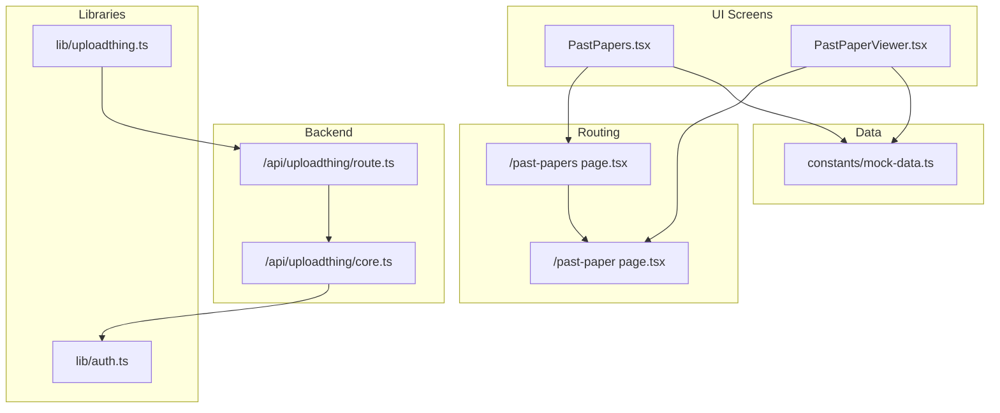
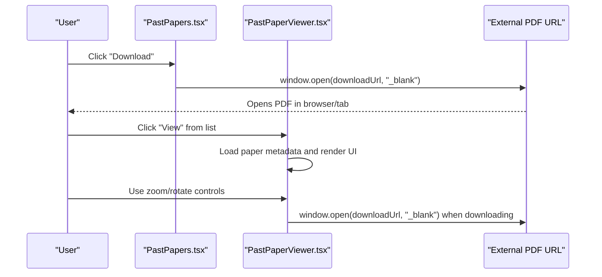
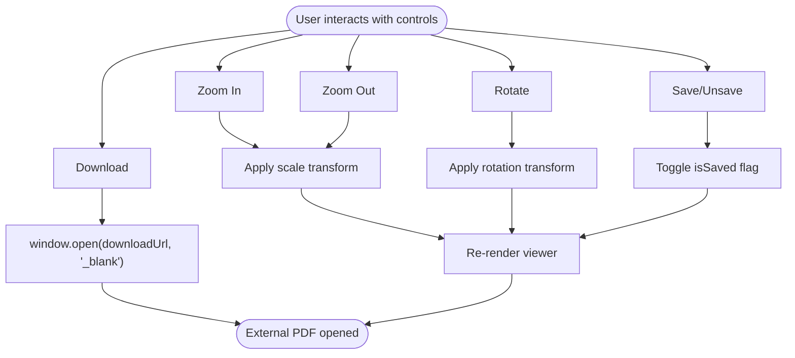
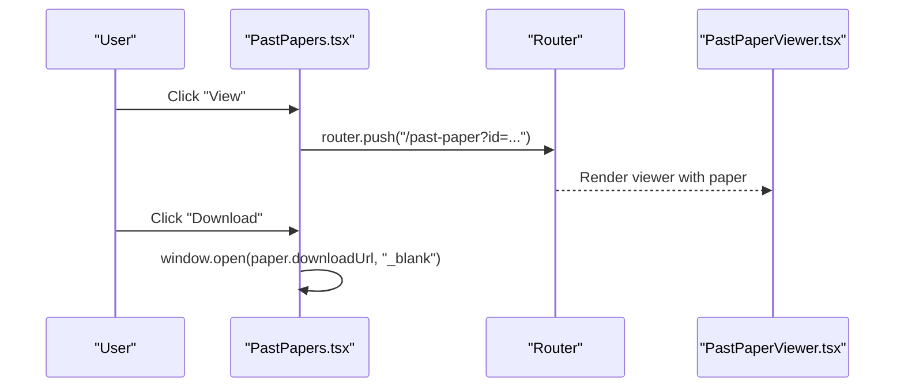
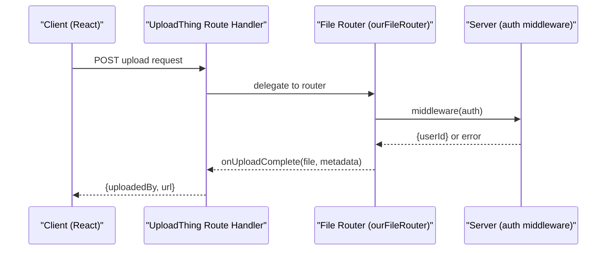
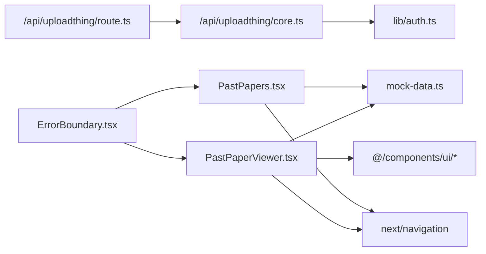

# PDF Viewing and Download

<cite>
**Referenced Files in This Document**
- [PastPaperViewer.tsx](file://src/screens/PastPaperViewer.tsx)
- [PastPapers.tsx](file://src/screens/PastPapers.tsx)
- [mock-data.ts](file://src/constants/mock-data.ts)
- [route.ts](file://src/app/api/uploadthing/route.ts)
- [core.ts](file://src/app/api/uploadthing/core.ts)
- [uploadthing.ts](file://src/lib/uploadthing.ts)
- [auth.ts](file://src/lib/auth.ts)
- [ErrorBoundary.tsx](file://src/components/ErrorBoundary.tsx)
- [page.tsx](file://src/app/past-paper/page.tsx)
- [page.tsx](file://src/app/past-papers/page.tsx)
</cite>

## Table of Contents
1. [Introduction](#introduction)
2. [Project Structure](#project-structure)
3. [Core Components](#core-components)
4. [Architecture Overview](#architecture-overview)
5. [Detailed Component Analysis](#detailed-component-analysis)
6. [Dependency Analysis](#dependency-analysis)
7. [Performance Considerations](#performance-considerations)
8. [Troubleshooting Guide](#troubleshooting-guide)
9. [Conclusion](#conclusion)

## Introduction
This document explains the PDF viewing and download functionality in the application. It focuses on:
- Browser-based PDF access via external links
- Zoom controls and rotation for readability
- Navigation features and save/bookmarking
- Download handling using window.open()
- Integration with UploadThing for file management
- Security considerations, validation, and bandwidth optimization
- Error handling, fallbacks, mobile considerations, offline patterns, and device-specific reader integration

## Project Structure
The PDF viewing experience spans UI screens, routing, and backend file management:
- Viewer screen renders paper metadata, controls, and a sample layout
- Past papers listing provides quick view and download actions
- Mock data supplies downloadable URLs
- UploadThing handles file uploads and integrates with the frontend helpers
- Authentication secures backend routes
- Error boundary provides graceful failure handling

**Diagram sources**
- [PastPapers.tsx](file://src/screens/PastPapers.tsx#L1-L178)
- [PastPaperViewer.tsx](file://src/screens/PastPaperViewer.tsx#L1-L281)
- [page.tsx](file://src/app/past-papers/page.tsx#L1-L11)
- [page.tsx](file://src/app/past-paper/page.tsx#L1-L16)
- [route.ts](file://src/app/api/uploadthing/route.ts#L1-L11)
- [core.ts](file://src/app/api/uploadthing/core.ts#L1-L34)
- [uploadthing.ts](file://src/lib/uploadthing.ts#L1-L6)
- [auth.ts](file://src/lib/auth.ts#L1-L103)
- [mock-data.ts](file://src/constants/mock-data.ts#L48-L240)

**Section sources**
- [PastPaperViewer.tsx](file://src/screens/PastPaperViewer.tsx#L1-L281)
- [PastPapers.tsx](file://src/screens/PastPapers.tsx#L1-L178)
- [mock-data.ts](file://src/constants/mock-data.ts#L48-L240)
- [route.ts](file://src/app/api/uploadthing/route.ts#L1-L11)
- [core.ts](file://src/app/api/uploadthing/core.ts#L1-L34)
- [uploadthing.ts](file://src/lib/uploadthing.ts#L1-L6)
- [auth.ts](file://src/lib/auth.ts#L1-L103)
- [page.tsx](file://src/app/past-paper/page.tsx#L1-L16)
- [page.tsx](file://src/app/past-papers/page.tsx#L1-L11)

## Core Components
- PastPaperViewer: Renders paper metadata, zoom/rotate controls, and a sample layout; triggers downloads via window.open().
- PastPapers: Lists papers with View and Download actions; Download opens the external URL.
- UploadThing integration: Backend route handler and React helpers for file operations.
- Authentication: Secures UploadThing middleware and session handling.
- ErrorBoundary: Provides a fallback UI for unexpected errors.

**Section sources**
- [PastPaperViewer.tsx](file://src/screens/PastPaperViewer.tsx#L35-L67)
- [PastPapers.tsx](file://src/screens/PastPapers.tsx#L141-L157)
- [uploadthing.ts](file://src/lib/uploadthing.ts#L1-L6)
- [core.ts](file://src/app/api/uploadthing/core.ts#L11-L22)
- [ErrorBoundary.tsx](file://src/components/ErrorBoundary.tsx#L18-L72)

## Architecture Overview
The PDF viewing flow uses external URLs for PDFs. Users can:
- Open the PDF in a new tab/window via window.open(downloadUrl)
- Adjust zoom and orientation within the viewer UI
- Navigate between tabs and bookmark content

**Diagram sources**
- [PastPapers.tsx](file://src/screens/PastPapers.tsx#L150-L156)
- [PastPaperViewer.tsx](file://src/screens/PastPaperViewer.tsx#L53-L55)
- [mock-data.ts](file://src/constants/mock-data.ts#L48-L240)

## Detailed Component Analysis

### PastPaperViewer: PDF Viewer UI and Controls
- State management: zoom level, rotation angle, active tab, saved state, and selected paper
- Controls:
  - Zoom in/out adjusts scale within bounds
  - Rotate applies 90-degree increments
  - Download opens the paper’s downloadUrl in a new tab
  - Save toggles a local bookmark flag
  - Convert to interactive navigates to a quiz route
- Rendering:
  - Applies transform scale and rotation to the main content area
  - Displays paper metadata and instructional content
  - Provides a bottom toolbar for navigation

**Diagram sources**
- [PastPaperViewer.tsx](file://src/screens/PastPaperViewer.tsx#L40-L67)
- [PastPaperViewer.tsx](file://src/screens/PastPaperViewer.tsx#L125-L132)

**Section sources**
- [PastPaperViewer.tsx](file://src/screens/PastPaperViewer.tsx#L35-L132)
- [PastPaperViewer.tsx](file://src/screens/PastPaperViewer.tsx#L133-L279)

### PastPapers: Listing and Download Actions
- Filters and displays papers with subject, paper code, month/year, and marks/time
- Buttons:
  - View: Navigates to the viewer page with paper id
  - Download: Opens the external PDF URL in a new tab

**Diagram sources**
- [PastPapers.tsx](file://src/screens/PastPapers.tsx#L141-L157)
- [page.tsx](file://src/app/past-paper/page.tsx#L1-L16)

**Section sources**
- [PastPapers.tsx](file://src/screens/PastPapers.tsx#L13-L178)
- [page.tsx](file://src/app/past-papers/page.tsx#L1-L11)

### UploadThing Integration: File Management
- Route handler exposes GET/POST endpoints backed by the file router
- File router defines an uploader for question images with size and count limits
- Middleware verifies authentication and throws unauthorized on missing session
- Upload completion logs and returns metadata to the client

**Diagram sources**
- [route.ts](file://src/app/api/uploadthing/route.ts#L6-L11)
- [core.ts](file://src/app/api/uploadthing/core.ts#L9-L31)
- [auth.ts](file://src/lib/auth.ts#L48-L69)

**Section sources**
- [route.ts](file://src/app/api/uploadthing/route.ts#L1-L11)
- [core.ts](file://src/app/api/uploadthing/core.ts#L1-L34)
- [uploadthing.ts](file://src/lib/uploadthing.ts#L1-L6)
- [auth.ts](file://src/lib/auth.ts#L1-L103)

### Mock Data: PDF URLs and Metadata
- Mock papers include downloadUrl entries pointing to external PDF sources
- Some entries use placeholder "#" indicating unavailable downloads

**Section sources**
- [mock-data.ts](file://src/constants/mock-data.ts#L48-L240)

### Error Handling and Fallbacks
- ErrorBoundary catches rendering errors and offers reload/home actions
- Viewer and listing components rely on external URLs; failures appear as blank/new tab behavior

**Section sources**
- [ErrorBoundary.tsx](file://src/components/ErrorBoundary.tsx#L18-L72)
- [PastPaperViewer.tsx](file://src/screens/PastPaperViewer.tsx#L53-L55)
- [PastPapers.tsx](file://src/screens/PastPapers.tsx#L150-L156)

## Dependency Analysis
- PastPaperViewer depends on:
  - Router for navigation and search params
  - UI primitives for buttons, badges, cards, scroll areas
  - Mock data for paper selection
- PastPapers depends on:
  - Router for navigation
  - Mock data for paper listing
- UploadThing integration depends on:
  - Route handler and file router
  - Authentication for middleware
- ErrorBoundary wraps screens to provide resilience

**Diagram sources**
- [PastPaperViewer.tsx](file://src/screens/PastPaperViewer.tsx#L16-L22)
- [PastPapers.tsx](file://src/screens/PastPapers.tsx#L3-L11)
- [mock-data.ts](file://src/constants/mock-data.ts#L48-L240)
- [route.ts](file://src/app/api/uploadthing/route.ts#L1-L11)
- [core.ts](file://src/app/api/uploadthing/core.ts#L1-L34)
- [auth.ts](file://src/lib/auth.ts#L1-L103)
- [ErrorBoundary.tsx](file://src/components/ErrorBoundary.tsx#L1-L74)

**Section sources**
- [PastPaperViewer.tsx](file://src/screens/PastPaperViewer.tsx#L1-L281)
- [PastPapers.tsx](file://src/screens/PastPapers.tsx#L1-L178)
- [mock-data.ts](file://src/constants/mock-data.ts#L48-L240)
- [route.ts](file://src/app/api/uploadthing/route.ts#L1-L11)
- [core.ts](file://src/app/api/uploadthing/core.ts#L1-L34)
- [auth.ts](file://src/lib/auth.ts#L1-L103)
- [ErrorBoundary.tsx](file://src/components/ErrorBoundary.tsx#L1-L74)

## Performance Considerations
- External PDF delivery: Since PDFs are accessed externally, the viewer avoids in-app rendering. This reduces client-side memory and CPU usage but relies on the target site’s performance and caching.
- Transform scaling: Applying CSS transforms for zoom and rotation is efficient; keep transforms minimal to avoid layout thrashing.
- Large PDFs: Encourage users to open large PDFs in a dedicated tab to prevent blocking the UI.
- Bandwidth optimization:
  - Prefer pre-compressed PDFs from the source
  - Use CDN-backed URLs when possible
  - Avoid unnecessary re-downloads by reusing the same URL reference

## Troubleshooting Guide
Common issues and resolutions:
- Download does nothing:
  - Verify downloadUrl is a valid public link
  - Confirm the URL is not "#" or empty
- Blank or broken PDF:
  - Check network connectivity and external service availability
  - Try opening the URL directly in a new tab
- Authentication errors during uploads:
  - Ensure the user is logged in before invoking UploadThing endpoints
  - Confirm session validity and middleware checks
- Viewer controls not working:
  - Ensure the component is hydrated client-side
  - Check for console errors related to state updates or transforms

**Section sources**
- [PastPaperViewer.tsx](file://src/screens/PastPaperViewer.tsx#L53-L55)
- [PastPapers.tsx](file://src/screens/PastPapers.tsx#L150-L156)
- [core.ts](file://src/app/api/uploadthing/core.ts#L12-L18)
- [ErrorBoundary.tsx](file://src/components/ErrorBoundary.tsx#L24-L30)

## Conclusion
The application implements a lightweight, browser-centric PDF viewing experience:
- External PDFs are opened via window.open(), enabling native reader support and device-specific integrations
- Viewer UI provides essential controls for zoom, rotation, and navigation
- UploadThing integrates securely with authentication for future file upload features
- Robust error handling ensures a resilient user experience