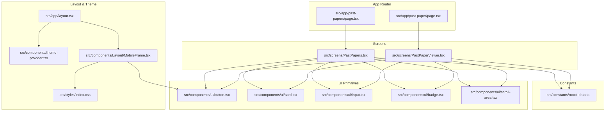
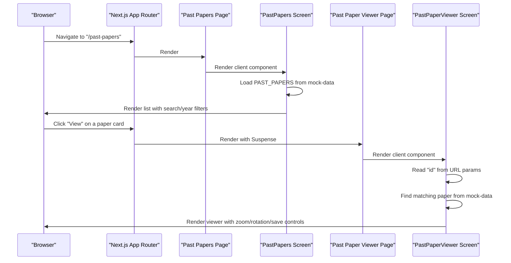
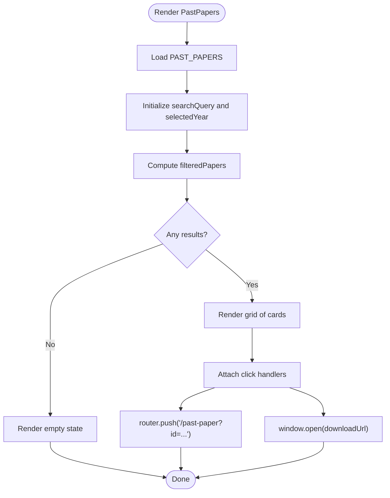
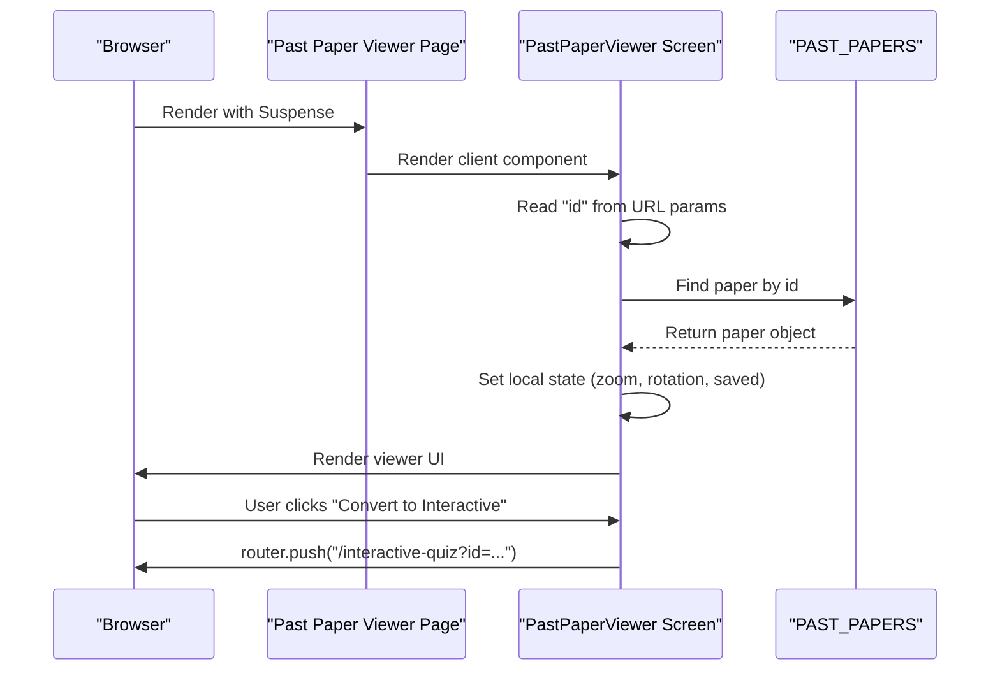
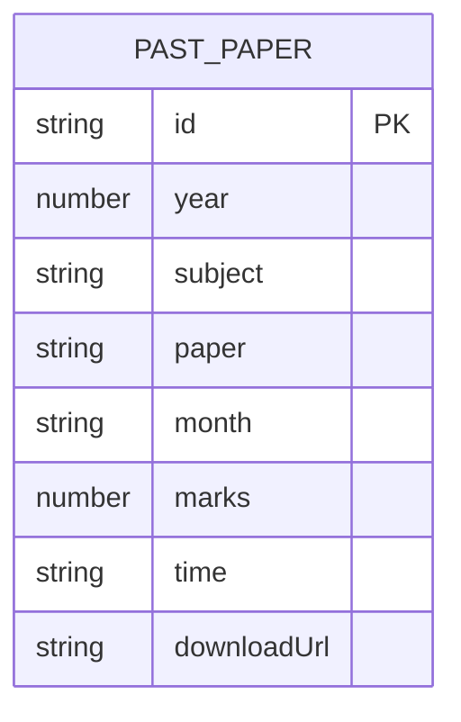
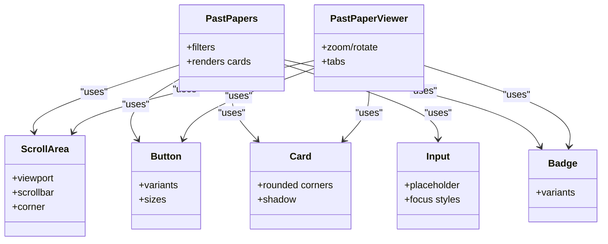
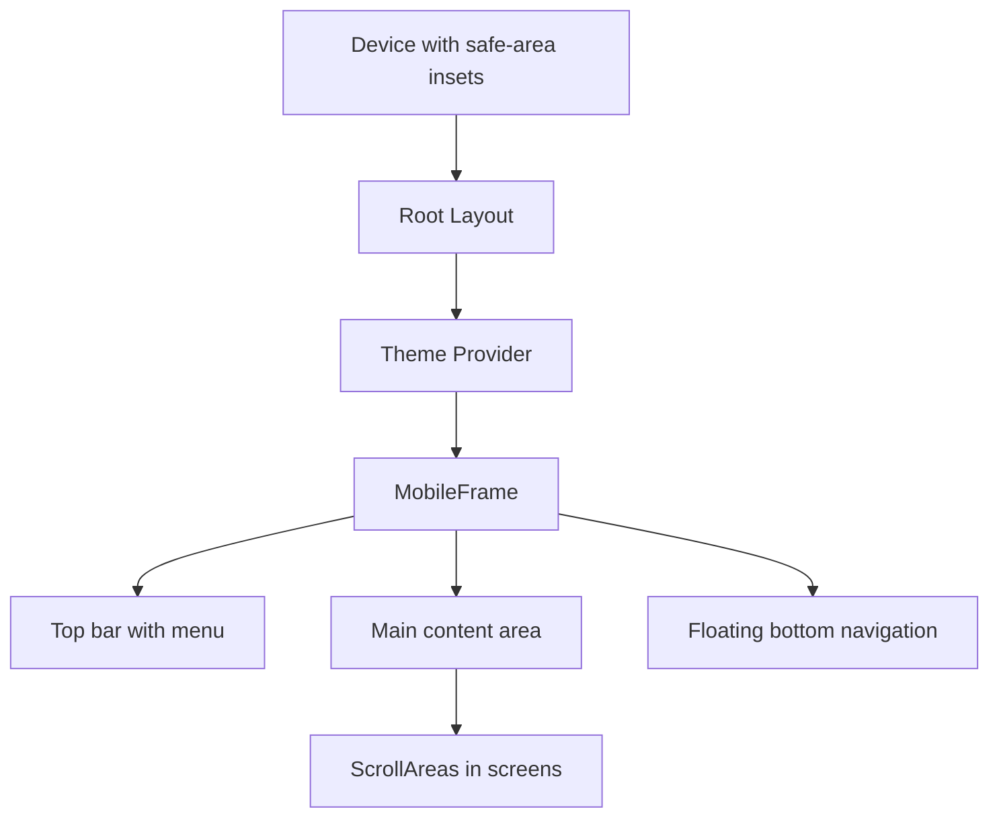
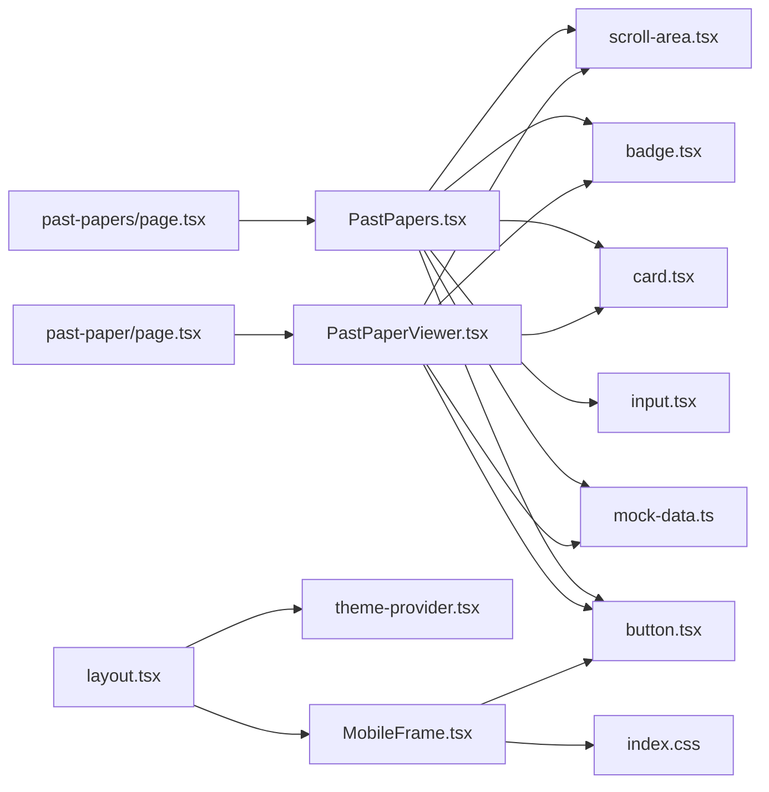

# Past Paper Architecture

<cite>
**Referenced Files in This Document**
- [PastPapers.tsx](file://src/screens/PastPapers.tsx)
- [PastPaperViewer.tsx](file://src/screens/PastPaperViewer.tsx)
- [mock-data.ts](file://src/constants/mock-data.ts)
- [page.tsx (Past Papers)](file://src/app/past-papers/page.tsx)
- [page.tsx (Past Paper Viewer)](file://src/app/past-paper/page.tsx)
- [scroll-area.tsx](file://src/components/ui/scroll-area.tsx)
- [button.tsx](file://src/components/ui/button.tsx)
- [card.tsx](file://src/components/ui/card.tsx)
- [input.tsx](file://src/components/ui/input.tsx)
- [badge.tsx](file://src/components/ui/badge.tsx)
- [layout.tsx](file://src/app/layout.tsx)
- [theme-provider.tsx](file://src/components/theme-provider.tsx)
- [MobileFrame.tsx](file://src/components/Layout/MobileFrame.tsx)
- [index.css](file://src/styles/index.css)
</cite>

## Table of Contents
1. [Introduction](#introduction)
2. [Project Structure](#project-structure)
3. [Core Components](#core-components)
4. [Architecture Overview](#architecture-overview)
5. [Detailed Component Analysis](#detailed-component-analysis)
6. [Dependency Analysis](#dependency-analysis)
7. [Performance Considerations](#performance-considerations)
8. [Troubleshooting Guide](#troubleshooting-guide)
9. [Conclusion](#conclusion)

## Introduction
This document explains the past paper system architecture, focusing on the PastPapers listing and filtering screen, the PastPaperViewer individual paper display, and the mock data management. It documents data flow from mock sources to UI components, state management patterns for search and filtering, routing mechanisms between pages, responsive design and scroll handling, mobile optimization strategies, component composition patterns, and performance considerations for large datasets. The integration with Next.js App Router and client-side navigation is also covered.

## Project Structure
The past paper feature is organized under the Next.js App Router with dedicated pages and client-side screens:
- Pages define metadata and render the client components
- Screens implement client-side logic and UI
- Constants provide mock data
- UI primitives encapsulate reusable components
- Layout and theme provider manage global styles and theme switching
- Styles define responsive and platform-specific design tokens

**Diagram sources**
- [page.tsx (Past Papers)](file://src/app/past-papers/page.tsx#L1-L12)
- [page.tsx (Past Paper Viewer)](file://src/app/past-paper/page.tsx#L1-L17)
- [PastPapers.tsx](file://src/screens/PastPapers.tsx#L1-L179)
- [PastPaperViewer.tsx](file://src/screens/PastPaperViewer.tsx#L1-L281)
- [mock-data.ts](file://src/constants/mock-data.ts#L48-L240)
- [scroll-area.tsx](file://src/components/ui/scroll-area.tsx#L1-L45)
- [button.tsx](file://src/components/ui/button.tsx#L1-L52)
- [card.tsx](file://src/components/ui/card.tsx#L1-L59)
- [input.tsx](file://src/components/ui/input.tsx#L1-L23)
- [badge.tsx](file://src/components/ui/badge.tsx#L1-L34)
- [layout.tsx](file://src/app/layout.tsx#L1-L108)
- [theme-provider.tsx](file://src/components/theme-provider.tsx#L1-L84)
- [MobileFrame.tsx](file://src/components/Layout/MobileFrame.tsx#L1-L319)
- [index.css](file://src/styles/index.css#L1-L286)

**Section sources**
- [page.tsx (Past Papers)](file://src/app/past-papers/page.tsx#L1-L12)
- [page.tsx (Past Paper Viewer)](file://src/app/past-paper/page.tsx#L1-L17)
- [PastPapers.tsx](file://src/screens/PastPapers.tsx#L1-L179)
- [PastPaperViewer.tsx](file://src/screens/PastPaperViewer.tsx#L1-L281)
- [mock-data.ts](file://src/constants/mock-data.ts#L48-L240)
- [layout.tsx](file://src/app/layout.tsx#L84-L107)
- [MobileFrame.tsx](file://src/components/Layout/MobileFrame.tsx#L43-L319)
- [index.css](file://src/styles/index.css#L1-L286)

## Core Components
- PastPapers listing screen:
  - Client component with local state for search and year filter
  - Filters mock data and renders cards with action buttons
  - Uses Next.js router for navigation to viewer
- PastPaperViewer:
  - Client component with URL query param retrieval and local state for zoom, rotation, tabs, and save status
  - Renders paper content with scroll area and bottom toolbar
  - Integrates with interactive quiz conversion
- Mock data:
  - Centralized array of past papers with subject, paper, month, year, marks, time, and download URL
- UI primitives:
  - ScrollArea, Button, Card, Input, Badge provide consistent behavior and styling
- Layout and theme:
  - Root layout manages metadata, theme provider, and mobile frame wrapper
  - MobileFrame provides responsive navigation and safe-area handling

**Section sources**
- [PastPapers.tsx](file://src/screens/PastPapers.tsx#L13-L179)
- [PastPaperViewer.tsx](file://src/screens/PastPaperViewer.tsx#L35-L281)
- [mock-data.ts](file://src/constants/mock-data.ts#L48-L240)
- [scroll-area.tsx](file://src/components/ui/scroll-area.tsx#L1-L45)
- [button.tsx](file://src/components/ui/button.tsx#L1-L52)
- [card.tsx](file://src/components/ui/card.tsx#L1-L59)
- [input.tsx](file://src/components/ui/input.tsx#L1-L23)
- [badge.tsx](file://src/components/ui/badge.tsx#L1-L34)
- [layout.tsx](file://src/app/layout.tsx#L84-L107)
- [theme-provider.tsx](file://src/components/theme-provider.tsx#L25-L84)
- [MobileFrame.tsx](file://src/components/Layout/MobileFrame.tsx#L43-L319)

## Architecture Overview
The system follows a clear separation of concerns:
- Pages define metadata and wrap client components with suspense for the viewer
- Screens own UI state and data filtering/localization
- Constants provide deterministic mock data
- UI primitives encapsulate cross-cutting behaviors (scrolling, theming)
- Layout composes theme provider and mobile frame around children

**Diagram sources**
- [page.tsx (Past Papers)](file://src/app/past-papers/page.tsx#L1-L12)
- [PastPapers.tsx](file://src/screens/PastPapers.tsx#L13-L179)
- [page.tsx (Past Paper Viewer)](file://src/app/past-paper/page.tsx#L1-L17)
- [PastPaperViewer.tsx](file://src/screens/PastPaperViewer.tsx#L35-L281)
- [mock-data.ts](file://src/constants/mock-data.ts#L48-L240)

## Detailed Component Analysis

### PastPapers Listing and Filtering
- State management:
  - Local state for search query and selected year filter
  - Computed filtered list derived from mock data
- Filtering logic:
  - Case-insensitive subject/paper search
  - Year filter supports "All" or specific year selection
- Rendering:
  - Sticky header with search input and year chips
  - Scrollable main content area
  - Grid of cards with metadata and action buttons
  - Navigation to viewer via Next.js router push with query param
- Responsive design:
  - Safe-area insets applied to header and bottom padding
  - Year chips horizontally scrollable with custom scrollbar hiding
  - Cards use rounded corners and subtle shadows for depth

**Diagram sources**
- [PastPapers.tsx](file://src/screens/PastPapers.tsx#L13-L179)
- [mock-data.ts](file://src/constants/mock-data.ts#L48-L240)

**Section sources**
- [PastPapers.tsx](file://src/screens/PastPapers.tsx#L13-L179)
- [input.tsx](file://src/components/ui/input.tsx#L1-L23)
- [scroll-area.tsx](file://src/components/ui/scroll-area.tsx#L1-L45)
- [button.tsx](file://src/components/ui/button.tsx#L1-L52)
- [card.tsx](file://src/components/ui/card.tsx#L1-L59)
- [badge.tsx](file://src/components/ui/badge.tsx#L1-L34)

### PastPaperViewer Individual Paper Display
- State management:
  - URL query param parsing for paper ID
  - Local state for zoom level, rotation, active tab, and saved status
  - Effect to load paper when ID changes
- Rendering:
  - Sticky header with back button, title, zoom controls, rotate, and download
  - Scrollable main content with transform-based zoom and rotation
  - Conversion banner to interactive quiz
  - Instructions and sample question content
  - Bottom toolbar with tab navigation
- Routing:
  - Back navigation via router.back()
  - Navigation to interactive quiz with paper ID

**Diagram sources**
- [page.tsx (Past Paper Viewer)](file://src/app/past-paper/page.tsx#L1-L17)
- [PastPaperViewer.tsx](file://src/screens/PastPaperViewer.tsx#L35-L281)
- [mock-data.ts](file://src/constants/mock-data.ts#L48-L240)

**Section sources**
- [PastPaperViewer.tsx](file://src/screens/PastPaperViewer.tsx#L35-L281)
- [scroll-area.tsx](file://src/components/ui/scroll-area.tsx#L1-L45)
- [button.tsx](file://src/components/ui/button.tsx#L1-L52)
- [card.tsx](file://src/components/ui/card.tsx#L1-L59)
- [badge.tsx](file://src/components/ui/badge.tsx#L1-L34)

### Mock Data Management
- Data model:
  - Array of past papers with fields: id, year, subject, paper, month, marks, time, downloadUrl
- Usage:
  - PastPapers filters this array locally
  - PastPaperViewer selects a single paper by ID
- Extensibility:
  - Additional fields can be added without changing consumers
  - Central location simplifies updates and testing

**Diagram sources**
- [mock-data.ts](file://src/constants/mock-data.ts#L48-L240)

**Section sources**
- [mock-data.ts](file://src/constants/mock-data.ts#L48-L240)

### UI Primitives and Composition Patterns
- ScrollArea:
  - Provides native-like scrolling with custom scrollbar
  - Used in both listing and viewer for content areas
- Button, Card, Input, Badge:
  - Consistent variants and sizes across screens
  - Encapsulate styling and behavior for reuse
- Composition:
  - Screens compose primitives to build complex layouts
  - Props are passed down to maintain cohesion while avoiding deep drilling

**Diagram sources**
- [scroll-area.tsx](file://src/components/ui/scroll-area.tsx#L1-L45)
- [button.tsx](file://src/components/ui/button.tsx#L1-L52)
- [card.tsx](file://src/components/ui/card.tsx#L1-L59)
- [input.tsx](file://src/components/ui/input.tsx#L1-L23)
- [badge.tsx](file://src/components/ui/badge.tsx#L1-L34)
- [PastPapers.tsx](file://src/screens/PastPapers.tsx#L13-L179)
- [PastPaperViewer.tsx](file://src/screens/PastPaperViewer.tsx#L35-L281)

**Section sources**
- [scroll-area.tsx](file://src/components/ui/scroll-area.tsx#L1-L45)
- [button.tsx](file://src/components/ui/button.tsx#L1-L52)
- [card.tsx](file://src/components/ui/card.tsx#L1-L59)
- [input.tsx](file://src/components/ui/input.tsx#L1-L23)
- [badge.tsx](file://src/components/ui/badge.tsx#L1-L34)

### Responsive Design and Mobile Optimization
- Safe-area handling:
  - Header and bottom paddings use env(safe-area-inset-*) to accommodate device insets
- Mobile navigation:
  - MobileFrame provides top bar, side sheet menu, and floating bottom navigation
  - Bottom navigation hides on specific routes and applies iOS-style glass effect
- Scroll behavior:
  - Custom scrollbar hiding for cleaner appearance
  - Smooth scrolling enabled globally
- Typography and spacing:
  - Platform-appropriate font stacks and letter-spacing
  - Consistent spacing and rounded corners for mobile touch targets

**Diagram sources**
- [layout.tsx](file://src/app/layout.tsx#L84-L107)
- [theme-provider.tsx](file://src/components/theme-provider.tsx#L25-L84)
- [MobileFrame.tsx](file://src/components/Layout/MobileFrame.tsx#L43-L319)
- [index.css](file://src/styles/index.css#L22-L28)

**Section sources**
- [MobileFrame.tsx](file://src/components/Layout/MobileFrame.tsx#L43-L319)
- [index.css](file://src/styles/index.css#L1-L286)
- [layout.tsx](file://src/app/layout.tsx#L78-L82)

## Dependency Analysis
- Pages depend on screens:
  - Past Papers page renders PastPapers screen
  - Past Paper Viewer page renders PastPaperViewer screen with suspense
- Screens depend on constants:
  - Both screens import PAST_PAPERS from mock-data
- UI primitives are shared dependencies:
  - Screens import Button, Card, Input, Badge, ScrollArea
- Layout and theme:
  - Root layout wraps children with ThemeProvider and MobileFrame
  - MobileFrame depends on theme context and router

**Diagram sources**
- [page.tsx (Past Papers)](file://src/app/past-papers/page.tsx#L1-L12)
- [page.tsx (Past Paper Viewer)](file://src/app/past-paper/page.tsx#L1-L17)
- [PastPapers.tsx](file://src/screens/PastPapers.tsx#L1-L179)
- [PastPaperViewer.tsx](file://src/screens/PastPaperViewer.tsx#L1-L281)
- [mock-data.ts](file://src/constants/mock-data.ts#L48-L240)
- [button.tsx](file://src/components/ui/button.tsx#L1-L52)
- [card.tsx](file://src/components/ui/card.tsx#L1-L59)
- [input.tsx](file://src/components/ui/input.tsx#L1-L23)
- [badge.tsx](file://src/components/ui/badge.tsx#L1-L34)
- [scroll-area.tsx](file://src/components/ui/scroll-area.tsx#L1-L45)
- [layout.tsx](file://src/app/layout.tsx#L84-L107)
- [theme-provider.tsx](file://src/components/theme-provider.tsx#L25-L84)
- [MobileFrame.tsx](file://src/components/Layout/MobileFrame.tsx#L43-L319)
- [index.css](file://src/styles/index.css#L1-L286)

**Section sources**
- [page.tsx (Past Papers)](file://src/app/past-papers/page.tsx#L1-L12)
- [page.tsx (Past Paper Viewer)](file://src/app/past-paper/page.tsx#L1-L17)
- [PastPapers.tsx](file://src/screens/PastPapers.tsx#L1-L179)
- [PastPaperViewer.tsx](file://src/screens/PastPaperViewer.tsx#L1-L281)
- [mock-data.ts](file://src/constants/mock-data.ts#L48-L240)
- [layout.tsx](file://src/app/layout.tsx#L84-L107)
- [MobileFrame.tsx](file://src/components/Layout/MobileFrame.tsx#L43-L319)

## Performance Considerations
- Filtering performance:
  - Current implementation filters a small mock dataset in memory
  - For larger datasets, consider virtualizing lists and debounced search
- Rendering optimizations:
  - Memoize computed filtered lists if props are stable
  - Lazy-load images and defer non-critical resources
- State management:
  - Keep local state minimal; avoid unnecessary re-renders by isolating state per component
- Scroll performance:
  - Use transform-based zoom/rotation judiciously; test on low-end devices
  - Prefer CSS transforms over layout-affecting styles for animations
- Bundle size:
  - Ensure UI primitives are tree-shaken; avoid importing unused variants
- Accessibility:
  - Provide skip links and keyboard navigation for bottom toolbar and filters

[No sources needed since this section provides general guidance]

## Troubleshooting Guide
- No papers found:
  - Verify mock data contains entries matching search terms and year filter
  - Confirm filter logic includes case-insensitive matching
- Navigation issues:
  - Ensure query param "id" is present when navigating to viewer
  - Check router.push usage and trailing slashes
- Theme mismatches:
  - Confirm ThemeProvider is wrapping the application and hydration is suppressed at the HTML level
- Scrollbars and safe-area:
  - Validate env(safe-area-inset-*) usage and custom scrollbar CSS
- Mobile navigation:
  - Confirm MobileFrame hides bottom navigation on specific routes and applies correct z-index stacking

**Section sources**
- [PastPapers.tsx](file://src/screens/PastPapers.tsx#L20-L26)
- [PastPaperViewer.tsx](file://src/screens/PastPaperViewer.tsx#L46-L51)
- [layout.tsx](file://src/app/layout.tsx#L86-L106)
- [MobileFrame.tsx](file://src/components/Layout/MobileFrame.tsx#L52-L57)
- [index.css](file://src/styles/index.css#L28-L314)

## Conclusion
The past paper system is structured around clean separation of concerns: pages define metadata and suspense boundaries, screens manage client state and UI composition, and constants provide deterministic mock data. Filtering and viewer navigation are handled via Next.js App Router and client-side state. Responsive design leverages safe-area insets, custom scrollbars, and a mobile-first navigation pattern. For production scaling, consider virtualization, debounced search, and memoization to optimize performance with larger datasets.