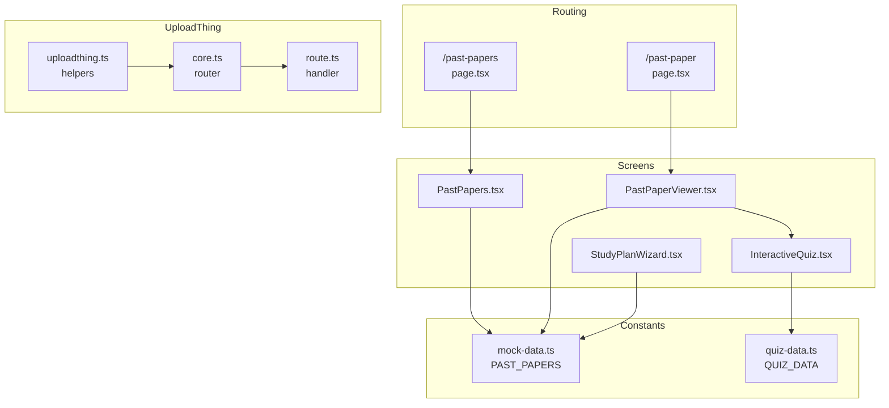
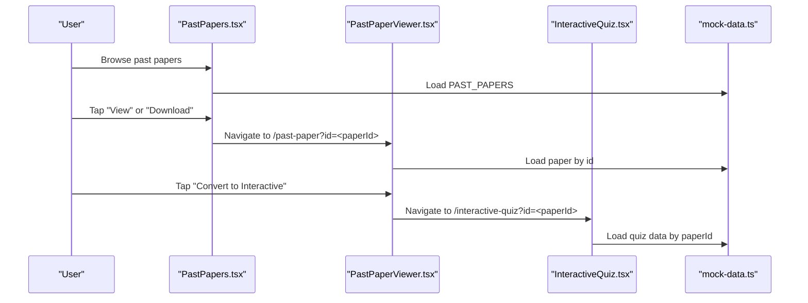
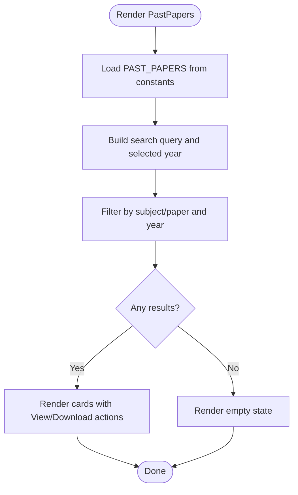
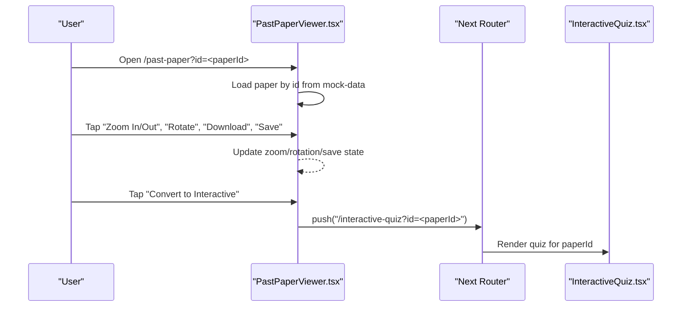
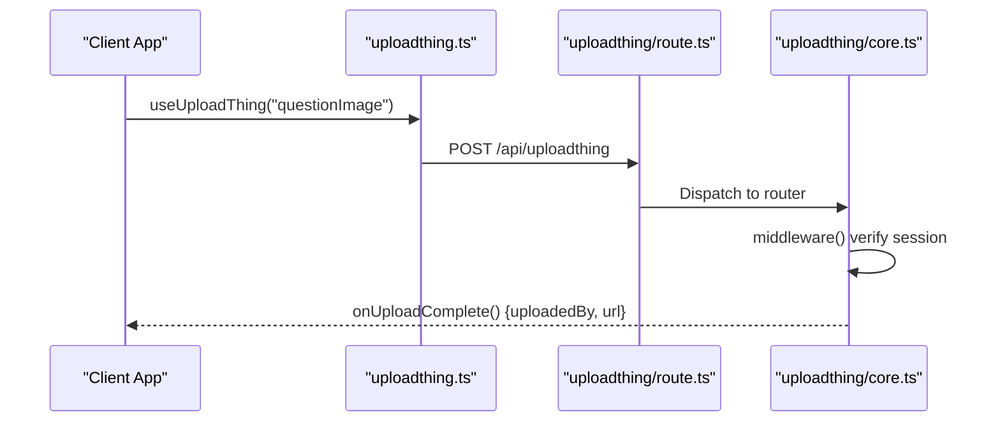
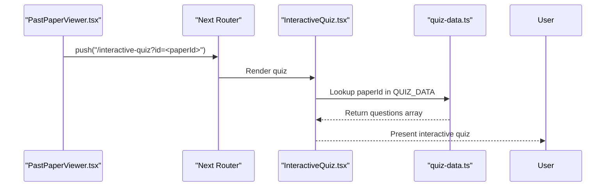
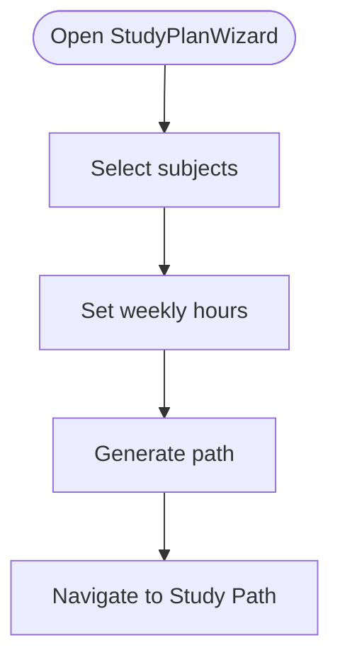
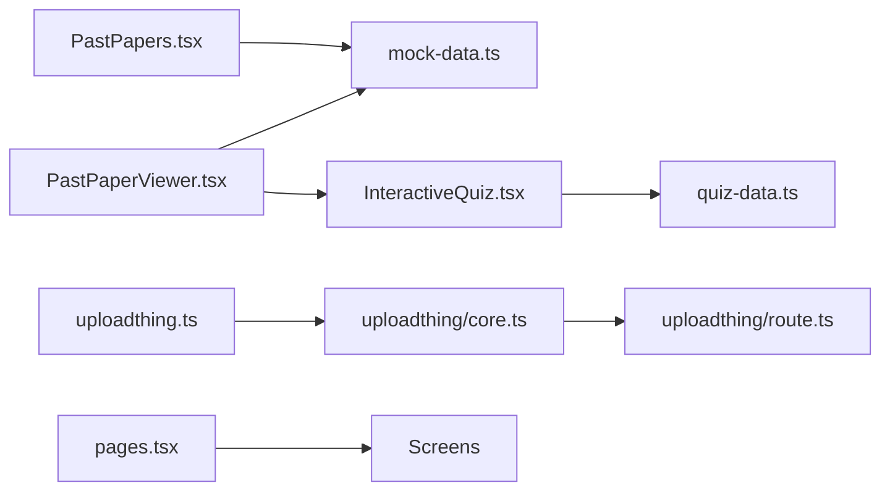

# Past Paper System

<cite>
**Referenced Files in This Document**
- [PastPapers.tsx](file://src/screens/PastPapers.tsx)
- [PastPaperViewer.tsx](file://src/screens/PastPaperViewer.tsx)
- [past-papers/page.tsx](file://src/app/past-papers/page.tsx)
- [past-paper/page.tsx](file://src/app/past-paper/page.tsx)
- [mock-data.ts](file://src/constants/mock-data.ts)
- [quiz-data.ts](file://src/constants/quiz-data.ts)
- [uploadthing.ts](file://src/lib/uploadthing.ts)
- [uploadthing/core.ts](file://src/app/api/uploadthing/core.ts)
- [uploadthing/route.ts](file://src/app/api/uploadthing/route.ts)
- [InteractiveQuiz.tsx](file://src/screens/InteractiveQuiz.tsx)
- [StudyPlanWizard.tsx](file://src/screens/StudyPlanWizard.tsx)
- [physics_model.md](file://src/data_modeling/physics_model.md)
- [mathematics_model.md](file://src/data_modeling/mathematics_model.md)
- [accounting_model.md](file://src/data_modeling/accounting_model.md)
</cite>

## Table of Contents
1. [Introduction](#introduction)
2. [Project Structure](#project-structure)
3. [Core Components](#core-components)
4. [Architecture Overview](#architecture-overview)
5. [Detailed Component Analysis](#detailed-component-analysis)
6. [Dependency Analysis](#dependency-analysis)
7. [Performance Considerations](#performance-considerations)
8. [Troubleshooting Guide](#troubleshooting-guide)
9. [Conclusion](#conclusion)
10. [Appendices](#appendices)

## Introduction
This document describes the Past Paper System within MatricMaster AI. It covers the architecture for discovering, viewing, and interacting with NSC past exam papers, including PDF viewing capabilities, download handling, content organization, and integration with the quiz system. It also documents the UploadThing integration for file management, the mock data model used for demonstration, filtering and search mechanisms, subject categorization, and content discovery. Guidance is included for PDF rendering, pagination handling, mobile optimization, performance tuning for large PDFs, accessibility considerations, and integration with study planning features.

## Project Structure
The Past Paper System spans UI screens, routing, constants, and backend integrations:
- UI Screens: PastPapers listing and PastPaperViewer detail
- Routing: Next.js app router pages for listing and viewer
- Constants: Mock data for past papers and quiz data
- Backend: UploadThing integration for file management
- Quiz Integration: Interactive quiz derived from past paper content
- Study Planning: Wizard and path generation

**Diagram sources**
- [past-papers/page.tsx](file://src/app/past-papers/page.tsx#L1-L12)
- [past-paper/page.tsx](file://src/app/past-paper/page.tsx#L1-L17)
- [PastPapers.tsx](file://src/screens/PastPapers.tsx#L1-L179)
- [PastPaperViewer.tsx](file://src/screens/PastPaperViewer.tsx#L1-L281)
- [mock-data.ts](file://src/constants/mock-data.ts#L48-L240)
- [quiz-data.ts](file://src/constants/quiz-data.ts#L23-L312)
- [uploadthing.ts](file://src/lib/uploadthing.ts#L1-L6)
- [uploadthing/core.ts](file://src/app/api/uploadthing/core.ts#L1-L34)
- [uploadthing/route.ts](file://src/app/api/uploadthing/route.ts#L1-L12)

**Section sources**
- [past-papers/page.tsx](file://src/app/past-papers/page.tsx#L1-L12)
- [past-paper/page.tsx](file://src/app/past-paper/page.tsx#L1-L17)
- [PastPapers.tsx](file://src/screens/PastPapers.tsx#L1-L179)
- [PastPaperViewer.tsx](file://src/screens/PastPaperViewer.tsx#L1-L281)
- [mock-data.ts](file://src/constants/mock-data.ts#L48-L240)
- [quiz-data.ts](file://src/constants/quiz-data.ts#L23-L312)
- [uploadthing.ts](file://src/lib/uploadthing.ts#L1-L6)
- [uploadthing/core.ts](file://src/app/api/uploadthing/core.ts#L1-L34)
- [uploadthing/route.ts](file://src/app/api/uploadthing/route.ts#L1-L12)

## Core Components
- PastPapers screen: Lists available past papers with search and year filtering, and links to the viewer or direct downloads.
- PastPaperViewer screen: Renders paper metadata, zoom/rotate controls, save action, and a conversion banner to interactive quiz.
- UploadThing integration: Provides React helpers and a route handler for secure uploads with middleware and completion callbacks.
- Mock data: Defines PAST_PAPERS and quiz data structure for demonstration and development.
- Quiz integration: InteractiveQuiz consumes quiz data keyed by paper identifiers to enable practice with real NSC-style questions.
- Study planning: StudyPlanWizard generates learning paths and integrates with past paper content for contextual practice.

**Section sources**
- [PastPapers.tsx](file://src/screens/PastPapers.tsx#L13-L179)
- [PastPaperViewer.tsx](file://src/screens/PastPaperViewer.tsx#L35-L281)
- [uploadthing.ts](file://src/lib/uploadthing.ts#L1-L6)
- [uploadthing/core.ts](file://src/app/api/uploadthing/core.ts#L9-L31)
- [mock-data.ts](file://src/constants/mock-data.ts#L48-L240)
- [quiz-data.ts](file://src/constants/quiz-data.ts#L15-L21)
- [InteractiveQuiz.tsx](file://src/screens/InteractiveQuiz.tsx#L105-L458)
- [StudyPlanWizard.tsx](file://src/screens/StudyPlanWizard.tsx#L33-L243)

## Architecture Overview
The system follows a client-side rendering pattern with Next.js app router pages delegating to screen components. Past paper data is sourced from mock constants during development. The viewer supports interactive conversion to quizzes via a dedicated route. UploadThing provides a secure upload pipeline for future enhancements.

**Diagram sources**
- [PastPapers.tsx](file://src/screens/PastPapers.tsx#L141-L157)
- [past-paper/page.tsx](file://src/app/past-paper/page.tsx#L10-L16)
- [PastPaperViewer.tsx](file://src/screens/PastPaperViewer.tsx#L65-L67)
- [InteractiveQuiz.tsx](file://src/screens/InteractiveQuiz.tsx#L124-L129)
- [mock-data.ts](file://src/constants/mock-data.ts#L48-L240)
- [quiz-data.ts](file://src/constants/quiz-data.ts#L23-L312)

## Detailed Component Analysis

### PastPapers Screen
Responsibilities:
- Render a scrollable grid of past papers with subject, paper, month/year, marks, and time.
- Provide a search bar to filter by subject or paper name.
- Provide year filter buttons (All, 2024, 2023, 2022, 2021, 2020).
- Navigate to the viewer on "View" and open download URLs on "Download".

Implementation highlights:
- Uses mock data for listing and filtering.
- Responsive layout with safe-area insets and iOS-like styling.
- No pagination in the current implementation; relies on scroll area for long lists.

**Diagram sources**
- [PastPapers.tsx](file://src/screens/PastPapers.tsx#L13-L179)
- [mock-data.ts](file://src/constants/mock-data.ts#L48-L240)

**Section sources**
- [PastPapers.tsx](file://src/screens/PastPapers.tsx#L13-L179)
- [mock-data.ts](file://src/constants/mock-data.ts#L48-L240)

### PastPaperViewer Screen
Responsibilities:
- Display paper metadata and interactive controls (zoom, rotate, download, save).
- Provide a conversion banner to transform the paper into an interactive quiz.
- Offer quick navigation to questions and present sample question content.

Implementation highlights:
- Reads paper id from URL query param and loads matching paper from mock data.
- Supports zoom percentage (50–200%) and rotation in 90° increments.
- Save action toggles local bookmark state.
- Converts to InteractiveQuiz by navigating to the quiz route with the same paper id.

**Diagram sources**
- [past-paper/page.tsx](file://src/app/past-paper/page.tsx#L10-L16)
- [PastPaperViewer.tsx](file://src/screens/PastPaperViewer.tsx#L35-L67)
- [InteractiveQuiz.tsx](file://src/screens/InteractiveQuiz.tsx#L105-L129)

**Section sources**
- [PastPaperViewer.tsx](file://src/screens/PastPaperViewer.tsx#L35-L281)
- [past-paper/page.tsx](file://src/app/past-paper/page.tsx#L1-L17)

### UploadThing Integration
Purpose:
- Securely upload question-related images with middleware checks and completion callbacks.

Key elements:
- React helpers exported for client usage.
- Route handler configured with environment token.
- Middleware verifies authenticated sessions and passes user id to completion.
- Completion logs metadata and returns uploaded URL.

**Diagram sources**
- [uploadthing.ts](file://src/lib/uploadthing.ts#L1-L6)
- [uploadthing/route.ts](file://src/app/api/uploadthing/route.ts#L1-L12)
- [uploadthing/core.ts](file://src/app/api/uploadthing/core.ts#L12-L30)

**Section sources**
- [uploadthing.ts](file://src/lib/uploadthing.ts#L1-L6)
- [uploadthing/core.ts](file://src/app/api/uploadthing/core.ts#L1-L34)
- [uploadthing/route.ts](file://src/app/api/uploadthing/route.ts#L1-L12)

### Quiz Integration and Content Discovery
Relationship:
- PastPaperViewer offers a conversion to InteractiveQuiz.
- InteractiveQuiz loads quiz data keyed by paper id from QUIZ_DATA.
- This enables students to practice with real NSC-style questions extracted from past papers.

**Diagram sources**
- [PastPaperViewer.tsx](file://src/screens/PastPaperViewer.tsx#L65-L67)
- [InteractiveQuiz.tsx](file://src/screens/InteractiveQuiz.tsx#L124-L129)
- [quiz-data.ts](file://src/constants/quiz-data.ts#L23-L312)

**Section sources**
- [PastPaperViewer.tsx](file://src/screens/PastPaperViewer.tsx#L65-L67)
- [InteractiveQuiz.tsx](file://src/screens/InteractiveQuiz.tsx#L105-L129)
- [quiz-data.ts](file://src/constants/quiz-data.ts#L15-L21)

### Study Planning Integration
StudyPlanWizard allows students to define focus subjects and weekly commitment, generating a learning path. While not directly fetching past papers, it complements the past paper system by structuring study schedules around the content.

**Diagram sources**
- [StudyPlanWizard.tsx](file://src/screens/StudyPlanWizard.tsx#L33-L243)

**Section sources**
- [StudyPlanWizard.tsx](file://src/screens/StudyPlanWizard.tsx#L33-L243)

## Dependency Analysis
High-level dependencies:
- PastPapers depends on mock-data for listing and filtering.
- PastPaperViewer depends on mock-data for paper details and navigates to InteractiveQuiz.
- InteractiveQuiz depends on quiz-data for questions.
- UploadThing integration is decoupled from UI and used via helpers.
- Routing pages delegate to screen components.

**Diagram sources**
- [PastPapers.tsx](file://src/screens/PastPapers.tsx#L1-L12)
- [PastPaperViewer.tsx](file://src/screens/PastPaperViewer.tsx#L1-L22)
- [InteractiveQuiz.tsx](file://src/screens/InteractiveQuiz.tsx#L1-L21)
- [mock-data.ts](file://src/constants/mock-data.ts#L48-L240)
- [quiz-data.ts](file://src/constants/quiz-data.ts#L23-L312)
- [uploadthing.ts](file://src/lib/uploadthing.ts#L1-L6)
- [uploadthing/core.ts](file://src/app/api/uploadthing/core.ts#L1-L34)
- [uploadthing/route.ts](file://src/app/api/uploadthing/route.ts#L1-L12)
- [past-papers/page.tsx](file://src/app/past-papers/page.tsx#L1-L12)
- [past-paper/page.tsx](file://src/app/past-paper/page.tsx#L1-L17)

**Section sources**
- [PastPapers.tsx](file://src/screens/PastPapers.tsx#L1-L12)
- [PastPaperViewer.tsx](file://src/screens/PastPaperViewer.tsx#L1-L22)
- [InteractiveQuiz.tsx](file://src/screens/InteractiveQuiz.tsx#L1-L21)
- [mock-data.ts](file://src/constants/mock-data.ts#L48-L240)
- [quiz-data.ts](file://src/constants/quiz-data.ts#L23-L312)
- [uploadthing.ts](file://src/lib/uploadthing.ts#L1-L6)
- [uploadthing/core.ts](file://src/app/api/uploadthing/core.ts#L1-L34)
- [uploadthing/route.ts](file://src/app/api/uploadthing/route.ts#L1-L12)
- [past-papers/page.tsx](file://src/app/past-papers/page.tsx#L1-L12)
- [past-paper/page.tsx](file://src/app/past-paper/page.tsx#L1-L17)

## Performance Considerations
- Filtering and search: Current implementation filters in-memory arrays. For larger datasets, consider virtualized lists and server-side filtering.
- PDF rendering: The viewer applies CSS transforms for zoom and rotation. For heavy PDFs, consider:
  - Lazy-loading rendered pages
  - Pagination strategies (page-by-page rendering)
  - Client-side caching of decoded pages
  - Offloading heavy operations to Web Workers
- Mobile optimization: The UI uses responsive spacing and safe-area insets. Ensure touch targets are sufficiently sized and avoid excessive reflows during transform updates.
- Downloads: Opening external download URLs is handled by the browser; ensure CORS and redirect policies are respected.

[No sources needed since this section provides general guidance]

## Troubleshooting Guide
Common issues and resolutions:
- Paper not found by id: Ensure the id parameter matches entries in mock data.
- Download link does nothing: Verify the downloadUrl is a valid public URL.
- Interactive quiz not loading: Confirm the paper id exists in quiz-data and that the route is correct.
- Upload failures: Check UploadThing token and middleware session verification.

**Section sources**
- [PastPaperViewer.tsx](file://src/screens/PastPaperViewer.tsx#L46-L51)
- [mock-data.ts](file://src/constants/mock-data.ts#L48-L240)
- [quiz-data.ts](file://src/constants/quiz-data.ts#L23-L312)
- [uploadthing/core.ts](file://src/app/api/uploadthing/core.ts#L12-L22)

## Conclusion
The Past Paper System provides a clear pathway for students to discover, view, and practice with NSC past papers. The current implementation leverages mock data and demonstrates robust UI interactions, including search, filtering, zoom/rotate, and conversion to interactive quizzes. The UploadThing integration establishes a secure foundation for future enhancements. By adopting pagination, lazy rendering, and virtualization for large PDFs, and by ensuring accessibility and mobile responsiveness, the system can scale effectively while maintaining a strong user experience.

[No sources needed since this section summarizes without analyzing specific files]

## Appendices

### Past Paper Data Model (Mock)
- Fields include id, year, subject, paper, month, marks, time, and downloadUrl.
- Used by PastPapers and PastPaperViewer for listing and detail views.

**Section sources**
- [mock-data.ts](file://src/constants/mock-data.ts#L48-L240)

### Quiz Data Model (Mock)
- Structure defines paperId keys mapping to title, subject, and questions arrays.
- Questions include id, question text, options, correctAnswer, hint, and topic.

**Section sources**
- [quiz-data.ts](file://src/constants/quiz-data.ts#L15-L312)

### UploadThing Router Configuration
- Defines a single endpoint for question images with size limits and middleware.
- Returns metadata and uploaded URL upon completion.

**Section sources**
- [uploadthing/core.ts](file://src/app/api/uploadthing/core.ts#L9-L31)

### Data Modeling References
- Physics model outlines relational schema for normalized storage of exam papers, questions, sub-questions, MCQ options, and data sheets.
- Mathematics model emphasizes recursive structures, LaTeX rendering, and scalability considerations.
- Accounting model highlights pre-processing steps and safety constraints for financial data.

**Section sources**
- [physics_model.md](file://src/data_modeling/physics_model.md#L15-L79)
- [mathematics_model.md](file://src/data_modeling/mathematics_model.md#L199-L212)
- [accounting_model.md](file://src/data_modeling/accounting_model.md#L189-L231)