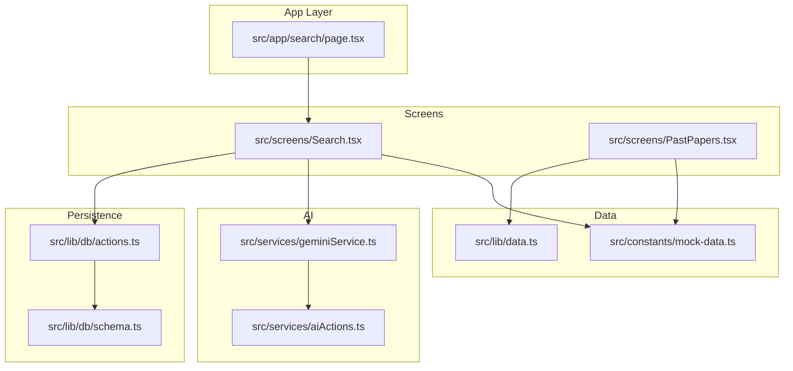
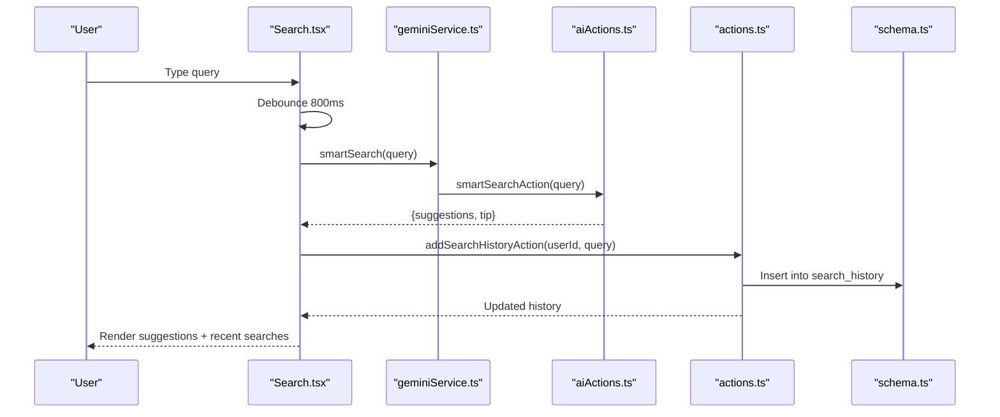
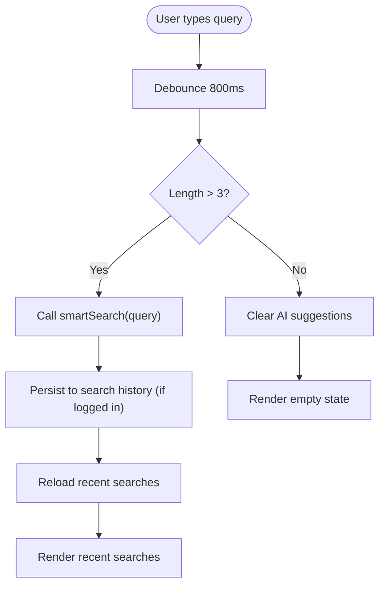
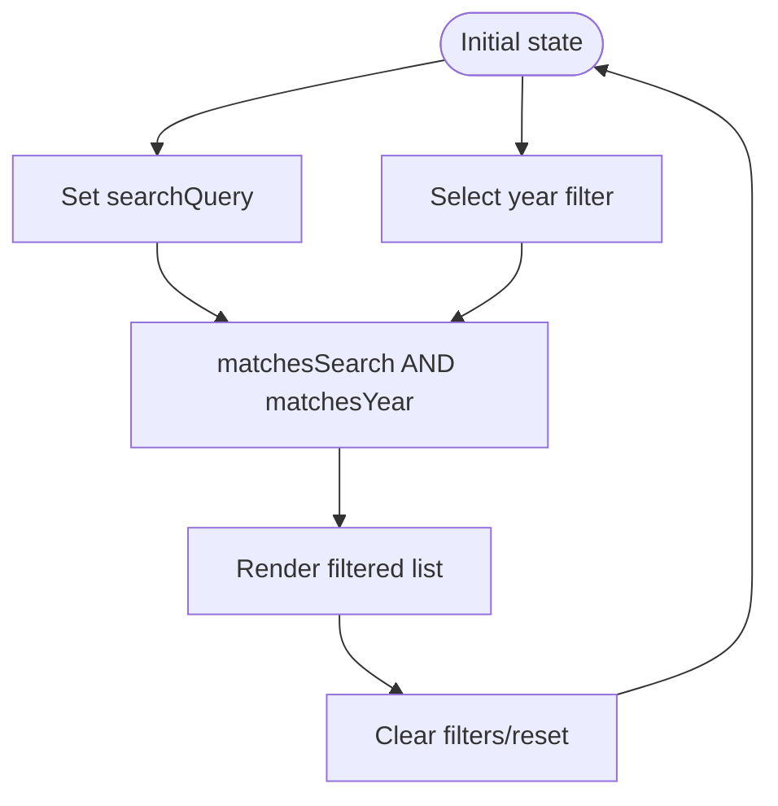
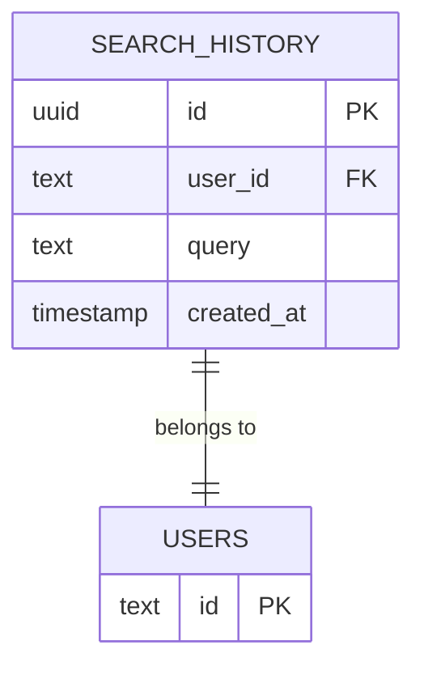
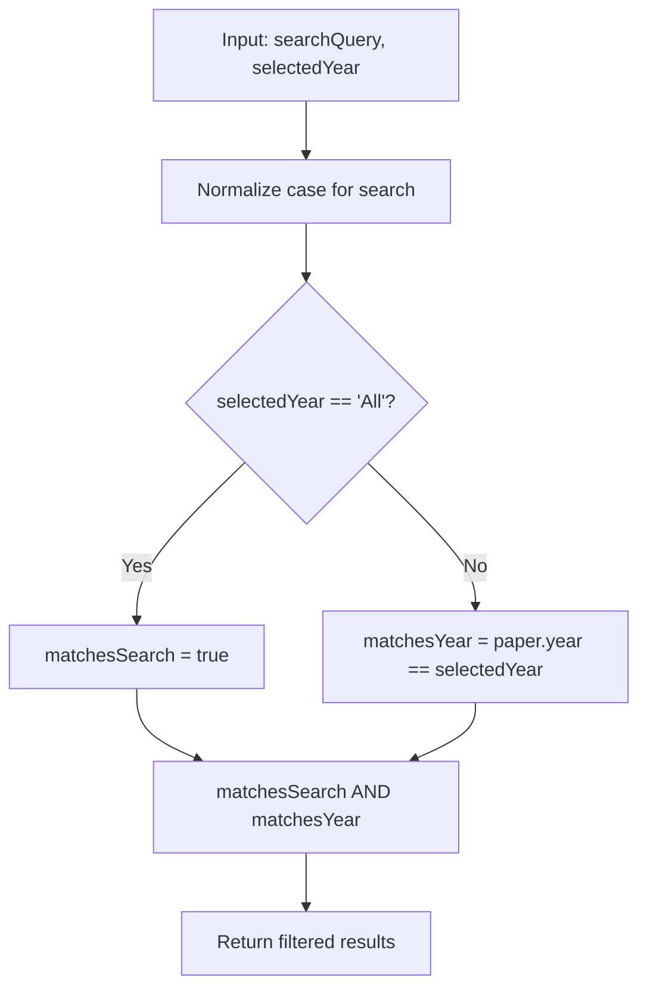
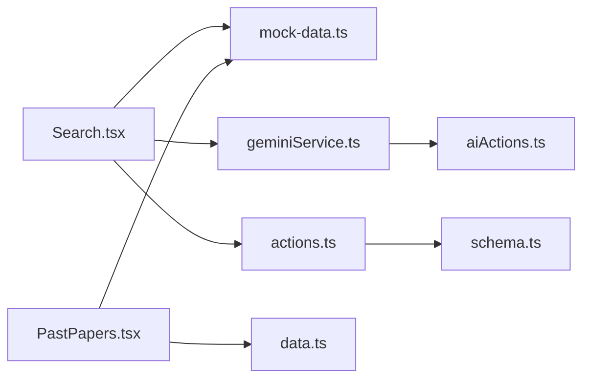

# Search and Filtering

<cite>
**Referenced Files in This Document**
- [Search.tsx](file://src/screens/Search.tsx)
- [PastPapers.tsx](file://src/screens/PastPapers.tsx)
- [mock-data.ts](file://src/constants/mock-data.ts)
- [geminiService.ts](file://src/services/geminiService.ts)
- [aiActions.ts](file://src/services/aiActions.ts)
- [actions.ts](file://src/lib/db/actions.ts)
- [schema.ts](file://src/lib/db/schema.ts)
- [data.ts](file://src/lib/data.ts)
- [page.tsx](file://src/app/search/page.tsx)
</cite>

## Table of Contents
1. [Introduction](#introduction)
2. [Project Structure](#project-structure)
3. [Core Components](#core-components)
4. [Architecture Overview](#architecture-overview)
5. [Detailed Component Analysis](#detailed-component-analysis)
6. [Dependency Analysis](#dependency-analysis)
7. [Performance Considerations](#performance-considerations)
8. [Troubleshooting Guide](#troubleshooting-guide)
9. [Conclusion](#conclusion)
10. [Appendices](#appendices)

## Introduction
This document explains the search and filtering system implemented in the application. It covers:
- Real-time search with case-insensitive matching across subjects and paper names
- Debounced AI-powered suggestion generation
- Year-based filtering with multi-select semantics
- Persistence of search history for authenticated users
- Reset functionality for filters and search input
- Performance considerations for large datasets
- Accessibility considerations for keyboard navigation and screen reader compatibility

## Project Structure
The search and filtering functionality spans several layers:
- UI screens for search and past papers
- Mock data for demonstration
- AI service integration for suggestions
- Database actions and schema for search history persistence
- Next.js app routing for the search page

**Diagram sources**
- [page.tsx](file://src/app/search/page.tsx#L1-L11)
- [Search.tsx](file://src/screens/Search.tsx#L1-L224)
- [PastPapers.tsx](file://src/screens/PastPapers.tsx#L1-L99)
- [mock-data.ts](file://src/constants/mock-data.ts#L48-L240)
- [geminiService.ts](file://src/services/geminiService.ts#L1-L14)
- [aiActions.ts](file://src/services/aiActions.ts#L123-L167)
- [actions.ts](file://src/lib/db/actions.ts#L476-L504)
- [schema.ts](file://src/lib/db/schema.ts#L120-L134)

**Section sources**
- [page.tsx](file://src/app/search/page.tsx#L1-L11)
- [Search.tsx](file://src/screens/Search.tsx#L1-L224)
- [PastPapers.tsx](file://src/screens/PastPapers.tsx#L1-L99)
- [mock-data.ts](file://src/constants/mock-data.ts#L48-L240)
- [geminiService.ts](file://src/services/geminiService.ts#L1-L14)
- [aiActions.ts](file://src/services/aiActions.ts#L123-L167)
- [actions.ts](file://src/lib/db/actions.ts#L476-L504)
- [schema.ts](file://src/lib/db/schema.ts#L120-L134)

## Core Components
- Search screen with live suggestions and recent search history
- Past papers archive with year-based filtering
- Mock dataset for subjects and papers
- AI-powered suggestion engine via Gemini
- Database-backed search history for authenticated users

Key responsibilities:
- Real-time filtering of mock past papers by subject/paper name
- Case-insensitive substring matching
- Debounced AI suggestion generation
- Year filter selection and combination with search query
- Search history CRUD operations

**Section sources**
- [Search.tsx](file://src/screens/Search.tsx#L25-L96)
- [PastPapers.tsx](file://src/screens/PastPapers.tsx#L13-L26)
- [mock-data.ts](file://src/constants/mock-data.ts#L48-L240)
- [geminiService.ts](file://src/services/geminiService.ts#L11-L13)
- [actions.ts](file://src/lib/db/actions.ts#L476-L504)

## Architecture Overview
The search and filtering system integrates UI, data, AI, and persistence layers.

**Diagram sources**
- [Search.tsx](file://src/screens/Search.tsx#L47-L69)
- [geminiService.ts](file://src/services/geminiService.ts#L11-L13)
- [aiActions.ts](file://src/services/aiActions.ts#L123-L167)
- [actions.ts](file://src/lib/db/actions.ts#L476-L504)
- [schema.ts](file://src/lib/db/schema.ts#L120-L134)

## Detailed Component Analysis

### Search Screen: Real-time Search and Suggestions
- Debounced search triggers after 800ms of inactivity
- Case-insensitive matching against subject and paper name
- AI suggestions generated when query length exceeds threshold
- Recent search history persisted per user and limited to a small number

**Diagram sources**
- [Search.tsx](file://src/screens/Search.tsx#L47-L69)
- [Search.tsx](file://src/screens/Search.tsx#L71-L77)
- [actions.ts](file://src/lib/db/actions.ts#L476-L504)

**Section sources**
- [Search.tsx](file://src/screens/Search.tsx#L25-L96)
- [Search.tsx](file://src/screens/Search.tsx#L71-L77)
- [geminiService.ts](file://src/services/geminiService.ts#L11-L13)
- [aiActions.ts](file://src/services/aiActions.ts#L123-L167)
- [actions.ts](file://src/lib/db/actions.ts#L476-L504)
- [schema.ts](file://src/lib/db/schema.ts#L120-L134)

### Past Papers Archive: Year-based Filtering
- Multi-select semantics represented by single selection among available years
- Combined filter logic: both search query and year filter must match
- Resettable filter state

**Diagram sources**
- [PastPapers.tsx](file://src/screens/PastPapers.tsx#L13-L26)
- [mock-data.ts](file://src/constants/mock-data.ts#L48-L240)

**Section sources**
- [PastPapers.tsx](file://src/screens/PastPapers.tsx#L13-L26)
- [mock-data.ts](file://src/constants/mock-data.ts#L48-L240)

### Data Model for Search History

**Diagram sources**
- [schema.ts](file://src/lib/db/schema.ts#L120-L134)

**Section sources**
- [schema.ts](file://src/lib/db/schema.ts#L120-L134)

### Filtering Logic: Search + Year Combination
- Search term is matched case-insensitively against subject and paper name
- Year filter is either "All" or a specific year
- Final result set includes only items satisfying both conditions

**Diagram sources**
- [PastPapers.tsx](file://src/screens/PastPapers.tsx#L20-L25)
- [mock-data.ts](file://src/constants/mock-data.ts#L48-L240)

**Section sources**
- [PastPapers.tsx](file://src/screens/PastPapers.tsx#L20-L25)
- [mock-data.ts](file://src/constants/mock-data.ts#L48-L240)

## Dependency Analysis
- Search.tsx depends on:
  - Mock data for filtering
  - Gemini service for suggestions
  - Database actions for search history
- PastPapers.tsx depends on:
  - Mock data for filtering
  - Data utilities for typed interfaces
- AI actions depend on:
  - Gemini client configuration and validation
- Database actions depend on:
  - Drizzle schema for search history table

**Diagram sources**
- [Search.tsx](file://src/screens/Search.tsx#L1-L24)
- [PastPapers.tsx](file://src/screens/PastPapers.tsx#L1-L11)
- [mock-data.ts](file://src/constants/mock-data.ts#L48-L240)
- [geminiService.ts](file://src/services/geminiService.ts#L1-L14)
- [aiActions.ts](file://src/services/aiActions.ts#L123-L167)
- [actions.ts](file://src/lib/db/actions.ts#L476-L504)
- [schema.ts](file://src/lib/db/schema.ts#L120-L134)
- [data.ts](file://src/lib/data.ts#L206-L215)

**Section sources**
- [Search.tsx](file://src/screens/Search.tsx#L1-L24)
- [PastPapers.tsx](file://src/screens/PastPapers.tsx#L1-L11)
- [mock-data.ts](file://src/constants/mock-data.ts#L48-L240)
- [geminiService.ts](file://src/services/geminiService.ts#L1-L14)
- [aiActions.ts](file://src/services/aiActions.ts#L123-L167)
- [actions.ts](file://src/lib/db/actions.ts#L476-L504)
- [schema.ts](file://src/lib/db/schema.ts#L120-L134)
- [data.ts](file://src/lib/data.ts#L206-L215)

## Performance Considerations
- Debouncing: The 800ms debounce reduces redundant AI calls and database writes during rapid typing.
- Case-insensitive matching: Converting both sides to lowercase avoids expensive regex operations and leverages efficient substring checks.
- Mock data filtering: Filtering over a local array is fast for moderate sizes; for larger datasets, consider:
  - Indexing strategies in the database
  - Server-side pagination and virtualization
  - Precomputed lowercased tokens for subjects and paper names
- Memory optimization:
  - Limit recent search history to a small fixed size
  - Avoid storing large intermediate results
  - Use shallow copies when updating state to minimize re-renders
- Large collections:
  - Offload filtering to the server with controlled batch sizes
  - Use database indices on frequently queried columns
  - Consider caching computed results keyed by query and filters

[No sources needed since this section provides general guidance]

## Troubleshooting Guide
Common issues and resolutions:
- Suggestions not appearing:
  - Ensure query length exceeds the configured threshold
  - Verify AI service availability and network connectivity
- Search history not persisting:
  - Confirm user is authenticated
  - Check database permissions and table existence
- Filters not applying:
  - Verify case-normalized matching logic
  - Ensure year filter value matches the dataset types

**Section sources**
- [Search.tsx](file://src/screens/Search.tsx#L47-L69)
- [actions.ts](file://src/lib/db/actions.ts#L476-L504)
- [schema.ts](file://src/lib/db/schema.ts#L120-L134)
- [PastPapers.tsx](file://src/screens/PastPapers.tsx#L20-L25)

## Conclusion
The search and filtering system combines real-time debounced suggestions, case-insensitive matching, and persistent user history to deliver a responsive and personalized experience. The year-based filter complements textual search to refine results effectively. With careful attention to performance and accessibility, the system scales to larger datasets while remaining intuitive for users.

[No sources needed since this section summarizes without analyzing specific files]

## Appendices

### Accessibility Considerations
- Keyboard navigation:
  - Ensure focus order moves logically through the search input, suggestions, and recent searches
  - Allow tabbing to filter buttons and clear controls
- Screen reader compatibility:
  - Provide descriptive labels for clear button and delete actions
  - Announce dynamic updates (e.g., number of results found) to assistive technologies
- Focus management:
  - Return focus to the search input after selecting a suggestion
  - Announce state changes (e.g., cleared filters) to users

[No sources needed since this section provides general guidance]

### Examples and Patterns
- Search query syntax:
  - Case-insensitive substring matching across subject and paper name
  - Example: "math" matches "Mathematics", "math-p1-2025-may"
- Filter combinations:
  - Search + Year: "physics" + year 2025
  - Reset: Clear input and select "All" year
- Advanced patterns:
  - Combine recent searches with AI suggestions for quick refinement
  - Persist filters across sessions using backend storage (current implementation focuses on search history)

[No sources needed since this section provides general guidance]