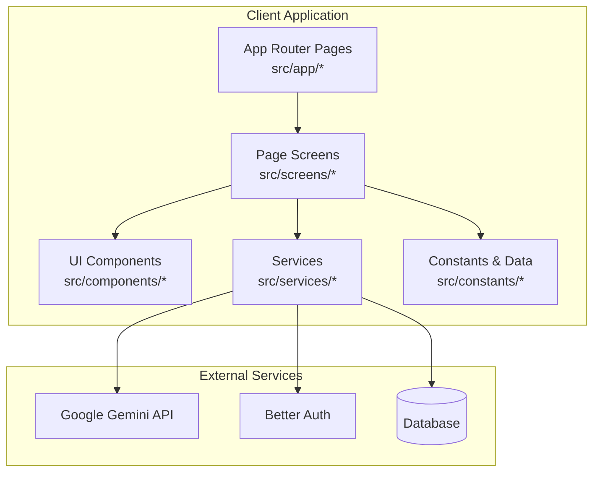
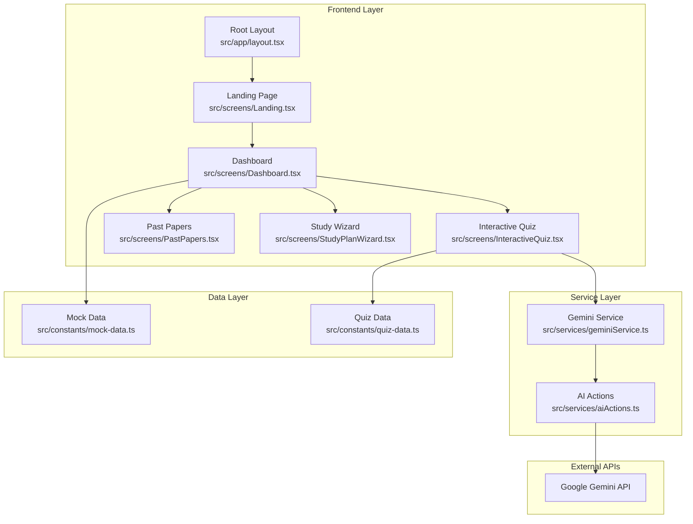
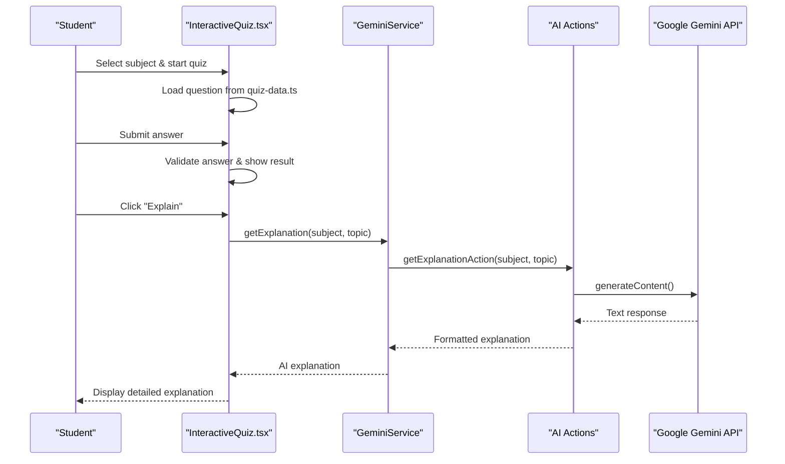
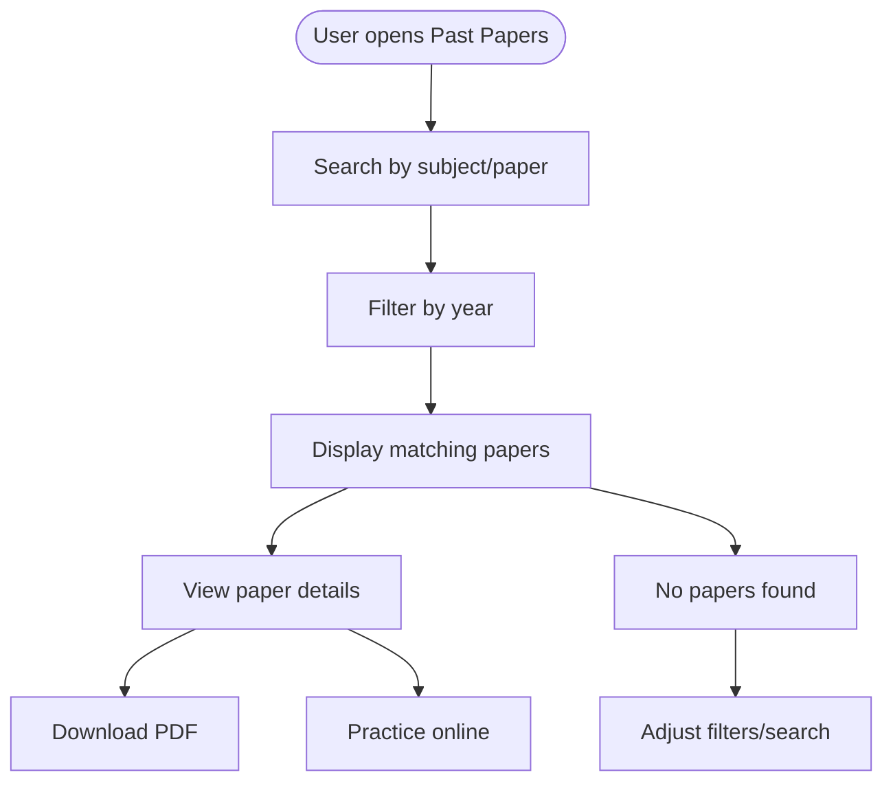
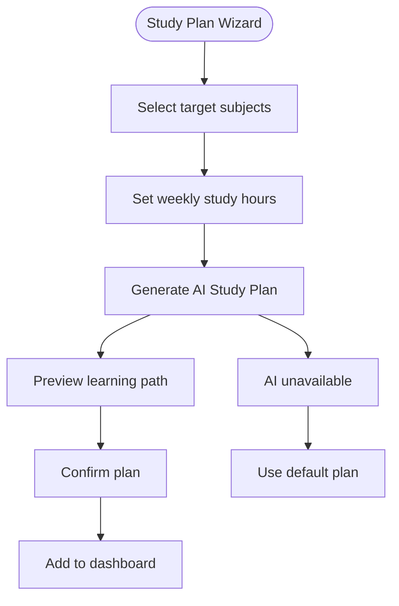
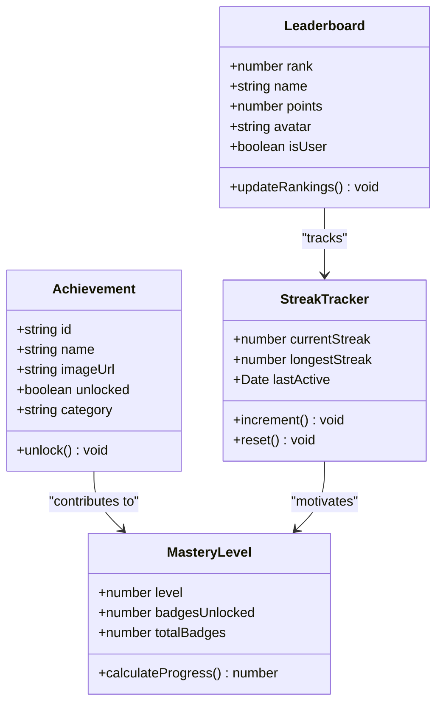
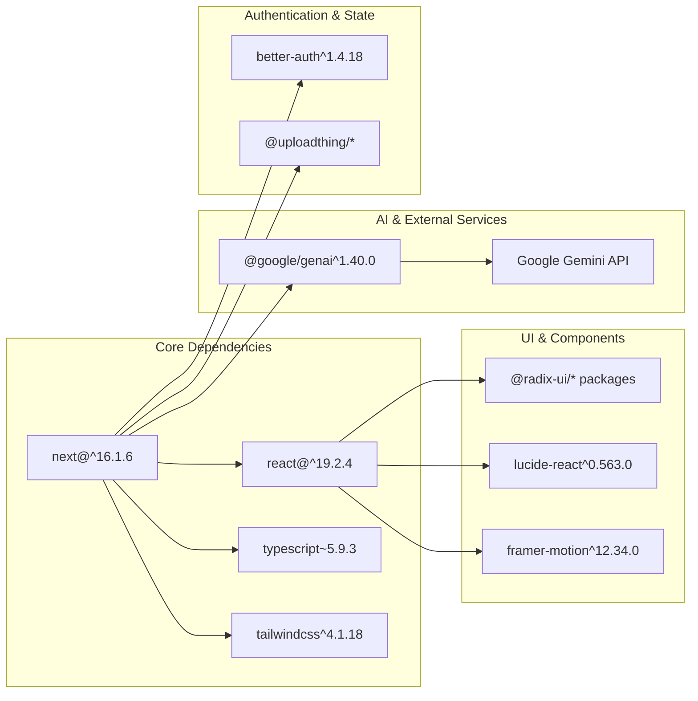

# Project Overview

<cite>
**Referenced Files in This Document**
- [README.md](file://README.md)
- [package.json](file://package.json)
- [src/app/layout.tsx](file://src/app/layout.tsx)
- [src/services/aiActions.ts](file://src/services/aiActions.ts)
- [src/services/geminiService.ts](file://src/services/geminiService.ts)
- [src/constants/mock-data.ts](file://src/constants/mock-data.ts)
- [src/constants/quiz-data.ts](file://src/constants/quiz-data.ts)
- [src/screens/Landing.tsx](file://src/screens/Landing.tsx)
- [src/screens/PastPapers.tsx](file://src/screens/PastPapers.tsx)
- [src/screens/Dashboard.tsx](file://src/screens/Dashboard.tsx)
- [src/screens/Achievements.tsx](file://src/screens/Achievements.tsx)
- [src/screens/Leaderboard.tsx](file://src/screens/Leaderboard.tsx)
- [src/screens/InteractiveQuiz.tsx](file://src/screens/InteractiveQuiz.tsx)
- [src/screens/MathematicsQuiz.tsx](file://src/screens/MathematicsQuiz.tsx)
- [src/screens/PhysicsQuiz.tsx](file://src/screens/PhysicsQuiz.tsx)
- [src/screens/PracticeQuiz.tsx](file://src/screens/PracticeQuiz.tsx)
- [src/screens/StudyPlanWizard.tsx](file://src/screens/StudyPlanWizard.tsx)
</cite>

## Table of Contents
1. [Introduction](#introduction)
2. [Project Structure](#project-structure)
3. [Core Components](#core-components)
4. [Architecture Overview](#architecture-overview)
5. [Detailed Component Analysis](#detailed-component-analysis)
6. [Dependency Analysis](#dependency-analysis)
7. [Performance Considerations](#performance-considerations)
8. [Troubleshooting Guide](#troubleshooting-guide)
9. [Conclusion](#conclusion)

## Introduction
MatricMaster AI is an educational platform designed to help South African Grade 12 students master their matric exams through interactive practice. The platform combines:
- Interactive past papers aligned with the National Senior Certificate (NSC) curriculum
- AI-powered explanations powered by Google Gemini
- Gamified learning elements including achievements, streaks, and leaderboards
- Personalized study plans generated by AI
- Dark mode and mobile-first responsive design

Target audience:
- South African Grade 12 learners preparing for final exams
- Students seeking structured, adaptive practice with instant feedback
- Learners who benefit from gamification and progress tracking

Unique value proposition:
- Real NSC-grade past papers with interactive quizzes
- Instant AI tutoring for difficult concepts
- Personalized study paths tailored to individual goals and time commitments
- Social motivation through leaderboards and achievements

Educational impact examples:
- Immediate concept reinforcement via AI explanations after quiz attempts
- Structured progress monitoring through weekly streaks and mastery levels
- Motivation through gamified achievements and competitive leaderboards
- Personalized pacing with AI-generated study plans

**Section sources**
- [README.md](file://README.md#L11-L21)
- [src/screens/Landing.tsx](file://src/screens/Landing.tsx#L40-L54)

## Project Structure
The project follows a modern Next.js 16 App Router architecture with a clear separation of concerns:
- src/app: Next.js app router pages and shared layouts
- src/components: Reusable UI primitives and layout components
- src/screens: Page-level components implementing specific features
- src/services: AI integration and backend service abstractions
- src/constants: Static data including subjects, past papers, and quiz content
- src/hooks: Custom React hooks for theme and state management
- src/lib: Authentication, database utilities, and shared libraries

**Diagram sources**
- [src/app/layout.tsx](file://src/app/layout.tsx#L1-L108)
- [package.json](file://package.json#L27-L64)

**Section sources**
- [README.md](file://README.md#L88-L105)
- [package.json](file://package.json#L1-L84)

## Core Components
The platform consists of several interconnected components that deliver the complete educational experience:

### Educational Content Delivery
- Interactive quiz system with subject-specific question banks
- Past paper archive with downloadable NSC exam materials
- Topic-based learning paths covering all major subjects

### AI-Powered Learning
- Real-time concept explanations via Google Gemini API
- Personalized study plan generation based on student goals
- Smart search functionality for finding relevant learning resources

### Gamification & Progress Tracking
- Achievement system with unlockable badges
- Weekly streak tracking and mastery levels
- Leaderboard competition across school, provincial, and national levels

### User Experience Features
- Dark/light theme switching with persistent preferences
- Mobile-first responsive design optimized for tablets and phones
- Progress visualization through charts and completion indicators

**Section sources**
- [README.md](file://README.md#L13-L28)
- [src/constants/mock-data.ts](file://src/constants/mock-data.ts#L1-L46)
- [src/services/aiActions.ts](file://src/services/aiActions.ts#L42-L114)

## Architecture Overview
The platform implements a client-server architecture with AI integration:

**Diagram sources**
- [src/app/layout.tsx](file://src/app/layout.tsx#L84-L107)
- [src/services/geminiService.ts](file://src/services/geminiService.ts#L1-L14)
- [src/services/aiActions.ts](file://src/services/aiActions.ts#L20-L32)

The architecture emphasizes:
- Server-side AI processing for Gemini API calls
- Client-side rendering for responsive user interactions
- Modular component design for maintainability
- Type-safe data structures using TypeScript

**Section sources**
- [src/app/layout.tsx](file://src/app/layout.tsx#L1-L108)
- [src/services/aiActions.ts](file://src/services/aiActions.ts#L1-L168)

## Detailed Component Analysis

### Interactive Quiz System
The quiz system provides subject-specific, curriculum-aligned practice with immediate feedback and AI-powered explanations.

**Diagram sources**
- [src/screens/InteractiveQuiz.tsx](file://src/screens/InteractiveQuiz.tsx#L154-L170)
- [src/services/geminiService.ts](file://src/services/geminiService.ts#L3-L5)
- [src/services/aiActions.ts](file://src/services/aiActions.ts#L42-L78)

Key features:
- Subject-specific color coding and thematic styling
- Topic-based categorization for targeted practice
- Teacher hints for additional guidance
- AI-powered deep explanations for complex concepts

**Section sources**
- [src/screens/InteractiveQuiz.tsx](file://src/screens/InteractiveQuiz.tsx#L105-L458)
- [src/constants/quiz-data.ts](file://src/constants/quiz-data.ts#L23-L313)

### Past Paper Archive
The platform provides access to thousands of NSC past papers organized by subject, year, and paper type.

**Diagram sources**
- [src/screens/PastPapers.tsx](file://src/screens/PastPapers.tsx#L13-L179)
- [src/constants/mock-data.ts](file://src/constants/mock-data.ts#L48-L240)

Implementation highlights:
- Real NSC exam papers from 2020-2025
- Subject coverage including Mathematics, Physical Sciences, Life Sciences, Geography, English, and Accounting
- Year filtering and search functionality
- Direct download links to official exam sources

**Section sources**
- [src/screens/PastPapers.tsx](file://src/screens/PastPapers.tsx#L1-L179)
- [src/constants/mock-data.ts](file://src/constants/mock-data.ts#L48-L240)

### Study Planning System
Personalized study plans help students organize their revision around their specific goals and time availability.

**Diagram sources**
- [src/screens/StudyPlanWizard.tsx](file://src/screens/StudyPlanWizard.tsx#L33-L243)
- [src/services/geminiService.ts](file://src/services/geminiService.ts#L7-L9)

The system integrates with AI to create customized learning paths that:
- Prioritize selected subjects based on student goals
- Allocate study time according to weekly commitment
- Create logical progression through topics and difficulty levels

**Section sources**
- [src/screens/StudyPlanWizard.tsx](file://src/screens/StudyPlanWizard.tsx#L1-L243)
- [src/services/aiActions.ts](file://src/services/aiActions.ts#L80-L114)

### Gamification & Progress Tracking
The platform incorporates multiple gamification elements to motivate and engage learners.

**Diagram sources**
- [src/screens/Achievements.tsx](file://src/screens/Achievements.tsx#L7-L87)
- [src/screens/Leaderboard.tsx](file://src/screens/Leaderboard.tsx#L9-L25)
- [src/screens/Dashboard.tsx](file://src/screens/Dashboard.tsx#L23-L35)

Components include:
- Unlockable achievements for various milestones and subject mastery
- Daily and weekly streak tracking for consistent practice
- Multi-tiered leaderboard system (school, provincial, national)
- Mastery level progression with visual indicators

**Section sources**
- [src/screens/Achievements.tsx](file://src/screens/Achievements.tsx#L1-L250)
- [src/screens/Leaderboard.tsx](file://src/screens/Leaderboard.tsx#L1-L380)
- [src/screens/Dashboard.tsx](file://src/screens/Dashboard.tsx#L1-L340)

### Technology Stack Deep Dive
The platform leverages modern web technologies for optimal performance and developer experience:

**Frontend Framework & Rendering**
- Next.js 16 with App Router for efficient client-side routing and server-side rendering
- React 19 for component-based UI development
- TypeScript for type safety and enhanced developer experience

**Styling & UI Components**
- Tailwind CSS 4 for utility-first styling and responsive design
- Radix UI primitives for accessible, headless components
- Custom design system with brand-specific color palettes and animations

**AI Integration**
- Google Gemini API for natural language processing and educational content generation
- Zod for runtime validation of AI responses and user inputs
- Secure API key management with environment variable configuration

**Development & Build Tools**
- Biome for code quality, linting, and formatting
- Playwright for end-to-end testing
- Drizzle ORM for database schema management

**Section sources**
- [README.md](file://README.md#L23-L29)
- [package.json](file://package.json#L27-L82)

## Dependency Analysis
The project maintains clean architectural boundaries with well-defined dependencies:

**Diagram sources**
- [package.json](file://package.json#L27-L82)

Key dependency characteristics:
- Minimal bundle size through tree-shaking and lazy loading
- Strong typing throughout the codebase for better maintainability
- Modular design enabling easy replacement of individual components
- Secure external service integration with proper error handling

**Section sources**
- [package.json](file://package.json#L1-L84)

## Performance Considerations
The platform is optimized for both development efficiency and runtime performance:

**Client-Side Optimization**
- Next.js App Router enables automatic code splitting and route-based loading
- Lazy loading for heavy components like the math keyboard and calculator
- Efficient state management reducing unnecessary re-renders
- Mobile-first design minimizing layout thrashing on small screens

**AI Integration Performance**
- Server-side AI processing prevents client-side API key exposure
- Response caching for frequently accessed explanations
- Graceful degradation when AI services are unavailable
- Input sanitization preventing API abuse and ensuring response quality

**Data Management**
- Local state for UI interactions with minimal persistence needs
- Mock data for development and testing scenarios
- Efficient filtering and search algorithms for large datasets

## Troubleshooting Guide
Common issues and their solutions:

**AI Service Issues**
- Symptom: "AI features are not configured" message
- Cause: Missing GEMINI_API_KEY environment variable
- Solution: Add NEXT_PUBLIC_GEMINI_API_KEY to .env.local file

**Quiz Navigation Problems**
- Symptom: Questions not loading or incorrect subject filtering
- Cause: Missing quiz data for requested subject
- Solution: Verify quiz-data.ts contains entries for the selected subject

**Streak & Progress Not Saving**
- Symptom: Streak resets after page refresh
- Cause: Local development environment without persistent storage
- Solution: This is expected behavior in development; production uses database

**Performance Issues**
- Symptom: Slow loading of math keyboards or calculators
- Cause: Heavy DOM manipulation for mathematical notation
- Solution: Browser performance profiling indicates normal behavior for complex math rendering

**Section sources**
- [src/services/aiActions.ts](file://src/services/aiActions.ts#L24-L31)
- [src/screens/InteractiveQuiz.tsx](file://src/screens/InteractiveQuiz.tsx#L154-L170)

## Conclusion
MatricMaster AI represents a comprehensive solution for South African Grade 12 exam preparation, combining traditional educational content with modern AI-powered learning and gamification. The platform's strength lies in its integrated approach to study materials, immediate feedback mechanisms, and motivational elements that encourage consistent practice.

Key strengths:
- Authentic NSC-aligned content with real past papers
- AI-powered explanations that adapt to student needs
- Comprehensive gamification system promoting engagement
- Mobile-first design supporting diverse learning environments
- Scalable architecture enabling future feature expansion

The platform provides measurable educational benefits through:
- Immediate concept reinforcement reducing learning gaps
- Structured progress tracking helping students stay motivated
- Personalized learning paths optimizing study efficiency
- Social motivation through competitive elements

Future enhancement opportunities include expanding subject coverage, integrating adaptive learning algorithms, and adding collaborative study features while maintaining the platform's focus on accessibility and South African curriculum alignment.