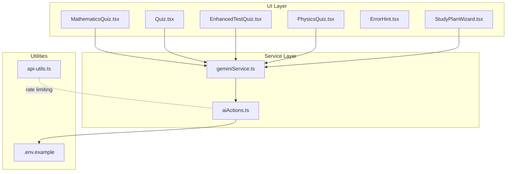
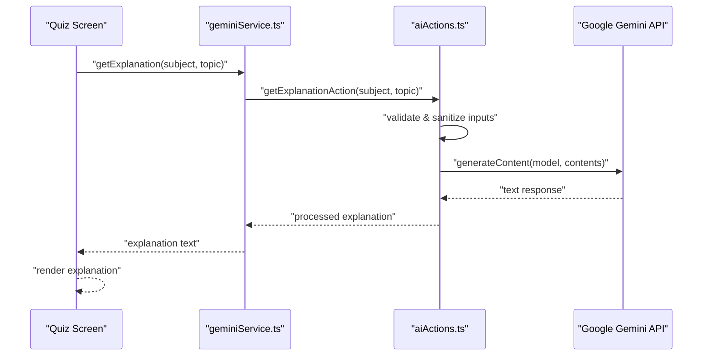
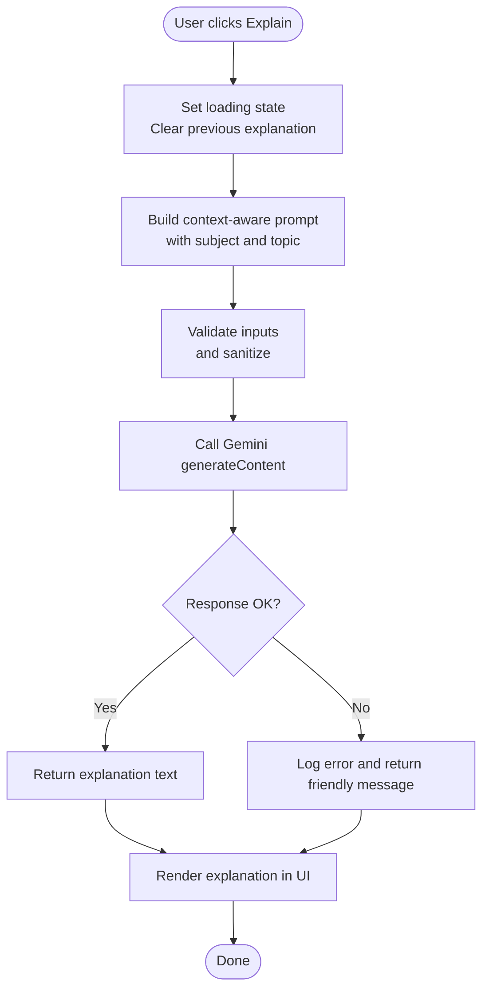
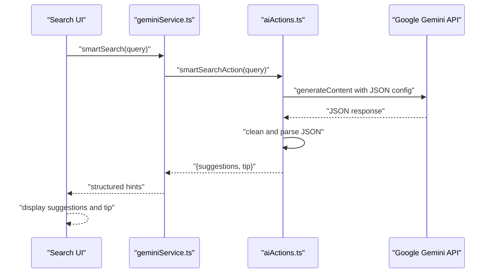
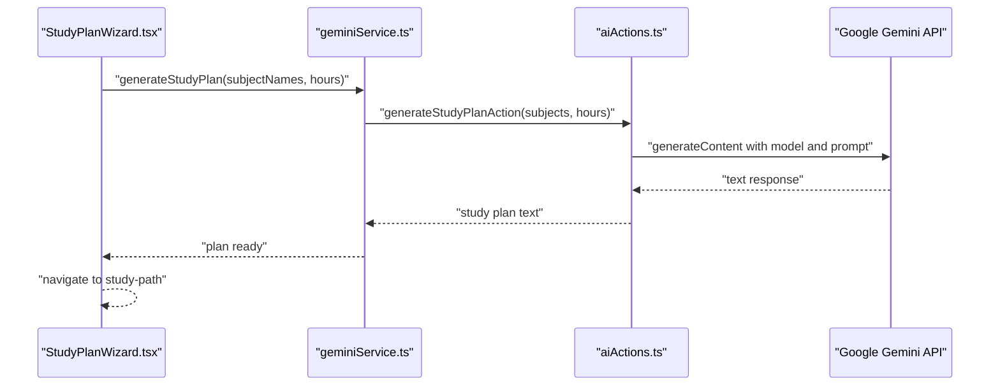
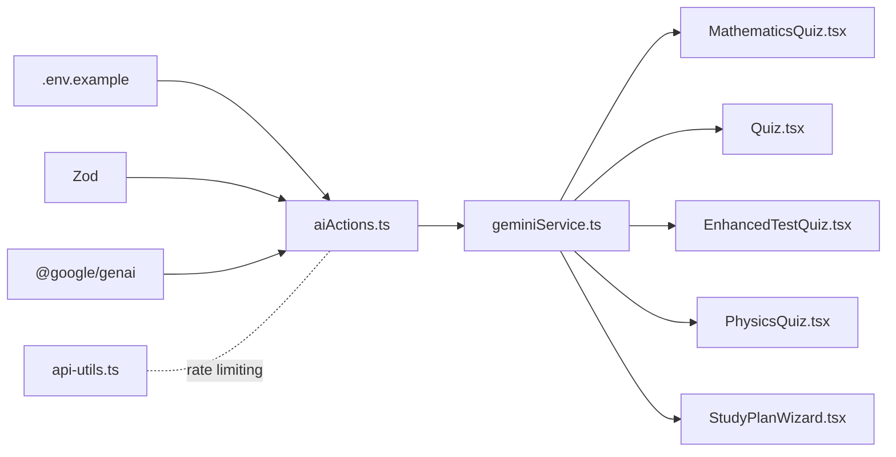
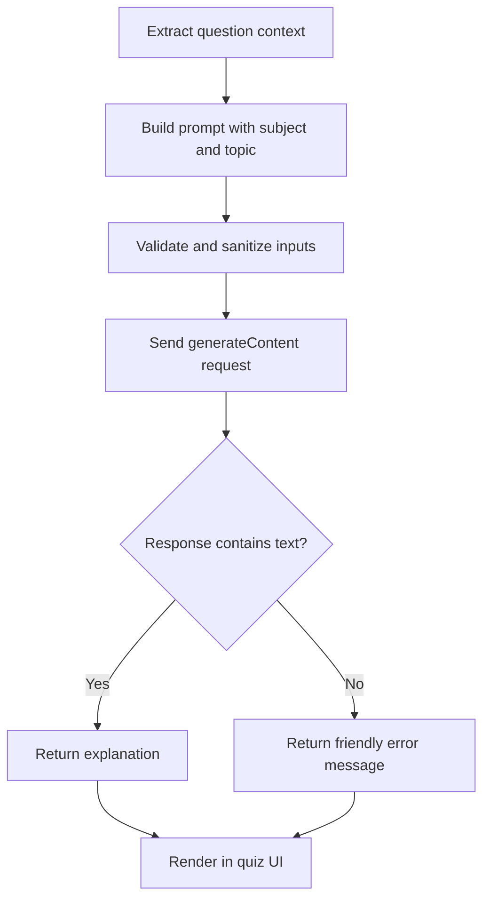

# AI Integration in Quizzes

<cite>
**Referenced Files in This Document**
- [aiActions.ts](file://src/services/aiActions.ts)
- [geminiService.ts](file://src/services/geminiService.ts)
- [api-utils.ts](file://src/lib/api-utils.ts)
- [MathematicsQuiz.tsx](file://src/screens/MathematicsQuiz.tsx)
- [Quiz.tsx](file://src/screens/Quiz.tsx)
- [ErrorHint.tsx](file://src/screens/ErrorHint.tsx)
- [StudyPlanWizard.tsx](file://src/screens/StudyPlanWizard.tsx)
- [.env.example](file://.env.example)
- [mathematics_model.md](file://src/data_modeling/mathematics_model.md)
- [data.ts](file://src/lib/data.ts)
- [EnhancedTestQuiz.tsx](file://src/screens/EnhancedTestQuiz.tsx)
- [PhysicsQuiz.tsx](file://src/screens/PhysicsQuiz.tsx)
</cite>

## Table of Contents
1. [Introduction](#introduction)
2. [Project Structure](#project-structure)
3. [Core Components](#core-components)
4. [Architecture Overview](#architecture-overview)
5. [Detailed Component Analysis](#detailed-component-analysis)
6. [Dependency Analysis](#dependency-analysis)
7. [Performance Considerations](#performance-considerations)
8. [Troubleshooting Guide](#troubleshooting-guide)
9. [Conclusion](#conclusion)
10. [Appendices](#appendices)

## Introduction
This document explains the AI integration within the quiz system, focusing on AI-powered explanation generation for incorrect answers, smart hints, and personalized learning path recommendations. It documents the integration with Google Gemini, request/response formatting, error handling, UI integration, rate limiting, caching, and offline fallback strategies. It also outlines the AI explanation workflow from question context extraction to explanation delivery and how it connects with user progress tracking.

## Project Structure
The AI integration spans three layers:
- Service layer: AI action functions and service wrappers for Gemini
- UI layer: Quiz screens that trigger AI explanations and present feedback
- Utilities: Rate limiting helpers and environment configuration

**Diagram sources**
- [aiActions.ts](file://src/services/aiActions.ts#L1-L168)
- [geminiService.ts](file://src/services/geminiService.ts#L1-L14)
- [MathematicsQuiz.tsx](file://src/screens/MathematicsQuiz.tsx#L39-L68)
- [Quiz.tsx](file://src/screens/Quiz.tsx#L28-L66)
- [EnhancedTestQuiz.tsx](file://src/screens/EnhancedTestQuiz.tsx#L692-L731)
- [PhysicsQuiz.tsx](file://src/screens/PhysicsQuiz.tsx#L410-L445)
- [ErrorHint.tsx](file://src/screens/ErrorHint.tsx#L1-L121)
- [StudyPlanWizard.tsx](file://src/screens/StudyPlanWizard.tsx#L1-L243)
- [api-utils.ts](file://src/lib/api-utils.ts#L1-L92)
- [.env.example](file://.env.example#L1-L19)

**Section sources**
- [aiActions.ts](file://src/services/aiActions.ts#L1-L168)
- [geminiService.ts](file://src/services/geminiService.ts#L1-L14)
- [api-utils.ts](file://src/lib/api-utils.ts#L1-L92)
- [.env.example](file://.env.example#L1-L19)

## Core Components
- aiActions.ts: Implements three AI actions:
  - Explanation generator for incorrect answers
  - Study plan generator for personalized learning paths
  - Smart search for topic suggestions and tips
- geminiService.ts: Thin wrapper around aiActions.ts for UI consumption
- api-utils.ts: Provides generic rate limiting utilities for API endpoints
- Environment configuration: Exposes NEXT_PUBLIC_GEMINI_API_KEY for client-side hints and GEMINI_API_KEY for server-side actions

Key responsibilities:
- Input validation and sanitization
- Context-aware prompt construction for Grade 12 South African curriculum
- JSON response parsing for structured outputs
- Graceful error handling and user-friendly messages
- UI integration points for displaying AI-generated explanations and study plans

**Section sources**
- [aiActions.ts](file://src/services/aiActions.ts#L1-L168)
- [geminiService.ts](file://src/services/geminiService.ts#L1-L14)
- [.env.example](file://.env.example#L8-L10)
- [api-utils.ts](file://src/lib/api-utils.ts#L1-L92)

## Architecture Overview
The AI workflow follows a clear request-response pattern:
- UI triggers an action (explain, generate study plan, smart search)
- Service layer validates inputs and constructs prompts
- Gemini client sends requests to Google Gemini API
- Responses are processed and returned to the UI for rendering

**Diagram sources**
- [geminiService.ts](file://src/services/geminiService.ts#L1-L14)
- [aiActions.ts](file://src/services/aiActions.ts#L42-L78)

## Detailed Component Analysis

### AI Explanation Generator for Incorrect Answers
Purpose: Provide contextual explanations for incorrect quiz answers using a curated prompt tailored to Grade 12 South African learners.

Implementation highlights:
- Input validation and sanitization to prevent injection and enforce limits
- Prompt engineering emphasizing simplicity, analogies, and highlighting key formulas
- Robust error handling returning user-friendly messages on failures

**Diagram sources**
- [MathematicsQuiz.tsx](file://src/screens/MathematicsQuiz.tsx#L39-L68)
- [Quiz.tsx](file://src/screens/Quiz.tsx#L28-L66)
- [aiActions.ts](file://src/services/aiActions.ts#L42-L78)

**Section sources**
- [aiActions.ts](file://src/services/aiActions.ts#L42-L78)
- [MathematicsQuiz.tsx](file://src/screens/MathematicsQuiz.tsx#L39-L68)
- [Quiz.tsx](file://src/screens/Quiz.tsx#L28-L66)
- [EnhancedTestQuiz.tsx](file://src/screens/EnhancedTestQuiz.tsx#L692-L731)
- [PhysicsQuiz.tsx](file://src/screens/PhysicsQuiz.tsx#L410-L445)

### Smart Hint System and Concept Clarification
Purpose: Provide targeted hints and topic suggestions for learner confusion.

Implementation highlights:
- Structured JSON response via Gemini with suggestions array and a concise tip
- Input sanitization and schema validation
- UI rendering of suggestions and tips in dedicated screens

**Diagram sources**
- [geminiService.ts](file://src/services/geminiService.ts#L11-L13)
- [aiActions.ts](file://src/services/aiActions.ts#L116-L167)

**Section sources**
- [aiActions.ts](file://src/services/aiActions.ts#L116-L167)
- [ErrorHint.tsx](file://src/screens/ErrorHint.tsx#L1-L121)

### Personalized Learning Path Recommendations
Purpose: Generate a daily quest-style study plan aligned with selected subjects and weekly commitment.

Implementation highlights:
- Validation of subjects and hours with bounds checking
- Prompt instructing Gemini to structure output as a daily quest path
- UI wizard to collect inputs and display a preview

**Diagram sources**
- [StudyPlanWizard.tsx](file://src/screens/StudyPlanWizard.tsx#L45-L60)
- [geminiService.ts](file://src/services/geminiService.ts#L7-L9)
- [aiActions.ts](file://src/services/aiActions.ts#L80-L114)

**Section sources**
- [aiActions.ts](file://src/services/aiActions.ts#L80-L114)
- [StudyPlanWizard.tsx](file://src/screens/StudyPlanWizard.tsx#L1-L243)

### Integration with UI Screens
- MathematicsQuiz.tsx and Quiz.tsx: Trigger AI explanations for incorrect answers and render them below the question
- EnhancedTestQuiz.tsx and PhysicsQuiz.tsx: Display AI explanations in a dedicated area with smooth animations
- ErrorHint.tsx: Presents a focused UI for hints and tips during quiz errors

Rendering patterns:
- Conditional rendering of explanation blocks
- Loading states while fetching explanations
- Fallback messages for network or API errors

**Section sources**
- [MathematicsQuiz.tsx](file://src/screens/MathematicsQuiz.tsx#L39-L68)
- [Quiz.tsx](file://src/screens/Quiz.tsx#L28-L66)
- [EnhancedTestQuiz.tsx](file://src/screens/EnhancedTestQuiz.tsx#L692-L731)
- [PhysicsQuiz.tsx](file://src/screens/PhysicsQuiz.tsx#L410-L445)
- [ErrorHint.tsx](file://src/screens/ErrorHint.tsx#L1-L121)

### Mathematical Notation Handling
- The system leverages LaTeX-ready text and KaTeX rendering for math expressions, as documented in the mathematics modeling guide
- AI prompts are context-aware and encourage concise explanations suitable for learners
- UI components render explanations with proper typography and monospace formatting for formulas

**Section sources**
- [mathematics_model.md](file://src/data_modeling/mathematics_model.md#L186-L210)

## Dependency Analysis
- aiActions.ts depends on:
  - @google/genai for Gemini integration
  - Zod for input validation
  - Environment variables for API keys
- geminiService.ts wraps aiActions.ts for UI consumption
- api-utils.ts provides reusable rate limiting utilities
- UI screens depend on geminiService.ts for AI features

**Diagram sources**
- [aiActions.ts](file://src/services/aiActions.ts#L1-L168)
- [geminiService.ts](file://src/services/geminiService.ts#L1-L14)
- [api-utils.ts](file://src/lib/api-utils.ts#L1-L92)
- [.env.example](file://.env.example#L8-L10)

**Section sources**
- [aiActions.ts](file://src/services/aiActions.ts#L1-L168)
- [geminiService.ts](file://src/services/geminiService.ts#L1-L14)
- [api-utils.ts](file://src/lib/api-utils.ts#L1-L92)
- [.env.example](file://.env.example#L8-L10)

## Performance Considerations
- Model selection: Uses a 2.5 Flash model optimized for speed and cost
- Input sanitization reduces payload sizes and mitigates injection risks
- UI-level caching: Keep previous explanations rendered to avoid re-fetching during a single session
- Network resilience: Implement retry logic with exponential backoff for transient failures
- Rate limiting: Apply per-IP rate limits to protect backend resources and maintain fair usage

[No sources needed since this section provides general guidance]

## Troubleshooting Guide
Common issues and resolutions:
- Missing API key:
  - Ensure NEXT_PUBLIC_GEMINI_API_KEY is set for client-side hints and GEMINI_API_KEY for server-side actions
- Invalid input errors:
  - Inputs are validated and sanitized; ensure queries and topics meet length and character constraints
- API failures:
  - The system logs errors and returns user-friendly messages; verify network connectivity and quota limits
- JSON parsing failures:
  - Gemini is instructed to return JSON; ensure responseMimeType is set and clean JSON before parsing

**Section sources**
- [.env.example](file://.env.example#L8-L10)
- [aiActions.ts](file://src/services/aiActions.ts#L71-L78)
- [aiActions.ts](file://src/services/aiActions.ts#L160-L167)

## Conclusion
The AI integration delivers context-aware explanations, smart hints, and personalized study plans tailored to Grade 12 learners. It balances robustness with performance, integrates cleanly with existing quiz UIs, and provides clear extension points for customization and alternative AI models.

[No sources needed since this section summarizes without analyzing specific files]

## Appendices

### AI Explanation Workflow
End-to-end flow from question context to delivered explanation:
1. Extract question context from the quiz screen
2. Build a context-aware prompt with subject and topic
3. Validate and sanitize inputs
4. Send request to Gemini
5. Parse and return explanation text
6. Render in the UI with loading and error states

**Diagram sources**
- [MathematicsQuiz.tsx](file://src/screens/MathematicsQuiz.tsx#L39-L68)
- [Quiz.tsx](file://src/screens/Quiz.tsx#L28-L66)
- [aiActions.ts](file://src/services/aiActions.ts#L42-L78)

### Rate Limiting Mechanisms
- Generic rate limiter supports configurable windows and maximum requests
- Returns headers indicating limit, remaining, and reset time
- Can be applied to any endpoint requiring protection

**Section sources**
- [api-utils.ts](file://src/lib/api-utils.ts#L18-L78)

### Caching Strategies for AI Responses
- UI-level caching: Persist explanations per session to avoid repeated API calls
- Database-level caching: Store user-specific explanations and study plans for reuse
- Stale-while-revalidate: Serve cached responses immediately and update in the background

[No sources needed since this section provides general guidance]

### Offline Fallback Options
- Display cached explanations when offline
- Show pre-generated hints for common mistakes
- Provide links to downloadable formula sheets and study materials

[No sources needed since this section provides general guidance]

### Implementation Guidelines for Extending AI Capabilities
- Add new action functions mirroring the existing patterns in aiActions.ts
- Wrap new actions in geminiService.ts for UI consumption
- Extend UI screens to trigger and render new AI features
- Customize prompts to target specific curriculum domains (e.g., Physics, Life Sciences)
- Integrate alternative AI models by swapping the Gemini client while preserving the action signatures

**Section sources**
- [aiActions.ts](file://src/services/aiActions.ts#L1-L168)
- [geminiService.ts](file://src/services/geminiService.ts#L1-L14)

### Customizing Explanation Styles
- Modify prompts to emphasize different teaching styles (visual, analytical, memorization)
- Adjust UI rendering to highlight formulas, diagrams, and key takeaways
- Provide user preferences for explanation tone and depth

**Section sources**
- [aiActions.ts](file://src/services/aiActions.ts#L54-L66)
- [EnhancedTestQuiz.tsx](file://src/screens/EnhancedTestQuiz.tsx#L692-L731)
- [PhysicsQuiz.tsx](file://src/screens/PhysicsQuiz.tsx#L410-L445)

### Integrating Alternative AI Models
- Maintain consistent action signatures across providers
- Abstract provider-specific clients behind aiActions.ts
- Swap models without changing UI logic

**Section sources**
- [aiActions.ts](file://src/services/aiActions.ts#L22-L32)
- [geminiService.ts](file://src/services/geminiService.ts#L1-L14)

### Connecting AI to User Progress Tracking
- Capture user selections and AI interactions for analytics
- Store study plan preferences and completion metrics
- Use progress data to personalize future prompts and recommendations

**Section sources**
- [data.ts](file://src/lib/data.ts#L58-L362)