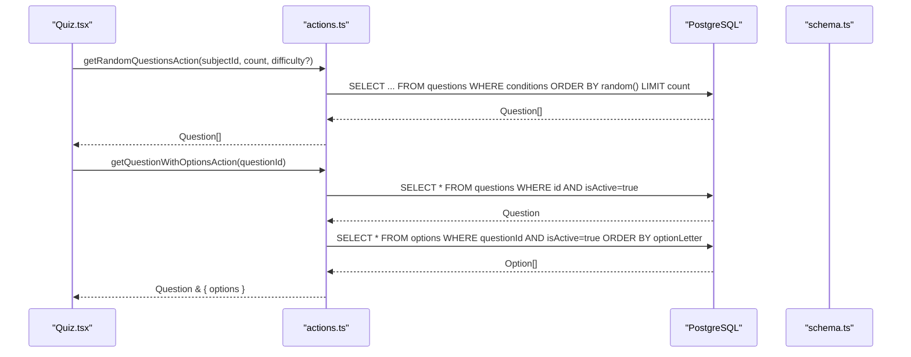
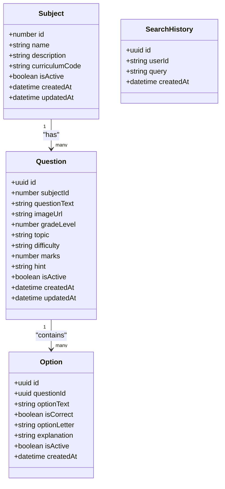
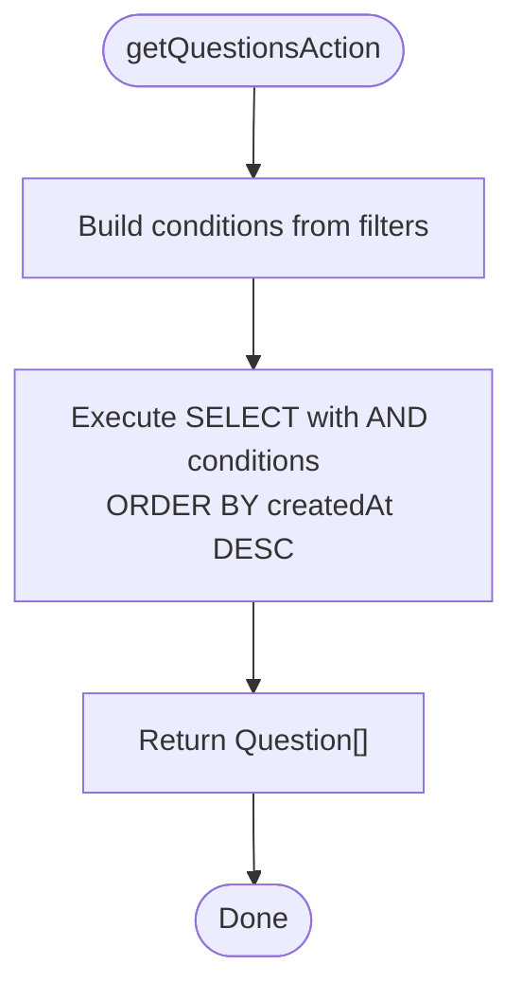
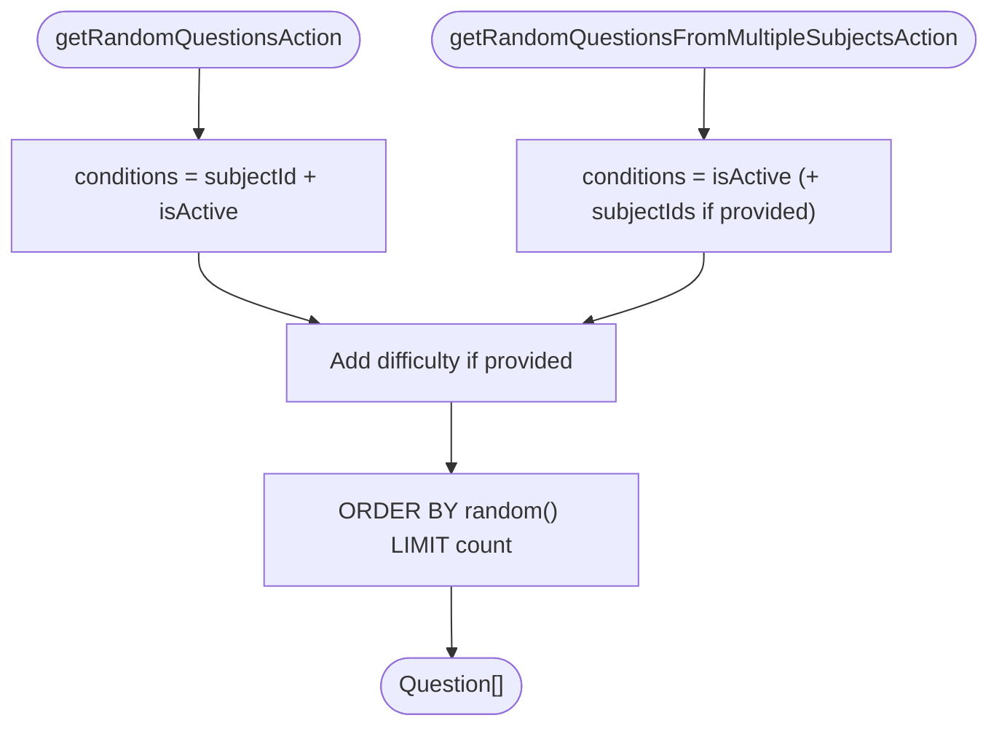
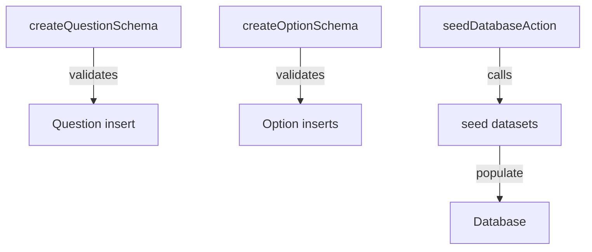
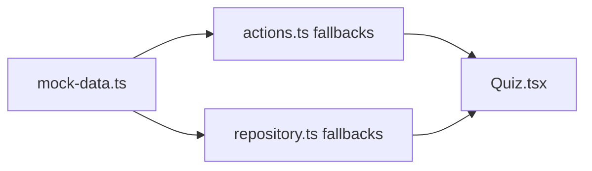
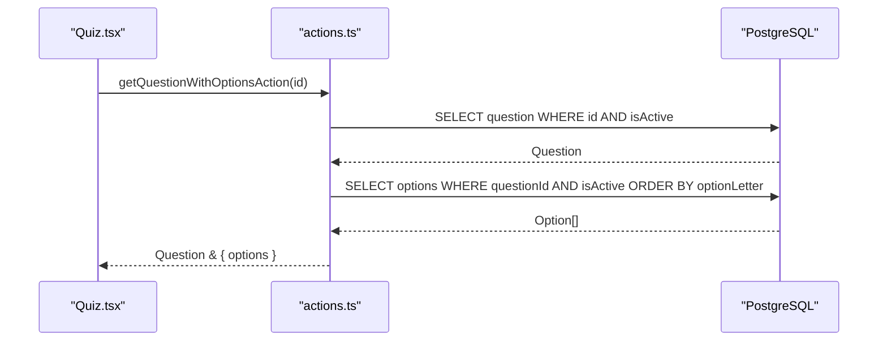
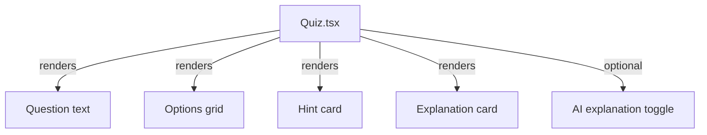
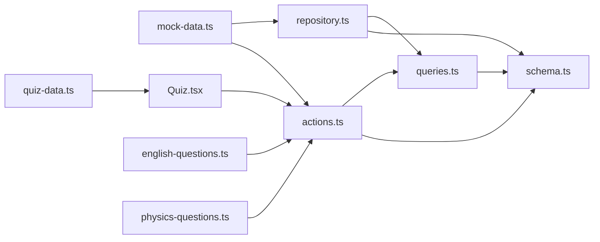

# Question Management

<cite>
**Referenced Files in This Document**
- [quiz-data.ts](file://src/constants/quiz-data.ts)
- [mock-data.ts](file://src/constants/mock-data.ts)
- [schema.ts](file://src/lib/db/schema.ts)
- [actions.ts](file://src/lib/db/actions.ts)
- [repository.ts](file://src/lib/db/repository.ts)
- [queries.ts](file://src/lib/db/queries.ts)
- [english-questions.ts](file://src/lib/db/seed/english-questions.ts)
- [physics-questions.ts](file://src/lib/db/seed/physics-questions.ts)
- [Quiz.tsx](file://src/screens/Quiz.tsx)
</cite>

## Table of Contents
1. [Introduction](#introduction)
2. [Project Structure](#project-structure)
3. [Core Components](#core-components)
4. [Architecture Overview](#architecture-overview)
5. [Detailed Component Analysis](#detailed-component-analysis)
6. [Dependency Analysis](#dependency-analysis)
7. [Performance Considerations](#performance-considerations)
8. [Troubleshooting Guide](#troubleshooting-guide)
9. [Conclusion](#conclusion)
10. [Appendices](#appendices)

## Introduction
This document explains the question management system in MatricMaster AI. It covers the question data model, mock data organization, question categorization by subject and difficulty, validation and seeding, sourcing and loading strategies, caching approaches, and UI rendering integration. It also provides guidance for extending the database and adding new question types.

## Project Structure
The question management system spans three layers:
- Data model and schema: PostgreSQL tables and relations for subjects, questions, and options.
- Data access layer: Actions, repository, and queries that encapsulate database operations and validation.
- Content and UI: Mock data for quickstarts, seed datasets for initial content, and UI screens that render questions.

```mermaid
graph TB
subgraph "Data Model"
S["subjects"]
Q["questions"]
O["options"]
SH["search_history"]
end
subgraph "Data Access"
A["actions.ts"]
R["repository.ts"]
QRY["queries.ts"]
end
subgraph "Content"
MD["mock-data.ts"]
QZ["quiz-data.ts"]
SE1["english-questions.ts"]
SE2["physics-questions.ts"]
end
subgraph "UI"
UI["Quiz.tsx"]
end
S <-- relations --> Q
Q <-- relations --> O
A --> S
A --> Q
A --> O
R --> Q
R --> O
QRY --> Q
QRY --> O
MD --> UI
QZ --> UI
SE1 --> A
SE2 --> A
UI --> A
```

**Diagram sources**
- [schema.ts](file://src/lib/db/schema.ts#L42-L114)
- [actions.ts](file://src/lib/db/actions.ts#L1-L516)
- [repository.ts](file://src/lib/db/repository.ts#L95-L225)
- [queries.ts](file://src/lib/db/queries.ts#L100-L215)
- [mock-data.ts](file://src/constants/mock-data.ts#L1-L285)
- [quiz-data.ts](file://src/constants/quiz-data.ts#L1-L313)
- [english-questions.ts](file://src/lib/db/seed/english-questions.ts#L1-L302)
- [physics-questions.ts](file://src/lib/db/seed/physics-questions.ts#L1-L395)
- [Quiz.tsx](file://src/screens/Quiz.tsx#L1-L363)

**Section sources**
- [schema.ts](file://src/lib/db/schema.ts#L42-L114)
- [actions.ts](file://src/lib/db/actions.ts#L1-L516)
- [repository.ts](file://src/lib/db/repository.ts#L95-L225)
- [queries.ts](file://src/lib/db/queries.ts#L100-L215)
- [mock-data.ts](file://src/constants/mock-data.ts#L1-L285)
- [quiz-data.ts](file://src/constants/quiz-data.ts#L1-L313)
- [english-questions.ts](file://src/lib/db/seed/english-questions.ts#L1-L302)
- [physics-questions.ts](file://src/lib/db/seed/physics-questions.ts#L1-L395)
- [Quiz.tsx](file://src/screens/Quiz.tsx#L1-L363)

## Core Components
- Question data model: Subjects, Questions, Options, and Search History tables with relations.
- Validation and actions: Zod schemas and server actions for CRUD, filtering, random selection, and search history.
- Mock data: Lightweight in-memory datasets for quickstarts and fallbacks.
- Seed datasets: Structured question sets for initial content population.
- UI integration: Rendering of questions, options, hints, and explanations.

Key responsibilities:
- Define canonical question structure and metadata (subject, topic, difficulty, grade level, marks).
- Enforce content validation and constraints.
- Provide deterministic and randomized retrieval for quizzes.
- Support UI rendering with dynamic content and accessibility-friendly states.

**Section sources**
- [schema.ts](file://src/lib/db/schema.ts#L42-L114)
- [actions.ts](file://src/lib/db/actions.ts#L17-L47)
- [mock-data.ts](file://src/constants/mock-data.ts#L1-L285)
- [quiz-data.ts](file://src/constants/quiz-data.ts#L1-L313)
- [english-questions.ts](file://src/lib/db/seed/english-questions.ts#L1-L302)
- [physics-questions.ts](file://src/lib/db/seed/physics-questions.ts#L1-L395)
- [Quiz.tsx](file://src/screens/Quiz.tsx#L1-L363)

## Architecture Overview
The system separates concerns across schema, actions, repository, and UI:



**Diagram sources**
- [actions.ts](file://src/lib/db/actions.ts#L341-L387)
- [actions.ts](file://src/lib/db/actions.ts#L314-L339)
- [schema.ts](file://src/lib/db/schema.ts#L52-L91)
- [Quiz.tsx](file://src/screens/Quiz.tsx#L1-L363)

## Detailed Component Analysis

### Question Data Model and Relations
The schema defines:
- subjects: identifier, name, description, curriculum code, activation flag, timestamps.
- questions: UUID primary key, foreign key to subjects, text content, image URL, grade level, topic, difficulty, marks, hint, activation flag, timestamps.
- options: UUID primary key, foreign key to questions, option text, correctness flag, letter, explanation, activation flag, timestamps.
- search_history: user query tracking with indices for performance.



**Diagram sources**
- [schema.ts](file://src/lib/db/schema.ts#L42-L114)

**Section sources**
- [schema.ts](file://src/lib/db/schema.ts#L42-L114)

### Question Retrieval and Filtering
- Filtered retrieval supports subject, difficulty, grade level, topic, and activation status.
- Randomized retrieval selects questions by subject and difficulty with SQL random ordering.
- Multi-subject randomization allows selecting across multiple subjects.



**Diagram sources**
- [actions.ts](file://src/lib/db/actions.ts#L290-L312)

**Section sources**
- [actions.ts](file://src/lib/db/actions.ts#L257-L312)

### Randomization Algorithms
- Single-subject randomization: filters by subject and difficulty, orders by random(), limits count.
- Multi-subject randomization: optionally restricts by subject IDs, applies difficulty filter, orders by random(), limits count.



**Diagram sources**
- [actions.ts](file://src/lib/db/actions.ts#L341-L387)

**Section sources**
- [actions.ts](file://src/lib/db/actions.ts#L341-L387)

### Content Validation and Seeding
- Zod schemas validate inputs for subjects, questions, and options.
- Seed datasets define structured question arrays with topics, grade levels, difficulty, marks, and options.
- Seed action orchestrates database initialization.



**Diagram sources**
- [actions.ts](file://src/lib/db/actions.ts#L17-L47)
- [english-questions.ts](file://src/lib/db/seed/english-questions.ts#L1-L302)
- [physics-questions.ts](file://src/lib/db/seed/physics-questions.ts#L1-L395)
- [actions.ts](file://src/lib/db/actions.ts#L506-L515)

**Section sources**
- [actions.ts](file://src/lib/db/actions.ts#L17-L47)
- [english-questions.ts](file://src/lib/db/seed/english-questions.ts#L1-L302)
- [physics-questions.ts](file://src/lib/db/seed/physics-questions.ts#L1-L395)
- [actions.ts](file://src/lib/db/actions.ts#L506-L515)

### Mock Data Organization and Fallbacks
- Mock data includes subjects, past papers, goals, weekly journey, and recommended challenges.
- In-memory fallbacks are used when database operations fail, ensuring resilience during development or partial outages.



**Diagram sources**
- [mock-data.ts](file://src/constants/mock-data.ts#L1-L285)
- [actions.ts](file://src/lib/db/actions.ts#L335-L338)
- [repository.ts](file://src/lib/db/repository.ts#L119-L135)

**Section sources**
- [mock-data.ts](file://src/constants/mock-data.ts#L1-L285)
- [actions.ts](file://src/lib/db/actions.ts#L335-L338)
- [repository.ts](file://src/lib/db/repository.ts#L119-L135)

### Question Sourcing Mechanisms and Loading Strategies
- Database-first sourcing with graceful degradation to mock data.
- UI screens consume question data via actions and render options, hints, and explanations.



**Diagram sources**
- [actions.ts](file://src/lib/db/actions.ts#L314-L339)
- [Quiz.tsx](file://src/screens/Quiz.tsx#L1-L363)

**Section sources**
- [actions.ts](file://src/lib/db/actions.ts#L314-L339)
- [Quiz.tsx](file://src/screens/Quiz.tsx#L1-L363)

### Caching Approaches
- Database indices on frequently-filtered columns (subjectId, gradeLevel, topic, difficulty, isActive) improve query performance.
- Application-level caching is not implemented; however, UI components can memoize recent renders and avoid unnecessary re-fetches.

Recommendations:
- Add Redis or in-memory LRU cache for hot question sets.
- Cache option letters ordering to minimize repeated queries.
- Implement ETags or last-modified checks for long-lived lists.

**Section sources**
- [schema.ts](file://src/lib/db/schema.ts#L70-L77)

### Relationship Between Question Data and UI Rendering
- UI composes question text, options, hints, and explanations.
- Dynamic content generation includes progress indicators, state classes for selected/correct/incorrect options, and optional AI explanations.
- Accessibility considerations include focus states, ARIA roles, keyboard navigation, and semantic markup (e.g., SVG titles).



**Diagram sources**
- [Quiz.tsx](file://src/screens/Quiz.tsx#L1-L363)

**Section sources**
- [Quiz.tsx](file://src/screens/Quiz.tsx#L1-L363)

### Implementation Examples
- Retrieve questions by filters: see [getQuestionsAction](file://src/lib/db/actions.ts#L290-L312).
- Get a question with options: see [getQuestionWithOptionsAction](file://src/lib/db/actions.ts#L314-L339).
- Random selection by subject: see [getRandomQuestionsAction](file://src/lib/db/actions.ts#L341-L362).
- Random selection across multiple subjects: see [getRandomQuestionsFromMultipleSubjectsAction](file://src/lib/db/actions.ts#L364-L387).

**Section sources**
- [actions.ts](file://src/lib/db/actions.ts#L290-L387)

### Question Content Management Workflows
- Create a question with options: [createQuestionAction](file://src/lib/db/actions.ts#L265-L288).
- Soft delete a question and cascade deactivation of options: [softDeleteQuestionAction](file://src/lib/db/actions.ts#L403-L413).
- Hard delete a question: [hardDeleteQuestionAction](file://src/lib/db/actions.ts#L415-L419).
- Update a question: [updateQuestionAction](file://src/lib/db/actions.ts#L390-L401).
- Manage search history: [addSearchHistoryAction](file://src/lib/db/actions.ts#L434-L474), [getSearchHistoryAction](file://src/lib/db/actions.ts#L476-L489), [deleteSearchHistoryItemAction](file://src/lib/db/actions.ts#L491-L498), [clearSearchHistoryAction](file://src/lib/db/actions.ts#L500-L504).

**Section sources**
- [actions.ts](file://src/lib/db/actions.ts#L265-L419)
- [actions.ts](file://src/lib/db/actions.ts#L434-L504)

### Bulk Data Operations and External Content Integration
- Seed datasets provide structured question arrays for initial population.
- Seed action triggers database initialization routines.
- External content sources can be integrated by transforming their formats into the canonical question model and inserting via actions.

**Section sources**
- [english-questions.ts](file://src/lib/db/seed/english-questions.ts#L1-L302)
- [physics-questions.ts](file://src/lib/db/seed/physics-questions.ts#L1-L395)
- [actions.ts](file://src/lib/db/actions.ts#L506-L515)

### Guidelines for Extending the Question Database and Adding New Question Types
- Extend the schema:
  - Add new metadata fields to questions or options as needed.
  - Introduce new lookup tables (e.g., question types, stimulus types) and relations.
- Update validation:
  - Add Zod schemas for new fields and constraints.
- Update actions:
  - Add new filters and selectors for new attributes.
  - Implement CRUD operations for new entities.
- Update UI:
  - Render new question types and metadata.
  - Ensure accessibility and responsive layouts.
- Seed and migration:
  - Provide seed datasets for new content areas.
  - Write migrations to evolve the schema safely.

**Section sources**
- [schema.ts](file://src/lib/db/schema.ts#L42-L114)
- [actions.ts](file://src/lib/db/actions.ts#L17-L47)
- [Quiz.tsx](file://src/screens/Quiz.tsx#L1-L363)

## Dependency Analysis
The following diagram highlights module-level dependencies among question-related components.



**Diagram sources**
- [actions.ts](file://src/lib/db/actions.ts#L1-L516)
- [schema.ts](file://src/lib/db/schema.ts#L1-L160)
- [repository.ts](file://src/lib/db/repository.ts#L95-L225)
- [queries.ts](file://src/lib/db/queries.ts#L100-L215)
- [mock-data.ts](file://src/constants/mock-data.ts#L1-L285)
- [quiz-data.ts](file://src/constants/quiz-data.ts#L1-L313)
- [english-questions.ts](file://src/lib/db/seed/english-questions.ts#L1-L302)
- [physics-questions.ts](file://src/lib/db/seed/physics-questions.ts#L1-L395)
- [Quiz.tsx](file://src/screens/Quiz.tsx#L1-L363)

**Section sources**
- [actions.ts](file://src/lib/db/actions.ts#L1-L516)
- [schema.ts](file://src/lib/db/schema.ts#L1-L160)
- [repository.ts](file://src/lib/db/repository.ts#L95-L225)
- [queries.ts](file://src/lib/db/queries.ts#L100-L215)
- [mock-data.ts](file://src/constants/mock-data.ts#L1-L285)
- [quiz-data.ts](file://src/constants/quiz-data.ts#L1-L313)
- [english-questions.ts](file://src/lib/db/seed/english-questions.ts#L1-L302)
- [physics-questions.ts](file://src/lib/db/seed/physics-questions.ts#L1-L395)
- [Quiz.tsx](file://src/screens/Quiz.tsx#L1-L363)

## Performance Considerations
- Indexes: Ensure indices exist on filter columns (subjectId, topic, difficulty, isActive) to speed up queries.
- Randomization: Using ORDER BY random() can be expensive on large datasets; consider sampling strategies or precomputed random scores.
- Pagination: For large lists, implement pagination to reduce payload sizes.
- Caching: Cache frequent reads (e.g., options per question) and invalidate on write.
- Concurrency: Use transactions for atomic updates (e.g., soft-delete cascades).

[No sources needed since this section provides general guidance]

## Troubleshooting Guide
Common issues and resolutions:
- Database unavailable: Actions throw errors when the database manager cannot connect; ensure the database is reachable and credentials are configured.
- Empty results: Filters may be too restrictive; verify isActive defaults and condition building.
- Missing options: Ensure options are ordered by optionLetter and marked active.
- Search history overflow: Automatic trimming keeps only the most recent entries.

**Section sources**
- [actions.ts](file://src/lib/db/actions.ts#L52-L58)
- [actions.ts](file://src/lib/db/actions.ts#L290-L312)
- [actions.ts](file://src/lib/db/actions.ts#L314-L339)
- [actions.ts](file://src/lib/db/actions.ts#L434-L474)

## Conclusion
MatricMaster AI’s question management system combines a robust relational schema, strict validation, flexible filtering and randomization, resilient fallbacks, and a clean UI integration. By following the extension guidelines and applying the recommended performance and caching strategies, teams can scale the system effectively while maintaining high-quality user experiences.

## Appendices
- Example paths for implementation references:
  - [Question filters interface](file://src/lib/db/actions.ts#L257-L263)
  - [Random selection across subjects](file://src/lib/db/actions.ts#L364-L387)
  - [Mock fallback for question retrieval](file://src/lib/db/actions.ts#L335-L338)
  - [UI rendering of options and feedback](file://src/screens/Quiz.tsx#L183-L229)