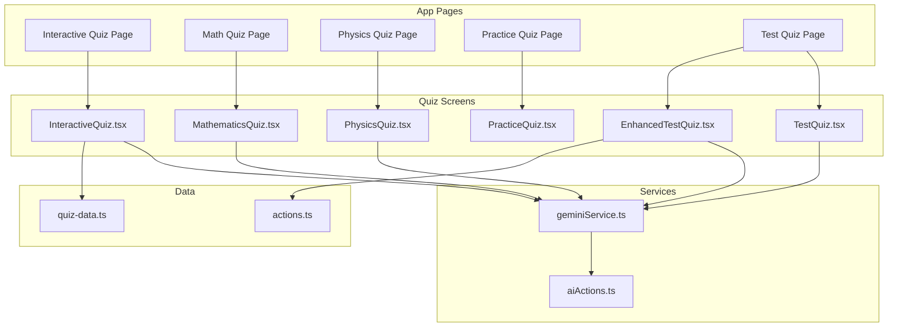
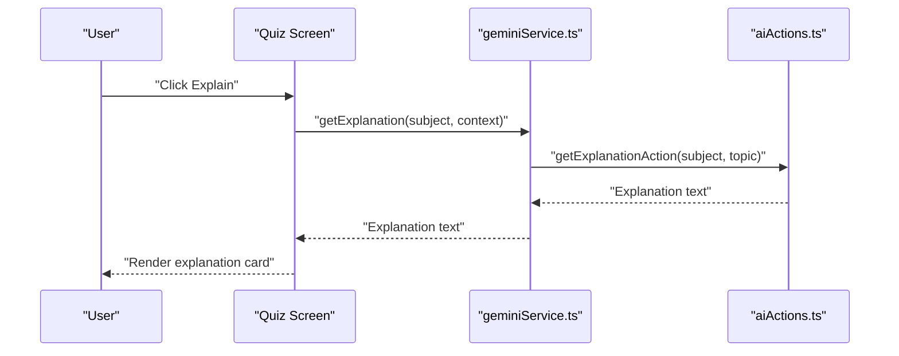
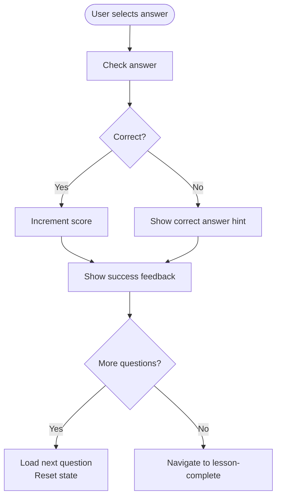
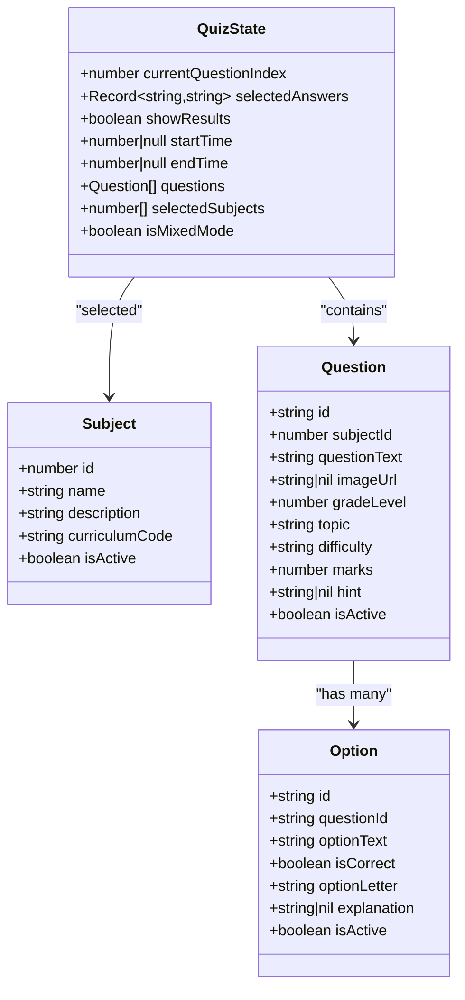
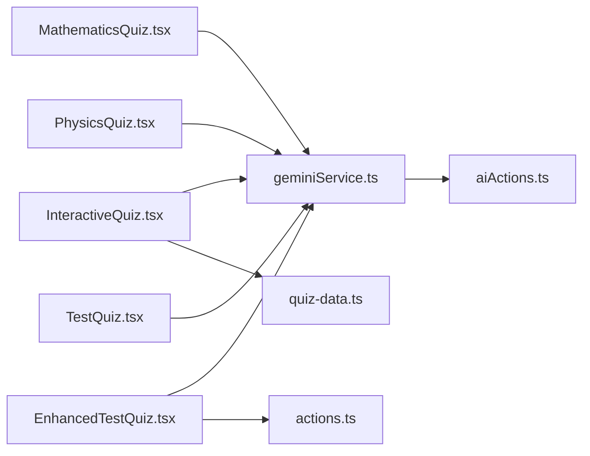

# Quiz Architecture

<cite>
**Referenced Files in This Document**
- [InteractiveQuiz.tsx](file://src/screens/InteractiveQuiz.tsx)
- [MathematicsQuiz.tsx](file://src/screens/MathematicsQuiz.tsx)
- [PhysicsQuiz.tsx](file://src/screens/PhysicsQuiz.tsx)
- [PracticeQuiz.tsx](file://src/screens/PracticeQuiz.tsx)
- [TestQuiz.tsx](file://src/screens/TestQuiz.tsx)
- [EnhancedTestQuiz.tsx](file://src/screens/EnhancedTestQuiz.tsx)
- [page.tsx (Interactive Quiz)](file://src/app/interactive-quiz/page.tsx)
- [page.tsx (Math Quiz)](file://src/app/math-quiz/page.tsx)
- [page.tsx (Physics Quiz)](file://src/app/physics-quiz/page.tsx)
- [page.tsx (Practice Quiz)](file://src/app/practice-quiz/page.tsx)
- [page.tsx (Test Quiz)](file://src/app/test/page.tsx)
- [geminiService.ts](file://src/services/geminiService.ts)
- [aiActions.ts](file://src/services/aiActions.ts)
- [quiz-data.ts](file://src/constants/quiz-data.ts)
- [actions.ts](file://src/lib/db/actions.ts)
- [index.ts (Types)](file://src/types/index.ts)
- [evaluation.ts](file://src/types/evaluation.ts)
</cite>

## Table of Contents
1. [Introduction](#introduction)
2. [Project Structure](#project-structure)
3. [Core Components](#core-components)
4. [Architecture Overview](#architecture-overview)
5. [Detailed Component Analysis](#detailed-component-analysis)
6. [Dependency Analysis](#dependency-analysis)
7. [Performance Considerations](#performance-considerations)
8. [Troubleshooting Guide](#troubleshooting-guide)
9. [Conclusion](#conclusion)

## Introduction
This document explains the MatricMaster AI quiz architecture, focusing on the quiz engine implementation, state management, component lifecycle, user interaction patterns, and AI integration. It covers quiz flow control, answer selection logic, state transitions, progress tracking, scoring, navigation, animations, responsive design, and performance optimization strategies for large datasets.

## Project Structure
The quiz system is organized into:
- Application pages that mount quiz screens
- Quiz screens implementing distinct quiz experiences
- Services for AI explanations
- Data sources for static and dynamic quiz content
- Database action layer for dynamic quiz generation

**Diagram sources**
- [page.tsx (Interactive Quiz)](file://src/app/interactive-quiz/page.tsx#L11-L23)
- [page.tsx (Math Quiz)](file://src/app/math-quiz/page.tsx#L9-L11)
- [page.tsx (Physics Quiz)](file://src/app/physics-quiz/page.tsx#L9-L11)
- [page.tsx (Practice Quiz)](file://src/app/practice-quiz/page.tsx#L9-L11)
- [page.tsx (Test Quiz)](file://src/app/test/page.tsx#L5-L7)
- [InteractiveQuiz.tsx](file://src/screens/InteractiveQuiz.tsx#L105-L458)
- [MathematicsQuiz.tsx](file://src/screens/MathematicsQuiz.tsx#L32-L283)
- [PhysicsQuiz.tsx](file://src/screens/PhysicsQuiz.tsx#L164-L446)
- [PracticeQuiz.tsx](file://src/screens/PracticeQuiz.tsx#L61-L378)
- [TestQuiz.tsx](file://src/screens/TestQuiz.tsx#L208-L455)
- [EnhancedTestQuiz.tsx](file://src/screens/EnhancedTestQuiz.tsx#L113-L846)
- [geminiService.ts](file://src/services/geminiService.ts#L1-L14)
- [aiActions.ts](file://src/services/aiActions.ts#L42-L78)
- [quiz-data.ts](file://src/constants/quiz-data.ts#L23-L313)
- [actions.ts](file://src/lib/db/actions.ts#L192-L388)

**Section sources**
- [page.tsx (Interactive Quiz)](file://src/app/interactive-quiz/page.tsx#L1-L24)
- [page.tsx (Math Quiz)](file://src/app/math-quiz/page.tsx#L1-L12)
- [page.tsx (Physics Quiz)](file://src/app/physics-quiz/page.tsx#L1-L12)
- [page.tsx (Practice Quiz)](file://src/app/practice-quiz/page.tsx#L1-L12)
- [page.tsx (Test Quiz)](file://src/app/test/page.tsx#L1-L8)

## Core Components
- InteractiveQuiz: Multi-subject, multi-paper quiz with AI explanations and subject filtering.
- PhysicsQuiz: Static, single-subject quiz with radio-based answers and hints.
- MathematicsQuiz: Step-based interactive quiz with drag-and-drop solution construction and AI explanations.
- PracticeQuiz: Free-form math input with animated keyboard and symbol sets.
- TestQuiz: Linear, multi-question test with results summary and progress tracking.
- EnhancedTestQuiz: Dynamic, database-backed quiz with mixed-mode selection, AI hints, and timing.

Key shared patterns:
- State-driven UI updates for current question, selected answers, and feedback.
- Conditional rendering for hints, explanations, and result cards.
- Navigation between questions and completion handling.
- Integration with Gemini AI for explanations.

**Section sources**
- [InteractiveQuiz.tsx](file://src/screens/InteractiveQuiz.tsx#L105-L458)
- [PhysicsQuiz.tsx](file://src/screens/PhysicsQuiz.tsx#L164-L446)
- [MathematicsQuiz.tsx](file://src/screens/MathematicsQuiz.tsx#L32-L283)
- [PracticeQuiz.tsx](file://src/screens/PracticeQuiz.tsx#L61-L378)
- [TestQuiz.tsx](file://src/screens/TestQuiz.tsx#L208-L455)
- [EnhancedTestQuiz.tsx](file://src/screens/EnhancedTestQuiz.tsx#L113-L846)

## Architecture Overview
The quiz architecture follows a layered pattern:
- UI Screens: Render quiz content, collect user input, and orchestrate state.
- Services: Provide AI explanation capabilities via Gemini.
- Data Layer: Static quiz data and dynamic database-backed queries.
- Routing: Next.js app-dir pages mount the appropriate quiz screen.

**Diagram sources**
- [InteractiveQuiz.tsx](file://src/screens/InteractiveQuiz.tsx#L154-L170)
- [PhysicsQuiz.tsx](file://src/screens/PhysicsQuiz.tsx#L176-L192)
- [MathematicsQuiz.tsx](file://src/screens/MathematicsQuiz.tsx#L39-L56)
- [EnhancedTestQuiz.tsx](file://src/screens/EnhancedTestQuiz.tsx#L146-L162)
- [geminiService.ts](file://src/services/geminiService.ts#L3-L5)
- [aiActions.ts](file://src/services/aiActions.ts#L42-L78)

## Detailed Component Analysis

### InteractiveQuiz: Multi-paper, Multi-subject Quiz
- State management:
  - Quiz selection via URL parameter and subject filter.
  - Tracks current question index, selected answer, correctness, score, and AI explanation.
- Flow control:
  - Check answer validates selection and toggles result display.
  - Navigate to next question or finish screen.
- AI integration:
  - On-demand explanation retrieval with loading state.
- Rendering:
  - Progress bar, subject pills, question body, options, feedback card, teacher hint, and AI explanation panel.
- Responsive design:
  - Sticky header/footer, scroll areas, and adaptive layouts.

**Diagram sources**
- [InteractiveQuiz.tsx](file://src/screens/InteractiveQuiz.tsx#L174-L192)

**Section sources**
- [InteractiveQuiz.tsx](file://src/screens/InteractiveQuiz.tsx#L105-L458)
- [quiz-data.ts](file://src/constants/quiz-data.ts#L23-L313)

### PhysicsQuiz: Static Single-Subject Quiz
- State:
  - Current question index, selected answer, correctness, score.
- Flow:
  - Check answer and navigate to next or finish.
- UI:
  - Topic badges, hints, and AI explanation toggle.

**Section sources**
- [PhysicsQuiz.tsx](file://src/screens/PhysicsQuiz.tsx#L164-L446)

### MathematicsQuiz: Step-Based Construction
- State:
  - Selected steps array, AI explanation state.
- Interaction:
  - Drag-and-drop selection of solution steps.
- UI:
  - Selected steps area, available steps pool, math symbols toolbar, and explain toggle.

**Section sources**
- [MathematicsQuiz.tsx](file://src/screens/MathematicsQuiz.tsx#L32-L283)

### PracticeQuiz: Free-Form Math Input
- State:
  - Input string and cursor position.
- Interactions:
  - Clickable calculator with categorized symbol sets, keyboard navigation, and delete.
- Animations:
  - Cursor blink with Framer Motion, sheet transitions, and tab switching.

**Section sources**
- [PracticeQuiz.tsx](file://src/screens/PracticeQuiz.tsx#L61-L378)

### TestQuiz: Linear Test with Results
- State:
  - Selected answers map, current question index, and results flag.
- Scoring:
  - Calculates score and grade based on correct answers.
- Navigation:
  - Previous/Next buttons and finish handling.
- Results:
  - Summary screen with correct/incorrect indicators.

**Section sources**
- [TestQuiz.tsx](file://src/screens/TestQuiz.tsx#L208-L455)

### EnhancedTestQuiz: Dynamic, Database-Backed Quiz
- State model:
  - Full quiz state including questions, selected answers, timing, and mode.
- Data:
  - Loads subjects, fetches random questions (single or mixed), and options.
- Flow:
  - Selection → Quiz → Results with time tracking and grading.
- AI:
  - Per-option explanation requests.

**Diagram sources**
- [EnhancedTestQuiz.tsx](file://src/screens/EnhancedTestQuiz.tsx#L72-L81)
- [EnhancedTestQuiz.tsx](file://src/screens/EnhancedTestQuiz.tsx#L35-L70)
- [actions.ts](file://src/lib/db/actions.ts#L192-L388)

**Section sources**
- [EnhancedTestQuiz.tsx](file://src/screens/EnhancedTestQuiz.tsx#L113-L846)
- [actions.ts](file://src/lib/db/actions.ts#L192-L388)

## Dependency Analysis
- UI screens depend on:
  - Shared UI primitives (buttons, cards, radio groups, progress).
  - Gemini service for explanations.
  - Static quiz data or database actions for dynamic content.
- Services:
  - geminiService wraps aiActions, which validate inputs, sanitize, and call the Gemini API.
- Data:
  - Static quiz-data.ts for prebuilt quizzes.
  - actions.ts for database-backed quizzes and random selection.

**Diagram sources**
- [InteractiveQuiz.tsx](file://src/screens/InteractiveQuiz.tsx#L105-L458)
- [MathematicsQuiz.tsx](file://src/screens/MathematicsQuiz.tsx#L32-L283)
- [PhysicsQuiz.tsx](file://src/screens/PhysicsQuiz.tsx#L164-L446)
- [TestQuiz.tsx](file://src/screens/TestQuiz.tsx#L208-L455)
- [EnhancedTestQuiz.tsx](file://src/screens/EnhancedTestQuiz.tsx#L113-L846)
- [geminiService.ts](file://src/services/geminiService.ts#L1-L14)
- [aiActions.ts](file://src/services/aiActions.ts#L42-L78)
- [quiz-data.ts](file://src/constants/quiz-data.ts#L23-L313)
- [actions.ts](file://src/lib/db/actions.ts#L192-L388)

**Section sources**
- [geminiService.ts](file://src/services/geminiService.ts#L1-L14)
- [aiActions.ts](file://src/services/aiActions.ts#L42-L78)
- [quiz-data.ts](file://src/constants/quiz-data.ts#L23-L313)
- [actions.ts](file://src/lib/db/actions.ts#L192-L388)

## Performance Considerations
- State normalization and minimal re-renders:
  - Use memoization for derived values (e.g., progress percentage).
  - Keep selected answers keyed by question ID to avoid unnecessary recomputation.
- Lazy loading and suspense:
  - Interactive quiz page uses Suspense to improve perceived performance.
- Animation optimization:
  - Prefer transform-based animations and avoid layout thrashing.
  - Limit staggered animations to essential elements.
- Data fetching:
  - Batch database calls (e.g., fetch options after questions).
  - Use random ordering on the database side to avoid client-side sorting overhead.
- Memory management:
  - Reset quiz state on exit to prevent accumulation of large arrays.
  - Avoid storing entire question sets in UI state beyond current session.

[No sources needed since this section provides general guidance]

## Troubleshooting Guide
- AI explanation failures:
  - Gemini API key missing or invalid leads to disabled AI features.
  - Network errors are caught and surfaced with user-friendly messages.
- Database connectivity:
  - Database unavailability throws errors; fallback to mock data is handled in actions.
- Input sanitization:
  - Inputs are sanitized to prevent injection; malformed inputs are rejected.

**Section sources**
- [aiActions.ts](file://src/services/aiActions.ts#L22-L32)
- [aiActions.ts](file://src/services/aiActions.ts#L71-L78)
- [actions.ts](file://src/lib/db/actions.ts#L52-L58)
- [actions.ts](file://src/lib/db/actions.ts#L200-L203)

## Conclusion
MatricMaster’s quiz architecture combines static and dynamic content with robust state management, responsive UI, and seamless AI integration. The screens share common patterns for navigation, feedback, and progress tracking while supporting diverse interaction models. Performance and reliability are addressed through careful state handling, lazy loading, and defensive programming around AI and database dependencies.